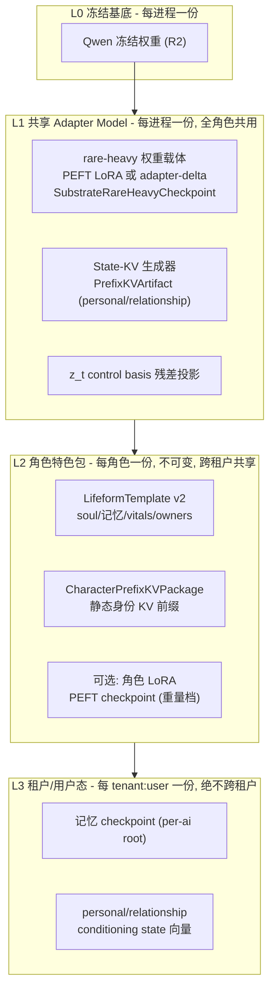
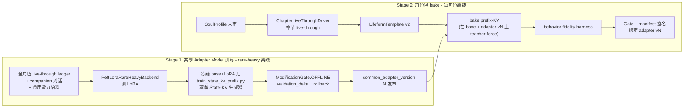

# Adapter Model 与角色特色包：设计 / 训练 / 租户化技术方案

## 决策已定

- **一个共享通用 Adapter Model**：承载数字生命通用能力，所有角色共用；角色差异全部进特色包。
- **transformers 路径为主**：保留 residual hook + State-KV + PEFT 热插全部机制，租户化靠进程内 per-session artifact 热切换，吞吐后置。

## 一、总体架构：三层堆叠



分层原则（对应 R2/R8/R15）：

- **L1 是唯一的"共享权重资产"**，离线训练、`ModificationGate.OFFLINE` 准入、进程启动时加载一次、运行时不可变（`supports_live_substrate_mutation` 已有 raise 保护）。
- **L2 只装角色差异**，全部是不可变 artifact，无运行时写入，可安全被所有租户的 session 共享。
- **L3 是唯一的可变态**，按 `tenant_scope` 隔离，永远不进包。

## 二、两个产物的内容定义

### 共享 Adapter Model（新增统一版本概念 `common_adapter_version`）

由三个已有机制组成，打包成一个带版本号的 bundle：

- **rare-heavy 权重载体**：优先用 `PeftLoraRareHeavyBackend`（真 PEFT LoRA，Qwen 需把 `target_modules` 从 `c_attn` 换成 `q_proj/v_proj/o_proj`），fallback 为现有 adapter-delta 向量。承载通用对话/关系/状态跟随能力。
- **State-KV 生成器**：现有 `PrefixKVArtifact`（personal + relationship 两个 carrier），把 16 维 conditioning state 向量映射成每层 KV 前缀。**生成器是共享的，输入的 state 向量是 L3 租户态**——这正是"共享模型 + 私有状态"的关键切分。
- **z_t control basis**：现有残差干预投影，属于通用控制能力。

关键新契约：bundle 有 `common_adapter_version` + `compatibility_fingerprint`（绑定 base model），是 L2 角色包的兼容性锚点。

### 角色特色包（新增 `CharacterPackageManifest` 统一封装）

现状是三件散装 artifact（template / prefix package / 未接线的 residual adapter package），方案将其收敛为一个 manifest：

```
CharacterPackageManifest v1
├── character_id / character_name
├── base_model_id + common_adapter_version   ← 新增：双指纹
├── template_ref        (LifeformTemplate v2, 必选)
├── prefix_kv_ref       (CharacterPrefixKVPackage, 推荐)
├── lora_ref            (PEFT checkpoint dir, 可选重量档)
├── fidelity_evidence   (behavior fidelity 结果 digest, ACTIVE 必需)
├── gate_record         (ModificationGate 决议 + rollback_evidence)
└── package_id = SHA-256(canonical payload)
```

- 三档载体是递进关系：**template（语义/记忆层）→ prefix-KV（表达层轻量 conditioning）→ 角色 LoRA（表达层重量档，仅高价值角色）**。
- 现有孤儿 schema `CharacterResidualAdapterPackage`（有 schema 无接线）**废弃**，不再做第四载体——prefix-KV + 可选 LoRA 已覆盖表达层需求，避免多一条无证据链的注入通道。

## 三、训练管线



三条硬规则：

1. **训练顺序不可倒**：State-KV 生成器和角色 prefix-KV 都必须在"base + 共享 adapter vN 已激活"的前向上蒸馏（否则 adapter 一换 KV 前缀就漂移）。现有 `scripts/bake_zhang_wuji_character_package.py` 只对冻结 base bake，需升级为可挂 adapter 后 bake。
2. **共享 adapter 升级 = 角色包批量再验证**：manifest 双指纹使得 adapter vN→vN+1 时，所有角色包要么重跑 fidelity 验证（通过则改指纹重签），要么重 bake prefix-KV。这是 R15 可回滚的代价，必须在契约上显式化。
3. **数据流向单向**：角色语料可以进 Stage 1 的通用训练集（帮通用能力泛化），但 Stage 1 产物不含任何单一角色身份——身份保真只由 Stage 2 的 fidelity harness 度量。

## 四、租户化（transformers 进程内热切换）

### 运行时装配矩阵

| 资产 | 粒度 | 加载时机 | 切换机制 |
|---|---|---|---|
| 冻结 base | 进程 | 启动 | 不切换（换 base = 换进程） |
| 共享 adapter | 进程 | 启动，gate 后 import | 不在线切换，回滚 = `restore_rare_heavy_state` |
| 角色 template | session | `POST /v1/sessions` | 已有：`give_birth` per session |
| 角色 prefix-KV | session→每次生成 | 包注册表懒加载 | **新增**：`character_id → package` 注册表，per-generation 选择注入 |
| 角色 LoRA | 每次生成 | `PersonaLoRAPool` 懒加载 | 已有：`activate_peft_adapter` 上下文管理器，需按 session 的 character_id 路由 |
| 租户记忆/conditioning | tenant:user | session 建立 | 已有：`tenant_scope` / `VZ_PER_AI_MEMORY_ROOT` |

### 需要新建的机制（现状缺口）

1. **Prefix-KV 从进程级单包改为注册表**：现在 `build_qwen_runtime_loader` 固定一个 `CharacterPrefixKVPackage`；改为 substrate 持有 `character_id → package` 只读注册表，生成时按 session 携带的 character_id 拼 `DynamicCache`。多角色包同驻内存成本极低（每包仅几层 K/V slots）。
2. **ACTIVE 质量门强制执行**：spec 要求 active 注入需 held-out 行为门通过，代码现在 `ZHANG_WUJI_CHARACTER_PREFIX_MODE=active` 直接注入。改为：注册表加载时校验 manifest 的 `fidelity_evidence` + `gate_record`，缺失则强制降级 shadow 并 fail loudly 记录。
3. **会话装配入口统一**：`POST /v1/sessions` 增加 `character_id`（或复用 template_id 反查 manifest），SessionManager 据此绑定三档载体；同一进程内不同 session 可以是不同角色。

### 隔离不变量

- 角色包不可变 → 跨租户共享安全；租户轴只隔离 L3（记忆 + conditioning state），复用现有 `ConditioningScope.tenant_scope` 非空强制。
- 同一快照链只有一个写入者：角色包 owner 是离线 bake 管线，运行时只读。

## 五、实施收敛包（每包 3-8 文件，独立可回滚）

1. **契约与 manifest**（owner: lifeform-domain-character）：`CharacterPackageManifest` frozen dataclass + 校验 + `docs/DATA_CONTRACT.md` 登记 + 更新 [docs/specs/character-prefix-package.md](docs/specs/character-prefix-package.md)；同包内标记废弃 `CharacterResidualAdapterPackage`。
2. **substrate 多角色路由**（owner: vz-substrate）：[prefix_kv_artifact.py](packages/vz-substrate/src/volvence_zero/substrate/prefix_kv_artifact.py) 加注册表；[residual_backend.py](packages/vz-substrate/src/volvence_zero/substrate/residual_backend.py) 的 `_generate_with_prefix` 支持 per-call character 包选择；compatibility 校验扩展到 `common_adapter_version`。先 SHADOW（注册表路径与现有单包路径并跑比对）再 ACTIVE。
3. **服务层租户接线**（owner: lifeform-service）：[verticals.py](packages/lifeform-service/src/lifeform_service/verticals.py) / session manager 按 character_id 装配；ACTIVE 门强制；`start_browser_chat_zhang_wuji.sh` 迁移到 manifest 路径。
4. **共享 adapter 训练管线**（owner: vz-substrate rare-heavy）：训练入口脚本封装 `PeftLoraRareHeavyBackend`（Qwen target_modules）+ State-KV 生成器蒸馏顺序 + gate 提案产出 + versioned bundle 导出。
5. **角色包 bake 升级**（owner: lifeform-domain-character）：bake 脚本支持"base + adapter vN"前向、manifest 签名、fidelity evidence 绑定；adapter 升级时的批量再验证脚本。

包 1→3 是租户化主线（先跑通多角色热切换），包 4→5 是训练主线（可并行推进）；两条线交汇于 manifest 的双指纹契约。

## 六、风险与开放项

- **共享 adapter 与角色 LoRA 同时激活的干扰**：真 PEFT 路径下两者都改 attention 线性层，需在包 5 的 fidelity harness 中加"adapter+LoRA 叠加"消融臂，证据先行再放开重量档。
- **吞吐**：transformers 路径 per-session PEFT 热插有上下文切换成本；近期靠 `peft_adapter_cache` 缓解，vLLM 迁移作为后置里程碑不进本方案。
- **adapter 升级节奏**：每次升级触发全角色再验证，角色数量大后成本线性增长——manifest 里预留 `revalidation_mode`（full-rebake / fidelity-only）字段控制成本。
