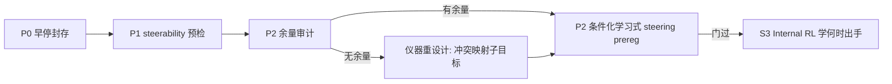

# B screen 早停收官 + 条件化学习式 steering 转向

## 判断（已核实）

- **可以去另一个 IDE 停掉**：`assess_faithful_eta_screen`（[eta_faithful_rewrite_screen.py](packages/vz-runtime/src/volvence_zero/agent/eta_faithful_rewrite_screen.py) L549-609）要求五条件全过；primary α=0.3 seed-0 的 `permuted_z_penalty=0.0` 使 `min_seed_positive_fraction=1.0` 永不可满足，F1=0/contrast≈0 且全 cell `hard_switch_frequency=0`。剩余 3 cell（约 4-5h）无法改变 FAIL。
- **正面资产**：三 cell `zero_z_penalty≈0.175`（门槛 8.7 倍）——学习式 rank-8 乘性写入有真实因果作用（distortion 0.178→0.003），静态 S2 做不到的事学习式做到了，与 [research](research/steering-2026-08/02_VZ_IMPLICATIONS.md) 的 ReFT/排序预测一致。
- **根因定性**：恒定 z 的低秩算子已打满任务（无余量），ETA 的时间切换在子目标已线性表征的基底上是冗余通道。

## P0 · 早停封存（用户停运行后执行）

- 写早停判定 note 进 `artifacts/eta_faithful_rewrite_screen_20260804/`：锁死 FAIL 的数学依据 + zero-z 正面发现 + 3 个 checkpoint 的 sha 清单；不改写已封存 kill-eta。
- SSOT 同步：[stage3.md](.cursor/plans/stage3.md) B 分支收官（双重结论）、`docs/specs/temporal-abstraction.md` changelog、`docs/specs/evidence_program.md` claim 行、`research/eta/eta-segment-credit-evidence-plan.zh.md` 追加。

## P1 · 只读 steerability 预检（便宜，分钟级）

按 research §3.1 跑 Braun 指标（子目标轴的激活差方向一致性 + d′ + 反向样本比例），用 S1 已有 heldout 前缀与激活，把 S2-static null 的解释权钉死。产出一页判读入 research 目录。

## P2 · 余量审计 → 新 screen 预注册（核心转向）

1. **余量审计**（只读）：用 B screen 已训好的恒定算子扫 heldout，找恒定算子失败的段/位置（模糊前缀、揭示前、冲突映射）。若整个 surrogate 无余量 → 仪器需重设计（子目标间冲突映射，使恒定算子不可能同时打满）。
2. **新 prereg：conditional learned steering screen（CAST×ReFT 混合）**
   - 传感器：冻结 S1 probe readout 当 condition（不回灌）
   - 执行器：B screen 同款 rank-8 乘性写入（重新初始化、无 free bias、zero-code no-op）
   - 门控：显式小动作空间（noop / 施加 / 档位），不再经 rate/KL 涌现
   - 判定门：matched budget 下 boundary-gated > always-on、> random-gate、> noop（heldout，CI 不跨 0）——只有在有余量的仪器上此门才有意义
3. 通过 → 解锁 S3 Internal RL（PE 门控 + 段信用，训练目标参考 RePS 偏好式 / PPO）。

## 不做的事

- 不改写已封存的 `kill-eta` 与 S2 FAIL；不动 production WiringLevel；不回灌 evaluation。
- 不在无余量的仪器上跑"何时出手"实验（那只会再产出一次不可解释的 null）。