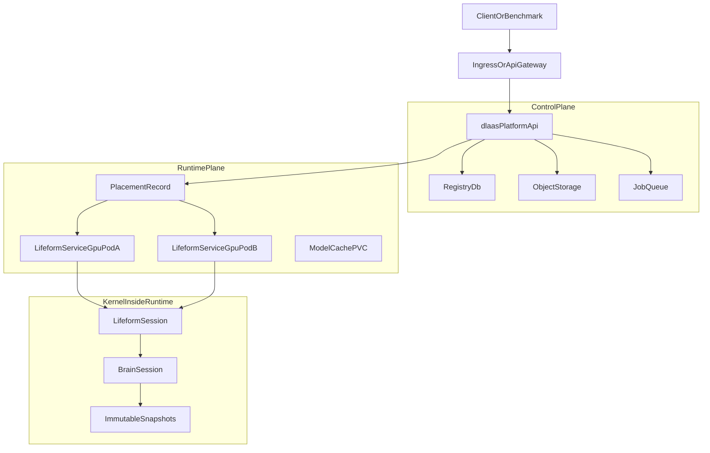

# Clean DLaaS + VZ Deployment Plan In VolvenceDeploy

## Goal
Complete deployment work in the separate deploy repository:

`D:\GitHub\VolvenceDeploy`

`VolvenceDeploy` owns deployment composition only. It consumes the source/product repo through the pinned submodule:

`D:\GitHub\VolvenceDeploy\external\VolvenceZero`

The deployment repo should contain Dockerfiles, Kubernetes manifests, overlays, scripts, infrastructure notes, and runbooks. It must not copy `vz-*`, `lifeform-*`, or `dlaas-platform-*` source packages out of the submodule.

## SSOT Boundary
Keep this boundary explicit in every deliverable:

- `external/VolvenceZero` is the code and contract SSOT: `vz-*`, `lifeform-*`, `dlaas-platform-*`, specs, package tests, Companion Bench entry scripts.
- `VolvenceDeploy` is the deployment SSOT: image build context, K8s objects, environment overlays, secret references, storage, routing, rollout, rollback, and recovery.
- `dlaas-platform-*` owns control-plane state: tenant, contract, ai_id, placement, lifecycle, ops, audit, quota, billing.
- `lifeform-service` owns live `SessionManager` and runtime process behavior.
- `vz-*` owns cognition, memory, temporal control, immutable snapshots, and learning state.
- Deployment code must not import kernel internals or reconstruct owner state.

Primary source references through the submodule:

- [external/VolvenceZero/docs/specs/dlaas-platform.md](D:/GitHub/VolvenceDeploy/external/VolvenceZero/docs/specs/dlaas-platform.md)
- [external/VolvenceZero/docs/specs/dlaas-api-v1.md](D:/GitHub/VolvenceDeploy/external/VolvenceZero/docs/specs/dlaas-api-v1.md)
- [external/VolvenceZero/docs/SYSTEM_DESIGN.md](D:/GitHub/VolvenceDeploy/external/VolvenceZero/docs/SYSTEM_DESIGN.md)
- [external/VolvenceZero/packages/dlaas-platform-api/src/dlaas_platform_api/app.py](D:/GitHub/VolvenceDeploy/external/VolvenceZero/packages/dlaas-platform-api/src/dlaas_platform_api/app.py)
- [external/VolvenceZero/packages/dlaas-platform-launcher/src/dlaas_platform_launcher/instance_manager.py](D:/GitHub/VolvenceDeploy/external/VolvenceZero/packages/dlaas-platform-launcher/src/dlaas_platform_launcher/instance_manager.py)
- [external/VolvenceZero/packages/lifeform-service/src/lifeform_service/session_manager.py](D:/GitHub/VolvenceDeploy/external/VolvenceZero/packages/lifeform-service/src/lifeform_service/session_manager.py)

## Target Repository Layout
Build out this structure under `D:\GitHub\VolvenceDeploy`:

- `docs/deployment/architecture.md` — SSOT ownership, planes, runtime affinity, rollout phases.
- `docs/deployment/routing.md` — `ai_id -> runtime` placement, session affinity, OpenAI metadata routing.
- `docs/deployment/persistence-recovery.md` — owner hydration, sleep/wake, pod loss, data export/delete.
- `docs/deployment/security-ops.md` — auth, secrets, audit, quota, observability, cost controls.
- `docker/lifeform-service/Dockerfile` — image for benchmark/runtime pods built from `external/VolvenceZero`.
- `docker/dlaas-platform/Dockerfile` — image for full DLaaS API pods built from `external/VolvenceZero`.
- `k8s/base/lifeform-service/` — benchmark single-runtime base.
- `k8s/base/dlaas-platform/` — DLaaS API, registry, services, config base.
- `k8s/base/runtime-pool/` — GPU runtime pool base.
- `k8s/overlays/benchmark/` — single endpoint for `/v1/chat/completions`.
- `k8s/overlays/dev/` — DLaaS single-stack smoke with SQLite or dev Postgres.
- `k8s/overlays/staging/` — Postgres/object store/queue references, sticky routing enabled.
- `k8s/overlays/prod/` — production-grade placeholders and strict secret references.
- `scripts/smoke-openai.ps1` and `scripts/smoke-openai.sh` — health and `/v1/chat/completions` smoke.
- `scripts/smoke-dlaas.ps1` and `scripts/smoke-dlaas.sh` — adoption and native interaction smoke.
- `runbooks/benchmark.md` — benchmark deployment and Companion Bench run.
- `runbooks/dlaas-pilot.md` — single-stack DLaaS pilot.
- `runbooks/recovery.md` — runtime pod restart, owner hydration, rollback.
- `runbooks/submodule-update.md` — safely update `external/VolvenceZero` pointer.

## Cluster Shape
Use a three-plane deployment model.

## Implementation Phases

### Phase 0: Repository Completion And Guardrails
Purpose: make `VolvenceDeploy` usable as the deployment SSOT.

Deliver in `VolvenceDeploy`:

- Expand `README.md` with clone, submodule, image build, and smoke commands.
- Expand `docs/deployment-ssot.md` or move it into `docs/deployment/architecture.md`.
- Add `runbooks/submodule-update.md`.
- Add a `Makefile` or PowerShell-friendly `scripts/tasks.ps1` with read-only/status helpers.
- Add `.env.example` with non-secret variable names only.

Acceptance:

- `git submodule status` shows `external/VolvenceZero` pinned.
- Docs state that source packages must not be copied into deploy repo.
- All environment-specific secrets are references, not committed values.

### Phase 1: Benchmark Single Runtime
Purpose: deploy the simplest stable OpenAI-compatible endpoint for Companion Bench and EQ-style benchmarks.

Deliver in `VolvenceDeploy`:

- `docker/lifeform-service/Dockerfile`
  - Build from `external/VolvenceZero`.
  - Install required wheels for `lifeform-serve`, `lifeform-domain-emogpt`, `lifeform-openai-compat`, and dependencies.
  - Default command uses `lifeform-serve`.
- `k8s/base/lifeform-service/`
  - `deployment.yaml`
  - `service.yaml`
  - `configmap.yaml`
  - `secret.example.yaml`
  - `kustomization.yaml`
- `k8s/overlays/benchmark/`
  - Pin `VERTICAL=companion`.
  - Start with `SUBSTRATE_MODE=synthetic` for cheap smoke.
  - Include commented `hf-shared` values for Qwen-backed run.
- `scripts/smoke-openai.ps1` and `scripts/smoke-openai.sh`
  - Check `/v1/health`.
  - POST `/v1/chat/completions` with bearer auth.
- `runbooks/benchmark.md`
  - How to deploy.
  - How to run Companion Bench using the manifest in `external/VolvenceZero/scripts/companion_bench/vz_companion_eq_submission.yaml`.

Acceptance:

- A single pod serves `/v1/health`.
- `/v1/chat/completions` accepts `Authorization: Bearer $LIFEFORM_LOCAL_API_KEY`.
- Companion Bench F1 smoke can target the service.
- No DLaaS metadata is required.

### Phase 2: DLaaS Single-Stack Smoke
Purpose: validate DLaaS API shape without distributed placement complexity.

Deliver in `VolvenceDeploy`:

- `docker/dlaas-platform/Dockerfile`
  - Build from `external/VolvenceZero`.
  - Install `dlaas-platform-*`, `lifeform-service`, vertical packages, and OpenAI compat.
  - Provide an entrypoint script that starts an aiohttp app using `build_dlaas_app(...)`.
- `docker/dlaas-platform/entrypoint.py`
  - Read `DLAAS_DB_PATH`, `DLAAS_CONTROL_PLANE_SECRET`, `DLAAS_SERVICE_SECRET`.
  - Build `create_lifeform_app`/`build_dlaas_app` using public package APIs only.
- `k8s/base/dlaas-platform/`
  - API deployment.
  - Service.
  - ConfigMap.
  - Secret example.
  - Optional PVC for SQLite dev mode.
- `k8s/overlays/dev/`
  - One DLaaS API pod.
  - SQLite or local Postgres.
  - Synthetic substrate.
- `scripts/smoke-dlaas.ps1` and `scripts/smoke-dlaas.sh`
  - Create/adopt one `ai_id`.
  - Send native `/dlaas/v1/instances/{ai_id}/interactions`.
  - Send OpenAI `/v1/chat/completions` with `metadata["dlaas.ai_id"]`.

Acceptance:

- `POST /dlaas/v1/adoptions` persists a contract.
- Native interaction dispatches by typed `InteractionEnvelope.interaction_type`.
- OpenAI metadata routes to the adopted `ai_id`.
- Wake/sleep/status are platform lifecycle reads, not cognitive owner writes.

### Phase 3: Registry Production Boundary
Purpose: keep registry SSOT clean while moving from dev SQLite to production Postgres.

Deliver in `VolvenceDeploy`:

- `docs/deployment/registry.md`
  - Dev: SQLite is acceptable for single-pod smoke only.
  - Staging/prod: Postgres is required for multi-pod control plane.
  - Registry stores typed control-plane records and object URIs, not cognitive owner state.
- `k8s/base/postgres/` or documented external managed Postgres reference.
- `k8s/overlays/staging/registry-values.example.yaml`.
- Migration notes: current `external/VolvenceZero/packages/dlaas-platform-registry/src/dlaas_platform_registry/db.py` is SQLite-backed; production must either add a Postgres adapter upstream or run a single-writer registry until that adapter lands.

Acceptance:

- No per-pod SQLite in multi-pod overlays.
- Registry credentials are secret references only.
- Plan clearly identifies any upstream code required for a true Postgres adapter.

### Phase 4: Placement And Sticky Routing
Purpose: scale without treating stateful VZ runtime as stateless chat API.

Deliver in `VolvenceDeploy`:

- `docs/deployment/routing.md`
  - `ai_id` is primary routing key.
  - `session_id` is conversation continuity inside the selected runtime.
  - OpenAI path uses optional `metadata["dlaas.ai_id"]`.
  - Native path uses `{ai_id}`.
  - No natural-language routing, no model-name routing.
- `k8s/base/runtime-pool/`
  - Runtime pool service templates.
  - Labels for `runtime_pool_id`, `vertical`, `substrate_profile`.
- `k8s/overlays/staging/`
  - Example `companion-qwen7b` pool.
  - Example `companion-synthetic` pool.
- Placement design options:
  - MVP: route all traffic for one `ai_id` to one runtime pod by gateway sticky rule.
  - Next: platform placement record `ai_id -> runtime_pool_id -> runtime_pod_id`.
  - Later: controlled migration with sleep, persist, release, wake, hydrate.

Acceptance:

- Docs explicitly reject random round-robin for `/v1/chat/completions`.
- Runtime service labels and routing notes show how to pin `ai_id`.
- Migration requires sleep/persist before moving `ai_id`.

### Phase 5: Runtime Pools And Efficiency
Purpose: use GPU resources efficiently without violating ownership.

Deliver in `VolvenceDeploy`:

- `docs/deployment/runtime-pools.md`
  - Pool definitions:
    - `companion-synthetic` for smoke.
    - `companion-qwen7b` for benchmark/pilot.
    - `growth-advisor-qwen` for future vertical-specific deployment.
    - `raw-substrate` only for ablation.
  - One shared frozen substrate per GPU pod.
  - Warm vs cold tenant policy.
  - Autoscaling signals: active ai_id count, session count, GPU memory, tokens/sec, queued wake requests.
- K8s examples:
  - GPU node selectors/tolerations.
  - model cache PVC or node-local cache.
  - resource requests/limits.

Acceptance:

- GPU pods are grouped by substrate profile and vertical policy.
- Benchmark and production overlays do not share accidental mutable runtime state.
- Cost controls are documented before autoscaling.

### Phase 6: Persistence, Recovery, Export, Delete
Purpose: make runtime loss and governance operations operationally safe.

Deliver in `VolvenceDeploy`:

- `docs/deployment/persistence-recovery.md`
  - Owner hydration path is the only durable cognitive recovery route.
  - Platform registry stores lifecycle and placement, not reconstructed memory.
  - Runtime persistence scope includes tenant, ai_id, end_user/session identity.
  - Sleep/release calls public lifecycle paths before moving/releasing instances.
  - Pod loss marks instances `RECOVERING` or `ASLEEP`.
- `runbooks/recovery.md`
  - Runtime pod restart.
  - Model cache warmup.
  - ai_id recovery.
  - rollback to previous image/submodule pointer.
- `runbooks/data-governance.md`
  - Export platform records.
  - Export runtime-owned scopes through public paths.
  - Delete platform records and runtime persistence scopes.

Acceptance:

- Recovery runbook does not mention direct owner mutation.
- Data deletion covers both platform registry and runtime persistence scope.
- Hydration failure is fail-loud and blocks serving the affected ai_id.

### Phase 7: Ops, Security, Observability
Purpose: make the cluster operable.

Deliver in `VolvenceDeploy`:

- `docs/deployment/security-ops.md`
  - TLS at gateway.
  - Bearer auth for OpenAI-compatible route.
  - Tenant auth for DLaaS control plane.
  - Service secret for internal operations.
  - Secret manager references.
  - Quotas and rate limits by tenant, ai_id, and substrate profile.
  - Audit events for adoption, wake/sleep, asset intake, protocol approval, data export/delete, handoff, eval promotion.
- `k8s/base/observability/README.md`
  - Metrics to expose.
  - Logs to collect.
  - Trace correlation keys: tenant_id, ai_id, session_id, request_id.
- `runbooks/incident.md`
  - Disable tenant.
  - Pause ai_id.
  - Roll back runtime image.
  - Rotate secrets.

Acceptance:

- No committed secret values.
- Every external route has an auth story.
- Every critical operation has an audit event target.

### Phase 8: Acceptance And CI Smoke
Purpose: prevent deployment drift.

Deliver in `VolvenceDeploy`:

- `scripts/verify-submodule.ps1` and `.sh`
  - Print submodule commit.
  - Verify expected files exist under `external/VolvenceZero`.
- `scripts/smoke-openai.*`
  - Health check.
  - OpenAI chat completion check.
- `scripts/smoke-dlaas.*`
  - DLaaS adoption and interaction check.
- `scripts/smoke-routing.*`
  - Send repeated requests for same `ai_id`/`session_id` and verify sticky target evidence where available.
- `runbooks/release-checklist.md`
  - Build image from pinned submodule.
  - Deploy benchmark overlay.
  - Deploy DLaaS dev overlay.
  - Run smoke scripts.
  - Record image tag and submodule commit.

Acceptance:

- A fresh clone with `--recurse-submodules` can build/deploy benchmark overlay.
- Smoke scripts do not require editing source packages.
- Release checklist records submodule commit and image tags.

## Implementation Order

1. Update `VolvenceDeploy` docs into the final deployment SSOT structure.
2. Add benchmark Dockerfile, K8s base, benchmark overlay, and OpenAI smoke scripts.
3. Add DLaaS single-stack Dockerfile, entrypoint, K8s base, dev overlay, and DLaaS smoke scripts.
4. Add registry production boundary docs and staging placeholders.
5. Add placement/routing docs and runtime pool K8s skeleton.
6. Add persistence/recovery/data-governance runbooks.
7. Add security/ops/observability docs and skeleton manifests.
8. Add release checklist and submodule verification scripts.
9. Commit in `VolvenceDeploy` only; update `external/VolvenceZero` submodule pointer deliberately when source changes are needed.

## Non-Goals For This Plan

- Do not modify `vz-*` kernel packages from the deploy repo.
- Do not copy package source out of `external/VolvenceZero`.
- Do not store secrets in git.
- Do not implement a production Postgres registry adapter inside `VolvenceDeploy`; if code changes are required, they belong upstream in `VolvenceZero`.
- Do not enable random load balancing for stateful runtime traffic.

## Cluster Phases

### Phase 0: Benchmark-Safe Single Runtime
Purpose: stable public benchmark and demo.

- Run one `lifeform-service` pod with `--enable-openai-compat`.
- Use `--vertical companion` and `--substrate-mode hf-shared` for real model runs.
- Expose only `/v1/chat/completions` through gateway.
- Route all benchmark traffic to this single pod.
- Use [scripts/companion_bench/vz_companion_eq_submission.yaml](scripts/companion_bench/vz_companion_eq_submission.yaml) for Companion Bench.

Acceptance:

- `/v1/health` passes.
- `/v1/chat/completions` accepts bearer auth.
- Companion Bench F1 smoke passes.
- No DLaaS metadata required.

### Phase 1: Single-Process DLaaS Full Stack
Purpose: validate API shape without distributed placement complexity.

- Run one `dlaas-platform-api` app via `build_dlaas_app(...)`.
- Use persistent SQLite or local Postgres for registry.
- Attach one in-process `InstanceManager`.
- Adopt a small number of `ai_id`s.
- Keep all traffic on one pod.

Acceptance:

- `POST /dlaas/v1/adoptions` creates contract state.
- `POST /dlaas/v1/instances/{ai_id}/interactions` routes through typed `InteractionEnvelope`.
- OpenAI metadata `metadata["dlaas.ai_id"]` routes to the adopted instance.
- Wake/sleep/status read platform lifecycle state, not cognitive state.

### Phase 2: Multi-Pod Runtime Pool With Sticky Placement
Purpose: efficient GPU use without violating state ownership.

- Split CPU control plane from GPU runtime plane.
- Keep `dlaas-platform-api` stateless except for registry/object-store/queue dependencies.
- Add a placement record in platform registry: `ai_id -> runtime_pool_id -> runtime_pod_id`.
- Route by `metadata["dlaas.ai_id"]` first, then `session_id` inside that runtime.
- Use gateway or platform proxy for sticky routing. Avoid round-robin to GPU pods.
- Keep one shared frozen substrate per GPU pod.

Acceptance:

- Same `ai_id` always reaches the same runtime owner while awake.
- Runtime pod restart marks affected instances `ASLEEP` or `RECOVERING` and requires hydrate/wake before traffic resumes.
- No platform component reads or rebuilds owner internals.

### Phase 3: Durable Runtime Recovery
Purpose: make pod loss recoverable.

- Configure memory/owner persistence backend for each runtime pod.
- Scope persistence keys by tenant, ai_id, and end_user/session identity.
- On sleep/release, call public scene/session closure paths so owners export snapshots.
- On wake, hydrate through existing owner hydration APIs.
- Keep placement and lifecycle in platform registry; keep cognitive durable state in the runtime persistence backend.

Acceptance:

- Kill/restart runtime pod and recover an ai_id without cross-user memory leakage.
- Owner hydration failures fail loudly and mark instance unhealthy.
- Data deletion covers both platform records and runtime persistence scopes.

### Phase 4: Background Work And Cost Efficiency
Purpose: scale ingestion/eval/training separately from chat latency.

- Move asset parsing, protocol review, eval runs, launch license checks, and rare-heavy artifact jobs to workers.
- Use queue-backed jobs with idempotent job ids.
- Keep online chat path fast: chat pod only handles turns and lightweight owner updates.
- Batch slow jobs by tenant/model/profile to improve GPU or API efficiency.
- Rate-limit per tenant and per substrate profile.

Acceptance:

- Chat p95 latency is not affected by PDF ingestion or eval jobs.
- Training candidates never mutate the online base model directly.
- Promotion requires explicit gate artifacts.

## Runtime Pool Strategy
Use separate pools rather than one mixed fleet:

- `companion-small`: synthetic or small local model, cheap smoke/dev.
- `companion-qwen7b`: one Qwen 7B per GPU pod for benchmark and pilot users.
- `growth-advisor-qwen`: separate pool because vertical/profile data and ops policy differ.
- `raw-substrate`: optional ablation pool for `?mode=raw`, not user-facing default.

Efficiency rules:

- One shared frozen substrate per GPU pod.
- Many `ai_id`s per pod only when memory pressure allows.
- Autoscale control-plane pods freely; autoscale GPU runtime pods by active ai_id count, queued wake requests, GPU memory, and tokens/sec.
- Prefer warm pools for paid/active tenants; cold wake for long-tail tenants.

## Routing Contract
Request routing should be explicit:

- OpenAI-compatible route:
  - If `metadata["dlaas.ai_id"]` exists, route through platform placement.
  - Else route to the legacy default `lifeform-service` endpoint for benchmark/simple use.
- Native DLaaS route:
  - Path `{ai_id}` is authoritative.
  - `InteractionEnvelope.interaction_type` is authoritative dispatch key.
  - `session_id` is authoritative for conversation continuity within the ai_id.

Never route by natural-language content, model display name, or prompt keywords.

## Production Infra Components
Implement or document manifests for:

- `dlaas-platform-api` Deployment, CPU, horizontal autoscaling.
- `lifeform-service` GPU StatefulSet or Deployment with stable pod identity.
- Postgres for registry SSOT.
- S3/MinIO for assets, evidence bundles, export jobs, and model-independent artifacts.
- Redis/NATS/RabbitMQ for async jobs and wake queues.
- PVC or node-local cache for HF/Qwen model weights.
- Secret manager for `LIFEFORM_LOCAL_API_KEY`, tenant secrets, provider API keys, and service secrets.
- Observability stack for logs, metrics, traces, audit, and per-ai_id health.

## Security And Governance
Add deployment gates:

- TLS at gateway.
- Bearer auth for OpenAI-compatible route.
- Tenant auth for DLaaS control plane.
- Service secret for internal launcher/runtime operations.
- Per-tenant quotas and rate limits.
- Audit events for adoption, wake/sleep, asset intake, protocol approval, data export/delete, handoff, and eval promotion.
- No raw snapshot export except admin-gated paths.

## Deliverables

1. A deployment architecture document under `docs/deployment/` describing SSOT ownership, runtime placement, persistence, and scaling.
2. A dev compose profile for local smoke: API, SQLite/Postgres, one synthetic runtime.
3. A Kubernetes base manifest set for single runtime benchmark deployment.
4. A Kubernetes production overlay for DLaaS control plane plus GPU runtime pools.
5. A placement/routing spec for `ai_id -> runtime pod` affinity.
6. A persistence/recovery spec covering owner hydration and data deletion.
7. A runbook for benchmark mode, pilot mode, recovery, scaling, and cost controls.
8. Acceptance tests or smoke scripts that prove routing, auth, persistence, and benchmark entry work.

## Implementation Order

1. Document the deployment SSOT contract first.
2. Add single-runtime Kubernetes manifests for benchmark deployment.
3. Add DLaaS single-pod full-stack deployment for API validation.
4. Add Postgres-backed registry adapter or production DB configuration boundary.
5. Add placement table/API and sticky routing behavior.
6. Add runtime pool manifests and warm/cold lifecycle operations.
7. Add persistence and recovery runbooks.
8. Add observability, quota, and cost dashboards.
9. Promote from SHADOW to ACTIVE only after rollback, hydration, deletion, and multi-tenant isolation tests pass.