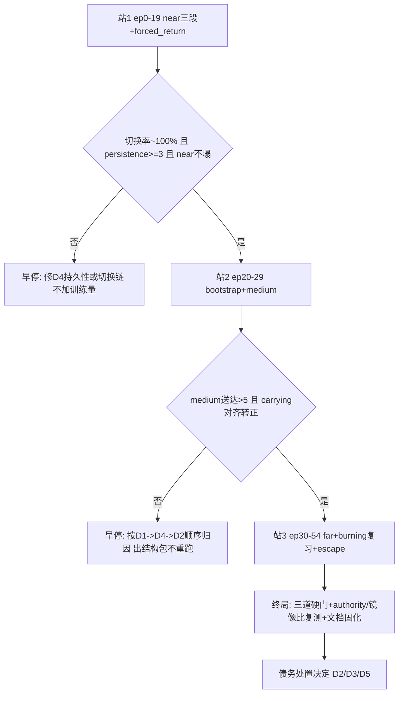

# Ecology v31：medium 闭环验证与已知债务清偿

## 背景

medium 十几个版本钉死在 2 拾取 / 0 送达，根因是四层叠加，每层都已带实证修复：

1. **base 非定向退化解**（统一转大圈收割信用）→ exclusive steering 结构性隔离，残余基线 0.147 → 0.0105
2. **β 门泄漏**掩盖学习信号 → 修后 v24 medium 首次松动到 11 拾取 / 2 送达
3. **head 内部镜像对称解**（73–89% 输出可证明非定向）→ 镜像等变按构造删除整个解空间
4. **拾取不关段**，carrying credit 混回 outbound 段 → 类型化里程碑边界（`EnvironmentMeasurement.discrete_milestone` → `environment_milestone_temporal_switch`），v30 只读反事实验证 8/8 lane 在拾取后第 2 个 action 切段

PE 幅值边界已被实测**证伪**（分离裕度 −0.38，自然 medium 拾取的 next-tick PE 低于 0.45 floor），降级为加性只读先验；边界所有权移交环境 owner 的类型化里程碑。静态审计已确认：dense tick 不误关段、episode 边界不泄漏（每局全新 `KernelColonyRunner`）、forced switch 的 β 捕获与 replay 一致、PE-off 控制臂里程碑保持 ACTIVE。

**v31 的唯一问题是：carrying-home 映射能否第一次被学出来。** 旁证偏正面——home 通道对齐 4/4，head 已会"朝巢转"；缺的只是"携食状态下切到该行为"的段级信用，恰好是本次修的东西。

## 已知债务（Known Debts）

每条：现状 → 影响 → 处置站点 → **修改后的目标**。

### 能力债

| # | 债务 | 现状与影响 | 处置 | 修改后的目标 |
|---|---|---|---|---|
| D1 | carrying-home 映射从未习得 | v30 反事实：边界修复有效，但旧权重携食仍全部远离巢（净巢距 −4.2~−4.4）；这是 medium 送达卡 2 的直接原因 | 站2 | `carrying_home_action_alignment` 转正；冻结 U-turn gate 通过（拾取后 ≤2 action 切段 + 持续巢距下降）；medium 送达显著 >2（目标 ≥5/五布局） |
| D2 | head 非食物基线 ≈ 2× 食物增益 | medium authority/baseline 比值 0.19；影响**绝对对齐门**而非送达数（v24 已证比值差时送达可非零）；加训练量不改变该比值（v23→v24 实测 authority +16% 时基线 +30%） | 终局判读；如仍 <1 则**单独立项**结构性收敛包 | 对齐门失败时不误归因为训练量不足；后续包目标：medium 比值 ≥1 |
| D3 | far tier 全线零 | 探索范围问题，不是转向-信用链条问题，历史从未非零 | **明确不在本计划范围** | v31 后单独立项（探索/记忆侧），本计划只如实记录 far 读数 |
| D4 | ~~family persistence 未验证~~ **已清偿（站1）** | 8-lane 受控探针实测：切换延迟 8/8 = 1 action，新 family 8/8 存活满 15 action 观察窗、零回跳（`post_pickup_family_persistence.station1.json`，accepted=true） | 站1 完成 | ~~post-pickup 切换率 ~100%；persistence ≥3~~ 均超额达成 |
| D5 | PE 加性先验价值未证明 | strength 双语义（开关 + 只读缩放）已文档化，但该先验对学习的净贡献无证据 | v31 之后的 P2 | matched control（PE-off vs PE-on，两臂 milestone 均 ACTIVE）给出 PE 净贡献结论；无贡献则降 DISABLED |

### 测量债

| # | 债务 | 现状与影响 | 处置 | 修改后的目标 |
|---|---|---|---|---|
| D6 | 缺切换率/persistence 探针 | 站1 两个验收数没有现成脚本；契约测试只证单点，不给运行分布 | 站1（`s1-probe`） | 新只读脚本从 v31 journal checkpoint replay，输出 per-pickup 切换延迟分布 + 切换后 family 存活步数分布 |
| D7 | 对比基线口径 | **勘误**：v30 与 v31 哈希同为 `57f0e58def9c`，物理课程 v13 起已与 v24 不同，v24 数字不可用；v30 逐局日志仅存于 /tmp worktree，有被系统清理的风险 | 站1 已改用 v30 基线 | 全部对比只用 v30 同位；把 v30 `seed0.run.log` 与 journal 拷回主仓库 `.partials/` 存档 |

### 工程债

| # | 债务 | 现状与影响 | 处置 | 修改后的目标 |
|---|---|---|---|---|
| D8 | MPS 设备口径未校准 | 首测 2.4→6→14+ 分/局且逐局恶化（CPU 基线约 1 分/局）；已杀掉 MPS 进程、清空 journal、CPU 重起；闩旗假设已排除（`set_external_learning_signals` 每轮无条件刷新） | 已处置（本计划全程 CPU float64） | v31 全程用与 v21–v24 同口径的 CPU；如未来需 GPU，先做独立 device 校准包（含逐局耗时曲线归因） |
| D9 | main 既有失败项 | 5 个 pre-existing test failures（rare-heavy/binary-override 族）、`sandbox.py` 既有 ruff lints、`test_matched_control` fingerprint mismatch——均已验证与本链改动无关 | 不在本计划修 | 终局报告如实列出，不静默；修复另行立项 |
| D10 | 终端回收杀训练进程 | 已由 `scripts/_detach_run.py`（setsid + execvp）解决，v24 后半程与 v31 均用 | **已清偿** | 保持所有 >10 分钟的训练/测量走 detach 启动 |

## 修改后的总目标（"跑通 medium"的硬判据）

- **结构判据**（站1，本次改动独有证据）：post-pickup 切换率 ~100%、persistence ≥3 action
- **能力判据**（站2，核心）：medium 五布局拾取 ≥ v30 的 11，送达 **>5**（v30 基线已是 11/5）；`carrying_home_action_alignment` 转正；U-turn gate 通过
- **回归判据**（全程）：near 三段、burning、composite、forced_return 各段不低于 **v30** 同位读数的 80%（站1 实测拾取 85% 达标、送达 47% 列为观察项）
- **诚实判据**（终局）：far 读数、对齐门、D2 比值如实记录；能力未长出来时归因到具体债务编号，不包装

## 分站执行与早停

当前状态：第一站已完成并按预注册门早停；站2/站3未获执行权限。站后新增的 P0 工程债已清偿，默认预算十四门全部 PASS，但这不改变 medium 未验证 / BLOCK 的能力结论。

重开状态（2026-07-30）：新的同物理 prereg 已先于结果固化；旧 v24/v30/旧 v31 journal 全部退出判定。
matched control 仅关闭 `environment_milestone_temporal_switch`，其余 rollout 字段哈希完全相同。
新 station1 使用空 progress 目录运行 control→candidate 两臂；只有新 station1 报告为 GO 才授权 ep20。
最终可执行 prereg 为隔离运行快照签发的 `20260730T095738Z`；它除显式关键文件外还绑定整个
Python/pyproject/uv.lock 代码树聚合哈希。`093928Z`（未含 runner）、`094415Z`（漏绑
session_observation consumer）与 `095220Z`（共享 worktree 在前飞后发生源码漂移）均作废。

> **基线勘误（站1 完成时发现）**：v30 与 v31 的 schedule 哈希相同（`57f0e58def9c`），v24 的课程早在 v13 就被重排，**v24 同位数字对 v31 无效**。唯一合法基线是 v30 的逐局日志（`/private/tmp/volvence-ecology-v30-worktree/.../ecology_p1_v30_mps/seed0/seed0.run.log`，需尽快拷回主仓库防 /tmp 清理）。D7 债务据此改写。

### 站1（ep0–19）：结构验证站 — 已跑完，判读：不触发塌方早停

- 内容：butter-near ×5、burning ×5、composite-near ×5、forced_return ×5
- v30 同位基线 → v31 实测：butter-near 10/6 → **6/1**；burning 19/6 → **18/3**；composite 2/0 → **2/0**（完全相同）；forced_return 27/5 拾/送 → **23/5**
- 合计：拾取 49 vs 58（85%），送达 9 vs 19（47%，小样本，列为观察项带入站2）
- **D6/D4 验收结果（通过，站1 关闭）**：并行会话的 8-lane 受控探针（`post_pickup_family_persistence.station1.json`，thresholds：切换 ≤2 action、persistence ≥3、rate=1.0）实测——切换延迟 **8/8 全为 1 action**、新 family **8/8 存活满 15 action 观察窗、零回跳**、`accepted: true`。补充的 naturalistic 探针 `scripts/measure_ant_milestone_switch_probe.py`（重放 schedule ep15–19/25–29，报告 `milestone_switch_probe.station1.json`）在后台补跑作旁证。
- 站1 的 `food_steering_gain.station1.json` 仅留档：20 局后 authority 在 1e-5 量级，属预期（v24 的 1e-3 量级是 55 局后读数），不是站1 的门。
- **早停**（未触发）：切换率明显 <100% 或新 family 立即回跳 → 停，先修持久性机制再谈训练

### 站2（ep20–29）：能力判据站

- 内容：butter-near bootstrap 块 ×5（v30 同位 6/3）、butter-medium ×5（**v30 同位 11/5**）
- 验收动作：medium 战绩、`carrying_home_action_alignment`（`measure_ant_food_steering_gain.py`）、U-turn gate、拾取→送达转化率
- 目标修正：medium 送达 **>5**（v30 已到 5，v31 必须超过基线才能归功于类型化边界）
- **早停**：送达 <5 且 carrying 对齐未转正 → 停；按 D1（credit 是否流到 home 通道）→ D4（切了又回跳）→ D2（基线天花板）顺序归因，出结构性修复包，**不靠加训练量重跑**

### 站3（ep30–54）：收尾与终局

- 内容：butter-far（v30 同位 1/0）、burning-near 复习 + 穿插 butter-near（v30 同位 burning 20/9）、composite-far（v30 3/0）、wood-stick-far（v30 1/1）、ep54 forced_return 收官（v30 9/8）
- 验收动作：burning 第二轮不塌；far 如实记录（预期仍零，D3）；终局跑三道硬门 + `measure_ant_food_steering_gain.py`（authority/对齐）+ `measure_ant_steering_channel_gain.py`（通道增益 + 对称/反对称比，确认镜像等变在训练后未被侵蚀）
- 产出：`research/ant/06_ecology_implementation_status.md` 固化 v31 结论 + 本计划债务表的处置状态更新

## 工具箱

- `scripts/run_ant_ecology_p1.py --max-new-work-items N` — 分站训练（配 `scripts/_detach_run.py`）
- `scripts/measure_ant_food_steering_gain.py` — authority / 绝对对齐 / carrying_home_action_alignment
- `scripts/measure_ant_steering_channel_gain.py` — 四通道增益 + 镜像对称/反对称比（秒级只读）
- `scripts/measure_ant_pe_boundary_margin.py` — PE 分布复查（如需）
- `scripts/audit_ant_ecology_mechanisms.py` — 机制审计
- 待写（D6）：post-pickup 切换率 + family persistence 只读探针

## 执行约定

- 设备口径全程 CPU float64（与 v21–v24 可比，D8）；journal 每局原子落盘，任何中断从断点续跑
- 每站验收先于下一站启动；早停时产出书面归因（债务编号 + 证据），不加训练量重试
- 所有对 v24 的对比按 episode 位次同位（D7）；终局报告如实标注未通过项与未验证项（D9）
