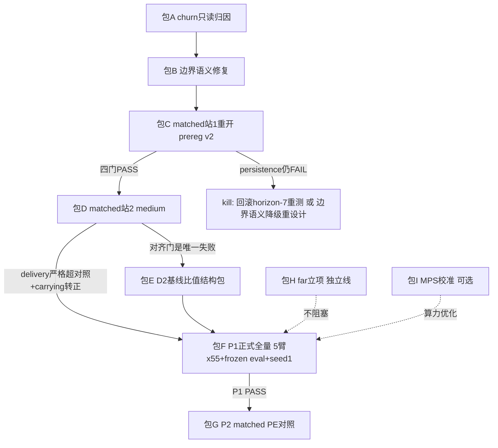

# 蚂蚁生态：从前端到后端的差距分析与收敛路线

> 撰写时间 2026-07-31。数据截止：同物理 matched 站1 正式判词
> `ecology_same_physics_station1.seed0.20260730T095738Z.json`（verdict **BLOCK**）、
> P0 正式 bundle `20260730T072554Z`（14 门全 PASS）、
> `research/ant/06_ecology_implementation_status.md` 至 2026-07-30 各段。
> 注意：另一并行会话此刻正在同一 journal 上跑 persistence 探针；本计划只做分析与设计，
> 不启动任何 writer，执行前必须确认单写者（flock 已生效，D10）。

## 一、全链地图：逐层现状

从前端（世界/身体）到后端（晋级），每层标注：✅ 已证明（有正式 artifact）、❌ 已证伪（有反例证据）、⬜ 未验证。

| 层 | 组件 | 状态 | 证据 |
|---|---|---|---|
| L1 世界/身体 | AntWorld 几何、`motor_decode`（turn≈atan2(8·z1,1)，执行器无天花板）、curriculum v14（near 无免费拾取、forced_return ±3π/4 真实拾取轨迹、forced_approach 随机几何） | ✅ | oracle 诊断 6/6 能力 5/5；v26 几何修复；执行器代数审计 |
| L2 感知/镜像契约 | 19 维 sense + `ant-sense.ecology-v2` signed involutive mirror permutation | ✅ | v25 镜像等变包；owner/训练/持久化回归 108 项 |
| L3 基底 code | exclusive steering：base 确定性均值在 contrast 轴被投影，探索噪声保留反对称分量 | ✅ | v23/v24：冷启基线 0.083→0.0028；v22r 退化解 0.147 → 0.0105 |
| L4 causal action head | 镜像等变 + full-rank + effective_dims(0,1,2) + contrast_pairs((0,1)) + β 门 pair 共享均值 | ✅（结构）/ ⬜（v31 语义下形成时点） | v25/v26：food near/medium probe 4/4、authority +0.001…+0.005；**但 v31-era ep20 checkpoint 为 0/4**——对齐形成时点在新动力学下未复核 |
| L5 时间边界/family | typed milestone boundary（环境 owner 声明 → 下一决策强制切段）；PE 降级纯加性 prior | ✅（切换发生）/ **❌（persistence）** | 切换延迟 8/8 = 1 action；**但 matched 站1 新 family 存活 [1,1,1,1,1,1,15,15]，6/8 lane 立即再切**，`typed_milestone_structure` 门 FAIL |
| L6 信用分配 | segment credit、GAE、TD bootstrap、advantage RMS/clamp；7-30 新包：batch target 4→2、bounded horizon 16→7 | ✅（管线）/ ⬜（新参数下的段结构副作用未审计） | P0 `action_head_update_applied`/`no_rollback` PASS、update step (6,3,8,8)；horizon-7 是 persistence 崩塌的头号嫌疑（见 §三） |
| L7 记忆 | CMS 容量 8192 确定性淘汰、双槽 archive 稳定 31 MB | ✅ | 50 局长跑无无界增长 |
| L8 训练管线 | 双槽原子 journal、断点续跑、进程级 flock、隔离快照 + 全源码树 SHA binding、同物理 matched 双臂 prereg v1 | ✅ | prereg `095738Z` 包；三个作废包按契约拒绝执行的审计链 |
| L9 评估门 | P0 14 门；P1 能力门 + `food_steering_alignment` + `post_pickup_uturn_progress`(+persistence≥3) + 通道增益/镜像比探针 | ✅（P0 全 PASS 2026-07-30）/ P1 各门见 §二 | P0 bundle `20260730T072554Z`；probe seed 统一 `config.seed+700003` |
| L10 晋级 | P2 confirmatory（PE-on/off matched）、promotion artifact | ⬜ 未启动（预注册规则：P1 PASS 前禁止） | — |

一句话总括：**结构链（L1–L4 + 切换发生本身）已全部打通并有正式证据；断点收敛在 L5/L6 交界——
强制切换后的 family 不持久、且 milestone 臂的 near 送达劣于对照臂；它下游的 D1（carrying-home 学习）、
站2 medium、P1 全量、P2 全部被这一个点阻塞。**

## 二、量化差距总表

### 能力差距（C）

| # | 差距 | 当前读数 | 目标读数（预注册口径） | 阻塞在 |
|---|---|---|---|---|
| C1 | **family persistence** | matched 站1：6/8 lane 存活 1 action（body0/1/2 双侧全 churn，body3 双侧 15） | 8/8 ≥3 action，`typed_milestone_structure` PASS | 包A→B |
| C2 | milestone 臂送达非劣 | 候选 near 送达 6 vs 对照 17（butter-near 1 vs 9）；pickup 比 85.2% 过门 | 站1 送达不再作硬门（稀疏观察），但不应系统性劣于对照 | 包B（warm-start / 解耦） |
| C3 | food→turn 对齐形成时点 | v26 ep25–30 为 4/4；v31 动力学下 ep20 为 0/4，25–30 未测 | 站1 末或站2 初 4/4（probe seed +700003） | 包C 验收项 |
| C4 | **carrying-home 映射（D1）** | 从未学成（v30 反事实净巢距 −4.2…−4.4；medium 转化 1/14） | 站2：`carrying_home_action_alignment` 转正 + U-turn gate（交付或净降 ≥0.4 且连降 ≥3 步）≥60% body | 包D（前置 C1/C2） |
| C5 | medium 闭环 | 未合法验证（v31 站2 无执行权限）；历史旁证 v30 11/5、v24 11/2 | matched 站2：pickup ≥80% 对照且 delivery 严格超对照 | 包D |
| C6 | 对齐门天花板（D2） | authority/baseline 比 near 0.48、medium 0.19（v24 末）；训练不改比值（authority +16% 时 baseline +30%） | 比值 >1 或对齐门按新证据重定义 | 包E（条件触发） |
| C7 | far tier（D3） | 全版本 0 送达；v25 后"找到食物"已从硬 blocker 转为稳定性问题（3/5 局到达、4/0） | 独立立项，不阻塞 P1（far 不在 P1 三道能力硬门内的部分照实标注） | 包H |

### 证据差距（E）

| # | 差距 | 现状 | 目标 |
|---|---|---|---|
| E1 | matched 站1 verdict | **终局 BLOCK**：四门全 PASS、47/52 pickup、8/8 structure；唯一五局 review 后 alignment 仍 3/4 | `next_episode_authorized=null`，station2 禁止执行 |
| E2 | P1 正式全量 | 五臂 × 55 局 + frozen 30/30 eval 只在旧 schema 时代跑过（结论 BLOCK）；v31 语义下从未跑 | 五臂全量 + frozen eval + seed1 复跑 + `--repeat-reference-report` 同向门 |
| E3 | P2 confirmatory | 未启动 | PE-on/off matched（两臂 milestone 同态 ACTIVE），隔离 PE 加性 prior 的净贡献（D5） |
| E4 | 旧 journal 处置 | **CLOSED**：旧 v31 ep23 污染态与 v30 MPS 55 局 journal 已归档到 `.partials/excluded_history_20260731/`；manifest 逐文件冻结字节数与 SHA-256 | 顶层 `EXCLUDED`，`resumable=false / admissible_for_formal_verdict=false`；只读审计，禁止误续跑或准入 |

### 工程差距（G）

| # | 差距 | 现状 | 目标 |
|---|---|---|---|
| G1 | 设备口径（D8） | CPU float64 唯一合法基线（~3.7 min/局）；MPS 实测 2.4→14 min/局且逐局恶化，未归因 | 可选校准包；在此之前禁止 MPS 进正式链 |
| G2 | main 既有失败（D9） | **CLOSED**：5 个 rare-heavy/binary-override 族失败、`sandbox.py` Ruff 遗留及零训练冷内核的陈旧 random-floor 正向断言均已清偿 | matched-control 冻结真实负证据；正式 P1/P2 门槛不变 |
| G3 | 多会话协调 | flock 已挡 CLI 双写（D10 CLOSED）；但计划文件/门槛被并行会话双向改写的问题发生过（站1 v24 门 vs v30 基线之争） | 预注册包（含源码树 SHA binding）已是答案：**门槛只能在 prereg 包里改版本，不能在计划文件里就地改** |

## 三、最前沿 blocker 归因：persistence 崩塌（包A 详细设计）

### 已知事实

1. matched 站1（源码绑定 git `cd49114a`，7-30）：8 lane 切换延迟全部 1 action ✅，但存活 `[1,1,1,1,1,1,15,15]`——body0/1/2 双侧立即再切，body3 双侧右截断 15。**逐体二分，不是均匀机制 bug**。
2. 旧 v31 站1 checkpoint（7-29 训练，**早于** 7-30 的 action-head 可达性收敛包）：受控 8 lane 与 naturalistic 24 事件全部存活 ≥8/≥15、零回跳、baseline 切换率仅 4%。
3. 两次测量之间落地的学习动力学变更：**Digital Ant transition batch 4→2、bounded segment horizon 16→7**（P0 可达性包）；以及 P0 探针 pose 同步、mirror sign gate 等测量侧修复。
4. 对照臂（milestone DISABLED）near 送达 17 vs 候选臂 6：强制切换在 carrying family 尚未学成时**打断了原本能送达的行为**。

### 假设排序（按先验概率）

- **H1（头号）：horizon-7 改变段节律**。段上限从 16 收到 7 后，closed-segment 频率约翻倍，β 门/track 学习消费的段统计随之变化，学出的 threshold/persistence 参数使自然切换更频繁；forced switch 后的新 family 撞上高频自然切换 → 存活 1。body3 例外说明是学习态而非硬机制。
- **H2：forced switch 路径未初始化 persistence 保护**。`active_family_persistence`/reuse-streak 机制若只在自然切换路径上被赋初值，forced 路径开局即处于"无保护"态。与 H1 可叠加；但无法单独解释 7-29 checkpoint 全存活。
- **H3：carrying 候选与切前 family 差异过小**，β 立即判定应再切（churn 是"寻找不存在的 carrying family"的症状）。这与 D1（carrying 映射为空）同源。
- **H4：测量语义差异**（老探针 persistence horizon 8 右截断 vs 新 gate 数到下一次 β switch）。只影响上限读数，无法解释 1 vs ≥8，基本排除，但包A 顺手钉死。

### 包A 动作（全部只读，不动机制）

1. **跨 checkpoint 对照重放**：同一套受控 ±135° lane，分别加载（a）旧 v31 站1 checkpoint（`a5a944…`）、（b）matched learned ep20 checkpoint，在**当前代码**下重放 → 若 (a) 也变成存活 1，则是代码/测量变化（H2/H4）；若 (a) 仍 15、(b) 为 1，则是训练态差异（H1/H3）。
2. **逐体 β 遥测面板**：frozen replay 中发布 per-body `beta_threshold`、switch pressure、自然切换间隔分布（对 matched 双臂各测一次）；body0/1/2 与 body3 的 threshold 差即 H1 的直接证据。
3. **horizon 消融重放**：只读覆盖 bounded horizon 7→16 重放同 checkpoint（不写回），看自然切换节律是否回落。
4. **candidate 距离读数**：forced switch 采纳的候选与切前 family 的参数/输出距离（H3）。
5. 产出：`persistence_churn_attribution.v1.json` + 状态文档新段；**并行会话正在跑的探针结果先并入，不重复跑**。

成本：全只读，约 1–2 小时机器时间。kill condition：四项诊断互相矛盾 → 升级为"β 门学习本身在新段节律下不稳定"，包B 改为先回滚 horizon-7（该参数有独立回滚路径）再重测。

## 四、收敛包序列

### 包B：边界语义修复（temporal owner，按包A 结论三选一）

前提认识：v31 把"关段（credit 边界）"与"强制换族（行为切换）"绑在同一个 forced switch 上。
matched 证据显示这个绑定有代价（C2）。三个候选方案，按包A 结论选择：

- **B1（若 H1 成立）：min-dwell 契约**。`record_external_boundary_request` 附带预注册的 dwell 窗口（如 4 action）：forced 采纳后 dwell 内抑制自然 β 切换（自然 milestone 仍可打破）。对应 ETA 的 option-commitment 语义；通用默认 dwell=0（字节回滚）。同时评估是否把 horizon 恢复 16（P0 可达性包当时的收益要在 55 局尺度重验，12-turn P0 预算的结论不自动外推）。
- **B2（若 H3 成立）：carrying warm-start**。forced switch 采纳的候选从切前 family 参数克隆再分化（保留携食行为连续性，treats C2），差异只能由 carrying 条件化梯度长出来。
- **B3（若 H2 成立）：forced 路径补 persistence 初始化**——最小修，直接把 forced 采纳接入既有 reuse-streak 保护。

不允许的方向：把 persistence 门槛从 3 降到 1（禁止为过门降门槛）；在表达层给"切换后行为"打补丁。

验收（预注册后重放旧 checkpoint 快速预检 + 包C 正式判定）；涉及文件：`vz-temporal` interface/joint_loop、`FinalRolloutConfig` 新 wiring 字段（三态、DISABLED 回滚）、对应契约测试、`docs/DATA_CONTRACT.md`、`temporal-abstraction.md`。

### 包C：matched 站1 重开（prereg v2）

- 从空 journal、隔离快照、全源码树 SHA binding（复用 `095738Z` 的机制）；双臂 20 局。
- 预注册门槛沿用 v1 四门 + 新增：**对齐形成时点检查**（站1 末 probe seed+700003 的 food 对齐作记录项，若 0/4 则站2 前先跑 5 局 butter-near 复习并复测，仍 0/4 → 停，开表征回归包）+ persistence 门按包B 语义（dwell 窗口内的存活口径预注册清楚）。
- 成本：双臂 2×20 局 ≈ 2.5 小时 CPU + 探针分钟级。

### 包D：matched 站2（medium 判据，全链最硬结论）

- 双臂各续 10 局（ep20–29）；门槛（prereg v1 已冻结）：medium pickup ≥80% 对照、**delivery 严格超过对照**、`carrying_home_action_alignment` 转正、U-turn gate（含 persistence ≥3）PASS。
- 全部通过 → 第一次可以说"typed milestone 边界对 medium 闭环有因果贡献"；任一失败 → BLOCK，按 D1→C1→C6 顺序归因，不加训练量重跑。
- 成本：双臂 2×10 局 ≈ 1.3 小时 + 探针。

### 包E（条件触发）：D2 基线比值

仅当包D 唯一失败项是绝对对齐门时触发。方向（按 v24 通道审计）：不是加 food 增益（它已是四通道最高），而是**多通道转向的时间分离**——让 home/PI 驱动在非携食相位被 regime/相位信号门控，或对齐门改为相位条件化判据（携食时看 home、觅食时看 food）。跨 owner 设计，先出设计文档再实施。

### 包F：P1 正式全量

- 五臂（learned / no-optimize / cold / dense-local-shaping-off / segment-credit-off）× 55 局 × frozen 30-layout eval，seed0；然后 seed1 全量 + `--repeat-reference-report` 同向门。
- 预算：训练 5×55×3.7min ≈ 17h/seed（串行 CPU；MPS 校准通过可压缩），frozen eval ≈ 18min/臂，探针分钟级。两个 seed 合计约 36–40 小时机器时间，分站跑、断点续。
- 产出正式 `development.v31` report → P1 PASS/BLOCK 终局判定。

### 包G：P2 confirmatory（D5）

P1 PASS 后启动：PE-on/off matched（`prediction_error_enabled` 只控加性 prior，milestone 两臂 ACTIVE），复用同物理 prereg 机制升版。回答"PE 加性 prior 有无净贡献"；无贡献则降 DISABLED 并写入契约。

### 包H：far tier（独立线，不阻塞 P1）

far 的"找到食物"已松动（v25 后 3/5 局到达），剩余是**长程回巢/记忆泛化**：候选方向是 PI 精度在长程下的置信读出、CMS episodic 检索进 controller 观测、或课程加 medium→far 渐进半径。先出可行性诊断（复用 v27 的 deterministic trace 方法），再立项。

### 包I（可选）：MPS 校准

逐局耗时曲线 + per-op profile 归因 2.4→14min 恶化；通过前 MPS 不进正式链。

## 五、执行纪律

1. **单写者**：任何 writer 启动前确认 flock 与并行会话状态；本计划撰写时另一会话正在活动，包A 起跑前先对齐分工（它正在跑的 persistence 探针产物直接并入包A 第 1 项）。
2. **门槛只在 prereg 包里改版本**：站1 的"v24 门 vs v30 基线"之争的教训——计划文件不是门槛的 SSOT，预注册 artifact 才是。
3. 机制包（B）与运行包（C/D/F）分开提交；每包 ruff + 相关 pytest + 契约测试；跨 owner 变更同步 `DATA_CONTRACT.md` 与 specs。
4. 所有 >10 分钟任务走 `_detach_run.py`；正式 run 走隔离快照 + 源码树 binding。
5. 旧 v31 污染 journal（ep23）与 v30 MPS `/tmp` 证据已完成
   EXCLUDED 归档（E4 CLOSED）；任何后续 runner 都不得把该目录作为 progress root。

## 六、距离终点还有多远（诚实估计）

- **到 matched 站2 出 medium 结论**（最关键一步）：包A 1–2h 诊断 + 包B 1–2 天实现/测试 + 包C 2.5h + 包D 1.3h ≈ **2–4 个工作日**，其中真正的不确定性只有包B 选型与 C3（对齐形成时点）。
- **到 P1 PASS**：再加包F 约 36–40h 机器时间（可夜间分站），以及站2 结论为正的前提。
- **到 P2 完成**：包G 与包F 同量级。
- **far（C7）不在此路径上**，单独推进，P1 报告如实标注。
- 最大剩余风险按序：① 包A 若指向"β 门在新段节律下学习不稳定"，则要先回滚 horizon-7 并重验 P0 可达性包的两个结论（预算 +1–2 天）；② 站2 delivery 未超对照（则 typed milestone 的净价值被证伪，回到"只关段不换族"的 B1' 重设计）；③ C6 对齐门触发包E（跨 owner 设计，+3–5 天）。
