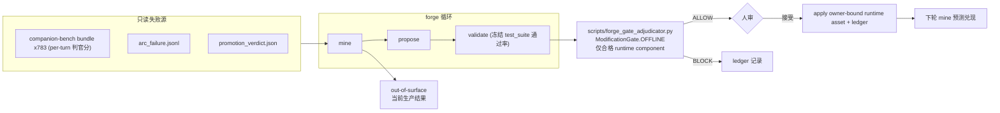

# Forge 第二战役:runtime 证据接入 + ModificationGate.OFFLINE 预备能力

> 实施校正（2026-08-01）：代码消费链与 `docs/specs/character-soul-bootstrap.md`
> 共同证明 `scenario_packages/*/{scenes.yaml,ssot_fragment.json}` 是 SHADOW 验收资产，
> 不是产品 runtime owner。因此不执行原计划中“将其开放为 runtime 写面”的错误步骤；
> 双闸能力保留并用隔离 fixture 验证，生产配置保持 `packages/**` 只读。

## 核心设计决定(基于调研)

- **失败流**:产品 live runtime 默认不落盘轨迹,第二战役以 **companion-bench 判官 bundle**(`artifacts/**/*.bundle.json`,约 783 个,含逐轮对话 + per-turn 8 准则分 + disqualifier + `arc_failure.jsonl`)为代理产品失败源,粒度到 turn。
- **生产可编辑面**:当前为空。`scenes.yaml`、`ssot_fragment.json`、`test_suite.yaml`、
  companion-bench 场景与 `evaluation/*.json` 同属验收/评估资产，全部在循环外只读。
  Forge v2 配置只预备表达未来 runtime component 的能力，不自授权开放任何 wheel。
- **晋升双闸**:runtime 目标的 apply 需要 `ModificationGate.OFFLINE` 裁决 ALLOW **且** 人审通过。裁决器放 `scripts/`(允许 import vz-cognition),forge 本体保持不 import `vz-*` 的边界。
- **validation_delta 折算(预注册,仓库空白件)**:`delta = 候选资产在冻结 test_suite 上的通过率 − 基线通过率`,门槛沿用 OFFLINE 的 ≥0.05;`capacity_cost` 对文件编辑取常量 0.1;`contract_integrity` = 冻结套件与阈值未被触碰(1.0/0.0);`rollback_resilience` = 反向补丁演练通过(1.0/0.0)。折算规则先写进 spec 再实现,观察窗内不得改。



## 包 0:阶段一收尾——预测检查证据时间下界(前置,已设计好)

按 [rsi_元层_forge_7c864134.plan.md](.cursor/plans/rsi_元层_forge_7c864134.plan.md) 阻塞 A 的方案:

- [forge/src/volvence_forge/sources.py](forge/src/volvence_forge/sources.py):`load_source_bundle(..., since)` 按源文件 mtime 过滤。
- [forge/src/volvence_forge/mine.py](forge/src/volvence_forge/mine.py):`evidence_since` 记入 inventory;`_prediction_checks` 在证据窗无法排除 apply 前污染时输出 `inconclusive`;`prediction_checks.json` 升 v2。
- [forge/src/volvence_forge/cli.py](forge/src/volvence_forge/cli.py):`--evidence-since <ISO>` / `--evidence-since-ledger` 互斥参数。
- 测试:`forge/tests/test_sources_mine.py` 补 since 过滤与 inconclusive 用例。

## 包 1:runtime 失败源接入(mine 扩展)

- [forge/src/volvence_forge/sources.py](forge/src/volvence_forge/sources.py) 新增 `BenchBundleSource`:解析 `*.bundle.json` 的 `perturn_rubric.turn_scores`(低分轮 + 对应对话文本切片)、`disqualifier_report`、`arc_axis_scores`,以及 `arc_failure.jsonl`;证据引用定位到 `arc/session/turn`。
- `failure_pattern.schema.json` 的 `source_kind` 枚举增加 `bench_bundle`(schema 升 v2,mine/propose/validate 同步)。
- [forge/prompts/failure_mining.system.md](forge/prompts/failure_mining.system.md) 增补 runtime 语义段:判官低分是行为失败证据,须区分"场景检测错误 / 语义资产缺口 / 内核能力不足(out-of-surface)";延续既有"负向晋升证据"规则。
- CLI:`mine --bench-root <dir>`(默认扫 `artifacts/`,可限定)。

## 包 2:runtime 写面预检 + OFFLINE 裁决器

- `forge/editable_surface.yaml` 升级为 v2，支持以下 component 契约（仅在隔离测试配置中启用）:

```yaml
# 仅隔离测试配置；不存在于 production editable_surface.yaml
- component: character_scenario_semantics_fixture
  paths:
    - packages/lifeform-domain-character/src/**/scenario_packages/*/scenes.yaml
    - packages/lifeform-domain-character/src/**/scenario_packages/*/ssot_fragment.json
  requires_offline_gate: true
  validation:
    held_in: pytest packages/lifeform-domain-character/tests/test_character_migration_package.py -q
    held_out: pytest packages/lifeform-domain-character/tests -q
```

  生产配置不包含该 component，并把 `packages/**`、`test_suite.yaml`、
  `scenes.yaml`、`ssot_fragment.json`、companion-bench 与 evaluation 资产显式加入只读面。
- 新建 `scripts/forge_gate_adjudicator.py`(循环外,import vz-cognition):读 proposal bundle + validate 报告 → 按预注册折算规则计算 `validation_delta` → 仿 [scripts/adapter_promotion_evidence.py](scripts/adapter_promotion_evidence.py) 的 `decide_offline_promotion` 合成 `EvaluationSnapshot` → `evaluate_gate_reasons` → 写 `gate_decision.json`(decision + reasons + 输入哈希)到 proposal 目录。
- 新增 `tests/contracts` 用例:forge 提案 target 命中只读评估器路径必须 BLOCK;adjudicator 对 delta<0.05 必须 BLOCK。

## 包 3:validate/apply 双闸接线

- [forge/src/volvence_forge/validate.py](forge/src/volvence_forge/validate.py):按 component 执行 `editable_surface.yaml` 声明的 held-in/held-out 命令(现有机制推广);对 `requires_offline_gate` 的 component,validate 产出基线/候选通过率对比,供裁决器折算。
- [forge/src/volvence_forge/apply.py](forge/src/volvence_forge/apply.py):target 属于 `requires_offline_gate` component 时,apply 前置校验 proposal 目录存在 `gate_decision.json` 且 decision=ALLOW(哈希绑定 patch/manifesto),缺失或 BLOCK 则 fail-closed;ledger 事件记录 gate decision 引用。
- 开发环资产(`.cursor/rules` 等)维持原人审单闸,不受影响。

## 包 4:端到端战役演练(验收)

1. 全量解析仓库现有 783 份 bench bundle 与 44 份 `arc_failure.jsonl`，验证源契约。
2. 使用隔离 runtime fixture 演练 `propose → validate → gate BLOCK/ALLOW → 人审 apply`，
   证明结构候选、冻结 suite、反向补丁与双闸哈希绑定。
3. 生产配置下用 bench fixture 执行 mine，必须产出 `out-of-surface` 且 target/component 为 null。
4. 不生成或 apply 指向 scenario 验收资产的伪 runtime proposal。
5. 回归:`ruff check forge scripts/forge_gate_adjudicator.py` + `pytest forge/tests` +
   Forge contract tests。

## Spec 同步与不变量

- [docs/specs/rsi-forge.md](docs/specs/rsi-forge.md):新增第二战役章节——runtime 可编辑面清单、评估器只读清单、validation_delta 预注册折算规则、双闸流程、`inconclusive` 语义。
- 不变量:evaluator/gate/bench/prereg 对循环只读;每个 runtime apply 必须同时有 gate ALLOW + 人审;折算规则观察窗内冻结;全部改动 git 可回滚,ledger append-only。

## 前置依赖(用户侧)

- **LLM 凭据**:live mine/propose 需要 `FORGE_LLM_API_KEY` + `FORGE_LLM_MODEL`(可选
  `FORGE_LLM_BASE_URL`)。当前环境未提供凭据，因此仅把 replay 用于契约演练，不宣称为真实
  LLM 晋级证据。这不影响生产结论：由于没有合格 runtime owner，真实 apply 本就必须阻断。

## 明确不做

- 产品 prompts / substrate anchors / CharacterPackageManifest+LoRA 扩面(验证太贵或缺内容级回归,留第三批)。
- lifeform-service 增加 live 失败流落盘(独立收敛包,归 lifeform-service owner)。
- 提案器 meta 优化、自动 apply(无人审)。
