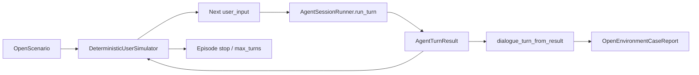

# Open-Environment Dialogue Extrapolation

## Goal
把当前 repo-native、scripted 的对话因果隔离证据，推进到第一阶段的开放环境外推：
- 用户输入不再只来自固定 `case.user_inputs`
- 仍复用现有 `AgentSessionRunner.run_turn(user_input)` 主路径
- 第一版采用 **deterministic、stateful、可复现** 的用户模拟器
- 不把用户模拟器提升为新的 runtime owner，不改 `EvaluationSnapshot` 公共 shape

## Hard Constraints
- 保持 `AgentSessionRunner.run_turn(user_input: str)` 作为稳定 runtime 边界，优先在 [volvence_zero/agent/session.py](/Users/mengfu/Documents/GitHub/VolvenceZero/volvence_zero/agent/session.py) 之外做环境编排。
- 复用 `run_repl(reader=...)` 的 runtime seam，而不是在表达层打补丁：[volvence_zero/agent/cli.py](/Users/mengfu/Documents/GitHub/VolvenceZero/volvence_zero/agent/cli.py)。
- 遵守快照/owner 边界：用户模拟器属于 benchmark / orchestration 层，不成为新的模块 owner。
- 避免关键词匹配式“用户状态机”；simulator policy 要基于 turn result、scenario state、episode progress 等结构化状态推进。
- 不把 scripted case 的 `expected_pressure_turns` 指标硬套到开放环境；开放环境需要单独 report mode。

## Architecture

## Implementation Plan
### 1. Add an open-environment simulator protocol in the agent layer
Create a small protocol and state container near [volvence_zero/agent/dialogue_benchmark.py](/Users/mengfu/Documents/GitHub/VolvenceZero/volvence_zero/agent/dialogue_benchmark.py), or as a focused sibling module under `volvence_zero/agent/`, for example:
- `OpenDialogueScenario`
- `OpenDialogueEpisodeState`
- `DeterministicUserSimulator` / `DialogueUserTurnSource`
- `next_turn(...) -> str | None`

The simulator should consume structured runtime evidence from the previous turn, especially `AgentTurnResult` and the projected `DialogueBenchmarkTurn`, rather than raw keyword checks. It should support:
- reproducible seeding
- bounded `max_turns`
- scenario goal drift / pressure escalation / repair / clarification as **state transitions**, not phrase triggers
- stop conditions independent of CLI sentinel words like `exit`

Likely touchpoints:
- [volvence_zero/agent/dialogue_benchmark.py](/Users/mengfu/Documents/GitHub/VolvenceZero/volvence_zero/agent/dialogue_benchmark.py)
- [volvence_zero/agent/__init__.py](/Users/mengfu/Documents/GitHub/VolvenceZero/volvence_zero/agent/__init__.py)

### 2. Add a dedicated open-environment run/report path instead of overloading scripted metrics
Keep the existing scripted path intact:
- `run_dialogue_pe_eta_case(...)`
- `build_dialogue_case_report(...)`

Add a sibling open path, e.g.:
- `run_open_dialogue_case(...)`
- `build_open_dialogue_case_report(...)`
- `OpenDialogueBenchmarkReport`

This new report mode should still reuse `dialogue_turn_from_result(...)`, but it must avoid assuming fixed `expected_pressure_turns`. Primary first-stage metrics should emphasize:
- prediction-chain presence
- PE exposure distribution
- PE-schedule coupling
- temporal/regime change non-constancy
- online learning / writeback / session-post / rare-heavy observability
- bounded episode stability or recovery trend across the latter segment

The key design choice is to **separate scripted causal localization metrics from open-environment trajectory metrics**, because [volvence_zero/agent/dialogue_benchmark.py](/Users/mengfu/Documents/GitHub/VolvenceZero/volvence_zero/agent/dialogue_benchmark.py) currently computes `recovery_lag_turns`, `pressure_localization_score`, `precision`, and `recall` from `ScriptedDialogueCase.expected_pressure_turns`.

### 3. Wire the simulator into runtime-facing entry points
After the open benchmark driver exists, expose a runtime-integrated path that exercises the exact same `run_turn` loop the product uses:
- add a simulator-backed `reader` helper for [volvence_zero/agent/cli.py](/Users/mengfu/Documents/GitHub/VolvenceZero/volvence_zero/agent/cli.py)
- optionally mirror the same helper in [volvence_zero/agent/trial.py](/Users/mengfu/Documents/GitHub/VolvenceZero/volvence_zero/agent/trial.py)
- add a narrow CLI/trial switch that launches a simulated episode with a chosen open scenario and bounded turn count

This should remain orchestration-only: no new owner, no changes to final wiring contracts, and no changes to `EvaluationSnapshot` schema.

### 4. Add a minimal open-environment acceptance surface
Introduce a first-stage acceptance layer for open extrapolation, separate from the current scripted proof gate. Suggested gates:
- `episode-runs-to-completion`
- `prediction-chain-present`
- `pe-schedule-observed`
- `temporal-trajectory-nonconstant`
- `multi-timescale-evidence-observed`
- `late-episode-stabilization-or-improvement`

Keep this acceptance scoped to “runtime survives and produces paper-aligned evidence in an open episode,” not to “scripted localization remains optimal.”

The first implementation can run a small matrix such as:
- `pe-eta`
- `pe-drive-off`
- `eta-off`

Then optionally add `timescale-off` once the open metrics are stable enough to interpret it.

### 5. Add focused regression coverage and spec/doc sync
Tests should prove three things:
- a deterministic simulator with a fixed seed is reproducible
- the simulator path exercises the same `AgentSessionRunner.run_turn(...)` path as existing runtime entry points
- open-environment reporting does not silently reuse scripted `expected_pressure_turns` assumptions

Likely files:
- [tests/test_dialogue_benchmark.py](/Users/mengfu/Documents/GitHub/VolvenceZero/tests/test_dialogue_benchmark.py)
- [tests/test_agent_cli.py](/Users/mengfu/Documents/GitHub/VolvenceZero/tests/test_agent_cli.py)
- possibly [tests/test_agent_session_runner.py](/Users/mengfu/Documents/GitHub/VolvenceZero/tests/test_agent_session_runner.py) for run-loop invariants

Docs/spec updates should keep the benchmark boundary explicit:
- [docs/implementation/10_pe_eta_dialogue_benchmark_harness.md](/Users/mengfu/Documents/GitHub/VolvenceZero/docs/implementation/10_pe_eta_dialogue_benchmark_harness.md)
- [docs/specs/evaluation.md](/Users/mengfu/Documents/GitHub/VolvenceZero/docs/specs/evaluation.md)
- if runtime entry flags become user-facing, also sync [docs/specs/contract-runtime.md](/Users/mengfu/Documents/GitHub/VolvenceZero/docs/specs/contract-runtime.md)

## Phasing
### Phase 1
- protocol + deterministic simulator
- open episode runner + open report
- one runtime entry (`cli` or benchmark runner)
- focused tests

### Phase 2
- ablation matrix over open episodes
- staged/open comprehensive integration
- artifact/report export for longer-running open sessions

### Phase 3
- optional LLM-backed simulator backend behind the same protocol
- longer cross-context open sessions
- stronger open-environment replay selection and acceptance

## Key Files
- [volvence_zero/agent/dialogue_benchmark.py](/Users/mengfu/Documents/GitHub/VolvenceZero/volvence_zero/agent/dialogue_benchmark.py): primary harness seam and new open report mode
- [volvence_zero/agent/cli.py](/Users/mengfu/Documents/GitHub/VolvenceZero/volvence_zero/agent/cli.py): simulator-backed runtime reader
- [volvence_zero/agent/trial.py](/Users/mengfu/Documents/GitHub/VolvenceZero/volvence_zero/agent/trial.py): optional parallel trial entry
- [volvence_zero/agent/__init__.py](/Users/mengfu/Documents/GitHub/VolvenceZero/volvence_zero/agent/__init__.py): exports
- [tests/test_dialogue_benchmark.py](/Users/mengfu/Documents/GitHub/VolvenceZero/tests/test_dialogue_benchmark.py): protocol/report/acceptance regressions
- [docs/implementation/10_pe_eta_dialogue_benchmark_harness.md](/Users/mengfu/Documents/GitHub/VolvenceZero/docs/implementation/10_pe_eta_dialogue_benchmark_harness.md): benchmark semantics
- [docs/specs/evaluation.md](/Users/mengfu/Documents/GitHub/VolvenceZero/docs/specs/evaluation.md): evaluation boundary and open-env proof positioning

## Non-Goals For This First Stage
- 不把用户模拟器做成 learned owner 或接入 joint loop 内部训练
- 不直接把开放环境接进默认生产 training loop
- 不声称“论文级开放域泛化已被证明”
- 不在第一版追求 LLM-backed user simulation
