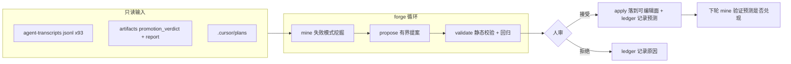

# RSI 元层 Forge 实施计划

## 定位与原则

Forge 是一个指向 volvence 的 RSI 元层:物理上独立于运行时 wheel,只通过公开产物(agent 轨迹、`artifacts/**/promotion_verdict.json`、rules/prompts 文件)读取系统,产出**有界编辑提案**,晋升走人审(第一阶段)/ ModificationGate(第二阶段)。三条硬边界:

- **循环外只读**:gate 代码、evaluation、verifier 脚本、tests、`vz-contracts` 对 forge 永远只读——对应 AHE 的"每分收益可归因"约束。
- **可编辑面白名单**:提案只能落在 `forge/editable_surface.yaml` 显式列出的文件上;初始仅 `.cursor/rules/*.mdc` 与 `forge/prompts/**`,扩面需人工修改白名单。
- **决策可观测**:每个提案带 manifesto(证据、根因、预测影响、风险回归、回滚方式),记入 ledger,下一轮挖掘时验证预测——可证伪。

第一个循环选**开发环 harness**(验证器硬:测试/lint/gate 过不过),跑通后再切产品 runtime 可编辑面(接 `ModificationGate.OFFLINE`,那是第二战役,本计划只留 roadmap)。



## 目录结构

```
forge/
  README.md                 # 本次讨论的完整思考(见包 0)
  pyproject.toml            # 独立包 volvence_forge,不进 uv workspace
  editable_surface.yaml     # 可编辑面白名单 + 只读面声明
  ledger.jsonl              # 提案决策台账(append-only)
  prompts/                  # forge 自己的挖掘/提案 prompt(遵守 prompt 集中化规则)
  schemas/                  # failure_pattern / proposal manifesto 的 JSON Schema
  src/volvence_forge/
    config.py               # transcripts 路径、artifacts 路径、LLM backend(env 配置)
    sources.py              # 三类输入的解析器(transcripts JSONL / verdict bundle / plans)
    mine.py                 # 失败挖掘与聚类
    propose.py              # 有界提案生成
    validate.py             # 提案静态校验 + 回归检查
    apply.py                # 人审通过后落盘 + ledger
    cli.py                  # forge mine / propose / validate / apply
  tests/                    # forge 自测(pytest forge/tests 显式运行)
```

运行产物写入 `artifacts/forge_<run>_<timestamp>/`,沿用仓库 artifact 命名规律。

## 包 0:骨架 + 思考沉淀 + 边界(先行)

- `forge/README.md`:把本次讨论完整写下——Weng harness-RSI 框架的要点与"优化对象阶梯"、与 AI Scientist(静态手工 harness)的区别、RSI 对 volvence 的价值判断(速度/经济杠杆而非能力杠杆)、为什么做成指向 volvence 的元层而非独立项目或主线 wheel、evaluator/gate 在循环外的安全原则、开发环→产品 runtime 两阶段路线、模糊评估器/多样性坍缩/reward hacking 三个域特有风险。这满足"把思考写到子目录根部"的要求。
- `forge/editable_surface.yaml`:初始白名单 `.cursor/rules/*.mdc` + `forge/prompts/**`;只读面显式列出(`packages/**`、`tests/**`、`scripts/run_gate*`、`docs/specs/**`、`docs/DATA_CONTRACT.md`、`forge/src/**`、`forge/editable_surface.yaml` 自身)。
- `docs/specs/rsi-forge.md`:按 spec 模板写职责边界、契约(failure_pattern / manifesto schema)、不变量(三条硬边界)、退出与回滚条件;登记进 [docs/specs/00_INDEX.md](docs/specs/00_INDEX.md)(§31 补充表)。
- 新建 `tests/contracts/test_forge_boundaries.py`(AST 扫描,复用 [tests/contracts/test_import_boundaries.py](tests/contracts/test_import_boundaries.py) 的模式):(a) `packages/**` 任何文件不得 import `volvence_forge`;(b) `forge/src/**` 顶层不得 import `volvence_zero.*` / `lifeform_*`。
- forge 不进根 `pyproject.toml` deps、不进 `install.sh`(刻意隔离);单独 `pip install -e forge` 使用。

## 包 1:失败挖掘(mine)

- `sources.py` 解析三类输入:
  - Cursor transcripts(`~/.cursor/projects/Users-mengfu-Documents-GitHub-volvence/agent-transcripts/**/*.jsonl`,路径走 config):提取 tool_use 序列、错误重试链、turn_ended 状态。
  - `artifacts/**/promotion_verdict.json` + `report.md`:gate 失败记录(如 gate2 的 `not-supported / single-seed-stoploss`)。
  - `.cursor/plans/*.plan.md`:战役叙事上下文(只读参考,不是编辑对象)。
- `mine.py`:LLM 结构化输出(prompt 在 `forge/prompts/`,schema 在 `forge/schemas/`)把原始轨迹压成三层失败记录(verifier 层原因 / agent 行为因果 / 暴露的机制),嵌入相似度聚类成 failure pattern,每个 pattern 必须映射到一个可编辑面资产或标记为 `out-of-surface`(只报告不提案)。禁止关键词路由,语义聚类走嵌入。
- 输出 `artifacts/forge_mine_<ts>/failure_patterns.jsonl` + `report.md`。
- LLM/嵌入后端:forge 自带薄 OpenAI-compatible 客户端(env 配置),不 import 任何 vz wheel。

## 包 2:有界提案(propose)

- `propose.py`:对每个 in-surface pattern 生成提案 = unified diff + manifesto JSON(字段对齐 `ModificationProposal` 精神:target、evidence 引用(pattern id + 轨迹片段)、root cause、targeted fix、predicted impact、at-risk regressions、rollback = git revert)。
- 偏好可复发、窄改动可解决的模式;跳过任务难度型失败;对同一 pattern 生成的候选做嵌入去重(防多样性坍缩)。
- 输出 `artifacts/forge_propose_<ts>/proposals/<id>/{patch.diff,manifesto.json}`,**不落盘到目标文件**。

## 包 3:验证 + 人审落地(validate / apply)

- `validate.py`(fail-closed):
  1. diff 目标全部在白名单内,否则 BLOCK;
  2. patch 可干净应用(git apply --check);
  3. 对 `.mdc` 编辑:不删除既有硬约束条目(结构 diff 检查)、有 LLM judge 对照 manifesto 判定"是否针对该失败模式";
  4. 回归:`ruff check` 通过、`pytest tests/contracts/test_forge_boundaries.py` 通过。
- `apply.py`:只接受 validate 通过 + 人工确认的提案;落盘、把 manifesto + 决策 + 预测写入 `forge/ledger.jsonl`;下一轮 `mine` 读 ledger,对已应用提案的 predicted impact 做兑现检查并写入报告(决策可观测闭环)。
- 第一阶段晋升门 = 人审(HUMAN_REVIEW 语义);接 `ModificationGate` 留待第二战役。

## 验证与完成条件

- `ruff check forge/ tests/contracts/test_forge_boundaries.py`
- `pytest forge/tests tests/contracts/test_forge_boundaries.py`
- 端到端演练:对现有 93 个 transcripts + gate2 失败 bundle 跑一轮 `mine → propose → validate`,产出至少一份完整 proposal bundle 供人审——这是本计划的验收证据。
- 回滚方式:forge 全部新增文件,删除目录即回滚;被 apply 的 rule 编辑经 git revert 回滚,ledger 保留记录。

## 明确不做(留给第二战役)

- 产品 runtime 可编辑面(playbook/角色包/记忆整合策略)与 `ModificationGate.OFFLINE` 对接。
- 提案器自身的 meta 优化(STOP 式)。
- 自动 apply(无人审)。
