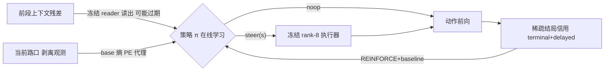

# S3 Internal RL（学"何时扳"）落地计划

## 设计审查结论

09 骨架核心结构 OK（三层分工 / 离散门控 / 稀而准信用 / matched-budget 判定臂 / sample-budget 收敛门），但落地前必须：

- **修正复用边界**：`CausalZPolicy` 耦合 `MetacontrollerParameterStore`/Track/z 空间（[sandbox.py](packages/vz-temporal/src/volvence_zero/internal_rl/sandbox.py) L917–1036），不可复用。只复用 [environment.py](packages/vz-temporal/src/volvence_zero/internal_rl/environment.py) 的信用契约（`sparse_proof_reward_taxonomy`、`InternalRLDelayedCreditAssignment`）；策略本体 = S3 owner 模块内最小 REINFORCE+baseline。
- **前置门控余量审计**：若 always-on（正确条件）处处无害，"何时扳"无可测价值（P2a 重演）。自然余量来源 = 错/过期条件干预的灾难性（random-condition 7.62 已是强先验）→ 用**时间性读出**（staleness）制造诚实余量，先审计再实现。
- **精确化 PE**：同步 gate 输入用 PE 代理（reader margin、fresh/stale 一致性、base 动作熵）；真 PE 只进信用。

## 包 1 · S3-A 门控余量审计（cheap，复用 08 机器）

新脚本 `scripts/run_eta_gating_headroom_audit.py`，复用 [eta_read_steer_prereq.py](packages/vz-runtime/src/volvence_zero/agent/eta_read_steer_prereq.py) 的 reader/capture 与 [eta_conditional_steering_screen.py](packages/vz-runtime/src/volvence_zero/agent/eta_conditional_steering_screen.py) 的 `_ConditionalOperator`/`_train_operator`（1 seed 快速训练执行器），测四件事：

1. fresh-condition steering 在 **revealed** 行是否有害（vs noop 0.218）
2. **stale-condition**（条件取自路线前一段落）在 post-switch 行的损伤（预期接近 random 的灾难）
3. post-switch 行占比与 staleness 可检测性（fresh/stale 读出不一致率、reader margin 分布）
4. **oracle-gated vs always-on 差距**（门控余量主判）≥ 阈值才准入 RL

产出 `research/steering-2026-08/10_GATING_HEADROOM_AUDIT.md` + artifact。若自然余量不足（不太可能），fallback = 文档化的 per-intervention cost，需重审计。

## 包 2 · S3-B 修订骨架 + 冻结正式 prereg

按审计数字修订 [09_S3_INTERNAL_RL_PREREG_SKELETON.md](research/steering-2026-08/09_S3_INTERNAL_RL_PREREG_SKELETON.md)（复用边界、staleness 仪器、PE 代理、阈值实数化），落正式 prereg JSON（固定 source SHA、seeds、episode 预算、判定门）。

## 包 3 · S3-C owner 模块实现

新模块 `packages/vz-runtime/src/volvence_zero/agent/eta_when_to_steer_rl.py`（单 owner）：

- episode 接线：按 case 分组 junction 序列；每步策略观察 (reader margin, fresh/stale 一致性, base 熵) 选 `{noop, steer(s∈levels)}`，steer 时用**时间性读出**条件驱动冻结执行器
- 最小 REINFORCE + running baseline（几十行，动作空间小、horizon 短，无 critic/PPO）
- 信用：复用 `sparse_proof_reward_taxonomy` 语义（terminal+delayed optimizer-visible，diagnostics 不可见）
- 判定臂：pe-gated / always-on / random-gate / noop（+ oracle-gate 诊断），route-level bootstrap CI
- 结构门：reader/executor/substrate 冻结（仅策略参数更新）、no free bias、zero-code no-op
- run 脚本 `scripts/run_eta_when_to_steer_rl.py`（MPS 锁 + manifest）+ 单元测试（准入逻辑 / episode 接线 / REINFORCE 数值，无模型）

## 包 4 · S3-D 权威运行 + SSOT

smoke → 权威运行（多 seed + bootstrap 5000）→ `research/steering-2026-08/11_*.md` + 同步 [stage3.md](.cursor/plans/stage3.md)、[evidence_program.md](docs/specs/evidence_program.md)、README 索引。

## 验证与边界

- 每包只跑直接相关验证（ruff + 本包 pytest；不触公共快照则不跑 tests/contracts）
- 全程 evidence lane：不安装、不改 production WiringLevel、不回灌 evaluation、不训基底/reader/executor
- 不改写任何封存 verdict（kill-eta / S2 / B screen / C2 / 08）