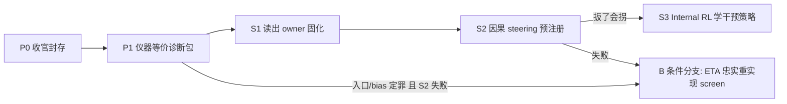

# Stage-3 收官判断与后续路线

## 1. 正式结果（36/36，2026-08-04）

**正式判词是 `kill-eta`，且不是擦线。** runner 先确认双臂可分，再因 frozen 无 gap 判负（见 [eta_rate_distortion_evidence.py](packages/vz-runtime/src/volvence_zero/agent/eta_rate_distortion_evidence.py) L1052–1121）：

- **臂分离通过**：separation `0.1264` > threshold `0.0673`，排除 `instrument-invalid`
- **frozen 无 gap**：rate Spearman `−0.9429` / span `2.0680`，但最大 distortion drop 横跨 `84.16%` rate span，`gap_detected=false` → `kill-eta`
- **第二重失败**：joint 反而 `gap_detected=true`，且 frozen 现有 boundary F1 区内 `0.000` < 区外 `0.2669`

**数据的真实形状**（三个关键事实）：

- rate 轴有效（span 2.07，spearman ≈ −0.94），switching 大多存活——尺子的"rate 侧"没坏
- **所有 α 都拿到约 −55% 的 distortion 改善（2.60→1.13–1.21），与付多少 rate 无关**——强烈符合"不经 z_t、不付 KL 的 steering bias 通道把分数偷走"的假说（`steer_b` 确实存在，见 [torch_store_ssl.py](packages/vz-temporal/src/volvence_zero/temporal/torch_store_ssl.py) L601/L1091）
- seed 多模态：同一 α 下有的 seed 零切换、有的近全切换——控制器落在不同局部解，不是稳定恢复子目标结构

**你上一条审计的三处结构性不等价我已逐一核实为真**：① Gate-2 probe 用完整 896 维 hidden + 累积前缀，Stage-3 控制器入口却是逐步窄激活经固定正负折叠压 16 维（[metacontroller_components.py](packages/vz-temporal/src/volvence_zero/temporal/metacontroller_components.py) `_fold_residual_to_ndim`）；② boundary F1 标的是"相邻专家动作是否变化"而非子目标边界（v4 renderer 算出的 `active_subgoal` 在建 trace 时被丢弃）；③ 控制参数化偏离论文（additive delta + 免费 bias，非低秩状态相关 U_t·e）。

**因此结论的正确措辞**：本仓库当前的 ETA operationalization 在 0.5B 补课基底上被否定；不升格为"ETA 理论普遍证伪"。同时不能全推给尺子——同一套尺子在裸 Qwen Gate-1 上出过方向性 gap。

## 2. 怎么解决

**P0 · 收官（已完成）**
- 36/36 自然完成；runner 正式 verdict 与 gap_assessments 原样封存，未改阈值
- 6 处 SSOT 已同步：写明"operationalization 被否定 + 三处仪器不等价已登记"，Stage 4 不启动，`vz-temporal` ETA 路径保持 SHADOW/legacy
- 未提交；仅在用户明确要求时创建 commit

**P1 · 仪器等价诊断包（便宜，~数小时，无需完整 sweep）**

目的：把封存 FAIL 的解释权钉死（尺子占多少、机制占多少），四个只读对照：
- 用 Stage-3 真实入口通道做 probe：同层（20/21/22）、同 16 维折叠、同单步观测——看 Gate-2 的 0.94 可读性经过这个入口还剩多少
- `bias-only`（冻结 z 通道只训 bias）：若它也能把 distortion 打到 ~1.13，坐实"免费 bias 偷分"
- `zero-z` / `permuted-z`：z 通道因果性对照
- 子目标边界 oracle 只读评价（`active_subgoal[t] != active_subgoal[t-1]`），修正 F1 语义，不进训练损失

**结果**：prereg `30b827b3…`，6/6 cells 完成。exact-entry 0.3913 > 0.25
但仅保留 Gate-2 41.45%；bias-only recovery 96.32%，zero-z recovery 61.41%，
permuted-z penalty −0.0068。主归因 `incentive-bypass-via-free-bias`；oracle
与 action-change F1 差未过 0.10 门。A 继续，B 等待 S2 失败条件。

产出一页判定：信息死在入口 / 死在激励 / 死在优化。

## 3. A vs B：我的建议

**主线走 A（残差 subgoal 读出 + steering + Internal RL），B 降级为条件分支。**

理由：
- Gate-2 已证明表征存在且免费（裸基底 0.977）；产品要的是识别+控制，不是"涌现证明"
- A 的动作空间极小（noop / ±轴 / 几档 scale），与稀疏 PE/结局信用兼容；B 即使修好仪器，还要再赌一次"z_t 时间抽象在富残差上有激励"——Stage-3 的平坦 distortion 恰恰提示这个激励可能本来就不存在
- A 复用现有资产（residual intervention、Prefix-KV、Internal RL/PPO 骨架），B 需要重写控制参数化 + 全链重跑

**A 的三步阶梯（对应此前讨论的 S1→S3）**：
1. S1 识别固化（已完成）：新增 `substrate_residual_readout` offline/SHADOW
   owner。v1 虽读出 PASS，但审计发现 heldout 有 `7/299` 个 cumulative prefix
   被 512-token 静默截断，因此未被 S2 消费；无截断 v2 prereg `35c92904…`
   固定 `max_length=768` + fail-loud，layer20/896 heldout `0.9833`、late
   `0.9720`、gap `0.0167`，四门全过。artifact `086a8f3d…` 的 8 条
   class-vs-rest 轴无 bias；未安装、不回灌、不接 production。
2. S2 因果 steering（已完成，FAIL）：prereg `b6a427d0…`，299 条
   heldout prefix、24 routes、0 截断、0 trainable parameter、无 free bias。
   0.50×cap 主判 target-plus vs noop=`-0.00072`（95% CI
   `[-0.01787, 0.01809]`），vs minus=`0.02829`，vs shuffled=`0.00709`；
   五项门槛全败。S1 的“可读”没有转化为沿 probe 轴的动作因果性，A 在 S2
   生死门停止，S3 不启动。
3. S3 策略学习（未启动）：只有 S2 因果门通过才允许 PE 门控 + 段信用 +
   小动作空间 PPO/advantage 学“何时/往哪/多狠”。

**B 的触发条件（2026-08-04 已满足）**：P1 已证明 16 维固定折叠只保留
Gate-2 的 41.45%，且 free bias 回收 full 改善的 96.32%；S2 又在无 bias
matched causal gate 上失败。现按忠实度包（可学习投影入口、低秩
`U_t·e`、无免费 bias、统一 causal-prefix surface）另立新 claim / prereg
先跑 screen；screen 不改写已封存的 `kill-eta`，通过后才允许重开权威扫。

实现已落在现有 temporal owner 的显式 evidence mode：layer20 full-width896
只经可学习 GRU 输入权重进入 16 维 `z_t`，actuator 为 rank-8
`A·diag(tanh(Cz_t))·Bᵀ·e_t`，无 additive bias 且 zero-z 严格 no-op；
`active_subgoal` boundary 只作 no-grad readout。历史 folded/affine 路径仍是默认，
`write_back=false`，没有新 public slot 或 production wiring。directional screen
prereg sha256 `c247e82e…` 已固定 3 alpha × 2 seed × 40 updates 并运行中。

## 不做的事

- 不因已见数据而中断当前运行或修改本轮 verdict
- 不立即重跑 36-cell 权威扫（B 的第 5–6 步后置）
- 不把 evaluation 读数回灌学习；不动 production WiringLevel
