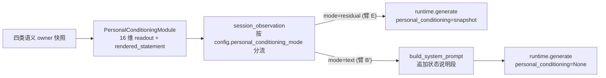

# State KV P0-b：bank readout 渲染器与 B′ 臂接线

## 范围

一个 owner 关注点：**同一份 personal conditioning typed readout，既能以潜向量注入（臂 E），也能以自然语言文本进入上下文（臂 B′），且两条路径互斥、可审计、可通过 profile 复现**。渲染器同时是 §9.3 蒸馏教师的渲染逻辑（本包只实现渲染，不做蒸馏）。

## 关键设计决策

- **渲染输入只有 typed readout**：渲染器只消费 `PersonalConditioningSnapshot`（16 个带标签坐标 + confidence + coverage），**不读** `SemanticRecord` 的 summary/detail 文本。这是 B′ "同信息量" 公平性的机械保证，也维持快照 "不携带原始个人资料文本" 的隐私姿态。
- **渲染 owner = PersonalConditioningModule**（R8：谁拥有数据谁负责描述）。确定性模板渲染（数值→定性分档→英文陈述），不调 LLM，随快照发布。先例：regime 的 `llm_guidance` 由 cognition 拥有、prompts 层只读。
- **三臂映射到既有 wiring + 一个新模式开关**：
  - 臂 A = `personal_conditioning=SHADOW`（今日默认，不注入不渲染）
  - 臂 E = `personal_conditioning=ACTIVE` + `mode="residual"`（既有单层恒定偏置路径，行为不变）
  - 臂 B′ = `personal_conditioning=ACTIVE` + `mode="text"`（渲染文本进 system prompt，`generate()` 收到 `personal_conditioning=None`）
- **prefix KV cache 是已知限制**：Transformers/vLLM runtime 目前都无跨调用前缀缓存（已探查确认），B′ 的"前缀 KV 缓存"延迟对齐留给 P3；本包把状态段放在 system prompt 的稳定位置即可，并在 spec 记录该限制。



## 改动

### 1. 契约：快照增加渲染字段

[packages/vz-contracts/src/volvence_zero/personal_conditioning_contracts.py](packages/vz-contracts/src/volvence_zero/personal_conditioning_contracts.py)：`PersonalConditioningSnapshot` 末尾追加 `rendered_statement: str = ""`，`__post_init__` 增加不变量：cold-start 时必须为空串。docstring 注明该字段只从 typed readout 派生、不含原始资料文本。

### 2. 渲染器（owner 侧）

新增 `packages/vz-cognition/src/volvence_zero/personal_conditioning_rendering.py`：纯函数 `render_personal_conditioning_statement(...)`，把 16 个坐标按固定阈值分档成定性描述（如 trust: low/moderate/high），组装成一段英文状态说明，附 confidence/coverage 限定语。cold-start / confidence 0 → 返回空串。[personal_conditioning.py](packages/vz-cognition/src/volvence_zero/personal_conditioning.py) 的 `process()` 调用它填充 `rendered_statement`。

### 3. 模式开关与分流（orchestration 侧）

- [final_wiring.py](packages/vz-runtime/src/volvence_zero/integration/final_wiring.py)：`FinalRolloutConfig` 增加 `personal_conditioning_mode: str = "residual"`（允许 `residual` / `text`，构造时校验）。
- [session_observation.py](packages/vz-runtime/src/volvence_zero/agent/session_observation.py) 281–293：mode 为 `text` 时，`ResponseContext.personal_conditioning=None`、新字段 `personal_conditioning_statement=snapshot.rendered_statement`；`residual` 保持现状。
- [response.py](packages/vz-runtime/src/volvence_zero/agent/response.py)：`ResponseContext` 增加 `personal_conditioning_statement: str = ""`；审计标签在 text 模式记 `personal_conditioning_text={fingerprint 前缀}`（与 P0-a 的 applied/not_applied 标签并列，B′ 同样可审计）。

### 4. prompt 装配（consumer 侧）

[prompts.py](packages/vz-runtime/src/volvence_zero/agent/prompts.py) `build_system_prompt`：`context.personal_conditioning_statement` 非空时追加一段（带"私有背景状态，勿引用勿提及"的护栏措辞，与既有 speech_plan 段风格一致）。

### 5. 实验臂 profile

- [profile_registry.py](packages/vz-runtime/src/volvence_zero/agent/profile_registry.py)：注册 `state-kv-arm-a` / `state-kv-arm-bprime` / `state-kv-arm-e` 三个 `ProfileSpec`。
- [dialogue/_legacy.py](packages/vz-runtime/src/volvence_zero/agent/dialogue/_legacy.py) `build_standard_dialogue_runner`：为三个 label 增加分支，映射到相应 `FinalRolloutConfig`（照 Phase2 candidates 的既有模式）。**不进** `default_dialogue_ablation_profiles()` 默认矩阵，跑分时用显式 `profile_labels=`。

### 6. spec 同步

[docs/specs/personal-conditioning.md](docs/specs/personal-conditioning.md)：新增小节描述 `rendered_statement`（渲染来源约束、隐私姿态）、`personal_conditioning_mode` 两态与三臂映射、text 模式审计标签、prefix cache 未实现的已知限制。[docs/DATA_CONTRACT.md](docs/DATA_CONTRACT.md)：`personal_conditioning` slot 条目补充 value_type 的字段变化说明（owner 不变、无新 slot）。

## 测试

- `tests/test_personal_conditioning_module.py` 扩展：rendered_statement 确定性、cold-start 空串、不含任何 SemanticRecord 文本（隐私断言）、同 readout 同渲染。
- 渲染纯函数单测：分档边界、confidence 限定语、空输入。
- synthesizer 测试扩展（[test_response_synthesizer_capture.py](packages/vz-runtime/tests/test_response_synthesizer_capture.py)）：text 模式 → system prompt 含状态段且 `generate` 收到 `personal_conditioning=None`、审计标签为 `personal_conditioning_text=`；residual 模式回归不变。
- profile 测试：三个 label 可解析、runner 分支产出预期 config（照既有 profile 测试模式）。

## 验证

```bash
ruff check <改动文件>
pytest tests/test_personal_conditioning_module.py packages/vz-runtime/tests packages/vz-substrate/tests
pytest tests/contracts
python scripts/run_shadow_evidence_template.py --baseline state-kv-arm-a --candidate state-kv-arm-bprime --case-limit 1  # 冒烟，确认臂可跑
```

已知：`tests/contracts` 有 4 个与本包无关的既有失败（P0-a 验证时已定位），以增量为准。

## 回滚

契约字段带默认值、渲染函数、mode 开关、profile 三者独立可单独 revert；默认 `mode="residual"`、slot 默认 `SHADOW`，线上路径字节不变。

## 不在本包内

- 臂 A/B/B′/E 实际跑分与 B′ 绝对水平结论（下一包，依赖本包接线）
- 臂 B（人工画像 prompt）
- prefix KV cache 工程（P3）
- 蒸馏教师训练与 `L_behavior`（P2/P3）
