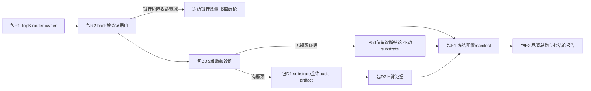

# State KV P4–P6 收官计划

## 现状与剩余缺口

P4/P5 已完成 P4-a/b、P5-a/b/c。剩余三块，按依赖串行、每块内部拆收敛包：

- **P4-c**：router 仍是 [session_observation.py](packages/vz-runtime/src/volvence_zero/agent/session_observation.py) 的 `static-all.v1` 确定性全选；无 per-bank 独立增益与无关银行负对照证据。
- **P5-d**：substrate [residual_backend.py](packages/vz-substrate/src/volvence_zero/substrate/residual_backend.py) 的 `_build_control_delta` 硬编码 `range(3)` + 3×H 固定 basis，同一 delta 打进 middle 三层；无 `U_l` per-layer 调制。设计文档规定它**证据门控**：仅当 3 维控制被证明是瓶颈才做全量。
- **P6**：证据栈（identification / judge court / seed gate / temporal causal / deployment / cost gate）已齐但分散，无冻结配置清单与七结论对照报告。

## 阶段一：P4-c（两包）

### 包 R1：Top-K 语义 router（owner: runtime 装配链）
- 新文件 `packages/vz-runtime/src/volvence_zero/agent/conditioning_router.py`：纯函数 `select_conditioning_banks(user_input, banks, k) -> RouterDecision`。评分 = 语义相关性（`semantic_topic_similarity(user_input, bank.rendered_statement)`，走既有 `volvence_zero.semantic_embedding` SSOT，禁关键词）× confidence × freshness，`is_injectable` 先行硬门，按 `bank_type` 确定性破平。`router_version="topk-semantic.v1"`。
- `FinalRolloutConfig.conditioning_router: WiringLevel = SHADOW`：SHADOW 保持 static-all 行为、router 决策仅记入 lineage 旁路审计字段；ACTIVE 用选择结果真正裁剪 `conditioning_banks`；DISABLED 回滚到 `static-all.v1`。
- 接线点：[session_observation.py](packages/vz-runtime/src/volvence_zero/agent/session_observation.py) `_to_turn_result`（`user_input` 已在作用域），替换 `_STATIC_ROUTER_VERSION` 传参。
- 测试 + spec/DATA_CONTRACT 同步（`personal-conditioning.md` P4-c 节已预留）。

### 包 R2：per-bank 独立增益 + 无关银行负对照证据
- 新增 bank 消融 profile 对（例：`state-kv-bank-personal-only` / `state-kv-bank-relationship-only` / 双 bank / 无 bank），复用既有 arm capability 机制。
- 新脚本 `scripts/run_state_kv_bank_gain_gate.py` + `packages/vz-runtime/src/volvence_zero/state_kv_bank_gain_gate.py`（只读 owner，模式对齐 `state_kv_identification.py`）：每 bank 增益 = 双 bank 对单 bank 消融的输出分叉 + 盲裁判匹配（复用 `LocalEmbeddingBlindJudge` 协议，material 换成对应 bank 的 rendered-state）；无关银行负对照 = 在与 relationship 无关的场景验证注入不产生增益且 router（SHADOW 记录）给低分。产出 `artifacts/state_kv/verdict_bank_gain.json`。
- v3 在统计前以正式 typed external semantic event 建立 repair / steady persona，要求每个 bank 的 owner-rendered material 与 lineage fingerprint 都形成对比，并用 bank-none 盲判检查非 bank persona 泄漏；任一 treatment / isolation 门不成立时只能记 `insufficient_data`，禁止误报因果 `fail`。Relationship compiler v2 追加四个轨迹坐标并版本化 fingerprint，同矩阵 rerun 只提高输出分叉、未产生 blind match gain；max16 2+2 pilot 的 Relationship gain 仍严格为零，下一包冻结为 text-vs-versioned-latent carrier，不扩数据。
- **停止条件内建**（设计 §16.1 第 6 条）：若增益不显著，产出书面结论并冻结银行数量，P6 中如实标注，不继续加 bank。

### 包 R3：Relationship versioned latent carrier
- 冻结通用 `ConditioningBankLatentCarrier` 契约；Relationship owner 仍只发布
  `ConditioningBankReadout`，runtime 只做 scope adaptation 与 carrier 选择，
  substrate 唯一拥有 hidden projection。
- 新增独立 `relationship_conditioning_mode=text|residual`。默认 text；
  `state-kv-bank-relationship-latent-pure` 显式关闭 Personal、prompt state 与
  dynamic residual，只投递 Relationship residual。rollback = text /
  Relationship SHADOW / DISABLED。
- `relationship-conditioning-residual.v2` 使用 neutral-centered signed readout、
  L2-normalized fixed basis 与 `0.12 × confidence × freshness` 硬界；
  generation applied attestation 和 lineage projector version 同步发布。
- 两轮 24-turn text-vs-latent pilot 均通过 source fingerprint、applied 与 prompt
  identity 门，但 blind match 仍为 chance。固定 basis 不晋升；下一包冻结为
  model-derived Relationship projector / Prefix-KV artifact，不扩同构数据。

### 包 R4：Relationship model-derived residual projector
- 冻结 `relationship-conditioning-projector.v1`：纯浮点 basis、精确
  `vector_labels`、model / hidden / hook-layer 兼容字段、逐层 gain、source
  fingerprint 和 canonical artifact id；加载不修改冻结基底。
- `scripts/bake_relationship_conditioning_projector.py` 从 56 条正/负 anchor
  捕获冻结 Qwen2.5-0.5B 中层残差，artifact id
  `8b8adb2694f51533d2c2a8a3ec13d12090a57dbe014df270271f60309b8d9333`。
  runtime 发布 artifact-derived carrier / lineage version，并将 Relationship
  delta 与 Personal layer gain 隔离。
- 同一 24-turn matched pilot 的 source / applied / prompt identity 门全部通过，
  但 none / text / learned residual blind match 仍均为 `0.50`。线性 residual
  路径退出，不提高 scale、不扩同构样本；下一包冻结为专属 Relationship
  Prefix-KV artifact。

### 包 R5：Relationship 专属 Prefix-KV
- 冻结 `relationship-prefix-kv.v1` wrapper，将通用 Prefix generator 绑定到
  Relationship owner schema、精确 14 维 labels 和独立 content id；carrier version
  为 `relationship-prefix-kv-carrier.v1:<artifact_id>`，上限保持 `0.12`。
- runtime 按 Character → Personal → Relationship 顺序独立拼接 Prefix，分别发布
  applied attestation；缺 artifact 或 model / geometry / labels / version / scale 漂移
  均 fail loudly，不回落 residual。profile
  `state-kv-bank-relationship-prefix-pure` 关闭 Personal、prompt state 和 dynamic
  residual，只保留 Relationship Prefix。
- 冻结 Qwen2.5-0.5B 的两轮训练生成 artifact
  `e0d60083731bb7b013c69696c7959a8480d4fa054442d0bde2bb687486dfbb46`；owner-derived
  endpoint 与 pilot probes held out，基底未修改。同一 24-turn matched pilot 的
  source `8/8`、applied `8/8`、prompt identity `4/4` 全通过，但 none / text /
  Prefix blind match 均为 `0.50`。实现完成但不晋升，默认 text + SHADOW；回滚为
  omit artifact、text 或 Relationship SHADOW / DISABLED。

## 阶段二：P5-d（证据门控，三包）

### 包 D0：3 维瓶颈诊断（只读，先跑）
- 诊断脚本量化"生成期控制只用 `z_t` 前 3 维损失了什么"：对同一批 turn 比较全维 `code`（ndim 路径 `DEFAULT_N_Z=16`）与截断前 3 维的解码控制差异 + `dynamic-residual-off` 臂的既有对比。产出 `verdict_control_dim_diagnostic.json`。
- **门**：无可测瓶颈 → P5-d 到此为止，写书面结论（保留 3 维现状），直接进阶段三。

### 包 D1：substrate 全维 basis + per-layer 调制 artifact（仅 substrate，不碰控制器）
- `_build_control_delta` 从 `range(3)` 泛化为 `range(basis_rank)`；新版本化 control artifact（模式对齐 `personal_conditioning_projector.py` 的 `basis_rows + layer_indices + layer_gains`，但独立 artifact 类型，勿混用）承载 n_z×H basis 与 per-layer `λ_l`——这就是 `U_l(z_t, p_selected, h)` 的第一形态（p_selected 以 bank 选择摘要作为标量门先接入）。
- 默认行为字节不变（无 artifact 时保持 rank-3 sinusoid）；artifact 安装走 `install_control_basis` 并补 ModificationGate/pre-import 门控（当前直装无门，是本包要修的旁路）。

### 包 D2：H 臂证据
- profile `dynamic-residual-full` 对照现状 3 维（已有 `dynamic-residual-off` 三态齐全），复用 identification/judge 栈跑 H 对 3 维控制的增量。退出条件即设计 P5 门：H 有增量、SHADOW→ACTIVE 有独立证据与回滚。

## 阶段三：P6（两包）

### 包 E1：冻结配置 manifest
- `artifacts/state_kv/due_diligence/freeze_manifest.json`：锁定模型指纹、arm profile 清单、seeds、场景集、指标定义、judge panel 版本（对齐 §11.1 的同基底/同种子/盲评要求）。生成脚本 + schema 校验测试。

### 包 E2：尽调总跑 + 七结论对照报告
- 编排脚本按 manifest 依次跑：已实现臂（A/A-pure/B′/E/E-pure/G-pure/H/I≈credit-feedback-SHADOW/J=credit-feedback-ACTIVE）+ 负对照（错用户/撤销/冷启动，均有既有 lane）+ cost gate + deployment 安全门。
- 产出 `verdict_due_diligence.json`：§11.3 七结论逐条映射到实验 ID 与 artifact 指纹；**未实现/未证明项如实标注**——结论 1 的 B/C/D 臂（人工 prompt/RAG/LoRA）与结论 7 的 World/Env/Object 银行本仓库尚未实现，标 `not-yet-proven`，不包装。这符合 P6 退出条件原文（"未通过项被明确标为尚未证明"）。
- J 对 I 的"随轮次增长"用长 session 对比（P5-c 已备好 J/I 臂 profile），窗口不足则如实标 `insufficient-window`。

## 执行约定

- 计算在本地 CPU 冻结 Qwen2.5-0.5B（与既有全部 verdict 同基底），证据 run 均可本地复现。
- 每包完成即 ruff + 相关 pytest；跨契约包追加 `tests/contracts`。既有 2 个 contracts 失败（narrative_arc / no_lscb）为已知无关项。
- 基底（D1）与控制器/装配（R1、D2）改动严格分包；每包独立可回滚（wiring 三态或 artifact 版本）。
