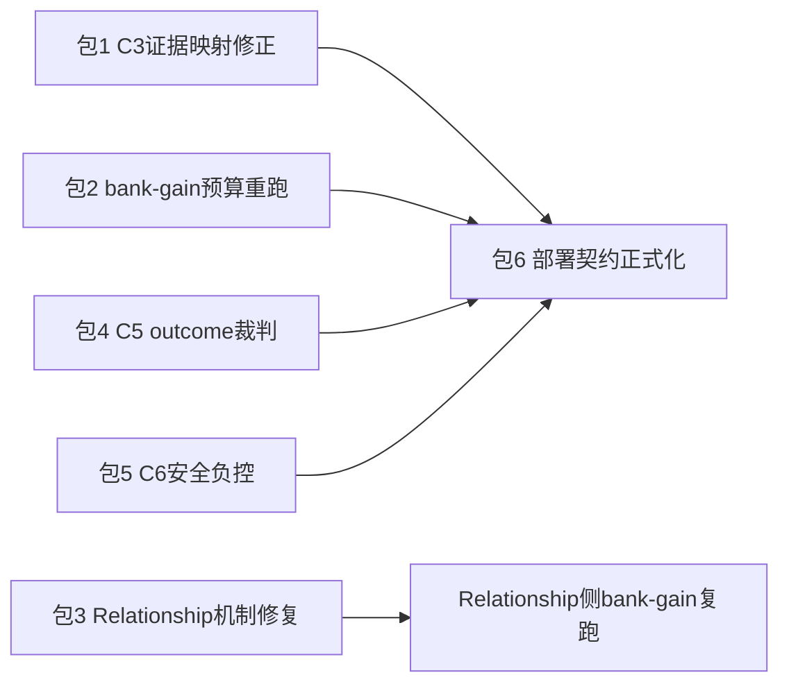

# State KV 剩余证明计划（CPU/MPS，六个收敛包）

## 现状基线（调查结论）

- **已证明**：Personal Prefix-KV 全链路（P4 机制、P3/P2 识别 retain-strict、3 seed、双裁判 court、temporal causal、deployment gate、cost gate、quality 非劣效 Δ≈+0.45）。
- **未证明**：尽调 `state-kv-due-diligence.v1` 为 `partial`（仅 C2 proven）。卡点：bank-gain 盲判增益 0.0（尽调强制 `max_new_tokens=4`，max16 pilot 里 Personal 已有 +0.25 方向信号）；Relationship Prefix-KV 物理接通但 blind match 0.50；credit-longitudinal 缺冻结 outcome 裁判；C3 的 freeze 还绑着旧 artifact 的 P4 fail 结果；部署绑定靠 `_legacy.py` 特殊分支。
- **范围外（已确认）**：情节事实记忆维持反主张（设计冻结决策 #7）；C1-LoRA 臂、C4 control-dim、C7 三个新 bank 等 GPU/机制项后置。

## 包依赖关系

## 包 1 — C3 证据映射修正（只读，最便宜，先做）

**根因**：`artifacts/state_kv/due_diligence/freeze_manifest.json` 的 carrier diagnostics 绑的是旧 `teacher-distilled-prefix-v1` 的 `p4-diagnostics/`（Gate A fail），而标准 artifact `8064f8b6…` 的 `p4-state-strategy-routed/`（Gate A pass，`carrier_is_live=true`）没进 freeze。

**做法**：
- 改 [scripts/run_state_kv_due_diligence.py](scripts/run_state_kv_due_diligence.py) / [state_kv_due_diligence.py](packages/vz-runtime/src/volvence_zero/state_kv_due_diligence.py) 的 C3 映射，消费标准 artifact 的 P4 verdict + P3 五臂对照（e-pure residual 无分叉 vs g-prefix retain-strict = "相对残差有增量"；Gate A pass = "不退化为偏置"）。
- 重跑 due diligence report（只读聚合，不重跑模型）。
- 同步 [docs/specs/evidence_program.md](docs/specs/evidence_program.md)。

**退出判据**：C3 → proven，尽调 2/7。回滚：新 freeze id，旧 report 保留。

## 包 2 — bank-gain 生成预算重跑（Personal 独立增益）

**根因假设**：尽调编排强制 `max_new_tokens=4`，4 token 回复几乎不携带 persona 信号；max16 pilot 中 Personal gain 已到 +0.25（CI 0..0.75，n=4 太小）。这是预算受限导致的判别力不足，不是"扩同构样本追分"——预注册后按 P3/P2 的正式预算（48 tokens）重测。

**做法**：
- 预注册 bank-gain v4 config：`max_new_tokens=48`、temperature 0、同四臂/2 personas、gain probes 从 4 扩到 8（预注册声明这是判别力需求）、judge `BAAI/bge-m3` + `moka-ai/m3e-base` 双裁判复核。
- 跑 [scripts/run_state_kv_bank_gain_gate.py](scripts/run_state_kv_bank_gain_gate.py)（MPS 优先），输出到新目录，不覆盖 v3。

**退出判据**：Personal `blind_match_gain` CI 下界 > 0 且 isolation/negative control 全过 → Personal 独立增益 proven。Relationship 侧预期仍 0，冻结等包 3。若 Personal 在 48-token 预算下仍为 0，则如实冻结为预算无关的增益失败，禁止继续扩样本。

## 包 3 — Relationship Prefix-KV 机制修复（最大的一个包）

**根因**：相对 Personal 成功配方，训练压力系统性偏弱——无 wrong-user margin/control（Personal 有且 0.875）、24 vs 128 样本、2 vs 3 epochs、16 vs 48 token target、状态几何是 1D repair↔steady 插值而非 2D 轴外推。硬约束：`norm_cap=0.12` 不许抬、不许扩同构评测样本。

**做法**（改 [scripts/train_relationship_prefix_kv.py](scripts/train_relationship_prefix_kv.py)，对齐 [scripts/train_state_kv_prefix.py](scripts/train_state_kv_prefix.py) 的成功要素）：
- 加 wrong-user margin loss + 训练后 wrong-user control 独立测量。
- 状态采样升级为 owner 14 维空间的双正交轴外推（eval endpoint 与 probe 继续 held out）。
- 128 samples / 3 epochs / target 48 tokens；route objective 保持 `route_weight=1.0`。

**证据阶梯**（复用 Personal 阶梯，逐级晋升）：
1. bake → `wrong_user_control_accuracy` 显著高于随机（参照 Personal 0.875）；
2. Relationship 版 P4 机制门（Gate A/B）；
3. 24-turn none/text/prefix matched pilot（[scripts/run_state_kv_relationship_carrier_pilot.py](scripts/run_state_kv_relationship_carrier_pilot.py)）blind match CI 下界 > 0.5；
4. 通过后才扩 held-out persona/probe + 双裁判识别 lane；
5. bank-gain v4 Relationship 侧复跑。

**退出判据**：任一级失败即冻结为新一次否证并停止同构调参。回滚：新 artifact id，省略参数回 text+SHADOW。

## 包 4 — C5 outcome 裁判接线（credit-longitudinal）

**根因**：credit-longitudinal 机制 claim 已过（growth 0.0198），但 `matched_outcome_improved=None`，缺冻结的 matched outcome 裁判。

**做法**：把既有 `LocalEmbeddingBlindJudge` 双裁判（bge-m3 + m3e）作为冻结 outcome 裁判接入 [state_kv_credit_longitudinal.py](packages/vz-runtime/src/volvence_zero/state_kv_credit_longitudinal.py) 的 outcome claim，预注册阈值后重跑 10-session I/J lane（CPU）。evaluation 保持只读（R12），不回灌任何 owner。

**退出判据**：`matched_outcome` 有明确 pass/fail 终态（配合包 2/3 的 bank-gain 结果共同决定 C5）。

## 包 5 — C6 安全负控补齐

**根因**：deployment gate 已验撤销/冷启/隔离/回滚，但 C6 还差"过期状态负控"与"潜状态不可抽取"两条证据。

**做法**（新 evidence lane + spec，CPU 可跑）：
- 过期/陈旧 conditioning 负控：构造过期状态，断言输出 baseline-equivalent 且 `applied=false`。
- 抽取攻击 lane：对 G 臂输出做对抗性探针（直接询问内部状态 + embedding/线性探针从输出反推 16 维状态），断言抽取精度低于预注册阈值且不泄漏数值。

**退出判据**：C6 → proven。

## 包 6 — 部署面契约正式化（依赖包 1/2/4/5 结果）

**根因**：`personal_conditioning_prefix_artifact_id` 不是 `FinalRolloutConfig` 字段，`apply_to_config(state-kv-active-v1)` 会 raise，正式路径靠 `_legacy.py` L8088 特殊 builder；默认 `pe-eta` 切 ACTIVE 被文档限制为显式 opt-in。

**做法**：
- 把 prefix artifact 绑定升为正式 config/runtime 契约（`FinalRolloutConfig` 字段 + fail-loudly 校验 + 守门测试），消除 `_legacy` 特殊分支。
- 写默认切换预案：`pe-eta` 从 SHADOW → ACTIVE 的 WiringLevel 迁移包 + 回滚开关测试；**触发条件文档化**为"尽调 C2/C3/C5/C6 proven 且 Personal bank-gain pass"，本轮不执行切换。
- 同步 [docs/specs/profile-registry.md](docs/specs/profile-registry.md)、[personal-conditioning.md](docs/specs/personal-conditioning.md)、DATA_CONTRACT。

## 显式后置项（含触发条件）

- **C1 对照臂**：manual prompt / RAG 臂 CPU 可做（可作为可选第 7 包），matched LoRA 臂 gate on GPU（debt #41 同款资源）。
- **C4 control-dim**：属 ETA 动态残差机制问题，保留 rank-3；触发条件是控制维学习出现新机制证据。
- **C7 World/Env/Object bank**：未实现且 bank 数量冻结中；触发条件是 Relationship 增益先过（包 3）。
- **情节事实记忆**：维持反主张，不立项（冻结决策 #7）。
