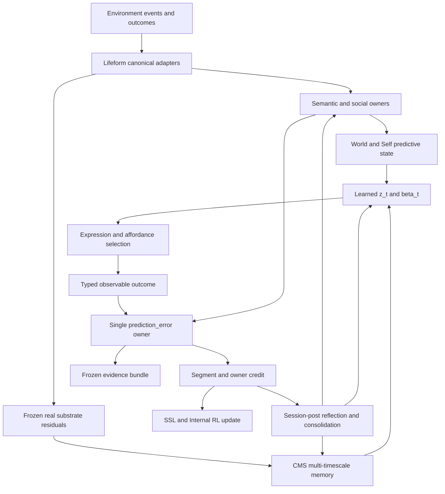

# VolvenceZero 12 个月 Cognitive AGI 架构提升计划

## 2026-07-13 实现状态审计

本计划中的 `completed` 只表示代码/契约与对应 synthetic acceptance 已落地，
不等于真实 GPU trace、retain evidence 或默认 ACTIVE 晋升已经完成。

- `evidence-baseline`：**in progress**。Windows P1 run manifest、实际权重
  SHA256、bootstrap provenance、跨家族 judge gate 与一键编排已落地；首个
  五轨真 Qwen P1 尚未执行，Linux retain lane 仍未建立。
- `learned-shadow`：**implementation completed / real evidence pending**。
  ndim 与四个 SHADOW backend 代码可运行，但默认仍为 `n_z=3` + 四 backend
  `DISABLED`；Windows CUDA 不作为 ACTIVE evidence。
- `action-loop`：**partial**。canonical routing、dialogue/tool/scene/ingestion
  outcome lineage、PE/credit 已接；companion per-turn affordance publisher
  已补齐。自主 followup settlement 与 credit→authoritative learned update
  尚未闭合。
- `predictive-pe`：**implementation completed / promotion pending**。
  world/self heads 是 SHADOW readout，尚未通过真实 trace 晋升门。
- `long-horizon`：**partial / in progress**。owner hydration、tick/followup
  scaffold 与 thinking artifact producer 已存在；20+ session continuity、
  thinking→temporal 生产 consumer、24h autonomous safety gate 尚未完成。
- `learned-active`、`social-learning`、`causal-evidence`、
  `production-verdict`：仍 pending。CompanionBench Windows P1 只能产生
  directional 结果，不能替代这些阶段。

## 1. 最终目标与不可妥协的判断标准

本计划不以“增加模块、owner、spec 或测试数量”为成功标准，而以以下四个结果同时成立为终点：

1. **学习真实性**：`z_t / beta_t`、Internal RL、CMS 自适应与 world/self prediction head 在真实 substrate trace 上成为 authoritative learned path，而不是默认回退到手工 float 算子。
2. **行动闭环**：每个外部行动都有 pre-action prediction，工具/表达/scene outcome 经 canonical `EnvironmentOutcome` 回到唯一 `prediction_error` owner，再进入 segment credit、memory、temporal 与 reflection。
3. **长期认知连续性**：world/self/social owners、memory、vitals、commitment、regime 与 temporal state 能跨 scene/session 有界续接，且不会跨用户泄漏或形成第二 owner。
4. **因果证据**：完整系统在同 substrate、同 prompt/context budget、同 judge/human protocol 下，稳定优于 raw、memory/RAG、agent framework、cold bootstrap，并且 PE、ETA、主动学习各自具有正向因果贡献。

12 个月末只允许四种结论：

- `first-stage-retained`：五条 thesis claim 全 retain，可以称“人类世界模型第一阶段成立”。
- `product-companion-retained`：关系连续性和长期适应有效，但核心组件消融不 retain，收缩为强 companion / adaptive product 架构。
- `architecture-platform-only`：pipeline 不优于 raw 或标准 wrapper，定位为认知运行时与研究平台。
- `inconclusive`：样本、seed 或人评不足，不允许用局部 demo 替代结论。

## 2. 总体优先级

### P0：先把证据与真实学习主干点亮

- 冻结真实 substrate、judge、seed、artifact provenance 和 promotion gate。
- 将 temporal SSL、runtime forward、Internal RL 从 DISABLED 推进到 SHADOW，再逐个 ACTIVE。
- 完成 8 臂同基底矩阵，避免架构升级变成不可证伪的新 scaffold。
- 闭合 affordance/action prediction/outcome/PE/credit 的真实行动链。

### P1：从 PE 校准器升级为可预测认知模型

- 在唯一 `prediction_error` owner 内建立 world/self learned prediction heads。
- 让 semantic/social owners 发布 typed pre-action prediction 与 post-outcome evidence，不新增平行 PE owner。
- 将 ToM、common ground、groups 从状态 scaffold 推进为 PE-weighted learning owners。
- 让 thinking、vitals、followup 和 cross-session hydration 进入真实长期行为闭环。

### P2：规模化、生产化与罕见重训练

- 建立 capacity→gain 曲线、长期抗遗忘曲线和 20+ session 真实纵向证据。
- 将 rare-heavy 保持离线、受 ModificationGate 守门，不把基底训练与在线控制器更新混为一个包。
- 只有在 retain evidence 成立后才改变默认 wiring；否则保持 SHADOW 或回滚。

## 3. 目标架构

架构边界保持不变：

- `lifeform-*` 负责 Observe / Act / service autonomy，不拥有 kernel cognition。
- `vz-contracts` 只拥有共享不可变契约。
- `vz-cognition` 保持唯一 PE、semantic/social state 与 credit owners。
- `vz-temporal` 保持 `z_t / beta_t` 与 Internal RL owner。
- `vz-memory` 保持 CMS 与记忆连续谱 owner。
- `vz-runtime` 只做编排，不重建 owner 内部状态。
- 真实 substrate 在 live runtime 冻结；控制器、memory 与 prediction heads 承担在线学习。

## 4. 执行纪律：收敛包与证据门

每个实现包必须满足：

- 只解决一个 owner 或一个正式 adapter 边界。
- 只冻结一个快照契约。
- 只切一个主要 consumer。
- 主要修改控制在 3–8 个文件。
- 先补 spec、claim 和 acceptance，再进入 SHADOW。
- SHADOW 必须证明无副作用、可比较、可回滚。
- ACTIVE 必须有真实 trace、matched control、validation delta 和 rollback drill。
- 基底层改动与控制器层改动分包。
- 新 owner 只有在现有 owner 无法表达该状态时才允许；本计划原则上不新增 kernel cognition owner。

每个 PR 必须回答：

1. 改变哪条 claim 或哪个 acceptance gate？
2. owner、publisher、consumer 分别是谁？
3. DISABLED / SHADOW / ACTIVE 各自语义是什么？
4. 失败时如何恢复 checkpoint 与旧 wiring？
5. 哪个 frozen artifact 能证明它，而不是只证明 wiring？

核心工作流依据 [`cursor-convergence-workflow.mdc`](E:/VolvenceZero/.cursor/rules/cursor-convergence-workflow.mdc)。

## 5. Phase 0：第 1 月，冻结基线与实验基础设施

### CP-00：真实证据运行环境

目标：建立后续所有 ACTIVE 晋升共同使用的 Linux CUDA evidence lane。

关键位置：

- [`final_wiring.py`](E:/VolvenceZero/packages/vz-runtime/src/volvence_zero/integration/final_wiring.py)
- [`session.py`](E:/VolvenceZero/packages/vz-runtime/src/volvence_zero/agent/session.py)
- [`evidence_program.md`](E:/VolvenceZero/docs/specs/evidence_program.md)
- [`human-world-model-ablation.md`](E:/VolvenceZero/docs/specs/human-world-model-ablation.md)

交付：

- 固定真实 substrate fingerprint，建议主线 Qwen 1.5B，0.5B 仅筛参，7B 作为上限验证点。
- 固定 user simulator 与 judge 必须跨 substrate 家族。
- 固定 seed schedule、依赖版本、git SHA、working tree clean、artifact SHA256。
- 建立 `ci-smoke`、`paper-suite-small`、`paper-suite-full` 三层，不允许把 smoke 结果用于论文或融资结论。
- 建立统一 `evidence_bundle.json` 入口，包含 substrate fingerprint、pairwise effects、bootstrap CI、leakage attestation、judge bias 与 human anchor。

退出条件：

- 一条命令可生成可复算的 frozen bundle。
- artifact 缺 manifest、seed 或 fingerprint 时 fail loudly。
- Windows+CUDA 不作为 retain evidence 环境。

### CP-01：当前默认行为冻结

- 冻结 n_z=3、四 torch backend DISABLED、synthetic/default session、匿名无持久化的 baseline profile。
- 记录 turn latency、memory drift、switch sparsity、PE 四轴、credit closure、regime churn、F1–F6 family report。
- 将 [`learned-vs-heuristic-coverage.md`](E:/VolvenceZero/docs/specs/learned-vs-heuristic-coverage.md) 作为每季度更新的 learned coverage SSOT。

退出条件：相同 seed 与相同 profile 能重放出一致 baseline；否则禁止进入模型升级。

## 6. Phase 1：第 2–3 月，打通真实表征与行动入口

### CP-02：解锁 ndim temporal controller

Owner：`vz-temporal` 的 `MetacontrollerParameterStore`。

主要文件：

- [`temporal/interface.py`](E:/VolvenceZero/packages/vz-temporal/src/volvence_zero/temporal/interface.py)
- [`metacontroller_components.py`](E:/VolvenceZero/packages/vz-temporal/src/volvence_zero/temporal/metacontroller_components.py)
- [`joint_loop/runtime.py`](E:/VolvenceZero/packages/vz-temporal/src/volvence_zero/joint_loop/runtime.py)
- [`final_wiring.py`](E:/VolvenceZero/packages/vz-runtime/src/volvence_zero/integration/final_wiring.py)

动作：

- 将生产候选 latent dimension 从 3 解锁到 16，但保持 torch backend DISABLED。
- 保留 n_z=3 checkpoint 与 profile 作为精确 rollback baseline。
- 快照 schema 保持 tuple/vector，不把 tensor 暴露出 owner。
- 同步 [`temporal-abstraction.md`](E:/VolvenceZero/docs/specs/temporal-abstraction.md)。

退出条件：

- ndim encoder/switch/decoder 参数被真实实例化。
- 全部 contract 和 snapshot tests 无变化。
- n_z=16 在 DISABLED backend 下不产生不可解释行为漂移。

### CP-03：Canonical Environment Routing Closure

目标：完成 `system_tick`、`scene_event`、`followup_due`、`internal_drive` 的 canonical event 路径。

主要文件：

- [`lifeform.py`](E:/VolvenceZero/packages/lifeform-core/src/lifeform_core/lifeform.py)
- [`environment.py`](E:/VolvenceZero/packages/vz-contracts/src/volvence_zero/environment.py)
- [`session.py`](E:/VolvenceZero/packages/vz-runtime/src/volvence_zero/agent/session.py)
- `lifeform-service` 的 session/task orchestration。

原则：

- 不新增 Environment owner；它只是 lifeform/kernel 边界协议。
- tick/scene/followup adapter 不直写 memory、regime、temporal 或 social owner。
- 每个 event 有 actor、speaker、audience、subject、scene、provenance、consent 与 trigger kind。

退出条件：[`environment-interface.md`](E:/VolvenceZero/docs/specs/environment-interface.md) 的 `canonical-event-routing` 从 partial 变为 satisfied。

### CP-04：Affordance Per-Turn Publisher

Owner：`lifeform-affordance.AffordanceModule`，仍位于 lifeform 层。

主要文件：

- `packages/lifeform-affordance/src/lifeform_affordance/module.py`
- `packages/lifeform-affordance/src/lifeform_affordance/scorer.py`
- `packages/lifeform-affordance/src/lifeform_affordance/tool_loop.py`
- [`lifeform.py`](E:/VolvenceZero/packages/lifeform-core/src/lifeform_core/lifeform.py)
- `packages/lifeform-expression/src/lifeform_expression/prompt_planner.py`

动作：

- 每 turn 读取上一轮 public `temporal_abstraction`、boundary/consent、tool policy 与 registry snapshot。
- 发布 lifeform-side `affordance` snapshot，供 prompt planner 与 tool loop 消费。
- z_t 只影响 learned candidate scoring；禁止 descriptor name、用户文本关键词或硬编码工具路由。
- invoker 继续通过 `submit_tool_result` 回流，不直写 kernel owner。

迁移：

- SHADOW：计算候选但不 render、不 invoke。
- ACTIVE：只有 selection margin、安全 gate、cost/reversibility 与 tenant allowlist 全满足才执行。
- DISABLED：不构造 module。

退出条件：

- 扰动 z_t 能改变候选分布，但相同 z_t 与不同文本关键词不会触发规则式切换。
- 未授权工具 fail loudly 并给出 typed blocked reason。
- Coding vertical 首次形成真实 `z_t → tool → outcome` e2e。

## 7. Phase 2：第 3–5 月，四个 learned backend 全部进入 SHADOW

### CP-05：Temporal SSL SHADOW

Owner：`MetacontrollerSSLTrainer`。

- 对真实 residual trace 运行 torch SSL。
- SHADOW 只生成 loss、KL、switch sparsity 和候选 checkpoint，不写 live parameter store。
- pure 与 torch 前向差异、延迟和 determinism 必须进入 artifact。

退出条件：prediction loss 与 KL 行为符合 strict ETA；无未来信息泄漏到 causal runtime。

### CP-06：Temporal Runtime Forward SHADOW

Owner：`FullLearnedTemporalPolicy`。

- live path 仍使用 pure baseline，torch 对同输入双跑。
- 比较 `z_t`、`beta_t`、closed segments、action family、latency。
- parity 只作为工程 gate，不作为能力证明；能力证明来自 held-out behavior gain。

退出条件：数值 parity 与延迟 gate 通过；SHADOW 不改变 active snapshot。

### CP-07：Internal RL SHADOW

Owner：`InternalRLSandbox / CausalZPolicy`。

- 在 z 空间运行真实 PPO/GAE，不做 token RL。
- reward 只来自 PE-derived segment credit，不直接消费 evaluation score。
- 先在离线 proof episode 击败 no-optimize control，再进入真实 trace SHADOW。

退出条件：terminal return、delayed credit closure 与 policy checkpoint 可复现；无 reward leakage。

### CP-08：CMS Torch SHADOW

Owner：`CMSMemoryCore`。

- 保持当前 CPU PE-gate + ATLAS replay ACTIVE。
- torch band 双跑但不写 W1/W2。
- 比较 old knowledge retention、新知识 absorption、band drift 与 replay stability。

退出条件：torch/pure forward parity；SHADOW 无 memory snapshot 副作用。

### CP-09：Strict ETA Evidence Gate

- `alpha` 增大应带来可控 switch sparsity，而不是全部不切换或每步切换。
- held-out action family reuse 应优于无 bottleneck/no-optimize。
- causal policy 必须逼近 non-causal posterior，但部署路径不读取未来状态。
- action family 的行为意义必须通过未见任务迁移证明，而不是由预设标签解释。

Kill：strict ETA 不成立时，不得将 torch backend ACTIVE；保留 pure baseline 并重新评估 ETA 是否是正确机制。

## 8. Phase 3：第 4–6 月，建立 pre-action prediction 与单一 PE 世界模型

### CP-10：Pre-Action Prediction Issuance

唯一 owner：`PredictionErrorModule`；`plan_intent` 与 `execution_result` 只提供 typed input/evidence。

主要文件：

- [`prediction/error.py`](E:/VolvenceZero/packages/vz-cognition/src/volvence_zero/prediction/error.py)
- `packages/vz-cognition/src/volvence_zero/semantic_state/owners.py`
- [`session.py`](E:/VolvenceZero/packages/vz-runtime/src/volvence_zero/agent/session.py)
- `lifeform-affordance/tool_loop.py`

动作：

- affordance、expression、scene-close 和 ingestion 行动前签发 `prediction_id`。
- prediction 描述 expected observable outcome、confidence、track、segment、abstract action、regime、affordance、cost/reversibility。
- renderer/invoker 不得伪造 prediction；它们只转发 owner 发布的引用。

退出条件：每个可产生外部效果的动作都能由 outcome 追溯到 prediction；无法预测的动作必须显式标记 unknown，而不是省略 lineage。

### CP-11：World/Self Predictive Heads SHADOW

Owner：仍为 `PredictionErrorModule` 内部 learned heads，不新增 slot。

- `_WorldPredictiveHead` 预测 task/action/regime outcome。
- `_SelfPredictiveHead` 预测 relationship/trust/repair/boundary outcome。
- 输入来自 frozen substrate features、world/self temporal snapshot、semantic owner compact readouts 与 memory snapshot。
- online-fast 用 bounded SGD/validation gate；session-medium export checkpoint；rare-heavy 只做离线候选。

迁移：

- 与当前 hand-crafted `_PredictionErrorHead` 双跑。
- 200 turn SHADOW 上 RMSE/校准改善不足 0.02 时保持 SHADOW。
- evaluation decoupling 在同包中只做 readout 对照，不允许 evaluation 成为训练标签。

Kill：world/self heads 不能超越固定校准器，或 self reward 与自身 readout 高度自相关时，停止 ACTIVE 晋升。

### CP-12：Owner Prediction Signal Contract

不要新增平行 PE。新增/扩展一个共享 immutable signal，使 semantic/social owner 可以发布：

- source owner / slot / scope / track。
- prediction kind 的闭集 typed enum。
- compact predicted vector、confidence、prediction id。
- outcome evidence 与 settled vector。
- owner 自己描述语义，不发布 task/relationship axis error。

PE owner 才计算 mismatch；social lifter 只转发，不计算第二套 error。

首先覆盖五个高价值 owner：

- `relationship_state`
- `commitment`
- `boundary_consent`
- `execution_result`
- `goal_value`

随后覆盖：

- `plan_intent`
- `open_loop`
- `belief_assumption`
- `user_model` 的 aggregate pacing/readout

同步：

- [`DATA_CONTRACT.md`](E:/VolvenceZero/docs/DATA_CONTRACT.md)
- [`prediction-error-loop.md`](E:/VolvenceZero/docs/specs/prediction-error-loop.md)
- [`semantic-state-owners.md`](E:/VolvenceZero/docs/specs/semantic-state-owners.md)

退出条件：消费者无需读取 owner 内部字段或 raw text 即可完成 prediction settlement。

## 9. Phase 4：第 5–7 月，闭合 outcome→PE→credit→policy

### CP-13：Outcome Lineage 全覆盖

- tool result：保持已有 `prediction_id / outcome_id` 端到端路径。
- expression：建立用户响应/明确反馈/下一 turn evidence 与 prior prediction 的 settlement。
- scene：scene close、rupture、repair、commitment progress 有 typed outcome。
- ingestion：envelope provenance 能进入 PE lineage，但知识内容不被直接当作 reward。
- tick/followup：proactive action 结果在后续事件中结算。

退出条件：[`environment-interface.md`](E:/VolvenceZero/docs/specs/environment-interface.md) 的 `outcome-links-to-prediction` 全面 satisfied。

### CP-14：PE Segment Credit 默认接线

依据 [`emergent-action-abstraction.md`](E:/VolvenceZero/docs/specs/emergent-action-abstraction.md)：

- segment closure 只来自 temporal owner 的 `beta_t`。
- credit 只从 PE snapshot 与 temporal snapshot 派生。
- 不新增 delayed outcome ledger 或 action trace owner。
- credit context 保留 affordance、prediction、event、outcome lineage。

退出条件：跨多 turn 工具任务能把 delayed outcome 归因到正确 abstract action；segment mismatch 返回空集合并显式记录，不返回隐式 fallback。

### CP-15：Internal RL ACTIVE Candidate

前置：CP-05/06/07/09/14 全绿。

- 首先 runtime forward ACTIVE，SSL 与 Internal RL 仍 SHADOW。
- 然后 SSL ACTIVE，验证真实 writeback 与 checkpoint restore。
- 最后 Internal RL ACTIVE，验证 segment credit 对 held-out task 的增益。
- 每次只 flip 一个字段，不允许四 backend 一次性 ACTIVE。

晋升条件：

- ≥500 turn 真实 trace。
- validation delta ≥ 0.02。
- PE-off/ETA-off 对照方向正确。
- rollback drill 可恢复 snapshot 与行为分布。
- latency/SLO 与 safety gate 不恶化。

## 10. Phase 5：第 6–8 月，社会认知从 scaffold 变为 learned owner

### CP-16：ToM 四 owner PE-Weighted Learning

Owners：`belief_about_other`、`intent_about_other`、`feeling_about_other`、`preference_about_other`，保持彼此独立。

- LLM 只能产生 structured proposal，不能成为 truth owner。
- owner 发布各自 pre-action prediction 与 post-outcome evidence。
- PE epistemic 分量控制 promote/retire，不用关键词、prompt 标签或静态 persona 路由。
- `user_model` 退回 aggregate user pacing/continuity，不与 ToM 重复拥有 belief/intent/feeling/preference。
- durable promotion 只发生在 session-medium/background-slow。

验收：

- false-belief、intent follow-through、affect misread、preference stability 四类测试互不串扰。
- 同一人不同状态与不同人相同状态均能区分。
- proposal coverage 上升不能牺牲 precision 或产生跨用户污染。

### CP-17：Common Ground Learned Resolution

Owner：`CommonGroundModule`。

- 以 role、audience、ToM summary 与 shared atoms 的 embedding 表征做 bounded k=2 reference prediction。
- repair/clarification 产生 common-ground PE；owner 自己 promote/retire atoms。
- 禁止 renderer 从“我们、之前、那个”等字符串推断 common ground。

晋升条件：同 dyad 重复 clarification rate 显著下降，且 atom 数受控、无无限增长。

### CP-18：Groups SHADOW→ACTIVE

Owner：`GroupModule`。

- group identity 来自 canonical EnvironmentFrame membership，不从文本猜测。
- joint commitment 复用 commitment owner 的 group scope，不复制 commitment truth。
- group regime 通过 R14 持久化；group PE 必须展示无法完全归约到 individual PE 的增量。

Kill：若 group-level signal 100% 可由 individual owners 解释，则 groups 保持 SHADOW，不为理论完整性强行 ACTIVE。

### CP-19：Dual-Track Learned Gate

- 替换固定融合权重为 bounded learned gate，但 World/Self owner 仍隔离。
- World 与 Self 轨分别消费 track-tagged owner prediction signals。
- 加入 counterfactual readout：候选 z_task 对 relationship outcome 的预测只作 SHADOW readout，未经 external anchor 不进入 reward。

Kill：self-confirmation 相关性高于 external outcome 相关性时，禁止 relational soft verifier 进入 RL。

## 11. Phase 6：第 7–9 月，长期自主与中频思考

### CP-20：Autonomous Tick / Followup Loop

Owner：lifeform/service orchestration，不是 kernel cognition owner。

- service 按 budget 推进 `advance_tick`。
- vitals 超阈值时产生 canonical `FOLLOWUP_DUE` event。
- followup 必须经过 boundary/consent、cooldown、cost 与 tenant policy。
- followup action 同样需要 prediction/outcome/PE lineage。
- 多 tenant / 多 ai_id 下有 tick budget、LRU sleep、暂停与恢复。

退出条件：24 小时模拟 idle arc 中主动行为不洪泛、不会跨 consent boundary，且 user-turn P95 延迟恶化小于 8%。

### CP-21：Thinking Artifacts ACTIVE Consumer

- thinking worker 继续只读 snapshot，产出 immutable artifact。
- fingerprint mismatch 必须 STALE，不允许重试 apply。
- world/self temporal owner 消费 compact controller pressure advisory；不让 thinking 成为第二 temporal owner。
- provisional case 仍由 `case_memory` owner 决定 reconcile。
- expression 只能使用 owner-approved advisory，不直接消费 worker 私有结构。

晋升条件：F4 learning-quality 不下降，且 thinking-on 相对 thinking-off 在 held-out multi-session task 有正向 CI。

### CP-22：Cross-Session Hydration Closure

- 明确哪些 owner 必须 hydrate：semantic state、followup、vitals、protocol registry、memory。
- 对 regime/world_temporal/self_temporal 做“实现 hydration 或明确不 hydrate”的 owner-by-owner 决策。
- 复用 `HydratableOwnerProtocol`，外部 store 不直写 owner 内部。
- 每个 owner 都有 round-trip、version mismatch、cross-user isolation 与 corrupt payload fail-loud tests。

退出条件：同 scope 的 20+ session continuity 可复现；不同 tenant/end_user/ai_id 零泄漏。

## 12. Phase 7：第 8–10 月，CMS 与 capacity→gain

### CP-23：CMS Torch ACTIVE Candidate

前置：CP-08 SHADOW 与 500+ turn longitudinal trace。

- torch W1/W2 writeback 逐 band 开启，不一次性替换全部 cadence。
- CPU path 保持精确 rollback baseline。
- 衡量 old knowledge retention 与 new knowledge absorption，不能只看新知识拟合。
- 与 retrieval quality、relationship continuity、wrong-person memory leakage 联合评估。

晋升条件：新知识吸收显著改善，旧知识保持不劣，跨 session retrieval 不退化，rollback drill 通过。

### CP-24：Capacity→Gain Ladder

实验轴：

- `n_z ∈ {3,16,64,256}`。
- PE critic 容量 × {1,2,4}。
- COCOA head hidden × {8,32,128}。
- backend 组合：runtime only、runtime+SSL、+Internal RL、+CMS torch。
- trace：500 / 1000 turn。
- substrate：0.5B 筛参、1.5B 主实验、7B 上限验证。
- 至少 3 seed，关键结论 5 seed。

指标：

- temporal switch sparsity、segment precision、action-family reuse。
- held-out task success、delayed credit closure。
- PE calibration、epistemic improvement。
- memory retention/absorption。
- Companion F3、F4、F5 与安全 F6。
- latency、GPU memory、rollback frequency。

Retain：容量扩大产生稳定正斜率且尚未饱和；否则保留较小模型并诚实声明 scale 未证。

## 13. Phase 8：第 9–11 月，同基底 8 臂因果验证

依据 [`human-world-model-ablation.md`](E:/VolvenceZero/docs/specs/human-world-model-ablation.md)，完成：

- `raw`
- `memory-only`
- `RAG`
- `agent-framework`
- `LoRA-adapter`
- `PE-off`
- `ETA-off`
- `active-learning-off / random-sampling`
- `volvence-cold`
- `volvence`

虽然名称上超过八行，最终 matrix 应以五条 claim 所需的最小 matched controls 组织，不允许遗漏组件因果臂。

实验分层：

### P0 Wiring

- synthetic/fake，仅验证 schema、fingerprint、runner、artifact。
- 不产生任何可外引结果。

### P1 Directional

- 24 public scenarios、1 seed、全臂或先 5 主臂。
- 只判断方向与成本，不做 retain。

### P2 Retain

- 24 public + 96 held-out。
- 3 seeds 起步；CI 触零的 claim 增至 5 seeds。
- 同 substrate、同 prompt/context budget、同 user-sim、跨家族 judge。
- bootstrap 保守下界 `system.ci95_lo - control.ci95_hi > 0`。

五条 claim：

1. 完整 pipeline 优于 raw。
2. 优于 memory、RAG 与 agent framework。
3. PE、ETA、主动学习各自具有正向因果贡献，并优于 LoRA-only。
4. 训练 bootstrap 优于 cold。
5. held-out 与多 seed 稳定。

Kill：任何核心 claim fail 时立即收缩 thesis，不追加特选场景洗结果。

## 14. Phase 9：第 10–12 月，20+ Session 纵向与真人锚

### Longitudinal 设计

- 5 类 persona：直接但过载、慢信任修复、边界敏感、偏好冲突、延迟返回。
- 每 persona 至少 20 sessions。
- 每 session 8–15 turns，覆盖 memory window 与 slow loop。
- 显式比较 shared-memory/hydration 与 default isolation。
- 至少 5 seeds 的 simulator 轨；真人研究不使用 seed 代替参与者多样性。

核心指标：

- 关系 continuity、callback correctness、wrong-person attribution。
- rupture→repair lag 与重复破裂率。
- commitment follow-through、open-loop closure。
- preference/belief/feeling/intent cross-contamination。
- old knowledge retention/new knowledge absorption。
- proactive followup precision、洪泛率与 consent violation。
- policy drift、regime churn 与 recovery。

### Human Anchor

- 至少 3 名 blinded raters。
- inter-rater agreement 目标 ≥0.6。
- 评审包隐藏 profile、system identity 与预期标签。
- human rating 只作为 evaluation/readout，不回灌学习。
- 至少比较 volvence、cold、memory/RAG 与 raw。

退出条件：纵向优势、人工可读性与自动 judge 方向一致；若二者冲突，以 human anchor 为对外口径约束，但不直接成为 reward。

## 15. Phase 10：第 12 月，默认 wiring 与生产裁决

只有满足对应证据的组件才能改变默认值：

- `temporal_runtime_backend`：strict ETA + 500 turn validation + ETA-off retain。
- `temporal_ssl_backend`：held-out predictive compression gain + rollback。
- `internal_rl_backend`：delayed segment credit gain + no reward leakage。
- `cms_torch_backend`：retention/absorption 双指标 + longitudinal retain。
- `apprenticeship_protocol_alignment`：active-learning-off/random-sampling 对照 retain。
- `groups`：group-level incremental signal retain。
- thinking ACTIVE：thinking-off matched control retain。
- autonomous loop：安全、成本、consent 与 latency gates 全绿。

默认 flip 必须逐字段、逐 owner、逐环境进行；Linux 生产与 Windows 开发可以保持不同 operator profile，但公共 contract 不分叉。

最终更新：

- [`final_wiring.py`](E:/VolvenceZero/packages/vz-runtime/src/volvence_zero/integration/final_wiring.py)
- [`DATA_CONTRACT.md`](E:/VolvenceZero/docs/DATA_CONTRACT.md)
- [`SYSTEM_DESIGN.md`](E:/VolvenceZero/docs/SYSTEM_DESIGN.md)
- [`learned-vs-heuristic-coverage.md`](E:/VolvenceZero/docs/specs/learned-vs-heuristic-coverage.md)
- [`known-debts.md`](E:/VolvenceZero/docs/known-debts.md)
- 对应 owner specs 与 frozen evidence bundle tag。

## 16. 团队配置与资源

建议 4 人核心配置：

- Temporal / RL engineer：1 FTE，负责 CP-02、05–09、15、24。
- Memory / cognition engineer：1 FTE，负责 CP-11/12、16–19、23。
- Runtime / environment engineer：1 FTE，负责 CP-03/04、10、13/14、20–22。
- Evidence / benchmark lead：1 FTE，负责 CP-00/01、P1/P2、longitudinal、human study、bundle freeze。
- 可选 0.5–1 FTE：数据/infra 或研究评审。

年度工程量约 40–48 人月；预留 20% 给 import boundary、spec sync、失败重跑与 rollback 修复。

GPU 建议：

- 常驻 Linux CUDA runner。
- 年度约 12–18 GPU-week 用于 learned backend 与 capacity ladder。
- Judge/user-sim/API 预算建议 3.5–5.5 万美元，主要用于 cross-family judge、P2 多 seed 与 longitudinal。

## 17. 季度里程碑

### Q1：可比较

- frozen baseline 与 evidence bundle v1。
- ndim n_z=16 解锁。
- canonical event routing 完整。
- affordance per-turn SHADOW。
- 四 torch backend 全部进入 SHADOW。
- 8 臂缺失 profile 完成 wiring。

### Q2：有真实 learned loop

- strict ETA gate。
- pre-action prediction 覆盖 action/expression/scene。
- world/self predictive heads SHADOW。
- segment credit 主链闭合。
- temporal runtime → SSL → Internal RL 逐个 ACTIVE candidate。
- P1 directional 与首轮 P2 retain。

### Q3：有长期与社会认知学习

- ToM/common-ground/groups 的 owner-specific PE learning。
- autonomous tick/followup 与 thinking consumer。
- cross-session hydration closure。
- CMS torch ACTIVE candidate。
- capacity→gain 与 20+ session longitudinal 启动。

### Q4：可裁决

- 完整 P2 同基底 retain。
- longitudinal + human anchor。
- frozen evidence bundle v2。
- 每个组件作 ACTIVE/SHADOW/DISABLED 最终裁决。
- 对外 thesis 按 retain/kill 结果诚实定位。

## 18. 立即启动的前三个收敛包

### 第一包：CP-00 证据基建

原因：没有统一真实 evidence lane，后续任何 ACTIVE 都只是新 scaffold。

### 第二包：CP-02 ndim temporal 解锁

原因：n_z=3 会让已实现 torch 路径无法真正实例化，是学习后端的物理阻塞。

### 第三包：CP-03 + CP-04 分开执行

先 canonical routing，再 affordance publisher。不要把二者放在一个 PR：前者冻结 Observe 边界，后者切 Act consumer。

完成这三包后，再并行推进 temporal 四个 SHADOW 包与 pre-action prediction contract。

## 19. 明确不做的事情

- 不新增第二个 prediction error、action trace、delayed ledger 或 world-model owner。
- 不用关键词、正则或 prompt 标签替代 learned routing。
- 不做 token-space 长期 RL。
- 不在 live runtime 在线更新整个 foundation model。
- 不让 evaluation score 成为 reward 源。
- 不让 LLM proposal runtime 成为 semantic/social truth owner。
- 不一次性 flip 四个 torch backend。
- 不因为测试数量多就宣称 AGI 能力成立。
- 不在 P2 fail 后追加特选场景规避 kill 条件。
- 不在没有 claim 绑定时继续增加 owner、SHADOW profile 或 vertical scaffold。

## 20. Definition of Done

12 个月计划完成需同时满足：

- 默认生产 profile 的 learned/heuristic coverage 显著改善并有最新 file:line 证据。
- 每个 ACTIVE learned owner 有 checkpoint、rollback、validation gate 与真实 trace artifact。
- 每个外部 action 有 prediction/outcome/PE/credit lineage。
- World/Self/Social prediction 可分离，且 PE owner 保持唯一。
- 跨 session 连续性与跨用户隔离同时成立。
- 同基底五条 claim 有明确 retain/weak/fail verdict。
- 20+ session longitudinal 与 human anchor 在档。
- frozen bundle 可由独立 reviewer 从 manifest 重算。
- 对外定位严格等于证据结果，不高于证据结果。