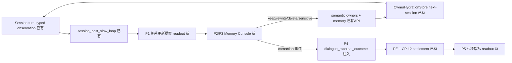

# 七天连续关系助手 MVP（Gate 8/11 产品化）

## 判断

方案成立。Gate 8/11 是仓库中唯一 causal + longitudinal 双证据齐全的 gate；提案五步闭环中 kernel 侧（typed owner、sleep consolidation、per-user hydration、CP-12 owner 自预测）已全部 ACTIVE，缺口集中在产品层四件事：逐条可控的记忆 console、consolidation 的用户可见提案 readout、用户纠正回流 PE、7 项指标的 metrics readout。

三个设计修正：
- outcome 回流不新建"用户需要 PE 轴"，复用 CP-12 owner prediction settlements + `dialogue_external_outcome` 注入（避免基底/控制器层与产品包混包）。
- Gate 11 负控三臂（stateless/swapped/shuffled）保留为离线回归（复用现有 harness），不进生产路径。
- 定位为有界产品 pilot，同时充当杠杆 4（#51 人类证据）的 transcript / pilot 素材来源；MVP 指标不改写 thesis 台账，L4 盲评仍走自己的预注册。

## 闭环架构

## 收敛包（每包单 owner，独立可回滚）

### P0 契约先行（docs，0.5 天）
- 在 [docs/DATA_CONTRACT.md](docs/DATA_CONTRACT.md) 注册新 slot（见 P1/P5），owner / value_type / dependencies / wiring_level 齐全。
- 新 spec `docs/specs/relationship-memory-console.md`：console 操作语义、七项指标定义、与 L4 人评线的素材接口、退出与回滚条款。

### P1 关系更新提案 readout（owner: vz-cognition reflection，2–3 天）
- 在 [packages/vz-cognition/src/volvence_zero/reflection/writeback.py](packages/vz-cognition/src/volvence_zero/reflection/writeback.py) 的 `ReflectionSnapshot` 增加 `relationship_update_proposals`：逐条 typed 提案（目标 owner slot、操作、人类可读描述、来源 turn 证据、置信度）。描述由 owner 侧生成（SSOT），不在 consumer 拼装。
- 提案默认 SHADOW（只发布不落库），经用户在 console 确认或按 boundary_consent 的 memory_scope 策略自动落库，落库走既有 `SemanticStateStore.apply` / `MemoryStore.write`，不开第二写入者。
- 新增 wiring 字段，回滚 = DISABLED。

### P2 Console API（owner: lifeform-service，2–3 天）
- 扩展 [packages/lifeform-service/src/lifeform_service/app.py](packages/lifeform-service/src/lifeform_service/app.py)：
  - `GET /v1/users/me/relationship-memory`：逐条列出五 owner 的 durable 项 + 待确认提案（读快照，不遍历内部结构）。
  - `POST .../{item_id}/action`：`keep / session_only / delete / rewrite / mark_sensitive / no_proactive_mention`。
- 操作映射到既有 owner API：rewrite/close → `SemanticProposalOperation`；delete → `delete_entries_for_scope`（[packages/vz-memory/src/volvence_zero/memory/identity.py](packages/vz-memory/src/volvence_zero/memory/identity.py)）+ semantic close；`mark_sensitive / no_proactive_mention` → boundary_consent owner 的正式提案（它是敏感与主动提起边界的唯一 owner），response_assembly 已消费该快照。

### P3 Console UI（owner: lifeform-service 内嵌 UI，1–2 天）
- 在现有内嵌 chat UI 上加记忆面板：待确认提案卡片 + 已记住条目列表 + 六个操作。不建独立前端仓。

### P4 纠正回流（owner: vz-runtime 编排 + PE 消费，1–2 天）
- console 的 correction/delete/rewrite 事件包装为 `dialogue_external_outcome`（既有注入口）进入下一 turn 的 PE actual outcome；同时作为 semantic event 走既有 adapter 更新对应 owner。
- 验证 CP-12 的 `OPEN_LOOP_CLOSURE` / `COMMITMENT_FOLLOW_THROUGH` / `BOUNDARY_CONSENT_STABILITY` settlement 跨 session（经 hydration）正确结算；有缺口在 owner 内补，不在消费侧重建。

### P5 七项指标 readout（owner: vz-cognition evaluation，只读，2 天）
- evaluation 侧新增 relationship-continuity readout（PE/owner 快照的下游，禁止反向成为学习源）：
  - callback hit rate ← CP-12 closure/follow-through settlements + callback 采纳信号
  - boundary violation rate ← boundary_consent 快照 `overreach_risk` / violation 事件
  - wrong-user attribution rate ← 用户纠正事件中标记为错人归因的比例
  - open-loop closure rate ← open_loop owner lifecycle
  - user correction rate / remembered item usefulness ← console 事件
  - 7-day trust delta ← relationship_state `trust_level` 轨迹（owner 指标）+ 人评问卷（L4 anchor，不混同）
- service 加 `GET /v1/users/me/continuity-metrics` 供 pilot 面板使用。

### P6 Pilot harness + 负控回归（1–2 天）
- 离线回归：复用 [packages/vz-runtime/src/volvence_zero/agent/gate11_per_user_continuity_evidence.py](packages/vz-runtime/src/volvence_zero/agent/gate11_per_user_continuity_evidence.py) 四臂 harness 作为 CI 级防退化门（correct-user-state 必须显著优于三个负控臂），不跑在生产。
- 7 天邀请制 pilot：小样本用户、每日指标快照、transcript 去标识化留存（供 L4-B 盲评工具链直接取材）。

## 依赖与顺序

P0 → P1 → (P2 → P3) 与 P4 并行 → P5 → P6。基底层零改动；全部新增位于 reflection readout / service / evaluation readout，各自独立 wiring 可回滚。

## 验证

- 每包只跑直接相关测试：P1 补 reflection readout 单测；P2/P4 补 service 集成测试（含 delete/rewrite 后 next-session 不再出现该条目）；P5 补 readout 单测。
- P1/P5 涉及新 slot → 追加 `pytest tests/contracts`。
- 验收沿用提案七指标，不追 DAU；kill 条款：pilot 中 boundary violation 或 wrong-user attribution 非零且不可归因于工程 bug → console 默认策略收紧为全提案人工确认。
