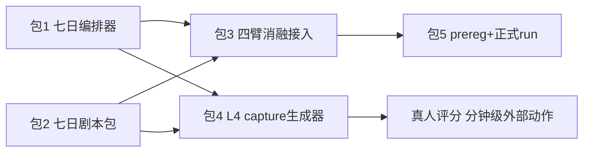

# 七天陪伴自动化证据闭环

## 目标与边界

**目标**：不需要真人手动聊天，自动化证明长程陪伴在三个方向上的效果：
1. **连续性因果**：correct-state 相对 stateless/swapped/shuffled 在真实 7 日生命周期上的对话级增益（Gate 11 形状，产品路径）；
2. **巩固因果**：sleep consolidation on/off 对次日冷启动/callback 的增益（Gate 8 形状，产品路径）;
3. **L4 素材供给**：自动产出成对盲评包，真人只做分钟级评分。

**诚实边界（先冻结措辞）**：
- 自动化闭环证明的是"模拟用户 + 真实生命周期"下的因果效应，主张措辞为 simulated-longitudinal，不冒充真实用户产品价值；
- L4 人类锚定的"人"不可自动化——但被替代的是聊天者（模拟用户），评分者仍须真人（每 contrast 24 pairs pilot，分钟级/人）；
- 是否允许 simulated capture 进入已冻结的 `gate811-human-anchor-prereg.v1`，取决于该 prereg 对 capture 来源的措辞——包 4 第一步先审这个，若不兼容则开 v2 prereg（注明 simulated-user capture 变体），不篡改 v1。

## 现有件（不重建）

- 模拟用户：[user_simulator.py](packages/companion-bench/src/companion_bench/user_simulator.py) 的 `UserSimulator` + `OpenAIUtteranceClient`（FSM 定探测动作，LLM 渲染语言，无关键词路由）；
- 多 session arc：[arc_runner.py](packages/companion-bench/src/companion_bench/arc_runner.py) + `scripts/governance_demo/drive_session_arc.py`（无头驱动 turns → end-scene(drain_slow_loop) → 新 session）；
- 生命周期：`gate8_longitudinal_evidence.py` 的 `_persist_and_restart_owners`（persist → restart → hydrate）；
- 证据落盘形状：`relationship_assistant_pilot.py` 的 `RelationshipAssistantPilotHarness.capture_day`；
- 指标：`relationship_continuity.py` 七项 readout + `GET /v1/users/me/continuity-metrics`；
- 盲评消费端：`gate811_human_anchor_tooling.py`（输入 `gate811-human-anchor-capture.v1` 即可打盲包）。

## 收敛包

### 包 1：七日编排器（owner: lifeform-evolution pilot harness 侧，2–3 天）

新建 `SevenDayCompanionOrchestrator`：
- Day N 循环：创建 session → 模拟用户按当日剧本聊 → `end-scene(drain_slow_loop=true)` → **owner persist → 进程级 restart → hydrate**（复用 Gate 8 纵向的隔离重启，而不是同进程假过夜）→ Day N+1；
- 时钟注入：7 天用虚拟日历（owner 侧时间戳可控），不真等 7 个自然日；
- 每日产出走 `RelationshipAssistantPilotHarness.capture_day` 同形 artifact（去标识 transcript + 日指标快照），模拟用户数据无 PII，consent 字段标注 synthetic 来源；
- 编排器只调 service HTTP API 和快照读取，不直接调模块方法（编排器例外条款内）。

### 包 2：七日 scenario 剧本包（owner: companion-bench，2 天）

现有 scenario 最长 2–4 session，扩成 7 日弧：
- 每日剧本 = persona 状态延续 + 当日事件（工作冲突/情绪低谷/开心事/边界试探/回访承诺），跨日埋 callback 钩子（Day2 提的事 Day5 该被记得）、emotion 弧、boundary 事件——对齐 L4 prereg 对 transcript 的三要素要求；
- 仍是 FSM 状态机 + LLM 渲染，语义检测不做关键词路由；
- 至少 3 个 persona × 2 个弧型（渐进升温 / 有裂痕修复），模拟用户 LLM 与被测系统、judge 分属不同模型家族（沿用 judge rotation 纪律）。

### 包 3：四臂纵向消融接入（owner: vz-runtime 证据 harness，2 天）

把自动对话回路变成证据仪器：
- **Gate 11 形状**：同一 scenario/seed 下四臂 —— correct-user-state / stateless / swapped-user-state / shuffled-history，逐日跑同一剧本（模拟用户 seed 固定，唯一变量是 state loading）；
- **Gate 8 形状**：sleep-on / sleep-off 两臂（end-scene 是否 drain slow loop），看次日冷启动与 callback 命中差；
- readout：七项 continuity 指标 + callback hit + 模拟用户 FSM 侧的探测通过率（它本来就在为 probe 打点）；LLM judge 分只作次级参考，不进主判据；
- 预注册最小效应门与 seeds 后再跑正式 run；CI 级保留一个小型（2 日 × 2 persona）回归门。

### 包 4：L4 capture 生成器（owner: vz-runtime gate811 线，1–2 天）

- 第一步**审 prereg 兼容性**：`gate811-human-anchor-prereg.v1` 是否允许 simulated-user capture；兼容则直接产 `gate811-human-anchor-capture.v1`（capture seeds 1401/1413/1427，三 session/30 turns，callback/emotion/boundary 三要素由包 2 剧本保证）；不兼容则开 v2 prereg 注明 simulated 变体，v1 保留给未来真实用户 capture；
- 自动跑 correct-state vs stateless / sleep vs no-sleep 的成对 capture → `build_gate811_pilot_packet` 打盲包 → 真人评分（外部动作，分钟级/人）→ 既有分析管线出 pilot 判读。

### 包 5：预注册 + 正式 run + 对账（1 天 + 机器/API 时间）

- 冻结 `seven-day-companion-simulated.v1` 预注册：scenario/seed 清单、四臂与两臂判据、最小效应门、kill condition（correct-state 不优于 stateless → 产品连续性主张收缩到 owner 指标层）；
- 正式 run（估算：7 日 × 4 臂 × 3 persona × 2 弧 ≈ 170 个 session 的模拟用户 API 调用 + 本地推理，一夜量级）；
- 结果回写 known-debts（#93 关联段）与 MVP 计划；L4 pilot 素材移交。

## 执行依赖

包 1 与包 2 可并行；总量约 1–1.5 周到正式 run 出结果。

## 纪律

- 模拟用户 / 被测系统 / judge 三方模型家族分离，沿用 judge rotation 账本；
- evaluation 只读，模拟对话与判分不得回灌学习源（R12）；
- 四臂共享同一冻结 substrate 与 seed schedule，唯一臂间差是 state/sleep 变量；
- simulated-longitudinal 与 real-user 两种主张措辞严格分开，前者不得升格为后者；
- 单写者：正式 run 期间该用户命名空间无其他 writer。

## 2026-08-01 执行对账

- 包 1–3 已落地并通过定向测试：七日 HTTP 编排、虚拟日历、每日 cold-start/end-of-day readout、冻结用户输入、6 场景 scenario package 与六臂证据器。包 4 的 v1 simulated capture 兼容性审计和盲包生成器已通过定向测试，但正式 capture runs 与可交接盲评包尚未落盘，因此包 4 仍为 `in_progress`。
- `20260731T222910Z` prereg 只冻结了 11 个选定文件；正式执行到 32 个完整 run 后，主工作区的 PE/temporal 源码在矩阵中途发生变化，并在 Day 6→7 hydration 暴露 `exploration_rng_state` schema drift。该矩阵在读取任何 effect 前已由 `source_drift_invalidation.json` 否决，32 个完整 envelope 和三份 partial 均只作中断审计，禁止进入因果分析。
- 替代 prereg 为 `artifacts/seven_day_companion_simulated_prereg_frozen_20260801T122037Z.json`，SHA-256 `9674ec62f363a362f09ef692ec82b176ee43da0ec47ac906879a1fcbddbed1fd`；seed、模型、36-run 矩阵、阈值和置信方法均未改变。新增全执行源树冻结：1,245 个 `packages/*/src`/pyproject/runner 文件，tree SHA-256 `5aab91ad394f0d9c5e6b09519a8010566e8f8bc2324777ee6dc21130417f7b8d`，并从只读副本执行。
- 新冻结副本已通过 6-scenario/210-turn MPS 预检和一条 7-session/35-reply/6-restart 非 claim smoke；smoke run SHA-256 为 `8ddc857cdad8c7951cae31b7b3e1ed05c95b55cd650e5be2062bddcda4a6985a`。替代正式矩阵在 `artifacts/seven_day_companion_formal_frozen_20260801T122037Z/` detached 执行；完成前仍是 `running / no causal result yet`，不是“没有提升”。
- frozen v1 未限定聊天者必须是真人，因此 simulated capture 与 v1 shape 兼容；但只允许形成 `human-rated-simulated-user-transcripts-only`，不能满足 real-user product-value EXIT。真人评分者仍为外部硬依赖。
- capture 首份源码冻结在执行前静态复核时发现 manifest 缺少 runner 封口所需的 `pair_count`；未运行任何 capture、未观察任何评分/效应即废止。修复后替代 prereg 为 `artifacts/seven_day_companion_capture_source_prereg_frozen_20260801T133600Z.json`，SHA-256 `5f13ed395f66eac59021c6a8515742b5b2400b995cdc32aba8a7786e66b73ee2`，冻结 1,247 文件执行树（tree SHA-256 `ad58546d9f508e1c1810f99289dedc413eae22b33f09338f4170d1c8b2adb2bf`）。72-run capture 只在正式矩阵结束并释放 MPS 后启动。
