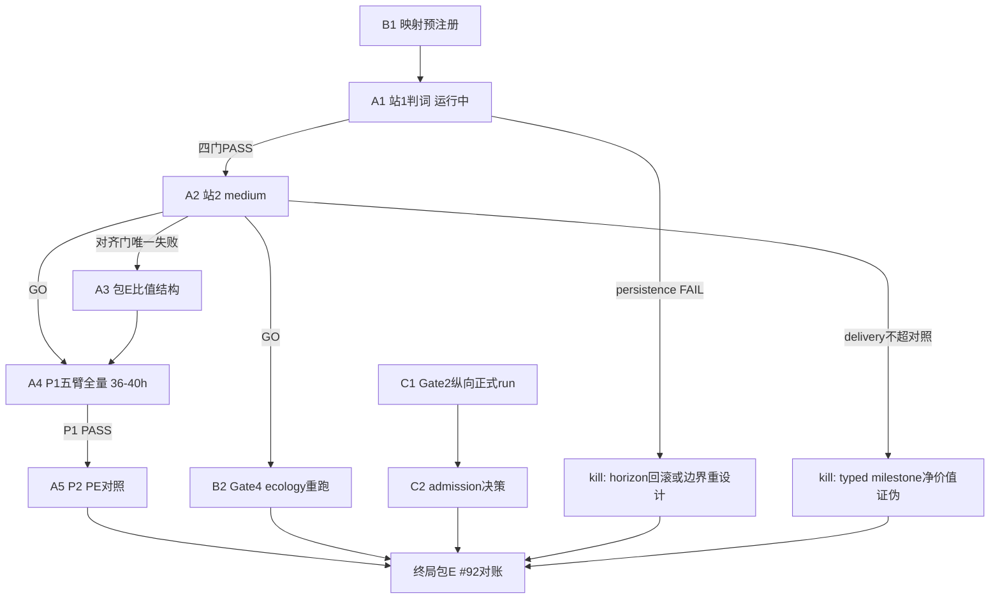

# 因果证据终局战役：把每条开放线打到终态

## 终局定义（什么叫"彻底解决"）

不是"保证 thesis 通过"，而是：**每条开放线在预注册判据下到达终态（GO 或 kill），#92 出终局判词，不留僵尸线。** 两种合法终局：

1. ecology + Gate 2 纵向证据把 causal/longitudinal 台账补齐 → `thesis_retained` 翻正；
2. 关键节点触发 kill → 写出诚实的终局收缩判词（哪些主张成立、哪些永久收缩），#92 关闭。

## 当前前沿（2026-07-31）

- **ecology 主线**：包 A 归因完成（根因 = 学习态 β 持续超阈，非 typed request、非 horizon serving 路径）；包 B min-dwell 落地（temporal owner，Ant profile ACTIVE/4，预检 survival `[1×6,15,15]→[4×6,15,15]`）；**包 C station1 正式重跑执行中**（prereg v2 `20260731T052300Z`，detached PID 21059，含 alignment review 契约）。
- **Gate 2 纵向线**：v35 read-only companion capture 有 smoke 产物（[计划](.cursor/plans/gate-2-longitudinal-v35-companion-capture_20260730.plan.md)），正式 run 未跑。
- **机制改造战役**：五包全 kill，已按纪律关闭，生产全部回滚。
- **工程债**：89 个文件未提交（混多条工作线）；G2 main 既有 5 个测试失败；E4 旧 journal 未归档。

## 战线 A：ecology 主线（因果证据主战场）

细节由 [ecology 计划](.cursor/plans/ecology_全链差距分析与收敛路线_d47a02b9.plan.md) 管辖，本计划只管决策点与预算。

- **A1 = 包 C 收口**：等 station1 正式 run 出判词。四门 PASS + 对齐 4/4 → 直接授权站 2；对齐不足触发预签的 5 局 review 契约；persistence 仍 FAIL → 按 ecology 计划 kill 分支（回滚 horizon-7 重测或边界语义降级重设计）。
- **A2 = 包 D matched 站 2**：medium 判据（pickup ≥80% 对照、delivery 严格超对照、carrying alignment 转正、U-turn gate）。这是 **typed milestone 边界因果贡献的第一个判定点**。失败 → 按 D1→C1→C6 归因，不加训练量重跑。
- **A3 = 包 E**（条件触发）：仅当 A2 唯一失败项是绝对对齐门。
- **A4 = 包 F P1 正式全量**：五臂 × 55 局 × frozen eval，seed0 + seed1，约 36–40h 机器时间，夜间分站跑。
- **A5 = 包 G P2 confirmatory**：PE-on/off matched，隔离 PE 加性 prior 的净贡献。

## 战线 B：证据→台账映射包（新增，先于结果预注册）

机制改造战役证明了合成 harness 无法给这些 gate 供证；ecology 的结果要合法回流 #92 台账，**映射必须在结果出来前冻结**，防止事后挑选。

- **B1 映射预注册包**：在 `docs/specs/evidence_program.md` 新增 `ecology-gate-evidence-admission.v1` 条目，并同步 `docs/known-debts.md` 各 gate 小节，冻结以下映射与准入判据：
  - **Gate 3**（β/z_t 涌现 + typed boundary）← A1/A2 的 `typed_milestone_structure` + persistence 门；
  - **Gate 7**（z 空间信用/组合因果）← A4 的 `segment-credit-off` 臂对比（terminal return/composition 差）；
  - **Gate 1**（PE 因果）← A5 的 PE-on/off matched 净贡献；
  - **Gate 4**（segment 样本效率）——**条件重开**：仅当 A2 证明 segment 结构有因果贡献后，用 ecology 真实 trace 作 corpus 重跑 label-utility selector（机制改造包 4 的实现直接复用，只换语料）；
  - **Gate 6 / 9 / 10** 保持机制改造战役的 kill 关闭状态，本战役不重开（除非映射预注册时发现 ecology 有天然对应面，届时一并冻结进 v1）。
  - 每条映射写明：哪个 artifact 字段、什么门槛、对应 gate 台账升级到什么等级（causal-supported / longitudinal-supported）。
- **B2 条件包 = Gate 4 ecology 重跑**：A2 GO 后执行，语料从 ecology settled trace 构建，判据沿用 `saved labels > 0` 不降门槛。

## 战线 C：Gate 2 纵向收口

- **C1 companion capture 正式 run**：按已冻结契约（Qwen2.5-0.5B CPU、selector fingerprint `ef360e0e…`、matched permutation null）在 fresh seeds 上出正式 companion artifact，判定 v35 selector 在纵向 source 上的 readout 效应是否过预注册门。
- **C2 admission 决策**：过门 → Gate 2 升 longitudinal-supported（台账三级齐全的第一个 gate）；不过 → Gate 2 保持 causal-supported（开环），纵向主张收缩写入 known-debts，关系条件残差载体线独立评估去留。

## 战线 D：工程收尾（不阻塞 A/B/C，穿插执行）

- **D1 分包提交**：把工作区 89 个文件按工作线拆 commit——机制改造战役（五包 + 对账）、Gate 2 纵向 capture、ecology dwell 包、zhang_wuji vertical / lifeform-expression 其它并行改动分开；每包中文提交说明按仓库规范。
- **D2 main 既有失败修复**：5 个 rare-heavy/binary-override 族测试失败 + sandbox ruff 遗留（ecology G2 债），单独包修复，正式报告在此之前持续如实标注。
- **D3 旧证据归档**：v31 污染 journal（ep23）与 v30 /tmp 证据拷回主仓库标记 EXCLUDED（ecology E4 债），须在 A2 前完成。

## 终局包 E：#92 终局对账

全部战线到达终态后执行：

- 重算台账：mechanism / causal-supported / longitudinal-supported 三级集合，逐 gate 写终态（supported / killed-with-verdict / contracted）；
- `thesis_retained` 终局判定：若 Gate 3/7/1 经 ecology 升级 + Gate 2 纵向补齐，评估是否满足 #92 EXIT 全部条款；任一不满足则写终局收缩判词——明确"哪些主张有证据、哪些永久放弃、系统的诚实能力边界是什么"；
- 回写 `docs/known-debts.md`、`docs/specs/evidence_program.md`、`docs/currentstatus.md`，#92 状态改为 CLOSED（无论正负）。

## 决策树

## 执行顺序与预算

1. **立即并行**：B1 映射预注册（半天，纯文档+判据冻结，必须赶在 A1 判词出来前）；C1 正式 run（CPU 数小时，与 ecology 不抢写者）；D1 分包提交。
2. **A1 判词后**：走 A2（1.3h）或 kill 分支；D3 归档在 A2 前完成。
3. **A2 GO 后**：A4 夜间分站跑（36–40h 机器时间）；B2 并行（合成 harness 代码复用，1 天内）；D2 穿插。
4. **A4/A5 完成后**：终局包 E（1 天）。

日历估计：顺利路径 **5–8 个工作日**（瓶颈是 A4/A5 的机器时间）；触发 KA 分支 +2–3 天。

## 纪律（沿用两个上游计划，此处只列增量）

- 映射（B1）一旦冻结，ecology 结果出来后**不得增删映射条目**；发现新对应面只能开 v2 映射并注明事后性。
- 单写者：ecology journal 的 flock 纪律不变；C1 的 Qwen run 与 ecology CPU run 错峰。
- kill 也是终态：任何分支触发 kill 后直接进终局包 E，不开"再试一版"的同层重跑。