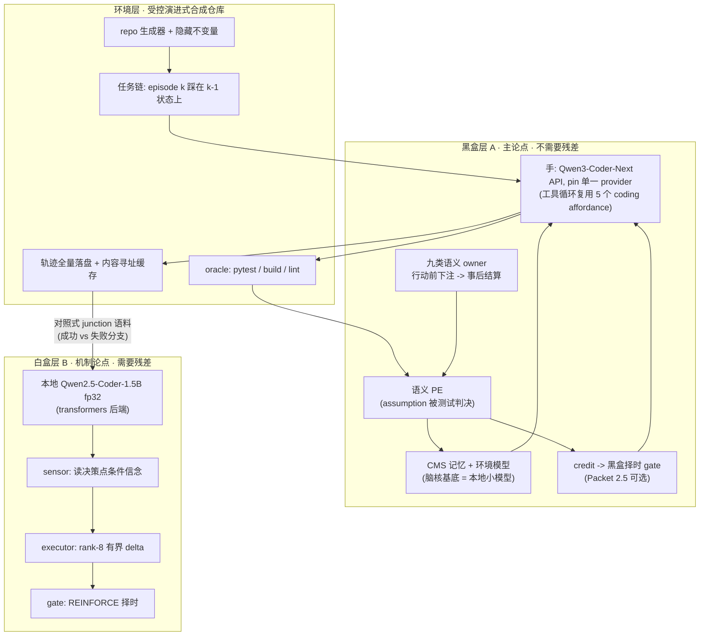

# 编程域持续学习证据 lane（coding-lab）

## 0. 战略定位

A1 判词已被限定为「v1 raw-cosine readout 下无净增益」、C3 formal 已废弃（见[修复N+1仪器标度缺陷计划](修复n+1仪器标度缺陷_073fbcfa.plan.md)）。本 lane 的 PE 是**语义级**的——具名信念被测试套件判决——完全绕开表示 readout 的标度问题，因此从"并行新证据"升格为**当前最有希望的主证据 lane**。它不改写任何既有封存判词，不占用 A1/A2 的 formal 预算。

## 1. 核心决策：两层，分层线在"是否需要白盒"

"残差控制只能在小模型上、真正编程要大模型、是否叠两层"——答案是必须叠，但**分层线不是脑/手，是能力轴对白盒的需求**。硬件已锁死：M4 / 24GB / 仅 MPS，残差路径按 A2 封存结论必须 `float32`（fp16/bf16 长轨迹产生非有限 residual），白盒基底上限 1.5B（约 6GB）～3B（约 12GB），7B（28GB）放不下。

关键契约事实：`SteeringGateModule` **不绑定 model/layer/width**，只绑特征策略；只有 sensor（reader）与 executor 绑几何（当前 `Qwen2.5-0.5B` layer 20 / width 896 / rank 8，校验点在 [packages/vz-substrate/src/volvence_zero/steering_executor.py](packages/vz-substrate/src/volvence_zero/steering_executor.py) 与 [packages/vz-cognition/src/volvence_zero/steering_sensor.py](packages/vz-cognition/src/volvence_zero/steering_sensor.py)）。"何时干预"的策略层天然跨基底。

**层 A 的脑核基底显式声明**：语义提案与嵌入跑在本地小模型（0.5B 或 Coder-1.5B，transformers 后端），与手分离。Packet 1 的预报质量因此归属于脑侧机器，不是手的能力。

**桥接**：层 A 落盘的轨迹在决策岔口（继续调查 / 直接改 / 回退 / 提问）提供 expert 标签，喂给层 B 的 `_precompute_records`。与 S3-E 同构——S3-E 也是在冲突 junction 上 steer 动作选择、用 expert 动作 NLL 打分。**标签取对照式**：只在同一状态既有成功分支又有失败分支的岔口取样（防幸存者噪声，见 Packet 3 前置 b）。

## 2. 环境与测量纪律

合成环境的唯一风险是自问自答。硬纪律：

- **真代码真测试**：生成可运行 Python 包 + 真 pytest 套件，不是仿真。
- **隐藏不变量**：latent 约束（"模块 X 有隐藏 consumer"、"函数 Y 非幂等"、"快子集测不到的慢测试"）不写进任务描述，只能踩坑发现；每条被测试套件机械判决，PE 客观。
- **对照臂等信息**：steelman 拿到完整历史转录。脑核赢必须因为它组织/学到了经验，不是看得更多。
- **先注册后跑**：不变量数量、复现频率、理论上限在 prereg 冻结。
- **分辨力预检（主线 §0 不变量 7）**：每个新仪器在承载判词前先过预检——Packet 0 的 oracle、Packet 2 的斜率仪器、Packet 3 的 expert-NLL 信用，各一次，不过门不开 formal。
- **确定性拆分**：环境侧（repo 生成、任务链、oracle）比特级确定；手侧不可确定（API 不保证，OpenRouter 跨 provider 路由），改为**轨迹全量落盘 + 内容寻址缓存**，重放靠日志不靠重跑。下游包（junction 语料）从日志构建。
- **手的 lineage**：pin 单一 provider（DashScope 直连或 OpenRouter provider 锁定参数）+ 模型版本指纹进 manifest；换手 = 新 lineage，重跑 Packet 0 标定。
- **磁盘纪律（C3 之死的直接教训）**：runner preflight 查磁盘余量；逐 episode bytes 记账进 manifest；worktree 用完即删。照抄 A2 的磁盘预算证据模式。
- **held-out 封存**：Packet 0 同时生成 1–2 个结构不同的环境变体，哈希封存不开封，留给未来迁移包（泛化阶梯 L1/L2）。

设计先例参照 [packages/vz-embodiment-ant/src/volvence_ant/experiments/ecology_curriculum.py](packages/vz-embodiment-ant/src/volvence_ant/experiments/ecology_curriculum.py)。

## 3. 收敛包

### Packet 0 — 环境与 oracle 标定（无脑核，不占 MPS）

落点：`packages/lifeform-domain-coding/src/lifeform_domain_coding/lab/`（repo 生成器、不变量注册表、任务链、oracle、worktree 重置、轨迹落盘）+ `scripts/run_coding_lab_calibration.py`。

判词：环境侧重放确定性；oracle 分辨力（**冻结手**下 episode 通过率落在 0.2–0.8 中间带、跨 episode 有方差）；单 episode 成本 / 时延 / bytes 记账；held-out 变体已封存。

退出条件：通过率退化到约 0 或约 1 → 先调难度，不进下一包（七日"仪器无刻度"教训的直接兑现）。

### Packet 1 — SHADOW 观察者 + 语义 PE

- **契约决策先行**：优先扩展既有 [packages/vz-runtime/src/volvence_zero/dialogue_external_outcome.py](packages/vz-runtime/src/volvence_zero/dialogue_external_outcome.py)（docstring 明确它是"外部结局证据进入 kernel 的唯一合法快照通道"，带 `append_evidence` API；oracle 来源非 LLM，天然过它的来源门）承载 episode 终局；语义确实装不下（"dialogue"命名 vs 编程 episode）再新造 `coding_episode_outcome` slot（SHADOW）。任一路径登记 [docs/DATA_CONTRACT.md](docs/DATA_CONTRACT.md) §6 并同步 specs。**不建第二 owner**。
- 采集器 orchestrator 放 `lifeform-evolution`（对齐 [packages/lifeform-evolution/src/lifeform_evolution/seven_day_companion.py](packages/lifeform-evolution/src/lifeform_evolution/seven_day_companion.py) 先例）；证据编译放 `vz-runtime/agent/`。经历只走 `MemoryStore.write` 与 `BrainSession.submit_semantic_events` 正式通路。
- **行动前下注**是核心不变量：owner 在动手前发布结构化预测（二值/概率 + 置信度），时间戳先于 oracle 运行落盘（可审计、不可泄漏），oracle 结算复用 `_settle_owner_predictions`。缺这一条，后面必然塌缩成单一任务奖励。

判词：owner 预报显著优于**置换检验 null**（打乱结算标签重算）；PE 有分辨力；跨 session（进程重启）恢复成立。零干预、零 ACTIVE 变更。

### Packet 2 — 记忆注入 ACTIVE vs 长上下文 steelman

- **注入包由 owner 生成**：快照自带的描述组装成注入块（SSOT——谁拥有数据谁负责描述，禁止 harness 遍历内部字段拼摘要），注入面为手的 system 上下文，token 上限进 prereg。
- 对照臂为全历史长上下文 steelman。**预算显式不对称**（不是 matched）：照抄 MSC 双门——**quality 门**（脑核臂改善斜率显著高于 steelman 臂）+ **scaling 门**（token ratio ≤ 0.10、latency ratio ≤ 0.50，不对称计入证据）。
- prereg 冻结：链数 N、每链 episode 数 M、斜率估计窗口、双门阈值、seed；禁止中途窥视停跑。

判词：双门齐过。统计设计见 §4。

### Packet 2.5（可选）— 层 A 黑盒择时 gate

特征来自 PE / 语义快照（不碰残差），动作 = {先调查, 直接改, 提问}，信用 = episode 终局。证明 **Learnable 轴不依赖白盒**——这是本计划自己的核心论点的直接检验，成本低（复用 Packet 2 基础设施 + `_GatePolicy` 骨架）。若跳过，需从架构图删除层 A 的 credit→gate 边并收窄主张表述。

### Packet 3 — 白盒层：S3-E 编程域复刻

**前置 a（基底验证）**：`Qwen2.5-Coder-1.5B-Instruct`（dense Qwen2 架构）能被 `_resolve_transformer_blocks` 解析、fp32 在 24GB 内可跑、磁盘 preflight 通过；不通过则回退 0.5B 既有几何。

**前置 b（分辨力预检，S3-A 等价余量审计）**：junction 语料采用**对照式标注**（同一状态既有成功又有失败分支，标签取动作之差；备选：最短成功轨迹加权）。审计 expert vs 非 expert 动作在小模型 NLL 上的间隙、steer vs noop 的余量。**不过门不开 RL**——这是 C3 教训（仪器失准产生 null）在本 lane 的防线。

可直接搬运（勘探已确认）：[packages/vz-runtime/src/volvence_zero/agent/eta_when_to_steer_rl.py](packages/vz-runtime/src/volvence_zero/agent/eta_when_to_steer_rl.py) 的 `_precompute_records` 预计算反事实表、`_GatePolicy` REINFORCE、`_run_seed` multi-restart=4、`assess_when_to_steer` 六门、`_route_bootstrap` worst-seed 聚合；[scripts/run_eta_when_to_steer_rl.py](scripts/run_eta_when_to_steer_rl.py) 的 prereg 一致性校验 + `artifact_manifest.json` attestation + MPS 锁。

必须新建：编程域 junction 定义、终局信用源（route 上 expert 动作 NLL 均值）、该基底 reader/executor artifact（几何绑定不可迁移，必须重 fit）、语料 split 与 prereg JSON。

判词：六门 × 5 seed，结构完整性（基底冻结、reader/executor 冻结、无 free bias、zero-code no-op、仅策略更新）。

### Packet 4 — 自改提案经 ModificationGate（最后，且受门）

前序包判词齐备后开启。任何 artifact 变更走 `ModificationGate.OFFLINE` + held-out 改善 + candidate-bound rollback，不得 bypass。放最后的理由是**谱系**：系统一旦改自己，被测对象每轮都在变，前面所有 baseline 作废。

## 4. 统计设计

- 单位：N 条独立任务链（不同生成器 seed）× 每链 M 个 episode；N、M 与估计窗口在 prereg 冻结。
- 配对：两臂在**同一链、同一任务序列**上配对跑；斜率差按链聚类做 CI（对齐 MSC dyad-clustered 先例）。
- null：owner 预报用置换检验（打乱结算标签）；斜率门用链聚类 bootstrap CI 下界 > 0。
- 并行：链内串行（记忆有序），跨链并行（API 手无共享状态）。
- 饱和：预期曲线会平；平台期起点与高度如实报告，不作为失败，但**过早饱和**（prereg 定义阈值）触发环境丰富度复审。

## 5. 预算

- 层 A：Qwen3-Coder-Next（$0.11/$0.80，缓存 $0.07；pin provider）约 $0.05–0.15/episode；500 episode 约 $25–75。难任务对照可选 Kimi K2.7 Code（$0.95/$4，batch 六折）。样本量不再是约束。
- 层 B：仅 Packet 3 占 MPS，遵守 `artifacts/.companion-evidence-mps.lock` 互斥；1.5B fp32 约 6GB；磁盘 preflight 必查（模型下载 + checkpoint + 轨迹日志 + worktree）。
- 时延：单 episode 约 5–10 分钟（30 轮 × API 时延），500 episode 串行约 40–80 小时 → 跨链并行压缩到天级。

## 6. 风险登记（每条附退出条件）

| # | 风险 | 缓解 | 退出条件（诚实封存口径） |
|---|---|---|---|
| R-CL1 | 手被 provider 下架/变更 | 轨迹全量落盘使已采证据永久有效；pin provider + 版本指纹 | 换手 = 新 lineage，重跑 Packet 0 标定 |
| R-CL2 | oracle 分辨力退化（全过/全挂） | Packet 0 预检门 + 难度参数化 | 调难度后仍退化 → 封存"该环境形态无刻度"，重设计环境 |
| R-CL3 | 曲线过早饱和 | 任务链沿演进供给新结构；prereg 定饱和阈值 | 封存"可学结构有限"，如实报告平台期 |
| R-CL4 | junction 标签幸存者噪声 | 对照式标注 + 前置 b 余量审计 | 余量不足 → 封存"该决策面无择时余量"，不开 RL |
| R-CL5 | API 不确定性污染重放 | 确定性拆分：环境比特级；手走日志重放 | — |
| R-CL6 | 磁盘打满静默死（C3 先例） | preflight 余量检查 + bytes 记账 + worktree 即删 | — |
| R-CL7 | 合成环境自问自答质疑 | 隐藏不变量 + 对照臂等信息 + held-out 变体封存 | 迁移包不过 → 主张收窄为"受控环境内机制成立" |

## 7. 红线

- 不为让判词好看而降阈值、换判据、或把 evaluation/judge 引入学习环路（R12）。
- 手在所有臂中完全一致（模型 digest、provider、工具版本进 lineage），否则测的是模型不是脑核。
- 每包一 owner 一契约；同一快照链一个写入者；新 owner 一律 SHADOW 起步，晋升走单字段翻转 + 守门测试。
- 每个新仪器先过分辨力预检，不过门不承载判词（主线 §0 不变量 7）。
- 任一包触发退出条件即如实封存负结果，不顺延到下一包。
