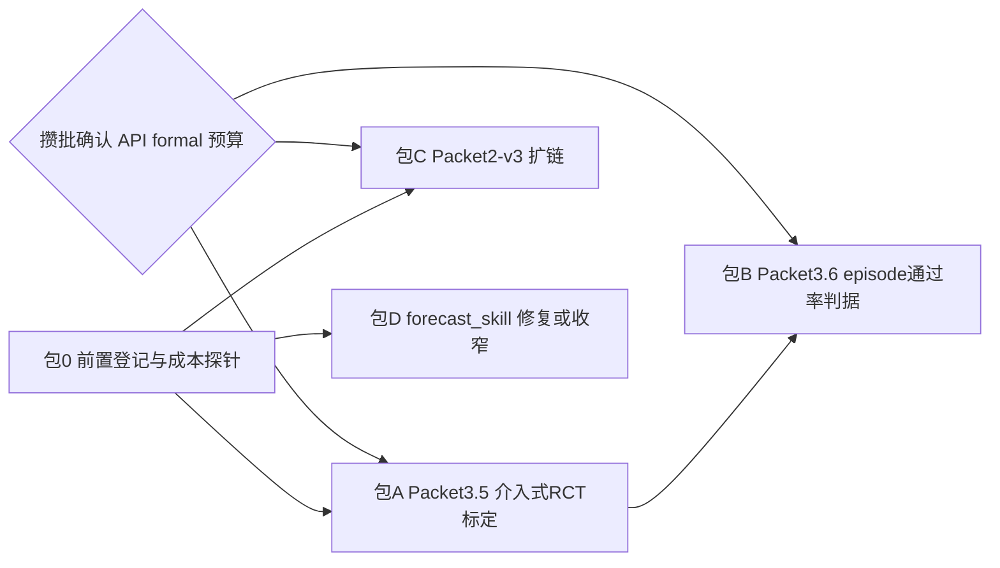

# 编程线四缺口收敛计划（Packet 3.5 / 3.6 / 2-v3 / 1-fix）

目标：消除 [docs/specs/coding-lab.md](docs/specs/coding-lab.md) 现有 formal 证据的四个缺口——NLL 代理指标、观察性 expert 标签、发丝级余量、`forecast_skill=False`——使编程线满足"不以小样本、prompt 对比或代理指标冒充结论"的四能力证据标准。

## 依赖关系

## 包 0 · 前置（小，无实验）

- 工作区检查：确认单写入者、dirty tree 归属（当前有 BP 文档与 v6 彩排残留 untracked，均不混入本线提交）。
- 在 [docs/specs/four-able-mainline-execution-plan.md](docs/specs/four-able-mainline-execution-plan.md) §7 追加带日期记录：证明载体转移至 coding lane 的裁决（本对话已定），关系线降速为产品假设线。
- 成本探针：从 `coding_lab_packet2_formal_v2_qwen3codernext_20260813` 的轨迹时间戳推算单 episode 墙钟/成本，给包 A/B/C 定预算，写入各包 prereg。

## 包 A · Packet 3.5：junction 介入式 RCT 标定（修观察性混杂）

Owner：`lifeform-domain-coding.lab`（junction/hand 层）+ `lifeform-evolution` runner。

- 在 [packages/lifeform-domain-coding/src/lifeform_domain_coding/lab/hands.py](packages/lifeform-domain-coding/src/lifeform_domain_coding/lab/hands.py) 新增 `ForcedActionHand` 包装器（沿用 `MemoryAwareScriptedHand` 的包装模式）：episode 内在线检测到目标协议状态键（复用 [junctions.py](packages/lifeform-domain-coding/src/lifeform_domain_coding/lab/junctions.py) `_state_key`）时，把下一动作**均匀随机**强制为 `ACTION_SURFACES` 内某类，记录 assignment，之后放行，episode 由 [oracle.py](packages/lifeform-domain-coding/src/lifeform_domain_coding/lab/oracle.py) 正常结算。
- `junctions.py` 新增 `build_interventional_action_outcome_table` + `interventional_expert_actions`（owner 内发布，consumer 不重建）。
- Prereg 冻结：目标状态键集合（取 22 个可解析键中支持度最高的 top-K）、每 (状态键, 动作) 单元最小样本（沿用 `min_action_support=5` 起步）、随机化 seed、与观察性表的对比口径。
- 判读：介入表与观察表**方向不一致本身就是合法发现**（证明混杂真实存在），不算失败。
- 次序：ScriptedHand 开发档 smoke → prereg 冻结 → API 手 formal。

## 包 B · Packet 3.6：S3-E 判据升级到 episode 通过率（依赖包 A）

Owner：`lifeform-evolution`（新 runner，复用 `coding_lab_s3e.py` gate 训练管线）。

- 四臂匹配任务成对执行：`learned_gate` / `noop` / `always_on` / `random_gate`；junction 处 gate 决定是否干预，"干预" = 按包 A 介入表的 expert 动作强制下一步（经 `ForcedActionHand` 同一机制）。
- gate 重训：credit source 改为**介入式**通过率表（prereg 内固定，沿用 S3-E `amendments` 修正模式），仍 PE/credit 通道、不经 evaluation。
- 主判据：**episode 通过率**，chain-paired 斜率差 + bootstrap 下界（对齐 Packet 2 门结构）；最小效应随 prereg 冻结。
- 诚实边界（prereg 写死）：本包证明的是**动作级干预择时**对结局的因果收益；残差级 Steerable 主张不因此升级，仍停留在 NLL/机制档。
- 诚实终局：`timing_no_outcome_gain`（gate 择时在 NLL 上成立但结局上无增益）为合法封存结果。

## 包 C · Packet 2-v3：扩链拉开余量（独立并行）

Owner：`coding_lab_arms.py` + `run_coding_lab_packet2.py`（零代码改动预期，纯新 prereg + 运行）。

- 功效依据：v2 在 8 链下 memory_gate 点值 +0.0235、5% 下界 +0.0061；bootstrap 宽度按 1/√N 缩放，**24 链**（3×）预期下界 ≈ 点值 − 0.010，离 0 有实义余量。
- 新 prereg v3（参照 [artifacts/coding_lab/prereg/coding_lab_packet2_prereg_20260813.json](artifacts/coding_lab/prereg/coding_lab_packet2_prereg_20260813.json) 结构）：chains=24、门与 conventions 不变、v2 判词原样保留不重释、断点续跑与 `.formal.lock` 纪律沿用。
- 规模：24×10×3 = 720 episodes（v2 为 240），先按包 0 成本探针确认预算再冻结。

## 包 D · forecast_skill 修复或诚实收窄（独立并行）

Owner：`vz-cognition` PE 预测头（publisher 侧丰富，R8 合规）+ `lifeform-evolution` observer。

- 按 Packet 1 诊断的路线 (1)：PE owner 的 `next_prediction` 接入 `execution_result` 语义 owner 的证据（owner 侧丰富快照，消费者不拼装）。
- 重跑 Packet 1 scripted observer，同一判别门（p≈1e-4 档）。
- 预注册双终局：PASS → `forecast_skill=True` 补齐 Readable；仍 FAIL → 封存"PE 前向预测在合成基底无技能"，Readable 主张收窄为命名读出 + junction 状态键，**不再第三次重试**。

## 确认点（攒批，一次）

包 A/B/C 的 formal 都要调 qwen3-coder-next API（DashScope）。三个 formal 的预算与授权攒成一张清单一次确认；开发档 smoke（ScriptedHand，零 API 成本）不需确认。

## 完成定义

四包终局（无论 PASS/FAIL）各自封存并提交；[docs/specs/coding-lab.md](docs/specs/coding-lab.md) 增补 §7.10–7.13 登记四包契约与判词；届时编程线的 Learnable/干预择时主张站在 episode 通过率上、expert 标签是介入式的、Packet 2 余量有实义、Readable 主张与 forecast 证据一致。