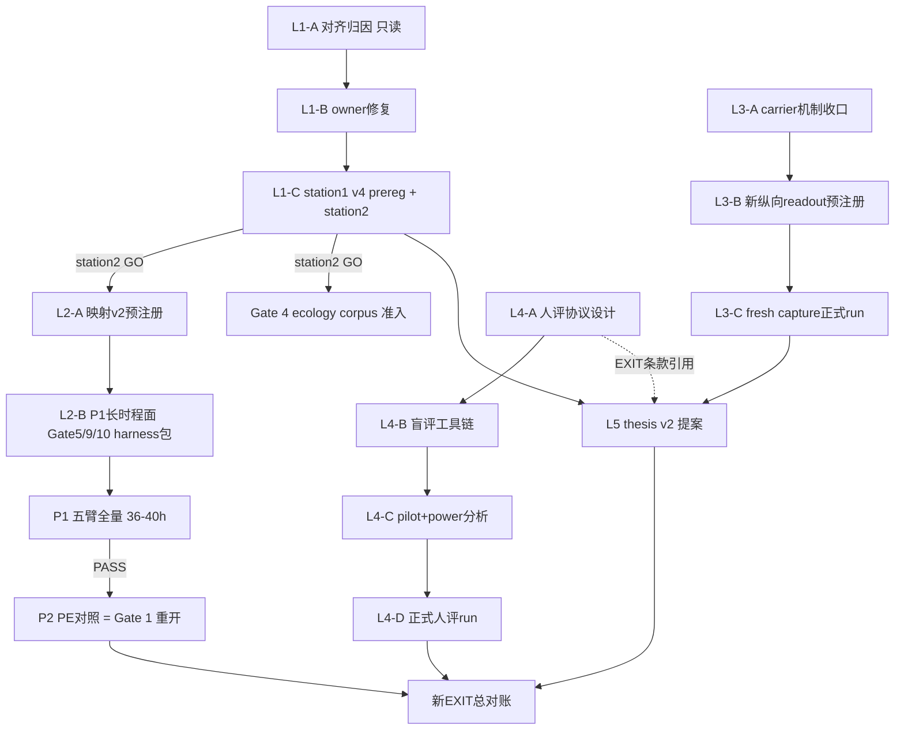

# 证据提升总计划：五杠杆战役群

## 总原则（约束全部杠杆）

- **#92 不可重开**：所有重开走 [thesis prove.md](docs/thesis prove.md) §10 的合法路径——新 owner 机制或新证据前提 + 新 schema + fresh source + 独立预注册。仅换 seed 或降门槛不合法。
- **kill 是终态**：每个杠杆有自己的 kill condition，触发后写终局收缩，不同层重试。
- **单写者纪律**：ecology journal flock 不变；L1 的 ecology CPU run 与 L3 的 Qwen CPU run 错峰。
- **门槛 SSOT 在 prereg artifact**，不在计划文件。

## 依赖总图

**立即可并行启动**：L1-A、L3-A、L4-A（互不依赖）。
**串行瓶颈**：L2 全部依赖 L1 的 station2 GO；L5 依赖 L1-C 和 L3-C 的判词。

---

# 杠杆 1：Ecology 对齐表征回归战役（解锁整条下游链）

**问题**：station1 v3 四门 + 8/8 persistence 全过，唯 food alignment 3/4（4 个 body 中 1 个未形成 food→turn 对齐），唯一预签 review 后仍 3/4 → BLOCK，station2/P1/P2 全部 not-authorized。重开的合法前提是 owner 级机制变化。

### L1-A：只读归因包（1–2 天）

复用包 A（persistence 归因）的方法论，全部只读：

- 定位失败 body：从 station1 candidate checkpoint 的 frozen probe payload 读出哪个 body、对齐差多少（是接近门还是零对齐）。
- 三个假设按先验排序：
  - **H1 学习态分化**：per-body action head 权重距离——失败 body 是否像 persistence 崩塌时的 body0/1/2 一样处于不同学习态（同一 checkpoint 内 body 间对比）；
  - **H2 课程暴露不均**：逐 body 统计 butter-near 拾取事件数、food 梯度暴露量（journal 回放统计）；
  - **H3 干扰**：carrying/dwell 训练与 food 对齐目标在共享 action head 上的梯度冲突（对比 dwell 包前后 checkpoint 的对齐读数）。
- 产出：`alignment_formation_attribution.v1.json` + 状态文档新段。
- kill：若失败 body 的对齐读数在探针 seed 微扰下跨越门线（测量噪声主导），归因升级为"对齐门的判定口径问题"——走门语义重设计（新 schema，不是降门槛）。

**2026-07-31 实跑终态**：`alignment-formation-attribution.v1` 已完成。失败者固定为
body 2；station1 与 review checkpoint 在 seeds
`700003/700004/700005/700006/700007` 上均稳定反向，未触发测量噪声 kill。body 2 在
15 个 butter-near rows 中 encounter=`15`、pickup=`11`，均不低于其余 body，故 H2
`not-supported`。review 后其 528 维 world action-head 到 aligned centroid 的距离为
`0.080750`，高于 aligned bodies 最大 `0.053632`；butter-near review 虽把 alignment margin
改善 `+0.000182868`，仍未翻正，故选择 H1 学习态分化，L1-B 进入 temporal-owner
形成期保护设计。旧 journal 未发布逐更新 gradient cosine，H3 只判
`inconclusive/not-selected`，不冒充直接梯度证据。artifact：
`research/ant/results/ecology_recovery/same_physics_baseline/alignment_formation_attribution.v1.json`。
该结论不授权 station2/P1/P2。

### L1-B：owner 级修复包（1–3 天，按归因三选一）

- H2 成立 → **课程均衡**（环境 owner）：curriculum 保证逐 body 最低 food-interaction 配额；
- H1 成立 → **对齐形成期保护**（temporal owner）：对齐未形成的 body 延长 exploration/降低干扰权重（有界、可回滚 wiring 字段，默认 DISABLED）;
- H3 成立 → **梯度隔离**（temporal owner）：food 对齐与 carrying 条件化更新的 effective-dims 分离或相位错开。
- 禁止：把对齐门从 4/4 降到 3/4；给失败 body 单独写死行为。
- 验证：机制单测 + 旧 checkpoint 冻结预检（复用 min-dwell 包的预检模式）。

**2026-07-31 实跑终态**：按 L1-A 的 H1 判词落成 temporal-owner 通用形成保护。
`internal_rl_causal_action_head_formation_protection` 默认 `DISABLED`；Digital Ant profile
显式 `ACTIVE`，形成窗口为每个 head 自己的前 `160` 次 owner update。每个 batch 只计算
`advantage × projected score-gradient`，与 batch 净贡献点积为负的少数 transition 权重缩为
`0.25`；SHADOW 只发布 would/apply 计数，ACTIVE 才修改 action-head credit，track/value/entropy
目标不变。机制不读取 body id、food、carrying、phase、文本或 action 名称，窗口结束自动 no-op；
回滚三元组为 `DISABLED / 0 / 1.0`。旧 review checkpoint 的 seed `700003` 双配置完整
paired-probe digest 均为
`6190f6accafac751d02f0b2a28770ba54d7254ce9b9022c4765f201dc4731093`，逐字段相同；
四体最大 action-head update step=`142 < 160`，确认旧失败面位于形成窗口内。正式 precheck
artifact：`research/ant/results/ecology_recovery/same_physics_baseline/alignment_formation_protection_precheck.v1.json`
（SHA256 `32b5473a61c5e92072eb13ecfef759a24b0aa5ee327c01c838bf0e9d9ed6829f`）。
该 precheck 只授权创建 L1-C 新预注册，不授权 station run、station2、P1 或 P2。

### L1-C：station1 v4 prereg + station2（≈4 小时机器时间）

- 空 journal、隔离快照、源码树 binding，双臂 20 局，四门 + persistence + 对齐 4/4 全部沿用冻结判据；
- GO → 立即执行 station2 medium（判据已在 ecology 计划冻结：pickup ≥80% 对照、delivery 严格超对照、carrying alignment 转正、U-turn gate）；
- station2 GO = **typed milestone 因果贡献成立** + Gate 4 ecology corpus 准入 + P1 授权。
- kill：station2 delivery 不超对照 → typed milestone 净价值证伪（这是真终局，写入台账）。

**2026-07-31 prereg 子包终态**：fresh packet 已升级为
`digital-ant-ecology-same-physics-baseline-preregistration.v3`，实验代际=`station1-v4`。
它绑定 L1-B no-write precheck 与当前完整 code tree；candidate/control 共同使用 formation
protection `ACTIVE/160/0.25`，唯一臂间差仍是 typed milestone ACTIVE/DISABLED。station1 原
pickup/structure/persistence/food-turn 判据不变，alignment 必须在 ep20 frozen checkpoint 直接
4/4；旧 v2 五局 review 已用尽，本代明确禁止。正式 packet：
`research/ant/results/ecology_recovery/same_physics_baseline/ecology_same_physics_prereg.seed0.20260731T135415Z.json`
（SHA256 `da4936ee794819f637fb4954162724675d2f72218f8581007e1ab5874925cfc1`）。该 packet
只授权隔离源码快照 + 新空 journal 的 station1 ep0–19；station2/P1/P2 继续等待 station1 GO。

**2026-07-31 L1 终局判词**：`station1-v4` 已在 packet 绑定的隔离源码快照和新空
journal 中完成，两臂各 20 局。candidate/control pickup=`47/52`
（ratio=`0.9038461538461539`），delivery=`7/15`（本站只作描述性读数）；四个共同因果门中
control signal、pickup non-inferiority、no-zero-block 与 typed structure 通过，8/8 structural/
persistence lanes 全过，但 food alignment 仍为 3/4。失败 body 2 的 left/right turn 为
`-0.00038541260576263365 / +0.00038709291851802386`，反向幅度还大于旧 station1，因此
L1-B 形成期保护没有产生预注册要求的 learned uplift。正式 report：
`research/ant/results/ecology_recovery/same_physics_baseline/ecology_same_physics_station1.seed0.20260731T135415Z.json`
（SHA256 `882b133a581db13fa916f961d97f71af9f8c5e2b5391f02cade107100b97ff15`），manifest
SHA256 `50584808c42ebfbb41c8e7f5c3e097bacf2a18747d00f275d867d24e4ddfa2cb`。机器判词=`BLOCK`、
`alignment_review_authorized=false`、`next_episode_authorized=null`。这已触发 L1 的冻结 kill：
不得再做 review、换 seed、降门槛或加训练量；station2 不执行，因而 L2 ecology 路线、
Gate 4 ecology corpus、P1/P2 全部未获授权。L1-C 以负证据终态完成，不授权任何
production/live 晋升。

---

# 杠杆 2：动态范围证据面战役（重开 Gate 5/9/10 + Gate 1/4）

**依赖：L1-C station2 GO。** 合法性基础：§10 允许"新证据前提"重开——Gate 5/9/10 的死因是证据面无动态范围（效应 1e-7 vs 门槛 0.02、常数 +0.012 目标），ecology 长时程面天然具备这些 gate 应该赢的结构。

### L2-A：映射预注册包 v2（1 天，必须在 P1 结果可见前冻结）

`ecology-gate-evidence-admission.v2`，冻结新映射与最小效应（附信噪比预算，防止再立五个数量级够不着的门）：

- **Gate 5**（多频 CMS）← P1 长跑的跨 layout 干扰/遗忘压力：full 多频臂 vs single-timescale 臂在后期 layout 的 retention 差；
- **Gate 9**（M3）← station 切换造成的梯度分布漂移段：M3(slow_gain>0) 臂 vs plain 臂的漂移后恢复速度；
- **Gate 10**（rare-heavy）← 跨 colony/layout 可迁移不变量：cohort 训练的 candidate 在 held-out layout 的行为增益；
- **Gate 4** ← ecology settled trace corpus 重跑 label-utility（机制改造包 4 实现直接复用，判据 saved labels > 0 不变）；
- **Gate 1** ← P2 PE-on/off matched（ecology 计划包 G 原样）。

### L2-B：harness 适配包（每 gate 一包，各 1–2 天，owner 分离）

Gate 5 在 vz-memory、Gate 9 在 vz-temporal、Gate 10 在 vz-substrate 各自的 ecology 臂配置与 readout；不改机制本身（机制改造战役已修完），只建证据面。

### L2-C：P1 五臂全量 + 各 gate readout（36–40h 机器时间，夜间分站）

P1 本身出 ecology 终局判定；Gate 5/9/10 的 readout 按 v2 映射同批产出。P1 PASS → P2（= Gate 1 重开）。

- kill（逐 gate 独立）：在有动态范围的面上效应仍 ≈0 → 该 gate 主张**永久收缩**（这次没有"证据面太薄"的借口了）。

---

# 杠杆 3：Gate 2 纵向新 readout 战役（独立线，可立即启动）

**基础**：关系条件残差载体已合入（`676b2c75`）。§10 要求：新纵向 readout/live-route 机制 + fresh capture + 独立预注册；v35 selector 形态与 v36/v37 历史路线不得复用。

### L3-A：carrier 机制收口（1–2 天）

- 盘点 relationship-conditioned residual carrier 当前状态（`relationship_conditioning=ACTIVE` 准入已修）；补齐机制单测：conditioning 进入 carrier 的边界、SHADOW/ACTIVE wiring、回滚。
- 明确新 readout 的机制差异点：selector 以关系状态为条件（v35 是无条件 8076 维 state readout）——这是"新机制"合法性的核心，写进 spec。

**2026-07-31 收口**：Relationship bank 的现有载体边界保持不变：默认
`SHADOW/text`，只有显式 ACTIVE 且 non-cold/positive-confidence 才可投递，DISABLED 和
revocation 为精确回滚。temporal owner 新增
`residual-state+relationship-owner-readout.v1`：在完整 residual state 后追加
`RelationshipConditioningModule` 发布的完整有序 readout，只做
`(2x-1)×confidence` 有界化，不解释 label 或重建关系语义。错 bank、cold start、
zero confidence 均 fail loudly，所以新 lane 不可静默退化成 v35 的无条件 8076 维
shape。此机制只服务隔离 evidence selector，不进 live session、不新增 slot、不改
relationship owner。机制测试 18/18 通过，载体现有 owner/runtime 测试在 L3-B 前继续作
prereg 前置门。

### L3-B：预注册包（1 天）

- 新 schema（`eta-gate2-longitudinal-conditioned.v1`）：fresh seeds（1201/1213/1223 已消费/冻结，用新 seed 组）、conditioned selector 判据、matched permutation null、single-seed stop-loss 沿用；
- 冻结 substrate fingerprint、capture 契约（Qwen2.5-0.5B strict local CPU）。

**2026-07-31 预注册终态**：已冻结
`eta-gate2-longitudinal-conditioned.v1`，训练 seed=`1291`/`64` 条，formal
seeds=`1301/1313/1327`/`510` 条每 seed，历史
`1201/1213/1223` 禁止复用。selector 输入为 `8076` 维 residual + `14`
维 Relationship owner readout；同一条 source 的 correct condition 同时对比 frozen
action permutation、zero 与 matched wrong-relationship condition。单 seed 门均为
mean ≥ `0.02`，wrong-condition session positive rate ≥ `0.60`；三 seed
95% t-CI lower ≥ `0.02`。seed 1301 是完整 510-row stop-loss，失败则禁止
1313/1327、refit 或降阈值。substrate 冻结为
Qwen2.5-0.5B/CPU/strict-local，layers=`20/21/22`，width=`896`，本轮不授权
live installation 或 production promotion。正式预注册：
`artifacts/gate2_longitudinal_conditioned_prereg_20260731T170122Z.json`，SHA-256
`c51848d41888ea3e7f2a4f83174d6b49483928b7f73dc4655f44f77e7877d1ea`；manifest
SHA-256 `01be35c6323d082495bd1bcd57286826ea388798434f1c3bfabb0dd78cd19195`，
code-tree SHA-256 `ea179a1793986510c2e2fef57489735c257fc43d40568a4e8ed1338ae08d51b1`。
strict-local 真实 Qwen 单记录烟测已过，仅证明执行链路，不充当证据判词。

### L3-C：正式 run + admission（数小时 CPU × seeds，与 L1 错峰）

- 过门 → Gate 2 升 longitudinal-supported（第一个三级齐全的 gate）；
- kill：stop-loss 触发 → Gate 2 纵向主张永久收缩为"开环因果 + 产品层载体"，carrier 线只按产品价值评估去留。

---

# 杠杆 4：#51 人类 ground truth 战役（独立线，日历最长，立即启动）

**问题**：Gate 8/11 是 deterministic owner readout；"关系质量"要成为对外主张必须有盲评人类纵向证据。这是外部效度天花板，也是尽调第一问。

### L4-A：评估协议设计（2–3 天）

- 预注册假设：correct-state vs stateless（Gate 11 臂）与 sleep vs no-sleep（Gate 8 臂）的 session transcript 盲评对比；
- 判据设计：成对偏好 + 连续性/被记住感/边界尊重三维评分；评审者不可见臂标签与系统信息；
- 复用已有 companion-bench judge rotation 经验，但**人类评审为 anchor**，LLM judge 只作 scale-out 校准；
- 样本量：先定 pilot n，pilot 后做 power analysis 定正式 n。

### L4-B：盲评工具链（3–5 天）

transcript 采样器（从 Gate 8/11 正式臂 replay 产出、去标识化）、盲化打包、评分表单/界面、评审者协议文本。

### L4-C：pilot + power 分析（1–2 周日历，含招募）

小规模 pilot → 评审者间一致性（Krippendorff α）→ 正式样本量与判据微调（判据修订必须在正式 run 前冻结为 v2）。

### L4-D：正式人评 run + admission（2–4 周日历）

- 过门 → Gate 8/11 升"human-anchored"，#51 关闭；
- kill：人类无法区分臂（偏好差 CI 含零）→ 关系质量主张**永久限定为 owner 指标**，产品叙事同步收缩。

---

# 杠杆 5：thesis v2 提案（依赖 L1-C 与 L3-C 判词）

**原则**：#92 不可改写；v2 是新提案、新债务条目、新总 EXIT。

### L5-A：主张收窄草案

- 核心主张只放已证明或本轮可证的：有界 per-user 连续性（Gate 11）、wake/sleep 巩固（Gate 8）、受限 z_t 因果控制（Gate 2）+ L1/L3 若成功新增的条目；
- 失败的 learned uplift（多频净增益、PE 行为驱动、M3、rare-heavy 自动晋升）降级为**探索项**，明确不进 EXIT；
- EXIT 条款必须逐条对应已存在或已预注册的证据面（杜绝"证据面撑不住的门"）。

### L5-B：新债务条目 + 预注册

known-debts 新开 #93（或下一编号）：owner、EXIT 条款、退出与回滚、与 #92 的关系声明（继承负证据，不改写）。L4 的人类 anchor 作为 EXIT 显式条款引用。

### 终局：新 EXIT 总对账

L2-C（P1/P2 + 三 gate readout）与 L4-D 出结果后，对 v2 EXIT 做第一次总对账。

---

## 执行顺序与预算汇总

| 阶段 | 内容 | 预算 |
|---|---|---|
| 第 1 周 | L1-A 归因 + L3-A carrier 收口 + L4-A 协议设计（三线并行） | 人力为主 |
| 第 1–2 周 | L1-B 修复 → L1-C station1 v4 + station2；L3-B/C 正式 run；L4-B 工具链 | ecology ≈4h 机器 + Qwen 数小时（错峰） |
| 第 2–3 周 | station2 GO 后：L2-A 映射 v2 → L2-B harness 包 → L2-C P1 全量；L4-C pilot 启动 | P1 36–40h 机器（夜间分站） |
| 第 3–4 周 | P2（Gate 1）+ Gate 5/9/10 readout；L5-A/B 起草与预注册 | P2 与 P1 同量级 |
| 第 4–8 周 | L4-D 正式人评（外部日历约束）→ 新 EXIT 总对账 | 招募/评审为瓶颈 |

**关键风险**：① L1-C station2 delivery 不超对照 → typed milestone 证伪，L2 整条失去 ecology 面（Gate 5/9/10 需另找长时程面或永久收缩）；② L3 再次 stop-loss → Gate 2 三级齐全的目标放弃；③ L4 人类无法区分 → 产品主张收缩。三个风险互相独立，任一触发都不阻塞其余杠杆走到自己的终态。
