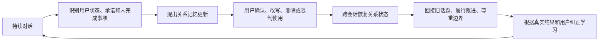

# VolvenceZero

## 产品定义

VolvenceZero 当前面向用户的产品是**七天连续关系助手**：一个用户可控、
能够跨会话延续关系的私人 AI 助手。它在持续互动中记住用户、关系边界、
承诺和未完成事项，并根据用户纠正与真实结果调整后续互动。

它要解决的不是单轮回答速度，而是普通聊天助手在长期互动中的关系断裂：

- 用户需要反复解释自己的背景和偏好；
- 系统可能记错人、记错事实，或错误地使用敏感信息；
- 上次承诺跟进的事情在下一次会话中没有下文；
- 用户指出错误后，系统仍可能重复同类问题。

产品的核心承诺是：

> 它不会只记住用户说过什么，而会学习怎样更准确、更守边界地继续与用户相处。

这里的“关系”首先指**用户与 AI 之间的长期关系连续性**。系统也可以帮助用户
探索伴侣、家庭和职场关系，但 MVP 的第一责任是确保 AI 自己认对人、记对事、
不越界、履行跟进，并在出错后能够修正。

### 产品闭环



关系记忆由用户逐条控制。当前 console 支持：记住、仅本次会话使用、改写、
删除、标记敏感和禁止主动提及。用户纠正会作为 typed outcome 回流；关系连续性
指标只用于评估，不反向成为学习信号。

### 产品层级

| 层级 | 定义 |
|---|---|
| 面向用户的产品 | 七天连续关系助手 |
| 核心技术平台 | Relationship Intelligence OS / Relationship Runtime |
| 当前 MVP 目标 | 验证关系连续性是否让用户感到被理解、被记住和被尊重 |
| 长期研究愿景 | 有界、可审计、持续适应的数字生命体 |

VolvenceZero 不是通用聊天机器人加一层向量记忆，也不是心理治疗产品、恋爱话术
工具或已经实现的通用 AGI。它把关系状态、记忆、边界、预测误差、信用分配和
多时间尺度适应作为同一个有界系统处理，而不是依赖 prompt 表演“很懂用户”。

### 当前状态与证据边界

七天连续关系助手的 P0-P6 产品闭环已经落地，包括关系更新提案、用户可控记忆
console、跨会话 owner hydration、纠正结果回流、连续性指标和 pilot harness。
Gate 8/11 已支持受限的 wake/sleep 与 per-user owner continuity 主张，但这只证明
系统能够维持隔离的用户状态，不等于真实用户已经感受到更好的关系质量。

正式的产品主张仍需要完成邀请制七天真人 pilot 和盲评。在此之前，项目应表述为
**关系智能实验产品**，而不是已经通过人类 ground truth 验证的关系型 AGI。

设计与实现边界见：

- [七天连续关系助手 MVP 计划](.cursor/plans/七天关系助手mvp_4afc864e.plan.md)
- [Relationship Memory Console 规范](docs/specs/relationship-memory-console.md)
- [产品需求文档](docs/prd.md)

## 启动关系助手

根目录提供了面向当前产品闭环的一键启动脚本。它默认启动 `companion` vertical，
使用通过用户事实记忆验收的 `Qwen/Qwen2.5-1.5B-Instruct`，并开启按用户隔离的
持久记忆：

```bash
./start_relationship_assistant.sh
```

服务就绪后访问 [http://127.0.0.1:8877/chat](http://127.0.0.1:8877/chat)。脚本在
前台运行，按 `Ctrl-C` 停止。默认记忆和证据分别保存在
`~/.volvence/alpha-memory` 与 `~/.volvence/alpha-evidence`。

可通过环境变量覆盖运行参数：

```bash
# Apple Silicon 默认 auto 会选择可用的 MPS；也可显式指定 cpu。
DEVICE=mps ./start_relationship_assistant.sh

# 模型已在 Hugging Face 本地缓存时禁止联网读取。
LOCAL_FILES_ONLY=1 ./start_relationship_assistant.sh

# 改用其他端口。
PORT=8878 ./start_relationship_assistant.sh
```

可用变量包括 `HOST`、`PORT`、`MODEL_ID`、`DEVICE`、`LOCAL_FILES_ONLY`、
`MEMORY_SCOPE_ROOT_DIR`、`EVIDENCE_ROOT_DIR` 和 `PYTHON`。0.5B 模型仅适合机制
冒烟测试，不能作为用户事实抽取与召回的产品验收模型。CPU 上完整认知链单轮可能
需要数分钟，交互部署应优先使用 MPS、CUDA 或后续的 vLLM 批处理服务。

## 可复现证据命令行（Apple MPS）

### 脚本完备性与证据状态

这里必须区分“执行脚本已经闭环”和“科学命题已经获得正式证据”：

当前结论是：七日各 Gate 的预注册、正式 runner、独立 auditor、N+1 substrate 表示预测
主判据和统一 MPS 控制面已经闭环；MSC 当前获准执行的
corpus/preflight/mechanism-smoke 链也已闭环。**实验工具完成不等于科学命题获得支持**：
新的七日 v3/v4、Gate 1 v2 和 Gate suite v2 尚未产生正式矩阵 artifact；MSC formal 的三个
架构 blocker，以及 Gate 8/11 capture 的正式运行和真人评分，也仍是未完成工作。

| 证据线 | 可执行链 | 当前证据状态 |
|---|---|---|
| 七日 Gate 8/11，base-only v3 | preregistration → 冻结执行根 → preflight → smoke → formal/resume → independent audit | N+1 主判据版契约和脚本完成；尚无正式 v3 矩阵 artifact。历史 v1 在 16/36 因 `instrument-discrimination` 停止，禁止原样续跑 |
| 七日 Gate 8/11，base + Common Adapter + Character Package v4 | 同上；额外冻结并审计 L1/L2 artifact 与逐 turn carrier attestation | 契约和脚本完成；尚无通过 ALLOW gate 的 ACTIVE 七日 smoke/formal artifact |
| 七日 Gate 1 v2 | 两臂专用 prereg/runner/auditor，由统一 MPS 入口调度 | N+1 共同主判据、Student-t CI 和严格 resume 已完成；尚无正式 MPS 矩阵 artifact |
| 七日 Gate 4/5/6/7/9/10 v2 | 每门独立 prereg；Gate 7 三臂，其余两臂；各自 runner/auditor | N+1 共同主判据、机制 smoke 和严格 resume 已完成；尚无各门 hardware-specific 正式矩阵 artifact |
| Gate 8/11 simulated capture + human anchor | capture runner → independent audit → blind packet → ratings analysis | 独立 runner 已下沉共享 MPS 锁和 no-fallback 探针；替代 72-run bundle 未运行，真人 ratings 仍是外部硬依赖 |
| MSC N+1 表示预测 | corpus download/status/preflight/resumable mechanism smoke | mechanism-only 可运行；formal 有意 fail-closed，固定退出码 `3` |

七日自动化结果最多支持 `simulated-user-real-lifecycle-only` 或对应 Gate 的
simulated product-ecology claim。它不替代真人盲评，不授权 production promotion，
也不能单独证明 AGI。

### 共同运行纪律

- 统一七日 Gate 控制面与 MSC N+1 控制面共享 `artifacts/.companion-evidence-mps.lock`；
  两个 MPS 阶段不能并行。
- 模型阶段强制 `PYTORCH_ENABLE_MPS_FALLBACK=0`，MPS 不可用时不得悄悄改用 CPU。
- `status` 和七日 `audit` 不占用 MPS，可以在另一条 MPS 任务运行时只读执行。
- 控制面启动的子进程设置 `PYTHONDONTWRITEBYTECODE=1`，不会向只读 execution root 写入 bytecode。
- 控制面落地前手工启动的旧进程不持有共享锁，开始新任务前必须单独确认它已经退出。
- 七日 formal runner 和 standalone Gate 8/11 capture runner 的直接入口也会获取同一把锁并
  执行 no-fallback MPS 探针，绕过统一控制面不能并发占用设备。
- 一个 preregistration 只对应一个 hardware/model/source snapshot 和一个输出根；MPS 与 CUDA
  artifact、不同 Gate、不同 schema、不同源码树均不得混跑或跨根续跑。

### 七日证据：统一入口

`scripts/run_seven_day_companion_test_plan.py` 根据 preregistration schema 自动选择正式
runner 和 auditor；用户不需要再给统一入口传 `--gate`：

| preregistration schema | 自动路由 |
|---|---|
| `seven-day-companion-simulated.v3` / character-stack `.v4` | Gate 8/11 continuity campaign |
| `gate1-seven-day-companion-prereg.v2` | Gate 1 |
| `companion-gate-suite-seven-day-prereg.v2` + `gate_id` | Gate 4/5/6/7/9/10 |

未知 schema、未知 `gate_id`、非 MPS preregistration、源码漂移、额外/损坏 run、审计 SHA
漂移都会 fail loudly。

#### 1. 创建新的 preregistration

base-only Gate 8/11 v3：

```bash
mkdir -p artifacts/preregistrations
SEVEN_DAY_PREREG="artifacts/preregistrations/seven-day-v3-$(date -u +%Y%m%dT%H%M%SZ).json"
.venv/bin/python scripts/preregister_seven_day_companion_simulated.py \
  --repo-root . \
  --output "$SEVEN_DAY_PREREG"
```

Gate 1（默认模型必须已经位于本机 Hugging Face cache）：

```bash
SEVEN_DAY_PREREG="artifacts/preregistrations/gate1-mps-$(date -u +%Y%m%dT%H%M%SZ).json"
.venv/bin/python scripts/preregister_seven_day_gate1.py \
  --repo-root . \
  --created-at-unix-ms "$(date +%s)000" \
  --device mps \
  --output "$SEVEN_DAY_PREREG"
```

Gate 4/5/6/7/9/10 示例（每门必须单独运行；这里以 Gate 7 为例）：

```bash
SEVEN_DAY_PREREG="artifacts/preregistrations/gate7-mps-$(date -u +%Y%m%dT%H%M%SZ).json"
.venv/bin/python scripts/preregister_seven_day_gate_suite.py \
  --gate 7 \
  --repo-root . \
  --created-at-unix-ms "$(date +%s)000" \
  --device mps \
  --output "$SEVEN_DAY_PREREG"
```

v4 character-stack 只有在 Common Adapter bundle 和 Character Package manifest 已通过各自 ALLOW gate、
且所有引用 artifact 都位于仓库根目录下时才可预注册：

```bash
SEVEN_DAY_PREREG="artifacts/preregistrations/seven-day-v4-$(date -u +%Y%m%dT%H%M%SZ).json"
.venv/bin/python scripts/preregister_seven_day_companion_simulated.py \
  --repo-root . \
  --common-adapter-bundle artifacts/common-adapters/qwen/v1/common-adapter-bundle.json \
  --character-package-manifest artifacts/characters/example/manifest.json \
  --character-id example \
  --character-vertical zhang_wuji \
  --output "$SEVEN_DAY_PREREG"
```

上述 v4 路径只是命令形状；文件不存在、digest 漂移、SHADOW/disabled package、缺失
Prefix/KV 或 Character LoRA 混入时都会被拒绝，不能为跑通命令而伪造 artifact。

#### 2. 生成 preregistration-bound 只读执行根

不要直接从会被其他 session 修改的工作区启动长矩阵。冻结器只复制 preregistration
`execution_source_snapshot` 中登记的文件，逐文件复算同一 tree SHA，并将结果设为只读；
目标目录必须不存在且位于源码仓库之外。

```bash
SEVEN_DAY_FROZEN_ROOT="/private/tmp/volvence-seven-day-$(date -u +%Y%m%dT%H%M%SZ)"
.venv/bin/python scripts/freeze_seven_day_execution_root.py \
  --repo-root . \
  --preregistration "$SEVEN_DAY_PREREG" \
  --output-root "$SEVEN_DAY_FROZEN_ROOT"
```

冻结目录会包含 `frozen_execution_root_manifest.json`，记录 preregistration SHA、tree SHA、
file count 和逐文件 SHA。已有目录不会被覆盖。

#### 3. preflight、smoke、formal、续跑和审计

Gate 8/11 也可以直接从仓库根目录一键启动。该入口会自动生成新的 v3 preregistration、
冻结只读 execution root，并执行 `all = preflight → smoke → formal → audit`：

```bash
bash run_seven_day_gate.sh
```

中断后不要重新生成 preregistration；使用第一次启动时打印出的三条路径续跑：

```bash
bash run_seven_day_gate.sh --resume \
  --preregistration artifacts/preregistrations/<same-run>.json \
  --execution-root /private/tmp/volvence-seven-day-<same-run> \
  --output-dir artifacts/seven-day-formal-<same-run>
```

根目录入口只封装 Gate 8/11；Gate 1、4、5、6、7、9、10 仍必须各自生成 preregistration，
并分别运行同一个 schema-driven control plane。旧的 `halt_record.json` 输出根不会被续跑。

```bash
SEVEN_DAY_OUTPUT="artifacts/seven-day-formal-$(date -u +%Y%m%dT%H%M%SZ)"

# MPS/model/scenario 预检；不创建 formal 输出目录。
.venv/bin/python "$SEVEN_DAY_FROZEN_ROOT/scripts/run_seven_day_companion_test_plan.py" preflight \
  --execution-root "$SEVEN_DAY_FROZEN_ROOT" \
  --preregistration "$SEVEN_DAY_PREREG"

# 非 claim 的 one-run/one-pair smoke。控制面从 formal 根自动派生
# artifacts/seven-day-formal-..._smoke；该 sibling 目录必须不存在。
.venv/bin/python "$SEVEN_DAY_FROZEN_ROOT/scripts/run_seven_day_companion_test_plan.py" smoke \
  --execution-root "$SEVEN_DAY_FROZEN_ROOT" \
  --preregistration "$SEVEN_DAY_PREREG" \
  --output-dir "$SEVEN_DAY_OUTPUT"

# smoke 通过后运行 exact preregistered matrix；formal 会验证 sibling smoke manifest。
.venv/bin/python "$SEVEN_DAY_FROZEN_ROOT/scripts/run_seven_day_companion_test_plan.py" formal \
  --execution-root "$SEVEN_DAY_FROZEN_ROOT" \
  --preregistration "$SEVEN_DAY_PREREG" \
  --output-dir "$SEVEN_DAY_OUTPUT"

# formal 得到 0（支持）或 2（完整但不支持）后都必须独立审计。
.venv/bin/python "$SEVEN_DAY_FROZEN_ROOT/scripts/run_seven_day_companion_test_plan.py" audit \
  --execution-root "$SEVEN_DAY_FROZEN_ROOT" \
  --preregistration "$SEVEN_DAY_PREREG" \
  --output-dir "$SEVEN_DAY_OUTPUT"
```

若尚未单独运行 smoke，也可在一个全新输出根直接执行 `all`；不要先手工 smoke 后再无
`--resume` 地执行 `all`，因为 `all` 会自行创建同一个 sibling smoke 根。

运行中可在另一个终端查看状态：

```bash
.venv/bin/python "$SEVEN_DAY_FROZEN_ROOT/scripts/run_seven_day_companion_test_plan.py" status \
  --preregistration "$SEVEN_DAY_PREREG" \
  --output-dir "$SEVEN_DAY_OUTPUT"
```

正常中断后只允许在同一 preregistration、同一冻结 execution root、同一输出根上续跑。
resume 会逐 run 复核 schema、case/arm 身份、7×5 turn、restart/scope 链、runtime profile、
v4 stack attestation 和完整 N+1 lineage；不完整 run 会移入可恢复的 `quarantine/` 后只重跑该臂。
存在 `halt_record.json` 且 `resume_as_is_authorized=false` 时控制面会硬拒绝续跑：

```bash
.venv/bin/python "$SEVEN_DAY_FROZEN_ROOT/scripts/run_seven_day_companion_test_plan.py" formal \
  --execution-root "$SEVEN_DAY_FROZEN_ROOT" \
  --preregistration "$SEVEN_DAY_PREREG" \
  --output-dir "$SEVEN_DAY_OUTPUT" \
  --resume

.venv/bin/python "$SEVEN_DAY_FROZEN_ROOT/scripts/run_seven_day_companion_test_plan.py" audit \
  --execution-root "$SEVEN_DAY_FROZEN_ROOT" \
  --preregistration "$SEVEN_DAY_PREREG" \
  --output-dir "$SEVEN_DAY_OUTPUT"
```

formal 返回 `0` 表示预注册的 mechanism、Gate primary、held-out N+1 substrate prediction
和 safety 判据获得支持，返回 `2` 表示完整但否定性的科学结果；Day-7 owner continuity
只保留为 nullable secondary diagnostic。所有 paired 95% CI 使用冻结的 Student-t 方法，
`n < 2` 不产生 CI。`all`
对这两种结果都会继续独立审计，并在审计通过后保留 formal 的退出码。其他非零退出码表示
执行或完整性失败。只有 exact matrix、当前 evaluation SHA 和绑定同一 preregistration SHA
的 independent audit 同时有效时，`status` 才会输出 `analysis_allowed=true`。

正式 runner 会自动持续落盘 frozen user scripts、每个完成臂的 run envelope、每日
measurement checkpoints、跨日 archive/loaded-copy digests、service logs、evaluation 和
verdict；这些中间材料首先用于续跑和完整性审计，不能在矩阵封口前用于挑 seed、改阈值或
形成 effect claim。

Gate 8/11 simulated capture 与真人盲评是独立的后续证据线，不由上面的 schema-dispatch
控制面启动。它的 runner、独立 auditor、盲包生成器和 ratings analyzer 均已有 CLI，直接
runner 已持有共享 MPS 锁并强制关闭 fallback；同时，
替代 capture source preregistration 尚未执行完 72-run bundle，且真人评分不能自动化。
因此 README 暂不把旧冻结 preregistration 写成可续跑的一键命令；必须先按当前源码生成新的
preregistration/只读执行根，并确保七日或 MSC 的 MPS 阶段已经退出。详细 shape 与历史冻结
状态见下方 evidence spec。

### MSC N+1 表示预测研究线

MSC v0.1 只允许在接受 noncommercial research 条款后下载。下载器执行 archive SHA、split
数量和 sorted-id SHA 校验，并生成 `DOWNLOAD_PROVENANCE.json`：

```bash
.venv/bin/python scripts/download_msc_corpus.py \
  --accept-noncommercial-license \
  --output-dir data/external/msc/v0.1
```

当前控制面允许 status、真实 MPS preflight 和可续跑的 mechanism-only smoke：

```bash
.venv/bin/python scripts/run_msc_prediction_test_plan.py status

.venv/bin/python scripts/run_msc_prediction_test_plan.py preflight \
  --msc-root data/external/msc/v0.1/extracted \
  --preflight-report artifacts/msc-n-plus-one/preflight.json

.venv/bin/python scripts/run_msc_prediction_test_plan.py smoke \
  --msc-root data/external/msc/v0.1/extracted \
  --output-dir artifacts/msc-n-plus-one/mechanism-smoke \
  --resume
```

smoke journal 按 corpus/model/source/configuration fingerprint 续跑，不保留 MSC 原文；最终
manifest 封口前 `analysis_allowed=false`，封口后仍为 mechanism pilot，不能取得 thesis
formal claim。当前执行：

```bash
.venv/bin/python scripts/run_msc_prediction_test_plan.py formal
```

会固定返回退出码 `3`，直到以下三项全部落地并预注册：

1. 同一冻结 substrate 的 full-history context encoder；
2. 完整 Volvence runtime arm/collector；
3. 只改变 temporal-controller `n_z` 的容量阶梯。

详细证据契约见 [Seven-Day Companion Evidence](docs/specs/seven-day-companion-evidence.md)、
[Prediction Error Loop](docs/specs/prediction-error-loop.md) 和
[当前状态](docs/currentstatus.md)。

## State-KV Carrier Identification

The State-KV runner tests whether two users can receive distinguishable
responses through model-layer personal state while the pure arms send
byte-identical prompts and no conversation history:

```bash
# Zero-cost wiring smoke.
python scripts/run_state_kv_identification.py --lane smoke

# Real frozen Qwen2.5-0.5B; local weights only by default.
python scripts/run_state_kv_identification.py \
  --lane p1 \
  --model-id Qwen/Qwen2.5-0.5B-Instruct \
  --device cpu

# Bake and explicitly test the reversible contrastive projector artifact.
python scripts/bake_state_kv_projector.py \
  --model-id Qwen/Qwen2.5-0.5B-Instruct \
  --device cpu
python scripts/run_state_kv_identification.py \
  --lane p1 \
  --model-id Qwen/Qwen2.5-0.5B-Instruct \
  --device cpu \
  --projector-artifact \
  artifacts/state_kv/projectors/qwen2.5-0.5b-contrastive.json
```

The P1 lane reuses one frozen Transformers runtime across all four arms,
forces deterministic decoding, and gives both personas the same response
assembly so the sampling-layer carrier is closed. It writes the verdict,
full response transcript, and content-addressed substrate fingerprint under
`artifacts/state_kv/p1/`. Without a cross-family blind judge the identification
and causality claims remain `insufficient_data`; a real residual hook alone is
not promoted into a retained result. The learned-projector lane writes to
`artifacts/state_kv/p1-learned/`; omitting `--projector-artifact` is its rollback.
On the recorded Qwen 0.5B matched run, both fixed and contrastive projectors
failed output divergence on probes p0/p2, so the artifact remains evidence-only.

The P3 lane adds a fifth arm, `state-kv-arm-g-prefix-pure`, which carries the
same readout as a bounded per-layer key/value prefix instead of a single-layer
residual, and makes it the candidate arm. Train the generator with
`scripts/train_state_kv_prefix.py` (teacher is the text arm; the base model
stays frozen and only 123k generator parameters move), then pass
`--lane p3 --prefix-kv-artifact ...`; omitting the artifact is its rollback.
Running the same artifact on CPU and MPS is what separates carrier effects from
numerical noise: the residual arm's single divergence disappears when the
device changes, while the prefix arm diverges on probes p0/p2 under both. That
is a bandwidth result, not an identification one — the wrong-user negative
control sits at chance (0.508), probe p1 is still byte-identical across users,
so claim 2 fails and the blind judge stays unwired. Evidence is under
`artifacts/state_kv/p3/` and `artifacts/state_kv/p3-mps/`.

## Semantic Grounding Evidence

One command runs the two experiments of
`docs/specs/semantic-grounding-evidence.md` — the latent–semantic
grounding readout (D1 discrimination / D2 lead / D3 transfer with
shuffled controls) and the LLM-proposal dependency ablation (matched
on/off arms). These feed `claim_latent_abstraction_semantically_grounded`
and `claim_semantic_tracking_not_llm_dependent` in
`docs/specs/evidence_program.md`.

```bash
# Anytime (CI-safe, ~1 min): harness unit tests + synthetic smoke lane.
bash run_semantic_grounding_evidence.sh

# Milestone evidence run (real Qwen substrate; the citable one):
bash run_semantic_grounding_evidence.sh --lane hf --substrate-device mps
bash run_semantic_grounding_evidence.sh --lane hf --substrate-device cuda

# First hf run on a machine without cached weights:
bash run_semantic_grounding_evidence.sh --lane hf --substrate-allow-download

# Everything (unit + smoke + hf):
bash run_semantic_grounding_evidence.sh --lane all
```

Each run writes a fresh timestamped directory under
`artifacts/semantic_grounding_evidence/` containing per-stage logs, the
two report artifacts with sha256 manifests, and a `summary.json` with
per-stage status and extracted verdicts. Exit code is non-zero on any
stage failure.

Evidence tiers (enforced in the artifacts, not just by convention):

- `unit` — pytest acceptance for both harnesses. Validates the harness,
  produces no evidence.
- `smoke` — synthetic substrate. Wiring + differential-design check
  only; reports are stamped `evidence_tier: synthetic-smoke` and the
  grounding verdict is expected to be `insufficient-coverage`. Never
  citable for the claims.
- `hf` — shared real substrate for both ablation arms (identical
  residual path; only the proposal channel differs) plus a real-trace
  grounding capture. This is the lane that produces claim evidence. A
  grounding `fail` here is a kill signal for the "emergent abstraction
  is grounded" claim and must be reported as-is; an ablation
  `llm-proposal-dependent` verdict downgrades the external claim to
  "LLM-assisted typed semantic tracking".

If the hf grounding report says `insufficient-coverage`, raise
`--hf-turns-per-case` (coverage gate: >= 50 closed segments). The
channel-level runtime switch used by the off arm is also available for
manual A/B on any vertical: `VZ_SEMANTIC_PROPOSAL_CHANNEL=noop`.

## Learned Backend ACTIVE Evidence

The root launchers below are thin shell wrappers around the Python evidence
tools under `scripts/`. They do not flip runtime defaults; they only run and
assemble evidence for SHADOW -> ACTIVE promotion.

### One-Command Resume Runner

Use this for the full resumable evidence pipeline:

```bash
bash run_learned_active_evidence.sh --resume --substrate-mode hf --substrate-device mps
```

On Windows / CUDA hosts, use:

```bash
bash run_learned_active_evidence.sh --resume --substrate-mode hf --substrate-device cuda
```

If you are running from Windows PowerShell without Git Bash, use the `.ps1`
launcher:

```powershell
powershell -ExecutionPolicy Bypass -File .\run_learned_active_evidence.ps1 --resume --substrate-mode hf --substrate-device cuda
```

The runner records per-stage markers under `artifacts/learned_active_evidence/`
and skips completed stages on the next `--resume`.

### Individual Launchers

```bash
bash run_learned_shadow_smoke.sh
bash run_learned_shadow_soak.sh --turns 500 --substrate-mode hf --substrate-device mps
bash run_learned_capacity_ladder.sh --n-z 16,64,256 --turns 500
bash run_learned_promotion_evidence.sh --soak-artifact artifacts/.../learned_shadow_soak.json --ablation-verdict artifacts/.../verdict_p1.json
bash run_affordance_learner_probe.sh
bash run_longitudinal_continuity.sh
```

PowerShell equivalents:

```powershell
powershell -ExecutionPolicy Bypass -File .\run_learned_shadow_smoke.ps1
powershell -ExecutionPolicy Bypass -File .\run_learned_shadow_soak.ps1 --turns 500 --substrate-mode hf --substrate-device cuda
powershell -ExecutionPolicy Bypass -File .\run_learned_capacity_ladder.ps1 --n-z 16,64,256 --turns 500
powershell -ExecutionPolicy Bypass -File .\run_learned_promotion_evidence.ps1 --soak-artifact artifacts\...\learned_shadow_soak.json --ablation-verdict artifacts\...\verdict_p1.json
powershell -ExecutionPolicy Bypass -File .\run_affordance_learner_probe.ps1
powershell -ExecutionPolicy Bypass -File .\run_longitudinal_continuity.ps1
```

### CompanionBench P1 on Windows

`run_learned_active_evidence.ps1` expects the CompanionBench P1 readiness
manifest when it reaches the same-substrate ablation stage. Generate or resume
that P1 run from PowerShell with:

```powershell
.\run_companion_bench_p1.ps1
```

The Windows P1 launcher defaults to SafeMode to keep RDP and the desktop
responsive on single-GPU machines. SafeMode uses the lightweight hashing
retrieval embedder, limits common math-library thread pools, starts service
processes at `BelowNormal` priority, and launches a watchdog for the current
run's `serve.pids`.

The watchdog writes logs under the run's `serve-logs/watchdog.log`. If available
RAM stays below `4GB` or GPU memory usage stays at or above `94%` for three
consecutive checks, it stops the P1 services for that run rather than letting
the machine become unreachable.

Use full-resource mode only when the host can tolerate it:

```powershell
.\run_companion_bench_p1.ps1 -FullMode
```

To stop a stuck or leftover P1 run, including its watchdog:

```powershell
.\run_companion_bench_p1.ps1 -Stop
```

### Evidence Boundary

`run_learned_active_evidence.sh` and `run_learned_active_evidence.ps1` invoke
the same Python orchestrator. ACTIVE promotion still requires real evidence: a
continuous `hf` substrate soak, enough real trace turns, capacity/gain evidence,
component ablation verdicts, CMS anti-forgetting A/B, and a passing promotion
report. Chunked/platform soak artifacts are stability evidence only and are not
treated as promotion evidence.
