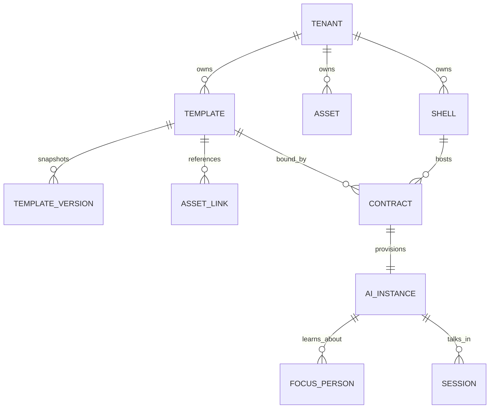
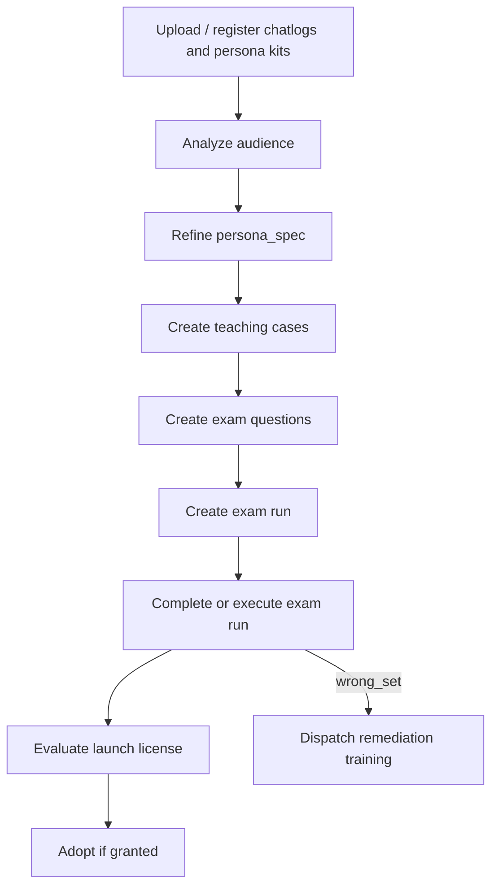

# DLaaS Public API Reference

> Complete public integration guide for Digital-Life-as-a-Service (DLaaS).
>
> Base URL: `https://lteevee.com:8001`
>
> Current protocol: `dlaas/v1`
>
> Audience: mobile apps, web shells, server-side automations, partner
> platforms, studio tools, and ops dashboards.

This README is intended to be enough for an external team to build against
DLaaS without reading server code. It documents the public HTTP surface, the
resource lifecycle, concrete request/response examples, and recommended client
patterns. Anything not listed here is private and may change without notice.

## Mental Model

DLaaS has two public layers:

- **Control plane**: low-frequency setup APIs for tenant registration, shell
  declaration, assets, templates, studio sessions, contracts, exams, and launch
  readiness.
- **Runtime plane**: day-to-day APIs for adopting an AI, talking to it,
  sending observations and feedback, registering people, checking handoff
  queues, and operating live conversations.

External shells should normally call the **platform-side** endpoints documented
here. The platform validates tenant/contract ownership and proxies runtime
traffic to the correct AI instance.

```mermaid
flowchart LR
  Tenant[Integrator / Tenant] -->|Control-plane secret| RegisterTenant[Register tenant]
  RegisterTenant -->|api_key + api_secret| Shell[Declare shell]
  Shell --> Asset[Create / attach assets]
  Asset --> Template[Create template]
  Template --> Activate[Activate seed]
  Activate --> Readiness[Check readiness]
  Readiness --> Publish[Publish template]
  Publish --> Contract[Create or adopt contract]
  Contract --> Adopt[Adopt AI instance]
  Adopt --> Runtime[Runtime interactions]
  Runtime --> Ops[Ops / handoff / monitoring]
```



## Quick Start

The minimum production path is:

1. Register a tenant and store the returned `api_key` / `api_secret`.
2. Declare one deployment shell.
3. Create a template with persona and seed configuration.
4. Activate the template, check readiness, then publish it.
5. Adopt the template into a concrete `ai_id`.
6. Send `POST /dlaas/instances/{ai_id}/interactions` for chat/report/teach/task.
7. Send `observe` and `feedback` whenever your shell learns something useful.

```bash
export DLAAS_BASE_URL="https://lteevee.com:8001"
export CONTROL_PLANE_SECRET="replace_with_bootstrap_secret"
export TENANT_ID="ten_xxx"
export TENANT_KEY="tk_xxx"
export TENANT_SECRET="ts_xxx"
export TEMPLATE_ID="tpl_xxx"
export SHELL_ID="partner_web_prod"
export AI_ID="ai_xxx"
export CONTRACT_ID="ctr_xxx"
```

## Authentication

There are three auth modes. Use the narrowest mode possible.

### Tenant Auth

Most tenant-owned APIs require tenant credentials:

```http
X-Tenant-Api-Key: <api_key>
X-Tenant-Api-Secret: <api_secret>
Content-Type: application/json
```

Compatibility aliases are also accepted:

```http
X-DLaaS-Tenant-Key: <api_key>
X-DLaaS-Tenant-Secret: <api_secret>
```

Tenant credentials are scoped to one `tenant_id`. If a request body includes a
different `tenant_id`, the API returns `403`.

### Control-Plane Secret

Tenant bootstrap and cross-tenant admin views require:

```http
X-Control-Plane-Secret: <secret>
```

Some admin endpoints also accept:

```http
X-Service-Secret: <secret>
```

Do not use service secrets for normal tenant resources. Tenant-owned resources
such as shells, templates, contracts, assets, and runtime interactions require
tenant credentials.

### Runtime Instance Token

`POST /dlaas/adopt` returns `instance_token`, but the public platform-side
runtime endpoints still authenticate with tenant credentials and validate
`contract_id`. Treat the instance token as a runtime credential for internal or
diagnostic integrations only unless the platform team explicitly tells you to
use it.

## IDs And Resource Graph

Typical identifiers:

- `tenant_id`: owner of all control-plane resources.
- `shell_id`: the external host/channel/device that will embody the AI.
- `template_id`: reusable persona + seed + asset bundle.
- `template_version`: immutable version snapshot.
- `contract_id`: binding between tenant, template, shell, tool policy, and AI.
- `ai_id`: concrete adopted runtime instance.
- `session_id`: one conversation or workflow session.
- `end_user_ref`: your stable user identifier in your own system.
- `person_id`: a focus person remembered by the AI.



## End-To-End Walkthrough

This walkthrough shows the complete happy path.

### 1. Register Tenant

`POST /dlaas/tenants`

Auth: control-plane secret.

```bash
curl -sS "$DLAAS_BASE_URL/dlaas/tenants" \
  -H "X-Control-Plane-Secret: $CONTROL_PLANE_SECRET" \
  -H "Content-Type: application/json" \
  -d '{
    "tenant_name": "Acme Education",
    "contact_email": "ops@acme.example",
    "business_type": "education",
    "billing_plan": "pay_as_you_go",
    "quota": {
      "max_instances": 50,
      "monthly_interactions": 100000
    }
  }'
```

Example response:

```json
{
  "status": "ok",
  "tenant_id": "ten_8e05f7",
  "api_key": "tk_2P...",
  "api_secret": "ts_l7...",
  "platform_endpoint": "https://lteevee.com:8001/dlaas"
}
```

Store `api_secret` immediately. It is returned only at creation time.

### 2. Declare A Deployment Shell

`POST /dlaas/shells`

Auth: tenant auth.

```bash
curl -sS "$DLAAS_BASE_URL/dlaas/shells" \
  -H "X-Tenant-Api-Key: $TENANT_KEY" \
  -H "X-Tenant-Api-Secret: $TENANT_SECRET" \
  -H "Content-Type: application/json" \
  -d '{
    "shell_id": "partner_web_prod",
    "shell_kind": "deployment",
    "shell_type": "web_chat",
    "display_name": "Acme Web Tutor",
    "embodiment": {
      "perception": ["page_context", "user_profile", "uploaded_file"],
      "expression": ["text_streaming", "markdown"],
      "action": ["open_url", "schedule_callback"],
      "constraints": {
        "max_response_chars": 2000,
        "no_unapproved_external_messages": true
      }
    },
    "channel": {
      "type": "web",
      "region": "cn",
      "callback_url": "https://acme.example/dlaas/webhook"
    },
    "scene_meta": {
      "product": "after_school_tutoring",
      "default_lang": "cn"
    }
  }'
```

Example response:

```json
{
  "status": "ok",
  "tenant_id": "ten_8e05f7",
  "shell_id": "partner_web_prod",
  "shell_kind": "deployment",
  "capabilities_accepted": ["perception", "expression", "action"]
}
```

`shell_kind` must be `deployment` for adoption. Studio shells are for training
and testing only.

### 3. Create Assets

`POST /dlaas/assets`

Assets are references to material your tenant owns: chat logs, manuals, persona
kits, knowledge files, recordings, policy documents, and similar sources.

```bash
curl -sS "$DLAAS_BASE_URL/dlaas/assets" \
  -H "X-Tenant-Api-Key: $TENANT_KEY" \
  -H "X-Tenant-Api-Secret: $TENANT_SECRET" \
  -H "Content-Type: application/json" \
  -d '{
    "tenant_id": "'"$TENANT_ID"'",
    "asset_type": "persona_kit",
    "title": "Primary School Math Tutor Persona Kit",
    "uri": "s3://acme-dlaas/persona/math_tutor_v1.md",
    "mime_type": "text/markdown",
    "language": "zh-CN",
    "source_meta": {
      "owner": "acme",
      "version": "2026-05-01",
      "contains_pii": false
    }
  }'
```

Example response:

```json
{
  "status": "ok",
  "tenant_id": "ten_8e05f7",
  "asset_id": "ast_9c1a"
}
```

### 4. Create A Template

`POST /dlaas/templates`

The template is the reusable persona and seed package. `runtime_template_id`
bridges the control-plane template to a runtime-compatible soul template. The
readiness gate requires a non-empty `runtime_template_id` before publication.

```bash
curl -sS "$DLAAS_BASE_URL/dlaas/templates" \
  -H "X-Tenant-Api-Key: $TENANT_KEY" \
  -H "X-Tenant-Api-Secret: $TENANT_SECRET" \
  -H "Content-Type: application/json" \
  -d '{
    "tenant_id": "'"$TENANT_ID"'",
    "template_name": "Acme Math Growth Advisor",
    "domain": "education",
    "description": "A patient math tutor for primary-school students.",
    "runtime_template_id": "dongfang_growth_advisor__job_seed_v1",
    "base_persona": {
      "language": "zh-CN",
      "audience": "primary_school_student"
    },
    "persona_spec": {
      "display_name": "小鹿数学老师",
      "role_archetype": "growth_advisor",
      "speaking_style": "warm, concise, encouraging",
      "value_boundaries": [
        "never shame the learner",
        "ask before escalating to parents"
      ],
      "background_story": "A long-term learning companion focused on confidence and concept mastery.",
      "traits": {
        "openness": 0.72,
        "conscientiousness": 0.82,
        "extraversion": 0.55,
        "agreeableness": 0.9,
        "neuroticism": 0.22
      }
    },
    "seed_config": {
      "domain_seed": "primary_math_tutor",
      "soul_template_kind": "education_growth_advisor",
      "pretrain_persona_id": "math_growth_advisor",
      "pretrain_persona_name": "小鹿数学老师"
    }
  }'
```

Example response:

```json
{
  "status": "ok",
  "tenant_id": "ten_8e05f7",
  "template_id": "tpl_73cd",
  "version": 1
}
```

### 5. Attach Assets To The Template

`POST /dlaas/templates/{template_id}/assets`

```bash
curl -sS "$DLAAS_BASE_URL/dlaas/templates/$TEMPLATE_ID/assets" \
  -H "X-Tenant-Api-Key: $TENANT_KEY" \
  -H "X-Tenant-Api-Secret: $TENANT_SECRET" \
  -H "Content-Type: application/json" \
  -d '{
    "asset_id": "ast_9c1a",
    "role": "persona_source",
    "link_meta": {
      "importance": "high",
      "usage": "activation_seed"
    }
  }'
```

### 6. Activate The Template

`POST /dlaas/templates/{template_id}/activate`

Activation loads built-in or custom seed payloads into the template. The result
is later forwarded to the runtime instance during adoption.

```bash
curl -sS "$DLAAS_BASE_URL/dlaas/templates/$TEMPLATE_ID/activate" \
  -H "X-Tenant-Api-Key: $TENANT_KEY" \
  -H "X-Tenant-Api-Secret: $TENANT_SECRET" \
  -H "Content-Type: application/json" \
  -d '{
    "seed_config_override": {
      "domain_seed": "primary_math_tutor"
    }
  }'
```

Example response:

```json
{
  "status": "ok",
  "template_id": "tpl_73cd",
  "activation_status": "activated",
  "activation_result": {
    "sphere_payload": {
      "eta_world_nodes": [],
      "eta_self_nodes": [],
      "reward_records": []
    },
    "stats": {
      "world_nodes": 8,
      "self_nodes": 5,
      "l2_cards": 12
    }
  },
  "stats": {
    "world_nodes": 8,
    "self_nodes": 5,
    "l2_cards": 12
  }
}
```

### 7. Check Readiness And Publish

`GET /dlaas/templates/{template_id}/readiness`

```bash
curl -sS "$DLAAS_BASE_URL/dlaas/templates/$TEMPLATE_ID/readiness" \
  -H "X-Tenant-Api-Key: $TENANT_KEY" \
  -H "X-Tenant-Api-Secret: $TENANT_SECRET"
```

Example ready response:

```json
{
  "ready": true,
  "missing": [],
  "activation_status": "activated",
  "world_nodes": 8,
  "self_nodes": 5,
  "l2_cards": 12,
  "has_runtime_template_id": true
}
```

Publish with `PATCH /dlaas/templates/{template_id}`:

```bash
curl -sS -X PATCH "$DLAAS_BASE_URL/dlaas/templates/$TEMPLATE_ID" \
  -H "X-Tenant-Api-Key: $TENANT_KEY" \
  -H "X-Tenant-Api-Secret: $TENANT_SECRET" \
  -H "Content-Type: application/json" \
  -d '{
    "status": "published",
    "version_note": "Initial public launch candidate"
  }'
```

If `ready` is false, fix the missing items before publishing. A published
template can be adopted; a draft template cannot.

### 8. Adopt An AI Instance

`POST /dlaas/adopt`

Adoption creates a concrete runtime AI, creates/updates the contract, registers
focus persons, forwards tool policy, activates the seed payload, and wakes the
instance.

```bash
curl -sS "$DLAAS_BASE_URL/dlaas/adopt" \
  -H "X-Tenant-Api-Key: $TENANT_KEY" \
  -H "X-Tenant-Api-Secret: $TENANT_SECRET" \
  -H "Content-Type: application/json" \
  -d '{
    "tenant_id": "'"$TENANT_ID"'",
    "template_id": "'"$TEMPLATE_ID"'",
    "template_version": 1,
    "shell_id": "'"$SHELL_ID"'",
    "owner_user_id": "acme_owner_001",
    "engine_tools": {
      "web_browse": false,
      "web_search": true,
      "data_query": {
        "enabled": true,
        "allowed_sources": ["acme_lms", "acme_crm"]
      },
      "content_analysis": true,
      "image_understanding": false,
      "code_execution": false
    },
    "service_contract": {
      "awake_strategy": "on_demand",
      "sla": "standard",
      "handoff_policy": "operator_on_low_confidence"
    },
    "focus_persons": [
      {
        "person_id": "student_10001",
        "name": "小明",
        "role": "student",
        "relationship_to_owner": "learner",
        "age": 10,
        "initial_profile": {
          "grade": "四年级",
          "strengths": ["计算速度快"],
          "weaknesses": ["应用题读题不仔细"]
        }
      }
    ]
  }'
```

Example response:

```json
{
  "ai_id": "ai_2f7d",
  "contract_id": "ctr_a91b",
  "tenant_id": "ten_8e05f7",
  "template_id": "tpl_73cd",
  "instance_endpoint": "https://lteevee.com:8001/api/v1/ai-companions/ai_2f7d",
  "instance_token": "inst_tok_f1...",
  "contract_status": "active",
  "awake_strategy": "on_demand",
  "engine_tools": {
    "web_browse": false,
    "web_search": true,
    "data_query": {
      "enabled": true,
      "allowed_sources": ["acme_lms", "acme_crm"]
    },
    "content_analysis": true,
    "image_understanding": false,
    "code_execution": false
  },
  "tool_policy_snapshot": {
    "web_browse": false,
    "web_search": true,
    "data_query": {
      "enabled": true,
      "allowed_sources": ["acme_lms", "acme_crm"]
    },
    "content_analysis": true,
    "image_understanding": false,
    "code_execution": false,
    "enabled_capabilities": ["web_search", "data_query", "content_analysis"]
  },
  "persons_registered": [
    {
      "person_id": "student_10001",
      "name": "小明",
      "role": "student",
      "card_created": true
    }
  ]
}
```

### 9. Send A Chat Interaction

`POST /dlaas/instances/{ai_id}/interactions`

```bash
curl -N "$DLAAS_BASE_URL/dlaas/instances/$AI_ID/interactions" \
  -H "X-Tenant-Api-Key: $TENANT_KEY" \
  -H "X-Tenant-Api-Secret: $TENANT_SECRET" \
  -H "Content-Type: application/json" \
  -d '{
    "contract_id": "'"$CONTRACT_ID"'",
    "protocol_version": "dlaas/v1",
    "session_id": "sess_math_20260505_001",
    "end_user_ref": "student_10001",
    "interaction_type": "chat",
    "mode": "live",
    "human_brief": "我今天分数应用题又错了，怎么提高？",
    "structured_context": {
      "channel_type": "web_chat",
      "target_person_ids": ["student_10001"],
      "current_page": "homework_review",
      "problem_topic": "fractions"
    },
    "output_contract": {
      "delivery_channel": "dlaas",
      "format": "text",
      "stream": true
    },
    "lang": "cn"
  }'
```

The runtime may return JSON or an SSE response depending on launcher/runtime
configuration. SSE events use this general shape:

```text
event: ack
data: {"response_id":"resp_abc","session_id":"sess_math_20260505_001","interaction_type":"chat"}

event: act
data: {"act_type":"text","capability":"text_streaming","payload":{"content":"先别急..."},"degraded":false,"original_capability":""}

event: chunk
data: {"content":"先别急，我们可以把应用题拆成三步..."}

event: done
data: {"response_id":"resp_abc"}
```

Client rule: prefer `event: act` for structured output, fall back to `chunk`
for plain streaming text.

## Runtime Interaction Types

All runtime traffic should use `POST /dlaas/instances/{ai_id}/interactions`
unless you need one of the compatibility endpoints.

```mermaid
flowchart TD
  Shell[External shell] --> Platform[POST /dlaas/instances/{ai_id}/interactions]
  Platform --> Ownership[Validate tenant + contract_id + ai_id]
  Ownership --> Takeover{Session paused?}
  Takeover -->|yes| Placeholder[Return operator_takeover placeholder]
  Takeover -->|no| Launcher[Find launcher for ai_id]
  Launcher --> Runtime[Proxy /dlaas/interactions]
  Runtime --> Cycle[Runtime cognitive pipeline]
  Cycle --> Acts[OutputAct / chunks]
  Acts --> Ledger[Append interaction ledger]
  Ledger --> Shell
```

### `chat`

Use for normal user conversation.

```json
{
  "contract_id": "ctr_a91b",
  "protocol_version": "dlaas/v1",
  "session_id": "sess_001",
  "end_user_ref": "student_10001",
  "interaction_type": "chat",
  "mode": "live",
  "human_brief": "帮我复盘今天错题。",
  "structured_context": {
    "target_person_ids": ["student_10001"]
  },
  "lang": "cn"
}
```

### `report`

Use when the user or shell wants a structured report. The runtime receives a
report instruction and emits a `REPORT_READY` event internally when complete.

```json
{
  "contract_id": "ctr_a91b",
  "protocol_version": "dlaas/v1",
  "session_id": "report_weekly_2026w18",
  "end_user_ref": "parent_009",
  "interaction_type": "report",
  "mode": "live",
  "human_brief": "请生成小明本周数学学习报告。",
  "structured_context": {
    "report_type": "weekly_learning",
    "period": "2026-04-29/2026-05-05",
    "target_person_ids": ["student_10001"]
  },
  "lang": "cn"
}
```

### `observe`

Use for observations that should become memory and context, such as LMS events,
classroom notes, recordings, page context, or private shell data requested by
the runtime.

```json
{
  "contract_id": "ctr_a91b",
  "protocol_version": "dlaas/v1",
  "session_id": "obs_homework_001",
  "end_user_ref": "student_10001",
  "interaction_type": "observe",
  "mode": "live",
  "human_brief": "学生完成 10 道分数应用题，错 4 道，主要错在单位转换。",
  "structured_context": {
    "observation_type": "homework_result",
    "target_person_ids": ["student_10001"],
    "score": 60,
    "topic": "fractions",
    "source": "acme_lms"
  },
  "lang": "cn"
}
```

### `feedback`

Use when a human or system evaluates a response. Feedback is stored as a
learning event and can influence future strategy.

```json
{
  "contract_id": "ctr_a91b",
  "protocol_version": "dlaas/v1",
  "session_id": "sess_001",
  "end_user_ref": "teacher_003",
  "interaction_type": "feedback",
  "mode": "live",
  "human_brief": "这次解释很好，孩子听懂了。",
  "structured_context": {
    "target_person_ids": ["student_10001"]
  },
  "feedback": {
    "valence": "correct",
    "target_response_id": "resp_abc",
    "intensity": 0.9,
    "scope": "response",
    "evidence": "学生随后独立做对了同类题。"
  },
  "lang": "cn"
}
```

### `teach`

Use for operator/apprentice teaching. This is not ordinary user chat; it is an
instructional signal intended to shape future behavior.

```json
{
  "contract_id": "ctr_a91b",
  "protocol_version": "dlaas/v1",
  "session_id": "teach_style_001",
  "end_user_ref": "operator_007",
  "interaction_type": "teach",
  "mode": "apprentice",
  "human_brief": "遇到学生情绪低落时，先共情，再给一个很小的下一步行动。",
  "structured_context": {
    "target_person_ids": ["student_10001"],
    "teaching_case_id": "case_emotion_001"
  },
  "lang": "cn"
}
```

### `task`

Use for operational instructions or apprentice-mode tasks.

```json
{
  "contract_id": "ctr_a91b",
  "protocol_version": "dlaas/v1",
  "session_id": "task_001",
  "end_user_ref": "operator_007",
  "interaction_type": "task",
  "mode": "apprentice",
  "human_brief": "阅读这组错题材料，提炼出三条讲解策略。",
  "structured_context": {
    "target_person_ids": ["student_10001"],
    "material_asset_ids": ["ast_wrongset_001"]
  },
  "lang": "cn"
}
```

### `command`

Use for structured shell commands. Commands are injected as perturbations rather
than normal chat.

```json
{
  "contract_id": "ctr_a91b",
  "protocol_version": "dlaas/v1",
  "session_id": "cmd_001",
  "end_user_ref": "operator_007",
  "interaction_type": "command",
  "mode": "live",
  "human_brief": "refresh_person_context",
  "structured_context": {
    "target_person_ids": ["student_10001"],
    "reason": "profile updated in CRM"
  }
}
```

## Compatibility Runtime Endpoints

Prefer `interactions` for new clients. These aliases exist for simpler clients
and older integrations.

### Observe

`POST /dlaas/instances/{ai_id}/observe`

```bash
curl -sS "$DLAAS_BASE_URL/dlaas/instances/$AI_ID/observe" \
  -H "X-Tenant-Api-Key: $TENANT_KEY" \
  -H "X-Tenant-Api-Secret: $TENANT_SECRET" \
  -H "Content-Type: application/json" \
  -d '{
    "contract_id": "'"$CONTRACT_ID"'",
    "user_id": "student_10001",
    "observation_type": "class_note",
    "asset_id": "ast_note_001",
    "human_brief": "老师反馈：小明对面积单位换算仍不稳定。",
    "structured_context": {
      "source": "teacher_note",
      "topic": "unit_conversion"
    },
    "data": {
      "confidence": 0.8
    },
    "person_ids": ["student_10001"],
    "perception_request_id": ""
  }'
```

### Feedback

`POST /dlaas/instances/{ai_id}/feedback`

```bash
curl -sS "$DLAAS_BASE_URL/dlaas/instances/$AI_ID/feedback" \
  -H "X-Tenant-Api-Key: $TENANT_KEY" \
  -H "X-Tenant-Api-Secret: $TENANT_SECRET" \
  -H "Content-Type: application/json" \
  -d '{
    "contract_id": "'"$CONTRACT_ID"'",
    "user_id": "teacher_003",
    "session_id": "sess_001",
    "person_ids": ["student_10001"],
    "valence": "incorrect",
    "intensity": 0.7,
    "scope": "response",
    "human_brief": "这次讲解跳步太快。",
    "target_response_id": "resp_bad_001",
    "evidence": "学生追问了同一个概念三次。"
  }'
```

### Add Focus Persons

`POST /dlaas/instances/{ai_id}/persons`

```bash
curl -sS "$DLAAS_BASE_URL/dlaas/instances/$AI_ID/persons" \
  -H "X-Tenant-Api-Key: $TENANT_KEY" \
  -H "X-Tenant-Api-Secret: $TENANT_SECRET" \
  -H "Content-Type: application/json" \
  -d '{
    "contract_id": "'"$CONTRACT_ID"'",
    "owner_user_id": "acme_owner_001",
    "focus_persons": [
      {
        "person_id": "parent_009",
        "name": "小明妈妈",
        "role": "parent",
        "relationship_to_owner": "guardian",
        "initial_profile": {
          "communication_preference": "summary_first"
        }
      }
    ]
  }'
```

### Query A Person Model

`GET /dlaas/instances/{ai_id}/persons/{person_id}`

```bash
curl -sS "$DLAAS_BASE_URL/dlaas/instances/$AI_ID/persons/student_10001" \
  -H "X-Tenant-Api-Key: $TENANT_KEY" \
  -H "X-Tenant-Api-Secret: $TENANT_SECRET"
```

Example response:

```json
{
  "person_id": "student_10001",
  "name": "小明",
  "role": "student",
  "profile_summary": "小明是四年级学生...",
  "attention_priority": 0.72,
  "pending_topics": ["分数应用题", "单位换算"],
  "trend": "improving"
}
```

### List Contract Focus Persons

`GET /dlaas/contracts/{contract_id}/persons`

```bash
curl -sS "$DLAAS_BASE_URL/dlaas/contracts/$CONTRACT_ID/persons" \
  -H "X-Tenant-Api-Key: $TENANT_KEY" \
  -H "X-Tenant-Api-Secret: $TENANT_SECRET"
```

### Wake An Instance

`POST /dlaas/awake/{ai_id}`

Auth: service secret. This is mainly for diagnostics or controlled backend
tools; normal `interactions` calls wake the runtime as needed.

```bash
curl -sS -X POST "$DLAAS_BASE_URL/dlaas/awake/$AI_ID" \
  -H "X-Service-Secret: $SERVICE_SECRET"
```

Example response:

```json
{
  "status": "ok",
  "ai_id": "ai_2f7d",
  "port": 8732
}
```

## Control-Plane API Reference

### Tenants

- `POST /dlaas/tenants`: create tenant. Auth: control-plane secret.
- `GET /dlaas/tenants/{tenant_id}`: fetch tenant summary. Auth:
  control-plane secret.

Tenant create request:

```json
{
  "tenant_name": "Acme Education",
  "contact_email": "ops@acme.example",
  "business_type": "education",
  "billing_plan": "pay_as_you_go",
  "quota": {
    "max_instances": 50
  }
}
```

### Shells

- `POST /dlaas/shells`: declare or update shell. Auth: tenant.
- `POST /dlaas/register`: compatibility alias for shell declaration. Auth:
  tenant.
- `GET /dlaas/shells/{tenant_id}/{shell_id}`: get shell summary. Auth:
  service secret.

Shell request fields:

```json
{
  "shell_id": "partner_web_prod",
  "shell_kind": "deployment",
  "shell_type": "web_chat",
  "display_name": "Acme Web Tutor",
  "embodiment": {
    "perception": [],
    "expression": [],
    "action": [],
    "constraints": {}
  },
  "channel": {},
  "scene_meta": {}
}
```

### Assets

- `POST /dlaas/assets`: create asset. Auth: tenant.
- `GET /dlaas/assets/{asset_id}`: fetch one asset. Auth: tenant.
- `GET /dlaas/tenants/{tenant_id}/assets`: list tenant assets. Auth: tenant.
- `POST /dlaas/templates/{template_id}/assets`: attach asset to template.
  Auth: tenant.
- `GET /dlaas/templates/{template_id}/assets`: list template asset links.
  Auth: tenant.

Asset request:

```json
{
  "tenant_id": "ten_8e05f7",
  "asset_type": "chatlog_corpus",
  "title": "De-identified tutoring chat logs",
  "uri": "s3://bucket/path/chatlogs.jsonl",
  "mime_type": "application/jsonl",
  "language": "zh-CN",
  "source_meta": {
    "deidentified": true
  }
}
```

Template asset link request:

```json
{
  "asset_id": "ast_9c1a",
  "template_version": 1,
  "role": "training_material",
  "link_meta": {
    "weight": 0.8
  }
}
```

### Templates

- `POST /dlaas/templates`: create template. Auth: tenant.
- `GET /dlaas/tenants/{tenant_id}/templates`: list templates. Auth: tenant.
- `GET /dlaas/templates/{template_id}`: fetch template. Auth: tenant.
- `PATCH /dlaas/templates/{template_id}`: update template and create a new
  version. Auth: tenant.
- `GET /dlaas/templates/{template_id}/versions`: list versions. Auth: tenant.
- `POST /dlaas/templates/{template_id}/snapshot`: create explicit version
  snapshot. Auth: tenant.
- `POST /dlaas/templates/{template_id}/activate`: activate template seed.
  Auth: tenant.
- `GET /dlaas/templates/{template_id}/readiness`: readiness gate. Auth:
  tenant.

Template status values:

- `draft`: editable, not adoptable.
- `published`: adoptable if readiness passed.
- `deprecated`: kept for existing records, not recommended for new adoption.

Patch example:

```json
{
  "template_name": "Acme Math Growth Advisor v2",
  "description": "Updated style and launch seed.",
  "runtime_template_id": "dongfang_growth_advisor__job_seed_v1",
  "seed_config": {
    "domain_seed": "primary_math_tutor_v2"
  },
  "status": "draft",
  "version_note": "Tune tutor tone"
}
```

### Studio

Studio is a control-plane training workspace, not a production runtime channel.

- `POST /dlaas/studio/sessions`: create studio session. Auth: tenant.
- `GET /dlaas/studio/sessions/{studio_session_id}`: fetch session. Auth:
  tenant.
- `GET /dlaas/studio/templates/{template_id}/workspace`: fetch combined
  template, versions, assets, studio shell, and active session. Auth: tenant.

Create studio session:

```json
{
  "tenant_id": "ten_8e05f7",
  "template_id": "tpl_73cd",
  "template_version": 1,
  "session_label": "May launch rehearsal"
}
```

### Contracts

- `POST /dlaas/contracts`: create contract. Auth: tenant.
- `GET /dlaas/contracts/{contract_id}`: fetch contract. Auth: tenant.
- `GET /dlaas/tenants/{tenant_id}/contracts`: list contracts. Auth: tenant.
- `PATCH /dlaas/contracts/{contract_id}`: update contract. Auth: tenant.
- `DELETE /dlaas/contracts/{contract_id}`: terminate contract. Auth: tenant.

Most production clients can use `POST /dlaas/adopt` instead of manually
creating a contract. Manual contract creation is useful for back-office tools
or staged setup.

Contract request:

```json
{
  "tenant_id": "ten_8e05f7",
  "template_id": "tpl_73cd",
  "template_version": 1,
  "shell_id": "partner_web_prod",
  "engine_tools": {
    "web_search": true,
    "data_query": {
      "enabled": true,
      "allowed_sources": ["acme_lms"]
    },
    "content_analysis": true
  },
  "tool_policy_snapshot": {
    "web_search": true,
    "data_query": {
      "enabled": true,
      "allowed_sources": ["acme_lms"]
    },
    "content_analysis": true,
    "enabled_capabilities": ["web_search", "data_query", "content_analysis"]
  },
  "service_contract": {
    "awake_strategy": "on_demand"
  },
  "contract_status": "created"
}
```

Contract status values:

- `created`
- `provisioning`
- `active`
- `paused`
- `suspended`
- `terminated`
- `failed`

## Training, Audience, Exams, And Launch License

These APIs are optional but important for production launch workflows.



### Audience Analysis

- `POST /dlaas/templates/{template_id}/audience/analyze`
- `GET /dlaas/templates/{template_id}/audience`
- `GET /dlaas/audience/{profile_id}`

Analyze request:

```json
{
  "cohort_name": "grade4_math_parents",
  "asset_ids": ["ast_chatlogs_001", "ast_survey_001"]
}
```

Audience profiles summarize common questions, communication style, emotion
triggers, decision patterns, and evidence stats for a cohort.

### Exam Questions

- `POST /dlaas/exam_questions`
- `POST /dlaas/exam_questions/batch`
- `GET /dlaas/exam_questions?template_id=...&scenario_tag=...`

Single question request:

```json
{
  "scenario_tag": "student_frustrated_fraction_word_problem",
  "user_prompt": "学生说：我怎么又错了，我是不是很笨？请回复。",
  "context": {
    "student_age": 10,
    "topic": "fraction word problems"
  },
  "rubric": [
    {
      "criterion": "empathy_first",
      "description": "先承认情绪，不否定感受",
      "max_score": 10,
      "weight": 0.35
    },
    {
      "criterion": "actionable_next_step",
      "description": "给一个小而明确的下一步",
      "max_score": 10,
      "weight": 0.35
    },
    {
      "criterion": "no_shaming",
      "description": "不得羞辱或贴标签",
      "max_score": 10,
      "weight": 0.30
    }
  ],
  "reference_answer": "你不是笨，只是这类题有一个容易卡住的点...",
  "tags": ["emotion", "math", "fraction"],
  "difficulty": "medium"
}
```

Batch request:

```json
{
  "template_id": "tpl_73cd",
  "questions": [
    {
      "scenario_tag": "fraction_hint",
      "user_prompt": "我不知道第一步怎么列式。",
      "context": {},
      "rubric": [],
      "reference_answer": "先找题目里表示总量和部分的词...",
      "tags": ["math"],
      "difficulty": "easy"
    }
  ]
}
```

### Exam Runs

- `POST /dlaas/exam_runs`
- `GET /dlaas/exam_runs/{run_id}`
- `POST /dlaas/exam_runs/{run_id}/complete`
- `POST /dlaas/exam_runs/{run_id}/execute`
- `GET /dlaas/templates/{template_id}/exam_runs`
- `POST /dlaas/exam_runs/{run_id}/signoff`

Create run:

```json
{
  "template_id": "tpl_73cd",
  "template_version": 1,
  "run_type": "launch_gate",
  "question_ids": ["q_001", "q_002", "q_003"]
}
```

Complete with pre-collected AI responses:

```json
{
  "ai_responses": {
    "q_001": "你不是笨，我们先一起找关键词...",
    "q_002": "这道题可以先画线段图..."
  },
  "operator_id": "op_007",
  "operator_name": "Launch Reviewer",
  "comment": "Good enough for second pass.",
  "ai_id": "ai_2f7d",
  "contract_id": "ctr_a91b",
  "session_id": "exam_launch_001",
  "end_user_ref": "operator_007",
  "lang": "cn"
}
```

Execute without `ai_responses` to have the platform send each exam question to
the runtime instance in apprentice mode:

```json
{
  "ai_id": "ai_2f7d",
  "contract_id": "ctr_a91b",
  "session_id": "exam_launch_001",
  "end_user_ref": "operator_007",
  "structured_context": {
    "review_round": "launch_gate_1"
  },
  "output_contract": {
    "format": "text"
  },
  "lang": "cn"
}
```

### Launch License

- `GET /dlaas/templates/{template_id}/license?template_version=1`
- `POST /dlaas/templates/{template_id}/license/evaluate?template_version=1`

If tenant config requires launch licenses, adoption fails until the license is
granted. The current gate expects passing exam evidence; failed exam `wrong_set`
can dispatch remediation training.

## Identity Links

Identity links map multiple channel-specific user IDs to one canonical
`end_user_ref`.

- `POST /dlaas/instances/{ai_id}/identity_links`
- `POST /dlaas/instances/{ai_id}/identity_links/batch`
- `GET /dlaas/instances/{ai_id}/identity_links`

Create one link:

```json
{
  "canonical_end_user_ref": "student_10001",
  "channel_type": "wechat",
  "channel_ref": "wx_openid_abc",
  "link_meta": {
    "verified": true
  }
}
```

Batch:

```json
{
  "links": [
    {
      "canonical_end_user_ref": "student_10001",
      "channel_type": "web",
      "channel_ref": "web_user_123",
      "link_meta": {}
    },
    {
      "canonical_end_user_ref": "student_10001",
      "channel_type": "wechat",
      "channel_ref": "wx_openid_abc",
      "link_meta": {}
    }
  ]
}
```

## Human Review And Handoff

Tenant-facing handoff APIs:

- `GET /dlaas/instances/{ai_id}/handoff_queue?status=open`
- `POST /dlaas/instances/{ai_id}/handoff_tickets`
- `POST /dlaas/instances/{ai_id}/handoff/{ticket_id}/human_reply`

Create handoff ticket:

```json
{
  "contract_id": "ctr_a91b",
  "end_user_ref": "student_10001",
  "session_id": "sess_001",
  "trigger_reason": "low_confidence",
  "trigger_details": {
    "last_user_text": "我还是不会",
    "topic": "fractions"
  },
  "confidence_aggregate": 0.42,
  "recent_response_ids": ["resp_abc", "resp_def"]
}
```

Submit human reply:

```json
{
  "operator_id": "op_007",
  "human_reply": "我来帮你，我们先只看第一句话。",
  "resolution_notes": "Operator took over due to frustration."
}
```

## Admin And Ops APIs

Admin APIs are cross-tenant and should only be called from trusted internal
tools.

### Registered AIs

Auth: `X-Control-Plane-Secret` or `X-Service-Secret`.

- `GET /dlaas/admin/registered-ais`
- `GET /dlaas/admin/registered-ais/{ai_id}`

Example:

```bash
curl -sS "$DLAAS_BASE_URL/dlaas/admin/registered-ais" \
  -H "X-Control-Plane-Secret: $CONTROL_PLANE_SECRET"
```

Responses never return tenant `api_secret` or runtime `instance_token`.

### Live Ops Conversations

Auth: `X-Control-Plane-Secret` or `X-Service-Secret`.

- `GET /dlaas/admin/ops/conversations`
- `GET /dlaas/admin/ops/conversations/overview`
- `GET /dlaas/admin/ops/conversations/{session_id}`
- `GET /dlaas/admin/ops/conversations/{session_id}/messages`
- `POST /dlaas/admin/ops/conversations/{session_id}/pause`
- `POST /dlaas/admin/ops/conversations/{session_id}/resume`
- `POST /dlaas/admin/ops/conversations/{session_id}/operator-message`
- `POST /dlaas/admin/ops/conversations/{session_id}/escalate-handoff`
- `POST /dlaas/admin/ops/interaction-ledger`
- `GET /dlaas/admin/ops/conversations/stream`

List conversations:

```bash
curl -sS "$DLAAS_BASE_URL/dlaas/admin/ops/conversations?paused=false&limit=50" \
  -H "X-Control-Plane-Secret: $CONTROL_PLANE_SECRET"
```

Supported filters:

- `ai_id`
- `end_user_ref`
- `channel`
- `paused`
- `handoff_only`
- `search`
- `since` as ISO timestamp
- `limit` from `1` to `500`

Pause a session:

```bash
curl -sS -X POST "$DLAAS_BASE_URL/dlaas/admin/ops/conversations/sess_001/pause" \
  -H "X-Control-Plane-Secret: $CONTROL_PLANE_SECRET" \
  -H "Content-Type: application/json" \
  -d '{
    "operator_id": "op_007",
    "note": "Manual takeover while student is frustrated."
  }'
```

While paused, platform-side `interactions` does not call the runtime. It records
the user turn and returns:

```json
{
  "status": "operator_takeover",
  "ai_id": "ai_2f7d",
  "session_id": "sess_001",
  "operator_takeover": true,
  "output_acts": [
    {
      "type": "system",
      "payload": {
        "content": "[运营人员已接管本对话，AI 暂停回复，请等待人工回复。]"
      }
    }
  ],
  "raw": ""
}
```

Send operator message:

```bash
curl -sS -X POST "$DLAAS_BASE_URL/dlaas/admin/ops/conversations/sess_001/operator-message" \
  -H "X-Control-Plane-Secret: $CONTROL_PLANE_SECRET" \
  -H "Content-Type: application/json" \
  -d '{
    "operator_id": "op_007",
    "text": "小明，我们先一起圈出题目中的单位。",
    "inject_into_runtime": true
  }'
```

Resume:

```bash
curl -sS -X POST "$DLAAS_BASE_URL/dlaas/admin/ops/conversations/sess_001/resume" \
  -H "X-Control-Plane-Secret: $CONTROL_PLANE_SECRET" \
  -H "Content-Type: application/json" \
  -d '{
    "operator_id": "op_007",
    "note": "Issue resolved."
  }'
```

Subscribe to SSE:

```bash
curl -N "$DLAAS_BASE_URL/dlaas/admin/ops/conversations/stream" \
  -H "X-Control-Plane-Secret: $CONTROL_PLANE_SECRET"
```

Stream events:

```text
: connected

event: turn
data: {"type":"turn","session_id":"sess_001","ai_id":"ai_2f7d","role":"user","text":"..."}

event: pause
data: {"type":"pause","session_id":"sess_001","paused":true,"operator_id":"op_007"}

: ping
```

The server sends heartbeat comments every 15 seconds. Your SSE client should
ignore comment lines and reconnect with backoff on network errors.

## Response Shapes

### Standard JSON Success

Most control-plane endpoints return JSON with IDs and resource summaries:

```json
{
  "status": "ok",
  "tenant_id": "ten_8e05f7",
  "template_id": "tpl_73cd"
}
```

### Runtime Output Acts

Runtime responses may contain `output_acts`:

```json
{
  "status": "ok",
  "session_id": "sess_001",
  "output_acts": [
    {
      "act_type": "text",
      "capability": "text_streaming",
      "payload": {
        "content": "我们先把题目拆开。"
      },
      "degraded": false,
      "original_capability": ""
    }
  ]
}
```

If the runtime emits a capability the shell did not declare, the act can be
degraded to text:

```json
{
  "act_type": "text",
  "capability": "text_streaming",
  "payload": {
    "content": "[image]"
  },
  "degraded": true,
  "original_capability": "image_display"
}
```

### Errors

Errors are FastAPI-style:

```json
{
  "detail": "Template tpl_73cd must be published before adoption."
}
```

Common status codes:

- `400`: invalid request shape or invalid enum value.
- `401`: missing tenant credentials.
- `403`: invalid credentials or tenant/contract mismatch.
- `404`: resource not found under the authenticated tenant.
- `409`: valid resource exists but lifecycle state is incompatible.
- `422`: semantic validation failed, often activation/readiness data.
- `503`: runtime launcher unavailable, adoption failed, license gate blocked,
  or engine not ready.

## Recommended Client Implementation

### TypeScript Client

```ts
type DlaasClientOptions = {
  baseUrl: string
  tenantKey: string
  tenantSecret: string
}

type InteractionEnvelope = {
  contract_id: string
  protocol_version?: 'dlaas/v1'
  session_id: string
  end_user_ref: string
  interaction_type: 'chat' | 'observe' | 'report' | 'feedback' | 'command' | 'teach' | 'task'
  mode?: 'live' | 'apprentice'
  human_brief?: string
  structured_context?: Record<string, unknown>
  output_contract?: Record<string, unknown>
  feedback?: {
    valence?: string
    target_response_id?: string
    intensity?: number
    scope?: string
    evidence?: string
  }
  lang?: string
}

export class DlaasClient {
  constructor(private readonly options: DlaasClientOptions) {}

  get baseUrl(): string {
    return this.options.baseUrl
  }

  tenantHeaders(): HeadersInit {
    return {
      'Content-Type': 'application/json',
      'X-Tenant-Api-Key': this.options.tenantKey,
      'X-Tenant-Api-Secret': this.options.tenantSecret,
    }
  }

  async requestJson<T>(path: string, init: RequestInit = {}): Promise<T> {
    const res = await fetch(`${this.options.baseUrl}${path}`, {
      ...init,
      headers: {
        ...this.tenantHeaders(),
        ...(init.headers ?? {}),
      },
    })
    if (!res.ok) {
      const text = await res.text()
      throw new Error(`DLaaS ${res.status} ${res.statusText}: ${text}`)
    }
    return res.json() as Promise<T>
  }

  async interact(aiId: string, envelope: InteractionEnvelope): Promise<unknown> {
    return this.requestJson(`/dlaas/instances/${encodeURIComponent(aiId)}/interactions`, {
      method: 'POST',
      body: JSON.stringify({
        protocol_version: 'dlaas/v1',
        mode: 'live',
        lang: 'cn',
        ...envelope,
      }),
    })
  }
}
```

### Browser SSE Reader For Interactions

`fetch` is more flexible than `EventSource` for authenticated POST streams.

```ts
export async function streamInteraction(
  client: DlaasClient,
  aiId: string,
  envelope: InteractionEnvelope,
  onText: (text: string) => void,
) {
  const res = await fetch(`${client.baseUrl}/dlaas/instances/${encodeURIComponent(aiId)}/interactions`, {
    method: 'POST',
    headers: client.tenantHeaders(),
    body: JSON.stringify({
      protocol_version: 'dlaas/v1',
      mode: 'live',
      lang: 'cn',
      ...envelope,
    }),
  })

  if (!res.ok) {
    throw new Error(`DLaaS ${res.status}: ${await res.text()}`)
  }

  const contentType = res.headers.get('content-type') ?? ''
  if (!contentType.includes('text/event-stream')) {
    const json = await res.json()
    const acts = Array.isArray(json.output_acts) ? json.output_acts : []
    for (const act of acts) {
      const content = act?.payload?.content ?? act?.payload?.text
      if (typeof content === 'string') onText(content)
    }
    return json
  }

  const reader = res.body?.getReader()
  if (!reader) return

  const decoder = new TextDecoder()
  let buffer = ''
  while (true) {
    const { done, value } = await reader.read()
    if (done) break
    buffer += decoder.decode(value, { stream: true })

    const blocks = buffer.split('\n\n')
    buffer = blocks.pop() ?? ''

    for (const block of blocks) {
      const event = block.split('\n').find((line) => line.startsWith('event:'))?.slice(6).trim()
      const dataLine = block.split('\n').find((line) => line.startsWith('data:'))
      if (!event || !dataLine) continue

      const data = JSON.parse(dataLine.slice(5).trim())
      if (event === 'act') {
        const content = data?.payload?.content ?? data?.payload?.text
        if (typeof content === 'string') onText(content)
      } else if (event === 'chunk') {
        const content = data?.content ?? data?.text
        if (typeof content === 'string') onText(content)
      }
    }
  }
}
```

### Python Client

```python
from __future__ import annotations

import requests


class DlaasClient:
    def __init__(self, base_url: str, tenant_key: str, tenant_secret: str) -> None:
        self.base_url = base_url.rstrip("/")
        self.session = requests.Session()
        self.session.headers.update(
            {
                "Content-Type": "application/json",
                "X-Tenant-Api-Key": tenant_key,
                "X-Tenant-Api-Secret": tenant_secret,
            }
        )

    def request(self, method: str, path: str, **kwargs):
        response = self.session.request(method, f"{self.base_url}{path}", **kwargs)
        if response.status_code >= 400:
            raise RuntimeError(f"DLaaS {response.status_code}: {response.text}")
        if response.headers.get("content-type", "").startswith("application/json"):
            return response.json()
        return response.text

    def interact(self, ai_id: str, envelope: dict):
        payload = {
            "protocol_version": "dlaas/v1",
            "mode": "live",
            "lang": "cn",
            **envelope,
        }
        return self.request(
            "POST",
            f"/dlaas/instances/{ai_id}/interactions",
            json=payload,
        )


client = DlaasClient(
    base_url="https://lteevee.com:8001",
    tenant_key="tk_xxx",
    tenant_secret="ts_xxx",
)

reply = client.interact(
    "ai_2f7d",
    {
        "contract_id": "ctr_a91b",
        "session_id": "sess_001",
        "end_user_ref": "student_10001",
        "interaction_type": "chat",
        "human_brief": "我想练习分数应用题。",
        "structured_context": {
            "target_person_ids": ["student_10001"],
        },
    },
)
print(reply)
```

## Implementation Checklist

Use this checklist when building a new shell.

### Setup

- Store `tenant_id`, `api_key`, and `api_secret` in server-side secret storage.
- Declare one `deployment` shell per production channel.
- Declare only capabilities your shell can actually render or execute.
- Register assets before referencing them in templates.
- Activate and publish templates before adoption.

### Runtime

- Generate stable `session_id` values for conversation continuity.
- Use stable `end_user_ref` values; do not send display names as IDs.
- Include `target_person_ids` when a turn concerns known focus persons.
- Send observations for important off-chat events.
- Send feedback for explicit ratings, corrections, approvals, or operator
  review outcomes.
- Handle `operator_takeover` as success, not as a retryable failure.

### Streaming

- Support both JSON and SSE responses from `interactions`.
- Prefer `OutputAct` payloads over raw text chunks.
- Reconnect admin SSE streams with exponential backoff.
- Treat `: ping` and other SSE comments as keepalive, not messages.

### Ops

- Persist your own mapping from `ai_id` to `contract_id`.
- Surface handoff tickets in your operator console.
- When pausing a session, stop showing AI-generated replies until resume.
- When sending operator messages, decide whether `inject_into_runtime` should
  be true. Use true when the AI should remember the operator turn.

## Public Endpoint Index

Control plane:

- `POST /dlaas/tenants`
- `GET /dlaas/tenants/{tenant_id}`
- `POST /dlaas/shells`
- `POST /dlaas/register`
- `GET /dlaas/shells/{tenant_id}/{shell_id}`
- `POST /dlaas/assets`
- `GET /dlaas/assets/{asset_id}`
- `GET /dlaas/tenants/{tenant_id}/assets`
- `POST /dlaas/templates`
- `GET /dlaas/tenants/{tenant_id}/templates`
- `GET /dlaas/templates/{template_id}`
- `PATCH /dlaas/templates/{template_id}`
- `GET /dlaas/templates/{template_id}/versions`
- `POST /dlaas/templates/{template_id}/snapshot`
- `POST /dlaas/templates/{template_id}/assets`
- `GET /dlaas/templates/{template_id}/assets`
- `POST /dlaas/templates/{template_id}/activate`
- `GET /dlaas/templates/{template_id}/readiness`
- `POST /dlaas/studio/sessions`
- `GET /dlaas/studio/sessions/{studio_session_id}`
- `GET /dlaas/studio/templates/{template_id}/workspace`
- `POST /dlaas/contracts`
- `GET /dlaas/contracts/{contract_id}`
- `GET /dlaas/tenants/{tenant_id}/contracts`
- `PATCH /dlaas/contracts/{contract_id}`
- `DELETE /dlaas/contracts/{contract_id}`

Runtime:

- `POST /dlaas/adopt`
- `POST /dlaas/instances/{ai_id}/interactions`
- `POST /dlaas/instances/{ai_id}/observe`
- `POST /dlaas/instances/{ai_id}/feedback`
- `POST /dlaas/instances/{ai_id}/persons`
- `GET /dlaas/instances/{ai_id}/persons/{person_id}`
- `GET /dlaas/contracts/{contract_id}/persons`
- `POST /dlaas/awake/{ai_id}`

Training and launch:

- `POST /dlaas/templates/{template_id}/audience/analyze`
- `GET /dlaas/templates/{template_id}/audience`
- `GET /dlaas/audience/{profile_id}`
- `POST /dlaas/exam_questions`
- `POST /dlaas/exam_questions/batch`
- `GET /dlaas/exam_questions`
- `POST /dlaas/exam_runs`
- `GET /dlaas/exam_runs/{run_id}`
- `POST /dlaas/exam_runs/{run_id}/complete`
- `POST /dlaas/exam_runs/{run_id}/execute`
- `GET /dlaas/templates/{template_id}/exam_runs`
- `POST /dlaas/exam_runs/{run_id}/signoff`
- `GET /dlaas/templates/{template_id}/license`
- `POST /dlaas/templates/{template_id}/license/evaluate`

Identity and handoff:

- `POST /dlaas/instances/{ai_id}/identity_links`
- `POST /dlaas/instances/{ai_id}/identity_links/batch`
- `GET /dlaas/instances/{ai_id}/identity_links`
- `GET /dlaas/instances/{ai_id}/handoff_queue`
- `POST /dlaas/instances/{ai_id}/handoff_tickets`
- `POST /dlaas/instances/{ai_id}/handoff/{ticket_id}/human_reply`

Admin:

- `GET /dlaas/admin/registered-ais`
- `GET /dlaas/admin/registered-ais/{ai_id}`
- `GET /dlaas/admin/ops/conversations`
- `GET /dlaas/admin/ops/conversations/overview`
- `GET /dlaas/admin/ops/conversations/{session_id}`
- `GET /dlaas/admin/ops/conversations/{session_id}/messages`
- `POST /dlaas/admin/ops/conversations/{session_id}/pause`
- `POST /dlaas/admin/ops/conversations/{session_id}/resume`
- `POST /dlaas/admin/ops/conversations/{session_id}/operator-message`
- `POST /dlaas/admin/ops/conversations/{session_id}/escalate-handoff`
- `POST /dlaas/admin/ops/interaction-ledger`
- `GET /dlaas/admin/ops/conversations/stream`

## Versioning And Deprecation

- Current interaction protocol is `dlaas/v1`.
- Breaking changes should use a new path or a new `protocol_version`.
- Compatibility aliases such as `POST /dlaas/register` remain available for
  older shells, but new clients should prefer canonical endpoints.
- Anything outside this README is internal unless separately published by the
  platform team.

## Reporting Issues

If production behavior differs from this document, treat it as a documentation
bug and report the endpoint, request body, response body, and timestamp to the
platform team. Production behavior is the short-term source of truth; this
reference should then be updated to match or the implementation should be fixed.
