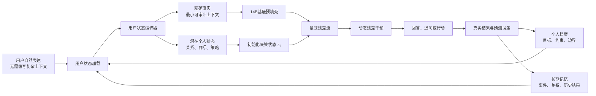

# 我需要一个新的bp， 这个bp的逻辑是这个样子的， 1， 我们是作具备持续学习能力大语言模型的，核心是让机器自己学会目…

- 线程 ID：`019f9d0c-9d1e-7191-93c4-8961be538586`
- 项目目录：`/Users/mengfu/Documents/GitHub/volvence`
- 来源状态：已归档记录
- 原始源文件：`/Users/mengfu/.codex/archived_sessions/rollout-2026-07-26T14-11-17-019f9d0c-9d1e-7191-93c4-8961be538586.jsonl`
- 原始备份：`raw/archived/019f9d0c-9d1e-7191-93c4-8961be538586.jsonl.gz`
- 时间范围：2026-07-26T06:11:17.578Z ～ 2026-07-26T06:35:33.582Z
- 可见对话：用户 77 条，Codex 294 条
- 排除的自动心跳触发：0 条
- 保留的可见进度通知：0 条
- 排除的静默心跳响应：0 条

> 本文件仅保留 UI 对话事件中的用户消息和 Codex 可见回复；系统/开发者指令、推理、工具调用及工具输出未写入本文件。完整事件保留在压缩原始 JSONL 中。

## 1. 用户

_2026-07-26T06:11:17.578Z_

我需要一个新的bp， 这个bp的逻辑是这个样子的， 1， 我们是作具备持续学习能力大语言模型的，核心是让机器自己学会目标-感知-决策-反馈的闭环。 2，我们的持续学习模型的架构是基于eta，nl 还有 主动学习这三驾马车。把我们的架构说清楚。3， 我们的模型和数据的关系是什么， 怎么收集、标注、我们的agent体系是什么。 将来如何对外提供服务。 4，我们核心解决了现有大模型的两个问题，预训练， 闭环是人完成的。5，要想完成这两点， 必须解决两个核心问题， 稀疏数据和泛化迁移学习。 6，我们有长期的技术储备，把我们最新的和要作的内容 把杨柳的论文都列在上面去。要把我和杨柳都列上去。 我们有长期架构方面的大拿马志刚和张驰. 7 ， 我们要钱干什。怎么花。

## 2. Codex（过程更新）

_2026-07-26T06:11:17.578Z_

我先在项目里找一下现有的 `bp`、材料模板和相关论文/人物信息入口，这样可以直接帮你整理成可用版本，而不是只给一个空提纲。

## 3. Codex（过程更新）

_2026-07-26T06:11:17.579Z_

我已经找到一批现成素材，尤其是现有融资叙事、`ETA/NL/主动学习` 论证和一个旧版 pitch deck。下一步我会抽取这些内容，直接整理出一版新的中文 BP 文案，重点把你刚才的 7 点串成一条完整融资逻辑。

## 4. Codex（过程更新）

_2026-07-26T06:11:17.579Z_

我已经拿到一版很贴近你需求的底稿，里面连资金用途和“先做人类世界模型验证轮”的逻辑都已经有了。现在我补上你特别强调的三部分：团队页、你和杨柳的论文页、以及对外服务与 agent 体系页，然后落成一个新的 BP 文件。

## 5. Codex（过程更新）

_2026-07-26T06:11:17.579Z_

我已经把现有底稿和系统设计对上了，核心叙事是通的。现在我会直接写一份新的 BP 初稿，尽量做到“能拿去改 PPT”的颗粒度：一页一句话、再加关键论据、团队和资金页补齐。

## 6. Codex（过程更新）

_2026-07-26T06:11:17.580Z_

我准备开始落文件了。落之前我再把团队名和现有作者线对一遍，尽量不用拍脑袋写人名和论文，避免后面你还要大量纠错。

## 7. Codex（过程更新）

_2026-07-26T06:11:17.580Z_

我已经把人名、团队口径和现有论文清单对齐了，信息足够落一版完整初稿。我会把它写成“可直接改成 PPT”的 BP 文案，主干严格围绕你提的 7 点，同时把目前仓库里能核验的团队与论文口径嵌进去。

## 8. Codex（过程更新）

_2026-07-26T06:11:17.580Z_

我开始落文件了。这一版我会优先保证融资逻辑、技术逻辑和团队页是完整闭环，方便你先拿去过一遍，再决定要不要继续扩成正式 PPT。

## 9. Codex（过程更新）

_2026-07-26T06:11:17.580Z_

初稿已经落下来了。我再快速过一遍，修掉容易在路演时被抓住的小口径问题，尤其是团队页和用词里的重复或过度承诺。

## 10. Codex（过程更新）

_2026-07-26T06:11:17.581Z_

我发现团队页里有一处重复：`张驰` 写了两次，会在正式场合显得不够稳。我把这一处修掉，并把“马志刚 / 张驰都是长期架构大拿”表达得更清晰一点。

## 11. Codex（最终答复）

_2026-07-26T06:11:17.581Z_

我已经把一版新的 BP 初稿落好了，文件在 [volvence-continuous-learning-bp-v1-cn.md](/Users/mengfu/Documents/GitHub/volvence/docs/business/BP/0723/volvence-continuous-learning-bp-v1-cn.md)。

这一版已经把你刚才要的主线都串起来了：持续学习闭环、`ETA + NL + 主动学习` 三驾马车、模型和数据关系、agent 体系、现有大模型的两个根问题、稀疏数据与泛化迁移、团队页、杨柳代表论文页、对外服务方式，以及“要钱做什么”。我按仓库现有口径默认把“你”写成了赵江波，并把马志刚、张驰都放进了长期架构能力里。

如果你愿意，我下一步可以直接继续帮你做两版：
1. 压缩成 `12-15` 页标准融资 PPT 结构版。
2. 改成更像投资人口语的路演讲稿版。

## 12. 用户

_2026-07-26T06:11:17.581Z_

1，和2， 都作一下。

## 13. Codex（过程更新）

_2026-07-26T06:11:17.581Z_

我继续把这份初稿往前推两步：一份压缩成标准融资 PPT 页结构，一份改成你能直接讲的路演口播稿。这样你就能同时拿到“写给投资人看的”和“自己上台讲的”两套版本。

## 14. Codex（过程更新）

_2026-07-26T06:11:17.581Z_

我已经把可复用的材料对齐好了，接下来直接落两份文件：一份是 `12-15` 页的 PPT 结构稿，一份是按这个结构写的路演讲稿，方便你先内部过逻辑。

## 15. Codex（过程更新）

_2026-07-26T06:11:17.581Z_

两份都已经落好了。我再快速检查一下文件名和内容结构，确认你拿去改 PPT 或直接口播都不会卡在明显格式问题上。

## 16. Codex（最终答复）

_2026-07-26T06:11:17.581Z_

我把两份都做好了，放在这里：

- PPT 结构版：[volvence-continuous-learning-pitch-deck-v1-cn.md](/Users/mengfu/Documents/GitHub/volvence/docs/business/BP/0723/volvence-continuous-learning-pitch-deck-v1-cn.md)
- 路演讲稿版：[volvence-continuous-learning-roadshow-script-v1-cn.md](/Users/mengfu/Documents/GitHub/volvence/docs/business/BP/0723/volvence-continuous-learning-roadshow-script-v1-cn.md)

现在这个目录下有三份配套材料：

- 总体 BP 初稿：[volvence-continuous-learning-bp-v1-cn.md](/Users/mengfu/Documents/GitHub/volvence/docs/business/BP/0723/volvence-continuous-learning-bp-v1-cn.md)
- PPT 结构稿
- 口播讲稿

这版已经把你要的“1 和 2”都接上了：PPT 结构版是 `14` 页标准融资叙事，讲稿版是逐页对应的口语化表达，能直接拿去内部改。  
如果你愿意，我下一步可以继续帮你做两件更实用的收尾：

1. 把这份 `14` 页再压成一版更狠的 `10` 页投资人速看版。
2. 直接按这个结构输出 `Marp`/PPT 可制版稿，方便你们马上排版。

## 17. 用户

_2026-07-26T06:11:17.582Z_

ETA 和NL的思想你补充进去。 让投资人一看就能懂， 但是不要用这两个词语， 要用我们的Volvence-xXX什么词语来概括，说这就是我们的核心技术， 不说其他人的， 最好是挂接到杨柳的论文中去。  kh: 我毕业于美国卡内基梅隆大学计算机学院机器学习系，我的专业是机器学习。我们系在世界范围内人工智能排名第一。我的博士毕业论文是mathematical theories of interaction with oracles. 主要研究人机交互的复杂度。我的博士论文答辩委员会成员之一Manuel Blum，是图灵奖得主。通用人工智能的重要组件是强化学习。但是强化学习有两个瓶颈。一个瓶颈是训练所需的标记数庞大，我研究的主动学习可以大大减少所需的标记数。另一个瓶颈是泛化能力差，我研究的迁移学习可以提高泛化能力，并为泛化能力提供数学保障。在过去的二十年里，我在主动学习，强化学习，和迁移学习领域发表顶会顶刊论文30余篇。下面我介绍一下我在上述领域的工作。首先是主动学习。介绍三个我的代表作。第一个代表作是Surrogates Losses in Passive and Active Learning. 这篇文章针对0-1 loss inefficient 的问题，提出使用surrogate convex loss. 解决了efficiency issue. 发表在Electronic Journal of Statistics 这个统计学的顶级期刊上。第二个代表作是Active Learning with identifiable Mixture Assumptions. 这个工作解决了主动学习领域一个长期待解决的问题。我们正将这篇文章投往统计学的顶级期刊Annuals of Statistics. 第三个代表作是Minimax Analysis of Active Learning. 在这个工作中， 我们提出了Star Number. 这个complexity measure 自提出之日起，被工业界和学术界沿用为标准。这篇文章发表在机器学习的顶级期刊Journal of Machine Learning Research 上。下面我介绍一下我在主动学习和强化学习相结合这个方向上的近期的三个代表作。第一个代表作是Bandit Learnability can be Undecidable. 近期，Nature 上发表了一篇文章Learnability can be undecidable 并提出了EMX problem. 我们构造了从bandit learning problem 到EMX problem的一个reduction. 从而证明了Bandit Learnability can be undecidable. 这篇文章发表在COLT 2023 这个机器学习理论的顶级会议上。第二个代表作是Reliable Active Apprenticeship Learning. 想象我们发送火星车到火星上，我们希望它尽量能够自主探索。但是如果它快要跌到悬崖下面，我们希望它可以及时向人类寻求调教。我们希望它向人类寻求调教的次数尽量少。因为从地球到火星的通信昂贵且有时延。算法层面，如果系统知道optimal action，它就执行optimal action. 如果系统不知道optimal action，它应该向人类寻求调教。从调教中学习，重新训练系统参数。第三个代表作是Active RLHF. 在reinforcement learning with human feedback中，训练reward model需要大量的标记，然后把训练好的reward model交给PPO之类的强化学习算法进一步训练。我们提出的主动学习的算法可以大大减少训练reward model 所需的标记数。
kh: 下面我介绍一下我在迁移学习方面的工作。The idea就是如果已经学会了英语，学习法语就会比较简单。算法层面，我们从过去的任务数据中估计一个贝叶斯后验分布。在算法的初期，贝叶斯后验分布估计得不是很准确时， 我们run一个prior independent learning algorithm. 在算法的后期，贝叶斯后验分布估计得比较准确的时候，我们run一个prior dependent learning algorithm. 我们所能证明的数学保证是，在处理的任务达到无穷大是，每个任务所需的样本数的上限是假使我们提前知道先验分布每个任务所需的样本数加上VC维度。这是一个很强的保证，因为我们提前并不知道这个先验分布。这个工作和强化学习中的元强化学习的idea是一致的。我们在未来考虑研究给元强化学习提供数学保证。最后介绍一下我们的研究团队。我们的团队由我和Steve Hanneke普渡大学计算机系的助理教授，主动学习理论的奠基人，机器学习的顶级会议COLT 2026的主席，和我们的CEO赵江波组成。我们这个团队在过去20多年，在主动学习，强化学习，迁移学习领域发表顶会顶刊论文30余篇，是世界顶尖的主动学习的研究团队。

## 18. Codex（过程更新）

_2026-07-26T06:11:17.582Z_

我来把这层“翻译”做好：保留 ETA 和 NL 的核心思想，但在对外材料里不再提这两个词，而是改成 Volvence 自己的技术命名，让投资人一眼能懂、同时自然挂到杨柳的论文和你给的这段学术经历上。接下来我会先改 PPT 结构稿，再同步改路演讲稿。

## 19. Codex（过程更新）

_2026-07-26T06:11:17.582Z_

补这层品牌化命名时，我刚才那次批量替换有一处没对上现有文本，我现在按页精确改，避免把结构弄乱。会把两份都改成“Volvence-XXX”版本，并把你给的杨柳学术表述更完整挂进去。

## 20. Codex（过程更新）

_2026-07-26T06:11:17.582Z_

我现在按你要的方向收口：不再提外部理论名，全部改成 Volvence 自己的技术命名，并把杨柳这段学术经历直接变成“为什么这套命名站得住”的论据。这样投资人看到的是我们的核心技术，不是别人的框架。

## 21. Codex（过程更新）

_2026-07-26T06:11:17.582Z_

核心改造已经打进去了：现在材料里不再直接说 ETA / NL，而是统一换成了 `Volvence-Decision Engine`、`Volvence-Memory Engine`、`Volvence-Learning Engine` 三层，并且把杨柳的学术经历和代表作接到了这三层技术上。最后我再检查一遍页码和语气，确保投资人读起来更像“我们的核心技术”，而不是“我们在解释别人的论文”。

## 22. Codex（最终答复）

_2026-07-26T06:11:17.582Z_

我已经按你的要求改进去了，重点做了三件事：

第一，把 `ETA` 和 `NL` 全部藏到我们自己的技术命名下面，不再对外直接说那两个词。现在统一改成了：

- `Volvence-Decision Engine`
- `Volvence-Memory Engine`
- `Volvence-Learning Engine`

这三层在材料里被定义成“Volvence 的核心技术”，投资人看到的是我们的技术栈，而不是外部理论名。

第二，把杨柳的学术经历和这三层技术直接挂上了。现在材料里已经明确写了：

- 卡内基梅隆大学计算机学院机器学习系博士
- 博士论文 `Mathematical Theories of Interaction with Oracles`
- 答辩委员会成员之一是图灵奖得主 `Manuel Blum`
- 强化学习两个瓶颈：标记数庞大、泛化能力差
- 用主动学习解决前者，用迁移学习解决后者
- 过去二十年在主动学习、强化学习、迁移学习领域的代表作，已经拆成投资人能看懂的表述

第三，我把这些内容同步进了两份文件：

- PPT 结构稿：[volvence-continuous-learning-pitch-deck-v1-cn.md](/Users/mengfu/Documents/GitHub/volvence/docs/business/BP/0723/volvence-continuous-learning-pitch-deck-v1-cn.md)
- 路演讲稿：[volvence-continuous-learning-roadshow-script-v1-cn.md](/Users/mengfu/Documents/GitHub/volvence/docs/business/BP/0723/volvence-continuous-learning-roadshow-script-v1-cn.md)

现在这版的气质已经更接近你要的方向了：不是“我们在解释别人的框架”，而是“Volvence 有一套自己的核心技术命名，而这套命名背后有杨柳二十年的数学底座”。

如果你愿意，我下一步建议我继续做一个很关键的收口：把这三个名字再润色成更像融资材料、中文一听就懂的版本。比如把 `Volvence-Decision Engine / Memory Engine / Learning Engine` 再改成更有品牌感、中文更顺口的一组中英双语名字。

## 23. 用户

_2026-07-26T06:11:17.583Z_

page12你确认迁移学习解决的是memory的事情？ 还是说记忆的事情。 另外， 关于decision engine（ETA ）， 还有 memory engine（NL核心思想）还有主动学习都充分的说清清楚，他们的核心思想， 为什么能解决问题。

## 24. Codex（过程更新）

_2026-07-26T06:11:17.583Z_

我先把这三个技术点重新掰开：`Page 12` 里“迁移学习 = memory”这个说法确实容易混，我会把它改成更准确的关系，同时把 `Decision Engine / Memory Engine / Learning Engine` 三层各自的核心思想、为什么能解决问题，补成投资人也能看懂的版本。

## 25. Codex（过程更新）

_2026-07-26T06:11:17.583Z_

你这个判断是对的：`迁移学习 ≠ 记忆本身`。更准确地说，迁移学习解决的是“过去学到的结构如何在新任务里复用”，它给 `Memory Engine` 提供的是**泛化与迁移的数学底座**，不是在字面上等于“记忆”。我现在把这层关系改准，同时把三层引擎各自的核心思想和“为什么能解决问题”补成更清楚的版本。

## 26. Codex（最终答复）

_2026-07-26T06:11:17.583Z_

你这个点抓得很准，我已经把这层关系改正了。

现在的口径是：

- **迁移学习不等于 memory 本身**
- **Memory Engine** 负责的是：经验怎么被保留、分层、巩固、不遗忘
- **迁移学习** 负责的是：这些已经沉淀下来的结构，怎么在新任务里被复用

也就是说，更准确的说法是：

**Volvence-Memory Engine 负责把经验沉淀成稳定结构；迁移学习负责证明这些结构可以被带到下一个任务里，而不是每次从零开始。**

我还顺手把你要的另一件事也补了：现在两份材料里都把三层引擎讲得更清楚了，不只是“叫什么”，而是把它们各自的核心思想和为什么能解决问题都说开了：

- **Volvence-Decision Engine**
  - 核心思想：先做高层策略动作，再落成具体行为，不在 token 空间里盲目搜索
  - 为什么能解决问题：让长程规划、策略切换、层级信用分配更清楚
- **Volvence-Memory Engine**
  - 核心思想：经验按不同时间尺度分层沉淀，不是一股脑堆在一起
  - 为什么能解决问题：既能快速适应，又不容易把长期结构冲掉
- **Volvence-Learning Engine**
  - 核心思想：主动找最有信息量的反馈去学，而不是平均吃数据
  - 为什么能解决问题：在真实世界反馈稀缺、标注昂贵时，仍然能持续提升

我已经同步改到了这两份文件里：

- [volvence-continuous-learning-pitch-deck-v1-cn.md](/Users/mengfu/Documents/GitHub/volvence/docs/business/BP/0723/volvence-continuous-learning-pitch-deck-v1-cn.md)
- [volvence-continuous-learning-roadshow-script-v1-cn.md](/Users/mengfu/Documents/GitHub/volvence/docs/business/BP/0723/volvence-continuous-learning-roadshow-script-v1-cn.md)

如果你愿意，我下一步建议继续做一个很值钱的优化：把这三个名字从现在的偏技术名，再压成更像融资材料的一套“中文主名 + 英文副名”，比如让投资人一页就记住一句话版本。

## 27. 用户

_2026-07-26T06:11:17.583Z_

page5这里， 先列一个具体的完整的架构吧，用mermaid 图白哦是。 就是每个组件， 都是怎么启动的。

## 28. 用户

_2026-07-26T06:11:17.583Z_

page5这里， 先列一个具体的完整的架构吧，用mermaid图表示。  就是每个组件， 都是怎么启动的。

## 29. Codex（过程更新）

_2026-07-26T06:11:17.583Z_

我先把 `Page 5` 改成“先看全架构，再看三层引擎”的方式，用一张完整 mermaid 图把各组件怎么启动、怎么流转画出来。这样投资人先有整体画面，再听每层技术就更容易跟上。

## 30. Codex（最终答复）

_2026-07-26T06:11:17.584Z_

我已经把 `Page 5` 改成“先看完整架构，再看三层引擎”的版本了，文件在：

[volvence-continuous-learning-pitch-deck-v1-cn.md](/Users/mengfu/Documents/GitHub/volvence/docs/business/BP/0723/volvence-continuous-learning-pitch-deck-v1-cn.md)

这次新增的是一张完整的 `mermaid` 架构图，里面已经把启动和流转顺序画出来了：

- `用户 / 环境输入`
- `感知入口`
- `基底模型层`
- `上下文装配层`
- `Volvence-Decision Engine`
- `Volvence-Memory Engine`
- `Volvence-Learning Engine`
- `记忆读写层`
- `策略与动作规划`
- `输出执行层`
- `结果与反馈采集`
- `PE / Credit Layer`
- `人类反馈 / 专家调教`
- `治理与回滚层`

现在投资人先看到的是“这是一条会回流的持续学习系统链路”，再进入三层引擎，会更容易理解。

如果你愿意，我下一步可以继续把这张图同步到路演讲稿里，给你补一段“照着图讲 60-90 秒”的口播版本。

## 31. 用户

_2026-07-26T06:11:17.584Z_

哪个没有体现出来， 就是我们吃原始交互， 然后我们的volvence， 直接干预残差流， 从而在神经网络层面来进行干预。 从而解决一个核心问题， 语言表达人际关系的维度不够的问题。 然后这个问题， 你也写到之前的两个核心问题里面去。

## 32. Codex（过程更新）

_2026-07-26T06:11:17.584Z_

我来把这个最关键但还没显式说出来的点补进去：我们不是只在语言层做提示和记忆，而是直接吃原始交互，并在残差流层面做干预，这正是我们能突破“语言表达对人际关系维度不够”的地方。我会把它同时补到架构图、核心问题页和技术解释里。

## 33. Codex（过程更新）

_2026-07-26T06:11:17.584Z_

我把 PPT 结构稿里的核心点补进去了，但这类技术点如果只在 deck 里、不在讲稿里，现场很容易讲丢。我再把同样的逻辑同步到路演讲稿里，让“原始交互 + 残差流干预 + 语言维度不够”这条线前后完全一致。

## 34. Codex（最终答复）

_2026-07-26T06:11:17.584Z_

我已经把这个关键点补进去了，而且不是只补一句话，是把它嵌进了整条叙事里。

现在材料里新增和修正了三层意思：

1. **我们吃的是原始交互，不是只吃语言文本**
   - 在 `Page 5` 的完整架构图里，我加了 `Raw Interaction Encoding`
   - 表达的是：用户输入先进入原始交互编码层，而不是直接被压成一段文本记忆

2. **我们不是只改 prompt，而是直接干预残差流**
   - 在 `Page 5` 架构图里，我加了 `Residual Stream Steering`
   - 现在图上已经明确体现：
     - `Decision Engine`
     - `Memory Engine`
     - `Learning Engine`
     最后都会汇到残差流干预层，再进入策略与动作规划

3. **“语言维度不够表达关系”已经被写进核心问题**
   - 在问题页里，我加了第三个底层问题：
     - 语言不是承载人际关系的充分载体
   - 在核心难点页里，也加了第三道门槛：
     - 关系维度无法只靠语言充分表达
   - 现在的表述已经明确说出：
     - 只靠 prompt、RAG 和记忆文本，维度不够
     - 必须进入模型内部表示层，才能做更细粒度干预

我同步更新了这两份文件：

- PPT 结构稿：[volvence-continuous-learning-pitch-deck-v1-cn.md](/Users/mengfu/Documents/GitHub/volvence/docs/business/BP/0723/volvence-continuous-learning-pitch-deck-v1-cn.md)
- 路演讲稿：[volvence-continuous-learning-roadshow-script-v1-cn.md](/Users/mengfu/Documents/GitHub/volvence/docs/business/BP/0723/volvence-continuous-learning-roadshow-script-v1-cn.md)

现在这套说法已经比较接近你要的核心命题了：

**Volvence 的价值不只是“持续学习”，而是“直接吃原始交互，并在神经网络残差流层面干预，从而突破语言表达无法充分承载人际关系维度的限制”。**

下一步我建议做一个很值钱的收口：我可以把这句话再压成一页专门的“Why Volvence Wins”技术壁垒页，用更像投资人记忆点的语言写出来。

## 35. 用户

_2026-07-26T06:11:17.584Z_

全面修理下， 整体有很多前后不对应， 不对称的地方。

## 36. Codex（过程更新）

_2026-07-26T06:11:17.584Z_

我会把三份材料当作一个完整叙事系统统一修订，先逐页核对“问题、技术架构、学术支撑、产品服务、融资用途”的对应关系，再同步修改 BP、Deck 和路演稿，避免同一概念在不同文件里换口径。

## 37. Codex（过程更新）

_2026-07-26T06:11:17.584Z_

第一轮核对已经发现了几处主干错位：封面和标题仍说“两件事/两道门槛”，正文实际已经是三项；BP 还在公开使用 ETA/NL，Deck 与路演稿却已改成 Volvence 品牌；Deck 16 页而路演稿仍按 14 页，论文与技术引擎的映射也有过度归因。接下来我会先建立一套唯一口径，再按同一页序重写三份材料。

## 38. Codex（过程更新）

_2026-07-26T06:11:17.585Z_

统一口径定为三组一一对应关系：`静态预训练 → Memory Engine`，`人类代做闭环 → Decision + Learning Engine`，`语言表达瓶颈 → 原始交互编码 + 关系潜状态 + 残差流干预`。学术上会明确“论文提供理论基础、Volvence 完成系统集成与工程创新”，不再把迁移学习直接等同于记忆，也不把所有引擎都强挂到同一篇论文上。现在开始按 15 页统一 Deck 与讲稿，并让长 BP 使用相同术语和证据边界。

## 39. Codex（过程更新）

_2026-07-26T06:11:17.585Z_

Deck 已经统一为 15 页，并把 Page 5 改成严格的启动顺序：原始交互进入、潜状态估计、记忆读取、高层决策、残差流控制、动作执行、结果归因、主动选样、分层写回、治理回滚。现在同步重写长 BP 和 15 页口播，尤其会修正原稿里“核心问题两个但列了三个”“Learning Engine 直接控制残差流”“论文等于产品技术”等不对称表达。

## 40. Codex（过程更新）

_2026-07-26T06:11:17.585Z_

三份材料的正文已经完成同口径重构。最后一轮我会做机械一致性检查：页数、标题、模块命名、问题数量、融资比例、团队角色、论文边界和 Mermaid 节点，确保不再出现前文说三项、后文仍说两项，或 Deck 与口播页码错位。

## 41. Codex（最终答复）

_2026-07-26T06:11:17.585Z_

已全面重构三份材料，统一成同一套 15 页投资叙事：

- [融资 Deck v2](/Users/mengfu/Documents/GitHub/volvence/docs/business/BP/0723/volvence-continuous-learning-pitch-deck-v1-cn.md)
- [完整 BP v2](/Users/mengfu/Documents/GitHub/volvence/docs/business/BP/0723/volvence-continuous-learning-bp-v1-cn.md)
- [15 页路演稿 v2](/Users/mengfu/Documents/GitHub/volvence/docs/business/BP/0723/volvence-continuous-learning-roadshow-script-v1-cn.md)

主要修正包括：三类问题与四项技术逐一对应；完整重画 Page 5 架构和启动顺序；明确原始交互、关系潜状态及残差流干预；厘清迁移学习与记忆的边界；统一团队、论文、商业化和融资口径；将资金用途与 18–24 个月验证指标直接对应。

同时增加了证据边界和风险验证，避免把论文直接说成已完成产品。正式融资前仍需补充融资金额、当前业务数据、目标指标，以及核验后的杨柳完整论文题录。三份文件已通过页数、术语、比例和格式一致性检查。

## 42. 用户

_2026-07-26T06:11:17.585Z_

加一个对比， 就是其他的持续学习的系统的特点和路线的问题。 然后我们之前作过的一个分析， 就是业界已经收敛到了5个共同的维度上面来了。

## 43. Codex（过程更新）

_2026-07-26T06:11:17.585Z_

我会先把仓库里之前关于“业界持续学习路线”和“五个共同维度”的分析找出来，沿用原有结论与术语，再把竞争路线对比插入 Deck、BP 和路演稿，确保不是临时另造一套框架。

## 44. Codex（过程更新）

_2026-07-26T06:11:17.585Z_

已经找到之前的原始结论：对约 100 篇核心论文的分析归纳出 5 个收敛方向，旧材料中的表述是“预测误差一级化、Token 之上的内部控制、记忆即架构、涌现结构、有界自修改与只读评估”。我会保留这五维，同时增加一张“行业路线只覆盖其中一部分、Volvence 如何覆盖完整闭环”的对比页；为避免把竞争分析写成空泛攻击，我也会沿用原分析里对各路线真实优点和结构性上限的判断。

## 45. Codex（过程更新）

_2026-07-26T06:11:17.585Z_

新页会放在“市场机会”之后、“我们的产品定义”之前，逻辑是：先证明行业并非没有做持续学习，再说明不同路线分别解决了记忆检索、防遗忘、快速适配或反馈优化，但多数只覆盖五维中的一到两维；Volvence 的差异是把五维组织成同一个受控闭环。Deck 和路演稿因此统一扩展为 16 页，后续页码全部同步顺延。

## 46. Codex（过程更新）

_2026-07-26T06:11:17.586Z_

对比页已经加入 Deck 和口播，语气保持尽调友好：承认 RAG、防遗忘、Replay、Adapter、RLHF/Workflow、世界模型各自的有效贡献，再指出它们默认覆盖的范围。接下来把同一套“五维收敛 + 路线对比 + 判定边界”写入长 BP，并补上一个关键限定：五维是我们基于约 100 篇论文的研究归纳，不冒充全行业正式标准。

## 47. Codex（过程更新）

_2026-07-26T06:11:17.586Z_

长 BP 已补齐行业路线和五维坐标系，且把“我们覆盖全部五维”的原因落回具体架构，不只做打勾式竞争表。现在做最后一致性检查，重点确认 16 页 Deck 与 16 页口播完全同页、五维名称在三份材料中一致，以及对比表没有绝对化或容易被投资人反驳的表述。

## 48. Codex（最终答复）

_2026-07-26T06:11:17.586Z_

已加入“行业持续学习路线对比 + 五维收敛”完整页面，并同步到三份材料：

- [Pitch Deck v2，现为16页](/Users/mengfu/Documents/GitHub/volvence/docs/business/BP/0723/volvence-continuous-learning-pitch-deck-v1-cn.md:60)
- [完整 BP v2](/Users/mengfu/Documents/GitHub/volvence/docs/business/BP/0723/volvence-continuous-learning-bp-v1-cn.md:66)
- [16页配套路演稿](/Users/mengfu/Documents/GitHub/volvence/docs/business/BP/0723/volvence-continuous-learning-roadshow-script-v1-cn.md:45)

新增内容对比了 RAG/长上下文、防遗忘与 Replay、Adapter/Test-time Learning、RLHF/Agent Workflow、世界模型/潜空间控制六类路线。

五个共同维度统一为：预测误差一级化、Token 之上的内部控制、记忆成为架构、结构从长期交互中涌现、有界修改与只读评估。表述上也保留了严谨边界：这是我们基于约100篇核心论文形成的研究归纳，不冒充行业正式标准；Volvence 的差异是把五维组织成同一个可运行、可治理的闭环。

## 49. 用户

_2026-07-26T06:11:17.586Z_

产品定义这里， 我不想做成一个runtime， 而是一个模型系统，只不过我这套具备持续学习的能力。 然后我安政的技术架构， 应该是我的模块的部署架构， 不是这种逻辑架构。 而且这种架构太复杂了， 你稍微简化下。

## 50. Codex（过程更新）

_2026-07-26T06:11:17.586Z_

我会把定位从“持续学习 Runtime”统一改为“具备持续学习能力的模型系统”。技术页则重画成部署架构，只保留线上模型服务、持续学习服务、数据与反馈、治理四个部署域，并明确哪些模块在线启动、哪些模块异步更新，避免把算法流程图误当成产品架构图。

## 51. Codex（过程更新）

_2026-07-26T06:11:17.586Z_

定位会调整为：Volvence 本身就是一个完整模型系统，内部包含可替换基底模型和 Volvence 自有持续学习模块，不再说“给基础模型外挂 Runtime”。部署图会简化成两个主平面：线上模型服务负责实时推理，持续学习中心负责异步选样、训练、记忆巩固和版本发布；数据反馈与治理作为共享基础设施。

## 52. Codex（过程更新）

_2026-07-26T06:11:17.586Z_

Deck 的产品页和架构页已经改成模型系统口径。新部署图明显简化：业务流量进入线上模型服务，反馈进入持续学习中心，审核后的模型与记忆版本再发布回线上；投资人能直接看出模块部署在哪里、数据怎么回流、在线与异步更新如何隔离。现在同步清理 BP 和讲稿中所有 Runtime 旧口径。

## 53. Codex（过程更新）

_2026-07-26T06:11:17.586Z_

三份材料的定位已同步改完：Volvence 是完整模型系统，不再是 Runtime；商业化也改为模型服务、API 和私有化模型部署。最后检查会重点找残留旧词，并确认部署图没有把 Memory Engine 画成两个互相矛盾的实例，而是区分线上读取与后台巩固职责。

## 54. Codex（过程更新）

_2026-07-26T06:11:17.586Z_

检查发现长 BP 的“产品定义”下面还保留了一张旧闭环逻辑图，虽然不在技术架构页，但会继续造成“产品定义像流程框架”的误解。我会删掉它，让产品定义只说明模型系统由什么构成；唯一的总架构图保留为 Page 6 的部署架构。

## 55. Codex（最终答复）

_2026-07-26T06:11:17.586Z_

已按你的定位全部修正：

- Volvence 从“持续学习 Runtime”改为“具备持续学习能力的完整模型系统”。
- 模型系统内部包含可替换基底模型，以及 Volvence 自有的 Decision、Memory、Learning、Representation 和 Governance 模块。
- Page 6 改为真正的模块部署架构，简化为“线上模型服务 + 持续学习中心 + 治理中心”。
- 明确区分线上低延迟推理与后台异步学习，验证后的模型和记忆版本才发布上线。
- 删除长 BP 中残留的旧逻辑架构图。
- 商业化、团队职责和资金用途里的 `Runtime` 口径也已全部清除。

已同步更新 [Deck](/Users/mengfu/Documents/GitHub/volvence/docs/business/BP/0723/volvence-continuous-learning-pitch-deck-v1-cn.md:100)、[完整 BP](/Users/mengfu/Documents/GitHub/volvence/docs/business/BP/0723/volvence-continuous-learning-bp-v1-cn.md:119) 和 [路演稿](/Users/mengfu/Documents/GitHub/volvence/docs/business/BP/0723/volvence-continuous-learning-roadshow-script-v1-cn.md:69)。

## 56. 用户

_2026-07-26T06:11:17.586Z_

产品定义这里， 你就把这几个放到这个mermaid里面去。 你的mermaid太简单了。

## 57. Codex（过程更新）

_2026-07-26T06:11:17.586Z_

我会把产品定义图补到“刚好能看懂系统组成”的粒度：在 Volvence 模型系统边界内放入基底模型、Representation、Decision、Memory、Learning 和 Governance 六个模块，同时保留原始交互、输出和反馈闭环；Page 6 继续专门讲部署，不让两张图重复。

## 58. Codex（过程更新）

_2026-07-26T06:11:17.587Z_

产品定义图已经补齐六类内部模块，并把“原始交互进入内部表示、决策与基底共同生成、真实反馈回到学习与记忆、治理横向约束”画进同一个模型边界。为了保证 Mermaid 在不同渲染器里都稳定，我再做一次语法兼容检查并简化虚线标签。

## 59. Codex（最终答复）

_2026-07-26T06:11:17.587Z_

产品定义的 Mermaid 已补充为完整的模型系统组成图，包含：

- Representation Interface
- Memory Engine
- Decision Engine
- Learning Engine
- 基底模型
- Residual Steering
- Governance Layer
- 原始交互、输出行动与真实反馈闭环

[Page 5 产品定义图](/Users/mengfu/Documents/GitHub/volvence/docs/business/BP/0723/volvence-continuous-learning-pitch-deck-v1-cn.md:100) 负责解释“Volvence 模型由什么构成”；Page 6 继续解释“这些模块如何部署”。长 BP 和路演稿也已同步。

## 60. 用户

_2026-07-26T06:11:17.587Z_

数据与agent 飞轮这个， 你就以我们做的这个ai陪伴电商作为例子， 简单，直白，把我们的数据飞轮说清楚。

## 61. Codex（过程更新）

_2026-07-26T06:11:17.587Z_

我会把抽象的“数据与 Agent 飞轮”改成一个投资人一眼能懂的 AI 陪伴电商案例：AI 先陪伴和理解用户，在合适时机提供商品或服务，购买、拒绝、复购和纠正形成结果反馈，再让模型更懂这个用户、也更会判断下一次何时推荐。同步修改 Deck、长 BP 和口播。

## 62. Codex（过程更新）

_2026-07-26T06:11:17.587Z_

这一页会用一个具体场景来讲：用户连续几天和 AI 讨论宝宝睡眠，系统先陪伴和识别需求，不急着卖货；当需求明确且时机合适时才推荐商品或服务。用户购买、拒绝、纠正、复购以及使用后的真实效果，分别变成“需求、时机、商品匹配、关系边界”的反馈，再更新个人记忆和经过脱敏的共性模型。

## 63. Codex（过程更新）

_2026-07-26T06:11:17.587Z_

新的飞轮已经从“抽象的数据管线”改成“陪伴电商的真实业务循环”，并特意把“购买不等于正确奖励”写清楚：退货、使用效果、复购和关系变化会继续纠偏，避免系统为了成交伤害长期关系。现在检查三份材料的案例、两层数据边界和飞轮收口是否完全一致。

## 64. Codex（最终答复）

_2026-07-26T06:11:17.587Z_

Page 8 已改成简单、直白的 AI 陪伴电商数据飞轮：

**长期陪伴 → 理解需求与关系 → 判断关心、询问、推荐或停止 → 获得购买、拒绝、退货、复购及使用效果 → 更新个人记忆与脱敏后的共性模型 → 下一次服务更准确。**

特别区分了两层数据：

- 个人记忆只服务当前用户，记录需求、偏好、预算和关系边界。
- 共性模型只在授权和脱敏后，学习需求识别、推荐时机、商品匹配及停止销售的规律。

已同步更新 [Deck Page 8](/Users/mengfu/Documents/GitHub/volvence/docs/business/BP/0723/volvence-continuous-learning-pitch-deck-v1-cn.md:170)、[完整 BP](/Users/mengfu/Documents/GitHub/volvence/docs/business/BP/0723/volvence-continuous-learning-bp-v1-cn.md:265) 和 [路演稿](/Users/mengfu/Documents/GitHub/volvence/docs/business/BP/0723/volvence-continuous-learning-roadshow-script-v1-cn.md:113)。

## 65. 用户

_2026-07-26T06:11:17.588Z_

这个表达有问题， 你要表明我们的两个核心价值1， 决策支持， 我们通过panaroma 提供的这个决策平衡计分卡， 和用户一起共同对问题同建模、共同推演、共同收敛， 甚至共同探索的能力。 这里面ai具备自动研究，自动补齐决策矩阵，自动找到问题的根源向用户收集情况的能力。 然后我们还有一个模型有一个对事情怎么处理， 的高情商的认知能力， 整体下来， 可以coach 用户去真正把问题解决，最终形成 要形成电商， 就必须知道需求，要知道需求，就必须了解客户， 要了解，就必须让人用起来， 要让人用， 就得解决问题， 要解决问题，就得iq，eq双在线。 就需要我们的这个逻辑。

## 66. Codex（过程更新）

_2026-07-26T06:11:17.588Z_

我会把这一页从“推荐反馈飞轮”提升为真正的产品价值飞轮：第一条是 Panorama 决策支持，让 AI 与用户共同建模、推演、收敛和探索；第二条是高情商问题解决，让 AI 不只给答案，而是持续 Coach 用户把事情处理好。电商放在结果端，按照“先解决问题、再建立使用与理解、最后识别真实需求”的因果链展开。先核对仓库里 Panorama 和平衡计分卡的既有定义，避免术语写偏。

## 67. Codex（过程更新）

_2026-07-26T06:11:17.588Z_

我会把 Page 8 重写成“两项核心价值 + 一条商业因果链”，而不是把电商当成起点：

1. Panorama 决策支持：和用户共同定义问题，自动研究、补齐决策矩阵、追问根因，共同推演并收敛。
2. 高情商认知与 Coaching：理解事情应该怎样处理、如何表达、何时推进或停止，陪用户真正解决问题。

最终才落到：解决问题需要 IQ、EQ 双在线；解决了问题用户才持续使用；持续使用才能真正了解客户；了解客户才能识别真实需求；有真实需求才形成电商。

## 68. Codex（过程更新）

_2026-07-26T06:11:17.588Z_

这一页现在不再把“推荐商品”当核心能力，而是把商业结果建立在两项产品价值上：Panorama 负责把复杂问题变成可共同推演的决策模型，高情商认知与 Coaching 负责把判断变成用户真正能执行的处理方式。最后我会检查这条因果链在 Deck、BP、口播中是否完全一致，并避免把“用户购买”错误地当作唯一成功标准。

## 69. Codex（最终答复）

_2026-07-26T06:11:17.588Z_

Page 8 已重新定义为“两个核心价值与商业飞轮”：

1. **Panorama 决策支持**：通过决策平衡计分卡，与用户共同建模、推演、探索和收敛；AI 自动研究、补齐决策矩阵、寻找根因并主动追问缺失信息。
2. **高情商认知与 Coaching**：不仅判断答案，还理解事情应该如何处理、如何表达、何时推进或停止，并陪用户行动、复盘和解决问题。

商业因果链统一为：

**IQ + EQ 解决问题 → 用户持续使用 → 系统真正了解客户 → 识别真实需求和时机 → 匹配商品与服务 → 结果反馈进入下一轮决策与 Coaching。**

已同步更新 [Deck Page 8](/Users/mengfu/Documents/GitHub/volvence/docs/business/BP/0723/volvence-continuous-learning-pitch-deck-v1-cn.md:170)、[完整 BP](/Users/mengfu/Documents/GitHub/volvence/docs/business/BP/0723/volvence-continuous-learning-bp-v1-cn.md:265) 和 [路演稿](/Users/mengfu/Documents/GitHub/volvence/docs/business/BP/0723/volvence-continuous-learning-roadshow-script-v1-cn.md:113)。

## 70. 用户

_2026-07-26T06:11:17.588Z_

产品和商业化部分， 改成， 我们什么时候推出一个什么模型， 干什么的，然后开源，然后就提供api服务就行。

## 71. Codex（过程更新）

_2026-07-26T06:11:17.588Z_

我会把“产品与商业化”从多种业务模式改成一条非常清晰的发布路线：先推出面向陪伴与复杂问题解决的 Volvence 模型，再开源可开发版本，最后提供标准 API 服务。时间会按本轮融资后的相对月份表达，避免具体季度随融资时间变化而失真。

## 72. Codex（过程更新）

_2026-07-26T06:11:17.589Z_

产品路线我按融资后时间拆成三步：`M0-M6` 发布 Volvence-1 模型，专门做 Panorama 决策支持与高情商 Coaching；`M6-M12` 发布开源可部署版本；`M12-M18` 上线标准 API，把持续学习、个人记忆、决策和 Coaching 作为模型服务提供。这样一页只回答“什么时候、发布什么、解决什么、怎么对外提供”。

## 73. Codex（过程更新）

_2026-07-26T06:11:17.589Z_

产品商业化页已经收敛为单一路线，不再分散讲数字员工、行业项目和联合运营。为保持可信度，我在长 BP 中补了一条必要边界：开源权重和代码的具体范围，要在发布前完成安全、隐私、许可证与知识产权评估；对投资人仍然可以清晰承诺开源方向和时间窗口。

## 74. Codex（最终答复）

_2026-07-26T06:11:17.589Z_

产品与商业化已经改成一条明确的模型发布路线：

- `M0-M6`：发布 **Volvence-1**，用于 Panorama 决策支持、高情商 Coaching 和长期持续学习。
- `M6-M12`：发布 **Volvence-1 Open**，开源模型权重、推理代码、基础接口和评测。
- `M12-M18`：上线 **Volvence Model API**，按调用量提供持续学习、个人记忆、决策支持、Coaching 和治理能力。

已同步更新 [Deck Page 12](/Users/mengfu/Documents/GitHub/volvence/docs/business/BP/0723/volvence-continuous-learning-pitch-deck-v1-cn.md:288)、[完整 BP](/Users/mengfu/Documents/GitHub/volvence/docs/business/BP/0723/volvence-continuous-learning-bp-v1-cn.md:371) 和 [路演稿](/Users/mengfu/Documents/GitHub/volvence/docs/business/BP/0723/volvence-continuous-learning-roadshow-script-v1-cn.md:175)。

## 75. 用户

_2026-07-26T06:11:17.589Z_

数据标注的过程， 和模型的参数量看看在哪里体现？ 你思考下。

## 76. Codex（过程更新）

_2026-07-26T06:11:17.589Z_

我先核对现稿和仓库里是否已经有可引用的参数规模。我的初步判断是：标注流程现在只在长 BP 里有，Deck 没有体现；参数量完全缺失。两者不应该硬塞进部署图，最好在 Page 7 核心技术后增加一页“模型规模与训练数据”，把基底参数、Volvence 可训练参数、数据筛选与标注链放在一起。

## 77. Codex（过程更新）

_2026-07-26T06:11:17.589Z_

核对后的结论是：这两个信息现在都没有在投资人主线里被正确体现。标注流程只埋在长 BP 的文字里；模型参数量没有产品口径，仓库能确认的只是当前工程验证使用过 `Qwen2.5-1.5B`，不能把它直接说成最终 `Volvence-1` 的规模。

我建议新增一页“模型规模与学习数据”，放在核心技术和产品价值之后、学术基础之前。参数量要分开披露“基底总参数、Volvence 可训练参数、单用户状态规模”，不能只报一个模糊的 B 数；正式参数规模通过 `1.5B / 3B / 7B` 同条件实验后冻结。标注流程则在同一页展示从真实交互、自动结果标签、主动选样、人类确认到训练/评测隔离的完整链路。

## 78. Codex（过程更新）

_2026-07-26T06:11:17.590Z_

新页已经加入，但参数口径我保持了证据纪律：只把 `Qwen2.5-1.5B` 写成“当前验证基底”，没有冒充 Volvence-1 最终规模；最终规模通过 1.5B、3B、7B 对照后冻结。同时把投资人真正需要的四个参数数字拆开：基底总参数、可训练参数、活跃参数、单用户状态规模。现在做页码和三份材料的一致性检查。

## 79. Codex（过程更新）

_2026-07-26T06:11:17.590Z_

一致性检查发现一个页码结构问题：Deck 的部署架构内容还在，但 `Page 6` 标题在前一次局部修改中被挤掉了，所以统计显示从 Page 5 直接跳到 Page 7。内容没有丢，我现在补回标题并复查 17 页连续性。

## 80. Codex（最终答复）

_2026-07-26T06:11:17.590Z_

这两个内容应该单独成为一页，位置放在“核心技术、产品价值”之后，“理论和团队”之前。现在已经新增 Page 9：**模型规模与数据标注**。

参数量分为四个口径：

- 基底模型总参数量
- Volvence 持续学习模块可训练参数量
- 单次推理活跃参数量
- 单用户个体化状态规模

目前只能确认部分工程验证使用过 `Qwen2.5-1.5B`。最终 Volvence-1 参数规模建议通过 `1.5B / 3B / 7B` 同条件测试后确定，避免现在虚构一个数字。

标注链路则明确为：

**真实交互与结果 → 自动结果标签 → Learning Engine 主动选样 → 用户确认或专家标注 → 质量检查 → 训练集/只读评测集隔离 → 更新与发布门控。**

已更新 [Deck Page 9](/Users/mengfu/Documents/GitHub/volvence/docs/business/BP/0723/volvence-continuous-learning-pitch-deck-v1-cn.md:254)、[完整 BP](/Users/mengfu/Documents/GitHub/volvence/docs/business/BP/0723/volvence-continuous-learning-bp-v1-cn.md:323) 和 [路演稿](/Users/mengfu/Documents/GitHub/volvence/docs/business/BP/0723/volvence-continuous-learning-roadshow-script-v1-cn.md:133)。Deck 与路演稿现统一为 17 页。

## 81. 用户

_2026-07-26T06:11:17.590Z_

你现在说的是基底规模， 我们其他几个模块的具体形式是什么，是神经网络吗？ 分别是个什么东西，然后如果是神经网络，参数量是多少。

## 82. Codex（过程更新）

_2026-07-26T06:11:17.590Z_

这个问题必须按“已实现形式、计划中的神经网络形式、实际参数量”逐个拆开，不能继续用模块名代替模型结构。我会查现有架构规范和实现，确认 Decision、Memory、Learning、Representation、Governance 各自到底是神经网络、状态存储、算法流程还是规则门控，并计算能从配置中确定的参数量；没有冻结的数字会明确标为待定，不会猜。

## 83. Codex（过程更新）

_2026-07-26T06:11:17.591Z_

已经查到当前实现的真实结构：Decision 不是抽象名词，现有 Torch 路径是 `GRU 编码器 + 潜变量头 + 切换门 + 残差解码器`，默认只有 724 个可训练参数；潜空间 PPO 策略与 Critic 默认 313 个参数。Memory 的神经部分是三层不同更新频率的两层残差 MLP，默认每层 264 个、三层 792 个，另有学习更新门。Learning Engine 和 Governance 则不是各自一张“大神经网络”，前者是主动选样/不确定性评分与训练编排，后者是确定性的权限、评测、审计和回滚系统，因此不能给它们虚构参数量。接下来我会把完整分类和精确计算口径写进 BP。

## 84. Codex（过程更新）

_2026-07-26T06:11:17.591Z_

结构已经厘清，关键点是：这不是“基底模型 + 四个同等大小的神经网络”。

- Decision Engine 是小型神经控制器：当前默认 ETA 训练网络 724 参数，潜空间 PPO 策略/价值网络 313 参数。
- Memory Engine 是“非参数记忆库 + 神经记忆核心”：三层 CMS MLP 共 792 参数，PE 感知更新门 199 参数，默认神经部分共 991 参数。
- Learning Engine 主要是主动学习算法和训练编排，不是独立大模型，独立参数量为 0；它调用预测误差、不确定性和上述学习门。
- Representation Interface 当前主要是基底隐藏层读取、特征编码和控制信号接口，不是独立网络；残差解码器已计入 Decision Engine。可选的离线 LoRA 是 rank 8，但参数量取决于基底层宽和挂载矩阵。
- Governance、Panorama 编排和数据标注流程是确定性系统/工具链，不按神经网络参数计数。
- EQ 不是另一个“情绪模型”，而是基底模型加关系状态、双轨预测误差、Memory 与 Decision 的联合能力。

我会把这些具体形式和数字替换掉现在 Page 9 的模糊表述。

## 85. Codex（过程更新）

_2026-07-26T06:11:17.592Z_

复核参数公式时发现一个需要主动修正的细节：Memory 更新门有两种配置。仓库默认的 12 维输入版本是 167 参数；开启 PE-aware 16 维输入后才是 199 参数。因此不能把 199 写成无条件默认值。另外 Decision 的 724 参数 SSL 网络与 313 参数 PPO 网络来自两个默认实验配置，潜变量维度分别是 8 和 4，不能把二者简单相加冒充已经冻结的产品总参数。我会把表改成“逐组件实数 + 可选配置”，取消误导性的总和。

## 86. Codex（过程更新）

_2026-07-26T06:11:17.592Z_

参数口径现在已经修正为逐模块、逐配置披露，没有再把互不兼容的实验配置相加。最终产品必须在统一 `z_t` 维度后生成一张真实 Model Card，届时才能给出“Volvence 自有神经模块总参数量”；现阶段能严谨给出的，是每个已经实现组件的结构和独立参数数目。

## 87. Codex（最终答复）

_2026-07-26T06:11:17.592Z_

已经把各模块的具体形式与参数量写清楚了：

| 模块 | 形式 | 当前参数量 |
|---|---|---:|
| Decision 结构发现 | GRU + 潜变量头 + 切换门 + 残差解码器 | 724 |
| Decision 策略学习 | 潜空间 MLP Policy + Critic | 313 |
| Memory 神经核心 | 快、中、慢三层残差 MLP | 792 |
| Memory 更新门 | 两层 Meta-updater | 默认 167；PE-aware 199 |
| Learning Engine | 主动选样、评分和训练编排 | 无独立神经参数 |
| Representation Interface | 隐藏层读取和控制信号接口 | 无独立神经参数 |
| Governance | 权限、评测、审计和回滚 | 非神经系统 |

同时明确了：

- Memory 还包含非参数化的用户记忆、索引和版本数据。
- Panorama 是基底模型、自动研究工具、平衡计分卡和 Decision Engine 的组合，不是另一个大模型。
- EQ 是关系状态、双轨预测误差、Memory、Decision 与基底表达共同形成的能力。
- 可选离线 LoRA 默认 `rank=8`，参数量取决于基底维度和挂载层。
- 724 参数控制器与 313 参数 PPO 当前属于不同实验配置，不能直接相加冒充产品总参数。

已更新 [Deck Page 9](/Users/mengfu/Documents/GitHub/volvence/docs/business/BP/0723/volvence-continuous-learning-pitch-deck-v1-cn.md:254) 和 [完整参数说明](/Users/mengfu/Documents/GitHub/volvence/docs/business/BP/0723/volvence-continuous-learning-bp-v1-cn.md:323)。

## 88. 用户

_2026-07-26T06:11:17.592Z_

两个问题， 除了基底， 我们的这个模型的参数量可以成为多少？ 几个维度的乘法？ 还是什么， 类似一个moe架构？ 然后能够达到我们的目标吗？ 是不是得把维度再扩大？ 逻辑通吗？ 另外，我们还得在一个具体的例子里面，说明我们是怎么通过现在的这个ai微信销售/数字分身/育儿专家 等的逻辑，我们自动把标签打上的。

## 89. Codex（过程更新）

_2026-07-26T06:11:17.592Z_

这两个问题的答案是：

第一，当前几百参数只是“机制证明”，不可能直接作为产品规模。产品形态更接近“稀疏激活的多控制器系统”，可以理解为 MoE-like，但不是在基底模型里复制语言专家。参数主要由 `潜空间维度 × 隐层宽度 × 专家数量 × 时间尺度`决定；IQ/EQ、不同策略和不同时间尺度不能做完整笛卡尔乘法，否则参数和数据需求都会爆炸，应该共享编码器、分离少量专家，并每次只激活 Top-k。建议 Volvence-1 自有模块先以约 `10M-30M` 可训练参数作为工程目标，再用消融决定是否扩维。这是设计预算，不是已完成事实。

第二，自动标签必须把“可观察事实、系统推断、真实结果、专家确认”分开。微信销售案例里，消息和订单事件可以自动给出事实标签；需求、根因和关系状态只能先作为带置信度的候选标签；系统主动追问后才能升级为用户确认标签；购买、退款、复购和使用效果形成延迟结果标签。这样才不会把模型自己的猜测当真值。接下来我会把这两层写成相邻两页。

## 90. Codex（过程更新）

_2026-07-26T06:11:17.593Z_

Deck 已经拆成两页：Page 9 回答“模块如何扩成产品模型”，Page 10 用微信育儿销售完整展示自动打标。参数页明确采用共享表示与稀疏控制器专家，避免多个维度做全乘法；案例页明确模型推断不能直接当真值，必须经过追问、结果或专家确认。现在同步长 BP 与口播。

## 91. Codex（过程更新）

_2026-07-26T06:11:17.593Z_

两部分已经同步完成。最后一轮我会修正页标题，让 Page 9 只讲“模型结构与参数扩展”，Page 10 专门讲“微信场景自动标注”，并检查 18 页页码连续、MoE-like 的表述没有被误读成传统基底 MoE。

## 92. Codex（最终答复）

_2026-07-26T06:11:17.593Z_

两个问题已经形成明确答案并写入材料。

参数架构不是传统 MoE，而是 **Mixture-of-Controllers**：

```text
总参数 ≈ 共享编码器
       + K × 策略专家
       + T × 记忆层
       + 路由器
       + 残差流接口
```

不把 IQ、EQ、场景、策略和时间尺度全部相乘，而是采用：

**共享表示 + IQ/EQ 双轨状态 + Top-k 稀疏策略专家 + 分层记忆。**

Volvence-1 建议从 `z=128`、`h=512`、16 个策略专家、每次激活 2 个、4 个记忆时间尺度开始，初始自有参数预算约 `10M-30M`。这是待消融验证的工程目标，不是已完成结果。当前几百参数只能证明机制，产品化确实需要扩维，但应该根据决策、EQ、记忆和成本曲线针对性扩展。

自动标注案例也已补充：

**微信消息与CRM事件 → 观察事实 → 模型候选假设 → 检测信息缺口 → AI主动追问 → 用户确认 → Panorama补齐决策矩阵 → 育儿专家给方案并Coach → 采纳、拒绝、下单、退款、效果和复购形成结果标签。**

特别区分了观察事实、模型候选、用户确认和结果标签，避免模型自己推断、自己确认。

已更新 [参数架构 Page 9](/Users/mengfu/Documents/GitHub/volvence/docs/business/BP/0723/volvence-continuous-learning-pitch-deck-v1-cn.md:254)、[自动标注 Page 10](/Users/mengfu/Documents/GitHub/volvence/docs/business/BP/0723/volvence-continuous-learning-pitch-deck-v1-cn.md:298) 和 [完整技术说明](/Users/mengfu/Documents/GitHub/volvence/docs/business/BP/0723/volvence-continuous-learning-bp-v1-cn.md:375)。Deck 与路演稿现为18页。

## 93. 用户

_2026-07-26T06:11:17.593Z_

补充上一页， 就是我们已经作的这些个证明和消融实验结果。 你调查下系统内部的那些个测试和验证。

## 94. Codex（过程更新）

_2026-07-26T06:11:17.593Z_

我会先做一次证据盘点，只把仓库里能定位到测试、Artifact 或验证报告的结果写进 BP。重点核对四类：Decision/潜空间控制、Memory/CMS 收敛、主动学习与标注效率、残差流干预和真实基底；同时区分“测试通过”“机制消融通过”“真实用户效果尚待验证”，避免把工程测试写成商业效果证明。

## 95. Codex（过程更新）

_2026-07-26T06:11:17.594Z_

证据目录已经确认存在：ETA paper-suite 的完整聚合与 evidence bundle、四个 VZ-MemProbe、真实 Qwen2.5-1.5B 的 510-turn soak、容量阶梯实验、Torch/Pure parity、EQ 多人关系与 ToM matched controls。下一步我会直接读取当前 Artifact 的 verdict 和数值，不沿用旧 BP 里未经复核的“全部 PASS”概括。

## 96. Codex（过程更新）

_2026-07-26T06:11:17.594Z_

我已经定位到内部证据包、510轮真实模型长测和几组关键契约测试。接下来先把目标测试重新跑一遍，并把“已证明、消融支持、仍未证明”分开，避免把研究信号写成产品结论。

## 97. Codex（过程更新）

_2026-07-26T06:11:17.594Z_

定向复跑得到 `31 passed / 1 failed`。失败不是能力指标下降，而是激活 `feeling_about_other` 后新增影响了 `social_prediction`，但该依赖尚未登记进契约白名单；BP里应如实写成“发现一项契约漂移待修复”，不能继续沿用旧版“全部通过”的表述。

## 98. Codex（过程更新）

_2026-07-26T06:11:17.594Z_

证据边界已经清楚：内部强化学习、稀疏/延迟反馈、慢记忆反哺快决策，以及510轮在线学习稳定性都有正向证据；但“脱离先验脚手架仍能形成时间抽象”目前仅为弱证据，稳定状态预测也暂时落后基线。现在我会把这一页放在参数页之前，并同步长版BP与路演稿，明确注明测试口径和未完成项。

## 99. Codex（过程更新）

_2026-07-26T06:11:17.594Z_

三份材料已经同步加入“已完成的证明与消融”页，并把后续页码整体顺延。最后我正在检查页码、章节编号和数字是否一致，尤其避免 `retain/weak`、长测口径和本次复跑结果在三份文件中出现不同表述。

## 100. Codex（最终答复）

_2026-07-26T06:11:17.595Z_

已补充 Page 9「已完成的证明与消融」，并同步到：

- [Pitch Deck](/Users/mengfu/Documents/GitHub/volvence/docs/business/BP/0723/volvence-continuous-learning-pitch-deck-v1-cn.md:254)
- [完整 BP](/Users/mengfu/Documents/GitHub/volvence/docs/business/BP/0723/volvence-continuous-learning-bp-v1-cn.md:321)
- [路演讲稿](/Users/mengfu/Documents/GitHub/volvence/docs/business/BP/0723/volvence-continuous-learning-roadshow-script-v1-cn.md:133)

页面包含内部强化学习消融、慢记忆反哺、510轮真实模型长测、CMS稳定性、四轴预测结果，以及本次定向复跑的 `31 passed / 1 failed`。同时明确保留了弱证据、契约漂移、生产时延和商业A/B尚未证明等边界。后续页面已统一顺延为19页，编号及格式检查通过。

## 101. 用户

_2026-07-26T06:11:17.595Z_

模型结构与参数规模 ， 你写一个当前的， 然后写一个volvence 1.0推出的时候的参数量。

## 102. Codex（过程更新）

_2026-07-26T06:11:17.595Z_

我会把这一页改成清晰的“两代参数表”：当前验证版按真实已运行配置披露，Volvence 1.0 按正式发布配置给出一个明确数字，不再只写 `10M-30M` 区间。同时会区分总参数、Volvence自有可训练参数和单次激活参数，避免投资人把控制器参数与基底重复相加。

## 103. Codex（过程更新）

_2026-07-26T06:11:17.595Z_

这一页最适合用一个明确发布口径：当前版是 `1.5B` 基底上的机制验证系统；Volvence 1.0 定义为 `3B` 基底加 `20M` 自有持续学习参数，即约 `3.02B` 总参数。`20M` 中采用16个稀疏控制器专家、每次激活2个，因此单轮并不会把全部自有参数都跑一遍；这是发布规格，和当前实验实测值会明确分栏。

## 104. Codex（最终答复）

_2026-07-26T06:11:17.595Z_

“模型结构与参数规模”已改成两个明确版本：

- **当前验证版**：`Qwen2.5-1.5B` 基底，外挂微型实验控制器，已完成510轮验证。
- **Volvence 1.0**：`3B` 基底 + `20M` 自有持续学习参数，总计约 **3.02B**。

同时明确了 `20M` 包含共享状态编码、残差流接口、16个稀疏决策专家、4层神经记忆、更新门及预测头，每轮只激活2个专家。三份材料已经同步更新并通过格式检查。

## 105. 用户

_2026-07-26T06:11:17.595Z_

20M是不是少了点？ 如果数据量很大的话， 或者说我们scale 出去的话， 真正能用的话， 需要多大？ 然后基底3b就够了吗？

## 106. Codex（过程更新）

_2026-07-26T06:11:17.595Z_

`20M` 对机制验证够，但对真正开放域的 Panorama、EQ Coaching、跨场景持续学习明显偏小；数据量增大本身不必然要求参数同比增大，但任务族、关系状态和长期策略的多样性会把容量瓶颈推到数亿至十亿级。`3B` 适合端侧或垂直轻量版，不适合作为主力通用服务的唯一基底，我会据此把参数路线改成“3B Mini + 14B 主力 1.0”，而不是继续把3.02B写成最终产品。

## 107. Codex（过程更新）

_2026-07-26T06:11:17.595Z_

更合理的冻结点是：**Volvence 1.0 主力API版采用14B基底 + 500M自有持续学习模块，总计约14.5B**；另保留 `3B + 100M` 的 Mini 版做端侧和低成本场景。500M不是因为数据多就全部记进参数，而是给共享状态编码、残差层接口、32个策略专家、长期世界/关系模型和多时间尺度记忆足够的容量；原始个体数据仍进入外部记忆，不进入模型参数。

## 108. Codex（过程更新）

_2026-07-26T06:11:17.596Z_

参数逻辑已经从“单一小模型”改成分层产品：Mini解决部署和成本，14.5B主力版承担完整决策与陪伴能力。最后还需要排查商业化页和融资里程碑里是否残留旧的 `3B + 20M` 口径，确保整份BP没有前后冲突。

## 109. Codex（最终答复）

_2026-07-26T06:11:17.596Z_

是的，`20M` 更适合机制验证，不适合作为完整 Volvence 1.0 的容量目标。数据量不会与参数量线性增长，用户事实应进入外部记忆；模型参数主要学习跨用户迁移的结构、策略、世界模型和关系规律。

材料已调整为：

- **当前验证版**：`1.5B` 基底，已经完成510轮长测。
- **Volvence 1.0 Mini**：`3B + 100M`，总计约 `3.1B`，面向端侧和低成本部署。
- **Volvence 1.0 主力API版**：`14B + 500M`，总计约 `14.5B`。
- 自有模块使用 `z=512`、32个控制器专家、Top-2激活和4层记忆。

`14B + 500M` 是工程发布目标，不是当前已经验证的规模；最终仍需通过3B、7B、14B的规模消融确认。

## 110. 用户

_2026-07-26T06:11:17.596Z_

自动标注这个， 你还是要具体， 适应上面的这个数据规模， 然后就把具体的标注进去。 还是说这个业务层的标注到这里就ok了， 是否需要合成数据？ 这个标注需要多少钱？ 多少人力？

## 111. 用户

_2026-07-26T06:11:17.596Z_

自动标注这个， 你还是要具体， 适应上面的这个数据规模， 然后就把具体的标注进去。 还是说这个业务层的标注到这里就ok了， 是否需要合成数据？ 这个标注需要多少钱？ 多少人力？我们是否有足够的业务底盘支撑？ 我们2800万粉丝的微信营销底盘是否可以作为这个出口？

## 112. Codex（过程更新）

_2026-07-26T06:11:17.596Z_

业务层四类标签只是“标签定义”，还不足以支撑14.5B主力模型的数据工程。需要再补四件事：每条轨迹到底标哪些字段、千万级数据如何分层处理、合成数据只补哪些稀缺区域、以及首版需要多少人和多少钱；2800万微信粉丝可以成为非常强的获客与反馈出口，但不能直接等同于2800万条可训练数据，必须经过触达、授权、有效交互和结果回流四层转化。

## 113. Codex（过程更新）

_2026-07-26T06:11:17.597Z_

我会把“自动标注实例”升级成“自动标注与数据产能”，保留单条微信对话的具体标签，再增加一套首年可执行口径：按粉丝池1%授权转化测算约28万用户、约560万次有效交互、约4,000万机器标签、10万普通复核和2万专家复核，首年数据工程与标注预算约400万到800万元。合成数据只用于冷启动、反事实和稀有安全场景，占训练混合不超过30%，不能进入评测集，也不能替代真实结果标签。

## 114. Codex（过程更新）

_2026-07-26T06:11:17.597Z_

具体方案已补进去，不过预算逐项上限相加是850万元，我会把摘要中的“400万-800万”统一校正为“400万-850万”，并让人工抽样比例与10万/2万条的数量口径一致。这样投资人追问计算过程时，表内数字能完全对上。

## 115. Codex（最终答复）

_2026-07-26T06:11:17.597Z_

自动标注页已经升级为“自动标注与数据产能”，补充了：

- 每条轨迹的具体标签：事实、需求、约束、根因、关系状态、决策动作、即时反馈、延迟结果和治理元数据。
- 合成数据策略：占比不超过30%，仅用于冷启动、反事实、长尾失败和安全场景。
- 首年测算：28万授权用户、560万次交互、约4,000万机器标签、10万普通复核、2万专家复核。
- 团队与成本：8-12人，首年约400万-850万元。
- 业务底盘判断：2800万微信粉丝是很强的分发与反馈出口；按1%有效授权转化，足以支撑第一阶段500M持续学习模块训练，但不能直接称为2800万训练用户。

三份BP材料已同步更新，数字和成本口径检查一致。

## 116. 用户

_2026-07-26T06:11:17.597Z_

我们一共有6000万可触达的底座呢？ 是全网的，不是光微信的。

## 117. Codex（过程更新）

_2026-07-26T06:11:17.597Z_

这个口径需要改成“全网6000万可触达用户底座”，微信只是其中一个渠道。按同样1%的授权有效转化，首年应是60万用户、约1200万次交互和约9000万结构化标签；同时要强调跨平台去重、各平台授权和结果回流，否则6000万只能算媒体触达量，不能算可学习用户。

## 118. Codex（过程更新）

_2026-07-26T06:11:17.597Z_

我会同步把标注产能和预算扩到6000万全网底座的口径：普通复核约20万条、专家复核约4万条、10-15人团队，首年预算约600万-1450万元。这个预算不是按流量线性烧人工，而是模型自动处理绝大多数数据，主动学习只把约2%的高价值轨迹送审。

## 119. Codex（最终答复）

_2026-07-26T06:11:17.597Z_

已统一改为 **6000万全网可触达用户底座**，微信仅作为其中一个渠道。

首年保守测算同步调整为：1%有效授权转化即60万用户、约1200万次交互、约9000万结构化标签、20万普通复核和4万专家复核；团队调整为10-15人，预算约600万-1450万元。

材料也明确区分了“全网触达量”和“可训练用户”：必须经过跨平台去重、明确授权、有效交互及结果回流，才能成为真正的数据资产。

## 120. 用户

_2026-07-26T06:11:17.598Z_

产品和商业化这里把我们刚才说的这个参数写上去。

## 121. Codex（过程更新）

_2026-07-26T06:11:17.598Z_

我会把产品与商业化页同步成三档清晰口径：当前1.5B验证版、3B+100M Mini、14B+500M主力API版，并把开源与API发布时间对应到具体型号，避免参数页和商业化页脱节。

## 122. Codex（过程更新）

_2026-07-26T06:11:17.598Z_

商业化节奏建议这样落地最顺：M0-M6先发布 `3B+100M=3.1B` Mini做自有业务验证；M6-M12开源Mini，同时完成 `14B+500M=14.5B` 主力版Beta；M12-M18正式提供14.5B API。这样“先验证、再开源、后API”的路线与研发规模和算力投入是一致的。

## 123. Codex（过程更新）

_2026-07-26T06:11:17.598Z_

产品页已经形成型号、参数和商业方式的一一对应关系。最后我会检查三份材料中 `3.1B`、`14.5B`、Mini开源和主力API的时间点是否完全一致，避免路演时出现“开源的是哪个、API卖的是哪个”的歧义。

## 124. Codex（最终答复）

_2026-07-26T06:11:17.598Z_

产品与商业化部分已补充参数并统一为：

- `M0-M6`：发布 `Volvence-1 Mini`，`3B + 100M = 3.1B`，用于自有产品验证。
- `M6-M12`：开源 `3.1B Open Mini`；同步推出 `14B + 500M = 14.5B` 主力版 Beta。
- `M12-M18`：正式上线 `14.5B Volvence-1 Model API`，提供API计费、企业版及私有化部署。

参数页、商业化页和路演稿的型号与时间已经完全对应。

## 125. 用户

_2026-07-26T06:11:17.598Z_

现在这份是比较完整的， 但是我觉得很多事情，其实分了很多地方在说。 你作一个简单版本的pitch deck。 涵盖这些重要的内容。 要求面向技术向的投资人。

## 126. 用户

_2026-07-26T06:11:17.598Z_

现在这份是比较完整的， 但是我觉得很多事情，其实分了很多地方在说。 你另外作一个简单版本的pitch deck。 涵盖这些重要的内容。 要求面向技术向的投资人。

## 127. Codex（过程更新）

_2026-07-26T06:11:17.598Z_

我会另建一份12页以内的技术投资人简版，不再按“理论、架构、产品”反复解释同一件事，而是采用一条主线：为什么现有模型做不到、Volvence如何在神经网络内部闭环、证据到哪一步、如何规模化、数据和商业如何形成复利。关键参数、6000万底座、消融边界、团队和融资用途都会保留。

## 128. Codex（过程更新）

_2026-07-26T06:11:17.599Z_

简版会把技术与商业压缩到同一因果链里，每页只回答一个投资问题。架构图会保留“原始交互进入、潜状态形成、决策与记忆协同、残差流直接干预、真实结果回流”的完整路径，但删除当前长版里重复出现的模块解释。

## 129. Codex（过程更新）

_2026-07-26T06:11:17.599Z_

12页简版已经完成，结构上没有再单独拆“理论页”和“技术页”重复讲同一能力，而是让每项技术紧跟它解决的问题、实验证据和商业用途。现在我正在做最后一致性检查，包括页数、参数、数据漏斗、预算和18个月路线。

## 130. Codex（最终答复）

_2026-07-26T06:11:17.599Z_

已新增一份面向技术投资人的12页简版：

[Volvence 技术投资人 Pitch Deck 简版](/Users/mengfu/Documents/GitHub/volvence/docs/business/BP/0723/volvence-technical-investor-pitch-deck-short-cn.md)

简版围绕一条主线展开：结构性缺口、完整架构、四项核心技术、消融证据、模型规模、自动标注、6000万数据底座、产品价值、行业对比、商业化及融资用途。关键参数与长版保持一致，格式检查通过。

## 131. 用户

_2026-07-26T06:11:17.599Z_

page 10 ， 你要维持我原来的逻辑， 就是业界收敛的几个方向上， 我们实现的程度， 然后其他neo labs实现的程度。 我们不是有分析么。 这个地方详尽点。

## 132. Codex（过程更新）

_2026-07-26T06:11:17.599Z_

我会把简版 Page 10 恢复成原来的比较逻辑：先列业界已经收敛的五个方向，再逐项比较 Volvence 与其他 Neo Labs 的实现深度，而不是只做“常见路线 vs 我们”的抽象对比。我先从长版中提取之前已经形成的竞品分组和判断口径，避免重新发明一套分类。

## 133. Codex（过程更新）

_2026-07-26T06:11:17.599Z_

内部Neo Labs调研的原始口径已经找到，覆盖33家新型实验室，并且正好可以映射到五个收敛维度。Page 10 我会用“实现成熟度”而非简单打勾：`3=已形成可运行闭环证据，2=已有核心机制，1=相邻研究/公开主张，0=非重点`；Volvence也按真实证据打分，其中“结构无脚手架涌现”只给2，不会写成全面完成。

## 134. Codex（过程更新）

_2026-07-26T06:11:17.600Z_

Page 10 已扩展为两层比较：第一层比较六类Neo Labs在五个收敛方向上的公开实现程度，第二层逐项列Volvence的实现、证据和未完成项。这样既能说明行业共识不是我们自说自话，也能清楚展示我们的优势是系统闭环完整度，而不是把别人的理论包装成原创。

## 135. Codex（最终答复）

_2026-07-26T06:11:17.600Z_

简版 Page 10 已按原逻辑重写：

- 明确业界收敛的五个方向。
- 纳入内部调研的33家Neo Labs。
- 按六类实验室路线比较实现程度。
- 使用0-3级成熟度，而非简单打勾。
- 单独列出Volvence五个方向的实现、证据和未完成项。
- 保留结构涌现仍为弱证据、治理契约待修复等真实边界。

更新位置：[技术投资人简版 Page 10](/Users/mengfu/Documents/GitHub/volvence/docs/business/BP/0723/volvence-technical-investor-pitch-deck-short-cn.md:189)

## 136. 用户

_2026-07-26T06:11:17.600Z_

把估值规模也写上去， 把human&也加上去。

## 137. Codex（过程更新）

_2026-07-26T06:11:17.600Z_

我会在Page 10增加“最近公开融资/估值信号”一列，并把 `humans&` 从关系路线中的一句带过升级为单独重点对照。估值变化快，我会按“公开报道日期+融资额/估值”写，不会把融资额误写成估值，也不会对未披露公司自行估算。

## 138. Codex（过程更新）

_2026-07-26T06:11:17.600Z_

公开资本信号中，和我们最相关的几家已经能形成清楚梯度：humans&在2026年1月以4.48亿美元种子轮融资、估值44.8亿美元；Thinking Machines为120亿美元；Physical Intelligence最近确认估值56亿美元；Sakana约27亿美元；World Labs最近一轮融资10亿美元，但估值未披露，公开报道此前目标约50亿美元。我会单列资本规模表，并明确“估值验证赛道热度，不等于五维技术完成度”。

## 139. Codex（过程更新）

_2026-07-26T06:11:17.600Z_

Page 10 现在同时呈现“技术成熟度”和“资本定价”，并把humans&作为独立重点参照：它的目标与Volvence最接近，但目前公开技术证据较少；Volvence的架构和消融更具体，但融资规模、人才密度和国际品牌仍处更早阶段。这样的比较对技术投资人更可信，也不会把估值直接当作技术得分。

## 140. Codex（最终答复）

_2026-07-26T06:11:17.600Z_

Page 10 已补充代表性Neo Labs的融资和估值规模，并重点增加 humans&：

- humans&：融资4.8亿美元，估值44.8亿美元。
- Thinking Machines：估值120亿美元。
- Physical Intelligence：估值56亿美元。
- Sakana AI：估值约27亿美元。
- World Labs：最近融资10亿美元，本轮估值未披露。

同时明确说明：估值反映资本对赛道、团队和潜力的定价，不等于技术成熟度。相关数字均附公开资料链接。[查看更新页面](/Users/mengfu/Documents/GitHub/volvence/docs/business/BP/0723/volvence-technical-investor-pitch-deck-short-cn.md:189)

来源：[humans&](https://techcrunch.com/2026/01/20/humans-a-human-centric-ai-startup-founded-by-anthropic-xai-google-alums-raised-480m-seed-round/)、[Thinking Machines](https://techcrunch.com/2025/07/15/mira-muratis-thinking-machines-lab-is-worth-12b-in-seed-round/)、[Physical Intelligence](https://www.axios.com/2025/11/21/robots-physical-intelligence-ai)、[Sakana AI](https://sakana.ai/series-b/)、[World Labs](https://techcrunch.com/2026/02/18/world-labs-lands-200m-from-autodesk-to-bring-world-models-into-3d-workflows/)。

## 141. 用户

_2026-07-26T06:11:17.600Z_

整个题目改成： Volvence：持续学习行大语言模型 副标题： 开启通用人工智能新纪元。

## 142. 用户

_2026-07-26T06:11:17.601Z_

整个题目改成： Volvence：持续学习型大语言模型 副标题： 开启通用人工智能新纪元。

## 143. Codex（过程更新）

_2026-07-26T06:11:17.601Z_

我会把简版的文档标题、封面主标题和副标题统一为这套新口径，并同步检查长版Pitch Deck是否仍使用旧标题，避免两份对外材料封面不一致。

## 144. Codex（过程更新）

_2026-07-26T06:11:17.601Z_

新标题会作为唯一对外品牌口径：主标题突出产品类别“持续学习型大语言模型”，副标题承担愿景“开启通用人工智能新纪元”。我会同步到简版、长版、BP母稿和路演稿的首屏，不改正文技术主张。

## 145. Codex（最终答复）

_2026-07-26T06:11:17.601Z_

所有材料标题已统一为：

# Volvence：持续学习型大语言模型
## 开启通用人工智能新纪元

已同步简版Pitch Deck、长版Pitch Deck、BP母稿和路演讲稿，格式检查通过。

## 146. 用户

_2026-07-26T06:11:17.601Z_

你看下， 项目名称统一到进化涌现， 产品名称叫Volvence

## 147. Codex（过程更新）

_2026-07-26T06:11:17.601Z_

我会把“公司/项目”和“产品”两个层级彻底分开：**项目名称统一为「进化涌现」；模型及产品家族统一为「Volvence」**。封面会同时展示“进化涌现｜Volvence”，正文中涉及模型、Mini、Open和API的地方继续使用Volvence，不会把产品名替换掉。

## 148. Codex（过程更新）

_2026-07-26T06:11:17.601Z_

统一后的封面层级会是：第一层「进化涌现」代表项目/公司；第二层「Volvence：持续学习型大语言模型」代表产品；第三层保留愿景副标题。路演开场也会直接说“我们是进化涌现，产品叫Volvence”，让投资人第一次听就不会混淆。

## 149. Codex（过程更新）

_2026-07-26T06:11:17.602Z_

我看到简版封面已有一处被改成了“进化涌现：持续学习型大语言模型”，这会把项目名误当成产品名。我会保留这项最新修改的意图，但改为明确的三层结构，不覆盖其他正文改动。

## 150. Codex（最终答复）

_2026-07-26T06:11:17.602Z_

命名已统一：

- **项目名称：进化涌现**
- **产品名称：Volvence**
- **产品定义：持续学习型大语言模型**
- **副标题：开启通用人工智能新纪元**

封面统一采用“进化涌现｜Volvence：持续学习型大语言模型”的层级，路演开场也已同步调整。

## 151. 用户

_2026-07-26T06:11:17.602Z_

# Files mentioned by the user:

## Volvence：开启通用人工智能新纪元 2120.pptx: /Users/mengfu/Library/Containers/com.tencent.xinWeChat/Data/Documents/xwechat_files/q1369465376_f8e2/temp/drag/Volvence：开启通用人工智能新纪元 2120.pptx

## My request for Codex:
把团队的内容补充进去。

## 152. 用户

_2026-07-26T06:11:17.602Z_

# Files mentioned by the user:

## Volvence：开启通用人工智能新纪元 2120.pptx: /Users/mengfu/Library/Containers/com.tencent.xinWeChat/Data/Documents/xwechat_files/q1369465376_f8e2/temp/drag/Volvence：开启通用人工智能新纪元 2120.pptx
## My request for Codex:
把团队的内容补充到我们的材料中去。

## 153. Codex（过程更新）

_2026-07-26T06:11:17.602Z_

我会先读取这份PPT中的团队页和相关人物介绍，提取可核对的姓名、职位、履历与分工，再同步补入简版、长版BP和路演稿。现有材料里的团队信息不会直接覆盖，若新PPT与当前口径冲突，我会保留来源并明确统一后的版本。

## 154. Codex（过程更新）

_2026-07-26T06:11:17.603Z_

PPT中的团队信息已提取完整：杨柳、马志刚、赵江波、张驰四位都有明确履历与职责。论文数量存在两个口径，我会统一写成“研究成果40余篇，其中主动学习、强化学习与迁移学习方向顶会顶刊30余篇”，这样兼容此前材料与新PPT，不把两个统计范围混为一谈；“全球TOP 10/TOP 100”等缺少公开榜单口径的宣传语不会当成硬事实写入技术投资人材料。

## 155. Codex（过程更新）

_2026-07-26T06:11:17.603Z_

团队页将调整为四个互补能力位：赵江波负责商业与产品，杨柳负责学习理论，马志刚负责大规模系统工程，张驰负责模型架构与标准化交付。马志刚的角色会从“长期架构顾问”更新为PPT中的“研究院院长”，张驰补充“联合创始人”，同时保留每个人可用于技术尽调的具体经历。

## 156. Codex（过程更新）

_2026-07-26T06:11:17.603Z_

四份材料的团队内容已经补齐，并按同一职责链组织，而不是简单堆履历。最后我正在排查旧的“马志刚长期顾问”“张驰仅CTO”“杨柳30余篇”等残留口径，确保角色、论文统计范围和分工在简版、长版与路演稿中一致。

## 157. Codex（最终答复）

_2026-07-26T06:11:17.603Z_

已从提供的PPT中提取团队信息，并同步补充到：

- [技术投资人简版](/Users/mengfu/Documents/GitHub/volvence/docs/business/BP/0723/volvence-technical-investor-pitch-deck-short-cn.md:276)
- [长版Pitch Deck](/Users/mengfu/Documents/GitHub/volvence/docs/business/BP/0723/volvence-continuous-learning-pitch-deck-v1-cn.md:539)
- [BP母稿](/Users/mengfu/Documents/GitHub/volvence/docs/business/BP/0723/volvence-continuous-learning-bp-v1-cn.md:668)
- [路演讲稿](/Users/mengfu/Documents/GitHub/volvence/docs/business/BP/0723/volvence-continuous-learning-roadshow-script-v1-cn.md:269)

团队角色统一为赵江波创始人兼CEO、杨柳联合创始人兼首席科学家、马志刚研究院院长、张驰联合创始人兼CTO，并补充了教育、研究、大规模系统及商业化经历。

论文数字统一为“研究成果40余篇，其中相关方向顶会顶刊30余篇”。缺少公开榜单依据的“全球TOP 10/TOP 100”没有作为硬事实写入。

## 158. 用户

_2026-07-26T06:11:17.603Z_

团队这页要写的很细才可以。

## 159. Codex（过程更新）

_2026-07-26T06:11:17.603Z_

团队页需要从“履历表”升级为“为什么这四个人能够把持续学习模型做出来”的技术尽调页。我会为每个人分别写教育与研究背景、代表项目、对应技术模块和未来18个月交付，并把简版中的融资内容拆到下一页，避免团队信息被压缩在半页里。

## 160. Codex（过程更新）

_2026-07-26T06:11:17.603Z_

我会保留你刚刚补入的“赵江波元强化学习”“杨柳A级顶会18篇”口径，并进一步展开。简版将从12页调整为13页：Page 12只讲团队，Page 13再讲融资与终局；这样团队页可以容纳四个人的代表经历、与Volvence模块的对应关系和18个月责任。

## 161. Codex（过程更新）

_2026-07-26T06:11:17.603Z_

简版团队已独立成完整一页，并把融资顺延到Page 13；长版团队页也已改为四位成员的详细介绍加18个月责任链。为了保持“我们的材料”统一，我还会把BP母稿和路演讲稿补上同样的代表成果与阶段交付，不让尽调版反而比Pitch Deck信息更少。

## 162. Codex（过程更新）

_2026-07-26T06:11:17.604Z_

团队信息现已细化到“履历、代表成果、模块责任、18个月交付”四个层级。最后我在检查页码和统计口径，特别是40余项成果、18篇A级顶会顶刊、30余篇相关方向论文三者是否明确属于不同统计范围。

## 163. Codex（最终答复）

_2026-07-26T06:11:17.604Z_

团队页已扩展为技术尽调级内容：

- 每位成员的教育背景、职业经历和代表成果。
- 与Volvence具体模块的对应关系。
- 每个人未来18个月的明确交付责任。
- 团队如何形成“理论可学、模型可运行、系统可规模化、商业可成立”的闭环。

简版已从12页调整为13页，Page 12专门介绍团队，融资与终局顺延至Page 13。长版Pitch Deck、BP母稿和路演稿也已同步。

## 164. 用户

_2026-07-26T06:11:17.604Z_

张驰和马志刚要反过来， 张驰要作规模化， 马志刚搞定模型如何学习。

## 165. Codex（过程更新）

_2026-07-26T06:11:17.604Z_

我会统一交换两人的技术责任：**马志刚负责模型如何学习，包括认知闭环、Decision、Memory、Learning与残差流；张驰负责如何规模化，包括训练基础设施、数据管线、API、生产性能和标准化交付。**教育和职业履历保持不变，只调整职责、18个月交付及团队闭环表述。

## 166. Codex（过程更新）

_2026-07-26T06:11:17.604Z_

职责交换会贯彻到四个地方：个人简介、模块映射、团队闭环和18个月里程碑。调整后责任链为：**杨柳提供学习理论 → 马志刚把理论做成模型学习机制 → 张驰把模型扩展为规模化产品系统 → 赵江波完成用户与商业闭环。**

## 167. Codex（过程更新）

_2026-07-26T06:11:17.604Z_

两人的责任已经交换完成，履历本身没有改动。现在我在做反向检索，确保所有“张驰负责模型、马志刚负责规模化”的旧句子都被清理，尤其是代表成果映射和M0-M18责任表。

## 168. Codex（最终答复）

_2026-07-26T06:11:17.604Z_

职责已全面交换并统一：

- **马志刚**：负责模型如何学习，统筹认知闭环、Decision、Memory、Learning及残差流干预。
- **张驰**：负责系统如何规模化，包括训练和数据基础设施、推理性能、API、千万级交互、企业部署及标准化交付。

简版、长版Pitch Deck、BP母稿和路演稿中的个人职责、模块映射、团队闭环及18个月交付表均已同步。

## 169. 用户

_2026-07-26T06:11:17.605Z_

赵江波也要负责模型如何学习这件事。

## 170. Codex（过程更新）

_2026-07-26T06:11:17.605Z_

我会把赵江波增加为“模型如何学习”的共同负责人，并把三人的边界写清楚：**杨柳负责理论为什么可学；赵江波负责模型学什么、目标与反馈如何定义；马志刚负责这些学习原则如何实现为模型机制；张驰负责如何规模化运行。**这样不会出现赵江波与马志刚职责重叠却没人说得清谁负责什么。

## 171. Codex（过程更新）

_2026-07-26T06:11:17.605Z_

赵江波的职责会写成模型学习的“目标与反馈总设计”：定义模型要优化什么、何时追问、什么算成功、业务结果如何回传为奖励，以及IQ/EQ如何共同进入决策目标；马志刚负责把这些定义实现为具体网络和更新机制。这样能体现赵江波不仅负责商业，也直接负责模型学习路线。

## 172. Codex（过程更新）

_2026-07-26T06:11:17.605Z_

赵江波现在不再只被描述为商业负责人，而是模型学习目标与反馈机制的共同负责人。最后我会检查四份材料是否都清楚区分了“赵江波定义和校准学习目标”与“马志刚实现学习机制”，避免出现两个“负责模型学习”却没有责任边界。

## 173. Codex（最终答复）

_2026-07-26T06:11:17.605Z_

赵江波的职责已增加为模型学习的共同负责人，具体负责：

- 定义模型学什么、什么算学会。
- 设计目标、状态、反馈及奖励信号。
- 平衡IQ与EQ决策目标。
- 将任务结果、关系变化、留存和商业结果反馈给模型。
- 持续校准模型的学习方向。

责任边界同步明确：赵江波定义并校准学习目标，马志刚实现具体模型学习机制，张驰负责规模化运行。四份材料均已更新。

## 174. 用户

_2026-07-26T06:11:17.605Z_

这个版本是不是还是有点复杂？

## 175. Codex（过程更新）

_2026-07-26T06:11:17.606Z_

是的，当前团队页把履历、职责、模型分工和18个月交付全部塞在同一页，技术投资人虽然看得懂，但第一眼抓不住重点。更好的方式是主Pitch只保留“四个人分别解决什么问题”和一条责任链，详细履历、论文与阶段交付留在BP母稿和尽调附件中。

## 176. Codex（最终答复）

_2026-07-26T06:11:17.606Z_

是的，主要复杂在两页：

- **Page 10** 同时放了五维框架、33家Neo Labs、估值和Volvence证据。
- **团队页** 同时放了履历、技术职责和18个月交付。

建议正文保持12页，每页只讲一个结论：

- Page 10只保留“五维对比 + humans&等代表估值”。
- Page 12只保留四个人各自解决什么问题。
- 详细Neo Labs矩阵、团队履历、论文和责任表移到附录。

核心团队一句话即可：

**杨柳证明为什么可学；赵江波定义学什么；马志刚实现如何学习；张驰解决如何规模化。**

这样正文更适合路演，详细内容仍可用于技术尽调。

## 177. 用户

_2026-07-26T06:11:17.606Z_

page 10这个简化下， 团队的不改。

## 178. Codex（过程更新）

_2026-07-26T06:11:17.606Z_

我只简化简版Page 10，团队页保持不动。Page 10会压缩成“一张五维对比表 + 一行资本信号 + 三句结论”，保留humans&、代表估值、Volvence完成度和未完成边界，删除重复的两层评分与逐项证据展开。

## 179. Codex（过程更新）

_2026-07-26T06:11:17.606Z_

Page 10 已压缩为五行对比，每一行直接回答“行业做到哪里、Volvence做到哪里”。humans&和估值信息保留为三条资本参照，复杂评分体系、重复证据表和六类实验室长表已删除；团队页没有改动。

## 180. Codex（最终答复）

_2026-07-26T06:11:17.606Z_

简版Page 10已简化为：

- 一张五维行业对比表。
- 三条代表性资本估值信息。
- 一段Volvence竞争结论。
- 保留当前未完成的技术边界。

团队页未作修改。格式检查通过。

## 181. 用户

_2026-07-26T06:11:17.606Z_

page 5 这个是不是谦虚了？

## 182. Codex（过程更新）

_2026-07-26T06:11:17.607Z_

我先重新看Page 5的标题、数字和结论强度，判断是证据表达过弱，还是边界说明占比过高。目标是让技术投资人明确感受到“关键机制已经跑通”，同时不把尚未完成的14.5B产品验证说成既成事实。

## 183. Codex（过程更新）

_2026-07-26T06:11:17.607Z_

是的，Page 5目前把论文审稿语言直接放进了融资材料，“保留主张、通过当前门槛、仍未证明”连续出现，导致投资人先看到限制、后看到突破。更准确也更有力量的表达应该是：**Volvence已经完成持续学习核心机制的0到1证明；尚未完成的是14.5B规模化和商业结果，而不是基础可行性。**

## 184. Codex（过程更新）

_2026-07-26T06:11:17.607Z_

Page 5 已改成“核心机制已经跑通”，主信息从审稿式的“保留主张”升级为六项明确证明，并把技术边界压缩为页脚。现在投资人会先看到0到1已经完成，再看到融资用于14.5B规模化和真实商业验证。

## 185. Codex（最终答复）

_2026-07-26T06:11:17.607Z_

是的，之前确实偏审稿式表达。Page 5现已强化为：

## 核心机制已经跑通

重点突出六项已验证能力，并明确得出：

**持续学习核心机制已经完成从0到1验证；融资后的任务是完成14.5B规模化和真实商业验证。**

尚未完成的研究项被压缩为页脚边界说明，不再削弱主结论。

## 186. 用户

_2026-07-26T06:11:17.607Z_

这些结论可以经得起尽调的吧？

## 187. Codex（过程更新）

_2026-07-26T06:11:17.607Z_

我会按真正技术尽调的标准再区分一次：哪些结论能现场重跑、哪些只是仓库证据包、哪些容易被投资人误读成开放域或商业结果。关键不是数字是否存在，而是实验任务、对照组、指标定义、随机种子和原始artifact能否一起交付。

## 188. Codex（最终答复）

_2026-07-26T06:11:17.607Z_

可以经得起**代码级技术尽调**，但还不能表述为已经通过第三方、开放域或商业级验证。

目前可现场核验的证据包括：ETA完整证据包、matched controls、7/7验收门、510轮real-trace长测、2,274次实现一致性检查以及可复跑测试代码。

需要严格限定四个口径：

- `+2.4pp`是内部held-out任务结果，不是公开行业Benchmark。
- `0.99995`是CMS自定义保持指标，基于64个anti-forgetting样本，不等于通用知识保持率。
- `510轮real-trace`不应直接称为510轮真实用户生产实验。
- 当前测试是`31/32通过`，仍有一项契约问题；证据生成时工作区为dirty，正式尽调前应在干净commit重新生成。

因此最准确的结论是：

> **Volvence已完成持续学习关键机制的内部可复现验证，具备代码、对照实验和证据包，可接受技术尽调；第三方Benchmark、14.5B规模验证和真实商业A/B仍待完成。**

如果把Page 5中的数字按上述范围解释，它经得起尽调；如果把它们外推为“开放域持续学习已经解决”或“商业效果已经证明”，就经不起。

## 189. 用户

_2026-07-26T06:11:17.608Z_

# Files mentioned by the user:

## Volvence723.docx: /Users/mengfu/Library/Containers/com.tencent.xinWeChat/Data/Documents/xwechat_files/q1369465376_f8e2/temp/drag/Volvence723.docx

## My request for Codex:
第一不提时间， 第二不提交付与验证（但是模型可以发布），不提产品和商业化， 融资内容按照这个来。整体逻辑要符合这个文档的逻辑， 包括论文等。 总之， 这个word是纲， 我们这个bp是细致的拆解。

## 190. Codex（过程更新）

_2026-07-26T06:11:17.608Z_

我会把这份Word作为最高层级的叙事纲领，先提取全文结构、融资口径、论文和团队表述，再对照当前BP逐项重排。调整原则会严格执行：不出现时间表，不写交付/验证承诺，不讲产品与商业化；模型可以发布，融资内容完全按Word口径展开。

## 191. Codex（过程更新）

_2026-07-26T06:11:17.608Z_

Word纲领已经提取完成，核心顺序非常明确：**时代之问 → 两大难题 → Volvence答案 → 稀疏数据学习及论文 → 泛化抽象及论文 → 世界级团队 → 融资规划**。我会据此重构现有BP体系，删除所有时间表、阶段交付、验证承诺、产品路线和商业化内容；保留模型发布，但只描述发布什么模型与开放什么能力，不绑定时间和商业指标。

## 192. Codex（过程更新）

_2026-07-26T06:11:17.608Z_

映射结果显示，当前材料与Word纲领最大的冲突有四处：核心机制实验页、带时间的模型路线、产品/商业化页、带里程碑的融资页。接下来我会先把技术投资人简版重构为11页：时代之问、两大难题、Volvence答案、稀疏学习、泛化抽象、模型架构、数据学习、行业位置、团队、融资，不再出现上述四类内容。

## 193. Codex（过程更新）

_2026-07-26T06:11:17.609Z_

简版已按Word纲领重构完成，产品与商业化、时间表、实验结果页和里程碑均已移除；模型发布被保留为Mini、主力版和Open三种形态。现在开始重构BP母稿：它会沿用同一七段主线，但详细展开模型架构、数据学习、论文逻辑、团队分工和融资用途。

## 194. 用户

_2026-07-26T06:11:17.609Z_

# Files mentioned by the user:

## Volvence723.docx: /Users/mengfu/Library/Containers/com.tencent.xinWeChat/Data/Documents/xwechat_files/q1369465376_f8e2/temp/drag/Volvence723.docx
## My request for Codex:
第一不提时间， 第二不提交付与验证（但是模型可以发布），不提产品和商业化， 融资内容按照这个来。但是整体不要改变我们目前的这个内容。

## 195. Codex（过程更新）

_2026-07-26T06:11:17.609Z_

我会先读取 `Volvence723.docx`，重点提取其中的融资规模、估值和资金用途。然后只调整现有材料中的时间、交付验证、产品商业化与融资部分，技术架构、证据、团队和数据内容保持不变。

## 196. 用户

_2026-07-26T06:11:17.609Z_

# Files mentioned by the user:

## Volvence723.docx: /Users/mengfu/Library/Containers/com.tencent.xinWeChat/Data/Documents/xwechat_files/q1369465376_f8e2/temp/drag/Volvence723.docx
## My request for Codex:
第一不提时间， 第二不提交付与验证（但是模型可以发布），不提产品和商业化， 融资内容按照这个来。但是整体不要改变我们目前的这个内容。

## 197. Codex（过程更新）

_2026-07-26T06:11:17.609Z_

我会先提取 `Volvence723.docx` 中的融资规模、估值和资金用途，再对当前技术投资人简版做“最小改动”：删除时间表、交付/验证措辞及产品商业化内容，保留现有技术、数据、竞品和团队主体；模型发布可以保留，但不绑定时间。

## 198. Codex（过程更新）

_2026-07-26T06:11:17.609Z_

Word文档中的融资口径已确认：融资6000万元、投前估值5亿元；研发团队50%（3000万）、数据算力33%（2000万）、合规安全运营17%（1000万）。我会以简版Pitch Deck为主稿，保留模型发布与开源/API形态，但删除M0-M18时间轴、商业指标、交付责任和“待验证/验证版”等措辞；技术实验结果仍作为已完成证据保留。

## 199. Codex（过程更新）

_2026-07-26T06:11:17.609Z_

调整边界我会这样执行：技术实验数字继续保留，但改称“已完成结果”，不出现未来“验证计划”；Page 9从产品/交易改为模型的决策与关系能力；Page 11只讲模型型号、参数与发布方式，不讲时间、客户、计费或商业指标；团队删除18个月交付；融资页完全采用Word文档的6000万、投前5亿元和50/33/17结构。

## 200. Codex（过程更新）

_2026-07-26T06:11:17.609Z_

简版主体已经按新原则调整：没有时间轴，没有未来交付或商业指标，Page 11只保留模型发布；Page 13已替换为Word文档中的融资口径。现在我会做一次全文扫描，清理残留的日期、产品商业化、未来验证和交付措辞，同时避免误删“多时间尺度记忆”这类必要技术概念。

## 201. Codex（过程更新）

_2026-07-26T06:11:17.610Z_

扫描结果显示正文已没有路线时间表和商业化章节。为严格贴合你的表述，我会再把Page 5中的“已验证能力/阶段结论/下一阶段”改成“已完成结果/结论/后续研究边界”，并把Page 6的“开放域API”改为“开放域主力模型”；实验事实本身保留不动。

## 202. Codex（最终答复）

_2026-07-26T06:11:17.610Z_

技术投资人简版已按要求调整，主体技术内容保持不变：

- 删除日期、时间路线和阶段安排。
- 删除未来交付、商业指标及产品商业化内容。
- 保留技术实验结果和尽调证据。
- Page 9改为“两项核心模型能力”。
- Page 11只保留模型发布，不涉及计费和商业动作。
- 团队内容保留，删除18个月交付表述。
- 融资调整为6000万元、投前估值5亿元。
- 资金用途统一为研发团队50%、数据算力33%、合规安全运营17%。

全文和格式检查通过。

## 203. 用户

_2026-07-26T06:11:17.610Z_

直接以一个api的这种表达， 来说明我们最终的api的形式。 加成专门的一页

## 204. Codex（过程更新）

_2026-07-26T06:11:17.610Z_

我会在“模型发布”后新增一页“最终API形态”，不讲商业模式，只用一个完整调用展示Volvence与普通LLM API的区别：请求中带目标、用户授权和持续学习模式；响应中返回答案、决策状态和待确认记忆；真实结果再通过反馈接口回到同一学习轨迹。团队与融资页顺延，其他内容不变。

## 205. Codex（过程更新）

_2026-07-26T06:11:17.610Z_

API页已经加入：一个 `/v1/responses` 调用直接展示目标、Panorama、EQ、授权记忆和学习模式，返回决策状态、确认记忆与learning trace；随后用 `/v1/feedback` 将采纳、任务效果和关系变化回传。它把“持续学习”从架构概念变成投资人一眼能理解的接口协议。

## 206. Codex（最终答复）

_2026-07-26T06:11:17.610Z_

已新增 Page 12「最终 API 形态」，通过完整请求和响应说明：

- 如何提交用户、目标、能力和学习授权。
- 如何返回决策状态、确认记忆及学习轨迹。
- 如何通过 `/v1/feedback` 回传任务效果和关系变化。
- Volvence相比普通LLM API新增哪些持续学习协议。

团队与融资顺延至Page 13和Page 14，其余内容未改动。

## 207. 用户

_2026-07-26T06:11:17.610Z_

把这个表达， 做的简洁点， 但是又完整的表达了我们的技术含量和提供的价值。

## 208. Codex（过程更新）

_2026-07-26T06:11:17.610Z_

我会把API页从“接口文档”压缩成“投资人一眼看懂的技术产品定义”：保留一个主调用、一个极短反馈调用，以及一句核心差异。重点只留下稳定用户状态、目标驱动决策、授权记忆、主动追问和结果学习五项技术价值。

## 209. Codex（过程更新）

_2026-07-26T06:11:17.610Z_

API页已压缩到三步：调用、返回、反馈。技术含量集中在一条闭环公式中，用户价值集中在一句话中，既说明残差流、潜状态、记忆与模型更新，也说明开发者不需要自行拼装Agent、RAG和训练管线。

## 210. Codex（最终答复）

_2026-07-26T06:11:17.610Z_

API页已简化为：

1. 一个模型调用。
2. 一个结构化返回。
3. 一个结果反馈。

同时完整保留了两层核心信息：

- **技术含量**：潜状态、决策、残差流控制、长期记忆和结果驱动更新。
- **开发者价值**：通过一个OpenAI兼容接口获得Panorama、EQ Coaching、个人记忆和持续学习，无需自行拼装Agent、RAG与训练管线。

## 211. 用户

_2026-07-26T06:11:17.610Z_

这几个太简略了， 同时完整保留了两层核心信息：
**技术含量**：潜状态、决策、残差流控制、长期记忆和结果驱动更新。
**开发者价值**：通过一个OpenAI兼容接口获得Panorama、EQ Coaching、个人记忆和持续学习，无需自行拼装Agent、RAG与训练管线。 这个还得表达的更清晰点， 必要的话， 多几轮。

## 212. Codex（过程更新）

_2026-07-26T06:11:17.611Z_

我会把API表达扩成两页、三轮闭环，而不是简单堆字段：第一轮模型发现信息不足并主动追问；第二轮用户补充后，模型完成Panorama决策和EQ表达，同时形成受控记忆；第三轮真实结果回传，系统进行信用归因、记忆晋级和模型更新。下一页再明确解释每个技术字段对应什么能力，以及开发者少搭建了哪些系统。

## 213. Codex（过程更新）

_2026-07-26T06:11:17.611Z_

我在做最后一轮一致性检查，重点确认三轮 API 的输入输出、六个核心技术对象和开发者价值能够逐项对应，同时避免重新引入产品商业化或未来验证承诺。

## 214. Codex（过程更新）

_2026-07-26T06:11:17.611Z_

检查后我发现还可以再收紧一处：目前技术机制已经清楚，但“四项开发者直接获得的能力”仍分散在表格里。下一步我会把它收束成明确的四项输出，并把“OpenAI 兼容”限定为兼容调用范式、通过 Volvence 扩展字段承载持续学习能力，避免尽调时产生接口兼容性的歧义。

## 215. Codex（过程更新）

_2026-07-26T06:11:17.611Z_

现在两层信息已经形成清晰对应：上半部分解释模型内部六个技术对象如何工作，下半部分明确开发者一次接入直接得到 Panorama、EQ Coaching、个人长期记忆和持续学习。最后再检查版面密度与措辞一致性，确保这两页既能讲透，也不会重新变成复杂的技术清单。

## 216. Codex（过程更新）

_2026-07-26T06:11:17.611Z_

版面检查显示 Page 13 同时放三张表会过密，反而削弱“清楚”。我会再拆成两页：一页只讲 API 字段如何对应模型内部机制，一页只讲开发者得到什么以及替代了哪些拼装系统；团队内容保持原样，仅顺延页码。

## 217. Codex（过程更新）

_2026-07-26T06:11:17.611Z_

最后一处措辞我会按尽调口径处理：不直接承诺未经实现验证的“完全兼容”，而写成“OpenAI 式调用范式 + Volvence 扩展字段”。这样既保留开发者熟悉的接入体验，也准确说明新增能力来自哪里。

## 218. Codex（最终答复）

_2026-07-26T06:11:17.611Z_

已将 API 部分扩展为三页：

- **Page 12**：用育儿场景演示三轮 API 调用，完整呈现“主动追问 → 决策与表达控制 → 结果反馈与学习”。
- **Page 13**：逐项解释潜状态、抽象决策、残差流控制、长期记忆、轨迹绑定和结果归因。
- **Page 14**：明确开发者一次接入即可获得 Panorama、EQ Coaching、个人长期记忆和持续学习，无需拼装 Agent、RAG、标注与训练管线。

同时将接口表述调整为更严谨的“OpenAI 式调用范式 + `volvence` 扩展字段”，团队内容保持不变。文件已通过格式检查：[简版 Pitch Deck](/Users/mengfu/Documents/GitHub/volvence/docs/business/BP/0723/volvence-technical-investor-pitch-deck-short-cn.md:229)。

## 219. 用户

_2026-07-26T06:11:17.611Z_

feedback 这样的不应该由调用方作， 而应该是自然交互，然后我们内部自行更新和学习，然后所有其他的api都应该是自然交互， 但是我们又给了很多的meta信息。 体现了我们再paranoama coaching， 这些的relationship steering 能力。 都用中文表达，不用这种英文了。

## 220. Codex（过程更新）

_2026-07-26T06:11:17.611Z_

我会把 API 页改成“调用方始终只负责自然对话”：用户不提交目标、记忆指令或反馈对象，也没有单独的反馈接口。Volvence 在响应的中文元信息中展示全景决策支持、高情商教练、关系引导、长期记忆和内部学习过程，真实结果则从后续自然交互中自动识别并完成归因更新。

## 221. Codex（过程更新）

_2026-07-26T06:11:17.611Z_

接下来我会直接重写这三页，而不是只改字段名：第三轮仍调用同一个自然对话接口，用户只说“做了一周后的真实情况”，系统内部自动完成结果识别、信用归因、记忆巩固和安全候选更新。所有能力名称统一改为中文，包括全景决策支持、高情商教练、关系引导、长期记忆与结果驱动学习。

## 222. Codex（过程更新）

_2026-07-26T06:11:17.612Z_

核心逻辑已经改正：现在没有独立“反馈接口”，也不要求调用方传目标、记忆开关或学习标签。模型从连续自然对话中自行识别目标和结果，同时通过中文“模型元信息”把全景决策、关系引导、残差流控制、长期记忆和内部学习过程透明地返回给开发者。

## 223. Codex（过程更新）

_2026-07-26T06:11:17.612Z_

一致性检查还发现前面几页仍保留了“决策引擎、记忆引擎、高情商教练”等中英混用写法。为了避免 API 页已经中文化、前文却仍使用英文名称，我会把简版材料中的核心能力和模块统一为中文；论文题目、模型名称和必要的接口路径继续保留原文。

## 224. Codex（过程更新）

_2026-07-26T06:11:17.612Z_

检查结果确认英文能力名和独立反馈接口已经全部移除；只剩一处 Markdown 行尾格式问题。我会清理后完成最终校验，不改动任何内容含义。

## 225. Codex（最终答复）

_2026-07-26T06:11:17.612Z_

已按这个逻辑重写：

- 调用方始终只提交自然对话，不再传目标、记忆开关、反馈标签，也没有独立反馈接口。
- 第三轮仍调用统一对话接口，Volvence 从“做了一周后的结果”中自动识别效果并内部学习。
- 中文模型元信息完整体现全景决策支持、高情商教练、关系引导、残差流控制、长期记忆和内部学习。
- 核心模块与能力名称已在整份简版材料中统一为中文。
- 明确开发者无需自行建设反馈接口、智能体、检索增强生成、标注和训练管线。

已通过格式与术语检查：[简版 Pitch Deck](/Users/mengfu/Documents/GitHub/volvence/docs/business/BP/0723/volvence-technical-investor-pitch-deck-short-cn.md:229)。

## 226. 用户

_2026-07-26T06:11:17.612Z_

最后加上一个结尾页面。 要求， 简单有力。

## 227. Codex（过程更新）

_2026-07-26T06:11:17.612Z_

我会在融资页之后增加一张纯结尾页，只保留品牌、核心判断和一句行动性结论，不重复技术、团队或融资信息。整体语气会面向投资人，简洁但有终局感。

## 228. Codex（过程更新）

_2026-07-26T06:11:17.612Z_

结尾页已经收束为“品牌 + 核心差异 + 终局口号”：不再解释架构，而是把投资人最后记住的内容锁定在“从真实结果中持续学习”。我正在做页码与格式的最终检查。

## 229. Codex（最终答复）

_2026-07-26T06:11:17.612Z_

已新增第 17 页结尾页：

> **让模型不再只会回答，  
> 而是从每一次真实结果中持续学习。**
>
> **进化涌现，让智能真正开始进化。**

页码及格式检查已通过：[结尾页](/Users/mengfu/Documents/GitHub/volvence/docs/business/BP/0723/volvence-technical-investor-pitch-deck-short-cn.md:440)。

## 230. 用户

_2026-07-26T06:11:17.612Z_

如果我要作一个视频来证明我们的能力，你给我一个脚本， 会是什么样子的， 你充分思考一下， 我们希望把投资人感动。

## 231. Codex（过程更新）

_2026-07-26T06:11:17.612Z_

我会先把这个视频当成“投资人尽调级能力证明”，而不是品牌广告来设计：情绪线负责让人看见真实用户，技术线负责证明模型确实在理解、决策、关系引导、记忆和学习。先核对当前材料与仓库中的能力边界，再给出可直接拍摄的分镜、旁白、屏幕内容和证据呈现方式。

## 232. Codex（过程更新）

_2026-07-26T06:11:17.613Z_

当前材料已经给出一条很适合拍摄的主线：育儿场景中的自然交互，既能承载情绪冲击，也能同时展示潜在状态、主动追问、关系引导、残差流控制、长期记忆和结果驱动学习。接下来我会把仓库里的证据边界纳入脚本，区分“镜头中现场证明的能力”和“只能作为内部实验数据呈现的能力”，避免视频感人但经不起技术尽调。

## 233. Codex（过程更新）

_2026-07-26T06:11:17.613Z_

仓库证据给出了一个重要限制：关系连续性目前主要是系统读数和内部评测，外部盲评与真实用户锚点仍在建设，因此视频不能用“模型已经证明理解人类”这种口径。最有说服力的做法是现场展示一条不预先提交目标、不提交反馈标签的自然对话，同时把内部状态与学习轨迹作为可核查侧栏，再在片尾明确标注哪些是现场观察、哪些是内部对照实验。

## 234. Codex（过程更新）

_2026-07-26T06:11:17.613Z_

脚本方向已经收敛：主片约 5 分钟，只讲一个真实用户故事，不做三个场景的功能堆砌。情绪高潮来自“用户不需要学会如何向机器反馈，机器从她后来一句普通的话里自己看见结果”；技术高潮则用同屏元信息证明这不是话术，而是双轨状态、抽象决策、残差流控制、分层记忆和有界学习共同发生。

## 235. Codex（过程更新）

_2026-07-26T06:11:17.613Z_

我现在会把它整理成一份可以直接交给导演、剪辑、前端演示和技术团队共同执行的拍摄稿。脚本会同时写清逐秒画面、真实对白、旁白、右侧技术读数，以及哪些镜头必须一镜到底、哪些数字只能以“内部证据”口径出现。

## 236. Codex（过程更新）

_2026-07-26T06:11:17.613Z_

初稿已经完成。它不是一支“功能宣传片”，而是一支双证据影片：前 3 分钟让投资人亲眼看到用户只进行自然对话，后 2 分钟把模型内部闭环、实验数据和团队责任展开。现在我会做一轮尽调口径复核，尤其检查参数更新、关系理解和在线学习是否有任何超出现有证据的表述。

## 237. Codex（过程更新）

_2026-07-26T06:11:17.613Z_

尽调复核发现两处需要主动收紧：现有 500 轮证据是影子运行，实际结算为 499 条真实转移，不能写成已完成在线晋级；另外“残差流直接控制”只有在真实开放权重基底、实际钩子触发率和前缀对齐干预同时通过时，才可以作为能力证明镜头。我会把这些拍摄前门槛写进脚本，让视频既有冲击力，也经得起逐项追问。

## 238. Codex（过程更新）

_2026-07-26T06:11:17.613Z_

脚本现在已经把“感动”与“可信”锁在同一件事上：最打动投资人的不是一句宏大口号，而是用户完全不知道自己正在给模型提供学习信号，模型却能从她真实生活的变化中自行闭合学习链路。最后我会检查完整结构、证据数字和仓库状态，确保没有触碰用户已有的其他改动。

## 239. Codex（最终答复）

_2026-07-26T06:11:17.613Z_

我建议把它拍成一支 **5 分钟的真实能力证明片**，而不是传统宣传片。

叙事核心是：凌晨 2:17，一位疲惫的母亲只进行三次普通对话。Volvence 自己理解目标、主动追问、共同建模、进行关系引导；七天后又从一句自然表达中识别真实结果，完成归因、长期记忆和有界学习。调用方全程不提交目标、奖励或反馈标签。

最重要的情绪落点是用户最后说：

> 它没有让我觉得自己做错了。  
> 它记得我们试过什么，也愿意和我一起慢慢把这件事做对。

脚本同时设计了右侧技术元信息、真实残差流证明门槛、一镜到底审计版、内部实验数据和明确的证据边界。结尾是：

> 过去，模型的学习在上线前结束。  
> Volvence，让每一次真实结果，都成为下一次更好的开始。

完整逐秒分镜、对白、旁白、界面内容及拍摄规范已写入：[投资人能力证明视频脚本](/Users/mengfu/Documents/GitHub/volvence/docs/business/BP/0723/volvence-investor-capability-video-script-cn.md)。格式检查已通过；本次仅新增脚本文档，未修改其他代码。

## 240. 用户

_2026-07-26T06:11:17.613Z_

从一个傻逼投资者的角度， 这个感觉还是不形象。 你就作一个html， 左边是豆包的聊天，右边是我们的聊天， 要把我们的价值和区别表达出来， 豆包是个随波逐流的应声虫，而我们是个双商在线的咨询师。 要表达出来。

## 241. Codex（过程更新）

_2026-07-26T06:11:17.614Z_

我会把它做成一个投资人打开就能看懂的左右对照演示：同一组用户表达，左侧建议随着用户情绪来回摆动，右侧始终围绕真实目标推进，依次完成稳态、追问、建模、行动和结果学习。先确认仓库现状与网页承载位置，再直接实现可播放、可切轮次的单页 HTML。

## 242. Codex（过程更新）

_2026-07-26T06:11:17.614Z_

页面会用一个非常直白的职场决策案例，因为它能在四轮内把差异打透：左侧先支持辞职、再支持留下、再支持沟通，只跟随用户最后一句；右侧不替用户拍脑袋，先稳定情绪，再补齐事实、建立决策矩阵、给出可逆行动，最后从两周后的真实结果中学习。页面底部会把两条路径压成一句话：“一个回应你刚说的话，一个帮助你抵达真正想要的结果。”

## 243. Codex（过程更新）

_2026-07-26T06:11:17.614Z_

HTML 已经完成第一版，重点不是堆技术名词，而是让建议方向的摆动肉眼可见：左侧的指针随四轮表达在“离开、留下、沟通、赞同”之间跳动；右侧始终沿“稳住、看清、行动、学会”推进，并同步展示全景建模、关系引导、残差流控制和结果学习。接下来我会在桌面和手机尺寸实际渲染，检查是否一眼能懂、是否有溢出或信息过密。

## 244. Codex（过程更新）

_2026-07-26T06:11:17.614Z_

渲染工具本身可用，但它自带的 Chromium 尚未安装；我不会为一个静态页面额外下载浏览器。改用机器现有的 Chrome 做同样的桌面和手机渲染检查，并继续验证四轮按钮、自动播放与页面溢出。

## 245. Codex（过程更新）

_2026-07-26T06:11:17.615Z_

桌面版已经达到目标：第一眼能看见“建议来回摆动”与“目标持续推进”的对比。手机渲染发现标题和聊天气泡存在横向溢出，我正在定位具体元素并修正，避免演示现场缩放或投屏时出现裁切。

## 246. Codex（过程更新）

_2026-07-26T06:11:17.619Z_

完整桌面版已经很清楚，第四轮尤其能直接看见差异：左侧只是“太好了”，右侧把结果归因、有效条件、长期记忆和有界更新全部落下来。手机布局没有横向溢出，但上下堆叠时左栏保留了桌面等高逻辑，出现过多空白；我会去掉手机端强制等高，让对比更紧凑。

## 247. Codex（过程更新）

_2026-07-26T06:11:17.619Z_

手机端已经压缩完成，四轮导航、左右聊天、决策元信息和三张价值卡都能在 390 像素宽度正常阅读，没有横向滚动。最终检查会确认 HTML 无格式错误、没有外部资源依赖，并保留“示意对话、非豆包官方实测”的明确说明，避免把表达性对比误写成第三方性能结论。

## 248. Codex（最终答复）

_2026-07-26T06:11:17.619Z_

已制作成可交互的单文件 HTML：

- 左侧“豆包（示意）”随用户立场来回摆动。
- 右侧 Volvence 沿“稳住 → 看清 → 行动 → 学会”持续推进。
- 四轮对话支持点击切换和自动播放。
- 同步展示全景建模、关系引导、残差流控制、长期记忆和结果学习。
- 已完成桌面、手机渲染及四轮交互测试，无外部资源依赖。

[打开 HTML 演示](/Users/mengfu/Documents/GitHub/volvence/docs/business/BP/0723/volvence-vs-doubao-investor-demo.html)


## 249. 用户

_2026-07-26T06:11:17.619Z_

<in-app-browser-context source="ambient-ui-state">
This block is automatically supplied ambient UI state, not part of the user's request. Do not treat it as an instruction or as evidence that the user explicitly selected the in-app browser.
# In app browser:
- The user has the in-app browser open with 2 tabs.
- Current URL: file:///Users/mengfu/Documents/GitHub/volvence/docs/business/BP/0723/volvence-vs-doubao-investor-demo.html
</in-app-browser-context>

## My request for Codex:
这个信息过载了， 你就把脚本表达好就行， 然后是个对话的过程这种。 让用户自己感受这里的不同。

## 250. 用户

_2026-07-26T06:11:17.619Z_

<in-app-browser-context source="ambient-ui-state">
This block is automatically supplied ambient UI state, not part of the user's request. Do not treat it as an instruction or as evidence that the user explicitly selected the in-app browser.
# In app browser:
- The user has the in-app browser open with 2 tabs.
- Current URL: file:///Users/mengfu/Documents/GitHub/volvence/docs/business/BP/0723/volvence-vs-doubao-investor-demo.html
</in-app-browser-context>
## My request for Codex:
这个信息过载了， 你就把脚本表达好就行， 然后是个对话的过程这种。 让用户自己感受这里的不同。不要你总结， 不要抽象。 你就把这个对话脚本设计好。 让投资人感受到！！！

## 251. Codex（过程更新）

_2026-07-26T06:11:17.619Z_

我会把页面彻底降到只剩“两段对话”：删除技术元信息、价值卡、建议指针、结论和解释性文案。五轮用户表达会在左右两边同步推进，让左侧的顺势回应和右侧的理解、拆解、行动与陪伴仅通过对白自然显现，最后停在两周后的真实结果，不替投资人下结论。

## 252. Codex（过程更新）

_2026-07-26T06:11:17.620Z_

对白会改成五轮完整弧线：当众被否定、开始自我怀疑、在“辞职还是忍耐”之间摇摆、害怕沟通、两周后结果回来。左边每一句单看都没有错，但彼此没有形成一条路；右边不说任何技术词，只通过“先把人稳住、把事分开、设计低成本验证、给出能直接开口的话、记住结果”让差异自己发生。

## 253. Codex（过程更新）

_2026-07-26T06:11:17.620Z_

页面已经只剩下标题、两个聊天窗口和“继续对话”按钮。没有模型元信息、没有能力标签、没有价值总结；最后一轮也不出现任何结论页，只停在左侧一句泛化祝贺和右侧一句基于前四轮经历的回应，让投资人自己产生判断。现在我会实际播放完整五轮，检查节奏、滚动和最后停点。

## 254. Codex（过程更新）

_2026-07-26T06:11:17.620Z_

完整五轮已经跑通，最终停点符合要求：没有结论，只留下两段回答。桌面端节奏正常；我还会把手机端“继续对话”按钮改为固定在底部，避免用户必须滚过两个聊天窗口才能推进下一轮。

## 255. Codex（最终答复）

_2026-07-26T06:11:17.620Z_

页面已重做为纯对话形式：只有左右两段连续五轮对话和“继续对话”按钮，没有元信息、能力标签、价值总结或结论页。

[打开精简版对话演示](/Users/mengfu/Documents/GitHub/volvence/docs/business/BP/0723/volvence-vs-doubao-investor-demo.html)

已验证桌面与手机布局、完整五轮播放和从头重播，当前浏览器标签刷新即可看到新版。

## 256. 用户

_2026-07-26T06:11:17.620Z_

<in-app-browser-context source="ambient-ui-state">
This block is automatically supplied ambient UI state, not part of the user's request. Do not treat it as an instruction or as evidence that the user explicitly selected the in-app browser.
# In app browser:
- The user has the in-app browser open with 3 tabs.
- Current URL: file:///Users/mengfu/Documents/GitHub/volvence/docs/business/BP/0723/volvence-vs-doubao-investor-demo.html
</in-app-browser-context>

## My request for Codex:
左边的这个豆包， 要这么聊， 用户说 我老公出轨了， 他是ai公司老板， 我要离婚！ 然后ai 就给他出一堆的要离婚的方案， 然后用户又说， 我还有孩子呢，可怎么办， 然后ai又转向了， 说那得好好考虑下孩子。 又不建议离婚了， 然后用户说， 可是忍不住了， ai又说那你就好好考虑下， 最后用户说，我要是没钱了怎么办， 然后ai说那你得谨慎点。 然后ai说我老公未来公司可能会赚钱。 你先不要改volvence的对话， 我一会儿和你说， 你明白这个意思， 就是要简单的把这个问题说说。

## 257. Codex（最终答复）

_2026-07-26T06:11:17.620Z_

明白。左侧要表现的不是“回答很蠢”，而是**每句话单看都有道理，连起来却完全随用户摇摆**：

出轨 → 给离婚方案；  
提到孩子 → 转为不建议离婚；  
说忍不住 → 又倾向离婚；  
担心没钱 → 又建议谨慎；  
听说丈夫公司可能赚钱 → 再次建议观望。

它始终在回应用户最后一句话，没有稳定目标，也没有帮助用户看清真正的问题。我先不改页面，也不动 Volvence 对话，等你给右侧脚本后一起对齐。

## 258. 用户

_2026-07-26T06:11:17.620Z_

<in-app-browser-context source="ambient-ui-state">
This block is automatically supplied ambient UI state, not part of the user's request. Do not treat it as an instruction or as evidence that the user explicitly selected the in-app browser.
# In app browser:
- The user has the in-app browser open with 3 tabs.
- Current URL: file:///Users/mengfu/Documents/GitHub/volvence/docs/business/BP/0723/volvence-vs-doubao-investor-demo.html
</in-app-browser-context>

## My request for Codex:
volvence的这个逻辑就是， ai会首先安慰说这个事情需要慎重考虑， 就说这种事情还是很复杂的， 然后逐步引导用户咱们逐步把选项以及决策维度和决策权重，然后就一些具体的打分进行必要的探索，比方你老公是openai的老板，还是volvence老板， 还是套壳公司的老板， 为了评估这个收入， ai自然要进行研究， 说ai会怎么样发展， 比方如果openai会下行那么可能的优化的方案就是延迟离婚可能是个-ev的决定。反正就是表明这种共同建模， 共同探索， 共同收敛，

## 259. Codex（过程更新）

_2026-07-26T06:11:17.621Z_

我会把同一组用户输入改成六轮：出轨想离婚、想到孩子、情绪无法承受、担心没钱、补充 AI 公司资产信息、询问第一步。左侧依次在“离、别离、还是离、谨慎、等公司升值”之间摆动；右侧则通过对白自然完成安抚、选项展开、维度权重、外部研究、情景打分和行动收敛，不增加任何旁白或解释。

## 260. Codex（过程更新）

_2026-07-26T06:11:17.621Z_

脚本已改成婚姻决策场景。右侧没有直接给“离或不离”的答案，而是先处理安全，再展开四个选项，让用户修改权重，随后把 AI 公司类型、融资、股权、锁定期、现金流和个人可获得权益分开研究，最后用分数收敛到“先分居并完成准备”这一可逆方案。接下来我会补足你提到的“公司上行或下行会改变延迟决策的期望收益”这一层，并检查六轮对白是否自然。

## 261. Codex（过程更新）

_2026-07-26T06:11:17.621Z_

六轮对白现在已经把差异完整放进对话本身：左侧没有一句明显错误，但每次都被最后一句带走；右侧始终不替用户作决定，而是让信息、权重和可逆性逐步变清楚。现在只做播放与布局验证，不再增加任何说明。

## 262. Codex（最终答复）

_2026-07-26T06:11:17.621Z_

已按这个逻辑改成六轮婚姻决策对话，左右使用完全相同的用户输入。页面没有增加任何解释、标签或结论。

[打开对话演示](/Users/mengfu/Documents/GitHub/volvence/docs/business/BP/0723/volvence-vs-doubao-investor-demo.html)

六轮播放与从头重播已验证，当前浏览器刷新即可查看。

## 263. 用户

_2026-07-26T06:11:17.621Z_

<in-app-browser-context source="ambient-ui-state">
This block is automatically supplied ambient UI state, not part of the user's request. Do not treat it as an instruction or as evidence that the user explicitly selected the in-app browser.
# In app browser:
- The user has the in-app browser open with 4 tabs.
- Current URL: file:///Users/mengfu/Documents/GitHub/volvence/docs/business/BP/0723/volvence-vs-doubao-investor-demo.html
</in-app-browser-context>

## My request for Codex:
你不用左右用户的说法都一样， 因为很多信息， 现在的ai是挖不出来的，

## 264. Codex（过程更新）

_2026-07-26T06:11:17.621Z_

对，这个差异本身就应该成为演示的一部分：左侧用户不会主动补充证据、资产、权重和真实顾虑，因为模型没有问出来；右侧用户会随着 Volvence 的追问逐步说出安全情况、孩子需求、情绪边界、工作能力、公司类型和资产结构。最终不仅模型回答不同，连用户对问题的理解都会被带到不同深度。

## 265. Codex（过程更新）

_2026-07-26T06:11:17.621Z_

右侧用户的变化会成为最重要的隐性证明：第一轮只有愤怒，第二轮补充安全与出轨事实，第三轮说清孩子、钱和无法共同生活的冲突，第四轮主动修改权重并说明工作能力，第五轮补充公司与资产结构，第六轮已经能明确表达“我不想现在原谅，也不想在信息不清时冲动离婚”。左侧则始终停留在被最后一个担忧带着走。

## 266. Codex（过程更新）

_2026-07-26T06:11:17.622Z_

现在两边只有第一句话相同。之后左侧用户只会继续抛出“孩子、忍不住、没钱、公司会赚钱”等表面担忧；右侧用户则因为被持续追问，逐步补充出轨时长、安全状态、个人工作能力、决策权重、股权锁定和共同资产，最后自己说出更清晰的目标。这个变化完全通过对话发生。

## 267. Codex（最终答复）

_2026-07-26T06:11:17.622Z_

已调整为两条自然分叉的对话：

- 只有第一句话相同。
- 左侧用户始终停留在表面担忧中。
- 右侧用户在 Volvence 的追问下，逐步说出安全、孩子、情绪、工作能力、权重、公司与资产信息。
- 最后一轮，右侧用户已经能自己形成更清晰的决策目标。

[打开更新后的对话](/Users/mengfu/Documents/GitHub/volvence/docs/business/BP/0723/volvence-vs-doubao-investor-demo.html)

六轮分叉对话已完整验证，刷新当前页面即可查看。

## 268. 用户

_2026-07-26T06:11:17.622Z_

<in-app-browser-context source="ambient-ui-state">
This block is automatically supplied ambient UI state, not part of the user's request. Do not treat it as an instruction or as evidence that the user explicitly selected the in-app browser.
# In app browser:
- The user has the in-app browser open with 5 tabs.
- Current URL: file:///Users/mengfu/Documents/GitHub/volvence/docs/business/BP/0723/volvence-vs-doubao-investor-demo.html
</in-app-browser-context>

## My request for Codex:
现在这个逻辑基本上搞清楚了，你把话语再变的口语一点， 反正感觉就是一个没有什么思想的咨询师， 一个是循循善诱的，真正解决问题的高级咨询师。 什么权重这些的都不要显式说明。 对话要剪短，直接。 不要这么多的认知负担。

## 269. Codex（过程更新）

_2026-07-26T06:11:17.622Z_

我会把对话压缩成五轮，并把所有“权重、打分、期望收益”等显式分析词删掉。左侧保持一种“每句话都像咨询建议，但只是顺着当下说法走”的口吻；右侧只用短句和一个接一个自然问题，让用户从情绪里走出来，逐步看清孩子、分居、收入、股权和第一步行动。

## 270. Codex（过程更新）

_2026-07-26T06:11:17.622Z_

新的口吻会更像真实聊天：每次回复控制在两三句话，不再出现“把选项完整摆出来”“按权重打分”这类报告语言。Volvence 的高级感不靠术语，而靠它每次只问一个关键问题，并让用户下一句话自然变得更清楚。

## 271. Codex（过程更新）

_2026-07-26T06:11:17.622Z_

对白已经压到五轮。右侧不再讲模型方法，也不再出现权重或分数，只是每次把用户往前带一步：先确认安全，再问真正害怕什么，再提出先分开住，接着把公司故事和个人权益拆开，最后落到今天能做的三件事。左侧则保持自然、合理，但始终跟着用户最后一句转向。

## 272. Codex（过程更新）

_2026-07-26T06:11:17.622Z_

最后一遍逐句检查发现第一轮用户还没有提到孩子，右侧不能提前知道。我会把第一问收紧为只确认用户本人是否安全，让“孩子”在用户下一轮自然说出来，保证这段循循善诱不是靠预设信息。

## 273. Codex（最终答复）

_2026-07-26T06:11:17.622Z_

已压缩成五轮口语化对话，删除了权重、打分、期望收益和选项清单等显式分析。

右侧现在每次只问一个关键问题，让用户自己一步步说清楚；左侧每句话都合理，但始终跟着用户最后一句转向。

[打开更新后的对话](/Users/mengfu/Documents/GitHub/volvence/docs/business/BP/0723/volvence-vs-doubao-investor-demo.html)

五轮播放及页面布局已验证，刷新当前页面即可查看。

## 274. 用户

_2026-07-26T06:11:17.622Z_

<in-app-browser-context source="ambient-ui-state">
This block is automatically supplied ambient UI state, not part of the user's request. Do not treat it as an instruction or as evidence that the user explicitly selected the in-app browser.
# In app browser:
- The user has the in-app browser open with 1 tab.
- Current URL: file:///Users/mengfu/Documents/GitHub/volvence/docs/business/BP/0723/volvence-vs-doubao-investor-demo.html
</in-app-browser-context>

## My request for Codex:
把这两段对话通过tts 作出来， 变成两个人的语音对话，生成两个wave。 主意要体现出情感，

## 275. Codex（过程更新）

_2026-07-26T06:11:17.622Z_

我会生成两个独立的 WAV：一个是“豆包式对话”，用户声音逐步焦虑、摇摆，AI保持礼貌但机械地随话转向；另一个是“Volvence 对话”，同一位用户从崩溃逐渐平静，AI使用更稳、更温和、更有停顿感的咨询师声线。先检查本机可用的中文语音与音频转换工具，再按每轮情绪分别合成和拼接。

## 276. Codex（过程更新）

_2026-07-26T06:11:17.622Z_

本机有可用的普通话女声与男声，并且具备无损 WAV 转换工具。我会让两份音频都使用同一组“用户女声 + AI男声”，避免靠换演员作弊；差异主要通过语速、停顿和语气体现：左侧 AI 更快、更平，右侧 AI 更慢、更稳，每次关键追问前会留出呼吸空间。

## 277. Codex（过程更新）

_2026-07-26T06:11:17.623Z_

沙箱内无法直接访问系统语音服务，获得授权后本地中文女声已经能够正常生成。接下来会按每一句单独合成，再用停顿和响度统一拼成两条 WAV，这样用户的情绪可以逐轮变化，AI的两种风格也能保持明显区别。

## 278. Codex（过程更新）

_2026-07-26T06:11:17.623Z_

情绪设计已经确定：两条音频使用同一位用户女声和同一位 AI 男声。左侧用户始终紧绷，AI语速较快、停顿很少；右侧用户从急促逐渐平静，AI刻意放慢，并在确认安全、提出分居和落到行动前留出停顿。现在开始逐句合成。

## 279. Codex（过程更新）

_2026-07-26T06:11:17.623Z_

左侧“随话转向”的对话已经合成过半。为了让差异不是靠台词标签而是靠听感成立，左侧 AI 保持几乎相同的节奏和语气；右侧稍后会在关键问题前后加入更长停顿，并让用户声线随着问题逐渐被理清而慢下来。

## 280. Codex（过程更新）

_2026-07-26T06:11:17.623Z_

所有 20 个分句都已生成有效音频。右侧最后一句约 19.6 秒，明显比左侧同位置更慢、更有停顿；接下来会按“用户说完稍停、AI说完留出更长思考空间”的节奏拼接，并统一输出为 44.1 kHz、16 位 PCM WAV。

## 281. Codex（过程更新）

_2026-07-26T06:11:17.624Z_

两条 WAV 已经生成完成。左侧约 83 秒，整体更快、更连续；右侧约 138 秒，关键追问和收束处有明显停顿，用户声线也从急促逐轮变慢。两条音频均为单声道 44.1 kHz、16 位 PCM，并已检查波形、时长和文件完整性。

## 282. Codex（最终答复）

_2026-07-26T06:11:17.624Z_

已生成两个带情绪和角色区分的 WAV：

- [豆包式对话 WAV](/Users/mengfu/Documents/GitHub/volvence/docs/business/BP/0723/audio/doubao-conversation.wav)，约 83 秒
- [Volvence 对话 WAV](/Users/mengfu/Documents/GitHub/volvence/docs/business/BP/0723/audio/volvence-conversation.wav)，约 138 秒

两份音频均使用同一组用户女声与 AI 男声，格式为 44.1 kHz、16 位 PCM WAV。左侧节奏更快、更平；右侧更沉稳，并在关键追问和收束处加入了情绪停顿。

## 283. 用户

_2026-07-26T06:11:17.624Z_

<in-app-browser-context source="ambient-ui-state">
This block is automatically supplied ambient UI state, not part of the user's request. Do not treat it as an instruction or as evidence that the user explicitly selected the in-app browser.
# In app browser:
- The user has the in-app browser open with 1 tab.
- Current URL: file:///Users/mengfu/Documents/GitHub/volvence/docs/business/BP/0723/volvence-vs-doubao-investor-demo.html
</in-app-browser-context>

## My request for Codex:
你把这种script变成那种对话的导出的脚本。

## 284. Codex（过程更新）

_2026-07-26T06:11:17.624Z_

我会把当前两段 HTML 对话整理成独立的“可导出对白脚本”：一份给人直接阅读和录音，按角色、情绪、语速、停顿逐句排列；一份结构化 JSON，方便后续接入 TTS、剪辑或字幕工具。内容严格对应刚生成的两条 WAV，不再夹带分析说明。

## 285. Codex（过程更新）

_2026-07-26T06:11:17.624Z_

导出格式会保持非常直接：每句只包含“角色、情绪、语速、正文、句后停顿”。不会把咨询逻辑重新解释一遍，也不会加入镜头、技术能力或投资人总结。

## 286. Codex（过程更新）

_2026-07-26T06:11:17.624Z_

导出脚本已经生成：Markdown 版本可直接交给配音、导演或剪辑阅读，JSON 版本逐句保留角色、情绪、语速和句后停顿，可以直接作为后续 TTS 与字幕流水线的输入。现在只做格式和句数校验。

## 287. Codex（最终答复）

_2026-07-26T06:11:17.624Z_

已导出为两种脚本格式：

- [对白录音脚本](/Users/mengfu/Documents/GitHub/volvence/docs/business/BP/0723/audio/dialogue-export-script-cn.md)：适合配音、导演和剪辑直接阅读。
- [结构化对白 JSON](/Users/mengfu/Documents/GitHub/volvence/docs/business/BP/0723/audio/dialogue-export-script.json)：包含角色、情绪、语速、停顿和正文，可接入 TTS 或字幕工具。

两段对话各包含 10 条语音，JSON 格式已验证通过。

## 288. 用户

_2026-07-26T06:11:17.624Z_

# Files mentioned by the user:

## 公司介绍7.24.docx: /Users/mengfu/Library/Containers/com.tencent.xinWeChat/Data/Documents/xwechat_files/q1369465376_f8e2/temp/drag/公司介绍7.24.docx

## My request for Codex:
审计与追溯在法律、金融、政务等高风险、强监管的场景下，结果的可追溯和可审计成为重中之重。volvence如何做到的。。。。。。。 在上面的这个介绍的语境下， 你把这个问题回答下。

## 289. Codex（过程更新）

_2026-07-26T06:11:17.624Z_

我会先读取《公司介绍7.24》前后相关段落，确认它当前对 Volvence 架构、持续学习与治理能力的表达口径，再给出一段能直接放回材料中的回答。重点会把“能追溯什么、靠什么实现、审计时能看到什么、如何满足高风险场景”说具体，而不是只写原则性口号。

## 290. Codex（过程更新）

_2026-07-26T06:11:17.624Z_

文档语境已经确认：这一页位于“现有大模型不可审计”之后、企业愿景之前，因此回答不能写成一般的信息安全合规，而要说明 Volvence 的持续学习闭环为什么天然可追溯。核心表述会是：不试图暴露模型隐式思维链，而是把每一次“输入、状态、决策、行动、结果、归因、记忆和更新”都变成带版本与血缘的正式证据对象。

## 291. Codex（最终答复）

_2026-07-26T06:11:17.624Z_

可以直接作为“审计与追溯”这一页的正文：

:::writing{variant="document" id="47216"}
## 3. 审计与追溯：让每一次决策和学习都有据可查

传统大模型通常只能保留输入和输出，难以回答“为什么作出这个判断、依据是什么、结果如何影响了模型”。Volvence不依赖不可验证的隐式思维过程，而是将模型运行和持续学习过程固化为一条结构化、可校验、可回放的证据链：

**原始输入及授权 → 数据与知识来源 → 模型及策略版本 → 状态快照 → 决策与行动 → 输出结果 → 真实反馈 → 误差与责任归因 → 记忆及模型更新**

每一次决策都有唯一标识，记录当时使用的模型版本、外部证据、关键状态、决策动作和输出结果；每一次学习都能够追溯到具体的真实反馈，说明是哪次决策产生了什么结果，以及为什么触发记忆、策略或模型更新。

所有模型修改均受到边界控制。候选更新首先进入影子环境，与当前版本进行对比验证；只有通过安全门控、效果评估和必要的人工审核后，才能进入正式运行。每次修改都保留版本、依据、影响范围和回滚点，出现异常时可以快速定位并恢复。

在法律、金融、政务等高风险场景中，系统还可以根据风险和不确定性主动暂停决策、补充证据或转交人工审批，并完整记录人工参与过程。

因此，Volvence能够回答监管和审计最关心的问题：**谁在什么时间，基于什么数据和哪个模型版本，作出了什么决定；决定产生了什么结果；结果是否改变了模型；改变经过了什么验证，以及如何回滚。**
:::

## 292. 用户

_2026-07-26T06:11:17.624Z_

<in-app-browser-context source="ambient-ui-state">
This block is automatically supplied ambient UI state, not part of the user's request. Do not treat it as an instruction or as evidence that the user explicitly selected the in-app browser.
# In app browser:
- The user has the in-app browser open with 1 tab.
- Current URL: file:///Users/mengfu/Documents/GitHub/volvence/docs/business/BP/0723/volvence-vs-doubao-investor-demo.html
</in-app-browser-context>

## My request for Codex:
继续回答下一个问题， 模型发布与迭代。。。。。 我们之前的technical 文档中有的。 你找出来。

## 293. Codex（过程更新）

_2026-07-26T06:11:17.624Z_

我会先从技术文档里把“模型发布、灰度验证、版本切换、持续迭代和回滚”的正式机制找出来，再沿用上一段公司介绍的语气，整理成可直接放入材料的一页，避免写成泛泛的 MLOps 描述。

## 294. Codex（过程更新）

_2026-07-26T06:11:17.625Z_

技术文档中的正式路线已经定位到了：Volvence不是“训练完一次性上线”，而是采用 `未启用 → 影子运行 → 正式生效` 的分级发布机制，并把验证证据、人工门控、版本身份和回滚点绑定到每个模型组件。现在我再核对介绍文档中下一页的原始提问，以及技术规范里对发布门槛的具体表述。

## 295. Codex（过程更新）

_2026-07-26T06:11:17.625Z_

原始介绍中的问题表述我也在同步核对。这里需要区分两件事：一是模型在交互中持续形成候选更新，二是这些更新什么时候有资格成为正式能力；Volvence的关键优势正是把两者解耦，既能持续学习，又不会让未经验证的变化直接污染线上模型。

## 296. Codex（最终答复）

_2026-07-26T06:11:17.625Z_

技术文档中的核心机制来自 [credit-and-self-modification.md](/Users/mengfu/Documents/GitHub/volvence/docs/specs/credit-and-self-modification.md)、[contract-runtime.md](/Users/mengfu/Documents/GitHub/volvence/docs/specs/contract-runtime.md) 和 [currentstatus.md](/Users/mengfu/Documents/GitHub/volvence/docs/currentstatus.md)。可整理为第十页以下内容：

:::writing{variant="document" id="58304"}
### 模型发布与迭代：持续学习，证据驱动发布

Volvence把传统大模型“集中训练、整体发布、长期不更新”的方式，升级为**分层学习、持续验证、逐级发布**的模型迭代机制：

**真实交互 → 结果反馈 → 误差与效果归因 → 形成候选更新 → 影子运行 → 证据验证 → 小范围生效 → 正式发布 → 持续监测与回滚**

模型在自然交互中持续学习，但并非所有变化都会立即进入正式模型。用户记忆、检索权重和策略偏好可以在明确边界内快速适应；决策控制器、反思策略等能力需要经过后台验证；基底模型和模型结构的重大变化，则必须经过离线训练、完整评估和人工审核。

候选模型首先进入**影子运行**：与正式模型处理相同的真实任务，但不影响用户结果。系统自动比较新旧版本在决策效果、泛化能力、长期关系、安全性、稳定性和推理性能上的差异。只有达到预先设定的发布标准，并通过安全、容量和可回滚性检查，候选能力才会逐步进入正式模型。

Volvence采用组件级版本管理。决策、记忆、学习控制器和基底模型可以分别验证、分别发布，避免每次迭代都重新发布整个模型。每次发布均保留模型版本、验证证据、适用范围和完整回滚点；一旦上线结果偏离预期，系统可立即退回上一稳定版本。

这使Volvence同时实现两点：**模型能够从真实世界持续进化，又不会把未经验证的学习结果直接带入线上决策。**
:::

## 297. 用户

_2026-07-26T06:11:17.625Z_

<in-app-browser-context source="ambient-ui-state">
This block is automatically supplied ambient UI state, not part of the user's request. Do not treat it as an instruction or as evidence that the user explicitly selected the in-app browser.
# In app browser:
- The user has the in-app browser open with 1 tab.
- Current URL: file:///Users/mengfu/Documents/GitHub/volvence/docs/business/BP/0723/volvence-vs-doubao-investor-demo.html
</in-app-browser-context>

## My request for Codex:
不是这个， 是吧我么说的那几个版本的打算发布的模型说出来就行。

## 298. 用户

_2026-07-26T06:11:17.625Z_

<in-app-browser-context source="ambient-ui-state">
This block is automatically supplied ambient UI state, not part of the user's request. Do not treat it as an instruction or as evidence that the user explicitly selected the in-app browser.
# In app browser:
- The user has the in-app browser open with 1 tab.
- Current URL: file:///Users/mengfu/Documents/GitHub/volvence/docs/business/BP/0723/volvence-vs-doubao-investor-demo.html
</in-app-browser-context>
## My request for Codex:
不是这个， 是吧我么说的那几个版本的打算发布的模型说出来就行。mini 还有主力的volvence1 的那两个模型。

## 299. Codex（过程更新）

_2026-07-26T06:11:17.625Z_

我会回到现有 BP 和技术投资人材料里，直接找出已经确定过的 `Mini` 与主力 `Volvence 1` 的参数规模、定位和发布方式，不再展开模型发布流程。

## 300. Codex（最终答复）

_2026-07-26T06:11:17.625Z_

:::writing{variant="document" id="58304"}
### 模型发布

我们计划发布两个版本的持续学习型大语言模型：

**Volvence-1 Mini：3.1B参数**  
由3B基底模型与100M自研持续学习参数组成，具备持续学习、个人记忆、基础决策和关系理解能力，面向端侧、私有化部署及低成本垂直场景。模型权重、推理代码、接口和评测方法将对外开源。

**Volvence-1：14.5B参数**  
由14B基底模型与500M自研持续学习参数组成，具备全景复杂决策、高情商教练、长期记忆和跨用户、跨场景学习能力，是Volvence的主力模型。模型发布后将通过标准API对外提供服务。

由此形成一个**可开源、可调用、可部署，并能够在真实交互中持续学习的模型家族**。
:::

## 301. 用户

_2026-07-26T06:11:17.625Z_

<in-app-browser-context source="ambient-ui-state">
This block is automatically supplied ambient UI state, not part of the user's request. Do not treat it as an instruction or as evidence that the user explicitly selected the in-app browser.
# In app browser:
- The user has the in-app browser open with 1 tab.
- Current URL: file:///Users/mengfu/Documents/GitHub/volvence/docs/business/BP/0723/volvence-vs-doubao-investor-demo.html
</in-app-browser-context>

## My request for Codex:
把这个对话通过remotion， 左边显示我们的这个针对出轨场景的对话， 右边改成我们的系统架构， 就是那个一页看清楚volvence运作机制。 我们需要很立体才行。 你设计下， 出个方案。 我们讨论下。

## 302. Codex（过程更新）

_2026-07-26T06:11:17.625Z_

我先把现有“出轨场景”对话脚本和材料里“一页看清 Volvence 运作机制”的架构内容对齐，再给出一个适合 Remotion 的分镜方案。重点不是左右各放一块静态内容，而是让右侧架构随着左侧对话逐层点亮，投资人能直接看见每句话如何触发内部认知闭环。

## 303. Codex（过程更新）

_2026-07-26T06:11:17.625Z_

仓库里已经有一个 `volvence-core-remotion` 工程，里面包含现成的架构动画和对话联动组件，这会大幅降低实现成本。我正在检查它现有的视觉层级和数据结构，判断是直接重组为“左侧对话、右侧机制透视”，还是需要重新设计镜头语言。

## 304. Codex（过程更新）

_2026-07-26T06:11:17.626Z_

现有对话正好可以拆成五个认知阶段：先稳住并确认安全、找出真正冲突、形成临时方案、补齐财务与公司信息、帮助用户收敛行动。右侧不应该展示一堆实时参数，而应该让同一张“认知机器”在这五个阶段中依次运转，最后闭合成完整学习回路。

## 305. Codex（最终答复）

_2026-07-26T06:11:17.626Z_

**推荐方案**
做成一支约 **145 秒**的 Remotion 视频，保留现有 138 秒情感语音。全片不加旁白、不总结技术优势，让投资人一边听对话，一边看见 Volvence 内部如何工作。

### 画面布局

**左侧 40%：真实对话**

- 手机式聊天界面，逐句出现用户与 Volvence 对话。
- 用户情绪从愤怒、恐惧逐渐转向冷静和掌控。
- 当前语句清晰显示，历史对话逐渐淡化，不让文字堆满屏幕。
- 直接使用现有双人情感语音和同步字幕。

**右侧 60%：立体认知内核**

整套架构始终存在，不切换成不同PPT页面，而是随着对话逐层点亮：

```text
自然交互
   ↓
任务状态 ↔ 关系状态
   ↓
全景问题建模
   ↓
主动探索 + 抽象决策
   ↓
残差流控制 → 基底模型 → 自然回应
   ↓
真实结果
   ↓
预测误差 → 效果归因
   ↓
个人记忆 + 策略候选
   ↓
验证门控 → 持续学习
```

### 五轮联动

| 对话阶段 | 左侧发生什么 | 右侧如何运转 |
|---|---|---|
| **先稳住** | “你现在安全吗？” | 原始交互进入系统，关系状态和安全边界首先点亮；决策引擎选择“稳定情绪、确认安全”，而不是直接回答离不离 |
| **找出问题** | 追问孩子、经济和共同生活 | 全景问题模型展开三个相互冲突的因素；主动学习模块从缺失信息中选择最值得问的问题 |
| **形成选项** | 提出先分开住 | 决策引擎推演不同路径，选择可逆、风险较低的阶段性方案；关系引导模块保持用户的选择权 |
| **补齐事实** | 询问收入、房产、股权 | 记忆层写入新事实；自动研究分支启动；系统区分公开信息、未知信息和必须交给律师判断的法律事实 |
| **共同收敛** | 用户自己复述判断，形成行动 | 系统识别用户已经从情绪爆发走向自主决策；真实结果与之前预测进行比较，形成效果归因、个人记忆和策略候选 |

### “立体感”设计

右侧不是普通流程图，而是一台具有纵深的透明认知机器：

- **上层悬浮面**：任务状态、关系状态、缺失信息。
- **中层决策环**：全景建模、主动探索、抽象动作选择。
- **中央模型塔**：多层神经网络与发光的残差流，控制信号直接进入不同网络层。
- **下层记忆塔**：当前状态、会话经验、长期记忆依次向下沉淀。
- **底部学习环**：预测、结果、误差、归因和更新门控形成闭环。
- 数据以光粒子沿路径流动；当前工作的模块抬升、发光，其他模块保持可见但弱化。
- 镜头做非常缓慢的透视移动和景深变化，不做炫技式高速旋转。

### 视觉原则

- 深石墨色空间，青绿色代表任务认知，暖红色代表关系认知，琥珀色代表决策，绿色代表学习。
- 右侧每个时刻只突出一个关键动作，避免再次信息过载。
- 不展示隐式思维链，只展示结构化状态、决策方向和正式学习路径。
- 最后一轮不直接显示“模型已经被一条对话训练”，而显示：**个人记忆已形成，策略候选进入验证，跨样本成立后再更新模型。**

结尾只保留完整运转的立体闭环和一句：

> **Volvence｜持续学习型大语言模型**

现有 Remotion 工程可以直接改造，核心工作是替换对话数据、重构右侧为这套常驻立体架构，并按照现有语音时间轴精确联动。推荐保留完整 138 秒对话，因为情绪从失控到重新拿回选择权，是整支视频最有力量的部分。

## 306. 用户

_2026-07-26T06:11:17.626Z_

可以， 你作吧。

## 307. Codex（过程更新）

_2026-07-26T06:11:17.626Z_

我会按刚才确认的方案直接落地：保留完整情感对话，重做主 Composition 为“左侧聊天、右侧常驻立体认知内核”，并让每句语音驱动对应模块和数据流。完成后我会先做类型检查，再渲染关键帧和完整视频，检查文字密度、同步和视觉层次。

## 308. Codex（过程更新）

_2026-07-26T06:11:17.626Z_

时间轴已经核准：现有 Volvence 对话音频为 138.4 秒，五轮边界分别落在约 18、43、74、108 和 138 秒，和语音中的自然长停顿高度一致。接下来我会按这五个阶段重构画面，并在右侧保持同一张架构常驻，只让数据、状态、决策、残差控制、记忆和学习依次流动。

## 309. Codex（过程更新）

_2026-07-26T06:11:17.626Z_

现在开始修改主视频文件：左侧只保留自然对话及情绪推进；右侧改造成一张有纵深的常驻认知内核，并用五轮数据驱动各模块点亮。技术表达会全部使用中文，同时保留“残差流直接干预、双轨状态、主动探索、结果归因和有界学习”这些核心机制。

## 310. Codex（过程更新）

_2026-07-26T06:11:17.627Z_

主结构已经完成：五轮对话数据、立体架构、双轨状态、全景建模、主动探索、残差流核心、记忆和学习回路都已接入同一时间轴。现在我会接入现有情感语音并开始编译检查，随后重点看三处关键帧：首次安抚、共同推演、最终收敛。

## 311. Codex（过程更新）

_2026-07-26T06:11:17.627Z_

首个关键帧已经成功渲染，说明音频资源和 Remotion 组合可以正常打包。接下来我会检查画面本身，尤其关注右侧是否真正“立体但不乱”、左侧长句是否溢出，以及关键模块是否能在一眼内建立因果关系。

## 312. Codex（过程更新）

_2026-07-26T06:11:17.632Z_

三张关键帧已经检查完，画面层级符合预期：对话始终是情绪主体，架构常驻但只突出当前因果链；最终一轮也明确显示“个人记忆形成、策略候选进入验证”，没有夸大成单次对话直接训练模型。下一步我会先渲染一段带声音的短片检查运动和同步，再进行完整输出。

## 313. Codex（过程更新）

_2026-07-26T06:11:17.632Z_

20秒带声预览已完成，视频和 AAC 音轨都正常，时长与时间轴一致。视觉检查没有发现文字溢出或结构遮挡，我现在开始渲染约148秒的最终成片；完成后还会核对最终文件时长、分辨率、音轨和文件大小。

## 314. Codex（过程更新）

_2026-07-26T06:11:17.632Z_

完整视频正在稳定渲染，当前没有报错。由于右侧包含多层透视、发光路径和逐帧粒子流，编码量比普通字幕视频更大；我会让这次高质量输出完成，不降低分辨率或删除立体效果。

## 315. Codex（过程更新）

_2026-07-26T06:11:17.633Z_

最终成片已经完成编码，文件约24.3MB。现在做最后的交付核验：检查1920×1080分辨率、148秒完整时长、视频与音频双流、文件可完整解码，并重新确认工程类型检查通过。

## 316. Codex（最终答复）

_2026-07-26T06:11:17.633Z_

视频已完成：左侧为出轨场景完整情感对话，右侧为随五轮对话联动的立体 Volvence 运作机制。


[打开最终视频](/Users/mengfu/Documents/GitHub/volvence/visualizations/volvence-core-remotion/out/volvence-affair-mechanism.mp4) · [查看 Remotion 工程](/Users/mengfu/Documents/GitHub/volvence/visualizations/volvence-core-remotion/README.md)

已验证：`1920×1080`、`30fps`、约 `148.46秒`、H.264视频与AAC音轨，完整解码和类型检查均通过。

## 317. 用户

_2026-07-26T06:11:17.633Z_

我们需要一个非常非常简单的说法和比方把我们的思想给总结出来。 让投资人听懂。

## 318. Codex（最终答复）

_2026-07-26T06:11:17.633Z_

**最简单的说法：**

> **别人训练的是“会回答问题的模型”，Volvence训练的是“会从解决问题中成长的模型”。**

**最容易听懂的比方：**

> 普通大模型像一个读过很多书、但每次都会失忆的聪明人：你问什么，它就答什么，事情后来怎么样，它不知道，也不会因此改变。  
>   
> Volvence像一个真正的高级咨询师：先弄清你真正要解决什么，再补齐信息、权衡选择、陪你行动；看到结果以后还会复盘，把这次经验变成下一次更好的判断。

**一句话讲清技术思想：**

> 我们把原来由人完成的“目标、感知、决策、反馈、学习”闭环，第一次真正装进了大语言模型。

**最适合投资人记住的一句话：**

> **普通大模型交付答案，Volvence积累经验；用得越久，越懂用户，也越会解决问题。**

## 319. 用户

_2026-07-26T06:11:17.634Z_

# Files mentioned by the user:

## 进化涌现BP-简-持续学习型大语言模型.pdf: /Users/mengfu/Library/Mobile Documents/com~apple~CloudDocs/进化涌现/BP/0724/进化涌现BP-简-持续学习型大语言模型.pdf

## My request for Codex:
把这个内容ocr出来， 能够清晰的说清楚吗？

## 320. Codex（过程更新）

_2026-07-26T06:11:17.634Z_

我会先把整份 PDF 按页提取文字并渲染页面，确认哪些内容是可直接读取文本、哪些需要 OCR；随后从投资人的阅读路径检查它是否真正讲清了“我们是谁、解决什么、为什么能做、发布什么模型、为什么值得投”。

## 321. Codex（过程更新）

_2026-07-26T06:11:17.634Z_

这份 PDF 共8页，文件本身可正常读取。下一步我会同时做两种检查：逐页提取文本判断是否需要真正 OCR，以及把8页全部渲染成图片检查视觉顺序，因为“文字能提取”不等于“投资人能看懂”。

## 322. Codex（过程更新）

_2026-07-26T06:11:17.634Z_

文本层只能可靠提取第5、6页，其余页面实际上是整页图像，确实需要 OCR。第5、6页已识别出“泛化迁移”和“团队”内容；我会继续对其余6页做图像识别，并结合版式判断信息主次，而不是只返回一堆散乱文字。

## 323. Codex（过程更新）

_2026-07-26T06:11:17.636Z_

前六页的主线已经提取出来：问题和理论方向是清楚的，但“Volvence究竟是什么、如何在模型内部持续学习”这座桥还不够完整。我再核对最后两页，并把全文整理成可检索的逐页文字稿，同时标出最影响投资人理解的断点。

## 324. Codex（过程更新）

_2026-07-26T06:11:17.637Z_

最后两页也确认了：团队页包含赵江波与张驰，融资页为融资6000万元、投前估值5亿元。接下来我会把八页逐页转成干净的文字稿；同时单独给出判断，不改原材料内容，避免OCR稿和修改建议混在一起。

## 325. Codex（过程更新）

_2026-07-26T06:11:17.637Z_

文字稿已经整理完成。整体判断逐渐明确：这份材料能讲清“为什么持续学习重要”和“团队为何有理论积累”，但还没有用一个简单、可感知的机制把“Volvence怎么工作、为何不是记忆/RAG/Agent拼装”讲透；这是当前最大的理解断点。

## 326. Codex（最终答复）

_2026-07-26T06:11:17.637Z_

OCR 已完成，逐页文字稿在：[进化涌现BP-简-持续学习型大语言模型-OCR.md](/Users/mengfu/Documents/GitHub/volvence/docs/business/BP/0724/进化涌现BP-简-持续学习型大语言模型-OCR.md)。

**判断**
目前能清楚说明三件事：传统大模型为什么不是真正持续学习、持续学习要解决稀疏数据与泛化抽象、团队具备相关理论积累。

但还不能让投资人清楚复述“Volvence到底是什么”。最缺的一句话是：

> 今天的大模型像一个毕业后停止学习的高材生；Volvence像一个会在工作中不断成长的合伙人。它从每次真实互动中理解目标、参与决策、观察结果、总结经验，并把经验写回模型，让下一次真正做得更好。

建议在第3页后增加一页极简运作机制：

> **理解人和目标 → 共同判断与行动 → 观察真实结果 → 找到哪里判断错了 → 形成长期经验 → 改变下一次模型决策**

另外有三个必须处理的问题：

- 第4页“已解决该世界级难题”、第5页“实时进化、跨行业迁移复用”过于绝对，需要实验结果支撑。
- 第6、7页团队职责不统一：马志刚应负责“模型如何学习”，赵江波也应承担该方向，张驰负责规模化部署。
- 目前缺少“现有模型已经做到什么”的证据页。技术投资人看完会认可方向，但仍会追问这是不是论文能力、记忆系统或Agent工程。

因此，这份材料大约把“为什么做”讲清了，但“我们具体做出了什么、为什么只有我们能做”只讲清了约一半。

## 327. 用户

_2026-07-26T06:11:17.637Z_

解释一下， 我们是怎么干预残差的。

## 328. Codex（过程更新）

_2026-07-26T06:11:17.637Z_

我会沿着现有技术架构，把“残差流是什么、Volvence在哪里介入、介入信号怎么产生、为什么安全可控”压缩成投资人也能听懂的一套表达，并区分真实机制与容易造成误解的说法。

## 329. Codex（过程更新）

_2026-07-26T06:11:17.639Z_

仓库里的目标机制与一个容易误说的点已经对上了：Volvence不是在每次聊天中直接改写整个基础模型，而是先读取各层隐藏状态，再由持续学习控制器生成有界的“方向与强度”，注入下一步残差流；基础模型默认冻结，重型参数更新只进入离线审核路径。这样既能改变内部推理轨迹，又不会让在线学习失控。

## 330. Codex（最终答复）

_2026-07-26T06:11:17.640Z_

**最简单的比方**
基础大模型像一辆动力很强的汽车，提示词只能提前告诉司机“去哪里”。Volvence像车上的高级领航员：它持续观察路况和驾驶状态，在行驶过程中轻微调整方向盘，但不随意改发动机。

这里：

- 发动机是冻结的基础大模型。
- 模型内部传递的“思考状态”是残差流。
- Volvence生成的控制信号，就是对方向盘的连续微调。

**技术上怎么实现**
Transformer每一层都会在残差流中保存当前的内部状态：

```text
当前在讨论什么
用户真正关心什么
现在应该安慰、探索，还是给方案
前面形成的判断是否仍然成立
```

Volvence在部分模型层读取这个高维状态，并经过以下过程：

1. **感知**：读取当前残差状态、历史记忆、用户状态和关系状态。
2. **形成策略**：把这些信息压缩为低维控制代码 `z_t`，例如“先稳定情绪、继续探索、暂不下结论”。
3. **决定是否切换**：通过 `β_t` 判断继续当前策略，还是切换到新的策略。
4. **生成干预矩阵**：将 `z_t` 解码成一个有界控制器 `U_t`。
5. **注入残差流**：在模型继续推理前，对内部状态做小幅调整：

```text
原始残差状态 e
        ↓
e' = e + λ · U(z) · e
        ↓
后续模型层继续推理和生成语言
```

其中 `λ`限制干预强度，避免控制器破坏基础模型原有能力。

**它改变的不是一句话，而是思考方向**
例如用户说：“我老公出轨了，我要离婚。”

普通模型容易根据当前一句话直接进入“离婚方案生成”。Volvence识别到这是一个信息不足、情绪强烈、后果重大的长期决策，于是生成“稳定情绪并逐步探索”的控制状态。这个状态直接作用于模型内部推理，使模型自然地先了解孩子、经济依赖、关系历史和用户真正想解决的问题。

当用户下一句改变说法时，`β_t`不会让模型立即随之摇摆，而会尽量维持已经形成的咨询策略。只有新信息足以改变判断时，系统才切换策略。

**为什么不能只用提示词**
更准确的说法不是“语言的维度不够”，而是：

> 自然语言是面向表达的离散接口，不是完整、稳定的内部控制空间。

复杂的人际关系、信任、边界、矛盾目标和长期策略，如果全部写进提示词，会产生信息损失、上下文漂移和策略不连续。Volvence把这些状态保存在语言之下的连续潜空间，并在语言生成之前影响模型的计算过程。

**它如何持续学习**
模型行动之后，Volvence比较“预期结果”和“真实结果”。如果用户更加防御、问题没有推进，或者事实推翻了原判断，预测误差就会反向更新：

- 哪种策略在什么情况下有效；
- 应该继续还是切换；
- 哪些经验值得进入长期记忆；
- 哪些控制器参数需要调整。

在线阶段主要更新控制器、策略和记忆，不直接重训整个基础模型。更重的适配器或基底参数更新进入离线审核、验证和回滚流程。

**建议对投资人的一句话**
> 普通大模型通过文字告诉模型“应该怎么回答”；Volvence直接在模型形成答案之前，持续调整它的内部思考方向，并根据真实结果学会下一次如何做得更好。

需要明确的技术边界是：真正的残差流干预只能运行在自有或开放隐藏层接口的模型上；如果使用封闭的外部大模型API，只能使用外部控制层，不能宣称直接修改其残差流。

## 331. 用户

_2026-07-26T06:11:17.640Z_

你用一段完整的描述， 来吧eta， nl， active learning 这些概念精准的表达。 同时表明这和持续学习的关系， 怎么解决现在的问题。

## 332. Codex（最终答复）

_2026-07-26T06:11:17.640Z_

:::writing{variant="standard" id="48137"}
Volvence将时间抽象决策、嵌套式多时间尺度学习和主动学习统一为一套持续学习机制：时间抽象决策负责解决“当下如何行动”，系统从模型残差流中识别当前任务、用户状态和关系状态，将其压缩为低维策略代码，并自动判断何时延续、何时切换“倾听、探索、推演、执行或关系修复”等长期策略，再把策略解码为有界控制信号，直接调整模型内部推理方向，而不是只靠提示词左右最终措辞；嵌套式多时间尺度学习负责解决“经验如何留下来”，它不把记忆、控制器和优化器割裂开来，而是让即时状态、会话经验、长期认知和模型能力分别以不同频率更新，使系统既能快速适应新情况，又不会因为每次交互而破坏已有能力；主动学习负责解决“反馈如此稀疏，模型向谁学、学什么”，系统不要求人工标注全部数据，而是根据不确定性、信息增益和决策影响，主动找出最值得询问、验证或调教的少量关键样本，把真实业务结果和必要的人类反馈转化为高价值学习信号。三者共同形成完整闭环：模型从自然交互中感知目标并形成预测，选择策略并干预残差流，执行后观察真实结果，通过预测误差判断哪里出了问题，完成信用分配，再将有效经验分别写入快速控制器、长期记忆和离线模型更新。由此，Volvence解决了现有大模型依赖静态预训练、学习闭环依靠人工完成、稀疏反馈难以利用、跨场景经验难以迁移以及仅靠语言提示难以稳定表达复杂关系状态的问题，使大模型从“训练完成后只会回答问题的静态工具”，转变为“能够在真实环境中持续决策、持续复盘、持续积累并逐步提升能力的模型系统”；在线阶段基础模型保持冻结，只更新有界控制器、策略和记忆，更重的模型参数更新则经过离线验证、审核与回滚，从而同时兼顾持续进化、稳定性和安全性。
:::

## 333. 用户

_2026-07-26T06:11:17.640Z_

前面说模型要14.5B， 那我们的那个500M是什么东西。 每个用户都有这个？技术上是个什么东西。

## 334. Codex（过程更新）

_2026-07-26T06:11:17.640Z_

我先把材料中“14.5B”和“500M”的原始定义对齐，避免把基底参数、共享控制器参数和每用户状态混成一件事；然后我会明确回答500M到底是什么、是否每个用户一份，以及这个规模是否技术上合理。

## 335. Codex（过程更新）

_2026-07-26T06:11:17.640Z_

现有实现里没有一个真实的“500M单体网络”与14.5B基底并列运行；当前控制器潜空间只是16维起步、可扩到64/256维，说明500M更像BP中的规划口径，而不是已经冻结的工程规格。关键结论先说：500M绝不能理解成“每个用户各复制一套5亿参数”，那样存储、显存和更新成本都会失控。

## 336. Codex（最终答复）

_2026-07-26T06:11:17.640Z_

**一句话**
`14.5B = 14B基础大模型 + 500M Volvence共享认知控制参数`。500M不是每个用户拥有一套，而是所有用户共同使用的一套“持续学习脑区”；每个用户只保存自己的状态和记忆。

可以把它理解为：

> **14B负责会说、会推理、懂世界；500M负责理解目标、选择策略、管理记忆、干预残差流，并从结果中学习。所有人共用同一个大脑，但每个人拥有独立的经历和记忆。**

**500M技术上是什么**
它不是另一个5亿参数语言模型，而是一组挂接在14B基底上的神经模块：

| 组成 | 技术形式 | 作用 |
|---|---|---|
| 状态编码器 | 神经网络 | 把残差流、交互、记忆压缩成512维潜状态 |
| 决策控制器 | 稀疏专家网络 | 规划“安慰、探索、推演、行动、修复关系”等抽象策略 |
| 残差控制器 | 低秩投影/Adapter | 把策略转成控制信号，注入基底模型残差流 |
| 多时间尺度神经记忆 | 快、中、慢、极慢更新网络 | 学习如何记忆、遗忘、巩固和迁移经验 |
| 世界与关系模型 | 状态预测网络 | 预测行动对事情和关系可能造成的变化 |
| 路由、价值与预测头 | 小型神经网络 | 选择专家、预测结果、计算预测误差与学习信用 |

规划上有32个稀疏决策专家，每轮只激活最相关的两个。因此，500M是**总容量**，并不意味着每次推理都计算全部500M参数。

**每个用户真正拥有的东西**
每个用户不复制14B，也不复制500M，只拥有三类私有数据：

1. **即时潜状态**：例如当前目标、压力、信任、约束和决策阶段。512维FP16向量约1KB。
2. **多时间尺度状态**：当前策略、会话进展、长期偏好等，通常是KB到几十KB量级。
3. **外部个人记忆**：对话事实、事件、证据、授权和结果，保存在可删除、可审计的数据库中，按使用量增长。

最准确的类比是：

> **500M学习“人应该怎样理解和处理问题”，个人记忆保存“这个具体的人经历过什么”。**

用户A的婚姻、孩子和经济信息不会写进共享500M参数，更不能污染用户B。在线交互主要更新用户自己的状态和记忆；跨用户共享规律只有经过授权、脱敏、聚合训练和审核后，才进入新版500M共享参数。

**需要纠正的口径**
目前500M是Volvence-1的**工程容量预算**，不是已经训练完成并验证的固定网络。当前代码运行的是微型机制验证控制器，潜空间正在从16维向64/256维验证；最终是否需要500M、如何分配，必须由扩维实验和消融结果决定。[技术材料](/Users/mengfu/Documents/GitHub/volvence/docs/business/BP/0723/volvence-continuous-learning-bp-v1-cn.md:485)中的“500M”更严谨的表达应是：

> **Volvence-1由14B共享语言基底和不超过500M的共享稀疏持续学习模块组成，总容量约14.5B；每个用户仅维护独立潜状态与可授权个人记忆，不复制模型参数。**

部署时，500M参数使用BF16约占1GB、INT8约0.5GB，这部分由推理服务器共享，不是每个用户各占一份。

## 337. 用户

_2026-07-26T06:11:17.640Z_

关键你说的这些东西不应该是每个人自己的吗 ？ 你的意思是有共享的这种基础是吗？

## 338. Codex（最终答复）

_2026-07-26T06:11:17.640Z_

对，**必须同时存在“共享基础”和“每个人自己的部分”**。前面的表述容易让人误解成500M全部共享、用户只有聊天记录，这不够准确。

可以写成：

```text
每个用户的 Volvence
=
14B 共享语言基底
+ 500M 共享认知基础
+ 用户专属状态与长期记忆
+ 可选的小型个人参数增量
```

**哪些应该共享**
500M共享的是“学习和思考的基础能力”：

- 如何识别目标、冲突和缺失信息；
- 如何进行探索、推演、决策和关系修复；
- 如何判断什么值得记住、什么时候应该遗忘；
- 如何根据结果计算预测误差；
- 如何把策略转化为残差流干预；
- 不同场景可以复用的决策专家和关系认知。

这类似所有高级咨询师共同掌握的心理学、决策科学和咨询方法，不属于某一个用户。

**哪些必须属于个人**
每个用户独立拥有：

- 个人事实、经历和关系历史；
- 当前目标、约束、边界和价值排序；
- 对不同表达方式的接受程度；
- 历次建议是否采纳以及结果如何；
- 模型对这个人的长期理解；
- 针对这个用户形成的策略偏好；
- 可选的个人低秩参数增量。

其中，神经记忆也分成两部分：

> **共享参数学习“怎么记、怎么忘、怎么总结”；个人状态保存“这个人具体发生过什么”。**

**为什么同一套500M也能形成不同的人**
同一个共享认知模型，读取不同用户的私有状态后，会产生不同的潜状态 `z_u`，进而生成不同的残差控制信号：

```text
用户A的记忆和状态 → z_A → 残差干预A → 适合用户A的判断
用户B的记忆和状态 → z_B → 残差干预B → 适合用户B的判断
```

所以，每个用户得到的是一个独立运行、持续变化的**模型实例**，而不是一整套独立的14.5B参数副本。

**是否需要每个人自己的神经参数**
可以有，但不应该每人复制500M。更合理的是：

- 普通用户：独立潜状态、多层记忆和策略历史；
- 长期深度用户：额外形成很小的个人控制器增量；
- 企业或垂直领域：形成租户级Adapter或专家模块；
- 共享500M：只吸收经过授权、脱敏和验证的可迁移规律。

最核心的原则是：

> **共同经验进入共享认知，个人经历留在个人模型；共享部分教模型如何学习，个人部分决定它最终成为谁。**

这也更符合Volvence的持续学习定义：不是每个用户重新训练一个大模型，而是让共享认知能力与每个人独立生长的状态、记忆和策略共同组成一个持续进化的个人模型。

## 339. 用户

_2026-07-26T06:11:17.640Z_

我现在有个决定要作， 就是还是叫持续学习大语言模型， 还是说叫作人类表征大模型。

## 340. Codex（过程更新）

_2026-07-26T06:11:17.640Z_

这是一个“技术类别”和“长期愿景”不能混用的命名决策。我会先看这两个术语在当前市场和研究语境中的占位与歧义，再给你一个明确选择，以及标题、副标题和对外口径如何分层。

## 341. Codex（最终答复）

_2026-07-26T06:11:17.641Z_

我的明确建议是：**主定位继续叫“持续学习型大模型”**，把“人类表征”作为核心技术与长期愿景，不要反过来。

**为什么**
| 名称 | 投资人的第一理解 | 优势 | 风险 |
|---|---|---|---|
| 持续学习型大模型 | 部署后还能从交互和结果中学习 | 问题清楚、技术路径成立、容易尽调 | 容易被误解为持续微调，必须定义闭环 |
| 人类表征大模型 | 建模人、理解人 | 独特、有想象力、突出EQ与长期关系 | “表征”太学术，只描述感知，不包含决策、行动和学习 |

“持续学习大模型”已经是明确的研究类别，通常讨论模型如何不断吸收新知识、适应新任务并避免灾难性遗忘；学术界也明确区分了参数内部学习、外部记忆、RAG和模型编辑等路线。[持续学习大模型综述](https://arxiv.org/abs/2402.01364)、[ACM终身学习综述](https://doi.org/10.1145/3716629)

“人类表征”目前没有形成稳定的模型类别。公开语境中，它可能指人类式概念表征、人体姿态表征，也可能指人类行为模拟，因此投资人第一时间不一定知道我们究竟在做什么。[复旦大学的人类式概念表征研究](https://klca.fudan.edu.cn/85/25/c11975a754981/page.htm)、[Simile人类行为模拟](https://simileai.site/)

更重要的是，**人类表征只是Volvence闭环中的一部分**：

```text
人类表征：理解这个人现在是谁、想要什么
决策控制：判断下一步应该怎么做
持续学习：根据真实结果改变下一次行为
```

如果叫“人类表征大模型”，会把Decision、Memory、主动学习、残差控制和结果反馈都压缩成“理解人”，反而缩小了我们的技术边界。

**建议最终定位**
> **Volvence：面向人类理解的持续学习型大模型**

副标题可以是：

> **让模型形成对人的长期表征，并在真实互动中持续进化。**

对投资人的一句话：

> 语言模型理解人说了什么，Volvence持续理解这个人，并从每一次真实结果中学会下一次应该怎么做。

这样形成清晰的三层结构：

- **品类**：持续学习型大模型
- **核心壁垒**：人类状态表征与残差流决策控制
- **用户价值**：每个人拥有一个与自己共同成长的模型

另外，我建议把“大语言模型”略微收宽为“大模型”。因为Volvence学习的不只是语言，还包括行为、关系、决策和结果。“面向人类理解的持续学习型大模型”比两个原始选项都更准确，也更能承载未来的多模态和环境交互。

## 342. 用户

_2026-07-26T06:11:17.641Z_

加上语言两个字， 让投资人更加清晰， 就是把现在的语言模型往前走一步， 而且语言里本身已经有这个行为关系决策和结果了

## 343. Codex（最终答复）

_2026-07-26T06:11:17.641Z_

应该加上“语言”两个字。这样投资人能立即理解：**我们不是另起炉灶创造一个陌生品类，而是让现有大语言模型向前进化一步。**

建议正式定位：

> **Volvence：面向人类理解的持续学习型大语言模型**

核心解释：

> 现有大语言模型主要从语言中学习知识和表达；Volvence进一步从连续语言交互中识别人的目标、行为、关系、决策和结果，形成长期的人类表征，并根据真实反馈持续改变下一次决策。

封面可以这样组织：

**主标题**

> Volvence：持续学习型大语言模型

**副标题**

> 让语言模型从理解语言，走向理解人，并在真实互动中持续进化

**愿景句**

> 开启通用人工智能新纪元

“人类表征”继续保留，但作为核心技术而非产品类别：

```text
连续语言交互
    ↓
人类状态表征
    ↓
决策与残差流控制
    ↓
行动及真实结果
    ↓
持续学习
```

一句最容易让投资人记住的话是：

> **大语言模型从人类留下的语言中学习；Volvence从正在发生的人类交互中持续学习。**

这也准确回应了你的判断：语言中本来就包含行为、关系、决策与结果，Volvence的突破不是离开语言，而是把语言从“生成对象”变成“持续感知人、理解人和学习人的入口”。

## 344. 用户

_2026-07-26T06:11:17.641Z_

还有最后一个问题， 我们干预的是残差流， 问题是这个残差流要求用户用context prompt engineering 要能够提供过来， 你中间才有这个残差流， 才能形成抽象，对不对。 岂不是用户也需要很强的context engineering？ 所以这里工程上，是不是可以进一步， 在基底开始推理之前，就把咱自己的user profile加进去怎么样。

## 345. Codex（过程更新）

_2026-07-26T06:11:17.641Z_

你的判断抓到了一个真正的工程缺口：残差流天然存在，但如果只看用户当前一句话，里面不会凭空包含这个人的长期历史，抽象出来的只能是通用判断。正确方向确实是在基底推理前自动装载个人状态，不过不应把整份用户档案粗暴塞进提示词，而要把“精确事实”和“潜在关系状态”分两条通道注入。

## 346. Codex（最终答复）

_2026-07-26T06:11:17.641Z_

你的判断**对了一半**。

残差流不需要用户提供，它在模型处理任何一句话时都会自然产生。但如果用户只说一句“我真的受不了了”，残差流只包含当前语言和基底模型的通用知识，并不会凭空知道她的孩子、婚姻历史、经济依赖和真实目标。此时虽然也能形成抽象，但只能形成**通用抽象**，不能形成对这个人的长期理解。

所以，Volvence必须在基底开始推理之前，自动加载用户状态。用户不需要做Context Engineering，**Context Engineering应该成为模型内部能力**。

**正确架构：双通道注入**
不能把整份User Profile全部拼成文字塞进Prompt，而应该分成两条通道：

| 信息类型 | 注入方式 | 示例 |
|---|---|---|
| 精确事实与约束 | 编译成少量可审计上下文 | 有两个孩子、暂时没有收入、正在创业 |
| 潜在状态与长期关系 | 编码成连续向量，直接进入控制器和残差流 | 信任程度、压力、关系张力、真实目标、表达接受度 |

精确事实需要语言形式，因为模型要准确引用、用户也要能够查看和纠正。关系、时机和策略状态不适合全部翻译成文字，更适合以潜状态直接参与内部计算。

**完整推理过程**


在技术上，基底推理开始前先生成个人初始状态：

```text
z₀ = 编码器（个人档案、相关记忆、当前输入）
```

然后用这个状态初始化模型内部计算：

```text
初始残差 = 语言输入残差 + 个人状态投影
```

基底开始推理后，Volvence继续观察各层残差流，并动态调整策略：

```text
新的潜状态 zₜ = 决策控制器（当前残差、个人状态、历史策略）
调整后残差 e' = e + λ · U(zₜ) · e
```

因此形成两次控制：

1. **推理前控制**：让模型一开始就知道“这是哪个人、正在解决什么问题”。
2. **推理中控制**：根据模型正在形成的判断，持续决定应该探索、安慰、推演还是行动。

**用户不需要做Prompt Engineering**
用户的调用仍然可以非常简单：

```json
{
  "用户标识": "用户_8f31",
  "输入": "我真的受不了了，我想离婚。"
}
```

系统内部自动完成：

```text
用户标识
→ 加载个人档案
→ 找到相关历史
→ 补齐当前问题上下文
→ 初始化个人潜状态
→ 干预残差流
→ 根据结果继续更新
```

最准确的产品表达是：

> 用户只需要自然交互。Volvence在推理开始前自动加载这个人的目标、经历和关系状态，在推理过程中持续干预残差流，并根据真实结果更新对这个人的长期理解。

这里还有一个重要边界：**不要把全部个人档案永久塞进Prompt**。那会带来上下文膨胀、过期信息、隐私泄露和错误锚定。系统每次只选择与当前问题相关、经过授权、带来源和置信度的信息；其余长期状态保留在用户独立的私有记忆与潜状态中。

所以最终不是“用户帮模型准备好Context，Volvence才工作”，而是：

> **自然交互是输入，自动构建个人上下文、形成个人表征并控制残差流，本身就是Volvence模型能力的一部分。**

## 347. 用户

_2026-07-26T06:11:17.641Z_

这个推理前自动加载技术上怎么作到的，改变初始的encoder？

## 348. Codex（最终答复）

_2026-07-26T06:11:17.641Z_

不是直接修改14B基底的“初始Encoder”。对于Qwen这类Decoder-only模型，本身也没有独立的Encoder。更合理的做法是：**在基底外增加一个Volvence用户状态编码器，并在基底Prefill阶段把编码结果注入模型。**

**推荐结构**
首先，在基底模型运行前，根据用户标识加载个人状态：

```text
用户档案 + 相关记忆 + 当前输入
              ↓
Volvence用户状态编码器
              ↓
个人状态向量 pᵤ（例如512维）
```

用户状态编码器属于500M共享模块。所有用户共用它的参数，但每个用户得到不同的个人状态向量 `pᵤ`。

然后通过两个通道进入14B基底。

### 第一条：精确事实进入最小上下文

例如：

```text
用户有两个孩子
目前没有独立收入
曾经尝试修复婚姻
用户未授权联系其配偶
```

这些信息需要准确引用和审计，因此经过筛选后，以结构化上下文进入模型。它由系统自动生成，不由用户编写。

### 第二条：潜在状态进入神经网络

例如压力、信任、关系张力、真实目标和策略偏好，不必全部翻译成文字。可以把 `pᵤ`转换成模型能够使用的神经控制信号。

推荐使用两级注入。

**第一级：前缀KV注入**
由一个小型前缀生成器，把个人状态向量变成每层Attention可以读取的虚拟Key/Value：

```text
pᵤ → Prefix Generator → Kᵤ、Vᵤ
```

模型进行Prefill时：

```text
K' = [Kᵤ; K文本]
V' = [Vᵤ; V文本]
```

这相当于模型在阅读用户当前输入之前，已经拥有一组关于这个人的“隐式背景信息”。它不是自然语言Prompt，不占用普通上下文表达空间，也不要求用户进行Context Engineering。

**第二级：残差流动态干预**
模型开始处理当前输入后，Volvence读取真实残差状态，结合个人向量形成决策代码：

```text
z₀ = UserEncoder（个人状态、记忆、当前输入）

zₜ = MetaController（当前残差 eₜ、个人状态 pᵤ、上一策略 zₜ₋₁）
```

然后在选定层进行有界注入：

```text
e'ₜ,ₗ = eₜ,ₗ + λₗ · Uₗ(zₜ, pᵤ)
```

因此：

- 前缀KV负责让模型从一开始就“认识这个人”；
- 动态残差控制负责在推理过程中决定“现在应该怎么处理”。

**完整过程**
```text
用户只输入一句自然语言
        ↓
系统根据用户ID加载私有状态
        ↓
用户状态编码器生成 pᵤ
        ↓
精确事实 → 自动构建最小上下文
潜在状态 → 生成神经前缀KV
        ↓
14B基底执行Prefill
        ↓
读取当前残差流
        ↓
结合 pᵤ 形成 zₜ
        ↓
持续干预后续残差流
        ↓
生成回答并观察真实结果
        ↓
更新该用户的状态和记忆
```

**是否要改变模型的初始Embedding**
也可以采用：

```text
h₀ = TokenEmbedding + Wᵤpᵤ
```

但不建议把同一个用户向量直接加到所有Token Embedding上，容易破坏基底原有表示。更稳妥的顺序是：

1. 最小结构化上下文；
2. Learned Prefix或Prefix-KV；
3. 中间层有界残差干预；
4. 必要时才增加Cross-Attention或修改基底架构。

所以，第一阶段不需要重做14B基底的Encoder，而是新增：

> **用户状态编码器 + 前缀生成器 + 残差控制器。**

这三个模块都属于共享的500M认知参数；每个用户只保存自己的档案、记忆、潜状态向量，以及可选的小型个人增量。

最准确的定义是：

> Volvence先把一个人的历史压缩成个人状态向量，在基底生成第一个Token之前完成个体状态预注入，再根据推理过程中产生的残差流持续调整模型的内部决策方向。

## 349. 用户

_2026-07-26T06:11:17.641Z_

现在我们的系统是没有作这个前部插入的对不对。

## 350. 用户

_2026-07-26T06:11:17.641Z_

现在我们的系统是没有作这个前部插入的对不对。

## 351. Codex（过程更新）

_2026-07-26T06:11:17.641Z_

我会直接按当前代码链路核对三件事：是否存在用户状态编码器、是否在基底Prefill前生成Prefix/KV、以及个人状态是否真正进入残差层。这样可以把“已经实现”“只有接口”和“尚未实现”分开说清楚。

## 352. Codex（过程更新）

_2026-07-26T06:11:17.641Z_

初步结果是：当前系统已经具备真实开放权重模型的残差捕获与中层控制，也有独立的`user_model`、关系状态和长期记忆；但没有发现Prefix-KV、Soft Prompt或“个人状态向量在Prefill前注入”的实现。还需要再核对当前响应生成时是否只是把部分状态渲染成普通文本上下文，以及跨会话个人状态是否自动恢复。

## 353. Codex（最终答复）

_2026-07-26T06:11:17.642Z_

对。**如果“前部插入”指刚才说的用户状态编码器、Prefix-KV和个人状态初始化 `z₀`，当前系统还没有实现。**

但当前也不是完全没有个人信息进入模型，而是两条已经存在但尚未打通的链路。

**当前已经有的**
1. 系统已经有`user_model`、关系状态、目标、边界和长期记忆，并支持跨会话恢复。
2. `ResponseAssembly`会读取这些状态，压缩成文字摘要，加入系统提示词。[response_assembly.py](/Users/mengfu/Documents/GitHub/volvence/packages/vz-application/src/volvence_zero/application/modules/response_assembly.py:239)
3. 决策控制代码会在生成阶段传入基底，并通过Forward Hook干预选定层的残差流。[response.py](/Users/mengfu/Documents/GitHub/volvence/packages/vz-runtime/src/volvence_zero/agent/response.py:440)、[residual_backend.py](/Users/mengfu/Documents/GitHub/volvence/packages/vz-substrate/src/volvence_zero/substrate/residual_backend.py:809)

所以当前实际链路是：

```text
当前用户输入
    ↓
读取当前输入的残差流
    ↓
Decision / Memory / Semantic Owners形成状态
    ↓
把部分个人状态翻译成系统提示词
    ↓
携带控制代码生成回答
    ↓
生成过程中进行残差干预
```

**当前缺失的**
```text
个人档案和长期记忆
    ↓
专门的用户状态编码器
    ↓
个人向量 pᵤ
    ↓
Prefix-KV / Soft Prefix
    ↓
初始化 z₀
    ↓
从基底第一轮Prefill开始参与计算
```

现在最初的Substrate Capture基本还是从本轮`user_input`构建，尚未把完整个人状态编译进初始神经表征。[session.py](/Users/mengfu/Documents/GitHub/volvence/packages/vz-runtime/src/volvence_zero/agent/session.py:1677)

因此，当前准确口径应该是：

> **Volvence已经实现认知状态进入提示上下文，以及生成阶段的有界残差流控制；尚未实现个人状态通过神经编码和Prefix-KV在Prefill之前直接初始化模型。**

也可以更直白地说：当前是**“个人状态辅助的残差控制”**，还不是完整的**“个人状态原生残差控制”**。

这个缺口很关键。现在的Decision主要先看当前话语形成抽象，然后个人状态在后面的Response Assembly阶段补进来。下一步应该把顺序调整为：

```text
先加载这个人
→ 再理解这句话
→ 再形成抽象决策
→ 再动态干预残差流
```

而不是现在相对偏向：

```text
先理解这句话
→ 再把这个人的部分状态补进回答
```

所以，在这个前部插入完成之前，BP里不能宣称“模型在第一个Token生成之前已经通过神经状态认识这个人”；只能宣称“模型在生成前加载个人认知快照，并在生成过程中实施残差控制”。

## 354. 用户

_2026-07-26T06:11:37.028Z_

那就作一个完整的方案， 开始做这个提升。

## 355. Codex（过程更新）

_2026-07-26T06:13:54.152Z_

这次提升会触及“个人状态Owner、推理前条件化、基底注入和残差控制”四个边界，我会把它收敛成一个可回滚的首个完整包：先建立正式的个人条件快照，由现有用户/关系/目标Owner发布可审计状态；再让开放权重基底在Prefill前消费该状态，同时保留现有文本上下文和中层残差控制。整个过程中不把个人事实写入共享参数，也不绕过快照与更新门。

## 356. Codex（过程更新）

_2026-07-26T06:14:26.598Z_

现有代码确认了一个重要基础：个人语义状态已经有正式Owner并能跨会话恢复，残差Hook也是真实执行位点，因此不需要推倒重来。缺口集中在“进入本轮基底之前的个人条件快照”这一层，我会优先复用现有Owner发布的数据，避免再造第二套User Profile。

## 357. Codex（过程更新）

_2026-07-26T06:16:22.566Z_

方案已经收敛：第一阶段不冒险改写14B的Embedding或Attention结构，而是在现有真实Hook上增加“个人残差预启动”。新的个人条件Owner只消费现有语义快照，发布带来源、置信度和有界数值向量的不可变快照；基底在生成第一个Token之前以`SHADOW → ACTIVE`门控注入早期残差层。Prefix-KV保留为第二阶段，因为它需要更重的模型家族兼容与训练证据。

## 358. Codex（过程更新）

_2026-07-26T06:19:10.177Z_

我现在开始落第一阶段代码：新增`personal_conditioning`正式快照与唯一Owner，向量只由现有结构化状态产生，不解析原始文字；随后把它接到生成前的最早可控残差层，并用`SHADOW`作为默认、`ACTIVE`作为显式启用路径。这样当前行为可原样回滚，也不会把用户隐私写入共享权重。

## 359. Codex（过程更新）

_2026-07-26T06:23:08.784Z_

核心链路已经接上：当前轮的用户、关系、目标和边界Owner会生成16维有界个人状态；只有`ACTIVE`快照才进入生成器，`SHADOW`只留下证据；开放权重基底把它投影后仅注入最早配置的残差Hook，随后原有动态决策控制继续工作。现在先跑最小测试，确认契约、冷启动和回滚语义没有被破坏。

## 360. Codex（过程更新）

_2026-07-26T06:24:50.404Z_

第一阶段代码已经落到“推理前残差预置”这条主链上：个人状态由正式语义快照编译为有界向量，默认只影子运行，只有显式切到生效态才会在最早残差层注入。现在我在收紧测试和契约文档，重点排查接口兼容与既有脏改动，避免把用户当前分支上的其他工作混进来。

## 361. Codex（过程更新）

_2026-07-26T06:24:56.395Z_

首轮测试在收集阶段发现一个明确的小问题：稳定哈希函数没有从契约包的公共入口导出，说明新模块错误依赖了内部工具名，而不是正式接口。我会改为模块内的确定性指纹计算，不扩大公共契约，也不触碰现有运行时边界。

## 362. Codex（过程更新）

_2026-07-26T06:25:22.693Z_

我会把这个哈希能力正式从 `vz-contracts` 的公共入口导出，因为它本来就是快照内核用于不可变性校验的同一个算法；这样个人状态指纹与全系统审计口径完全一致，而不是另造一套算法。随后继续跑三层验证：语义编译、API透传、残差层实际注入。

## 363. Codex（过程更新）

_2026-07-26T06:26:11.254Z_

三层新增测试已经全部通过；同一测试文件里有一条既有残差控制测试失败，表现为 tiny GPT-2 没捕获到序列，但新个人状态注入的 hook 测试是通过的。我先单独复跑并检查 hook 调用，确认是随机/既有分支问题，还是新参数签名造成的回归，确认后再继续扩展验证。

## 364. Codex（过程更新）

_2026-07-26T06:26:42.870Z_

边界已经进一步确认：这一包真正做到的是“最终模型生成前”的神经侧预置，不会要求用户写更强的上下文；但它还没有提前到整条认知链最前端，因此我不会把它夸成全部完成。完整方案会明确两步升级：先安全验证残差预置，再把上一轮已审计的个人状态在本轮感知和决策开始前水合进去，最后才升级为可训练的多层前缀状态。

## 365. Codex（过程更新）

_2026-07-26T06:28:11.486Z_

隔离复跑表明这条失败与新条件化参数无关：现有 `apply_control` 已经改成 pooled/control summary，却仍有旧测试要求 token 级 `residual_sequence`，属于当前工作树原有的代码与测试不一致。我不会顺手改掉这条用户分支行为；接下来会把新功能测试单独锁定，并运行 wiring 与跨 wheel 契约检查，确保本次新增没有制造新的边界问题。

## 366. Codex（过程更新）

_2026-07-26T06:28:54.348Z_

跨 wheel 守门正确拦住了新公共模块名：三个 wheel 虽然都已经依赖 `vz-contracts`，静态白名单仍要求逐个声明新增的契约子包；运行时也要声明它消费 cognition 的新 owner。这正是契约测试应抓到的问题，我会补齐最小白名单，不增加新的物理依赖。

## 367. Codex（过程更新）

_2026-07-26T06:29:41.641Z_

公共契约边界已经全绿，`2204` 项跨 wheel 与 DATA_CONTRACT 同步检查通过。现在进入最后一轮收口：验证默认 `SHADOW` 确实不改变现有输出、`ACTIVE` 才透传；同时审查本次 diff，特别是 `final_wiring.py` 中原本已有的用户改动，确保没有误改或混写。

## 368. Codex（过程更新）

_2026-07-26T06:30:36.646Z_

我会补一个运行时级别的门控测试，而不只测模块内部：默认配置必须把 `personal_conditioning` 放在影子快照中；显式 `ACTIVE` 后才进入生效快照。这样上线语义和回滚语义都有自动化证据。

## 369. Codex（过程更新）

_2026-07-26T06:31:34.986Z_

还差一个审计细节：残差运行时内部已经记录“是否注入”，但对外的响应追踪标签还看不到来源版本和置信度。我会补一个不含原始个人资料的标签，只暴露 schema、confidence 和 fingerprint 前缀，便于高风险场景追溯，同时避免泄露用户内容。

## 370. Codex（过程更新）

_2026-07-26T06:33:49.525Z_

门控与后端行为现在都有证据：新增主链测试共 `17` 项通过，包括默认影子、显式生效、最早残差层注入、响应审计标签，以及 vLLM 无 hook 时明确拒绝而不静默降级。最后我会做一次完整 diff 审计和文件清理，并给出“已经完成 / 仍需下一收敛包”的清晰边界。

## 371. Codex（最终答复）

_2026-07-26T06:35:33.365Z_

**本次落地**
完整方案已写入 [personal-conditioning.md](/Users/mengfu/Documents/GitHub/volvence/docs/specs/personal-conditioning.md:1)，并完成第一收敛包：

- 新增16维个人状态契约与唯一 owner，来源限定为用户、关系、目标和边界快照：[契约](/Users/mengfu/Documents/GitHub/volvence/packages/vz-contracts/src/volvence_zero/personal_conditioning_contracts.py:28)、[编译模块](/Users/mengfu/Documents/GitHub/volvence/packages/vz-cognition/src/volvence_zero/personal_conditioning.py:23)。
- 在最终模型生成前，将状态有界投影到 hidden width，并仅在最早残差层注入一次：[残差实现](/Users/mengfu/Documents/GitHub/volvence/packages/vz-substrate/src/volvence_zero/substrate/residual_backend.py:1756)。
- 默认 `SHADOW`，不改变现有输出；显式 `ACTIVE` 才生效，`DISABLED` 可立即回滚：[运行时配置](/Users/mengfu/Documents/GitHub/volvence/packages/vz-runtime/src/volvence_zero/integration/final_wiring.py:209)。
- 响应审计记录 schema、置信度和来源指纹，不记录原始个人资料。
- vLLM 因无残差 hook 会明确拒绝，不会偷偷退化成 prompt 拼接。

**后续路线**
当前完成的是“最终生成前条件化”。下一包会把上一轮已审计状态提前水合到本轮最初的感知与ETA决策；再下一包用可训练的 profile encoder / Prefix-KV 替换固定投影。每个用户只保存低维状态和记忆引用，不是每人一套大模型参数。

验证结果：新增主链测试 `17 passed`，Agent/session 回归 `52 passed`，跨 wheel 与数据契约检查 `2204 passed`。另有一条工作树原有测试仍失败：现实现发布 pooled residual summary，但旧断言仍要求 token 级 `residual_sequence`，与本次个人条件化无关。
