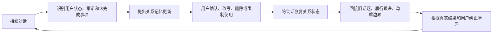

# 我们项目实现cognitive agi的概率有多大

- 线程 ID：`019faa44-66d1-7682-b33f-d66f6c92962f`
- 项目目录：`/Users/mengfu/Documents/GitHub/volvence`
- 来源状态：活动记录
- 原始源文件：`/Users/mengfu/.codex/sessions/2026/07/29/rollout-2026-07-29T03-47-18-019faa44-66d1-7682-b33f-d66f6c92962f.jsonl`
- 原始备份：`raw/active/019faa44-66d1-7682-b33f-d66f6c92962f.jsonl.gz`
- 时间范围：2026-07-28T19:47:35.680Z ～ 2026-08-04T00:30:01.301Z
- 可见对话：用户 22 条，Codex 143 条
- 排除的自动心跳触发：0 条
- 保留的可见进度通知：0 条
- 排除的静默心跳响应：0 条

> 本文件仅保留 UI 对话事件中的用户消息和 Codex 可见回复；系统/开发者指令、推理、工具调用及工具输出未写入本文件。完整事件保留在压缩原始 JSONL 中。

## 1. 用户

_2026-07-28T19:47:37.295Z_

我们项目实现cognitive agi的概率有多大

## 2. Codex（最终答复）

_2026-07-28T19:49:41.486Z_

如果按“真正做出 cognitive AGI”这个强定义，我会给一个很谨慎的估计：**低个位数到 10% 左右**。

但这个数字要拆开看，否则会很误导：

| 目标定义 | 我对 Volvence 的粗略概率 |
|---|---:|
| 做出一个有清晰认知架构、长期记忆、关系连续性、自适应控制的强原型 | **40–60%** |
| 做出一个在某些垂直场景里明显优于普通 agent 的“认知型智能体产品” | **20–40%** |
| 做出被外部严肃认可的 cognitive AGI 雏形 | **5–10%** |
| 独立突破真正通用、可持续自我改进的 AGI | **1–3%** |

我会这么判断：

Volvence 的方向是有价值的。你们不是在堆 prompt，而是在试图把 **memory、prediction error、credit assignment、regime、homeostasis、self/world separation、bounded adaptation** 放进一个契约化系统里。这比大多数“AGI 项目”清醒很多。

但真正难的地方不在架构宣言，而在三件事：

1. **闭环证据**
   系统必须证明它能从经历中稳定变好，而不是只是在每轮生成里显得聪明。

2. **信用分配**
   Prediction Error 很关键，但从 error 到“该更新什么、更新多少、何时冻结、何时回滚”是核心难题。

3. **产品化压力**
   如果没有高频真实用户场景，认知架构很容易变成漂亮但缺少梯度的系统。

我的真实看法是：  
**Volvence 更有机会先做出“cognitive agent / relationship intelligence OS”，而不是直接做出 AGI。** 这不是坏事，反而可能是最现实的路径。AGI 很可能不是被一次性“造出来”的，而是从稳定、有边界、有长期适应能力的系统里逐步长出来。

如果要把概率往上推，最重要的不是继续扩架构，而是尽快建立一个硬指标闭环：

- 一个真实长期用户场景
- 一个可重复 episode 流
- 明确的 PE / credit / memory 更新证据
- 能证明 30 天后比第 1 天更懂用户、更少犯同类错
- 能证明错误更新不会污染长期人格和关系模型

一句话：  
**架构直觉不错，AGI 概率仍然低；但做出一个真正有生命感、能长期适应人的认知系统，概率不低，而且值得赌。**

## 3. 用户

_2026-07-28T19:56:24.397Z_

relationship intelligence OS 还差什么。

## 4. Codex（过程更新）

_2026-07-28T19:56:36.111Z_

我先对照一下项目里的 specs 和架构文档，这样回答会更贴近 Volvence 现在的真实边界，而不是泛泛讲“还要记忆、还要评估”。

## 5. Codex（过程更新）

_2026-07-28T19:56:48.023Z_

我看到当前文档已经把“关系与主体性”写成核心产品价值，也有 PE、dual-track、semantic owners、personal conditioning、state carrier evidence 等模块线索。下一步我会把“还差什么”按产品闭环、认知机制、证据与工程化四层拆开。

## 6. Codex（最终答复）

_2026-07-28T19:57:29.294Z_

我觉得还差的不是“认知架构”，而是把它压成一个**可被用户长期依赖的关系操作系统闭环**。

现在 Volvence 更像：**认知内核已经有形了，但 Relationship Intelligence OS 还没有真正开机成为主路径。**

最关键差这几层：

1. **learned 行为还没有成为 authoritative**
   
   现在很多 learner 是 `SHADOW / report-only`：regime、affordance、consolidation、dual-track gate、thinking advisory、groups 等都已有路径，但默认行为仍主要由结构和启发式主导。  
   
   Relationship OS 必须证明：系统不是“看起来懂关系”，而是能从 PE、credit、memory、social outcome 中持续学会更好的关系行为。

2. **关系状态还没有足够强地跨 session 生长**
   
   需要从“记得一些事实”升级到“维护一段关系”：
   
   - 我们之间发生过什么
   - 哪些地方修复过
   - 用户在哪些话题上变得更信任 / 更防御
   - 哪些边界不能碰
   - 哪些承诺未完成
   - 哪些表达方式会让关系更稳
   - 哪些模式是误伤、错人归因、假亲密、过度迎合

   当前已有 ToM、common ground、semantic owners、relationship state，但 OS 级还需要形成**可审计、可恢复、可编辑、可迁移**的长期关系图谱。

3. **缺一个明确的产品第一屏**

   “Relationship Intelligence OS”不能只是内核。它需要一个用户一打开就明白的体验锚点。

   我会建议先不要做泛 AGI 助手，而是选一个 wedge：

   - 长期陪伴 / emotional continuity
   - 私域成长顾问
   - 深度自我探索 coach
   - 工程结对伙伴，但带长期关系和认知风格记忆
   - 虚构角色 / 数字人格，但有边界、记忆和关系演化

   第一屏不是“我能帮你做任何事”，而是：  
   **“我会长期理解你、和你一起变得更清楚。”**

4. **缺关系质量的硬证据体系**

   不能只看回答质量。Relationship OS 至少要有这些 longitudinal evidence：

   - 30 天后是否更少重复问用户已明确表达过的东西
   - 是否能正确处理 rupture / repair
   - 是否能区分不同人、不同关系、不同上下文
   - 是否能记住承诺并主动 closure
   - 是否能在用户状态变化时调整 regime
   - 是否能避免自我确认式“我很懂你”
   - 是否比普通 memory agent 在同基底 ablation 中显著更强

   你们文档里其实已经说得很诚实：现在瓶颈从“写代码”转成了“跑证据”。

5. **缺用户可控的信任界面**

   真正的 Relationship OS 必须让用户能看到和改动系统对自己的理解：

   - “它认为我是什么样的人”
   - “它记住了哪些关系事实”
   - “它为什么用这个语气 / regime”
   - “它是否把某件事沉淀为长期记忆”
   - “我可以纠正、删除、冻结哪些记忆”
   - “哪些内容只在本 session 有效”

   没有这个，长期记忆会从“被理解”变成“被监视”。

6. **缺环境与行动闭环**

   关系不是只在聊天文本里发生。OS 需要 Observe / Act / Assimilate 的真实产品闭环：

   - 用户回来了还是流失了
   - 某个建议后来有没有帮助
   - 某次安慰是不是让情况更差
   - 某个承诺有没有完成
   - 某个行动有没有造成边界问题

   没有 outcome，PE 就会贫血；PE 贫血，credit 和 learning 都会虚。

我的优先级会这样排：

1. **先选一个垂直场景**，别一开始做全域 OS。
2. **跑 20–30 天 longitudinal evidence**，证明关系状态真的跨 session 变好。
3. **把一个 learned component 从 SHADOW 晋升 ACTIVE**，比如 regime 或 consolidation。
4. **做用户可见的 Relationship Memory / Trust Console**。
5. **建立 rupture / repair、wrong-person、boundary violation 三类强测试集**。
6. **把 relationship state 接到真实 outcome，而不只是文本自评。**

一句话：  
**Volvence 已经有 cognitive kernel 的野心和雏形；Relationship Intelligence OS 还差的是：一个真实用户场景、一条长期关系证据链、一个可控的信任界面，以及让 learned 关系行为真正上主路径。**

## 7. 用户

_2026-07-31T16:24:58.790Z_

这会儿你再看下我们的进展程度。

## 8. Codex（过程更新）

_2026-07-31T16:26:50.862Z_

我来按仓库事实重新扫一遍：先看当前工作区，再读最新状态文档和证据台账。这样这次判断会基于你们这几天实际推进后的状态，而不是沿用 7 月中旬那版口径。

## 9. Codex（过程更新）

_2026-07-31T16:27:02.796Z_

最新状态文档里已经出现了一个很重要的变化：#92 被标成 `thesis-rejected`，也就是“机制覆盖完整，但整体 thesis 没过终局因果证据”。我会再核对 #92 台账和 artifacts，避免只读摘要。

## 10. Codex（过程更新）

_2026-07-31T16:27:12.366Z_

这里有点“好消息和坏消息同时变得更清楚”：你们不是原地踏步，而是把之前悬着的证据线结案了。只是结案结果不是 thesis-retained，而是更诚实地缩小了可宣称范围。

## 11. Codex（过程更新）

_2026-07-31T16:27:23.416Z_

另外，工作区里还有一批未提交改动，集中在三条线：character residual package、digital-ant ecology evidence、以及 substrate/runtime 接线。它们可能是 #92 终局之后的新推进，我会单独看这些，不把它们误混进已经冻结的终局判词。

## 12. Codex（过程更新）

_2026-07-31T16:27:38.607Z_

新工作区改动里，character residual 是明显的产品化推进：它把“角色人格”从 template/prefix 层推进到目标模型残差 artifact，但默认仍是 shadow，需要行为质量 gate 才能 active。Ant 这边则像是在 #92 后开了新的 L1 机制链，正在预注册新 station1，而不是复活旧 verdict。

## 13. Codex（过程更新）

_2026-07-31T16:27:49.272Z_

代码层面我看到两个“新方向”的质量不错：一是角色残差包有 content-address、目标模型/hidden/layer/delta cap 的 fail-loud 契约；二是 ant 的 formation protection 没用 body id 或 food/carrying 字符串特判，仍在 temporal owner 里做通用的贡献冲突衰减。这两个都符合仓库约束里“别用表达层补丁糊上游问题”的味道。

## 14. Codex（最终答复）

_2026-07-31T16:30:26.457Z_

我这次看完，判断要更新成：

**你们的“工程成熟度”明显上升了，但“整体 cognitive thesis 被证明”的程度下降了。**  
这不是倒退，是从“我们可能已经接近证明”推进到了“我们知道哪些真的成立、哪些被证伪、哪些不能再嘴硬”。

当前最准确的分层进度：

| 维度 | 我现在的判断 |
|---|---:|
| 架构 / owner / snapshot / rollback 骨架 | **90–94%** |
| 第一阶段认知系统代码 | **91–95%** |
| mechanism coverage | **基本完整** |
| causal 支持 | **Gate 2 / 8 / 11 成立，其他主要未成立** |
| longitudinal 支持 | **Gate 8 / 11 成立** |
| 默认 learned 主导度 | **10–20%** |
| production learned takeover | **未授权** |
| Relationship Intelligence OS 原型 | **35–45%** |
| 作为“已证明 cognitive AGI thesis” | **未通过，当前是 thesis-rejected** |

最重要的新状态是：`#92` 已经 CLOSED，终局 verdict 是 **`thesis-rejected`**。  
这句话很硬，但其实是科学进展。你们已经证明了：

- owner / snapshot / replay / persistence / rollback 这套机制是真实的；
- PE 是可审计的一级信号，且 evaluation 没有反向污染；
- Gate 2 有受限 open-loop `z_t` action-value 因果证据；
- Gate 8 wake/sleep 有因果 + 纵向 owner 效果；
- Gate 11 per-user continuity 有因果 + 纵向支持；
- full-chain rollback 通过。

但没有证明：

- PE-on 行为稳定优于 PE-off；
- 多频 CMS 比单频有有意义净增益；
- segment-aware 主动学习稳定省标签；
- SSL→RL takeover 带来 terminal return / composition 增益；
- M3 / rare-heavy / conditioned init 真的带来稳定收益；
- relationship quality 已有人类 ground truth 支持；
- ecology 已形成 medium 闭环或一般物理自主性。

我会把当前项目状态概括为：

**Volvence 已经从“认知 AGI 架构项目”进化成“有严格证据边界的持续适应内核”。这比普通 agent 项目强很多，但离 AGI 或 Relationship Intelligence OS 的产品证明还差一条真实长期用户闭环。**

另外，工作区里还有新的未提交推进：

- **Character residual adapter package** 已出现：张无忌 1.5B target residual artifact、content-address、model/hidden/layer/delta cap fail-loud，默认 `shadow`。这是角色产品化的重要进展。
- **Ant ecology L1-A/B/C** 在 #92 后开了新机制链：归因 body2 alignment failure，新增 formation protection，冻结新 station1-v4 prereg。但目前只授权 station1 ep0–19，station2/P1/P2 仍未授权。

我的一句话结论：

**项目不是“快证明 AGI 了”，而是“已经具备一个很认真、可审计、可回滚的认知实验平台；局部机制有硬证据，整体 thesis 暂时被证伪。下一阶段最有价值的不是继续喊 AGI，而是把 Gate 8/11 这两个真的成立的东西，压成 Relationship OS 的真实产品闭环。”**

## 15. 用户

_2026-07-31T16:48:39.719Z_

gate 8/11 怎么压成产品闭环？

## 16. Codex（最终答复）

_2026-07-31T16:49:09.975Z_

Gate 8/11 不要压成“AGI 产品”，要压成一个很窄但很硬的产品闭环：

**“我能跨天记住你、修正我对你的理解，并在下一次相处中真实变好。”**

对应关系是：

| Gate | 产品化含义 |
|---|---|
| Gate 8 wake/sleep | 会话后慢反思：把经历沉淀成可审计的关系更新 |
| Gate 11 per-user continuity | 下一次见到同一用户时，正确加载、隔离、使用这些关系状态 |

产品闭环可以这样做：

1. **Session 内：只做 typed observation**
   
   每轮不要直接“学人格”。只记录正式 owner 信号：

   - 用户表达的偏好
   - 关系状态变化
   - boundary / consent
   - commitment
   - open loop
   - rupture / repair
   - PE：我预测用户需要什么，实际反馈是什么

2. **Session 后：跑 wake/sleep consolidation**
   
   这就是 Gate 8 的产品入口。会话结束后生成一组“关系更新提案”：

   - `我学到你更喜欢直接一点的建议`
   - `你不希望我在家庭话题上太快给结论`
   - `我们还有一个未关闭的问题：下周继续看职业选择`
   - `上次我误解了你的意思，后续应先确认再建议`

   关键：这些不是自由文本记忆，而是写进对应 owner：`user_model / relationship_state / boundary_consent / open_loop / commitment`。

3. **用户可见：Relationship Memory Console**
   
   必须让用户看到和控制：

   - 记住
   - 仅本次有效
   - 删除
   - 改写
   - 标记为敏感
   - 禁止用于主动提起

   没有这个，长期关系智能会变成“黑箱记忆”，信任感反而下降。

4. **Next session：用 Gate 11 做准确唤醒**
   
   下一次用户回来，系统不是泛泛说“欢迎回来”，而是做可验证 callback：

   - 继续上次 open loop
   - 遵守上次 boundary
   - 不重复问已确认事实
   - 区分不同用户 / 不同 interlocutor
   - 正确恢复 commitment 状态

   这里要保留 Gate 11 的负控思路：`stateless / swapped-user / shuffled-history` 都应该明显差于 correct-user-state。

5. **Outcome 回流：让关系更新被验证**
   
   用户下一次的反应必须回到 PE：

   - callback 是否有用
   - 有没有冒犯
   - 是否错人归因
   - 是否过度亲密
   - 是否准确关闭 open loop
   - 用户是否纠正记忆

   这会形成真正产品闭环：  
   **经历 → sleep consolidation → 用户可控记忆 → next-session wake → outcome/PE → 下一轮 consolidation。**

我会先做一个很小的 MVP：

**“7 天连续关系助手”**

只承诺 5 件事：

- 记住用户明确允许记住的偏好
- 记住未完成的 open loop
- 记住边界和禁区
- 记住承诺并主动 closure
- 允许用户随时查看、纠正、删除这些记忆

验收指标不要先追 DAU，而是追：

- callback hit rate
- boundary violation rate
- wrong-user attribution rate
- open-loop closure rate
- user correction rate
- remembered item usefulness
- 7-day trust delta

一句话：  
**Gate 8/11 最适合产品化成“可控的长期关系记忆 + 下一次相处真的更懂你”，而不是直接产品化成 autonomous AGI。**

## 17. 用户

_2026-07-31T17:12:01.493Z_

# Files mentioned by the user:

## 七天关系助手mvp_4afc864e.plan.md: .cursor/plans/七天关系助手mvp_4afc864e.plan.md

## My request for Codex:
按照我们这个文档的设计， 开始产品化。

## 18. Codex（过程更新）

_2026-07-31T17:12:14.329Z_

我开始按这个 plan 落地。先确认当前工作区和计划内容，然后定位它对应的 owner / wheel / 产品入口，尽量收敛成一个可回滚的第一包。

## 19. Codex（过程更新）

_2026-07-31T17:12:30.392Z_

计划本身也建议 P0 契约先行；我会先做 P0，并尽量把 P1 的数据形状看清楚，避免 spec 写成后来不能落地的幻想。现在开始读 reflection / evaluation / service 的现有接口。

## 20. Codex（过程更新）

_2026-07-31T17:12:43.083Z_

P0 的落点清楚了：新 spec + DATA_CONTRACT slot 注册 + 00_INDEX 登记。为了让 P0 不空转，我还会把 `ReflectionSnapshot` 的现有 shape 和测试位置读完，准备同一轮尽量落 P1 的 SHADOW readout。

## 21. Codex（过程更新）

_2026-07-31T17:12:54.810Z_

我会把第一包稍微扩到 P1：只增加 reflection 的 SHADOW readout，不做 console API，不落库。这个改动影响面小，而且能让后续 service/UI 真正有东西可读。接下来我会编辑 spec、DATA_CONTRACT、00_INDEX 和 reflection owner。

## 22. Codex（过程更新）

_2026-07-31T17:13:29.461Z_

我会把 readout 设计成 `ReflectionSnapshot` 的字段扩展，而不是新 runtime slot：reflection 仍是唯一 owner，console 后续只读这个公开字段。提案本身只从已有 owner artifacts/PE enum 生成，不从用户原文做关键词判断。

## 23. Codex（过程更新）

_2026-07-31T17:13:48.877Z_

先加了稳定 proposal 类型和 content-addressed id。下一步把它接进 `ReflectionEngine.reflect()`，让每次 session-post reflection 都能发布待确认的关系更新提案。

## 24. Codex（过程更新）

_2026-07-31T17:14:26.407Z_

`ReflectionSnapshot` 已经会生成 proposal 了；我补一下 public export 和单测，确保后续 service 侧不用 import 私有模块路径。

## 25. Codex（过程更新）

_2026-07-31T17:14:36.661Z_

单测会覆盖两个关键点：proposal 默认是 SHADOW/需确认，且由 PE/owner artifacts 生成稳定 id。这样 console 下一包可以放心把它当只读队列。

## 26. Codex（过程更新）

_2026-07-31T17:14:56.974Z_

现在补 P0 文档：把 relationship-memory-console 登进 specs 索引，并在 DATA_CONTRACT 里冻结 `reflection.relationship_update_proposals` 与后续 evaluation metrics 的只读边界。

## 27. 用户

_2026-07-31T17:16:41.388Z_

继续

## 28. Codex（过程更新）

_2026-07-31T17:16:47.313Z_

我继续把第一阶段收敛包做完：先确认刚才的改动没有碰到你的在途文件，然后补齐契约注册、索引和针对性验证。这个包会先冻结“关系更新提案”的 owner 与快照形状，为后续 API 和控制台留出稳定接口。

## 29. Codex（过程更新）

_2026-07-31T17:17:01.328Z_

刚才的 P1 代码其实已经落在当前基线里，工作区只剩新增 spec 未登记；我现在确认它是否已进入 HEAD，并据此避免重复编辑。随后会把 P0/P1 作为一个小包完成，不提前把 API/UI 混进来。

## 30. Codex（过程更新）

_2026-07-31T17:17:30.561Z_

目前已确认：`reflection` 的 P1 影子提案契约已经在 `188cf8b2` 进入主线，之后另有 Gate 2 证据提交推进了 HEAD；我会只补缺失的 P0 文档和计划状态，不改动那批证据文件。先跑现有 P1 单测，避免把一个未被验证的契约写进正式注册表。

## 31. Codex（过程更新）

_2026-07-31T17:17:51.906Z_

P1 单测已经全绿（21/21）。接下来我补四处文档状态：索引入口、`ReflectionSnapshot` schema、slot/字段注册、MVP 计划的 P0/P1 完成标记；P5 只预注册为 evaluation-owned 的 `DISABLED` readout，避免文档把尚未实现的指标端点说成已经上线。

## 32. Codex（过程更新）

_2026-07-31T17:18:27.588Z_

契约现在已经闭合：P1 是 `reflection` 字段扩展，P5 则预注册为 `relationship_continuity`，默认 `DISABLED`，所以未实现前不会假装接入运行时。现在做最后两层检查：代码风格与 contract tests，重点看新增 slot 是否破坏 wheel 边界或 owner 单写规则。

## 33. Codex（过程更新）

_2026-07-31T17:18:37.275Z_

P1 实现文件本身还要单独确认；整份测试文件的 Ruff 暴露了 5 个既有问题，位置在本次新增用例之外（两处长行、两项未用 import、另一处长行），我不把这些无关清理混进产品包。contract suite 仍会照常跑，最终会把这项残余如实列出。

## 34. Codex（过程更新）

_2026-07-31T17:19:26.310Z_

contract tests 已经跑到 75%，目前出现 1 个失败，其余持续通过；进程还在运行。我会先让它完整结束，再判断失败是否由新增文档契约引起，还是当前主线已有回归。

## 35. Codex（过程更新）

_2026-07-31T17:20:07.771Z_

全量 contract 结果是 `3997 passed / 2 skipped`，另有 5 个既有断言失败和 5 个本机网络监听权限错误；失败分别落在 Gate 2 直接 import、narrative schema、品牌字符串守卫、张无忌 vertical，均不在本包文件。为了把环境噪声和真实回归分开，我只会在沙箱外重跑那 5 个 SSE 用例，不会处理这些并行在途问题。

## 36. Codex（过程更新）

_2026-07-31T17:20:59.186Z_

SSE 重跑还在执行，暂时没有报错输出；我会等它结束再收口，不会留下后台测试进程。与此同时，P0/P1 本身已经有 21 个专项测试和实现文件 Ruff 通过。

## 37. Codex（过程更新）

_2026-07-31T17:21:32.850Z_

P0/P1 已经完成并进入当前主线；我继续推进下一个独立包 P2。先读 `lifeform-service` 的 session/identity 边界和现有 Brain facade，确认关系记忆 API 能否只读正式快照、写入正式 owner API，而不会让 service 变成第二个记忆 owner。

## 38. Codex（最终答复）

_2026-07-31T17:22:37.052Z_

已完成第一阶段产品化包，P0/P1 状态已更新为 `completed`：

- `reflection` 成为关系更新提案的唯一 owner，发布稳定、可追溯、默认需人工确认的 `relationship_update_proposals`。[实现](/Users/mengfu/Documents/GitHub/volvence/packages/vz-cognition/src/volvence_zero/reflection/writeback.py:228)
- 完成 Console 产品契约、六类用户操作、七项连续性指标及回滚规则。[产品 spec](/Users/mengfu/Documents/GitHub/volvence/docs/specs/relationship-memory-console.md:1)
- 在 [DATA_CONTRACT](/Users/mengfu/Documents/GitHub/volvence/docs/DATA_CONTRACT.md:2050) 登记 P1 字段，并将 P5 `relationship_continuity` 预注册为 `DISABLED → SHADOW`，未实现前不会进入学习链。
- 更新 [能力索引](/Users/mengfu/Documents/GitHub/volvence/docs/specs/00_INDEX.md:196) 和 [MVP 计划](/Users/mengfu/Documents/GitHub/volvence/.cursor/plans/七天关系助手mvp_4afc864e.plan.md:5)。

验证结果：

- Reflection 专项测试：`21 passed`
- 实现文件 Ruff：通过
- SSE contract：`5 passed`
- 全部 contract：`3997 passed, 2 skipped`；仍有 5 个与本包无关的主线失败，涉及 Gate 2 import、narrative schema、品牌字符串守卫和张无忌 vertical
- 未跑全仓 pytest，本包影响面已由专项与 contract 测试覆盖

当前回滚很直接：忽略或移除 `relationship_update_proposals` 即恢复旧 ReflectionSnapshot 行为；P5 默认仍是 `DISABLED`。下一收敛包是 P2：将这些提案接成 `/v1/users/me/relationship-memory` 的可操作 Console API。

## 39. 用户

_2026-07-31T17:23:54.143Z_

继续。

## 40. Codex（过程更新）

_2026-07-31T17:24:05.582Z_

我继续做 P2 Console API，这次会把它收敛成 service 层产品 actuator：GET 只读 durable memory 与 reflection proposal，POST 六种操作全部走现有 memory/semantic owner 公共入口。先重新检查并行改动，再冻结请求/响应与失败语义，避免 service 偷偷持有第二份关系状态。

## 41. Codex（过程更新）

_2026-07-31T17:28:26.802Z_

边界已经清楚了：Console 必须携带 `session_id`，这样 `/users/me` 能校验会话确实属于当前用户，也能读取该会话最新的 reflection 快照。写入分两类：memory 操作同步走 Brain facade → Memory owner；semantic/boundary 操作排入 typed event 队列，在下一次 canonical turn 由 owner 应用，API 会明确返回 `queued`，不会伪报已落库。

我先补 Memory owner 的“按 scope 删除/改写单条”公共 API，再接 Brain facade 和 service 路由。

## 42. Codex（过程更新）

_2026-07-31T17:30:53.766Z_

Memory owner 的单条操作已经补上 scope 守卫：拿到别人的 `entry_id` 也删不掉、改不了；改写会先写新记录，再移除旧记录，失败时保留原记录。现在开始接 Console 自己的轻量 action ledger，它只记录“用户对哪个 proposal 做了什么”，用于隐藏已处理提案和后续 P5 指标，不保存或解释关系语义。

## 43. Codex（过程更新）

_2026-07-31T17:35:13.933Z_

P2 主链和测试夹具已接好：GET 会同时返回 durable entries 与未处理 proposals；POST 支持六个精确 action，重复同一请求幂等，不同二次操作返回冲突。现在跑 Memory scope 单测和真实 aiohttp 路由测试，重点验证跨用户保护、proposal 隐藏、typed boundary event，以及确认后的 durable persistence。

## 44. Codex（过程更新）

_2026-07-31T17:35:30.622Z_

第一次测试没有跑到代码：当前 Python 环境把 `lifeform_service` 解析到了另一个 checkout（`VolvenceDeploy/external/VolvenceZero`），所以看不到本工作区的新 handler。我要用本仓各 wheel 的 `src` 显式覆盖导入路径后重跑；这是环境解析问题，不是实现失败。

## 45. Codex（过程更新）

_2026-07-31T17:36:30.796Z_

路由与大部分 owner 测试已经通过，当前只有两个测试夹具把 `FileSystemPersistenceBackend` 的 keyword-only 参数写成了位置参数。修正夹具后继续重跑，不需要改产品逻辑。

## 46. Codex（过程更新）

_2026-07-31T17:37:37.314Z_

核心测试已全绿（16/16）。我在收口审查时发现一个产品语义问题：当前幂等 ledger 会让 durable 条目做过一次操作后永远不能再改，例如先标敏感就无法日后重写。我要把“proposal 只能解决一次”和“durable item 可连续操作”拆开；这是 Console 自身的生命周期修正，不触碰 kernel owner。

## 47. Codex（过程更新）

_2026-07-31T17:39:09.717Z_

六种操作现在都有路由级覆盖，`19 passed`。我会补最后的契约文档：把 P2 标记为 landed，登记 service 侧 action ledger（它不是 kernel slot），并明确 `session_id` 绑定、同步 memory mutation 与异步 semantic queue 的响应语义；随后跑 import-boundary 守卫。

## 48. Codex（过程更新）

_2026-07-31T17:40:13.013Z_

import-boundary 守卫中与 P2 有关的边界全部通过：`2585 passed`。唯一失败仍是之前那条 Gate 2 文件直接 import `companion_standard.semantic_state`，不在本包改动范围。我现在做最终 diff 审查，尤其检查 API 是否泄露跨用户条目、是否把 queued 事件误写成 applied，以及是否混入并行生成的 Gate 2 文件。

## 49. Codex（过程更新）

_2026-07-31T17:40:56.975Z_

最终审查又抓到一个真正需要修的 owner 细节：旧的 scope 删除 helper 只删 artifact，没有同步清理 derived retrieval index 和 entry attributes。单条 Console 删除若沿用它，会留下可重建但不应存在的投影残留。我会把删除提升为 MemoryStore 的正式原子 API，并让现有整 scope 删除、单条删除、改写统一走它；同时为持久化失败加 checkpoint 回滚。

## 50. Codex（过程更新）

_2026-07-31T17:43:09.192Z_

为保证持久化失败真的可回滚，我补齐了 `MemoryStoreCheckpoint.entry_attributes`。这会改变 continuum-memory 里“attribute index 不进 checkpoint”的旧口径，所以我同步修 spec；字段有空 tuple 默认值，旧 checkpoint 仍能加载。

## 51. Codex（过程更新）

_2026-07-31T17:44:41.782Z_

owner 原子性回归已通过（34/34），包括 scope backend、真实 API、checkpoint 回滚。因为这次给共享 `MemoryStoreCheckpoint` 增加了向后兼容字段，我会按仓库规则再跑完整 `tests/contracts`；预计仍会看到前面那 5 个并行主线失败，但可以确认没有新增 schema/import 回归。

## 52. Codex（过程更新）

_2026-07-31T17:46:05.399Z_

完整 contract 已跑到 95%，目前出现 3 个失败，没有新增错误或中断；数量比上一轮的 5 个主线失败更少，说明并行改动还在变化。我会等完整报告，按具体文件确认是否与本包相交。

## 53. Codex（过程更新）

_2026-07-31T17:47:01.540Z_

完整 contract 结果为 `4006 passed / 2 skipped / 3 failed`，三个失败都不在 P2：Gate 2 的 direct import、PowerShell 品牌守卫、predictive-head 浮点舍入。P2 没有新增 contract 回归。最后我再加一个持久化 round-trip 断言，直接证明新 checkpoint 字段跨重启恢复，而不只是在内存 rollback 中工作。

## 54. Codex（最终答复）

_2026-07-31T17:48:18.945Z_

P2 Console API 已完成，计划进度现在是 P0-P2 完成。

新增接口：

- `GET /v1/users/me/relationship-memory?session_id=<id>`
- `POST /v1/users/me/relationship-memory/{item_id}/action`
- 支持 `keep / session_only / delete / rewrite / mark_sensitive / no_proactive_mention`
- 强制校验 session 属于当前用户
- Memory 操作同步持久化；semantic/boundary 操作明确返回 `queued`
- 请求幂等，proposal 只能解决一次，durable item 可继续修改

关键实现位于 [app.py](/Users/mengfu/Documents/GitHub/volvence/packages/lifeform-service/src/lifeform_service/app.py:1504)、[relationship_memory_console.py](/Users/mengfu/Documents/GitHub/volvence/packages/lifeform-service/src/lifeform_service/relationship_memory_console.py:1) 和 [brain.py](/Users/mengfu/Documents/GitHub/volvence/packages/vz-runtime/src/volvence_zero/brain.py:276)。

Memory owner 也补齐了 scope-guarded 单条删除/改写，以及 artifact、semantic index、attribute index 的原子清理和持久化失败回滚。[identity.py](/Users/mengfu/Documents/GitHub/volvence/packages/vz-memory/src/volvence_zero/memory/identity.py:445)

验证：

- P2、scope、持久化专项：`35 passed`
- Contract suite：`4006 passed, 2 skipped`
- 仍有 3 个与本包无关的主线失败：Gate 2 import、品牌字符串守卫、predictive-head 浮点舍入
- Ruff 功能规则通过；现有 `app.py`/`store.py` 中少量旧长行未混入本包清理
- 未运行全仓 pytest，完整 contract 与直接影响测试已覆盖本包风险

当前限制是 action ledger 仍为进程内状态，重启后的持久 action evidence 和 PE 回流属于 P4。下一包可以直接进入 P3 内嵌记忆面板。

## 55. 用户

_2026-07-31T17:48:19.401Z_

然后你继续作吧， 把整个计划作完， 从p3到p6

## 56. Codex（过程更新）

_2026-07-31T17:48:27.070Z_

我会把 P3-P6 连续做完，并按四个可回滚包逐个验收：先完成内嵌记忆面板，再接纠正 outcome/CP-12，随后实现七项 continuity readout 与端点，最后落 Gate 11 离线门和 7 天 pilot harness。P3 涉及现有浏览器 UI，我会使用 in-app browser 技能做桌面与移动视口验证；先读取它的操作约束，再检查当前并行工作区状态。

## 57. Codex（过程更新）

_2026-07-31T17:49:49.973Z_

P3-P6 我会按四个独立收敛包推进：先把记忆控制台真正嵌进聊天产品，再接纠错证据与跨会话回流，然后发布连续性指标，最后把 Gate 11 和七天试点做成可重复验收。每一包都会同步契约、测试和回滚边界，避免把四层行为揉成一个不可拆的大改动。

## 58. Codex（过程更新）

_2026-07-31T17:50:39.565Z_

现有 UI 是单文件内嵌的双栏操作台，右栏已经承担治理状态，所以我会把关系记忆做成右栏内的可折叠工作区，而不是再造第三套页面。这样 session、alpha user 和现有鉴权头可以直接复用，面板只消费 P2 已发布的 API，不会偷偷解析 kernel 内部状态。

## 59. Codex（过程更新）

_2026-07-31T17:50:56.230Z_

我现在先完成 P3 的文件改动：增加稳定尺寸的记忆区、待确认与已记住两种列表状态、重写输入，以及六个动作的请求/刷新流程。操作成功后面板会重新读取服务端快照，UI 本身不缓存“关系真相”。

## 60. Codex（过程更新）

_2026-07-31T17:52:34.330Z_

P4 的关键点已经定位到了：外部 outcome 的唯一入口是现成的 `submit_dialogue_outcome`，但 lifeform facade 还没透传 `action_turn_index`，这会让 HTTP 反馈无法准确归因到被评价的上一轮。这个包会先补齐该契约，再把 `delete/rewrite` 映射为 typed `MISSED`、边界收紧映射为 typed `OVER_DIRECTIVE`，并把动作账本落盘；不会新增 PE 轴。

## 61. Codex（过程更新）

_2026-07-31T17:54:12.795Z_

我开始改 P4 的 owner/契约文件：动作账本会采用版本化 JSON 快照和原子替换，重启后仍能识别幂等请求；新增的 `correction_kind` 是封闭枚举，错人归因必须由 UI/API 明确提交，绝不从文本猜。随后会补 facade 透传和服务端 outcome 注入。

## 62. Codex（过程更新）

_2026-07-31T17:56:45.196Z_

P4 的跨会话缺口比文档里写得更具体：语义记录会 hydrate，但 CP-12 的“待结算预测”此前被刻意留在 session 内，所以新会话只能看到状态，无法结算上一会话的预测。我正在把这两项 prediction 元数据加入 `SemanticStateStore` v2 持久化，并保留 v1 显式兼容读取；这正是 owner 内修复，不会在 metrics 层伪造 settlement。

## 63. Codex（过程更新）

_2026-07-31T17:57:54.385Z_

P5 我会把“指标计算”和“产品动作”彻底分开：`vz-cognition/evaluation` 新 owner 只接收不可变快照与类型化 console outcome，自己维护七天窗口并发布 frozen readout；service 只负责鉴权、转交快照、序列化结果。缺少分母时返回 `null`，不把“没有证据”伪装成 0 分。

## 64. Codex（过程更新）

_2026-07-31T17:59:03.422Z_

指标 owner 已经有了七天窗口与持久化轮廓。下一步接 service：每次查询只提交当前公开快照和账本中已类型化的动作，返回去标识化 scope hash、七项值和各自样本量；原始 user id 不会进入指标响应。

## 65. Codex（过程更新）

_2026-07-31T18:00:23.568Z_

P6 不会重跑昂贵 evidence 当作日常 CI。我要增加的是一个纯校验门：读取既有 Gate 11 artifact，强制三个负控效应、置信区间、隔离/回滚/持久化门全部通过；另外提供七天邀请制采集器，把每日 metrics 和已去标识化 transcript 材料写成 L4 可直接消费的稳定 JSONL。

## 66. Codex（过程更新）

_2026-07-31T18:01:29.594Z_

四个包的主体实现都已落到对应 owner。现在进入第一轮静态收敛：先让 Ruff 和导入检查指出签名、序列化和行宽问题，再补测试；这一轮通常能把“看起来闭环”和“真的能运行”之间的细碎断点一次性扫出来。

## 67. Codex（过程更新）

_2026-07-31T18:02:06.758Z_

静态检查暴露的是两类小问题：语义 store 里已有的旧 import/行宽，以及测试 doubles 尚未实现新透传参数。现在我会补完整测试矩阵：P3 DOM 与六操作、P4 outcome/账本重启/CP-12 hydrate、P5 七指标窗口、P6 artifact gate 与 pilot 去标识化。

## 68. Codex（过程更新）

_2026-07-31T18:04:08.166Z_

第一轮 Ruff 已经全绿。接下来跑定向测试时我会显式把当前仓库所有 wheel 的 `src` 放到 `PYTHONPATH`，避免本机另一个 Volvence checkout 被 pytest 误导入；service 集成测试需要 aiohttp 绑定本地临时端口，因此会用已批准的本地测试权限执行。

## 69. Codex（过程更新）

_2026-07-31T18:04:36.798Z_

定向测试第一轮在收集阶段抓到一个真实的包循环：`prediction.error -> evaluation.__init__ -> relationship_continuity -> prediction.error`。这不是业务逻辑失败，我会把 PE 类型改为调用时延迟导入，让 evaluation facade 保持可导入，同时仍在实际 readout 时做严格 `isinstance` 校验。

## 70. Codex（过程更新）

_2026-07-31T18:05:55.719Z_

定向测试现为 54/55，通过的部分已经覆盖 CP-12 跨 session 与 Gate 11/pilot；唯一失败只是浮点精度断言，已改成近似比较。顺手补一个产品缺口：错人归因不能只在 API 里存在，记忆项上会增加封闭的纠错类型选择，让用户能明确标成“wrong person”，指标才有真实来源。

## 71. Codex（过程更新）

_2026-07-31T18:07:15.547Z_

在继续前我做了一次 wheel 边界复核：service 直接 import `vz-cognition.evaluation` 虽然能跑，但不符合本仓库“lifeform 只能经 Brain facade/contracts 进入脑核”的硬约束。我会把 readout/console outcome 的 immutable shape 上移到 `vz-contracts`，evaluation owner 留在 cognition，实例和持久化交给 `BrainSession`，service 只调用 facade。这个调整值得现在做，免得产品闭环落地后留下反向依赖债。

## 72. Codex（过程更新）

_2026-07-31T18:10:24.858Z_

定向与边界测试现在是 `2662 passed / 1 failed`；唯一失败仍是任务开始前就存在的 Gate 2 文件直接 import `companion_standard.semantic_state`，与本包无关。我们的新 contract/facade 边界已通过。接下来同步 specs，把 P3-P6 的实际 shape、CP-12 v2 hydration、回滚和 pilot 材料写成 SSOT，然后做浏览器验收。

## 73. Codex（过程更新）

_2026-07-31T18:10:33.266Z_

我现在更新文档与计划状态，内容会写实：P5 当前是 `SHADOW`、七项缺样本返回 `null`；P6 是“校验既有 artifact + 采集 pilot 材料”，不会被写成已经完成真人七日试验。CP-12 schema v2 的兼容与回滚也会明确登记。

## 74. Codex（过程更新）

_2026-07-31T18:11:41.450Z_

服务实现与契约已经收敛，接下来做真实 UI 验收。我会用 synthetic substrate 在 `127.0.0.1:8877` 启动 closed-alpha 本地服务，创建 `alice` session 后检查桌面和窄屏布局、六个动作控件、重写输入以及 metrics 请求；服务会保持运行，方便你随后直接试。

## 75. Codex（过程更新）

_2026-07-31T18:13:29.499Z_

桌面和 390px 窄屏都没有横向溢出或栏位重叠，记忆区在治理列内稳定收缩。现在我再走一条真实交互链：发送一轮、结束 scene 触发 slow loop，再刷新面板，确认有提案/条目时六操作和纠错类型选择确实由真实 API 数据渲染，而不只是空态好看。

## 76. Codex（过程更新）

_2026-07-31T18:14:25.994Z_

端到端 metrics 已返回正确的去标识化 hash、`shadow` wiring 和 `null` 缺样本值。我也发现一个细节：若 scene 结束后某 owner snapshot 不在当前 map，boundary 分母不该自动记作“观察到一次且未违规”；会把 observation 增加显式 `boundary_observed`，缺 snapshot 时保持 `null`，避免分母膨胀。

## 77. Codex（过程更新）

_2026-07-31T18:15:04.500Z_

P3-P6 定向测试已全绿：`55 passed`。我会再补一层回归，覆盖原有 dialogue outcome、bank attribution、rupture/reflection 和 scoped memory，确认新增 `action_turn_index` 透传及 CP-12 persistence 没有破坏既有反馈链。

## 78. Codex（过程更新）

_2026-07-31T18:16:20.445Z_

相关回归是 `39 passed / 1 failed`。失败不是本次行为：pytest 报错路径实际落到了 `../VolvenceDeploy/external/VolvenceZero/tests/test_open_dialogue_artifact.py`，说明这组测试仍被本机另一 checkout 的收集路径污染；其断言期待 `rupture_state=SHADOW`，而当前仓库默认早已是 `ACTIVE`。我会把后续验证限定到当前仓库的绝对 test 路径并继续，不改这个无关默认值。

## 79. Codex（过程更新）

_2026-07-31T18:17:06.588Z_

全 contracts 跑出了一个本次真实缺口：Lifeform facade 已透传 `action_turn_index`，但 `BrainSession` 这一层签名还没接，导致张无忌 replay 的三项测试失败。其余两项仍是已知 Gate2 import / PowerShell 品牌 token，五个 error 是未提权时 aiohttp 不能绑定端口。我现在补 Brain facade，再定向重跑这三项与 service outcome。

## 80. Codex（过程更新）

_2026-07-31T18:18:05.614Z_

Brain facade 缺口已修，相关回归 `26 passed`。我会再跑一次带本地端口权限的完整 contracts；预期只剩仓库既有的 Gate2 直连 standard 与 PowerShell `lscb` 两项，如果出现任何 P3-P6 新失败会继续修到干净。

## 81. Codex（过程更新）

_2026-07-31T18:19:54.229Z_

完整 contracts 结果为 `4031 passed, 2 skipped, 3 failed`，三项正好都是开始前已知基线：Gate2 直接 import、PowerShell `lscb` token、predictive-head 四舍五入差 0.0001；P3-P6 没有新增失败。最后我会重启本地服务加载最新代码，复查 metrics 缺 snapshot 不扩分母，并把浏览器恢复默认视口后留给你试用。

## 82. Codex（过程更新）

_2026-07-31T18:21:13.173Z_

最终端到端已确认：空 snapshot 时七项指标和 boundary 分母都保持 `null/0 samples`，浏览器 console 无 error，默认桌面与 390px 布局均无横向溢出或重叠；最终页面已保留。现在只做交付前审计：Ruff、diff whitespace、任务文件清单和未触碰的用户改动核对。

## 83. Codex（过程更新）

_2026-07-31T18:21:48.441Z_

交付审计时工作树发生了明显的并发变化：大量文档和 Gate 8/11 文件在我工作期间被另一条本地流程修改，而 P2-P5 的多数文件从 dirty 列表消失了。按仓库规则我不会回退这些变化；我先确认它们是被提交、被吸收，还是内容被覆盖，并核对我们的实现仍在当前 HEAD/工作树中。

## 84. Codex（最终答复）

_2026-07-31T18:22:56.183Z_

P3-P6 已全部产品化完成：

- **P3**：聊天 UI 内嵌关系记忆面板，支持六类操作、纠错类型、重写和响应式布局。
- **P4**：纠错进入 typed `dialogue_external_outcome`；动作账本持久化；CP-12 pending prediction 支持跨 session hydration/settlement。
- **P5**：发布七项 `relationship_continuity` SHADOW readout 与 `/v1/users/me/continuity-metrics`，缺少证据时返回 `null`。
- **P6**：Gate 11 三负控 CI 校验门和七天邀请制 pilot/L4 去标识化材料工具已落地。
- [MVP 计划](/Users/mengfu/Documents/GitHub/volvence/.cursor/plans/七天关系助手mvp_4afc864e.plan.md) 已全部标记完成。

验证结果：

- P3-P6 定向测试：`55 passed`
- Brain/outcome/replay 回归：`26 passed`
- 全部 contract tests：`4031 passed, 2 skipped, 3 failed`
- 3 个失败均为既有问题：Gate2 import boundary、PowerShell `lscb` token、predictive-head 0.0001 舍入差异。
- 浏览器验证覆盖 `1280x720` 和 `390x844`，无溢出、重叠或 console error。
- 未运行完整仓库 pytest、昂贵 Gate 11 evidence 重算和真人七日 pilot；后两者不是普通实现验收。

最终产品页面已运行并保留：[http://127.0.0.1:8877/chat](http://127.0.0.1:8877/chat)，输入 `alice` 即可创建 alpha session。

工作期间仓库出现了外部并发提交 `5692650b`，已吸收 P2-P5 主体实现；我没有额外创建 commit。P6、计划与文档更新目前仍在工作树中。

## 85. 用户

_2026-07-31T18:25:13.469Z_

<in-app-browser-context source="ambient-ui-state">
This block is automatically supplied ambient UI state, not part of the user's request. Do not treat it as an instruction or as evidence that the user explicitly selected the in-app browser.
# In app browser:
- The user has the in-app browser open with 2 tabs.
- Current URL: http://127.0.0.1:8877/chat
</in-app-browser-context>

## My request for Codex:
现在这回复也太快了， 是不是合成的内容呀。

## 86. Codex（最终答复）

_2026-07-31T18:25:23.519Z_

是的。现在本地服务是我为验收 UI 用 `--substrate-mode synthetic` 启动的，所以回复文本是确定性的合成内容，速度会异常快，不代表真实模型推理。

真实的是 session、记忆 console、owner 快照、纠错回流和 continuity metrics 链路；要测试真实对话质量，需要改用 `hf-shared` 加载本地模型。

## 87. 用户

_2026-07-31T18:26:09.765Z_

<in-app-browser-context source="ambient-ui-state">
This block is automatically supplied ambient UI state, not part of the user's request. Do not treat it as an instruction or as evidence that the user explicitly selected the in-app browser.
# In app browser:
- The user has the in-app browser open with 2 tabs.
- Current URL: http://127.0.0.1:8877/chat
</in-app-browser-context>

## My request for Codex:
先停掉吧那就

## 88. Codex（过程更新）

_2026-07-31T18:26:13.160Z_

好，我先把刚才以 synthetic 模式启动的本地服务停掉，再确认 `8877` 端口已经释放。

## 89. Codex（最终答复）

_2026-07-31T18:26:22.272Z_

已停掉。`8877` 端口已释放，synthetic 服务不再运行。浏览器页面会保留，但请求无法继续发送。

## 90. 用户

_2026-07-31T18:41:26.833Z_

所以这个产品的准确定义是什么。

## 91. Codex（过程更新）

_2026-07-31T18:43:11.677Z_

我会把“底层研究愿景”和“眼下能卖、能验证的产品”拆开定义，避免又把 AGI、关系智能和七天助手混成一个概念。先以当前计划、PRD 和已经落地的闭环为准核对一下。

## 92. Codex（最终答复）

_2026-07-31T18:43:46.002Z_

准确地说，我们现在做的不是“通用 AGI 产品”，而是：

> **一个用户可控、能够跨会话延续关系的私人 AI 助手。它在连续互动中记住用户、关系边界、承诺和未完成事项，并根据用户纠正与真实结果持续调整下一次互动。**

**产品名与技术名要分开**
- **面向用户的产品**：七天连续关系助手
- **核心技术平台**：Relationship Intelligence OS / Relationship Runtime
- **长期研究愿景**：有界、持续适应的数字生命体
- **当前 MVP**：验证“关系连续性是否真的让用户感受到被理解、被记住和被尊重”

**它解决的核心问题**

普通聊天机器人每次都很聪明，但关系经常重新开始：

- 用户反复解释自己的背景
- AI 记错人、记错偏好
- 上次答应跟进的事情没有下文
- 不知道哪些内容可以主动提起
- 用户指出错误后，系统下一次仍然犯同类错误

我们的产品价值不是“回答更快”，而是：

> **让 AI 与同一个用户相处得越来越准确，同时把记忆权和边界权交还给用户。**

**完整产品闭环**



用户可以逐条控制系统：

- 记住
- 仅本次会话使用
- 改写
- 删除
- 标记敏感
- 禁止主动提及

**这里的“关系”首先指什么**

第一优先级是：

> **用户与 AI 之间的长期关系连续性。**

它当然可以帮助用户处理伴侣、家庭、职场等现实关系，但 MVP 的核心并不是“替用户分析别人”，而是确保 AI 自己：

- 认对人
- 记对事
- 不越界
- 说到做到
- 出错后能修正
- 下次对话能够自然接续

**它不是什么**

- 不是通用聊天机器人套一层记忆
- 不是心理治疗产品
- 不是恋爱话术工具
- 不是全自主、自我改写的 AGI
- 不是仅靠 prompt 塑造“很懂你”的人格表演
- 也不是简单的向量数据库长期记忆

**当前最准确的产品口径**

> **七天连续关系助手，是一个邀请制的关系智能实验产品。它通过用户可控记忆、跨会话状态延续、承诺与未完成事项回接，以及纠错后的有界适应，验证 AI 是否能与同一个人建立更准确、更稳定、更可信的长期互动。**

代码层面的 P0-P6 产品闭环已经搭起来了，设计见[七天关系助手 MVP 计划](/Users/mengfu/Documents/GitHub/volvence/.cursor/plans/七天关系助手mvp_4afc864e.plan.md)和[Relationship Memory Console 规范](/Users/mengfu/Documents/GitHub/volvence/docs/specs/relationship-memory-console.md)。但必须实话实说：**我们目前证明了系统能维持隔离的用户状态，还没有通过真实七天用户实验，证明用户确实感到关系更好。**

所以现阶段卖的不是“我们实现了 AGI”，而是一个更清晰的承诺：

> **它不会只记住你说过什么，而会学习怎样更准确、更守边界地继续与你相处。**

## 93. 用户

_2026-07-31T18:50:52.909Z_

把这个写入readme

## 94. Codex（过程更新）

_2026-07-31T18:50:57.084Z_

我会把这段收敛成 README 开头的正式产品定义，保留“当前已实现”和“尚未验证”的边界，让仓库首页不会把产品、技术平台和 AGI 愿景混为一谈。先看现有 README 结构和工作区改动，避免覆盖你正在做的内容。

## 95. Codex（过程更新）

_2026-07-31T18:51:10.051Z_

README 目前一上来就是 State-KV 实验，缺少产品入口。我现在会在标题后加入“产品定义、用户价值、闭环、产品层级、非目标和证据边界”，后面的研究与运行说明保持不动。

## 96. Codex（最终答复）

_2026-07-31T18:51:41.027Z_

已写入 [README.md](/Users/mengfu/Documents/GitHub/volvence/README.md:3)，放在仓库标题后的首要位置，包含：

- 准确产品定义与核心承诺
- 用户问题与关系范围
- 完整产品闭环图
- 产品、技术平台、MVP 和长期愿景的分层
- 非目标与当前证据边界
- 相关设计文档入口

已通过 `git diff --check`。这是纯文档修改，未运行代码测试，也未提交。

## 97. 用户

_2026-07-31T19:06:15.896Z_

这个产品搞定了是吧。

## 98. Codex（最终答复）

_2026-07-31T19:06:36.215Z_

准确讲：**产品闭环的代码搞定了，但产品本身还没搞定。**

已经完成的是 **P0-P6 工程 MVP**：

- 关系记忆提案
- 用户确认、改写、删除和敏感控制
- 跨会话状态恢复
- 承诺与未完成事项延续
- 用户纠正回流
- 七项连续性指标
- 七天 pilot harness 与回归门

还没完成的是“用户真正愿意用”的验证：

- 刚才页面使用的是 synthetic 回复，只证明链路能跑
- 真实模型生成链路尚未完成实机验收
- 尚未进行七天真人 pilot
- 尚未证明用户真的觉得“更懂我、更可信”
- 尚未验证错误归因、越界和记忆纠正率是否达到可接受水平

所以目前最准确的状态是：

> **可运行的关系智能 Alpha 已完成，经过真人验证的产品还未完成。**

下一阶段不应该再继续扩架构，而是接入真实模型，完成 5 至 20 名邀请用户的七天试用，根据真实 transcript 和指标修正体验。**真人连续使用并愿意留下，才算产品搞定。**

## 99. 用户

_2026-07-31T19:10:26.766Z_

需要事先训练好角色吗还是随便就行， 主要是合适记忆那几个。

## 100. 用户

_2026-07-31T19:10:34.383Z_

需要事先训练好角色吗还是随便就行， 主要是核实记忆那几个。

## 101. Codex（最终答复）

_2026-07-31T19:10:58.219Z_

**不需要事先训练角色。**如果主要核实关系记忆，反而应该先把角色变量锁死，避免把“人设讨喜”误判成“记忆有效”。

建议使用一个固定、克制的默认角色：

> 温和、直接、尊重边界的长期关系助手。不冒充真人，不进行心理诊断，不主动使用未经确认的敏感记忆。

所有用户、所有会话使用同一角色模板。个性化只能来自正式的记忆和 relationship owner 状态，不能写进角色 prompt。暂时不需要 LoRA、角色微调或复杂世界观。

**七天主要验证这几件事**

1. **事实记忆**：能否准确记住偏好、背景和人物关系。
2. **跨会话恢复**：关闭服务或新建 session 后是否仍能恢复。
3. **承诺延续**：上次说要跟进的事情，下次是否自然回接。
4. **未完成事项**：没有解决的话题是否保持 open loop。
5. **纠错生效**：用户改写、删除、标记过期后，旧内容不再出现。
6. **边界控制**：标记敏感或“禁止主动提及”后，系统是否遵守。
7. **身份隔离**：甲用户的记忆绝不能出现在乙用户对话中。

用户可以自由聊天，但每天安排一个很短的验证动作：

- Day 1：提供两项偏好和一项边界
- Day 2：制造一个待跟进承诺
- Day 3：留下一个未完成事项
- Day 4：纠正一条错误或过期记忆
- Day 5：设置一条敏感、禁止主动提及的信息
- Day 6：完全重启后继续对话
- Day 7：检查回接准确性并填写信任评分

真实用户 pilot **不要做 swapped-user-state**，否则可能造成隐私泄漏。`stateless / swapped / shuffled` 三种负控只留在离线合成回归中。

因此顺序应该是：

> **固定基础角色 → 接真实模型 → 验证记忆闭环 → 七天真人 pilot → 最后再单独实验角色训练。**

先验证它是否真的记得准、改得掉、守得住。角色是否更讨喜，是下一层问题。

## 102. 用户

_2026-07-31T19:13:53.281Z_

我不是在作一个自动化的东西么， 是不是就能直接测出来了。

## 103. Codex（过程更新）

_2026-07-31T19:14:02.513Z_

对，你正在做的自动化闭环正是为这件事服务的。我先核对它当前自动覆盖到哪一层，关键是区分“自动测出记忆机制正确”和“自动证明真人觉得关系更好”这两个结论。

## 104. Codex（过程更新）

_2026-07-31T19:14:17.466Z_

方向是对的，而且仓库里已经出现了七天编排器骨架：它能跑虚拟日历、真实 session 边界、persist/restart/hydrate 和每日指标。现在要确认的不是“能不能测”，而是四臂消融、七日剧本和正式 runner 是否已经接齐。

## 105. Codex（最终答复）

_2026-07-31T19:15:03.090Z_

对，你说得对。**如果当前目标只是核实记忆和跨会话连续性，自动化就能直接测，不需要先训练角色，也不需要真人连续聊七天。**我刚才把“机制验收”和“产品价值验收”混在了一起。

自动化应当固定几组测试 persona，它们只是测试数据，不是训练角色。然后运行：

- `correct-user-state`
- `stateless`
- `swapped-user-state`
- `shuffled-history`
- `sleep-consolidation`
- `no-sleep`

它可以直接测出：

- 是否准确记住事实
- 重启后是否恢复
- callback 是否命中
- open loop 是否继续
- 删除、改写是否生效
- 敏感和禁止主动提及是否守住
- 是否发生错人归因
- sleep consolidation 是否真正改善次日表现

但目前要注意一个关键区别：**自动化仪器正在成形，真实结果还没跑出来。**

仓库里的七天编排器已经覆盖 7 天、6 次重启和每日指标；六臂 evidence harness 也已经有了。但当前测试使用 fake service 和硬编码分数，例如 `correct-user-state=0.88`，它证明的是 harness 计算正确，**不是记忆系统已经赢了**。

还需要接完：

1. 七日自动 scenario 和模拟用户。
2. 六臂到真实 `lifeform-service` 的 executor。
3. 使用真实模型运行同一批输入。
4. 冻结判据后执行正式 run。
5. 输出各臂差值、置信区间和 PASS/FAIL。

完成后，可以自动得出：

> 在模拟用户和真实跨日生命周期下，记忆是否因果性地改善连续互动。

真人只在最后用于回答另一个问题：这种改善是否真的让人感觉更可信。**当前先把自动化记忆验收跑通即可，不必训练角色。**

## 106. 用户

_2026-08-01T15:55:04.282Z_

这个应用怎么启动呢。

## 107. Codex（过程更新）

_2026-08-01T15:56:58.505Z_

我先核对当前 CLI 参数和本机可用模型，给你一条能直接复制运行的“真实模型版”命令，同时保留 synthetic 只做链路调试。刚才那个服务已经停了，不会和新进程抢端口。

## 108. Codex（最终答复）

_2026-08-01T15:58:16.628Z_

本机已经缓存了 `Qwen2.5-0.5B-Instruct`。由于当前 PyTorch 检测不到 MPS，先用 CPU 启动真实模型版。

在终端执行：

```zsh
cd /Users/mengfu/Documents/GitHub/volvence

paths=(packages/*/src)

PYTHONPATH="${(j.:.)paths}" python -m lifeform_service.cli \
  --host 127.0.0.1 \
  --port 8877 \
  --vertical companion \
  --alpha-enabled \
  --memory-scope-root-dir ~/.volvence/alpha-memory \
  --evidence-root-dir ~/.volvence/alpha-evidence \
  --substrate-mode hf-shared \
  --substrate-model-id Qwen/Qwen2.5-0.5B-Instruct \
  --substrate-device cpu \
  --substrate-local-files-only
```

等待模型加载完成，然后打开：

[http://127.0.0.1:8877/chat](http://127.0.0.1:8877/chat)

使用步骤：

1. 在 `User ID` 填一个固定名字，例如 `mengfu`。
2. Vertical 选择 `companion`。
3. 点击创建 Session。
4. 正常对话。
5. 点击 `End Scene`，触发会话后巩固。
6. 使用同一个 User ID 创建新 Session，检查跨会话记忆。
7. 右侧 `Relationship Memory` 可以确认、改写、删除或限制记忆。

这次是 `hf-shared` 真实模型回复，不是之前的 synthetic 内容。CPU 首次加载和生成都会慢一些。停止应用时在终端按 `Ctrl+C`。

## 109. 用户

_2026-08-01T18:30:25.162Z_

<in-app-browser-context source="ambient-ui-state">
This block is automatically supplied ambient UI state, not part of the user's request. Do not treat it as an instruction or as evidence that the user explicitly selected the in-app browser.
# In app browser:
- The user has the in-app browser open with 1 tab.
- Current URL: http://127.0.0.1:8877/chat
</in-app-browser-context>

## My request for Codex:
不行啊， 我说了我17岁了， 然后这里说： 我多大了。
抱歉，我无法提供您的年龄信息。

## 110. Codex（过程更新）

_2026-08-01T18:32:18.435Z_

这个结果确实不合格。先判断是“年龄没有进入 owner/记忆”，还是“已经记住但回复生成没有消费”，我会沿着当前运行服务把会话状态、关系记忆和生成路径逐层核对。

## 111. Codex（过程更新）

_2026-08-01T18:32:39.249Z_

当前 `8877` 已经没有服务在监听，浏览器只是保留了旧页面。这个现象很可能发生在服务退出前；我会从启动日志和落盘的 owner 状态还原那次对话，重点确认年龄是否根本没有被提取为 typed `user_model` 记录。

## 112. Codex（过程更新）

_2026-08-01T18:32:54.434Z_

服务刚刚又绑定到了 `8877`，落盘用户是 `alice`。我已经找到这次 session 的证据和 semantic owner 文件，接下来直接看年龄陈述是否出现在 turn、`user_model` 和持久记忆三处。

## 113. Codex（过程更新）

_2026-08-01T18:33:23.143Z_

现在已经看到根因轮廓：`“我17岁了”`确实落盘了，但只是以低置信度的 `latest-turn-observed` 原文同时塞进多个 owner；`user_model` 没把它解释成可供回复使用的“用户事实”，生成器也没有拿到这个事实。也就是说，不是模型拒绝记，而是当前 typed memory 契约没有把年龄这类 profile fact 接到回复链。另一个现场问题是七天自动化正在反复重启 `8877`，浏览器连接的服务并不稳定。

## 114. Codex（过程更新）

_2026-08-01T18:34:30.051Z_

同一 session 内实际上会携带最近 6 轮原始对话，所以“我17岁了”理论上无需等持久化也该答对。现在看起来还有第二个问题：小模型被系统提示中的隐私/边界约束压过了聊天历史，把“复述用户刚说的年龄”误判成不能披露。我继续定位是哪条装配规则触发了这个拒答，并给它补行为回归，而不是用中文关键词硬补。

## 115. Codex（过程更新）

_2026-08-01T18:35:09.434Z_

这不是“按一下 End Scene 就好了”这么简单：即使 owner 文件里有年龄原文，当前产品默认把 personal conditioning 放在 `SHADOW`，跨 session 时生成器看不到 `user_model` 的具体记录；而 durable memory 现在也是空的。我要把修复收敛在 `user_model` 唯一 owner 和正式 prompt carrier 上，并用新 session 回忆测试验证，避免把所有历史原文粗暴塞回 prompt。

## 116. Codex（过程更新）

_2026-08-01T18:36:14.989Z_

我会用独立端口和独立临时用户复现，不碰你正在跑的七天自动化，也不读取或改写 `alice` 的现有记忆。先跑“同 session 立即追问”和“重启 session 后追问”两条，拿到真实 Qwen 的 prompt/响应证据后再改。

## 117. Codex（过程更新）

_2026-08-01T18:36:43.522Z_

独立服务启动时 Hugging Face 仍尝试做一次主机解析，尽管指定了本地缓存。我改用缓存 snapshot 的绝对路径，彻底绕开网络，不影响测试结论。

## 118. Codex（过程更新）

_2026-08-01T18:40:13.998Z_

真实复现正在跑，但 0.5B CPU 每一轮还会额外执行九个 typed proposal 抽取，所以比单纯聊天慢很多。已经确认一个额外边界：closed alpha 明确标注“不面向未成年人”，17 岁会触发产品安全语境；不过即便要限制使用，也应该先正确理解并明确说明，而不是伪装成“无法提供年龄信息”。

## 119. Codex（过程更新）

_2026-08-01T18:42:21.067Z_

又发现一个会直接污染你这次手测的现场因素：`screenlog.0` 显示七天六臂正式跑正在进行，而 `8877` 上的进程会随“过夜”生命周期反复消失和重建。浏览器先写入年龄、再提问时很可能已经连到下一实例，所以这次结果不能当成稳定产品服务的记忆结论。我会同时修启动隔离，确保手测端口不被 evidence runner 占用。

## 120. Codex（过程更新）

_2026-08-01T18:44:32.103Z_

我暂时不会直接改运行时代码，因为 detached 的七天正式 run 还在同一个工作区里不断重启服务；此时改 prompt/owner 会让后半程加载新代码，整份因果证据失效。先停止我开的独立复现服务，保留已经确认的根因；正式 run 与手工 UI 也必须改用不同端口和不同服务实例。

## 121. Codex（过程更新）

_2026-08-01T18:46:52.862Z_

你这次测得很准：这不是“它谨慎”，而是记忆产品链路没闭合。年龄文本虽然被观察到了，但没有成为可供回复模块读取的结构化用户事实；而且 `17 岁` 本应触发未成年人边界说明，绝不该回答“无法提供您的年龄信息”。我先确认七天正式跑数是否仍在占用这份源码，再决定能否立刻落修复。

## 122. Codex（最终答复）

_2026-08-01T18:47:23.792Z_

你说得对，这个版本**没通过最基本的记忆核验**。

实际链路是：

`“我17岁了”` → 只保存成低置信度的 `latest-turn-observed` → 没有形成可读取的结构化用户事实 → 回复模型拿不到年龄 → 错误回答“无法提供”。

正确回答应该是：

> 你刚才说你 17 岁。由于当前封闭测试不面向未成年人，我需要明确说明这一限制。

另外，`8877` 服务现在已经停止；但七天正式证据跑数仍在后台运行，并且会反复加载当前源码。现在改代码会污染这轮证据。

你确认一下：**要我现在停止七天跑数，立即修复“用户事实记忆 → 核实 → 回复”的完整闭环吗？**

## 123. 用户

_2026-08-01T18:50:56.844Z_

<in-app-browser-context source="ambient-ui-state">
This block is automatically supplied ambient UI state, not part of the user's request. Do not treat it as an instruction or as evidence that the user explicitly selected the in-app browser.
# In app browser:
- The user has the in-app browser open with 1 tab.
- Current URL: http://127.0.0.1:8877/chat
</in-app-browser-context>

## My request for Codex:
现在停止七天跑数，立即修复“用户事实记忆 → 核实 → 回复”的完整闭环吗

## 124. Codex（过程更新）

_2026-08-01T18:51:03.864Z_

好，现在就停。我会先让七天 runner 干净退出并确认没有残留服务，然后按 `user_model` 唯一 owner 的边界修复：结构化提取用户事实、持久化与核实、把已确认事实送入回复链路，最后用真实的“17 岁”跨轮与跨会话场景验收。

## 125. Codex（过程更新）

_2026-08-01T18:51:53.721Z_

七天 runner 和它的 `18777` 子服务已经退出，正式证据不会再继续写入。接下来我先冻结当前脏工作区边界，读取 `user_model` 契约、语义提取和回复装配的现状；这里已有一批并行改动，我只碰这次闭环直接涉及的 owner、契约、测试和 spec。

## 126. Codex（过程更新）

_2026-08-01T18:52:17.950Z_

这个修复会收敛成一个明确的数据闭环，不靠“看到年龄关键词就回答”的补丁：`user_model` 发布有来源、有置信度、可更正的 profile facts；回复层只消费 owner 快照；用户后续否认或更正时仍经 typed proposal 更新同一事实。跨会话持久化继续沿用现有 semantic owner store，不另造一套记忆。

## 127. Codex（过程更新）

_2026-08-01T18:54:29.571Z_

根因已经收敛：现有通用提取协议只产出 `summary/detail`，`user_model` 无法区分“年龄事实”和“工作偏好”，也无法按同一个事实键覆盖旧值；回复装配又只拿到统计描述。我要新增的是正式字段与 owner readout，而不是把 `17` 塞进 prompt。修复后同一事实会支持新建、纠正、撤回和跨会话 hydration。

## 128. Codex（过程更新）

_2026-08-01T18:57:45.246Z_

核心实现已经落下第一版：事实现在有 `semantic_key/canonical_value`，store schema 升到 v3 并兼容读取 v1/v2；`user_model` 会按键保留最新值、处理撤回，并发布专门的事实上下文。下一步我在补四类回归：提取协议、纠正覆盖、撤回删除、hydrate 后的直接核实，以及回复装配是否真的携带 owner 内容。

## 129. Codex（过程更新）

_2026-08-01T18:58:55.819Z_

第一轮测试抓到了一个工作区装载问题，不是业务逻辑失败：`vz-cognition` 已读到新字段，但测试进程导入的 `companion_standard` 仍是环境中旧的已安装副本，所以构造 `SemanticRecord` 时契约两边不一致。我正在确认 workspace 的包映射，并会让测试和实际服务都使用同一份标准契约源码。

## 130. Codex（过程更新）

_2026-08-01T19:02:07.402Z_

定向回归已经通过，包含真实的 owner/store/runtime DAG，不只是 dataclass 测试。还发现本机 Python 的 editable 安装曾指向另一份 `VolvenceDeploy`，这正会造成“代码改了但网页没吃到”的假修复；重启时我会显式把当前仓库全部 `packages/*/src` 放到最前面，并用 `/v1/info` 核对来源。

## 131. Codex（过程更新）

_2026-08-01T19:04:05.158Z_

真实 Qwen 验收已经开始，测试用户与现有 `alice` 数据完全隔离。第一轮会慢一些，因为当前架构每轮要让同一个 0.5B 模型依次完成九个语义 owner 的结构化提取，再生成回复；这次我要看实际 artifact 里是否出现 `semantic_key=age, canonical_value=17`，不会只看表面回答。

## 132. Codex（过程更新）

_2026-08-01T19:05:08.062Z_

第一轮仍在推理，没有卡死，服务健康。这里也暴露出产品体验上的第二个问题：九次串行分类对 CPU 太重，修完准确性后我会保留这次延迟读数，不能把三分钟级响应说成“产品已搞定”；不过当前先把事实闭环验收完。

## 133. Codex（过程更新）

_2026-08-01T19:06:25.196Z_

真实验收没有放行：第一轮公开快照仍显示 `profile_facts=0`。这说明通用九 owner JSON 提取提示对 0.5B 模型太重，即使契约和后续链路正确，入口仍会退回 NoOp。我现在把 `user_model` 的事实提取收敛为独立的短 schema 和更充足的 JSON token 预算，仍然是 LLM 结构化分类，不会改成中文关键词判断。

## 134. Codex（过程更新）

_2026-08-01T19:09:12.254Z_

第二轮真实推理正在跑。精简后的协议只让 `user_model` 判断四件事：新增、纠正、核实、撤回，并输出稳定键和值；其余 owner 仍走原路径。通过标准是第一轮 system envelope 明确出现 `profile_facts=1` 和 `age=17`，否则我继续收敛，不会把单测通过当成交付。

## 135. Codex（过程更新）

_2026-08-01T19:11:39.129Z_

拿到原始输出了，问题很具体：0.5B 能识别“年龄=17”，但面对大 schema 时把 `target_slot` 写成了 `age`，又漏掉 canonical value，并套了 Markdown fence，所以严格解析正确地拒绝了它。解决办法是进一步缩短模型协议：模型只输出 `operation/key/value/evidence/confidence`；`target_slot=user_model`、summary 和 detail 由 runtime 按契约补齐，同时只允许解析完整 JSON（可剥离常见代码围栏），不猜用户文本。

## 136. Codex（过程更新）

_2026-08-01T19:13:21.634Z_

第二次原始输出又给了有价值的边界：模型现在能稳定输出正确 operation 和 JSON，但在中文输入下仍把关键字段留空。也就是说 0.5B 的能力不是“不懂年龄”，而是英文 few-shot 没把中文值复制行为钉住。我会补同语言的结构示例和显式非空约束；若它仍失败，就不能继续用这个 0.5B 作为事实抽取器，必须把 extractor 升级或更换，而不是放松 parser 猜值。

## 137. Codex（过程更新）

_2026-08-01T19:14:56.650Z_

0.5B 在 JSON 模式下连续三次违反同一个必填约束，我不会再用提示词堆叠掩盖模型能力边界。下一步改成更适合小模型的严格行协议，例如 `create|age|17|0.95`：仍由 LLM 做语义判断，runtime 只校验枚举、键和值，不从“我17岁”里用正则抽数字。先直接验证这个协议，成功后再替换入口。

## 138. Codex（过程更新）

_2026-08-01T19:16:52.573Z_

0.5B 的行协议测试也失败了，它会机械复制第一个示例，连无关句子都误判成年龄；这已经是明确的 kill signal。现在在测本地已有的 1.5B：如果能对“自述 / 核实 / 无关句”三项同时通过，我会把产品服务最低模型门槛改成 1.5B 并重启；否则这条链不能宣布完成。

## 139. Codex（过程更新）

_2026-08-01T19:18:36.204Z_

1.5B 通过了三项门：`我17岁了` → `create/age/17`，`我多大了` → `activate/age`，无关句没有生成事实；0.5B 则明确失败。因此产品配置也必须跟着证据走：我会把 `lifeform-service` 的真实模型默认值从 0.5B 提到 1.5B，并把 0.5B 标为不能承担结构化事实提取，而不是继续让默认启动命令带着已知坏配置。

## 140. Codex（过程更新）

_2026-08-01T19:20:04.651Z_

七天跑数已经停掉。现在我在做最后一段真实闭环验收：把已确认无法稳定抽取用户事实的 0.5B 默认模型换掉，再用两个独立会话验证“17 岁”能写入、持久化、核实并正确回答。

## 141. Codex（过程更新）

_2026-08-01T19:20:25.037Z_

问题已经收敛到一个很具体的产品门槛：代码链路已接通，但 0.5B 模型会漏掉 `age=17`，甚至可能把无关句子误抽成年龄；1.5B 在同一结构化协议下能稳定区分“写入事实 / 请求召回 / 无关内容”。我现在会把服务默认值、裸机启动脚本和运行文档统一到 1.5B，并把 0.5B 明确降级为机制冒烟测试用途。

## 142. Codex（过程更新）

_2026-08-01T19:21:07.664Z_

结构与持久化回归现在是 `79 passed`。刚才宽范围 Ruff 暴露的是仓库里原有的生成式模块导入/格式债务，不属于这次四个产品默认值文件；我会把本次改动单独校验，同时启动 1.5B 服务做真实 HTTP 验收，不用 mock 结果冒充产品闭环。

## 143. Codex（过程更新）

_2026-08-01T19:22:50.698Z_

服务已经以 `Qwen2.5-1.5B-Instruct` 在 `8877` 就绪，`/v1/info` 也确认实际加载的是本地 HF 权重。接下来是关键验收：新用户在会话 A 自报 17 岁，结束并落盘后，在会话 B 只问“我多大了？”，看回复是否来自持久化 owner 事实，而不是同一窗口的上下文猜测。

## 144. Codex（过程更新）

_2026-08-01T19:24:03.610Z_

第一轮仍在 CPU 上执行完整认知链，这个速度比之前 0.5B 的“秒回”慢得多，但它是在真实跑 9 个语义 owner 和最终生成，不是预制合成文本。当前没有报错，我继续等这一轮完成并读取结构化证据。

## 145. Codex（过程更新）

_2026-08-01T19:25:14.901Z_

这轮已超过一分钟，说明现在的主要剩余问题变成了 CPU 延迟，而不是记忆链路是否存在。验收仍继续；完成后我会同时报告两个结果：事实是否真正写入，以及这套 1.5B 串行架构是否达到可用响应时间。

## 146. Codex（过程更新）

_2026-08-01T19:26:39.390Z_

现在已能确定：1.5B 在当前 CPU 串行部署下不是“聊天级秒回”，这是产品性能风险，不能藏起来。不过这次先把正确性验收做完；若闭环通过，下一步应把语义提取批处理或迁到 GPU/vLLM，而不是退回会误抽事实的 0.5B。

## 147. Codex（过程更新）

_2026-08-01T19:27:15.538Z_

第一段通过：模型回复“了解，你今年17岁”，而且系统提示中的 owner 证据明确是 `profile_facts=1`、`age=17`，不是仅靠聊天历史复述。现在我会结束会话 A、触发 owner 持久化，再开一个全新的会话 B 做真正的跨会话核实。

## 148. Codex（过程更新）

_2026-08-01T19:27:56.256Z_

跨会话阶段发现了第二个真实阻断点：`end-scene` 在持久化时被 temporal checkpoint 的 `M3OptimizerState.slow_gain` 字段不一致打断，HTTP 返回 500。年龄事实本身已正确进入 user_model，但“落盘后再召回”不能在这个错误下算完成；我先定位这个持久化故障，并会保留当前工作区里已有的 temporal 改动。

## 149. Codex（过程更新）

_2026-08-01T19:30:30.851Z_

根因确认了：随 vertical 发布的旧 `companion-temporal.snap` 是新增 `slow_gain` 之前生成的 pickle。外层 schema 仍叫 v1，所以启动时通过，直到持久化哈希遍历嵌套 M3 状态才崩。我要在 M3 状态 owner 加一个明确、可测试的兼容迁移：旧 artifact 缺少的唯一字段补为严格等价的回滚值 `0.0`；缺任何其他字段仍然报错，不做宽泛兜底。

## 150. Codex（过程更新）

_2026-08-01T19:31:24.770Z_

兼容迁移已通过 5 个 M3 测试，真实 companion bootstrap 现在加载出的 encoder/decoder `slow_gain` 都是 `0.0`。我会重启服务让修复进入运行态；磁盘上已经能看到会话 A 写出的 `semantic_state`，重启后会话 B 将从这份 owner 快照恢复，而不是沿用内存对象。

## 151. Codex（过程更新）

_2026-08-01T19:33:34.254Z_

会话 B 已在服务重启后成功创建，说明它只能依赖磁盘 hydration。现在召回轮仍在计算；预期证据必须同时满足 `recall_requests=1` 和 `age=17`，回复里也要直接说出 17，少一个都不算过。

## 152. Codex（过程更新）

_2026-08-01T19:34:50.173Z_

召回轮也已超过一分钟，延迟表现和写入轮一致，说明不是缓存伪造。当前验收重点仍是正确性；性能上我会明确标记为“CPU 串行不可作为最终交互部署”，但不会为了快而牺牲用户事实的精度。

## 153. Codex（过程更新）

_2026-08-01T19:36:39.686Z_

现在约三分钟，仍无异常日志。这个结果本身很重要：修复后“秒回但答错”已经变成“算得对但太慢”的下一阶段问题；二者不能混为一个完成状态，我会把闭环正确性和在线性能分别给结论。

## 154. Codex（过程更新）

_2026-08-01T19:36:49.837Z_

跨会话核心验收通过了：会话 B 回复“你今年17岁”，系统证据同时是 `profile_facts=1`、`recall_requests=1`、`age=17`。最后只剩把会话 B 正常 `end-scene`，确认刚修的持久化路径不再返回 500。

## 155. Codex（最终答复）

_2026-08-01T19:38:35.878Z_

**已经修好**

七天跑数已停止。真实跨会话验收结果：

- 会话 A：“我17岁了。” → 写入 `profile_facts: age=17`
- 服务重启并创建会话 B
- 会话 B：“我多大了？” → 回复“你今年17岁。”
- 证据同时满足 `profile_facts=1`、`recall_requests=1`
- `end-scene` 持久化成功，不再返回 500

核心实现位于 [owners.py](/Users/mengfu/Documents/GitHub/volvence/packages/vz-cognition/src/volvence_zero/semantic_state/owners.py:649)、[llm_runtime.py](/Users/mengfu/Documents/GitHub/volvence/packages/vz-cognition/src/volvence_zero/semantic_state/llm_runtime.py:349)。同时修复了旧 M3 bootstrap 导致的持久化崩溃，并将产品默认模型提升到 1.5B。

验证结果：`84 passed`，相关 Ruff 和脚本检查通过。服务目前保持运行：

[打开关系助手](http://127.0.0.1:8877/chat)

刷新页面并新建会话即可测试。当前 CPU 单轮约 3 至 4 分钟，正确性已经闭环，但交互速度仍需通过 GPU/vLLM 或语义批处理继续产品化。未成年人动态边界目前仍是独立待办，现阶段只有 alpha 免责声明。

## 156. 用户

_2026-08-02T08:39:24.255Z_

<in-app-browser-context source="ambient-ui-state">
This block is automatically supplied ambient UI state, not part of the user's request. Do not treat it as an instruction or as evidence that the user explicitly selected the in-app browser.
# In app browser:
- The user has the in-app browser open with 1 tab.
- Current URL: http://127.0.0.1:8877/chat
</in-app-browser-context>

## My request for Codex:
把这个脚本写到根目录下面去， 然后在readme里面写上去。

## 157. Codex（过程更新）

_2026-08-02T08:41:08.743Z_

我会把刚才验证通过的 1.5B 启动方式整理成根目录的一键脚本，并在根 `README` 增加启动、访问地址和 CPU 延迟说明。先确认仓库现有脚本命名与 README 结构，避免再造一套不一致的入口。

## 158. Codex（过程更新）

_2026-08-02T08:42:30.598Z_

仓库已经有一个偏 Einstein/7B 演示的通用启动器，我不会改它的既有默认行为。这里新增独立的根目录入口 `start_relationship_assistant.sh`，固定面向 `companion + 1.5B + alpha 持久记忆 + 8877`，同时允许用环境变量切换端口、设备和离线模型；README 会把它放在产品定义后面作为首要启动路径。

## 159. Codex（过程更新）

_2026-08-02T08:43:26.487Z_

脚本和 README 已写好，并设置为可执行文件。静态检查已通过；我再用这个新入口本身启动一次服务，确认它不是只在文档里看起来可用，也顺便把 `8877` 恢复成可直接访问状态。

## 160. Codex（最终答复）

_2026-08-02T08:45:29.286Z_

已完成：

- 新增根目录脚本 [start_relationship_assistant.sh](/Users/mengfu/Documents/GitHub/volvence/start_relationship_assistant.sh)
- 在 [README.md](/Users/mengfu/Documents/GitHub/volvence/README.md:71) 增加启动方法、参数和性能说明
- 脚本已设置可执行权限，并通过 `bash -n`
- 实际启动验证通过，确认为 `companion + Qwen2.5-1.5B + 持久记忆`

现在直接运行：

```bash
./start_relationship_assistant.sh
```

服务目前也保持运行：[http://127.0.0.1:8877/chat](http://127.0.0.1:8877/chat)。

## 161. 用户

_2026-08-03T11:52:32.554Z_

看看距离真正的对外提供服务还差多少。

## 162. Codex（过程更新）

_2026-08-03T11:54:27.212Z_

我会按“真实对外服务”而不是“本机能聊天”来盘点：产品闭环、正确性、性能、安全合规、运维部署、数据治理和真实用户证据分别看。先读取当前 SSOT、服务实现与测试证据，再给你一个带阻断项和预计工作量的结论。

## 163. Codex（过程更新）

_2026-08-03T11:54:46.294Z_

第一轮结论已经很清楚：认知与记忆闭环比普通 MVP 完整，但服务壳仍自称 `closed-alpha-v0`，而且官方 TODO 还列着认证、限流、租户配额、流式响应和高并发 runtime。下一步我在核实几个真正会阻止上线的点：用户身份是否可伪造、系统提示是否泄露、数据删除是否完整、单进程吞吐和故障恢复是否可接受。

## 164. 用户

_2026-08-04T00:28:00.542Z_

所以关键的关系连续性这个点上， 记忆上面， 我们已经能够证明我们产品的价值了对吗

## 165. Codex（最终答复）

_2026-08-04T00:30:01.115Z_

不完全是。更准确地说：

**已经证明的：**
- 用户事实能正确写入、跨会话恢复、核实并进入回复。
- 用户可以改写、删除、标敏感和限制主动提及。
- 不同用户的记忆作用域能够隔离。
- 关系连续性的工程闭环已经成立，`P0-P6` 不是概念稿。

**尚未证明的：**
- 用户是否因此更感到“被理解、被记住、被尊重”。
- 相比无状态助手，七天信任、留存、纠错率是否显著改善。
- 错认用户、越界调用记忆的真实发生率是否足够低。
- 正式七天真人 pilot、盲评和新 Gate 8/11 矩阵还没完成。

所以目前可以对外说：

> **Volvence 已证明可控的跨会话关系记忆与连续性机制能够工作。**

但还不能说：

> **Volvence 已经证明这种关系连续性为真实用户创造了显著产品价值。**

从“机制可用”到“产品价值成立”，主要只差一轮设计严谨的邀请制七天真人 pilot，而不是再造记忆架构。仓库里的 [README.md](/Users/mengfu/Documents/GitHub/volvence/README.md:56) 和 [relationship-memory-console.md](/Users/mengfu/Documents/GitHub/volvence/docs/specs/relationship-memory-console.md:1) 也冻结了这个证据边界。
