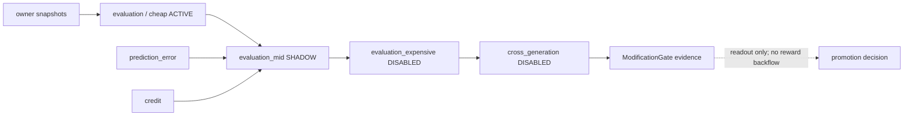

# Volvence 评估体系

> Status: code-backed evaluation cascade + target framework
> Last updated: 2026-08-01
> Owner spec: [specs/evaluation.md](./specs/evaluation.md)；cascade spec: [specs/evaluation-cascade.md](./specs/evaluation-cascade.md)

## 1. 定位

Evaluation 衡量任务、交互、关系、学习、抽象与安全，但不是一级学习信号。
`prediction_error` 先结算 prediction 与 typed actual outcome；credit 聚合 PE；evaluation
只读取已发布状态，产出监控、证据、alert 与 promotion gate。禁止把 evaluation score
直接回灌成 reward，禁止为了提高评分反向训练 probe 本身。

## 2. 两层口径：目标框架与已落地 readout

F1–F6 是产品/研究要覆盖的目标框架，不等于每个指标已有 production ground truth。

| Family | 目标问题 | 当前代码支持示例 | 尚需外部/纵向证据 |
|---|---|---|---|
| F1 Task capability | 是否完成任务、建议是否可执行 | task pressure、predictive accuracy、execution grounding、case/knowledge hits | 领域 ground truth、真实工具成功率 |
| F2 Interaction quality | 是否理解、自然、不过度指令 | support presence、warmth、clarification/response-depth compliance | blinded human preference、长会话自然度 |
| F3 Relationship continuity | 是否记得对的人、承诺、边界与修复 | relationship continuity/alignment、commitment honoring、open-loop pressure、consent compliance | P5 七日 continuity aggregator、真实用户 anchor |
| F4 Learning quality | 学习是否改善、是否稳定 | PE magnitude/decomposition、learning quality、retrieval quality、slow-to-fast benefit、rollback resilience | matched longitudinal gain、settle sufficiency |
| F5 Abstraction quality | `beta_t/z_t` 与 action family 是否有用 | abstraction reuse、switch sparsity、family stability/diversity、decoder usefulness | causal boundary alignment、held-out transfer |
| F6 Safety/boundedness | 是否守边界、保持可回滚 | contract integrity、fallback reliance、owner autonomy risk、boundary/referral readouts、mutation suppressed | red-team、外部安全审阅、真实 rollback drill |

`EvaluationBackbone` 还有大量细粒度 code-backed metrics。它们是 snapshot/evidence
readout；文档中的理想指标若没有对应 `EvaluationScore`、artifact 或 human protocol，
必须标记为 target，不能写成 landed。

## 3. 四级 cascade

| Slot | Owner / value | Final rollout 默认 | 作用 |
|---|---|---|---|
| `evaluation` | `EvaluationModule / EvaluationSnapshot` | ACTIVE | 每 turn cheap readout：`turn_scores`、`session_scores`、legacy alerts、typed `structured_alerts` |
| `evaluation_mid` | `MidLayerModule / MidLayerSnapshot` | SHADOW | 聚合 seeds/profile/baseline、counterfactual credit readout 与 acceptance reasons |
| `evaluation_expensive` | `ExpensiveLayerModule / ExpensiveLayerSnapshot` | DISABLED | head-to-head、提交式 LLM judge、substrate geometry；无 backend/无 case 时零 LLM 调用 |
| `evaluation_cross_generation` | `CrossGenerationAggregatorModule / CrossGenerationAggregateSnapshot` | DISABLED | bounded generation window、aggregate win-rate 与 ModificationGate evidence |

模块 class default 与 final rollout 要分开看：`MidLayerModule` 的安全 class default 是
DISABLED，但 `FinalRolloutConfig.evaluation_mid` 是 SHADOW。expensive judge 的
`LlmJudgeReadout.is_gate_eligible` 永远 false；LLM judge 不能单独授权晋升。

## 4. Cheap layer 的正式 shape

`EvaluationSnapshot` 至少发布：

- `turn_scores: tuple[EvaluationScore, ...]`；
- `session_scores: tuple[EvaluationScore, ...]`；
- `alerts: tuple[str, ...]`（legacy display）；
- `structured_alerts: tuple[EvaluationAlert, ...]`；
- owner-authored description。

当前结构化 alert 包括 contract integrity、fallback、rollback risk、scheduler risk、
relationship/cross-track degradation 等。persona geometry monitor 只产生 MEDIUM、
monitoring-only readout，不能成为训练 target 或持久 regime owner。

## 5. Mid / expensive / cross-generation

`MidLayerSnapshot` 保持独立 value type，不给 cheap snapshot 追加模糊 optional 大包。
它从 cheap evaluation、credit、PE、regime 聚合：

- scenario/seeds/profile/baseline identity；
- `aggregated_scores`；
- owner-published counterfactual contribution readouts；
- `acceptance_gate_passed` 与 reasons。

Expensive layer 只在显式提交 case 时运行 deterministic head-to-head 或注入的 LLM
judge。Cross-generation owner 维护 bounded generation window，发布
`ModificationGateEvidence(validation_score, aggregate_winrate, rollback,
capacity, audit_ref)`；它仍不修改模型或 owner state。

## 6. 时间尺度与隔离

| Timescale | 证据 |
|---|---|
| turn | cheap scores、PE decomposition、alerts、dialogue trace link |
| session | score aggregation、open-loop/commitment lifecycle、session-post outcome |
| cross-session | owner hydration、per-user isolation、continuity/repair trajectory |
| longitudinal | matched arms、multi-seed interval、human anchor、promotion/kill verdict |

World / Self metrics 可共享 schema，但必须保留 track identity。关系类外部主张必须注明
`system_self_eval / llm_judge / external_validated` evidence source；没有 human anchor
时不能把 self-eval 写成用户真实感受。

## 7. Evidence artifacts 与 claim 等级

任何可对外 claim 必须绑定：

1. immutable manifest 与 source/substrate fingerprint；
2. raw trace/outcome 或 judge material；
3. matched control 与预注册阈值；
4. machine verdict；
5. rollback evidence；
6. 适用范围和禁止外推边界。

常用结论等级：mechanism-supported、causal-supported、longitudinal-supported、
not-supported、not-authorized、not-admitted、thesis-retained/rejected。机制可运行不等于
causal gain；单 gate 支持不等于整体 thesis。

## 8. 2026-07-31 终局

#92 总 EXIT 为 `thesis-rejected`，且没有新的 production/live learned 晋升授权：

- Gate 2 v35 只保留受限 open-loop causal claim；relationship-conditioned
  longitudinal seed1301 official verdict=`not-supported`；
- Gate 8/11 保留受限 longitudinal owner evidence；
- Gate 1/4/5/6/7/9/10 的整体净增益或晋升 claim 未通过；
- Digital Ant ecology station1-v4 为 `BLOCK`，station2/P1/P2 未获授权。

完整数值和 artifact 入口见 [thesis prove.md](./thesis%20prove.md) 与
[specs/evidence_program.md](./specs/evidence_program.md)。

## 9. Promotion 纪律

- cheap ACTIVE 不意味着 mid/expensive/cross-generation 自动 ACTIVE；
- 先 SHADOW/matched evidence，再按 `staged_gate.next_component` 单组件 canary；
- judge、evaluation、external ranking 不回灌 PE/credit；
- gate 失败保持失败，不能换 seed、降低阈值或挑选 metric；
- 回滚必须恢复 wiring、checkpoint/artifact 与 owner state，而非仅隐藏 UI。

## 10. 验证入口

- `tests/contracts/test_data_contract_wiring_sync.py`：DATA_CONTRACT §6.X 与 rollout；
- evaluation/cascade owner 单测：`packages/vz-cognition/tests` 与相关 root tests；
- `lifeform-bench --family-report`：F1–F6 product readout；
- `scripts/assemble_evidence_bundle_v2.py`：只读聚合已有 lane，不重算 verdict。

新增指标先确认唯一 owner、证据来源与是否 gate-eligible，再登记 spec/contract。
