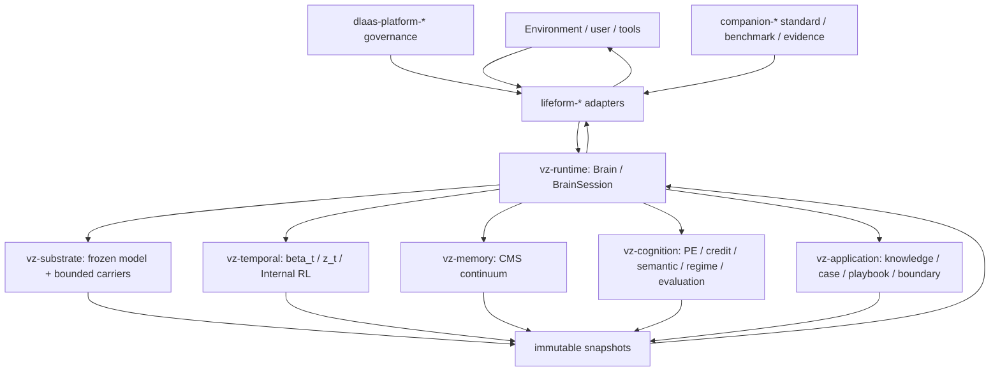
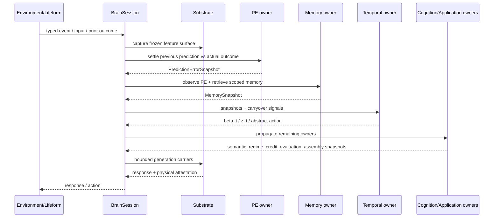
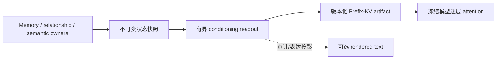

# Volvence 系统设计

> Status: current architecture overview
> Last updated: 2026-08-03
> 细粒度契约以 [DATA_CONTRACT.md](./DATA_CONTRACT.md) 和 [specs/00_INDEX.md](./specs/00_INDEX.md) 为准。

## 1. 系统是什么

Volvence 是一个融合 Nested Learning 与 Emergent Temporal Abstractions 的有界持续
适应系统。它不是“LLM + prompt + RAG”的组合：冻结/极慢更新的 substrate 负责通用
生成能力，temporal、memory、cognition 与 application owners 在不同时间尺度上发布
不可变状态，`vz-runtime` 只负责把这些状态按契约传播和装配。

产品目标是长期关系与主体性（EQ + trust）和任务能力共同演进。关系连续性不是任务
成功的副作用，evaluation 也不是 reward 的代名词。

## 2. 不可让步的设计法则

1. `prediction_error` 是一级学习信号；credit、needs、homeostasis 与 evaluation 都是
   下游聚合/readout。
2. 模块间唯一正式数据通道是不可变 snapshot；consumer 不调用 producer 内部方法，
   不重建 producer 状态。
3. World / Self 双轨语义隔离；共享基础设施不等于共享 owner。
4. `beta_t` 和 `z_t` 属于 temporal owner；长期策略学习发生在控制器代码空间，不在
   token 空间在线 RL。
5. base model 冻结或极慢更新；online-fast 适应只能经过有界控制入口。
6. rare-heavy artifact 更新必须经过 `ModificationGate`，不得绕过。
7. LLM 可以生成表达或 background-slow proposal，不能成为 PE、credit、regime、
   semantic state 或 controller 的 owner。
8. 新路径先 `SHADOW`，证据后再单组件 `ACTIVE`；`DISABLED` 和 checkpoint 是即时回滚面。

## 3. 分层架构

### 3.1 Foundation 与 substrate

- `companion-standard` 提供公开的关系表征和 canonical trajectory schema。
- `vz-contracts` 提供 `Snapshot`、`RuntimeModule`、guards、`propagate` 与跨 wheel
  frozen types。
- `vz-substrate` 拥有冻结模型、residual capture、State-KV/Prefix-KV、common adapter
  以及受控 rare-heavy delta 入口；它不做策略选择和 prompt ownership。

### 3.2 Temporal / memory / cognition

- `vz-temporal`：encoder、`beta_t` segment closure、decoder、`z_t`、Internal RL、
  SSL↔RL joint loop。
- `vz-memory`：瞬态/情景/持久/派生连续谱、CMS bands、检索、promotion/decay、
  checkpoint 与 background-slow memory consolidation。
- `vz-cognition`：PredictionError、credit、ModificationGate、dual track、regime、
  9 类语义 owner、social cognition、reflection 与 evaluation cascade。

### 3.3 Application 与 runtime

- `vz-application` 拥有 domain knowledge、case memory、strategy playbook、boundary
  policy、retrieval policy、response assembly 与 experience consolidation；vertical
  经验编译进这些 owner，不建立平行内核。
- `vz-runtime` 是唯一能组合全部 `vz-*` 业务 wheel 的层，提供稳定
  `Brain/BrainSession` facade、final wiring、session-post loop 与证据运行入口。

### 3.4 Lifeform、平台与 benchmark

- `lifeform-*` 将 kernel 适配成持续生命体：vitals、affordance、thinking、ingestion、
  expression、service、protocol/MCP、evolution、synthetic data 与 vertical。
- `dlaas-platform-*` 拥有租户、实例、API、ops 和 eval governance，不拥有 cognition。
- `companion-*` 拥有公开标准、benchmark、reference harness、CAMEL baseline、
  trajectory generation 与 encoder scaffold；benchmark readout 不回灌 kernel。

## 4. 39-wheel 现状

| Family | Count | Wheels |
|---|---:|---|
| `vz-*` | 8 | contracts, substrate, temporal, memory, cognition, application, runtime, embodiment-ant |
| `lifeform-*` | 19 | core, affordance, thinking, ingestion, expression, service, evolution, cultivation, protocol-runtime, mcp-bridge, openai-compat, synthetic-data, domain-emogpt, domain-coding, domain-character, domain-figure, domain-growth-advisor, domain-repair30, domain-digital-employee |
| `dlaas-platform-*` | 6 | contracts, registry, launcher, api, ops, eval |
| `companion-*` | 6 | standard, bench, ref-harness, camel-baseline, trajgen, encoder |

`vz-embodiment-ant` 是非语言感觉运动 substrate 试验床，不是产品 vertical。历史名字
`vz-pe-credit`、`vz-self-model`、`vz-evaluation` 不是当前 wheel；相应实现位于
`vz-cognition` 子包。

## 5. 七个产品 vertical

| Vertical | Wheel | 冷启动/产品职责 |
|---|---|---|
| Relationship companion | `lifeform-domain-emogpt` | 关系连续性、修复、长期陪伴 |
| Coding | `lifeform-domain-coding` | 结对开发与工具协作 |
| Character | `lifeform-domain-character` | reviewed fictional character package、Prefix-KV/LoRA evidence |
| Figure | `lifeform-domain-figure` | primary-source corpus、verification 与 historical figure artifact |
| Growth advisor | `lifeform-domain-growth-advisor` | 长期成长顾问的 domain package / boundary / report |
| Repair30 | `lifeform-domain-repair30` | 现场维修、安全门、部件与流程经验 |
| Digital employee | `lifeform-domain-digital-employee` | org-agent / employee-twin 的 data-only priors |

Vertical 只能经 Brain facade、contracts、application owners 与 ModificationGate 进入
脑核。禁止 `vz-*` 反向 import `lifeform-*`。

## 6. 单 turn 数据流

关键顺序不是“先评估再学习”。上一轮 prediction 与本轮 typed outcome 由 PE owner
结算；credit 聚合 PE；evaluation 观察已发布状态并执行 gate/readout。

## 7. State KV：持续向量状态的非 Prompt 原生通道

State KV 解决的首要问题不是“替 prompt 写一段更短的摘要”，而是让系统拥有一条
**不经过自然语言序列化、可直接把持续状态向量交给冻结模型读取的正式通道**。
这是 Volvence 区别于 `LLM + prompt + RAG` 的关键系统能力之一。

### 7.1 状态持续性与模型注入是两个职责

- memory、relationship 与 semantic owners 负责状态的写入、更新、衰减、身份范围和
  跨 turn 连续性；Prefix-KV 不创建第二个 memory owner，也不把 KV cache 当长期存储。
- cognition owner 只从正式上游快照编译有界向量 readout；runtime 绑定 scope、freshness、
  revocation 与 artifact identity；substrate 只负责把它变成逐层 K/V slots。
- 每轮注入的是 owner 发布的最新状态快照。因而系统的“持续记忆”来自 owner 的连续
  演化，Prefix-KV 提供这份连续状态到冻结模型的原生读取面。

### 7.2 关键增益不是文本压缩，而是保留向量状态

`rendered_statement` 是同一组 typed 坐标的可审计语言投影，只覆盖允许公开表达的
来源范围；它不是潜向量的充分统计量。连续数值的距离、方向、多维耦合、微小累积、
迟滞与轨迹几何在分档和自然语言化之后可能不可逆地丢失。将坐标数字直接打印进
prompt 也不等价：冻结模型没有该运行时坐标系的读取契约，而且会占用上下文并暴露
内部状态。

Prefix-KV 因此提供四项 prompt 路径没有的架构增益：

1. **向量原生**：状态保持连续几何，不必先退化为自然语言命题；
2. **长期连续性可达**：跨 turn 累积的关系与个人状态可以在每轮由 owner 更新后直接
   影响冻结模型，而无需用户重复叙述历史；
3. **隔离与不可覆盖**：状态不出现在用户可见 prompt 中，不能被后续文本简单覆盖或
   冒充，并受 tenant/user scope、freshness、consent 与 revocation 守门；
4. **有界且可审计**：artifact、模型指纹、norm cap、applied attestation 和
   `ACTIVE / SHADOW / DISABLED` wiring 构成可验证、可回滚的物理投递契约。

### 7.3 核心架构门已经成立

标准 Personal State KV artifact 已在 prompt-closed、decode-matched 的冻结 Qwen 上证明：

- Prefix-KV 状态臂通过行为识别与 held-out / 多 generation seed / 跨家族裁判复核；
- 同一 artifact 的 slot-attention 与线性可读出诊断均通过，证明状态被 attention
  实际读取，而不是仅携带一个不可用旁路张量；
- 五臂对照中 Prefix-KV 保留严格识别，而 pure residual 对照仍与随机相容；因此
  Prefix-KV 是当前相对 residual 更可靠、且未退化为固定 bias 的正式潜状态载体；
- 部署 binding、cold-start、错用户、过期、撤销、稳定重放与原子回滚门已冻结。

由此，State KV 的核心系统目标已经完成：**持续向量状态获得了一条非 prompt、可被
冻结模型读取、并且相对 residual 更可靠的正式输入通道。** 详细数字、artifact 与
反主张边界见
[state-kv-identification-evidence.md](./specs/state-kv-identification-evidence.md) 和
[personal-conditioning.md](./specs/personal-conditioning.md)。

### 7.4 后续效果门不反向否定核心能力

bank-gain、特定 Relationship projector 或真实结局增益回答的是“增加某个 bank 后，
当前任务与探针是否出现额外产品收益”。它们是扩展和 promotion 条件，不是 State KV
作为向量载体成立的必要条件。某个 bank 未通过独立增益或注意力门，只冻结该 bank、
projector 或默认 rollout；不能据此把已通过的非 prompt 载体、持续状态可达性和
residual 对照结论改写为失败。

同样，Prefix-KV 不替代精确事实、原话、证据或可引用经历；这些仍走 memory retrieval
与可审计上下文。State KV 承载的是关系姿态、稳定程度、边界风险、决策准备度等有界
连续状态，两条通道互补而不互相冒充。

## 8. 多时间尺度

| Timescale | 典型 owner/动作 | 边界 |
|---|---|---|
| online-fast | substrate capture、PE settlement、memory retrieval、temporal decision、semantic/regime snapshot | 不重写 base；单 turn 有界 |
| session-medium | segment credit、learned head settlement、thinking artifact、scene checkpoint | 必须可审计、可回滚 |
| background-slow | reflection、memory/policy consolidation、experience fast prior、protocol proposal | 不阻塞实时 turn；只产 proposal/readout 后由 owner apply |
| rare-heavy | adapter/State-KV/Prefix-KV、offline evaluator、promotion gate | immutable artifact + fingerprint + ModificationGate |

## 9. Snapshot、owner 与 wiring

`RuntimeModule` 用 class-level `slot_name / owner / value_type / dependencies /
default_wiring_level` 声明安全默认。`FinalRolloutConfig` 是部署 rollout override：

- `ACTIVE`：输出进入 active upstream；
- `SHADOW`：模块执行且校验，输出只在 shadow surface；
- `DISABLED`：逻辑不执行，发布 typed placeholder。

模块 class default 与 final rollout 可以有意不同，例如 `ProtocolPhaseModule` 类默认
SHADOW，而 production final wiring 已是 ACTIVE。两层差异必须写入契约，不能混写成
一个“默认”。

## 10. 当前实现与证据边界

基础 Memory/PE/Temporal owner、session-post loop、experience consolidation、hydration、
protocol runtime 等已 ACTIVE。`evaluation_mid`、decision workspace 与多类 learner 仍
SHADOW；Temporal SSL/runtime、Internal RL、CMS Torch 与 cross-generation evaluation
仍 DISABLED 或零 modulation。

2026-07-31 #92 总 EXIT 为 `thesis-rejected`。Gate 2/8/11 有局部支持，但不授权整体
learned takeover。relationship-conditioned Gate 2 longitudinal seed1301 stop-loss 与
Digital Ant ecology station1-v4 都已按冻结门终止。完整台账见
[current.md](./current.md) 和 [thesis prove.md](./thesis%20prove.md)。

## 11. 修改系统时的入口

1. 从 [specs/00_INDEX.md](./specs/00_INDEX.md) 定位 owner；
2. 查 [DATA_CONTRACT.md](./DATA_CONTRACT.md) 的 slot 与依赖；
3. 跨 wheel/架构意图再读 [archetecture.md](../archetecture.md) 与
   [next_gen_emogpt.md](./next_gen_emogpt.md)；
4. 修改 owner、consumer、spec 与直接相关测试；
5. 新路径按 SHADOW→evidence→单组件 ACTIVE，并保留 rollback。
