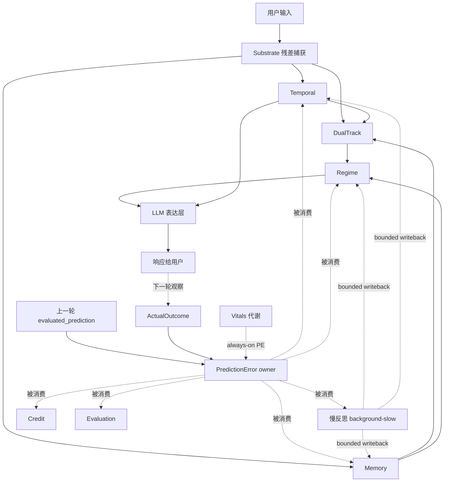

# VolvenceZero 系统全景指南

> **副标题**：一份给初学者的旅行图，给研究者的参考册
> **Status**: v1
> **Last updated**: 2026-05-01
> **位置**：`docs/SYSTEM_GUIDE.md`
> **与其他文档的关系**：
> - 想知道**为什么这样设计**（设计源头）：读 `docs/next_gen_emogpt.md`
> - 想知道**产品要做什么**：读 `docs/prd.md`
> - 想知道**架构怎么切的**：读 `docs/SYSTEM_DESIGN.md`
> - 想知道**模块间数据格式**：读 `docs/DATA_CONTRACT.md`
> - 想**改具体能力**：读 `docs/specs/00_INDEX.md` → 对应 spec
> - **本文是这堆文档的"地图与导游词"**：把跨 spec 的"为什么"和"怎么连起来"讲透。

---

## 0. 导读：怎么读这份文档（30 秒）

这份文档想同时服务两类人：

- **初学者**：你只听过"LLM"和"agent"，但没读过 NL / ETA 论文，也没读过我们的 spec。
- **深度研究者**：你想知道我们到底是怎么把 NL（Nested Learning）和 ETA（Emergent Temporal Abstractions）落地成一个真实可运行的系统，每个机制对应哪段代码。

它不是 spec，**不会**穷举每个字段；它是**导览图**，会反复回到几个核心比喻，让你即使忘了细节，也忘不了这个系统的"骨相"。

**怎么读**：

| 你的画风 | 推荐路径 |
|---|---|
| 我只想知道这个系统是干嘛的 | 读完第 1、2 部分（约 5 分钟）即可 |
| 我想看懂"它和别的 AI 系统有什么不同" | 加读第 3 部分（5 大信念）和第 10 部分（FAQ） |
| 我准备改代码 | 加读第 4、5、7 部分，然后跳到具体 spec |
| 我是研究者 / 论文复现者 | 重点读第 5（七大机制）+ 第 8、9（端到端走一遍）+ 附录 |

**读完后你应该能用一段话回答**："VolvenceZero 是一个怎样的系统？它和 ChatGPT / Agent / RAG 有什么本质区别？"

---

## 1. 表达体系：三层讲述法 + 五种符号

为了让"通俗"和"严谨"不打架，本文用一套**三层讲述法**：每个核心概念会被讲三遍，从最朴素的比喻到最严谨的工程描述，再到代码与论文锚点。

### 1.1 三层讲述

> 🌱 **常识比喻层（Beginner Lens）**
> 用一个生活里的东西做类比，让你"看见"这个机制。读完这层，你就能在饭桌上跟朋友讲清楚。

> 🔧 **工程语言层（Engineering Lens）**
> 把比喻翻译成精确的工程概念：输入是什么、输出是什么、谁拥有这个状态、什么时候触发。读完这层，你就能在代码评审里讨论它。

> 🧬 **代码与论文锚点层（Researcher Lens）**
> 给出 wheel 名、关键类名、论文章节号、对应的 R-法则编号。读完这层，你就能跳进代码或论文继续挖。

### 1.2 五种贯穿全文的符号

| 符号 | 含义 | 用途 |
|---|---|---|
| 📌 **不变量** | 这个机制必须始终满足的硬约束 | 看到 📌 就要记住"宁可不实现，也不能违反" |
| 💡 **设计原由** | 为什么这样设计而不是别的方式 | 帮助你理解第一性原理 |
| ❌ **常见误解** | 这个机制最容易被误读成什么 | 提前避坑 |
| 🔗 **连接** | 这个机制怎么跟其他机制对接 | 帮你串成系统 |
| 📍 **代码位置** | 关键 wheel / 模块 / spec 路径 | 想动手时知道去哪里 |

### 1.3 贯穿全文的三个核心比喻

我们用三个隐喻持续描述系统，避免你在读的过程中频繁切换思维框架：

1. **生物体比喻**：系统像一个**有界、活着的有机体**——它有"基底身体"（冻结的 LLM），有"自适应肌肉"（控制器），有"代谢"（vitals），有"长短期记忆"，有"睡眠时的整理"（慢反思）。
2. **公司比喻**：系统像一家**分工严密、用公文交流的公司**——每个部门（owner）独占一块业务，部门间只通过"公文"（snapshot）交流，禁止越权。
3. **指南针比喻**：系统像一个**用"惊讶"做指南针**的探索者——它不靠外部老师告诉它对错，而是不断比较"我以为会发生什么"和"实际发生了什么"，差异就是它的学习信号。

记住这三个比喻。后面所有的细节都会回到它们。

---

## 2. 一段话讲完整个系统

### 2.1 电梯短语（30 秒版本）

> VolvenceZero 是一个**有界、契约驱动、持续适应**的认知有机体。
> 它的底层是一个**冻结的预训练语言模型**（substrate），但它不只是"模型 + prompt"。
> 在 LLM 之上，我们加了**多层、多时间尺度的自适应控制器**：有的每轮更新（fast）、有的每场景更新（medium）、有的会话后才整理（slow）、有的只在离线训练时才改（rare-heavy）。
> 控制器之间不直接调用，全部通过**不可变快照**通信，像公司里的部门只用公文交流——这让系统可调试、可回滚、可一片片演进。
> 它的学习信号不是"用户喂的标签"，而是**预测错误（Prediction Error）**：系统每轮都预测"下一回合会发生什么"，然后看实际发生了什么，差异驱动所有适应。
> 它的核心产品价值不是 IQ，而是 **EQ + 信任**——所以它把"任务学习"和"关系学习"分成两条独立轨道。

### 2.2 两段话进阶版

**第一段：它是什么。**
我们想造的不是"更聪明的 ChatGPT"，而是**会随时间长大、与用户共同演化的数字生命体**。它和你接触越久，越知道你是谁、你在乎什么、你们之间的关系处在哪个阶段；同时它自己的"性格、关切、状态"也是稳定可追踪的，不是每次对话都从头开始。要做到这个，单靠 prompt engineering 或一次性微调都不行——必须有一套显式分层的、能"快慢分工"的学习架构。

**第二段：它怎么实现。**
我们融合了两个学术理论作为基础：**Nested Learning (NL)** 提供"多时间尺度的嵌套学习"作为系统级教义；**Emergent Temporal Abstractions (ETA)** 提供"在 token 之上发现并强化时间抽象动作"的具体机制。在这两条理论之上，我们加了一套自己的**工程纪律**：每个运行时区域只能有一个主人（owner），跨模块通信只能走不可变快照（R8），任何新的自适应层都必须有 owner / 退出条件 / 评估证据 / 回滚路径（R15）。这套纪律让我们能持续在系统里加东西，同时保持系统是可解释、可审计、可回滚的。

---

## 3. 五大核心信念（Why we build this way）

如果你只能记住五件事，记住这五件。它们不是技术细节，是**世界观**——所有具体设计都从它们推导出来。

### 3.1 信念一：**预测错误（PE）才是学习的原料**

> 🌱 **常识比喻**
> 想象一个孩子学骑车。他不是看着教科书学的，也不是有人给他打分（"你刚才骑得 7.3 分"）才学的。他是**摔了**才学的——他原本以为能转过去，结果摔了，"以为"和"实际"之间的差就是他更新平衡感的信号。我们的系统也是这样：所有学习的源头不是分数，是**预测落空的瞬间**。

> 🔧 **工程语言**
> 系统每一轮都会显式发布两个东西：
> - `evaluated_prediction`：我对接下来会发生什么的预测（结构化，不是文本）
> - `actual_outcome`：下一轮拿到真实情况后，我观察到的实际结果
>
> 二者结算成 `prediction_error`：一个机器可读的多维结构（任务误差 / 关系误差 / regime 误差 / 行动误差）。
> **下游所有学习模块——记忆写入、控制器更新、regime 选择、慢反思、信用分配——都直接消费这个 PE，而不是消费"评估分数"或"用户点赞"。**

> 🧬 **代码与论文锚点**
> - **R-PE**（`docs/next_gen_emogpt.md`）：PE 是原始学习信号
> - **NL §3.1**：Local Surprise Signal (LSS) = 损失对输出的梯度，是学习的本体
> - 实现位置：`packages/vz-cognition/`（`PredictionErrorModule`），公共契约 `PredictionErrorSnapshot` 在 `vz-contracts`
> - Spec：`docs/specs/prediction-error-loop.md`

> 📌 **不变量**
> - PE 是**唯一**的原始学习信号；evaluation 和 credit 都是它的**下游读数**，不是另一个学习源
> - 系统必须**显式发布** prediction chain，不能藏在某个 owner 内部偷偷算
> - 首轮 `bootstrap=True` 表示还没有上一轮可以结算，下游不能把它当真实学习证据

> ❌ **常见误解**
> "PE 就是 loss，对吧？" —— 不完全是。PE 是**结构化、跨时间窗、按维度切分**的，比单一 loss 富得多。它能告诉你"我在任务上预测准了，但在关系判断上错得离谱"——这种区分让我们能针对性地更新不同模块。

### 3.2 信念二：**系统不是"静态模型 + prompt"**

> 🌱 **常识比喻**
> 一个真正的人，不是"DNA + 此刻在想的那句话"。他还有：长期记忆、肌肉习惯、当下的情绪、对正在交谈的人的理解、他对自己角色的认知。这些都是**模型之外、但在影响行为**的层。我们的系统也必须有这些层——不能假装"调好 prompt 就行"。

> 🔧 **工程语言**
> 在 LLM（substrate）之上，我们显式构建了多层有 owner 的运行时模块：
>
> ```
> ┌─────────────────────────────────────┐
> │  慢反思（background-slow）           │ ← 会话后才更新，整理经验
> ├─────────────────────────────────────┤
> │  评估 / 信用 / 反思（PE 下游聚合）    │
> ├─────────────────────────────────────┤
> │  Regime 持久身份                     │ ← 当前的"对话模式"，可记忆可学习
> ├─────────────────────────────────────┤
> │  双轨学习（World × Self）            │ ← 任务态 vs 关系态分轨
> ├─────────────────────────────────────┤
> │  时间抽象（β_t / z_t）               │ ← "现在该执行哪种抽象动作"
> ├─────────────────────────────────────┤
> │  连续记忆（CMS 多频带）              │ ← 瞬态/情景/持久/派生
> ├─────────────────────────────────────┤
> │  Substrate（冻结 LLM + residual）   │ ← 提供语言和世界建模
> └─────────────────────────────────────┘
> ```
>
> Prompt 只是**最表层**的输入条件，**真正的学习和决策发生在中间几层**。

> 🧬 **代码与论文锚点**
> - **R2**：稳定基底 + 自适应控制器
> - **NL** 全文：模型 = 一组多频率的关联记忆，不是单层的参数堆
> - **ETA §rate-distortion**：联合训练 base + metacontroller 会退化，必须冻结 base
> - 实现位置：每一层对应一个或几个 wheel，详见第 7 节

> 📌 **不变量**
> - 在线运行期，substrate **不被默认更新**（只有显式 experimental runner 才允许）
> - 适应主要发生在控制器层、记忆写入、路由策略、反思
> - "把所有学习塞进一个端到端梯度"是反模式，违反 NL 的频率分层

### 3.3 信念三：**记忆 / 优化 / 控制不是割裂的世界**

> 🌱 **常识比喻**
> 你在背单词时，"记忆"不是一个单独的盒子。每个单词被记住的程度，受你对这门语言的总体熟悉度（更慢的层）、当前注意力（更快的层）、刚才别的单词的干扰（同层横向影响）共同决定。NL 的核心洞察是：**记忆、优化器、模型本身都是"关联记忆"，只是更新频率不同**。我们的系统借鉴这个洞察，把所有这些组件统一看待。

> 🔧 **工程语言**
> 系统里所有"会因为输入而变化的状态"都被建模为关联记忆：
>
> | 组件 | 在 NL 里被看作 | 更新频率 |
> |---|---|---|
> | LLM 权重 | 最低频的关联记忆 | rare-heavy |
> | 控制器参数（z_t 解码器等） | 中频关联记忆 | session-medium |
> | 记忆带（CMS bands） | 多频段关联记忆 | online-fast → background-slow |
> | 优化器动量 | 关联记忆 of 梯度 | per step |
> | Regime 历史效果 | 关联记忆 of regime → outcome | session-medium |
>
> 这种统一视角让我们能问一个关键问题：**这个新的"自适应"应该住在哪一频率？**——这就推导出了 R1 的多时间尺度框架。

> 🧬 **代码与论文锚点**
> - **NL §4**：CMS（Continuum Memory System）—— 多频率 MLP 链
> - **R1**：多时间尺度学习
> - 实现位置：`packages/vz-memory/`（CMS owner state），`docs/specs/multi-timescale-learning.md`

### 3.4 信念四：**行为决策应在"概念空间"，不在"逐字空间"**

> 🌱 **常识比喻**
> 你跟朋友倾诉时，朋友决定"现在该听，还是该建议"——这不是一个字一个字想出来的，是**先选模式（"听众模式"），再让嘴巴自动生成符合这个模式的句子**。如果让一个 AI 在每一个 token 上做"该选哪个词才能让对方更信任我"的决策，它会被组合爆炸淹死，也学不到任何长期策略。

> 🔧 **工程语言**
> ETA 提出的解法是引入两个低维变量：
> - `z_t`：**控制器代码**，一个低维向量（n_z ≪ n_e），代表"现在正在执行哪种抽象动作"
> - `β_t`：**切换门**，一个 [0, 1] 的标量。`β_t ≈ 0`：保持当前抽象动作；`β_t ≈ 1`：切换。
>
> 内部 RL（强化学习）发生在 `z_t` 空间，**不是 token 空间**。这意味着：
> - 动作空间从"词表大小"降到"几十维 latent"
> - 一个抽象动作对应数十甚至上百个 token，**信用分配可以按"完成一个抽象动作"为单位**做
> - 探索效率高得多——从 N(0, I) 采样一个 z 就能生成有意义的行为序列

> 🧬 **代码与论文锚点**
> - **R3 / R4**：时间抽象 + 内部控制
> - **ETA Eq.1-3**：metacontroller 架构 + 切换门 + 自监督训练目标
> - 实现位置：`packages/vz-temporal/`（Metacontroller、Internal RL）
> - Spec：`docs/specs/temporal-abstraction.md`

> 📌 **不变量**
> - 抽象动作不能由"if 关键词 then mode"这种硬编码规则驱动；它们必须从数据中**涌现**
> - 切换的稀疏性（β_t 学到准二值）是健康指标，不是手调阈值
> - 内部 RL 必须在 latent 空间做，对 token 做 RL（如直接 GRPO）会失败

### 3.5 信念五：**关系学习与任务学习是两条独立的轨道**

> 🌱 **常识比喻**
> 一个咨询师朋友帮你分析职业问题，他做了两件事：（1）帮你想清楚要不要换工作（任务）；（2）让你觉得被理解、被支持，你们的关系更亲密了（关系）。这两件事用的是同一张嘴，但**学习信号完全不同**：他不会因为"分析得对"就觉得你们关系一定变好，也不会因为"你哭着抱了他"就觉得分析对了。

> 🔧 **工程语言**
> 系统有两条独立的轨道：
>
> | 维度 | World/Task Track | Self/Relationship Track |
> |---|---|---|
> | 观测 | 残差流中的任务相关激活 | 残差流中的关系状态激活 |
> | 控制器代码 | `z_task` | `z_rel` |
> | 奖励 | 任务完成、问题解决质量 | 信任修复、陪伴质量、关系连续性 |
> | 评估族 | F1（任务能力） | F2（交互质量）+ F3（关系连续性） |
> | Owner | `world_temporal` | `self_temporal` |
>
> 它们共享 substrate 和大部分基础设施，但**记忆写入、信用分配、控制器更新、评估指标按轨道隔离**。

> 🧬 **代码与论文锚点**
> - **R7**：自我/关系学习与任务学习分离
> - 实现位置：`packages/vz-cognition/`（DualTrackModule + 两个 temporal owner）
> - Spec：`docs/specs/dual-track-learning.md`

> ❌ **常见误解**
> "这不就是两套 prompt 吗？" —— 不是。两条轨道有**独立的预测误差流、独立的信用账本、独立的控制器更新**。让一个用户哭着说"谢谢你"不会自动让任务模型觉得"我刚才的建议对了"——这是关系信号，不是任务信号。

---

## 4. 系统骨架：四层 + 一脉

讲完信念，现在看骨架。系统有**四层结构** + **一条贯穿四层的脉**。

### 4.1 四层结构（从冷到热）

```
┌─────────────────────────────────────────────────────────────────┐
│  Layer 4 — 数字生命体层（Lifeform Layer, lifeform-*）              │
│  Tick / Scene / Followup / Vitals(代谢)                           │
│  这一层让系统"活着"——它有代谢、有沉默、有主动行为                    │
└─────────────────────────────────────────────────────────────────┘
                              ▲
                              │  通过 Brain / BrainSession 接入
                              │
┌─────────────────────────────────────────────────────────────────┐
│  Layer 3 — 自适应控制器与记忆层（vz-temporal, vz-memory, vz-cognition）│
│  Metacontroller / CMS / DualTrack / Regime / Reflection         │
│  这一层"学习"——它在与世界打交道中持续调整自己                       │
└─────────────────────────────────────────────────────────────────┘
                              ▲
                              │
┌─────────────────────────────────────────────────────────────────┐
│  Layer 2 — 契约式运行时（vz-contracts, vz-runtime）                │
│  Snapshot / RuntimeModule / Orchestrator / Guards                │
│  这一层"组织一切"——它定义了模块怎么注册、怎么通信、怎么调度          │
└─────────────────────────────────────────────────────────────────┘
                              ▲
                              │
┌─────────────────────────────────────────────────────────────────┐
│  Layer 1 — 稳定基底（vz-substrate）                                │
│  冻结的 LLM + 残差流捕获 + 有界 adapter-delta 入口                  │
│  这一层"提供原始能力"——语言、世界知识、潜在表示                       │
└─────────────────────────────────────────────────────────────────┘
```

**关键认知**：
- **Layer 1（substrate）几乎不动**：默认冻结，因为 ETA 的 rate-distortion 分析证明，它一动，时间抽象就学不到。
- **Layer 2 是"操作系统"**：它不做业务，只提供基础设施（snapshot 通信、依赖排序、守卫）。
- **Layer 3 是"大脑皮层"**：所有认知模块在这里。
- **Layer 4 是"身体与生命周期"**：让系统不只是 turn-driven 的助手，而是 always-on 的生命体。

### 4.2 一条脉：PE 主链贯穿四层

四层听起来很整齐，但如果没有一条信号把它们串起来，就是四个孤岛。这条脉就是 **Prediction Error 主链**：

```
                   每轮（per turn）
                         │
   ┌─────────────────────▼─────────────────────┐
   │ 1. 上一轮发布的 evaluated_prediction         │
   │ 2. 这一轮 substrate 捕获到 actual_outcome   │
   │ 3. PE owner 结算 → prediction_error 快照    │
   └─────────────────────┬─────────────────────┘
                         │ 发布到公共 slot
                         ▼
        ┌────────────────┴────────────────┐
        │   每个下游 owner 直接消费 PE    │
        ▼                                 ▼
  - memory: 调整写入与 promotion   - regime: 更新 historical effectiveness
  - temporal: 调节 z_t 训练目标    - reflection: 触发慢反思
  - credit: 聚合成层级信用记录      - evaluation: 把 PE 作为结构化 readout
                         │
                         ▼
              4. 当轮发布 next_prediction
                         │
            （等待下一轮再次结算 → 形成闭环）
```

**这条脉的意义**：它让"学习"不再是某个特殊模块的私事，而是**整个系统共享的一手原料**。每个模块自己决定"我从这条 PE 信号里读出什么、改我自己的什么参数"——这就是 NL 所说的"分布式关联记忆"在工程上的落地。

### 4.3 整体数据流（一张图）



> 💡 **设计原由**：注意 Reflection 的写回是**虚线**——它不在 turn 内同步发生，而是会话结束后异步执行；这保证了实时延迟不被慢反思阻塞。Vitals 也是虚线——它在两个 turn 之间持续 tick，让系统在沉默中也有 PE。

---

## 5. 七个核心机制详解

现在进入正餐。每个机制都用三层讲述法 + 五种符号。

### 5.1 机制一：Prediction Error 主链

#### 🌱 常识比喻

回到学骑车的孩子。每一次他骑出去，脑子里会有一个"我以为接下来车会怎么走"的预期；车实际怎么走是反馈。差异越大，他下次的肌肉控制调整越大。久了之后，他不光学会平衡感（任务），他还学会了"我现在能不能稳住"的元认知（关系/自我）。

#### 🔧 工程语言

PE 是系统的**唯一原始学习信号**。它不是日志，不是诊断信息，是一个一等公民的 runtime owner。

**输入**（PE owner 消费的快照）：
- `substrate`：当轮 semantic feature surface
- `evaluation`：family-level readout，辅助构造 next prediction
- `dual_track`：world/self tension
- `regime`：当前 regime 状态

**输出**（`PredictionErrorSnapshot`）：

```
evaluated_prediction  ← 上一轮发的预测，本轮结算
actual_outcome        ← 本轮观察到的真实情况
next_prediction       ← 本轮新发的预测，下一轮再结算
error                 ← 本轮的 PE
turn_index, bootstrap
```

**`error` 的四个固定维度**：
- `task_error`：任务上的预测误差
- `relationship_error`：关系判断上的预测误差
- `regime_error`：regime 选择是否符合预期
- `action_error`：行动是否产生了预期的下游效应

**两个聚合读数**（owner-side calibrated）：
- `magnitude`：综合幅度，结合预测置信度
- `signed_reward`：带符号的奖励信号（正向/负向）

#### 🧬 代码与论文锚点

- **R-PE**：`docs/next_gen_emogpt.md` Part 2
- **NL §3.1**：LSS 是学习的本体
- **ETA**：delayed outcome 是抽象动作信用分配的基础
- 实现：`packages/vz-cognition/` 内的 `PredictionErrorModule`
- 契约：`vz-contracts` 的 `PredictionErrorSnapshot`
- Spec：`docs/specs/prediction-error-loop.md`
- 数据契约：`docs/DATA_CONTRACT.md` 3.9 节

#### 📌 不变量

1. PE 是原始信号；evaluation / credit 是 PE 的下游 readout，**不能反向**当作学习源
2. 必须有显式的 prediction chain owner，不能让多个 consumer 各自重建 outcome mismatch
3. `bootstrap=True` 时下游不能把它当真实学习证据（首轮没有可结算的上一轮）
4. PE 必须是**机器可读的多维结构**，不能只剩一段文本描述

#### ❌ 常见误解

- "PE 就是 reward" —— PE 是结构化向量，reward 只是 `signed_reward` 这一个标量读数。
- "PE 是用户给的反馈" —— 不，PE 是系统**自己**对"上一轮预测 vs 本轮观察"的结算。用户的反馈只是 `actual_outcome` 的一部分输入。
- "PE 越高越坏" —— 不一定。高 PE 意味着学习机会大；持续高 PE 才是问题（说明系统适应不了）。

#### 🔗 连接

PE 是**所有其他机制的源头**：memory 用它调整写入、temporal 用它训练 z_t、regime 用它更新历史效果、reflection 用它触发整理。没有 PE，整个系统会退化成"读 prompt → 调 LLM → 输出"的无记忆助手。

---

### 5.2 机制二：多时间尺度学习

#### 🌱 常识比喻

一个人有四种节奏的学习：
- **每秒**：我手在哪、我在打字 → 工作记忆，瞬间就更新
- **每天**：今天发生了什么、跟谁说了什么 → 情景记忆，睡觉时整理
- **每月**：最近这段时间我变成了什么样的人 → 半永久身份调整
- **每几年**：根本性的世界观重构 → 极慢的，不轻易动

如果你只用"每秒"层学一切（比如把所有经验都塞进 working memory），你会爆炸；如果你只用"每月"层学一切（比如想从昨天的经历总结出"我应该改名字"），你会把噪音误当信号。**不同的知识住在不同的频率**。

#### 🔧 工程语言

系统强制四个时间尺度的学习循环：

| 时间尺度 | 频率 | 谁住在这里 | 算法对应 |
|---|---|---|---|
| `online-fast` | 每 turn / 每 wave | 控制器层参数微调、记忆写入、瞬态状态 | NL CMS 高频层 |
| `session-medium` | 每场景 / 每会话 | 中频层聚合、regime selection 权重 | NL CMS 中频层 |
| `background-slow` | 会话后 | 慢反思整合、durable 记忆沉淀 | NL CMS 低频层 + ETA SSL |
| `rare-heavy` | 离线 | 基底相关 artifact 训练、policy refresh | 离线训练管线（不在运行时） |

**关键设计原则**：
- **快的不能等慢的**：用户输入 → 响应这条路径上不能有任何 background-slow 工作（否则用户感知延迟）
- **慢的不能干扰快的**：慢反思的写回必须经过 owner-side bounded apply，并有 checkpoint / rollback
- **不同时间尺度 = 不同 owner**：禁止一个 owner 同时持有 fast 和 slow 状态混在一起

#### 🧬 代码与论文锚点

- **R1**：多时间尺度学习
- **R13**：训练循环必须交替"压缩"（SSL）和"强化"（RL）
- **NL §4 CMS**：多频率 MLP 链 + 知识反流
- 实现：分布在多个 wheel——`vz-memory`（CMS）、`vz-temporal`（控制器）、`vz-cognition`（reflection）
- Spec：`docs/specs/multi-timescale-learning.md`

#### 📌 不变量

1. **快速适应不需要重写整个模型**：在线学习只动控制器层 + 有界 adapter delta，不动 substrate
2. **慢反思不阻塞实时交互**：必须异步，必须可降级
3. **强化作用于压缩后的结构**：RL 不在原始行为上做，而是在 SSL 压缩后的 latent / regime 上做（R13）

#### 💡 设计原由

NL 论文证明：把所有学习塞进一个频率（如端到端梯度），系统会陷入两难——要么遗忘旧知识，要么学不动新知识。**让不同知识住在不同频率**是出路。CMS 的"知识反流"机制（slow → fast init）是抗遗忘的关键。

---

### 5.3 机制三：时间抽象与内部控制（β_t / z_t）

这是整个系统**最不同于普通 LLM 应用**的地方，也是 ETA 论文的核心贡献。

#### 🌱 常识比喻

想象一个客服。她每次接到电话不会逐字想"我下一个词说什么才能让客户满意"——那是组合爆炸。她会先选一个**模式**：现在该是"安抚模式"，还是"问题诊断模式"，还是"上报升级模式"？选定模式后，嘴巴自动按这个模式说话。**她真正在大脑里做决策的，是模式选择，不是逐字选择**。

我们的系统也是这样。**真正的"决策"发生在一个低维的潜在空间**（z_t），LLM 只负责把这个潜在状态翻译成自然语言。

#### 🔧 工程语言

**Metacontroller** 架构：

```
残差流 e_{1:T}（来自冻结的 LLM）
        │
        ├──→ 内部序列嵌入器 → s(e_{1:T})  [训练时非因果]
        │
        ├──→ 编码器 (GRU) → μ_t, Σ_t → z̃_t ~ N(μ_t, Σ_t)
        │       │
        │       └──→ 切换单元 → β_t ∈ [0, 1]
        │              │
        │              └──→ z_t = β_t ⊙ z̃_t + (1-β_t) ⊙ z_{t-1}
        │
        └──→ 解码器 (FFN) → U_t = Decoder(z_t)
                │
                └──→ 残差流控制：e_{t,l} ← e_{t,l} + U_t · e_{t,l}
```

**两个低维变量**：
- `z_t`：当前抽象动作的"代码"，低维（n_z ≪ n_e）
- `β_t`：切换门，决定"保持当前动作还是换一个"

**两阶段训练（不可跳过）**：
- **Stage 1（SSL）**：训练**非因果**编码器，目标 `L = -ln p(a_t | o, z) + α · D_KL(N(μ,Σ) || N(0,I))`。变分瓶颈 `α` 驱动稀疏切换。
- **Stage 2（Internal RL）**：把非因果编码器替换成**因果**策略 `π(z_t | e_{1:t})`，冻结其他一切，用 RL 训练。**动作空间是 `z_t`，不是 token**。

**为什么必须两阶段**：
- 阶段 1 让系统**发现结构**（哪些是"该作为一个单元的抽象动作"）
- 阶段 2 让系统**强化策略**（在已发现的结构上学怎么选）
- 混着训练 → 退化解，结构不出现

#### 🧬 代码与论文锚点

- **R3 / R4**：时间抽象 + 内部控制
- **ETA Eq.1-3** + 附录 B.3 / B.5
- 实现：`packages/vz-temporal/`（Metacontroller、CausalZPolicy、Internal RL 训练）
- Spec：`docs/specs/temporal-abstraction.md`

#### 📌 不变量

1. **冻结 substrate 是发现时间抽象的前提**（ETA rate-distortion 证明）
2. **β_t 的稀疏性必须涌现**，不能手调阈值
3. **Internal RL 必须在 z 空间做**，不能在 token 空间做
4. **抽象动作不能由关键词触发**（违反 R3 的"涌现"本质）

#### ❌ 常见误解

- "z_t 不就是 prompt 选择吗？" —— 不是。z_t 是**连续的低维向量**，由学习到的策略产生；prompt 模板是离散的人写的字符串。
- "为什么不直接微调 LLM？" —— 因为 ETA 证明了：联合训练 LLM + metacontroller 会让 LLM 把时间结构"吸收"掉，metacontroller 学不到任何东西。冻结 LLM 才能逼出时间抽象。

#### 🔗 连接

z_t 和 β_t 不是孤立存在的——它们对接：
- **regime**：z_t 的语义等价物是"当前 regime"
- **dual_track**：z_t 分裂成 z_task 和 z_rel
- **memory**：CMS 可以增强 metacontroller（用多频带替代 GRU 编码器）
- **PE**：PE 是 Internal RL 的奖励信号

---

### 5.4 机制四：双轨学习（World × Self）

#### 🌱 常识比喻

回到那个咨询师朋友：他帮你分析职业（任务）和让你感到被支持（关系）是两种学习。如果他只用"用户感谢的多 = 我做对了"作单一信号，他会变成奉承型助理；如果他只用"问题被解决 = 我做对了"作单一信号，他会变成冷冰冰的工具人。**两种学习要分账，但用同一张嘴**。

#### 🔧 工程语言

| 维度 | World/Task Track | Self/Relationship Track |
|---|---|---|
| 观测 | 残差流的任务相关 semantic features | 残差流的关系状态 features |
| 控制器代码 | `z_task` | `z_rel` |
| 控制器 owner | `world_temporal` | `self_temporal` |
| 奖励 | task completion、problem clarity | trust repair、bond continuity |
| 评估族 | F1 | F2 + F3 |
| 信用账本 | 独立 | 独立 |
| 共享 | substrate、memory infra、orchestration |

**Aggregate bridge**：除了两个独立的 owner，还发布一个 `temporal_abstraction` 聚合 slot，给还没切到分轨消费的下游用——这是 R15 渐进迁移原则的体现。

#### 🧬 代码与论文锚点

- **R7**：自我/关系学习与任务学习分离
- **NL × ETA 附录 C.4**：双轨 Internal RL
- 实现：`packages/vz-cognition/`（DualTrackModule）+ 两个 temporal owner
- Spec：`docs/specs/dual-track-learning.md`

#### 📌 不变量

1. 两轨**共享基础设施**，但**记忆写入、信用、控制器、评估按轨道分**
2. 关系连续性**不是**问题解决的副作用
3. 不能让"用户哭着说谢谢"自动给 task track 加正向信号

#### ❌ 常见误解

- "为什么不一条轨道学完？" —— 因为关系信号和任务信号的时间尺度、稀疏度、噪声分布完全不同。混在一起 → 互相污染。
- "这是两个 LLM 吗？" —— 不是。共享一个 substrate，分裂只发生在控制器和信用层。

---

### 5.5 机制五：连续记忆系统（CMS）

#### 🌱 常识比喻

你的记忆不是"硬盘 + 内存"两层，而是**连续光谱**：感觉性记忆（毫秒）→ 工作记忆（秒）→ 短期情景（小时-天）→ 长期情景（年）→ 语义知识（终生稳定）→ 程序性技能（更稳定）。每一层有自己的更新节奏、容量、遗忘曲线。当你忘了某件事的细节，你能从更慢的层"重建"出概要——这是 CMS 的核心。

#### 🔧 工程语言

CMS（Continuum Memory System）实现：一条多频率 MLP 链。

```
y_t = MLP^(K) ( MLP^(K-1) ( ... MLP^(1) (x_t) ) )

第 i 层 MLP 的参数每 c^(i) 步更新一次。
c^(1) < c^(2) < ... < c^(K)（频率从高到低）
```

**记忆层级（兼容摘要 + 连续谱）**：

| 兼容三带摘要 | 连续谱 (`continuum_profile`) |
|---|---|
| `online_fast` | bands[0..n], 高频带 |
| `session_medium` | 中频带 |
| `background_slow` | 低频带 |

`continuum_profile` 还包含：
- `bands[*]`：每个带的更新频率、持久性偏置、检索权重、pending signal
- `reconstruction_edges`：跨层恢复路径（slow→fast reset、meta-init、associative readout）
- `readout_band_id`：当前对外读出哪一带

**记忆操作**：
- **写入**：仅通过 `MemoryModule` 这个唯一 owner
- **提升**：低频层从高频层提取持久知识
- **衰减**：有限容量迫使遗忘
- **重建**：遗忘后从低频层回流到高频层（抗遗忘）

#### 🧬 代码与论文锚点

- **R5 / R6**：记忆连续谱 + 反思
- **NL §A.5 CMS**
- 实现：`packages/vz-memory/`（MemoryModule，唯一 owner）
- Spec：`docs/specs/continuum-memory.md`

#### 📌 不变量

1. `MemoryModule` 是**唯一** memory owner；更强的 NL-style memory 只能作为 owner 内部 tower 演进，**不能新增第二个 memory owner**
2. query / learned core / artifact retrieval 必须走**同一条 owner-side memory signal contract**
3. 记忆写入必须通过正式 owner 和 API，禁止绕过

---

### 5.6 机制六：慢反思（Background Slow Loop）

#### 🌱 常识比喻

人为什么要睡觉？神经科学告诉我们：睡眠（尤其是 REM）是大脑在**整理白天经验**——把短期记忆压缩、提炼出"教训"、调整长期偏好。如果一个 AI 系统只会在用户说话时反应，它永远学不到"我跟这个用户在过去三个月里关系是怎么演化的"——它需要一个**离线的整理时间**。

#### 🔧 工程语言

慢反思是**会话后异步执行**的整理过程：
- 读：交互轨迹、决策、结果、张力、PE 历史
- 写：bounded writeback 到 memory / regime / temporal owner

**两类产物**：
- **记忆沉淀**：持久卡片、信念、开放循环、偏好轨迹 → 写入 durable memory
- **策略沉淀**：抽象控制器更新、路径先验、regime 偏好 → 写入控制器参数

**当前实现**（截至 2026-04-29）：
- 默认主路径已切到 **session-post slow loop**：turn 内的 final wiring 只产出 deferred slow-writeback request；真正的 consolidation 在 context/session 边界后排队执行
- 写回受 **三重 gate** 约束：`writeback_mode` + credit evidence + evolution judgement
- 所有 writeback 通过 owner-side apply surface，**不绕过 owner**

#### 🧬 代码与论文锚点

- **R6**：反思与沉淀
- **NL CMS 低频层** + **ETA SSL 阶段**
- 实现：`packages/vz-cognition/`（ReflectionEngine + SlowLoop）
- Spec：包含在 `docs/specs/continuum-memory.md` 与 `docs/specs/multi-timescale-learning.md`

#### 📌 不变量

1. **不阻塞 turn 延迟**：必须异步
2. **必须 bounded**：每次 writeback 大小、范围、频率有上限
3. **必须可回滚**：owner 提供 checkpoint / rollback surface

---

### 5.7 机制七：契约式运行时（Snapshot-First）

这是让所有上面机制能**共存、可调试、可演进**的工程脚手架。

#### 🌱 常识比喻

想象一家大公司，部门之间靠两种方式合作：
- **方式 A（坏）**：开发部直接打电话给财务部："喂，把上个月的账给我看看，再帮我改一下"。财务部不爽。
- **方式 B（好）**：开发部给财务部一份"申请单"（公文），财务部按规定流程处理，处理完发一份"回执"（snapshot）。所有人事后都能查这份公文和回执。

我们的系统强制**只用方式 B**：模块之间禁止直接调用对方方法，只能读对方发布的不可变 snapshot。这看似繁琐，但带来：可调试、可审计、可回滚、可独立演进。

#### 🔧 工程语言

**核心契约**：

```python
@dataclass(frozen=True)
class Snapshot:
    slot_name: str          # 全局唯一
    owner: str              # 唯一所有者
    version: int            # 单调递增
    timestamp_ms: int
    value: Any              # frozen dataclass
```

```python
class WiringLevel(str, Enum):
    DISABLED = "disabled"  # 发布 placeholder stub
    SHADOW   = "shadow"    # 执行+校验，不进正式 upstream
    ACTIVE   = "active"    # 正式数据流
```

```python
class RuntimeModule(ABC, Generic[ValueT]):
    slot_name: ClassVar[str]
    owner: ClassVar[str]
    value_type: ClassVar[type[Any]]
    dependencies: ClassVar[tuple[str, ...]] = ()
    default_wiring_level: ClassVar[WiringLevel] = WiringLevel.ACTIVE

    async def process(self, upstream: Mapping[str, Snapshot[Any]]) -> Snapshot[ValueT]: ...
```

**编排器**（Orchestrator）：
- Wave 级调度
- 按 `dependencies` 拓扑排序（`auto_sort=True`）
- 通过 `propagate(...)` 收集快照、构建 guarded upstream view
- 不调用模块的私有方法

**五个守卫**：
- `OwnershipGuard`：slot → owner 唯一性、版本单调
- `DependencyGuard`：模块只能消费声明的 upstream
- `SchemaGuard`：发布值必须符合声明 schema
- `ImmutabilityGuard`：发布后消费前 value hash 不变
- `UpstreamView`：缺失 slot 统一返回 placeholder

#### 🧬 代码与论文锚点

- **R8 / R11 / R15**：snapshot-first / 内部状态可发布 / 可回滚演进
- 实现：`packages/vz-contracts/`（Snapshot、RuntimeModule、Guards）+ `packages/vz-runtime/`（Orchestrator）
- Spec：`docs/specs/contract-runtime.md`
- 数据契约：`docs/DATA_CONTRACT.md`

#### 📌 不变量（最重要！）

1. **每个运行时区域有唯一主 owner**，跨模块通信只能通过快照
2. **快照不可变**：frozen dataclass，禁止 deepcopy，用 `dataclasses.replace()` 结构共享
3. **消费者不能重建生产者内部状态**（违反 R8 的常见路径）
4. **格式变更只改一处**：模块自己生成自己的描述/总结，消费者只读
5. **不能 `hasattr` / `try except pass` 吞错**：契约违反必须 fail loudly

#### ❌ 常见误解

- "不可变快照不就是 deepcopy 吗？" —— **绝对不是**。我们禁止 deepcopy，要求用 `dataclasses.replace()` 实现结构共享，这样既不可变又零拷贝开销。
- "为什么不直接调方法？" —— 因为直接调方法 = 隐式持有别人的状态。一旦那边改格式，你这边就得改。Snapshot 解耦了双方，让双方可以独立演进。
- "WiringLevel 三态有什么用？" —— `SHADOW` 是关键：新模块上线时先 SHADOW（只校验不影响），稳定后才 ACTIVE，有问题立刻 DISABLED。这是 R15 可回滚演进的核心机械。

#### 🔗 连接

契约式运行时是**所有其他机制的载体**。没有它，PE / 多时间尺度 / 双轨 / CMS 都没法干净地共存——它们会变成一坨互相调用的逻辑。

---

## 6. 数字生命体层（Lifeform Layer）

到这里我们讲完了**内核**（vz-* wheels）。但内核只能响应 turn——用户不说话，系统就不动。这不像"生命体"，更像"助手"。

数字生命体层（lifeform-*）让系统**活起来**：它有代谢（vitals）、有沉默中的内省（tick）、有主动行为（followup），有跨 vertical 的复用（domain experience package）。

### 6.1 为什么需要这一层

> 🌱 **常识比喻**
> 一个真正的伴侣不会"你不说话他就不存在"。他会在沉默中想念你、担心你、有自己的状态变化。如果你三天没找他，他可能会主动问候你。这不是"打扰"，这是"在乎"——一种来自内部代谢压力的自然表达。

> 🔧 **工程语言**
> 内核只产生 per-turn PE。**两个 turn 之间发生了什么？什么都没发生**——这就是"turn-driven assistant"和"always-on organism"的根本差异。Lifeform 层填补这个空白：通过 vitals（代谢），系统在沉默中也有 PE 信号产生，进而可以主动触发 followup。

### 6.2 Vitals：让生命体在沉默中也有 PE

> 🌱 **常识比喻**
> 你的身体里有几个"指针"：饥饿、口渴、疲劳……每个指针有一个"舒适区间"（homeostatic band），漂出区间就是"压力"。压力推动行为：你饿了会去找吃的。系统的 vitals 一模一样：每个 drive 是一个指针，漂出 band 的程度 = 慢尺度 PE。

> 🔧 **工程语言**

```python
DriveSpec(
    name: str,
    target: float,                                 # 理想水平 [0, 1]
    homeostatic_band: tuple[float, float],         # 舒适区间
    decay_per_tick: float,                         # SYSTEM tick 时衰减
    pe_weight: float,                              # 对总慢尺度 PE 的贡献
    initial_level: float = 0.5,
    recharge_per_turn: float = 0.0,                # 用户 turn 时充能
    recharge_per_regime: dict[str, float] = {},    # regime-specific 充能
)
```

**关键设计**：
- **In-band → 贡献 0**：homeostasis 是静默的，只有漂出才说话
- **衰减只在 SYSTEM tick**：ENERGY / CONTEXT tick 只推进 tick_index，不消耗
- **Cooldown 由 owner 强制**：避免主动 followup 洪泛

**两个 vertical 的实例**：

| Vertical | Drive 1 | Drive 2 | Drive 3 |
|---|---|---|---|
| `lifeform-domain-emogpt`（关系陪伴） | bond_warmth | user_engagement | conversation_continuity |
| `lifeform-domain-coding`（工程结对） | solution_clarity | code_freshness | direction_certainty（探索时**负向充能**） |

`direction_certainty` 在 `guided_exploration` regime 下用**负向 recharge**——这证明了 drive 层可以编码"探索期间确定性应该被消耗"这种非单调激励。

#### 🧬 代码与论文锚点

- **R-PE / R1 / R8 / R11 / R14**
- 实现：`packages/lifeform-core/`（VitalsModule，唯一 drive owner）
- Spec：`docs/specs/lifeform-vitals.md`

#### 📌 不变量

1. `VitalsModule` 是 drive level 的**唯一 owner**；消费者只读 `VitalsSnapshot`
2. 漂出 band 的 deviation 即慢尺度 PE
3. 衰减只在 SYSTEM tick
4. 主动 followup 受 owner 内部 cooldown 控制，永不洪泛

### 6.3 Regime：稳定身份不是 prompt 标签

> 🌱 **常识比喻**
> 你跟同一个朋友的对话有不同"模式"：有时是闲聊模式、有时是吐槽模式、有时是深聊模式、有时是修复模式（吵完架后）。这些模式不是你"假装"的——是你们关系的**持久内部状态**。它会被记住、被影响、被学习。

> 🔧 **工程语言**
>
> Regime 是运行时**第一类公民**：
> - 可记忆（写入 memory）
> - 可选择（高层控制）
> - 可训练（通过 delayed outcome RL）
>
> 当前默认 vertical 提供的 regime 集合：casual_social / acquaintance_building / emotional_support / guided_exploration / problem_solving / repair_and_de_escalation。

> 📌 **不变量**：Regime **不是 prompt 标签**。它有自己的 owner（`regime`），有自己的状态（historical effectiveness、stability、selection weights），并且通过 PE 学习。

#### 🧬 代码与论文锚点

- **R14**
- 实现：`packages/vz-cognition/` 内的 `RegimeModule`
- Spec：`docs/specs/cognitive-regime.md`

### 6.4 Vertical：同一个内核，不同物种

> 🌱 **常识比喻**
> 同样是哺乳动物（共享大脑结构），狗和人在乎的东西完全不同——狗在乎狩猎、领地、群体地位；人在乎工作、关系、意义。它们不是不同的大脑，是**不同的 drive 集合 + 不同的经验包**塑造的不同物种。

> 🔧 **工程语言**
> 一个 vertical 由三件事组成：
> - **VitalsBootstrap**：这只生命体在乎什么（drives）
> - **DomainExperiencePackage**：冷启动的领域经验
> - **scenarios**：用于训练和评估的场景包
>
> 当前两个 vertical：
> - `lifeform-domain-emogpt`：关系陪伴 archetype
> - `lifeform-domain-coding`：工程结对 archetype
>
> 它们在**同一个 Python 进程**里共存，drive 集合互不重叠，service 注册表自动发现——内核对加载了哪个 vertical 完全无感知。这就是 `SPLIT.md` 触发条件 ② 的现场证据。

#### 📌 不变量

1. Vertical 不是新的 owner——它是**对现有 owner 的配置**
2. 内核（`vz-*`）不能反向 import vertical（`lifeform-*`）；CI 强制
3. 不能用人口学关键词（"用户说了 X 就触发 Y"）硬编码行为

---

## 7. 实现细节地图

### 7.1 仓库结构（13 个 wheel）

```
VolvenceZero/
├── packages/
│   ├── vz-contracts/           [Layer 2] R8/R15 — 所有 wheel 的依赖底
│   ├── vz-substrate/           [Layer 1] R2 — 冻结 LLM + residual capture
│   ├── vz-temporal/            [Layer 3] R3/R4 — Metacontroller + Internal RL
│   ├── vz-memory/              [Layer 3] R5/R6 — CMS + ReflectionEngine
│   ├── vz-cognition/           [Layer 3] R7/R-PE/R9/R10/R12/R14 —
│   │                                     PredictionError + DualTrack + Regime
│   │                                     + Credit + Evaluation + ModificationGate
│   ├── vz-runtime/             [Layer 2] — 编排器（薄）
│   ├── vz-application/         [Layer 3] — 4 阶段应用层（retrieval / case_memory /
│   │                                     strategy_playbook / experience_consolidation）
│   │
│   ├── lifeform-core/          [Layer 4] — Lifeform / Tick / Scene / Followup / Vitals
│   ├── lifeform-thinking/      [Layer 4] — 中频 ThinkingScheduler + 三类 read-only worker
│   ├── lifeform-affordance/    [Layer 4] — 4 Kind 描述符 + 4 渲染器（Phase 2）
│   ├── lifeform-ingestion/     [Layer 4] — book / web / task_result 三类 source adapter
│   ├── lifeform-expression/    [Layer 4] — 表达层（PromptPlanner、ResponseSynthesizer）
│   ├── lifeform-service/       [Layer 4] — aiohttp + vertical registry
│   ├── lifeform-evolution/     [Layer 4] — scripted benchmark + super-loop + R12 family report
│   ├── lifeform-domain-emogpt/   [Vertical] — 关系陪伴
│   ├── lifeform-domain-coding/   [Vertical] — 工程结对
│   └── lifeform-domain-character/[Vertical] — 小说人物 bootstrap
│
├── docs/                       — 见 docs/specs/00_INDEX.md
└── tests/                      — 多层测试
```

### 7.2 关键 Slot 速览

| Slot | Owner wheel | 关键内容 |
|---|---|---|
| `substrate` | vz-substrate | feature_surface、可选 token_logits、可选 residual_activations |
| `prediction_error` | vz-cognition | evaluated_prediction / actual_outcome / next_prediction / error 4 维 |
| `memory` | vz-memory | retrieval、CMS bands、continuum_profile |
| `world_temporal` / `self_temporal` | vz-temporal | 双轨控制器状态 |
| `temporal_abstraction` | vz-temporal | aggregate bridge slot |
| `dual_track` | vz-cognition | World/Self track state、cross-track tension |
| `regime` | vz-cognition | active regime、historical_effectiveness |
| `credit` | vz-cognition | 层级信用账本 |
| `evaluation` | vz-cognition | 6 族评估 readout |
| `reflection` | vz-cognition | 慢反思产物 |
| `vitals` | lifeform-core | drive levels、above_proactive_threshold |
| `case_memory` / `strategy_playbook` / ... | vz-application | 应用层 4 阶段 |

完整 schema 见 `docs/DATA_CONTRACT.md`。

### 7.3 入口与 facade

| 想做什么 | 用什么 | 在哪里 |
|---|---|---|
| 跑一个完整 turn | `LifeformSession.run_turn(text)` | `lifeform-core` |
| 推进时间（tick） | `LifeformSession.advance_tick(N, kind=...)` | `lifeform-core` |
| 直接调内核 | `BrainSession` | `vz-application` 通过 `volvence_zero.brain` |
| 跑评估 | `lifeform-bench --vertical {companion,coding}` | `lifeform-evolution` CLI |
| 跑训练 | `lifeform-super-loop --vertical ...` | `lifeform-evolution` CLI |
| 起服务 | aiohttp service | `lifeform-service` |

---

## 8. 跟着一次 turn 走完全程

现在把所有机制串起来，跟着一次完整的对话 turn 走一遍。

**场景**：用户已经跟系统聊了 5 轮，现在第 6 轮发来一句"我最近压力好大"。

### Step 1 — 前置：上一轮发布的 next_prediction 还在那

第 5 轮结束时，PE owner 发布了 `next_prediction`：预测第 6 轮用户会怎么响应、预期 task / relationship / regime / action 维度的状态变化。这个预测**没有立刻被消费**，它在 slot 里等着第 6 轮的真实情况来结算。

### Step 2 — 用户输入到达 → Substrate 捕获

`LifeformSession.run_turn("我最近压力好大")` 被调用。

`SubstrateModule` 把这句话喂给冻结的 LLM，**通过 hook 捕获**中间层的残差激活，提取 stable feature surface。它发布 `substrate` snapshot，里面有：
- `feature_surface`：稳定的高层语义特征（不依赖具体 LLM 实现）
- 可选 `token_logits` / `residual_activations`（如果 backend 支持）

### Step 3 — PE 结算（上一轮的 prediction 与本轮 actual 比对）

`PredictionErrorModule` 读取：
- 上一轮的 `evaluated_prediction`
- 本轮 substrate 的 `actual_outcome`（推断出的实际状态）
- 本轮 evaluation / dual_track / regime 的最新读数

它计算出 4 维 `error`：
- `task_error`：预测"用户会继续问技术问题"，实际"转向情感倾诉" → 中等误差
- `relationship_error`：预测"关系平稳"，实际"用户处于压力状态" → 较大误差
- `regime_error`：预测"还在 problem_solving"，实际应该切换 → 较大误差
- `action_error`：上一轮的回应是否真的产生了预期效应

发布 `prediction_error` snapshot。**所有下游学习模块开始消费这个信号**。

### Step 4 — Memory 检索 + 调整

`MemoryModule` 读取 substrate + PE，做两件事：
- **检索**：从多频带中召回与"压力 + 这个用户"相关的记忆（持久带、情景带、瞬态带）
- **调整**：用 PE 调整 promotion threshold、retrieval facets、写入权重

发布 `memory` snapshot：包含 `retrieval` 结果 + `cms_state` + `continuum_profile`。

### Step 5 — Temporal（β_t / z_t）决策

`world_temporal` 和 `self_temporal` 两个 owner 各自：
- 读 substrate 的 residual / feature
- 通过 metacontroller 编码器算出 `μ_t, Σ_t`
- 计算 `β_t`：因为关系状态出现明显变化，`β_t` 接近 1 → **切换抽象动作**
- 采样新的 `z̃_t`，与上一个 `z_{t-1}` 通过 β 插值，得到本轮 `z_t`
- 解码器算出 `U_t`（对残差流的控制信号）

发布两个独立 snapshot + 一个 aggregate `temporal_abstraction`。

### Step 6 — DualTrack 状态构建

`DualTrackModule` 读取：
- `world_temporal` / `self_temporal`：track-specific controller 状态
- `memory`：按轨道检索
- `substrate`：semantic feature 做 world/self 区分

它**不重建** temporal owner 的内部状态，只是消费 snapshot，发布 `dual_track`：包含 World Track 状态 + Self Track 状态 + cross-track tension。

### Step 7 — Regime 选择

`RegimeModule` 读取 dual_track + memory + PE history，决定本轮 regime：
- 之前是 `problem_solving`，但 PE 显示 `regime_error` 较大 → 触发 regime 切换
- 选定 `emotional_support`
- 更新 `historical_effectiveness`：把上一轮 problem_solving 的延迟结果记入

发布 `regime` snapshot：active regime + selection weights + stability。

### Step 8 — 表达层生成

`PromptPlanner` 读取所有上游 snapshot（包括 vitals），生成结构化 plan。
`ResponseSynthesizer` 把 plan + LLM 调用合成实际响应文本。

注意：**LLM 在这里只是"翻译者"**，真正的决策（regime / 抽象动作 / 检索什么记忆）已经在前面定好了。

### Step 9 — PE 发布 next_prediction

`PredictionErrorModule` 在本轮末尾发布新的 `next_prediction`：
- 预测下一轮用户会怎么响应（更平静？继续倾诉？）
- 预期任务 / 关系 / regime / 行动维度的目标状态
- 这个预测会在第 7 轮再被结算

### Step 10 — 各下游聚合层消费 PE

- `CreditModule` 把本轮 PE 聚合到层级信用账本
- `EvaluationModule` 把本轮 PE 转换为 6 族 readout
- `ReflectionModule` 把本轮 PE 加入 trace；**在 turn 内不做大整理**，只发出 deferred slow-writeback request

### Step 11 — Vitals 更新（per-turn 部分）

`VitalsModule.on_turn(regime="emotional_support")`：
- 每个 drive 按 `recharge_per_turn` 充能
- 按 `recharge_per_regime["emotional_support"]` 加成（emogpt vertical 下，bond_warmth +0.18）

### Step 12 — Final Wiring

`final_wiring` 收拢所有 snapshot，准备下一轮的 upstream view。如果有 deferred slow-writeback request，进入异步队列。

### Step 13 — 用户没说话的间隙：tick 推进

用户离开了 30 秒。`LifeformSession.advance_tick(30, kind="SYSTEM")`：
- 每个 SYSTEM tick：每个 drive 按 `decay_per_tick` 衰减
- 算出当前 `total_pe`（drive deviation 之和）
- 如果 `above_proactive_threshold` 且 cooldown 满足 → `FollowupManager.ingest_proactive_drive_pressure(...)` → 在合适时机生成主动 followup

### Step 14 — 会话结束：session-post slow loop

用户彻底离开（context boundary）。session-post slow loop 启动：
- 读所有累积的 PE trace
- 通过 `ReflectionEngine` 提炼出"durable lesson"
- 通过 owner-side bounded apply：写入 memory 持久带、调整 regime selection weights、更新 temporal prior
- 整个过程**异步**，不影响下一次用户回来时的响应延迟

### Step 15 — 极慢循环：rare-heavy

每隔很久（条件：高 PE 持续、trace window 足够、cooldown 满足、offline RL ≥ 1 步），`session` owner 触发 rare-heavy 离线训练：
- 训练 substrate-aware adapter delta artifact
- 通过 replay-selection 和 acceptance gates 验证
- **默认不自动 import 到 live runtime**——只作为 review / evidence / rollback-ready upgrade 沉淀
- 显式 experimental runner 才会触发 bounded live substrate mutation

---

## 9. 学习是怎样发生的（多周期 walkthrough）

上面是**单 turn** 的视角。现在换个视角，看**学习**是怎样在不同时间尺度上发生的。

### 9.1 Online-Fast Loop（每 turn / 每 wave）

**频率**：每一轮交互
**学习的是**：
- Memory bands 的瞬态写入与 promotion threshold 微调
- Temporal owner 的 Internal RL 增量（z 空间）
- Regime selection weights 的小幅调整
- Application 层的 case_memory 累积

**约束**：
- 不动 substrate
- 不阻塞响应延迟
- 写入必须通过 owner 的 bounded apply surface

### 9.2 Session-Medium Loop（每场景 / 每会话）

**频率**：场景或会话边界
**学习的是**：
- CMS 中频带的整理与 promote
- Regime 的 historical_effectiveness 更新
- 双轨 cross-track tension 的稳定化

**机制**：场景结束时通过 `LifeformSession.end_scene` 触发 `BrainSession.reconcile_case_memory_provisional` 等 owner-side reconciliation。

### 9.3 Background-Slow Loop（会话后反思）

**频率**：context / session boundary 后异步
**学习的是**：
- 持久 belief / open loop / preference trace（**记忆沉淀**）
- 控制器 prior / strategy preference / regime weight（**策略沉淀**）

**机制**：
1. Turn 内 final wiring 只发出 deferred slow-writeback request
2. Slow loop owner 异步消费这些 request
3. 通过 `ReflectionEngine` 提炼 durable lesson
4. 通过三重 gate（writeback_mode + credit evidence + evolution judgement）
5. 通过 owner-side apply surface bounded writeback
6. 所有 owner 提供 checkpoint / rollback

### 9.4 Rare-Heavy Loop（离线）

**频率**：很久才一次（高 PE 持续 + trace 充足 + cooldown）
**学习的是**：
- Substrate 的 adapter-delta artifact（不是端到端微调）
- Temporal artifact（带 z 空间策略）
- Memory artifact（带持久语义结构）

**机制**：
- Session owner 触发 rare-heavy review
- 训练 owner-side adapter delta（带 compatibility fingerprint + training mode）
- 通过 replay-selection + acceptance gates 验证
- **默认不自动 import**：作为 review / evidence / rollback-ready upgrade
- 显式 experimental runner 才会 bounded live mutation

### 9.5 SSL ↔ RL 的交替（R13）

NL 和 ETA 都强调：**强化必须作用于压缩后的结构化基底，不能直接作用于原始行为**。

我们的实现：
- **SSL phase**：把交互历史压缩成结构化内部表示（CMS 整理、metacontroller SSL 阶段、reflection 提炼 lesson）
- **RL phase**：在压缩表示上做强化（temporal owner 的 Internal RL on z_t、regime selection 优化、credit-driven controller update）

这个交替在**多个尺度上同时运行**：fast 尺度（per turn 的 Internal RL 增量）、medium 尺度（session 后的整理 + super-loop 训练）、slow 尺度（offline rare-heavy artifact training）。

---

## 10. 常见误解 FAQ

### Q1: "这就是个套了壳的 RAG / Agent，对吧？"

**A**: 不是。差异：

| 维度 | 普通 RAG / Agent | VolvenceZero |
|---|---|---|
| 学习信号 | 用户标签或人工评分 | 系统自己产生的 PE |
| 状态 | 主要在 prompt context 里 | 多层 owner，多频率持久状态 |
| 决策空间 | token 或 prompt 模板 | 低维 z_t latent |
| 记忆 | 向量库一层 | CMS 多频带连续谱 |
| 关系学习 | 没有 / 混在任务里 | 独立轨道 |
| 主动行为 | 无 / 关键词触发 | Vitals 代谢驱动 |
| 演进方式 | 改 prompt | 改 owner 内部 + bounded apply + rollback |

### Q2: "为什么不直接微调 LLM？"

**A**: 三个理由：
1. **ETA 的 rate-distortion 证明**：联合训练 base + metacontroller，base 会"吸收"时间结构，metacontroller 学不出抽象动作。冻结 base 是发现时间抽象的前提。
2. **NL 的频率分层**：不同知识住在不同频率，把所有学习塞进一个梯度 → 灾难性遗忘 + 学习困难。
3. **工程现实**：在线微调 LLM 成本高、不可回滚、不可解释。我们要的是 bounded、可回滚、可审计的演进。

### Q3: "为什么不在 token 上做 RL（比如 GRPO）？"

**A**: ETA 论文有明确证明：token-level RL 在层级稀疏奖励任务上**失败**。原因：
- 动作空间（词表）太大
- 时间尺度太短，长期信用分配几乎无法做
- 探索效率低

Internal RL 在 z 空间做，动作空间几十维、时间尺度几十-上百 token、探索效率高。

### Q4: "Snapshot 这么严格，是不是性能拉胯？"

**A**: 不会。两个工程设计避免了开销：
- Snapshot 用 **frozen dataclass + `dataclasses.replace()`** 实现结构共享，不 deepcopy
- WiringLevel 三态让你可以用 SHADOW 跑校验、用 ACTIVE 跑生产

实际开销主要在 LLM 调用本身，snapshot 通信是亚毫秒级。

### Q5: "Vitals 不就是一个计数器吗？"

**A**: 形式上是，本质上不是。它是**慢尺度 PE 的载体**：
- 漂出 band 的 deviation = 慢尺度 prediction error
- in-band 时贡献 0（homeostasis silent）
- 推动主动行为（followup）
- 受 regime 影响（不同 regime 充能不同）
- 是 R-PE 的"时间外延"——让 PE 能在 turn 之间也存在

### Q6: "为什么不让一个超级 ReflectionModule 负责所有学习？"

**A**: 违反 R8（snapshot-first）和 R1（多时间尺度）：
- R8：每个区域有唯一 owner，不能有"超级 owner"
- R1：不同时间尺度的学习应在不同模块/层
- 实践上：ReflectionEngine 只负责 background-slow 的整理，写回时用各 owner 的 bounded apply surface

### Q7: "Regime 不就是 prompt mode 切换吗？"

**A**: 不是。Regime 是：
- 一个有自己 owner 的运行时状态
- 有 historical_effectiveness（被 PE 持续训练）
- 有 selection_weights（通过 super-loop 训练）
- 与 vitals 双向耦合（regime 影响 drive recharge，drive deviation 影响 regime selection）

它会**通过 PE 反馈持续学习**——这是 prompt mode 切换做不到的。

### Q8: "DualTrack 不就是两套 prompt 吗？"

**A**: 不是。两轨有：
- 独立的 z_task / z_rel
- 独立的 PE 维度（task_error vs relationship_error）
- 独立的信用账本
- 独立的评估族（F1 vs F2+F3）

只有 substrate 和 orchestration 是共享的。

### Q9: "为什么这么多 wheel？不能一个仓库吗？"

**A**: wheel 切分有两个目的：
- **R8 工程纪律**：wheel 边界 = 模块边界 = 数据契约边界
- **未来分裂**：当 vertical 数量起来，可以无痛把 lifeform-domain-* 拆到独立仓库（详见 `SPLIT.md`）
- **CI 强制**：vz-* 不能 import lifeform-*，避免内核被 vertical 反向耦合

### Q10: "你们怎么保证不退化？"

**A**: 几道防线：
- Snapshot 的不可变性 + 5 个 guards（OwnershipGuard、DependencyGuard、SchemaGuard、ImmutabilityGuard、UpstreamView）
- WiringLevel 三态 + bounded writeback + checkpoint / rollback
- R12 6 族评估 + 改进 vs 弱基线 acceptance（`--require-improvement-vs-baseline` fail-closed gate）
- ModificationGate 守门
- ruff lint 零容忍 hasattr 滥用 / 静默吞错

---

## 11. 给不同读者的下一步

### 11.1 我是初学者

**目标**：把这套思想讲给朋友听。

下一步：
1. 重读第 2、3 节，确保你能用 30 秒讲清"它是什么"
2. 读 `docs/prd.md` Part 1-3 看产品愿景
3. 跑一个最小例子：找 `tests/lifeform_e2e/test_lifeform_multi_turn.py` 看一个完整 turn 长什么样

### 11.2 我是工程师，准备改代码

**目标**：知道改什么、不能改什么。

下一步：
1. 读 `docs/specs/00_INDEX.md` 定位你要改的能力域
2. 读对应 spec 的"关键不变量"
3. **先**读 `.cursor/rules/ssot-module-boundaries.mdc` 和 `.cursor/rules/no-swallow-errors-no-hasattr-abuse.mdc`
4. 改之前用第 4 节的"七个自检问题"（在 `.cursor/rules/first-principles-not-patches.mdc`）问一遍自己

### 11.3 我是研究者，关注算法

**目标**：复现 / 比较 / 改进算法。

下一步：
1. 读 `docs/next_gen_emogpt.md` 全文（设计源头）
2. 读对应论文：NL (arXiv:2512.24695)、ETA (arXiv:2512.20605)
3. 跑 `lifeform-bench --vertical companion --family-report-json` 看 6 族评估指标
4. 跑 `lifeform-super-loop --vertical companion` 看完整训练管线
5. 看 `packages/vz-temporal/` 的 metacontroller / Internal RL 实现
6. 看 `docs/implementation/` 的 13、14 号文档（最近的对齐工作）

### 11.4 我是产品 / 评测人员

**目标**：理解能做什么、不能做什么、如何评测。

下一步：
1. 读 `docs/EVALUATION_SYSTEM.md` 理解 6 族评估框架
2. 读 `docs/specs/evidence_program.md` 理解 evidence bundle
3. 读 `docs/specs/lifeform-vitals.md` 理解"在沉默中也在乎你"是怎么实现的
4. 跑 `lifeform-bench --family-report` 看真实指标

---

## 附录 A：术语速查表

| 术语 | 一句话解释 | 来自 |
|---|---|---|
| **PE / LSS** | Prediction Error / Local Surprise Signal——系统的原始学习信号 | R-PE / NL |
| **Substrate** | 冻结的 LLM + 残差捕获，提供语言和世界建模 | R2 |
| **CMS** | Continuum Memory System——多频率 MLP 链 | NL |
| **Metacontroller** | 编码器 + 切换单元 + 解码器，发现并执行抽象动作 | ETA |
| **β_t** | 切换门，[0, 1]，决定保持 or 切换抽象动作 | ETA |
| **z_t** | 控制器代码，低维 latent，代表当前抽象动作 | ETA |
| **z̃_t** | 候选 code，β 插值前 | ETA |
| **U_t** | 解码器输出，对残差流的线性控制 | ETA |
| **Internal RL** | 在 z 空间（不是 token 空间）做的 RL | ETA |
| **Snapshot** | 不可变的、跨模块通信的唯一载体 | R8 |
| **Owner** | 某个运行时区域的唯一所有者 | R8 |
| **WiringLevel** | DISABLED / SHADOW / ACTIVE 三态接线 | R15 |
| **Regime** | 有持久身份的对话模式（不是 prompt 标签） | R14 |
| **Vitals** | 数字生命体的代谢层，drive 漂出 band 即慢 PE | R-PE / R1 |
| **Drive** | Vitals 中的一个指针（如 bond_warmth） | R14 |
| **Vertical** | VitalsBootstrap + DomainExperiencePackage + scenarios | — |
| **Tick** | 时间推进的最小单位（SYSTEM / ENERGY / CONTEXT） | — |
| **Wave** | 一轮内可能有多个 wave 协调多个模块 | — |
| **Online-Fast** | 每 turn / 每 wave 的最快尺度 | R1 |
| **Session-Medium** | 每场景 / 每会话尺度 | R1 |
| **Background-Slow** | 会话后异步反思尺度 | R1 |
| **Rare-Heavy** | 离线训练 / artifact 尺度 | R1 |
| **Bounded Writeback** | 受 gate 约束、可回滚的写回 | R10 / R15 |
| **DualTrack** | World × Self 双轨学习 | R7 |
| **ModificationGate** | 自修改的守门器 | R10 |
| **continuum_profile** | CMS 发布的连续谱 machine-readable surface | R5 |
| **Followup** | Vitals 压力或 PE 触发的主动行为 | R-PE / R14 |

---

## 附录 B：R-PE + R1-R15 设计法则一览

按依赖组织，不按编号。

### Foundation（基础）
- **R8**：Snapshot-First, Contract-First Architecture
- **R15**：Migration Must Preserve Explainability and Rollback

### Identity（身份）
- **R7**：Self/Relationship Learning Is Separate from Task Learning
- **R12**：Evaluation Must Cover Being, Not Only Task Success
- **R14**：Social and Cognitive Regimes Need Persistent Identity

### Learning（学习）
- **R-PE**：Prediction Error Is the Primitive Learning Signal
- **R1**：Multi-Timescale Learning Is Mandatory
- **R2**：Stable Substrate + Adaptive Controllers
- **R13**：The Training Loop Must Alternate Compression and Reinforcement

### Control（控制）
- **R3**：Temporal Abstraction Is a First-Class Capability
- **R4**：Internal Control Happens Above Raw Token Space

### Memory（记忆）
- **R5**：Memory Is a Continuum, Not a Binary Split
- **R6**：Reflection and Consolidation Are Core

### Credit & State（信用与状态）
- **R9**：Hierarchical Credit Assignment
- **R10**：Self-Modification Must Be Gated and Layered
- **R11**：Runtime State Must Expose a Learnable Internal Representation

完整描述见 `docs/next_gen_emogpt.md` Part 2。

---

## 附录 C：阅读地图（文档之间的依赖图）

```
                    docs/next_gen_emogpt.md
                    （唯一设计源头，R-PE + R1-R15）
                             │
              ┌──────────────┼──────────────┐
              ▼              ▼              ▼
        docs/prd.md   docs/SYSTEM_DESIGN.md   .cursor/rules/*.mdc
        （产品愿景）    （架构总图）             （编码规则）
              │              │
              │              ├──→ docs/DATA_CONTRACT.md（数据契约）
              │              ├──→ docs/DEBUG_SYSTEM.md（调试体系）
              │              └──→ docs/EVALUATION_SYSTEM.md（评估体系）
              │
              └──→ docs/specs/00_INDEX.md（能力域索引）
                       │
                       └──→ docs/specs/*.md（各能力域 spec）

【你正在读的】docs/SYSTEM_GUIDE.md
              ↑
              这份文档是上面所有文档的"地图与导游词"，
              不重复细节，专门讲跨 spec 的"为什么"和"怎么连起来"。
```

---

## 结语：把这一切连起来

如果你只能记住一句话，记住这句：

> **我们不是在做更好的 prompt 栈，我们在养一个有界的、契约驱动的、由 prediction error 驱动的、关系优先的数字有机体。**

它不是 ChatGPT 加 memory，不是 Agent 加 RAG，不是微调 LLM。它是一个把"学习"、"决策"、"记忆"、"关系"、"代谢"都看成同一个连续体（NL 的 nested associative memory）的不同切面，并用工程纪律（R8 / R15）把它们组织成可运行、可演进、可回滚的系统。

每一个具体设计——PE 主链、CMS 多频带、β_t / z_t、双轨、vitals、snapshot、wiring level——都是从这个核心愿景**第一性推导**出来的。不是为了炫技，不是为了赶论文，是因为如果你想做一个"会随时间长大的数字生命体"，你**绕不开**这些机制。

读到这里，欢迎你成为这个项目的同行人。下一步看 §11，挑一条适合你的路。

