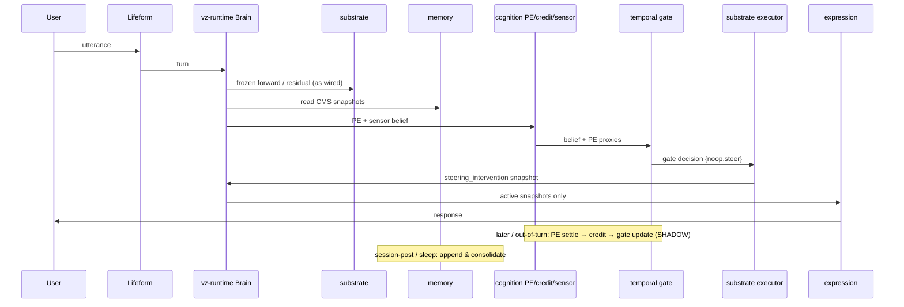

# Appendable · Readable · Learnable · Steerable

> Status: architecture capability charter（能力轴架构说明）
> Last updated: 2026-08-30
> 细粒度契约以 [DATA_CONTRACT.md](./DATA_CONTRACT.md)、[specs/00_INDEX.md](./specs/00_INDEX.md)、
> [steering-runtime.md](./specs/steering-runtime.md) 为准。
> 证据台账与晋升路线见 [evaluation.md](./evaluation.md)、
> [主线提升方案_2026-08.md](./moving%20forward/主线提升方案_2026-08.md)。

---

## 0. 一句话

Volvence 不是「会聊天的模型」，而是一套把**持续适应**拆成四条可审计能力轴的有界系统：

| 能力轴 | 一句话 | 不能塌缩成 |
|---|---|---|
| **Appendable** | 经历可写入、可分层、可跨 session 恢复，而不重写基底 | prompt 堆历史 / 单一 KV 缓存 |
| **Readable** | 内部状态可从残差与快照**命名地读出**，不靠猜文本 | 关键词规则 / 黑盒隐状态 |
| **Learnable** | 只从 Prediction Error 及其下游信用学习，evaluation 永不回灌 | 用 judge 分数当 reward |
| **Steerable** | 在冻结基底上做有界、条件化、可择时的残差干预 | 端到端微调 / token 空间 RL |

四轴合起来，才构成「在线持续主动学习」的系统主张。缺任一轴，都只能声称机制局部成立。

---

## 1. 为什么是这四轴（不是五个，也不是两个）

系统的不可让步法则（R1–R15 + R-PE）在实现上落成**四条正交能力**，每一条对应一个「如果没有它，系统会退化成什么」：

```mermaid
flowchart LR
    subgraph appendable [Appendable]
        CMS["CMS 四层记忆"]
        SKV["State/Prefix-KV"]
        HYD["hydration / checkpoint"]
    end
    subgraph readable [Readable]
        RES["residual capture"]
        SNS["steering sensor"]
        PE["prediction_error"]
        SNAP["immutable snapshots"]
    end
    subgraph learnable [Learnable]
        CR["credit owner"]
        GATE["steering gate / Internal RL"]
        MG["ModificationGate"]
    end
    subgraph steerable [Steerable]
        EX["steering executor"]
        CAP["bounded delta + norm cap"]
        WF["WiringLevel SHADOW→ACTIVE"]
    end
    appendable --> readable
    readable --> learnable
    learnable --> steerable
    steerable --> appendable
```



读法：

1. **先能追加状态**（Appendable），才有东西可读；
2. **先能命名地读出**（Readable），才有合法学习信号；
3. **先有稀疏信用**（Learnable），才知道何时干预；
4. **干预改变下一拍状态**（Steerable），又写回可追加的记忆——形成闭环。

历史教训（#92 `thesis-rejected`、Stage-3 `kill-eta`、S2「可读却不可扳」、A1「仪器失准产出 null」）说明：
把其中两轴用 prompt/关键词/端到端微调偷换，短期看起来像系统，长期必然不可审计、不可回滚、不可证明；
而承载判词的仪器若未先证明分辨力与臂→目标传导性，产出的 null 也无法区分「无效应」与「仪器失准」
（[主线提升方案](./moving%20forward/主线提升方案_2026-08.md) §0 不变量 7/8 的由来）。

---

## 2. Appendable —— 经历可写入、分层、可恢复

### 2.1 主张

系统的内部状态必须能**按时间尺度追加**，而不是每次对话从空上下文重生。追加的单位是 owner 发布的不可变快照与 CMS 卡片，不是 prompt 字符串。

### 2.2 实现面

| 层 | Owner / 载体 | 时间尺度 | 当前默认 |
|---|---|---|---|
| 瞬态 / 情景 / 持久 / 派生 | `vz-memory` CMS continuum | online-fast → background-slow | Memory owner **ACTIVE**；CMS Torch **DISABLED** |
| 跨 session 连续 | Gate 8 wake/sleep、Gate 11 per-user continuity | session-medium / background-slow | 基础 consolidation / session-post **ACTIVE** |
| 个人条件化载体 | State-KV / Prefix-KV（`vz-substrate`） | rare-heavy 写入、online 读取 | Personal 辨识证据 pass；Relationship 轨 chance（负结果封存） |
| 语义可命名状态 | 9 类 semantic owner（`vz-cognition`） | 每 turn 发布快照 | 多数 ACTIVE 基础路径；learner 多 SHADOW |

### 2.3 不变量

- 谁拥有数据，谁负责写入与描述；consumer **禁止**遍历内部结构拼摘要（R8）。
- 跨进程恢复走 hydration + checkpoint；「文件存在」不等于「状态完整」（七日路径 S-7）。
- 多频优于单频的**因果净增益**尚未成立（Gate 5）；Appendable 当前证明的是**可运行、可审计、可回滚**，不是「多频一定更好」。

### 2.4 失败模式（禁止）

- 把整段对话塞进 prompt 冒充记忆；
- 在表达层用 if/else 硬编码「记住了什么」；
- 让 evaluation readout（七日连续性七项）反向写成记忆卡片。

---

## 3. Readable —— 内部状态可命名地读出

### 3.1 主张

适应的前提是**看见**：从冻结基底的残差流、以及各 owner 的快照中，读出可命名、可发布、可对账的内部状态。看不见的隐状态不能成为策略输入。

### 3.2 实现面

| 读什么 | Owner | 读法 | 证据状态 |
|---|---|---|---|
| 下一句人类话语的冻结表示 | `substrate_forward_representation`（`vz-substrate`） | latest-token selected-layer residual，lineage 冻结；v1 全局 L2 归一（已实测标度失准），v2 逐层 L2 + 减冻结参考均值 + 去 top-1 PC（2026-08-12 登记） | A0 就位；SHADOW offline |
| 子目标 / 条件信念 | `steering_condition_belief`（`SteeringSensorModule` / `vz-cognition`） | 冻结线性 reader 读 layer-bound 残差；发布 lagged belief + fresh read + staleness 代理 | 代理迷宫 S3-前置 PASS；runtime owner **SHADOW** |
| Prediction Error | `prediction_error`（`vz-cognition`） | 消费 substrate 快照，拥有 predictor/mismatch；不重编码文本 | PE owner **ACTIVE**（计算与 lineage） |
| 模块间一切正式状态 | 各 `RuntimeModule` → `Snapshot` | `propagate` 写入 active/shadow mapping | 契约式运行时 **ACTIVE** |

### 3.3 Steering 读盘（当前正式快照）

```text
substrate residual
        │
        ▼
steering_condition_belief
   belief_label / margin
   fresh_* / staleness_proxy
   base_action_entropy
```

Sensor **只解释** substrate owner 发布的目标层残差；禁止从自然语言关键词推断 scene/action（R3/R4 + no-keyword 规则）。

### 3.4 不变量

- 残差捕获在 production 表达层默认 `capture_residuals=False`；SHADOW steering 走独立 transformers hook。
- vLLM / synthetic 后端**无**可验证残差出口——请求 ACTIVE steering 必须 `NotImplementedError`。
- 「读得到」≠「扳得动」：S1/S2 已证明线性可读轴可以没有因果干预力；Readable 单独成立不够。
- readout 有版本与域绑定：v1 全局 L2 归一实测 55.4% 共模能量、same-vs-diff Cohen's d 仅 0.315
  （A1 null 的仪器性死因）；v2（逐层 L2 + 减冻结参考均值 + 去 top-1 PC）d=0.592，参考统计只在
  冻结 train-split 上拟合、随 lineage（`reference_corpus_id` / `reference_statistics_sha256`）发布，
  **不跨域/跨几何迁移**（换域或换 layer 几何必须重 fit + 重过预检）。
- 「读得到」还必须先「量得准」：任何拟承载 formal 判词的主判据 readout，prereg 冻结前必须过
  分辨力预检与臂→目标传导预检（主线方案 §0 不变量 7/8，2026-08-12 追加）。

---

## 4. Learnable —— 只从 PE 与信用学习

### 4.1 主张

学习信号只有一条上游：**Prediction Error（R-PE）**。credit、needs、homeostasis 是它的下游聚合；evaluation 是只读验收面，**永远不得**成为学习源（R12）。

### 4.2 信用链（C1，已落地为 owner API）

对话域 / steering 域的终局信用不经 judge、不经七日 continuity readout：

```text
matched noop vs action
  ForwardRepresentationBatchSnapshot (heldout, no update)
        │
        ▼
PE.settle_steering_terminal_prediction_error(...)
  → SteeringTerminalPredictionError
     primary = clip((noop_mse - action_mse) / max(...), -1, 1)
        │
        ▼
CreditRecord(level="steering_terminal_prediction_error")
  keyed by decision_id；同 (episode, head) 只入账一次
        │
        ▼
SteeringGateModule 消费 pending credit
  bounded policy-gradient；STEER/NOOP 同优势反向定向
  一批至多 +1 policy_version
```

性质对齐代理迷宫 S3-E 的证明前提：**稀**（episode 终局）、**准**（免费客观标签）、**arm-independent**。

### 4.3 谁在学、谁冻结

| 组件 | 是否在线更新 | 说明 |
|---|---|---|
| 基底 LLM | 否（冻结 / rare-heavy） | R2 |
| Steering reader / executor artifact | 否（加载后冻结） | lineage + weights SHA 绑定 |
| Steering gate policy | 仅 SHADOW 证据包内有界更新 | online-fast；B3 前不 ACTIVE |
| CMS / temporal SSL / Internal RL torch 后端 | DISABLED 或 SHADOW | #92 后不授权整体 learned takeover |
| rare-heavy adapter / artifact | 必须经 `ModificationGate` | R10 |

### 4.4 专家标注的位置（C2）

人类「这一拍该不该扳向关系轨」的判断，是**验证锚**（`steering-human-anchor.md`），不是学习源：

- `validation_anchor_only=true`
- `learning_use_authorized=false`
- 只对照 C1 方向一致性；分歧只能触发新 prereg，不能就地改 gate

### 4.5 失败模式（禁止）

- 用 companion-bench A1–A6 或七日 continuity composite 当 reward；
- token 空间长期 RL / 在线端到端更新基底；
- 把 evaluation cascade 的分数写回 credit owner。

---

## 5. Steerable —— 有界、条件化、可择时的干预

### 5.1 主张

在**不改写基底权重**的前提下，系统必须能对残差流施加可证明的因果干预，并且学会**何时**出手。三层缺一不可：

| 层 | 能力 | 代理证据 | Runtime |
|---|---|---|---|
| 读得到 | sensor | S3-前置 heldout 1.0 | `steering_condition_belief` SHADOW |
| 扳得动 | executor | C2 conditional NLL 0.027 | `steering_intervention` SHADOW |
| 学会何时扳 | gate | S3-E 5/5 PASS | `steering_gate_decision` SHADOW |

### 5.2 数学与安全不变量

Executor 只实现预注册乘性低秩算子（无 free bias）：

```text
delta = U @ (tanh(Z[k]) ⊙ (Vᵀ h))
||delta||₂ ≤ control_norm_cap_ratio × ||h||₂
noop  ⇒  逐元为零的 delta
```

- artifact 绑定：`model_id` + loaded-base SHA-256 + layer/width + reader↔executor lineage；
- ACTIVE 用户可见生成**只**消费 `active_snapshots["steering_intervention"]`，禁止 shadow fallback；
- 有序晋升：`sensor → executor → gate`；缺前件不能越级；gate 未 ACTIVE 时必须显式命名 `noop|always_on` 临时臂。

### 5.3 与已死操作化的边界

| 已封存 | 本轴不复活的原因 |
|---|---|
| Stage-3 `kill-eta` | additive/free-bias 折叠入口的率失真操作化失败；非理论普遍证伪 |
| S2 probe-axis additive steering | 「可读却不可扳」；方向来源与干预形态都错 |
| Learned Active 的 ETA-off 条款 | 服务 z_t 系四后端；steering 系另立 gate-off / sensor-off prereg |

Steerable 的当前主线是 **条件化乘性写入 + PE 信用择时**，不是 metacontroller 率失真 gap。

### 5.4 接线与回滚

- `FinalRolloutConfig`：`steering_sensor / steering_executor / steering_gate` 默认 **SHADOW**；
- env：`VZ_STEERING_*`；production activation **拒绝**残留 env 旁路抬高 wiring；
- 回滚最小面：单字段翻回 SHADOW/DISABLED，或关 `steering_shadow_hook` 停额外 forward。

---

## 6. 四轴如何组成一个 turn



要点：

1. **同拍 DAG**只传播快照；C1 终局信用是 **out-of-turn** owner API，不把 outcome 塞回同一波。
2. Expression 层只读 **active** mapping——SHADOW 双跑可以完整计算，但不可见。
3. Appendable 的慢路径（sleep / consolidation）不阻塞 turn。

---

## 7. Wheel 所有权映射（四轴 × 库）

| 能力轴 | 主写者 | 协作 | 禁止 |
|---|---|---|---|
| Appendable | `vz-memory`、semantic owners | `vz-application` 经验编译进既有 owner | lifeform 自建第二记忆 |
| Readable | `vz-substrate`（残差/N+1 target）、`vz-cognition`（PE/sensor） | contracts 快照类型 | consumer 重建 residual |
| Learnable | `vz-cognition`（PE/credit/ModificationGate）、`vz-temporal`（gate / Internal RL） | sparse_proof 信用语义 | evaluation→learning |
| Steerable | `vz-substrate`（executor）、`vz-temporal`（gate）、`vz-cognition`（sensor） | runtime 接线 / lifeform activation | vLLM 假 hook；ACTIVE 读 shadow |

`vz-runtime` 是唯一跨业务编排层；`lifeform-*` 只经 Brain facade / contracts / ModificationGate 进入。
`lifeform-core.BoundedContentPolicy` 只提供垂直 adapter 共用的有界内容择位数学与不可变
checkpoint/decision/credit/update 契约：输入仅为 owner 发布的 entry 顺序、opaque id 和 typed 数值特征；
每拍最多把一个非首位 entry 提到首位，否则 strict noop。Memory、PE/credit、scope、持久化和合格 outcome
仍由原 owner/垂直 adapter 解释，因此它不是通用业务 brain，也不允许解析记忆文本或取得执行权。
证据 lane 同理：coding-lab（`lifeform-domain-coding.lab` 环境 + `lifeform-evolution` 采集器）只经
Brain facade 与 typed submit API 进入脑核，episode 终局复用 `dialogue_external_outcome` 唯一合法通道，
不新建 owner（[specs/coding-lab.md](./specs/coding-lab.md)）。

### 7.1 Domain Brain 产品投影

Coding Brain 与 Venture Brain 是四能力轴在外部产品 host 上的两种正式投影，不是新增第五条能力轴，
也不是第二套内核：

| 能力轴 | Domain Brain 统一实现 | Coding Brain | Venture Brain |
|---|---|---|---|
| Appendable | typed outcome 经 `LifeformSession` facade 追加 identity-scoped memory；controller 不建第二 store | test/review/VCS experience | simulation/review/machine/field commercial experience，保留多目标结果 |
| Readable | 只读 owner 发布的 immutable Memory / PE 状态，生成 content-addressed ACTIVE Context Pack | memory-first coding context + settlement refs | 跨周期商业经历、当前不确定性、source/evidence lineage |
| Learnable | 只有合格 typed environment outcome 可在下一 Context Pack turn 进入 PE；evaluation/judge 不回灌 | 仅确定性 test/build/CI verified/regressed oracle | 仅 Foundry-qualified `field_experiment_result` 多目标 verdict |
| Steerable | Context Pack 可 ACTIVE；Advice v1 固定 SHADOW、`applied=false` 且不进入 ACTIVE rendered context | regime/action readout 只作比较 | opportunity/comparison/experiment/stop candidate 只作比较 |

Host 权威不随 Context Pack 转移：coding host 继续拥有 repo、工具、review、VCS/部署；Foundry 继续拥有
来源核验、evidence class、portfolio/budget、Accounting、ledger、审批、最终状态与全部外部动作。
controller 只拥有有界 live-session 幂等/lineage，service 只做 HTTP projection。完整边界见
[Coding Brain](./specs/coding-brain.md) 与 [Venture Brain](./specs/venture-brain.md)。

---

## 8. 证据状态（诚实边界，2026-08-12）

| 能力轴 | 已证明（机制 / 局部） | 未证明（系统主张仍缺） |
|---|---|---|
| Appendable | CMS 可运行可回滚；Gate 8/11 causal+longitudinal；Personal State-KV pass；coding-lab Packet 1 跨进程恢复（4 链） | 多频净增益；七日 formal——A1 已封存 `passed=false`，判词**限定为「v1 raw-cosine readout 下无净增益」**（仪器标度失准 + 固定脚本源传导断链，两个独立死因），重开须先过分辨力 + 传导双预检 |
| Readable | S1 residual readout；S3-前置 reader；N+1 substrate target lineage（v1 失准已实测，v2 仪器修复已登记契约） | MSC formal（判词未出；A2 scaling 门已封存为「门-语料错配」，501-dyad ≈880h 预算须先三选一裁决） |
| Learnable | S3-E 稀疏信用择时；段信用 v13 retain；C1 PE→credit→gate 契约；coding-lab Packet 1 语义 PE 分辨力（p≈1e-4）+ 外部结局通道 | 对话域 C3 formal（首个 run 已废弃：磁盘打满 + v1 仪器失准，重开须先过双预检）；Gate 4 主动学习省标签；coding-lab `forecast_skill=False`（合成基底 × scripted 轨迹上如实封存） |
| Steerable | C2 条件写入；S3-E 择时；B1/B2 owner+SHADOW 接线 | B3 formal 晋升；production ACTIVE；vLLM 残差出口 |

总判词口径仍服从 [thesis prove.md](./thesis%20prove.md)：

- **可以说**：有界、可审计、可回滚的持续适应机制族；残差流读-扳-择时在代理上闭环；runtime steering 三件套已 SHADOW 落地；coding-lab 环境与 SHADOW 观察者已出首批机制判词。
- **不能说**：完整 NL+ETA thesis 已被因果证明；系统已在生产中在线持续主动学习。

晋升与 formal 的唯一路线图：[主线提升方案_2026-08.md](./moving%20forward/主线提升方案_2026-08.md)
（A1→A2 / B1–B3 / C1–C3；2026-08-12 起 A1→A2、A1→C3 依赖降级为预算互斥 + 仪器成熟度）。
A1 判词收窄后，编程域 [coding-lab lane](./specs/coding-lab.md) 升格为当前主证据 lane
（语义级 PE 被 pytest oracle 机械判决，不依赖残差 readout 标度）：Packet 0 标定 PASS
（环境比特级确定、oracle pass rate 0.656 落带、held-out 变体封存），Packet 1 SHADOW 观察者
3/4 PASS + `forecast_skill=False` 如实封存，Packet 2 记忆注入 vs steelman 进行中。

---

## 9. 设计检查清单（改代码前问自己）

1. **Appendable**：这次写入落在哪个时间尺度、哪个唯一 owner？跨 session 如何恢复？
2. **Readable**：新状态是否以 frozen snapshot 发布？消费者是否只读快照、不碰内部？
3. **Learnable**：学习信号是否来自 PE/credit？有没有 evaluation/judge 泄漏？
4. **Steerable**：干预是否有界（norm cap、no bias、strict noop）？artifact lineage 是否绑定？WiringLevel 是否可单字段回滚？
5. **闭环**：干预是否改变下一拍可追加状态，从而让 PE 可结算？还是一次性表演？
6. **仪器**：拟承载 formal 判词的主判据 readout 是否先过分辨力预检（共模能量占比、same-vs-diff
   Cohen's d、1-NN 检索），臂→目标传导性是否已在既有数据上量化（主线方案 §0 不变量 7/8）？

任一条答不上来，就还不是四能力系统，只是局部补丁。

---

## 10. 文档入口

| 想找什么 | 去哪 |
|---|---|
| Wheel 切分与 import 边界 | [archetecture.md](../archetecture.md) |
| 系统设计总览（分层 + 实现边界） | [SYSTEM_DESIGN.md](./SYSTEM_DESIGN.md) |
| Slot / 快照 / wiring | [DATA_CONTRACT.md](./DATA_CONTRACT.md) |
| Steering 三件套契约 | [specs/steering-runtime.md](./specs/steering-runtime.md) |
| 编程域持续学习证据 lane | [specs/coding-lab.md](./specs/coding-lab.md) |
| Coding Brain 产品侧车 | [specs/coding-brain.md](./specs/coding-brain.md) |
| Venture Brain 产品侧车 | [specs/venture-brain.md](./specs/venture-brain.md) |
| 人类验证锚（非学习源） | [specs/steering-human-anchor.md](./specs/steering-human-anchor.md) |
| R1–R15 设计源头 | [next_gen_emogpt.md](./next_gen_emogpt.md) |
| 证据与晋升路线 | [evaluation.md](./evaluation.md)、[主线提升方案](./moving%20forward/主线提升方案_2026-08.md) |
| Spec 总索引 | [specs/00_INDEX.md](./specs/00_INDEX.md) |
