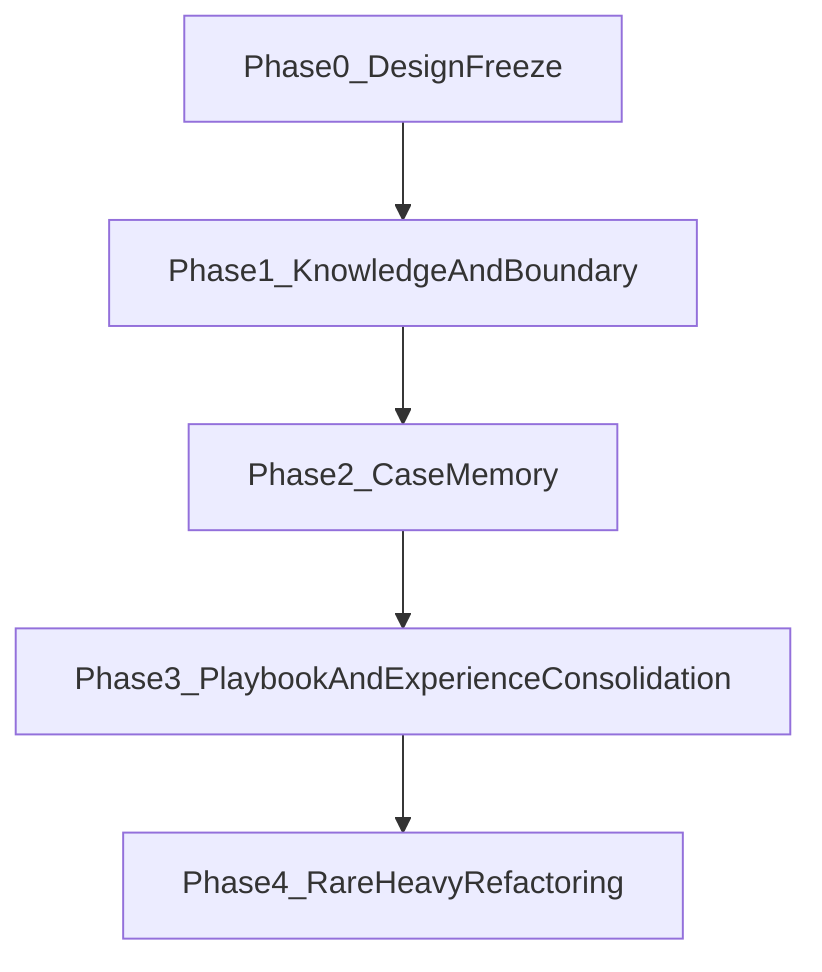

# VolvenceZero Application Rollout Plan

> Status: draft
> Last updated: 2026-04-22
> Scope: phased implementation roadmap for application-layer knowledge, experience, and boundary systems
> Source: `docs/application_system_design.md`, `docs/application_data_contract.md`

---

## 1. Purpose

本文档把应用层目标态拆成可执行 rollout，而不是一次性把所有能力同时做进主链。

核心原则：

- 先把 **在线控制 -> 知识证据 -> 边界约束** 跑通。
- 再把 **案例经验** 从普通记忆中分离。
- 最后把 **slow-loop 经验沉淀 -> 策略先验** 正式化。

这既符合现有 runtime contract，也能最大限度降低一次性引入多 owner 的回归风险。

---

## 2. Rollout Constraints

所有阶段都必须遵守以下约束：

- 不修改 `memory` 的主 owner 身份。
- 不让知识和经验在 Phase 1 就进入 `background-slow` 自改路径。
- 不让 evaluation 抢占任何新增 owner 身份。
- 不让 response 层读取新增系统的私有存储或私有缓存。
- 所有新增 surface 必须通过 snapshot 发布。
- 所有新增 widening 都要先经过 benchmark / acceptance gate。

---

## 3. Phase Overview

---

## 4. Phase 0: Design Freeze

## Goal

冻结 contracts 与 owner 边界，不落代码实现。

## Deliverables

- [docs/application_system_design.md](/Users/mengfu/Documents/GitHub/VolvenceZero/docs/application_system_design.md)
- [docs/application_data_contract.md](/Users/mengfu/Documents/GitHub/VolvenceZero/docs/application_data_contract.md)
- 本文档

## Exit Criteria

- `retrieval_policy` 被确定为控制层到检索层的唯一接口
- `domain_knowledge`, `case_memory`, `strategy_playbook`, `boundary_policy`, `experience_consolidation` 的职责边界明确
- phase 顺序和 acceptance gate 明确

---

## 5. Phase 1: Knowledge Evidence + Boundary Policy

## 5.1 Goal

先把最小专业事实面和边界面接入默认主链，不碰案例经验沉淀，不碰 slow-loop 自修改。

这是最小且最关键的一步，因为它让系统先具备：

- 检索专业事实的公共 surface
- 边界与回答深度的公共 surface
- 由 ETA 在线控制层驱动检索，而不是“裸 RAG”

## 5.2 Scope

### New runtime surfaces

- `retrieval_policy`
- `domain_knowledge`
- `boundary_policy`

### Existing components touched

- `final_wiring`
- `session`
- `response assembly`
- `evaluation enrichment`

### Explicitly out of scope

- `case_memory`
- `strategy_playbook`
- `experience_consolidation`
- 对 `session_post_slow_loop` 行为的结构性改造
- 存储技术定型

## 5.3 Implementation Shape

### Step 1: Add retrieval policy as public slot

新增 `RetrievalPolicyModule`：

- 读取 `world_temporal`, `self_temporal`, `dual_track`, `regime`
- 输出 `retrieval_policy`
- 不执行检索，只提供 machine-readable strategy

### Step 2: Add domain knowledge evidence slot

新增 `DomainKnowledgeModule`：

- 读取 `retrieval_policy`
- 先可使用 placeholder / mock backing source
- 发布 compact knowledge hits + citations + conflict markers

### Step 3: Add boundary policy slot

新增 `BoundaryPolicyModule`：

- 读取 `retrieval_policy`, `domain_knowledge`, `regime`, `prediction_error`
- 发布本轮回答边界与降级策略

### Step 4: Extend response assembly

让 response layer 新增消费：

- `domain_knowledge`
- `boundary_policy`

但只允许消费 snapshot 中的 compact public fields。

### Step 5: Extend evaluation enrichment

新增第一版 evidence：

- knowledge hit count
- citation required / satisfied
- conflict exposed
- clarification triggered
- referral triggered

## 5.4 Files Expected To Change Later

- [volvence_zero/integration/final_wiring.py](/Users/mengfu/Documents/GitHub/VolvenceZero/volvence_zero/integration/final_wiring.py)
- [volvence_zero/agent/session.py](/Users/mengfu/Documents/GitHub/VolvenceZero/volvence_zero/agent/session.py)
- [volvence_zero/agent/response.py](/Users/mengfu/Documents/GitHub/VolvenceZero/volvence_zero/agent/response.py)
- [volvence_zero/evaluation/backbone.py](/Users/mengfu/Documents/GitHub/VolvenceZero/volvence_zero/evaluation/backbone.py)
- new application modules for `retrieval_policy`, `domain_knowledge`, `boundary_policy`

## 5.5 Phase 1 Tests

### Contract tests

- 新 slot 注册与 owner 唯一性
- snapshot schema frozen
- direct dependency 声明正确

### Runtime tests

- run_turn 能发布 `retrieval_policy`
- `domain_knowledge` 与 `boundary_policy` 出现在 active snapshots
- response 层能读取新增 surface，但不读私有结构

### Evaluation tests

- `evaluation` evidence 中可观察 knowledge / boundary surface
- 不改变 `evaluation` 公共基础 shape

## 5.6 Phase 1 Acceptance Gate

只有在以下条件满足后，才能进入 Phase 2：

- `retrieval_policy` 稳定发布
- `domain_knowledge` 不越权进入 `memory`
- `boundary_policy` 不越权接管 response
- response 能区分事实提示与边界提示
- benchmark 可读取知识和边界 evidence

## 5.7 Rollback Point

若有回归，可回滚到：

- 保留 `retrieval_policy`
- `domain_knowledge` / `boundary_policy` 退到 `SHADOW` 或 placeholder
- response assembly 不再引用新增 surface

---

## 6. Phase 2: Case Memory As Sibling Owner

## 6.1 Goal

把案例经验与普通连续记忆显式分离。

## 6.2 Why It Is Separate From Phase 1

因为一旦把 case layer 和 knowledge layer一起落，很容易发生两类设计污染：

- `memory` 变成“大一统仓库”
- response 层绕过控制器，直接把相似案例塞进回复

Phase 2 要避免这两种情况。

## 6.3 Scope

### New runtime surface

- `case_memory`

### Existing components touched

- `memory` integration surface
- retrieval orchestration
- evaluation enrichment

### Explicitly out of scope

- `strategy_playbook`
- `experience_consolidation`
- session-post case promotion logic

## 6.4 Implementation Shape

### Step 1: Add case_memory owner

新增 `CaseMemoryModule`：

- 读取 `retrieval_policy`
- 发布 compact case episode hits
- 不直接产出策略建议

### Step 2: Attach retrieval path

`RetrievalPolicy` 允许同时指定：

- `knowledge_domains`
- `experience_domains`

让应用层第一次具备混合检索能力。

### Step 3: Extend evaluation evidence

新增：

- case hit count
- case relevance evidence
- delayed outcome availability

## 6.5 Files Expected To Change Later

- [volvence_zero/memory/store.py](/Users/mengfu/Documents/GitHub/VolvenceZero/volvence_zero/memory/store.py)（仅边界对齐，不让它吸收 case ownership）
- [volvence_zero/integration/final_wiring.py](/Users/mengfu/Documents/GitHub/VolvenceZero/volvence_zero/integration/final_wiring.py)
- [volvence_zero/evaluation/backbone.py](/Users/mengfu/Documents/GitHub/VolvenceZero/volvence_zero/evaluation/backbone.py)
- new `case_memory` module

## 6.6 Phase 2 Acceptance Gate

- `case_memory` 成为独立 owner
- `memory` 仍保持 learned-core / durable memory 主责
- 检索层可混合知识 hits 与案例 hits
- response 仍通过公共 snapshot 读取，不直连 case store

## 6.7 Rollback Point

- 保留 Phase 1
- `case_memory` 退回 `SHADOW`
- retrieval 混合策略退回 knowledge-only

---

## 7. Phase 3: Strategy Playbook + Experience Consolidation

## 7.1 Goal

把 `background-slow` 学到的经验，明确沉淀成可供 fast path 使用的策略先验。

这是应用真正开始体现“经验会长出来”的阶段。

## 7.2 Scope

### New runtime surfaces

- `strategy_playbook`
- `experience_consolidation`

### Existing components touched

- `session_post_slow_loop`
- `reflection`
- `evaluation`

## 7.3 Implementation Shape

### Step 1: Add experience_consolidation report surface

在现有 `session_post_slow_loop` 基础上新增独立 report surface：

- 学到了哪些 case deltas
- 学到了哪些 playbook deltas
- 学到了哪些 boundary deltas

### Step 2: Add strategy_playbook owner

新增 `StrategyPlaybookModule`：

- 读取 `case_memory`
- 发布 problem-pattern-level strategy priors

### Step 3: Connect slow -> fast shaping

让 fast path 可以消费 `strategy_playbook`：

- 排序经验 hits
- 给 regime/response 提供 ordering prior
- 给 retrieval weighting 提供 hint

### Step 4: Extend evaluation evidence

新增：

- playbook matched
- playbook retained
- experience delta promotion count
- slow-shapes-fast evidence

## 7.4 Files Expected To Change Later

- [volvence_zero/agent/session_post_slow_loop.py](/Users/mengfu/Documents/GitHub/VolvenceZero/volvence_zero/agent/session_post_slow_loop.py)
- [volvence_zero/reflection/writeback.py](/Users/mengfu/Documents/GitHub/VolvenceZero/volvence_zero/reflection/writeback.py)
- [volvence_zero/evaluation/backbone.py](/Users/mengfu/Documents/GitHub/VolvenceZero/volvence_zero/evaluation/backbone.py)
- new `strategy_playbook` and `experience_consolidation` modules

## 7.5 Phase 3 Acceptance Gate

- `experience_consolidation` 成为独立公共 surface
- `strategy_playbook` 不重写 `temporal` owner 内部状态
- slow layer 对 fast layer 的影响可通过公共 evidence 观察
- `session_post_slow_loop` 仍 bounded / observable / fail-closed

## 7.6 Rollback Point

- 保留 `case_memory`
- `strategy_playbook` 退回 `SHADOW`
- `experience_consolidation` 只做 report，不做任何 apply hint

---

## 8. Phase 4: Rare-Heavy Refactoring

## Goal

在主链稳定后，再考虑：

- knowledge domain ontology refresh
- case clustering
- playbook distillation
- domain template refactoring
- offline refresh / import

## Why It Is Last

因为这些动作：

- 计算重
- 结构侵入性强
- 回滚更复杂
- 对主链正确性要求更高

它们不应该先于 Phase 1/2/3 落地。

---

## 9. Storage Decision Gate

当前 rollout 刻意不锁死存储技术。  
真正进入 Phase 1 代码实现前，需要单独确认：

- 是先用 repo-local mock / file-backed prototype
- 还是直接做抽象接口后的真实 backing store
- 是否首选 Postgres + pgvector

无论哪种选择，都不得改变本文档定义的 runtime contracts。

---

## 10. Benchmark Strategy

每一阶段都不只看“代码能跑”，还要看证据面。

### Phase 1 benchmark additions

- knowledge hit observed
- citation requirement surfaced
- boundary trigger observed

### Phase 2 benchmark additions

- case hit observed
- case/knowledge mixed retrieval observed

### Phase 3 benchmark additions

- experience delta promoted
- playbook matched
- slow loop completion shaping next turn

---

## 11. Pre-Code Checklist

在真正进入代码实现前，必须先确认：

1. `application_data_contract.md` 已冻结。
2. 本文档 phase scope 已冻结。
3. 每个新增 slot 的 owner 与 dependencies 明确。
4. 直接依赖 vs enrichment 边界明确。
5. rollback 点明确。
6. evaluation evidence 设计明确。

---

## 12. Immediate Execution Order

当进入代码实现时，推荐顺序如下：

1. 先实现 `retrieval_policy`
2. 再实现 `domain_knowledge`
3. 再实现 `boundary_policy`
4. 再接 response / evaluation
5. 之后才做 `case_memory`
6. 最后做 `strategy_playbook` 与 `experience_consolidation`

这个顺序的核心目的是：

> 先让系统“知道什么时候该查什么，并且不越界”，再让系统“逐渐变得更会处理”。  

