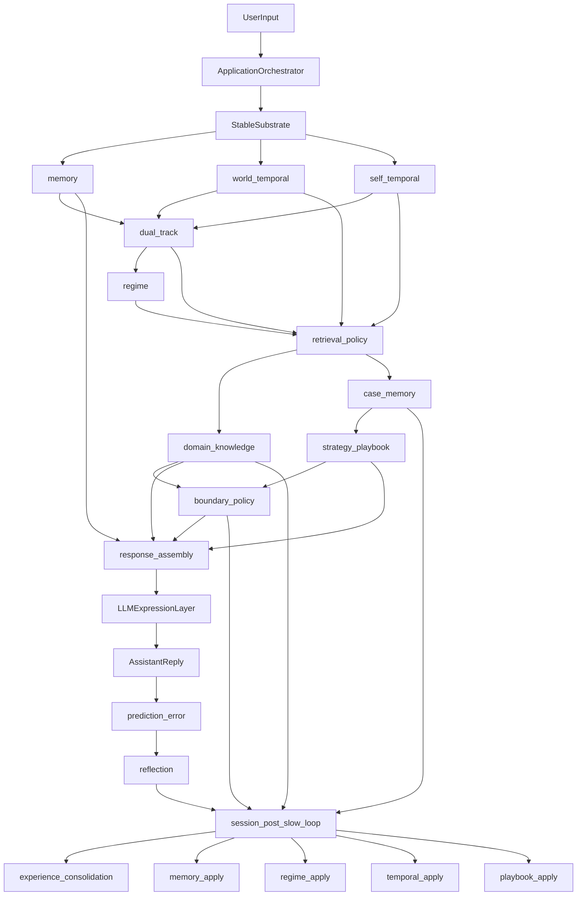

# VolvenceZero Application System Design

> Status: draft
> Last updated: 2026-04-22
> Scope: application-level target-state architecture over the existing NL/ETA runtime
> Source alignment: `docs/next_gen_emogpt.md`, `docs/SYSTEM_DESIGN.md`, `docs/DATA_CONTRACT.md`

---

## 1. Purpose

本文档定义 **VolvenceZero 在应用层的完整系统架构目标态**。它不重复底层算法论文，也不只是 runtime 模块清单，而是回答四个更直接的问题：

1. 这个应用对用户到底提供什么能力。
2. 现有的 NL / ETA 脑层在应用里负责什么。
3. 未来的知识系统、经验系统、边界系统该怎么接入。
4. 一轮真实对话里，感知、判断、检索、经验调用、表达、慢反思如何协作。

核心目标不是做一个“会聊天的 RAG”，而是构建一个 **有界、可持续学习、可解释、可观测** 的情绪与决策支持应用。

---

## 2. Product Thesis

VolvenceZero 的应用层不是“一个模型 + 一个 prompt + 一个知识库”。它是一个分层认知应用：

- **LLM / substrate** 提供语言表达与基础世界建模。
- **ETA 层** 提供在线控制能力，决定这轮如何处理问题。
- **NL 层** 提供多时间尺度学习能力，把经历沉淀成长期能力。
- **知识系统** 提供外部专业事实与程序性信息。
- **经验系统** 提供案例经验、节奏经验、策略模式。
- **边界系统** 提供风险约束、专业边界和降级/转介规则。

这意味着应用的核心价值不只是“回答正确”，而是：

- 在复杂情绪状态下仍能给出合适的处理顺序。
- 区分事实说明、情绪承接、关系修复、行动建议。
- 随着交互积累，逐步形成更好的个体化处理能力。

---

## 3. System Design Principles

### 3.1 Stable substrate, adaptive cognition

- 基础模型是 **表达层和感知底座**，不是主学习者。
- 在线适应优先发生在控制器、记忆、路由、反思写回中。
- 不允许把所有学习坍缩到 token 级 prompt 技巧。

### 3.2 Snapshot-first ownership

- 每个有意义的运行时区域必须有唯一 owner。
- 模块之间只通过公共快照交换状态。
- 消费者不能重建生产者内部状态。

### 3.3 Multi-timescale learning

- `online-fast`: 每轮判断、控制、轻量 recall、边界决策
- `session-medium`: 案例状态聚合、session 级行为调整
- `background-slow`: session-post 反思、经验沉淀、策略先验更新
- `rare-heavy`: 离线 artifact 训练、substrate/controller refresh、知识域重整与案例蒸馏

### 3.4 Knowledge and experience are not the same

- **知识** 回答“世界上有哪些事实、流程、规则、边界”。
- **经验** 回答“面对这种人和状态，这些知识该怎么用更合适”。
- **控制器** 回答“当前这轮该偏知识、偏经验、还是怎么混合”。

### 3.5 How Experience Enters ETA

经验**可以进入 ETA**，但不应该以“成为 ETA 第二 owner”的方式进入。

正确做法不是把案例经验直接塞进 `temporal` / metacontroller 的私有状态里，  
而是让经验沿正式 contract 进入 ETA 的四条闭环：

1. **检索混合入口**
   - ETA 决定这轮 `knowledge_weight` / `experience_weight`
   - ETA 决定 `experience_domains`
   - 经验因此进入 `retrieval_policy`

2. **处理先验入口**
   - `case_memory` 提供“类似事情过去怎么发生、怎么处理”
   - `strategy_playbook` 提供“这类问题通常先做什么、后做什么更稳”
   - ETA 消费这些先验来决定当前处理顺序和节奏
   - 在 continuum memory 口径下，这些先验还应带有频谱位置与恢复来源，而不是只提供离散案例标签

3. **延迟信用入口**
   - `experience_consolidation` 不只报告经验 delta
   - 它还应回看 `(abstract_action, regime, retrieval mix, family version)` 在多轮后的结果
   - 这让经验进入 ETA 的 delayed credit / slow-shapes-fast 闭环

4. **演化裁决入口**
   - 经验不只帮助生成建议，还应帮助决定哪些建议可以被系统吸收
   - replay / benchmark / evolution judge 应裁决经验产物的 `promote / hold / rollback`

因此，设计原则是：

- **经验可以进入 ETA 的控制闭环和学习闭环**
- **经验不应直接成为 ETA owner 本体的一部分**
- **ETA 负责选择和调度经验，不负责吞并经验所有权**

同理，**知识也只能以 influence 的形式进入 ETA/NL**。  
ETA 应该读取的是紧凑的 `retrieval_policy` / readout control，  
NL 应该读取的是慢层压缩后的 `experience_consolidation` / `experience_fast_prior`，  
而不是把知识条目正文、案例正文或 playbook 本体并进 `temporal` / metacontroller 私有状态。

---

## 4. Layered Architecture



### 4.1 Stable substrate layer

职责：

- 接收用户输入。
- 产出残差流 / feature surface 之类的可消费 substrate 状态。
- 作为表达层执行最终生成。

它像是：

- 语言系统
- 世界建模底座
- 生成器

它不是：

- 主要决策者
- 经验沉淀者
- 长期知识 owner
- 在线主路径中的学习性改写对象

### 4.2 ETA online control layer

这一层是应用里的“在线大脑前额叶”。

职责：

- 形成抽象动作 `z_t`
- 控制切换门 `beta_t`
- 决定当前该用什么处理模式
- 控制检索意图、策略切换、节奏快慢

对应当前系统里的：

- `world_temporal`
- `self_temporal`
- `temporal_abstraction`
- `ETANLJointLoop`

### 4.3 NL learning layer

这一层不是某个单独模块，而是整个系统的学习组织原则。

职责：

- 规定不同知识在不同时间尺度更新
- 让 slow layer 塑造 fast layer
- 把 lived interaction 压缩成 durable lesson

对应当前系统里的：

- `memory`
- `reflection`
- `session_post_slow_loop`
- `rare-heavy` artifact path

### 4.4 Application cognition layer

这一层是用户真正感受到“这个系统像在理解我”的地方。

核心模块：

- `dual_track`
- `regime`
- `memory`
- `prediction_error`
- `credit`
- `evaluation`

职责：

- 区分 task/world 与 self/relationship
- 判断当前是在 problem solving、emotional support 还是 repair
- 根据历史与当前 tension 决定响应姿态

---

## 5. New Application-Specific Systems

## 5.1 Domain knowledge system

### Slot

`domain_knowledge`

### Owner

`DomainKnowledgeModule`

### Responsibility

发布本轮相关的外部专业事实，不承担经验判断。

### Expected content

- domain id
- topic tags
- jurisdiction tags
- source provenance
- freshness
- confidence
- conflict markers
- structured factual summary
- citation-ready snippets

### Design intent

它不是普通“通用 RAG 插件”，而是正式应用层知识 owner。

它回答：

> 客观上有哪些规则、流程、事实、程序、专业边界。

---

## 5.2 Case memory system

### Slot

`case_memory`

### Owner

`CaseMemoryModule`

### Responsibility

保存问题处理过程中的案例经验样本。

### Expected content

- case pattern
- user state pattern
- intervention ordering
- delayed outcome
- escalation / repair markers
- track tags
- regime tags

### Design intent

它不是 `memory` 里的一个附带字段，而是 `memory` 的 sibling owner。

它回答：

> 类似事情过去怎么发生、怎么处理、结果如何。

---

## 5.3 Strategy playbook system

### Slot

`strategy_playbook`

### Owner

`StrategyPlaybookModule`

### Responsibility

从案例经验中提炼可迁移策略模式。

### Expected content

- problem pattern -> recommended regime
- problem pattern -> recommended ordering
- problem pattern -> recommended pacing
- problem pattern -> avoid patterns
- confidence and applicability scope

### Design intent

它不存原始案例，而存“可复用的处理套路”。

它回答：

> 面对这种问题，通常先做什么、后做什么更稳。

---

## 5.4 Boundary policy system

### Slot

`boundary_policy`

### Owner

`BoundaryPolicyModule`

### Responsibility

发布当前轮的边界判断和允许动作范围。

### Expected content

- risk band
- answer depth limit
- citation required
- clarification required
- refer-out required
- uncertainty policy
- professional scope tag

### Design intent

它把“别乱说”从 prompt 习惯，提升为正式公共状态。

它回答：

> 这轮能说到哪里，哪些必须保守、澄清或转介。

---

## 5.5 Experience consolidation system

### Slot

`experience_consolidation`

### Owner

`ExperienceConsolidationModule`

### Responsibility

把一次或多次 session 的 lived interaction 提炼为 durable lesson。

### Expected content

- promoted case clusters
- learned strategy deltas
- updated boundary hints
- regime preference shifts
- confidence and rollback metadata

### Design intent

它是 `background-slow` 的公共 report surface，而不是隐藏在 memory writeback 里的副作用。

它回答：

> 这次慢反思到底学到了什么，以后会怎样改变处理方式。

在升级后的实现口径下，`experience_consolidation` 不再只是“说明学到了什么”，  
还要公开：

- typed `ApplicationPriorUpdate`
- proposal / applied / blocked / audit-ready writeback 摘要

但它**仍不直接成为其他 owner 的第二 owner**。  
真正的 application prior apply 只能发生在 `session_post_slow_loop` 驱动的 owner-side writeback helper 中。

---

## 6. Who Controls Knowledge-Experience Tradeoff

**不是知识系统自己决定，也不是经验系统自己决定。**

真正的控制者是应用里的 **ETA online control layer**，并受 `regime`、`dual_track` 与 `boundary_policy` 共同约束。

### Control chain

1. `temporal` 判断当前抽象动作与切换强度
2. `dual_track` 判断 world/self 哪边更主导
3. `regime` 判断当前互动姿态
4. `memory` 发布的 `continuum_profile` 提供当前频谱位置、恢复压力与 readout 结构
5. `boundary_policy` 收紧或放开允许动作范围
6. 最终形成一个显式的 `retrieval_policy`

这里 `retrieval_policy` 更准确地说应是 **ETA 对检索层的紧凑控制读出面**。  
它可以内部由启发式或后续 learned readout 产生，但无论实现怎么演进，都应保持：

- ETA 只发布 compact control
- knowledge / case / playbook owners 只返回 compact evidence / compact priors
- knowledge / experience 本体不进入 ETA owner

### 6.1 Four Experience Entry Points Into ETA

经验进入 ETA，不只是一句“有 `experience_weight`”就结束。  
它至少有 4 个正式接入点：

#### 6.1.1 Retrieval mix

ETA 决定：

- 是否需要经验检索
- 需要哪类经验 domain
- 知识和经验各占多大权重

这是 experience 进入 ETA 的最前门。

#### 6.1.2 Fast-path priors

ETA 在 turn-time 消费：

- `case_memory` 的 compact case hits
- `strategy_playbook` 的 ordering / pacing priors

这些 priors 不直接重写 ETA 内部状态，  
但它们会影响 ETA 如何排序候选处理方式。

在当前实现口径下，这种影响不再只表现为“命中了哪些案例标签”，  
还表现为：

- 当前 case hit 位于 continuum 的哪一段
- 它来自 slow-to-fast reuse、meta-init 还是普通 artifact anchor
- playbook ranking 与 retrieval mixing 是否与当前频谱位置一致

#### 6.1.3 Delayed credit

经验必须进入 ETA 的 delayed credit，而不只停留在“当前轮命中了什么”。

也就是说系统要能回答：

> 某个 `abstract_action` 在某个 `regime` 下，配某种 retrieval mix，几轮之后是否真的更好？

这一步把经验从“材料”提升成“学习信号”。

实现上，这个 delayed credit 不应直接写穿 `regime` / `retrieval_policy` / `temporal` 的私有状态。  
更合适的做法是引入一个独立公共中继面，例如 `experience_fast_prior`，把慢层 ledger 压缩成：

- regime bias
- retrieval mix bias
- abstract-action / action-family continuation bias
- regime-sequence payoff bias

然后由各 owner 在自己的 fast path 内部决定如何消费这些 bias。

#### 6.1.4 Evolution gating

经验还应进入系统演化裁决：

- 哪些 case delta 可以 promote
- 哪些 playbook delta 只能 hold
- 哪些 boundary delta 应该 rollback

只有这样，经验才不只是“被看到”，而是开始“约束 ETA 如何变好”。

---

## 7. Retrieval Policy As The Main Interface

知识与经验系统不应直接读取所有脑状态做黑箱判断。  
更好的做法是让控制层先发布一个正式的 **检索策略对象**。

```python
@dataclass(frozen=True)
class RetrievalPolicy:
    knowledge_domains: tuple[str, ...]
    experience_domains: tuple[str, ...]
    knowledge_weight: float
    experience_weight: float
    world_weight: float
    self_weight: float
    retrieval_depth: str
    citation_required: bool
    jurisdiction_required: bool
    risk_band: str
    intent_description: str
```

### Control semantics

- `abstract_action` 决定检索类型
- `world/self` 决定偏事实还是偏关系经验
- `regime` 决定排序 prior
- `switch_gate` 决定是否扩大检索域、提升深度
- `boundary_policy` 决定是否必须加 citation / clarification / referral

### Result

ETA 层不直接“自己去搜”，而是：

> 输出 `RetrievalPolicy` -> 知识与经验系统按 policy 检索 -> 返回结构化 hits -> 应用层再决定表达。

---

## 8. End-to-End Application Flow

## 8.1 Turn-time fast path

1. 用户输入进入 substrate。
2. `memory`, `world_temporal`, `self_temporal`, `dual_track`, `regime` 更新本轮状态。
3. 控制层输出 `RetrievalPolicy`。
4. `domain_knowledge` 和 `case_memory` 按 policy 提供候选结果。
5. `strategy_playbook` 给出推荐处理顺序和节奏。
6. `experience_fast_prior` 把 delayed credit 压缩成可供 fast path 消费的 compact bias。
7. `boundary_policy` 过滤结果并决定回答边界。
8. response assembly 把结构状态分成两路：
   - `response_assembly` 发布的最小 prompt residue / chat context
   - `response_assembly` 发布的 generation constraints + control parameters
9. substrate 表达层生成回复。
10. 系统记录 prediction-error 和 delayed evidence。

在当前 continuum 口径下，`response_assembly` 也不再只是消费 `playbook_ordering`。  
它还应直接消费：

- 当前 response mode
- boundary 是否要求 clarification / refer-out
- core/application 共同发布的 continuum target position

因此最终回复结构的首步不再由“命中了哪个 playbook step”单独决定，  
而是由 **continuum target position + boundary state + playbook hints** 共同决定：

- 慢侧目标更高时，优先 `stabilize`
- clarification 约束更强时，优先 `clarify_goal`
- 结构化目标更强时，优先 `structure_options`

这里要特别注意：

- `case_memory` / `strategy_playbook` 是 **ETA 的输入面**
- 它们不是 `temporal` 的第二 owner
- ETA 通过这些公共 surface 消费经验，而不是直接吞并经验本体

## 8.2 Session-medium path

在一个 session 内逐步累积：

- 哪些知识域被反复命中
- 哪些处理方式让用户更稳定
- 哪些做法触发了 tension 或 escalation
- 哪些边界提醒被频繁触发
- 哪些 retrieval mix 在中程结果上更好
- 哪些 regime sequence 和 abstract action 组合更稳

## 8.3 Background-slow path

在 `session_post_slow_loop` 中：

- 读取 interaction traces, prediction error, outcomes, boundary events
- 提炼 durable lessons
- 输出 memory consolidation + policy consolidation
- 形成 `experience_consolidation`
- 必要时更新 `strategy_playbook`, `boundary_policy`, `case_memory`

这些更新在升级后的 runtime 口径里应理解为：

- `experience_consolidation` 公开 typed update contract
- `EvolutionJudgement` 与 credit gate 裁决这些 update 是否可 apply
- apply 只在 owner-side helper 中执行
- 结果再回流到 `experience_consolidation` 的 applied / blocked 摘要

更进一步地，`background-slow` 应把经验沉淀成 ETA 可消费的慢层约束：

- 哪类 `abstract_action` 在哪些情境下更有效
- 哪类 `regime` 序列在长期结果上更好
- 哪种 knowledge/experience mix 更稳
- 哪些经验产物经 judge 允许 promotion，哪些必须 hold / rollback

这就是 **experience enters ETA through slow credit and evolution gating**，  
而不是“experience becomes ETA owner”.

在当前实现口径下，这些慢层约束先收敛为 `experience_consolidation`，  
再经 `experience_fast_prior` 进入下一轮的 `regime`、`retrieval_policy` 与 temporal/joint scheduling。  
这样 slow-shapes-fast 成为正式 runtime chain，而不是只停留在 evaluation readout。

---

## 9. Response Assembly Model

应用层最终不是把“一切压成一个张量”丢给 LLM。

而是两路并行：

### 9.1 Symbolic / textual conditioning

- `response_assembly.prompt_residue_summary`
- 最小的 interaction framing
- 必要但无法直接参数化的语义残差

这里的关键原则是：

- 文本条件只保留**表达残差**
- 不再承担主要控制职责
- 不把 knowledge / case / playbook / boundary 大段重新压回 system prompt

### 9.2 Numeric control

- `temporal controller code`
- `control scale`
- `response_mode`
- `answer_depth_limit`
- `citation_mode`
- `max_questions`
- `required_disclaimer_phrases`
- `ordering_plan`

这些字段应通过正式 `response_assembly` / generation-constraints contract 发布，  
由 expression layer 和 substrate runtime 显式消费，而不是仅靠 prompt 字符串解释。

### 9.3 ResponseAssembly as a public surface

`response_assembly` 应是 expression layer 的正式公共输入面之一。

它的职责不是生成文本，而是把上游控制状态压成**可执行的表达约束**：

- 当前该走 `support / clarify / structure / refer-out` 哪种回复模式
- 当前允许的回答深度
- 当前是否必须澄清、引用或转介
- 当前建议的处理顺序
- 当前应施加的 numeric control
- 当前仅剩下哪些 prompt residue 仍需要自然语言表达

### Design principle

能保持显式结构的，尽量保持显式；  
只有真正需要直接调控生成的部分，才压成控制向量。

---

## 10. Example: Divorce Support Scenario

用户说：

> “我想离婚，但我现在很乱，也怕孩子受伤害。”

### 10.1 ETA layer decides

- 当前不是直接深法律解释模式
- 当前抽象动作是 `stabilize_then_structure`
- 当前 `self/relationship` 权重大于 `world/task`

### 10.2 Retrieval policy

- `knowledge_domains = family_law_basics, child_care_basics`
- `experience_domains = high_emotion_divorce_cases, stabilization_playbooks`
- `knowledge_weight < experience_weight`
- `retrieval_depth = light`
- `jurisdiction_required = true`

### 10.3 Knowledge system returns

- 离婚路径的基础区别
- 地域依赖提醒
- 孩子相关的一般注意事项

### 10.4 Experience system returns

- 先稳情绪再拆问题更有效
- 先给最小下一步，不要一次给十步
- 高冲突状态下避免过早推行动结论

### 10.5 Boundary policy enforces

- 不给确定性法律结论
- 必须提醒地域差异
- 若出现风险信号，必须转介

### 10.6 Final reply

回复结构会是：

1. 先承接情绪
2. 再拆分问题线
3. 再给最小下一步
4. 最后补有限度的专业事实

---

## 11. Ownership And Contracts

### 11.1 Existing core owners remain primary

- `memory` 仍是连续记忆 owner
- `temporal` 仍是在线控制 owner
- `regime` 仍是互动姿态 owner
- `reflection` 仍是慢反思 owner

### 11.2 New owners must not become second owners

- `domain_knowledge` 不越权写 `memory`
- `strategy_playbook` 不越权修改 `temporal` 内部状态
- `boundary_policy` 不越权直接替代表达层
- `case_memory` 不越权重写 `memory` learned core

### 11.3 Public exchange only

所有新系统都应通过不可变 snapshot 发布：

- compact public state
- machine-readable fields
- description
- versioned updates

---

## 12. Safety And Boundedness

应用层必须明确区分四类输出：

1. 情绪承接
2. 事实说明
3. 决策梳理
4. 专业边界提醒

必须支持：

- citation-required 场景
- high-risk refer-out 场景
- uncertainty disclosure
- jurisdiction mismatch warning
- professional-depth limiting

---

## 13. Observability

应用层至少要有以下可观测面：

- `session_post_slow_loop`
- `experience_consolidation`
- `domain_knowledge` hit quality
- `case_memory` hit quality
- `boundary_policy` trigger counts
- playbook application evidence
- knowledge/experience weighting evidence

评估不只看“答得像不像”，还要看：

- 是否选对知识域
- 是否在该保守时保守
- 是否用了合适的经验节奏
- 慢层是否真的改进了下一轮处理

---

## 14. Rollout Strategy

### Phase 1

接入 `domain_knowledge` 和 `boundary_policy`，让应用先具备：

- 专业事实可读
- 边界可读
- citation / jurisdiction 能力

### Phase 2

接入 `case_memory`，把案例经验和普通记忆分离。

### Phase 3

在 `session_post_slow_loop` 中新增 `experience_consolidation`，把经验沉淀公开化。

### Phase 4

形成 `strategy_playbook`，让 ETA 在线控制层能稳定调用经验模式。

### Phase 5

在 `rare-heavy` 层做 substrate-aware artifact 训练与 refresh，并继续承担知识域重整、案例聚类、模板蒸馏。

---

## 15. Final Design Statement

VolvenceZero 的最终应用架构应理解为：

- **LLM 是表达层，不是最高决策者**
- **ETA 是在线控制中心，决定现在怎么处理**
- **NL 是多时间尺度学习框架，决定系统如何长期变好**
- **知识系统提供事实材料**
- **经验系统提供处理手感与可迁移策略**
- **边界系统保证系统不会越界装懂**

因此，应用不是：

- 一个 chat model
- 一个 prompt 工程系统
- 一个通用 RAG

而是一个：

> **由 ETA 负责在线调度、由 NL 负责慢层学习、由知识和经验系统提供材料、由边界系统保证有界性的持续适应型应用系统。**
