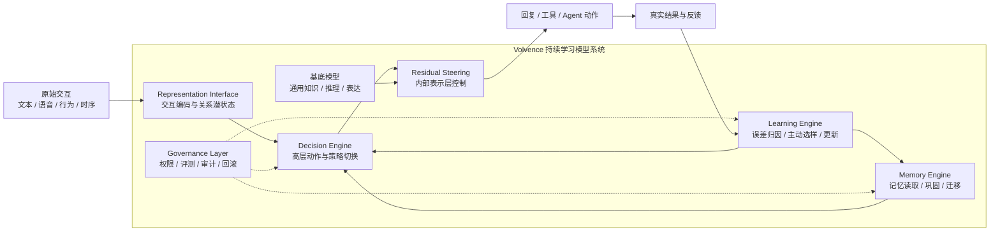
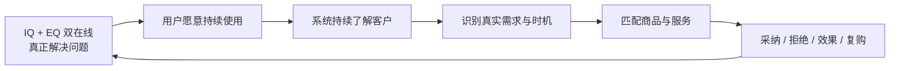
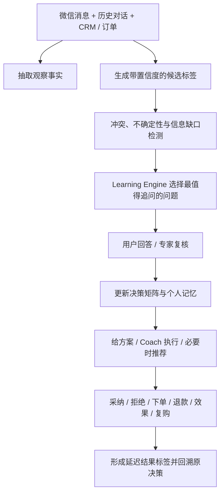

# 进化涌现

## Volvence：持续学习型大语言模型

### 开启通用人工智能新纪元

> 日期：2026-07-23  
> 项目名称：进化涌现  
> 产品名称：Volvence  
> 用途：融资 BP 母稿；与 15 页 Pitch Deck、Roadshow Script 使用同一口径  
> 对外命名：只使用 Volvence 品牌术语，不出现外部架构缩写  
> 证据原则：区分理论基础、工程方案、已验证结果与未来里程碑

---

## 1. 执行摘要

Volvence 构建的是一个可治理、具备持续学习能力的模型系统，让模型在部署后仍能从真实交互中形成：

**目标 → 感知 → 决策 → 行动 → 反馈 → 学习**

基础模型让机器拥有通用知识和表达能力；Volvence 让机器拥有可积累、可迁移、可审计的经验。

我们的技术由三个认知引擎和一个表示接口构成：

- **Volvence-Decision Engine**：将逐 Token 反应提升为高层动作、策略切换和长程决策。
- **Volvence-Memory Engine**：在多个时间尺度保存、巩固、迁移和隔离经验。
- **Volvence-Learning Engine**：主动选择最值得询问、标注和学习的反馈。
- **Volvence Representation Interface**：从原始交互估计关系潜状态，并用控制信号干预神经网络残差流。

我们首先用数字生命、数字顾问和行业 Agent 验证闭环，再将模型能力沉淀为标准化服务、API 和企业私有化版本。

---

## 2. 市场问题：大模型尚未形成经验

今天的大模型已经解决了大量通用知识、理解和生成问题，但仍存在三个结构性缺口。

### 2.1 学习停在部署之前

核心能力主要由预训练、监督微调和离线人类反馈训练获得。模型上线后可以调用工具、读取知识库，却很难把每一次真实结果稳定转化为长期能力。

### 2.2 闭环停在模型之外

目标设定、结果判断、反馈整理、错误归因和更新触发主要由人完成。模型执行了任务，但认知闭环仍依赖外部运营人员和工程流程。

### 2.3 关系停在语言表面

Prompt、RAG 和文本记忆擅长处理“说了什么”，但人际关系还包含语气与节奏、行为与结果、沉默与纠正、信任与边界、历史与变化。语言是交互的一个投影，不是关系状态本身。

因此，现有大模型更接近强大的即时工具，而不是能在长期关系与连续任务中积累经验的智能体。

---

## 3. 三道技术门槛与对应解法

| 技术门槛 | 问题本质 | Volvence 解法 |
|---|---|---|
| **反馈稀疏** | 高价值反馈少、贵、延迟且分布不均 | Learning Engine 主动选择高信息量样本与求助时刻 |
| **泛化与稳定** | 既要复用旧经验，又不能被短期噪声破坏 | Memory Engine 多时间尺度更新、巩固、隔离与迁移 |
| **语言维度不足** | 关系状态无法被文本完整表达 | 原始交互编码、关系潜状态和残差流干预 |

Decision Engine 是把三类能力转化为行动的中枢：它读取目标、当前潜状态和相关记忆，选择高层动作及其持续时间，再落成具体表达、工具调用或求助行为。

三组因果关系必须保持一致：

- 静态预训练问题，对应部署后的记忆形成与受控更新。
- 人类代做闭环问题，对应自主决策、结果归因和主动学习。
- 语言表达瓶颈，对应原始交互建模与内部表示层控制。

### 3.1 行业持续学习路线

持续学习不是一个空白领域。学术界和产业界已经形成多条路线，每条路线都解决了真实问题，但默认关注点不同。

| 行业路线 | 核心机制 | 主要价值 | 结构性上限 |
|---|---|---|---|
| **长上下文 / RAG / 向量记忆** | 保存历史内容并在推理时检索 | 实现成本低，能增加跨会话事实召回 | 检索不等于修正内部状态，也不自动形成策略、巩固和遗忘 |
| **EWC / SI / OWM 等正则化方法** | 限制会破坏旧任务的参数更新 | 缓解灾难性遗忘，保护旧能力 | 主要回答“怎么学而不忘”，不回答该学什么、为何行动和如何闭环 |
| **Replay / 生成式回放** | 重放真实或生成的历史样本 | 重建过去训练信号，平衡稳定性与可塑性 | 存储、隐私和训练成本较高；回放内容仍需要价值选择 |
| **Adapter / LoRA / Test-time Learning** | 在小型参数层或测试时状态上快速更新 | 避免重训基底，降低个体适配成本 | 解决更新载体，不自动解决目标、反馈归因、长期巩固和治理 |
| **RLHF / 在线偏好优化** | 用人类偏好或奖励改善输出策略 | 能优化行为与人类偏好的一致性 | 通常依赖大量人工组织反馈，且容易停留在输出层与离线周期 |
| **Agent Workflow / 工具编排** | 用外部流程、工具和规则组织任务 | 快速形成可交付业务流程 | 工作流本身不会从结果中自动形成可迁移的内部经验 |
| **世界模型 / 潜空间控制** | 在内部状态空间预测环境并规划行为 | 适合长程预测、抽象决策和内部控制 | 通常缺少 per-user 长期记忆、主动取数、跨时间尺度巩固和商业级治理 |

这些路线不是互斥关系。Volvence 会吸收其中可验证的机制，但不把任一单点方案等同于完整持续学习。

### 3.2 业界研究正在收敛的五个维度

基于团队此前对约 100 篇 Cognitive AGI 与持续学习核心论文的内部研究，我们将不同领域反复出现的共同方向归纳为五个维度：

1. **预测误差一级化**  
   系统不只记录结果，而是持续比较“预期发生什么”和“实际发生什么”。这个差值进入信用分配、主动学习和下一轮决策。

2. **Token 之上的内部控制**  
   自然语言是表达空间，不应承担全部决策空间。长期策略需要更低维、更稳定、更可门控的内部状态和动作表示。

3. **记忆成为架构**  
   记忆不只是推理前检索几段文本，而要参与当前状态形成，并具备写入、更新、巩固、衰减、冲突处理和迁移边界。

4. **结构从长期交互中涌现**  
   有意义的动作抽象、技能和策略持续时间，应当从经验中形成，而不是由工程师预先枚举所有规则。

5. **有界修改与只读评估**  
   在线系统可以变化，但修改必须有权限、预算、版本、审计、隔离和回滚。评测通道只负责判断，不能把测试答案反向泄漏为学习信号。

这五个维度是 Volvence 的研究归纳，不是某个标准组织发布的行业规范。其价值在于提供一个统一坐标系，判断各种“持续学习”方案究竟覆盖了什么、遗漏了什么。

### 3.3 五维覆盖对比

| 路线 | 预测误差 | 内部控制 | 架构记忆 | 涌现结构 | 有界修改 / 只读评估 |
|---|:---:|:---:|:---:|:---:|:---:|
| 长上下文 / RAG | 部分 | 通常不覆盖 | 部分 | 通常不覆盖 | 部分 |
| 防遗忘 / Replay | 部分 | 部分 | 核心 | 部分 | 部分 |
| Adapter / Test-time Learning | 部分 | 核心 | 部分 | 部分 | 部分 |
| RLHF / Agent Workflow | 部分 | 部分 | 通常不覆盖 | 部分 | 部分 |
| 世界模型 / 潜空间控制 | 核心 | 核心 | 部分 | 核心 | 部分 |
| **Volvence** | **核心** | **核心** | **核心** | **核心** | **核心** |

该表比较的是每条公开路线的默认机制重心，而不是断言所有具体实现都相同。Volvence 的核心差异也不是在五个方向之外再发明一个孤立算法，而是：

**把五个维度组织为同一个在线闭环，让预测误差驱动学习，让学习影响记忆和决策，让内部控制影响行动，同时让每次修改都受治理。**

---

## 4. 产品定义：持续学习模型系统

Volvence 是一个完整模型系统，内部由可替换的基底模型与 Volvence 自有持续学习模块共同构成：

1. 基底模型提供通用知识、推理和语言能力。
2. Representation Interface 从原始交互中估计关系与任务状态。
3. Decision Engine 读取记忆并形成跨时间尺度的高层决策。
4. Learning Engine 从真实结果中识别误差并选择高价值反馈。
5. Memory Engine 将可信经验分层沉淀并控制遗忘和迁移。
6. Governance Layer 管理权限、审计、版本、评测和回滚。



Volvence 对外交付的是完整模型能力，而不是要求客户自行拼装多个组件。

---

## 5. 模型系统部署架构

Volvence 采用“线上模型服务 + 持续学习中心 + 共享治理”的简化部署方式。

### 5.1 线上模型服务

线上服务承担低延迟推理：

1. 交互编码模块将文本、语音、行为和时序信号编码为当前潜状态。
2. Memory Engine 读取与当前用户和任务相关的记忆。
3. Decision Engine 结合目标、潜状态和记忆选择高层动作。
4. 基底模型接收控制信号，在残差流层面完成调制并生成回复、工具或 Agent 动作。

### 5.2 持续学习中心

持续学习中心异步处理真实反馈：

1. 反馈与事件流汇集显式纠正、任务结果和延迟反馈。
2. Learning Engine 完成误差归因、主动选样和人类求助。
3. Memory Engine 完成记忆巩固；训练服务更新控制器或适配层。
4. 只有通过离线评测和安全门控的模型与记忆版本才发布到线上。

### 5.3 治理与版本

治理中心横跨线上服务和持续学习中心，负责权限、数据隔离、只读评测、审计、版本管理和回滚。在线请求不会触发整个模型的即时重训，避免一次噪声反馈直接污染长期能力。

### 5.4 为什么要直接干预残差流

如果系统只改 Prompt，它只能在语言明确表达出来以后进行控制。Volvence 先从原始交互中估计无法被一句话完整描述的关系潜状态，再将该状态转成控制向量，作用于基底模型的残差流。

这样做的目标不是“读心”，而是利用经授权、可观察的交互证据，对模型内部表示进行更细粒度的条件化。例如，同一句文字在不同历史、节奏和信任状态下，应当产生不同的策略与表达。

该路线需要用消融实验验证：与 Prompt、RAG、文本记忆和外部重排序基线相比，内部控制是否在关系一致性、任务成功率、稳定性和安全性上产生可重复增益。

---

## 6. 四项核心技术

### 6.1 Volvence-Decision Engine：怎么决策

核心思想是先决定“采取什么高层动作”，再生成具体 Token 或工具调用。决策空间从海量语言序列收缩为可学习、可解释的策略动作，使长程规划、策略持续时间和层级信用分配更清晰。

它解决的不是模型“会不会说”，而是系统何时探索、何时求证、何时执行、何时等待、何时向人求助。

### 6.2 Volvence-Memory Engine：什么值得留下

核心思想是多时间尺度学习：

- 快层适应当前交互；
- 中层形成会话与阶段性模式；
- 慢层巩固反复验证的长期结构；
- 隔离层保存冲突、高风险或低置信经验。

Memory Engine 负责保存、巩固、遗忘控制、迁移边界和跨用户隔离。迁移学习为“旧经验如何帮助新任务”提供理论方向，但迁移学习本身不等于记忆系统。

### 6.3 Volvence-Learning Engine：下一步学什么

核心思想是不平均对待所有样本，而是选择能最大幅度减少不确定性、降低风险或提升长期收益的反馈。

当系统置信度足够高时自主执行；当关键决策不确定或风险过高时，主动向用户或专家求助。求助本身也是一种动作，需要权衡信息价值、成本、时延和风险。

### 6.4 Volvence Representation Interface：如何进入模型内部

核心思想是将文本、语音韵律、行为、时序、任务结果和历史变化编码为关系潜状态，再生成对残差流的门控控制信号。

它连接了“真实交互世界”和“神经网络内部表示”，使 Volvence 不局限于 Prompt 工程或文本记忆。

---

## 7. 模型、数据、标注与 Agent 体系

### 7.1 模型与数据的关系

- 基底模型提供通用知识、推理和表达先验。
- Volvence 自有模块提供关系状态、决策、记忆、学习和治理。
- 数据不是一次性训练燃料，而是持续产生、筛选、验证和沉淀的经验。
- 专有资产不是原始日志数量，而是高价值反馈策略、长期结果标签和可迁移结构。

### 7.2 数据如何收集

- 用户与 Agent 的连续交互和工具轨迹；
- 显式纠正、选择、拒绝和安全接管；
- 任务成功、后验验证、转化和延迟结果；
- 经授权的语音韵律、节奏、行为事件与关系变化信号；
- 专家对关键决策的示范、比较和纠偏。

所有采集遵循授权、目的限定、最小化、脱敏、保留期限、可删除和跨用户隔离原则。

### 7.3 数据如何标注

- 从任务结果和后验行为生成弱标签；
- 由模型提出候选归因，人类确认分歧；
- Learning Engine 对不确定性、风险和潜在收益评分；
- 只将高价值样本送给普通标注、领域专家或用户本人；
- 对长期效果使用延迟标签，避免只优化即时满意度。

### 7.4 Agent 体系

对外是数字生命、数字顾问或数字员工；对内是由基底模型和 Volvence 持续学习模块共同构成的完整模型系统。

Agent 的核心不是拥有多少工具，而是能否把工具结果变成下一轮决策和长期经验。

### 7.5 两个核心价值

#### 核心价值一：Panorama 决策支持

真实用户带来的通常不是边界清楚的标准问题，而是一个目标冲突、信息缺失、根因不明且涉及多方利益的决策情境。

Panorama 通过决策平衡计分卡与用户共同完成：

1. **共同建模**：明确目标、约束、利益相关方、评价维度和不确定性。
2. **共同推演**：比较不同方案及其短期收益、长期影响、风险与机会成本。
3. **共同收敛**：逐步排除不成立的假设，形成当前证据下可执行的选择。
4. **共同探索**：当现有方案都不理想时，继续寻找新的信息、路径和可能性。

AI 在这一过程中具备三项主动能力：

- **自动研究**：围绕问题检索、整理和比较外部知识与证据。
- **自动补齐决策矩阵**：发现缺失维度、备选方案、风险和评价依据。
- **主动追问根因**：识别关键事实缺口，并向用户收集真正影响决策的情况。

Panorama 的交付不是一份静态报告，而是用户与 AI 共同形成的、可以继续更新的决策模型。

#### 核心价值二：高情商认知与 Coaching

正确的分析不一定能带来正确的处理。Volvence 还要理解：

- 这件事对不同的人分别意味着什么；
- 应该如何表达，才能减少对抗并保留关系；
- 什么时候推进、什么时候等待、什么时候停止；
- 决策执行后如何观察结果、修复偏差并继续调整。

因此模型不只回答“应该选什么”，还会 Coach 用户把选择转化为沟通、行动、复盘和最终结果。这要求 IQ 与 EQ 同时在线：IQ 负责分析问题，EQ 负责理解人、关系、时机与边界。

### 7.6 从解决问题到陪伴电商

Volvence 的电商不是从推荐商品开始，而是从持续解决问题开始：



完整因果链是：

**要形成电商，必须知道需求；要知道需求，必须了解客户；要了解客户，必须让客户持续使用；要让客户持续使用，就必须真正解决问题；要解决复杂问题，就必须 IQ 与 EQ 双在线。**

Panorama 提供决策 IQ，高情商认知与 Coaching 提供关系 EQ。两者共同创造长期使用价值；长期使用产生真实、连续、可验证的需求数据；需求数据再驱动合适的商品与服务匹配。

交易不是终点。用户是否采纳、是否有效、是否反感、是否复购，会继续反馈到决策支持和 Coaching 模型中。由此形成：

**问题解决越有效 → 用户使用越长期 → 客户理解越深入 → 需求识别越准确 → 服务匹配越有效 → 产生更多真实反馈 → 模型解决问题的能力越强。**

### 7.7 已完成的证明、消融与验证边界

Volvence 当前已经形成一套“主张—matched control—验收门—证据包”的内部验证方法。以下数字来自当前仓库中的 ETA paper suite、真实模型 510 轮长测和本次定向测试复跑，只证明对应机制，不外推为留存、转化或收入结论。

| 主张 | 对照 / 消融 | 当前证据 | 判断 |
|---|---|---|---|
| 完整内部强化学习优于去除关键环节的系统 | strongest control：`full-no-fast-prior` | 7/7 gates；held-out strong-success gap `+0.024` | **retain** |
| 增益来自真实参数学习 | `no-optimize` | 完整模型回报提升 `+1.5503`；不更新对照 `0` | **retain** |
| 稀疏、延迟反馈仍可学习 | reward leakage 检查 | reward sparsity `1.0`；shaping leakage `0.0` | **retain** |
| 慢循环能改善快路径 | 去除 slow-to-fast 信号 | initialization benefit `0.9625`；long-horizon payoff coverage `0.5` | **retain** |
| 无先验脚手架仍能自动形成时间抽象 | `no-fast-prior` | held-out reuse gap `0`；credit gap `0` | **weak**，不可作强主张 |

真实模型长测使用 `Qwen2.5-1.5B` 链路，共 510 轮、509 条真实 trace。CMS 在 shadow 模式下完成 2,274 次 pure/torch 对齐检查，通过率 100%；旧知识保持窗口均值为 `0.9999499`，晋级门判断为 promotable。该结果说明当前受控更新没有观察到明显灾难性遗忘，但不等于已经证明开放域、无限期无遗忘。

末段 200 轮预测头结果如下：

| 预测轴 | Learned MAE | Baseline MAE | 结果 |
|---|---:|---:|---|
| task progress | 0.0268 | 0.0366 | 优于基线 |
| action payoff | 0.0249 | 0.0386 | 优于基线 |
| relationship delta | 0.0098 | 0.0121 | 优于基线 |
| regime stability | 0.0124 | 0.0090 | **弱于基线** |

本次定向复跑覆盖四类 VZ-MemProbe、多人关系、`feeling_about_other` matched control 和延迟归因测试，结果为 **31 passed / 1 failed**。失败项不是简单的能力分数下降，而是激活 `feeling_about_other` 后新增影响 `social_prediction`，但该依赖未登记在契约白名单中。发布前需要补齐依赖声明、复跑 matched control，并确认没有非预期传播。

当前不能宣称的内容：

- 不能宣称无 fast-prior 脚手架的时间抽象已经被充分证明；
- 不能宣称所有预测轴都优于基线；
- 不能把本地长测平均每轮 `13.26s` 当作生产时延；
- 不能用机制测试替代 AI 微信销售、数字分身或育儿专家的留存、任务成功率、转化和收入 A/B 实验。

因此，现阶段最准确的投资人表述是：**关键闭环机制已经出现可重复的正向信号，并具备严格消融和失败发现能力；产品规模、开放域泛化与商业结果仍是融资后需要完成的验证。**

### 7.8 模型参数规模与数据标注流程

#### 两代参数口径

| 口径 | 当前验证版 | Volvence 1.0 主力 API 版 |
|---|---:|---:|
| 基底模型 | `Qwen2.5-1.5B` | **14B 开源基底** |
| Volvence 自有参数 | 独立微型实验配置，尚未统一总口径 | **500M 可训练参数** |
| 总参数 | 约 **1.5B**，外加实验控制器 | 约 **14.5B** |
| 决策潜空间 | `n_z=4 / 8` | `z=512` |
| 控制器专家 | 单控制器机制验证 | `K=32`，每轮 `top-k=2` |
| 记忆时间尺度 | 3层 | `T=4` |
| 证据状态 | 已运行510轮真实链路 | 发布规格，尚待产品验收 |

因此，对外应使用两个不混淆的表述：

- **当前系统**：运行在 `Qwen2.5-1.5B` 基底上的持续学习机制验证版，约15亿基底参数，外挂独立研究控制器。
- **Volvence 1.0 主力 API 版**：`14B` 基底加 `500M` 自有持续学习参数，总参数约 **14.5B**。
- **Volvence 1.0 Mini**：`3B` 基底加 `100M` 自有参数，总参数约 **3.1B**，面向端侧、私有部署和成本敏感场景。

#### 当前各模块的具体形式与参数量

Volvence 不是“一个基底模型加四个同等规模的神经网络”。系统同时包含神经网络、非参数记忆、算法服务和确定性治理模块。

| 模块 | 当前实现形式 | 是否为神经网络 | 当前默认参数量 |
|---|---|:---:|---:|
| **基底模型** | Transformer 语言模型 | 是 | 当前真实链路验证使用 `Qwen2.5-1.5B` |
| **Decision Engine：结构发现** | GRU Encoder + posterior mean/log-variance heads + learned prior heads + Switch Gate + two-layer Residual Decoder | 是 | **724** |
| **Decision Engine：策略学习** | `z_t` 潜空间中的两层 MLP Gaussian Policy + 两层 MLP Critic | 是 | **313** |
| **Memory Engine：CMS** | online-fast、session-medium、background-slow 三个两层残差 MLP | 是 | **264 × 3 = 792** |
| **Memory Engine：更新门** | 12 维基础特征或 16 维 PE-aware 特征 → 8 维隐藏层 → 7 个更新决策 | 是 | 默认 **167**；PE-aware **199** |
| **Memory Store** | 用户记忆、语义索引、来源、置信度、版本和权限元数据 | 否 | 不以神经参数计；按存储容量计 |
| **Learning Engine** | 主动选样、预测误差、不确定性/风险评分、标注路由和训练编排 | 当前不是独立网络 | **0 个独立参数** |
| **Representation Interface** | 读取基底残差流和特征面，生成关系/任务状态并接收控制信号 | 当前不是独立网络 | **0 个独立参数**；Residual Decoder 已计入 Decision |
| **Governance Layer** | 权限、只读评测、审计、版本、发布门控和回滚 | 否 | **0** |

计算口径：

- Decision 结构发现网络的 724 个参数来自当前默认配置：`input_dim=3`、`hidden_dim=8`、`n_z=8`、`action_dim=3`。
- PPO Policy/Critic 的 313 个参数来自：`n_z=4`、`hidden_dim=16`、`obs_dim=6`。
- 每个 CMS Band 在 `d_in=8`、`d_hidden=16` 下为 `8 + 2 × 8 × 16 = 264` 个参数，三层共 792。
- 默认 Meta-updater 为 `12 × 8 + 8 + 8 × 7 + 7 = 167` 个参数；PE-aware 版本为 `16 × 8 + 8 + 8 × 7 + 7 = 199`。

这些数字来自各组件当前独立的研究/验证配置，不能直接相加成当前外挂参数总数：结构发现网络默认 `n_z=8`，PPO 实验默认 `n_z=4`。Volvence 1.0 主力版将统一为 `z=512`，按500M自有参数预算重新实现和联合训练。

#### 哪些能力不是单独模型

- **Panorama** 不是另一个基础模型。它是基底模型、自动研究工具、决策平衡计分卡、Decision Engine 和用户交互流程的组合。
- **EQ** 不是一个独立“情绪模型”。它来自 self/relationship 预测轨、关系状态、Memory、Decision 和基底表达能力的联合工作。
- **Learning Engine** 的核心价值是决定“哪个数据值得标、何时向人求助、哪种更新可以发布”，而不是靠自身参数规模。
- **Governance** 必须保持确定性和可审计，不应改造成不可解释的神经网络。

#### 可选 Adapter / LoRA

系统允许在离线 rare-heavy 路径训练有界 LoRA，当前默认 `rank=8`，基底保持冻结。其参数量取决于目标矩阵：

**每个目标矩阵参数量 = `rank × (输入维度 + 输出维度)`**

总参数量还需乘以实际挂载的矩阵数和层数，因此只有在 Volvence-1 的基底、目标模块和挂载层确定后才能准确给出。

当前工程材料能够确认的是，真实链路已使用 `Qwen2.5-1.5B` 验证。3B适合轻量对话和垂直任务，但对于开放域 Panorama 自动研究、复杂决策推演、根因追问和高情商 Coaching，容易先遇到基底知识、推理与表达能力上限。因此主力版以14B为工程目标，3B保留为Mini版。

正式发布前，应对14B主力候选与3B Mini、7B中间组进行 matched-control 验收，测量：

- Panorama 复杂决策质量；
- 高情商认知与 Coaching 质量；
- 长期记忆和反馈学习增益；
- 推理时延、显存、吞吐和单位调用成本；
- Volvence 模块相对普通基底带来的净增益。

最终选择原则是**最小有效规模**，而不是单纯追求更大的参数量。

#### 产品化扩维：Mixture-of-Controllers

当前几百参数的控制器和记忆 MLP 是机制验证规模，不能直接承担开放域 Panorama、EQ Coaching 和长期个体化。

产品化架构更接近 **Mixture-of-Controllers（稀疏控制器专家）**，而不是传统 Transformer MoE：

- 传统 MoE 在基底模型内部为 Token 计算路由不同前馈专家；
- Volvence 保持基底相对稳定，在基底之上按关系状态、问题阶段和抽象动作路由小型控制器专家；
- 每次只激活 Top-k 专家，不让所有专家同时参与；
- IQ 与 EQ 共享交互表示，但保持 world/task 与 self/relationship 两条预测误差和记忆路径；
- 快、中、慢、极慢时间尺度共享策略专家，不为每个时间尺度复制一整套模型。

近似参数公式：

```text
P_total
≈ P_shared_encoder
+ K × P_policy_expert
+ T × P_memory_band
+ P_router
+ P_residual_interface
```

其中：

- `z`：决策潜空间维度；
- `h`：控制器隐藏层宽度；
- `K`：策略专家数量；
- `T`：记忆时间尺度数量；
- `top-k`：单次交互实际激活的专家数。

如果把 IQ/EQ、场景、策略和时间尺度做完整乘法，参数会接近：

```text
P_naive ∝ Track × Scenario × Strategy × Timescale × ExpertSize
```

这条路不仅参数爆炸，也会导致每个组合的数据极度稀疏。Volvence 应采用因子化结构：

```text
共享表示 + 双轨状态 + 稀疏策略专家 + 分层记忆
```

Volvence 1.0 主力 API 版的发布配置：

| 维度 | 建议起点 | 作用 |
|---|---:|---|
| 潜空间 `z` | 512 | 表示抽象动作、关系与策略状态 |
| 控制器宽度 `h` | 2048 | 支撑复杂状态到决策的映射 |
| 策略专家 `K` | 32 | 覆盖跨场景探索、分析、计划、支持、修复与边界动作族 |
| 单次激活 `top-k` | 2 | 保持推理成本和行为可解释 |
| 时间尺度 `T` | 4 | online / session / background / rare-heavy |
| 自有可训练参数 | **500M** | Volvence 1.0 主力版工程预算 |
| 基底参数 | **14B** | 共享知识、推理与语言表达 |
| 总参数 | **约14.5B** | 基底加自有神经参数 |

500M 的规划构成为共享状态编码与残差接口、32个稀疏决策专家、4层神经记忆与更新门、长期世界/关系模型，以及路由、价值和预测头。每轮只激活2个策略专家，因此总参数容量扩大不等于推理成本同比扩大。

数据规模与模型参数不是线性关系。原始对话、用户事实、事件和证据进入可授权、可删除的外部记忆；模型参数只吸收跨用户可迁移的结构、策略和规律。规模化时按以下顺序扩展：

1. 增加非参数记忆、索引和数据吞吐；
2. 增加专家覆盖和每个专家的有效训练数据；
3. 当验证集损失和能力曲线出现容量饱和时，再扩大 `z / h / K` 或基底；
4. 不按用户数复制模型，也不把每条用户事实写入权重。

该发布规格能否达到目标，不能只凭结构推导得出。必须通过五组扩维曲线和发布门验证：

1. Panorama 决策质量是否随 `z / h / K` 增长而提升；
2. EQ Coaching 是否优于仅使用基底模型；
3. 长期记忆是否提高跨会话任务成功率且不增加错误记忆；
4. 主动学习是否在相同人工标签预算下优于随机选样；
5. 新增参数带来的效果是否覆盖延迟、显存和推理成本。

只有某个维度出现明确容量瓶颈时才在500M预算内重新分配。例如策略混淆严重时增加专家份额，状态表达不足时增加共享编码份额，长期遗忘时增加记忆份额。若14B + 500M未通过验收门，应调整结构或延后发布，而不是用参数规模替代能力证明。

### 7.9 微信育儿专家 / 数字分身的自动标注与数据产能

假设用户在微信中告诉 AI 育儿专家：

> 宝宝 8 个月，最近总是夜醒，我白天还要上班。

系统不会直接生成一个“用户需要购买睡眠产品”的标签，而是按证据等级形成四类标签。

| 标签层级 | 标签示例 | 来源 | 使用规则 |
|---|---|---|---|
| **观察事实** | 宝宝 8 个月、夜醒、用户白天上班 | 用户原话、CRM、订单事件 | 可作为事实，但保留来源与时间 |
| **模型候选** | 可能睡眠倒退、用户压力较高、可能存在购买需求 | 模型推断 | 不能当真值；必须带置信度和反证条件 |
| **用户确认** | 每晚醒 4 次、夜奶、已持续 3 周、预算范围 | AI 主动追问后由用户确认 | 可进入个人记忆；允许用户纠正和删除 |
| **结果标签** | 方案被采纳、下单、退款、使用有效、复购 | 行为、订单、随访和任务结果 | 用于验证此前需求、时机与方案判断 |

自动标注过程：



具体规则：

1. 对用户明确表达和系统事件使用确定性标签。
2. 对需求、根因、情绪和关系状态只生成候选标签。
3. Learning Engine 根据不确定性、风险和信息价值决定是否追问。
4. 用户回答后更新 Panorama 决策矩阵；医疗、安全等高风险标签交给专家。
5. 购买不能单独定义成功，必须结合退款、使用效果、关系变化和复购。
6. 个人标签只进入该用户的授权记忆；跨用户训练只能使用经过授权和脱敏的样本。
7. 训练数据与只读评测数据严格隔离。

每条进入长期记忆或模型更新的数据都应带有来源、时间、授权范围、置信度和版本信息，从而支持删除、隔离、审计与回滚。

#### 一条轨迹具体标什么

| 标签面 | 字段示例 | 监督来源 |
|---|---|---|
| 用户与环境事实 | `child_age=8m`、`night_waking=true`、`employment=working` | 用户原话、CRM和事件系统 |
| 目标与约束 | 睡眠改善、时间预算、价格预算、禁忌、不可接受方案 | 用户确认 |
| 问题结构 | 问题阶段、根因候选、缺失变量、证据支持与反证 | Panorama + 用户补充 |
| 世界状态 | 任务进展、环境变化、方案执行条件 | 后续事件和随访 |
| 关系与自我状态 | 压力、信任、边界、表达接受度、关系变化 | 模型候选 + 用户行为校准 |
| 决策动作 | 追问、研究、解释、安抚、制定计划、推荐、停止推进 | 系统日志 |
| 即时反馈 | 回复、忽略、反驳、确认、点击、下单、退款 | 行为与交易事件 |
| 延迟结果 | 1/7/30日效果、任务是否解决、复购、投诉、关系变化 | 随访、CRM和订单 |
| 学习元数据 | 来源、时间、授权、置信度、风险、模型版本、人工修订 | 数据治理系统 |

一个训练样本不是孤立的一问一答，而是：

```text
状态 + 目标 + 缺失信息 + 模型动作
+ 用户即时反馈 + 延迟结果 + 关系变化
+ 证据来源 + 权限 + 置信度
```

这套轨迹同时监督 Decision Engine 的动作选择、Memory Engine 的写入与遗忘、Learning Engine 的追问选择，以及残差流接口对表达和关系的调节。

#### 千万级数据如何标

数据量大时不能依靠全量人工标注，而应采用五级漏斗：

| 层级 | 处理方式 | 预计占比 | 人工成本 |
|---|---|---:|---:|
| L0 确定性事件 | 规则读取订单、退款、点击、时间和明确字段 | 约40% | 接近0 |
| L1 模型抽取 | 事实、候选需求、问题阶段和关系状态 | 约45% | 仅计算成本 |
| L2 用户确认 | AI主动追问，把高价值候选变成确认标签 | 约12.5% | 融入产品交互 |
| L3 普通复核 | 主动学习选择高不确定、高影响样本 | 约2%或更低 | 约3-8元/条 |
| L4 专家复核 | 育儿、医疗、安全和高风险决策 | 约0.5%或更低 | 约20-80元/条 |

这里的占比是数据工程规划值，正式投放后应根据风险和主动学习命中率调整，而不是固定配额。

#### 是否需要合成数据

需要，但合成数据只用于真实数据覆盖不足的区域：

- 产品冷启动时生成完整决策轨迹和不同用户表达；
- 为同一事实生成反事实动作，训练“什么时候不推荐、什么时候停止”；
- 放大投诉、误导、越界、医疗安全等低频高风险情形；
- 构造跨场景迁移和长期延迟反馈压力测试；
- 为每个真实失败样本生成受约束的邻域变体。

建议合成数据不超过训练混合的 **30%**，并带 `synthetic=true`、生成模型、提示词、规则和验证版本。合成数据必须经过规则或专家过滤，不进入只读评测集，不能用于证明真实业务效果，也不能替代用户确认和延迟结果。

#### 需要多少钱、多少人

以全网6000万可触达用户中1%形成有效使用、首年约1200万次有效交互为测算基线：

| 项目 | 首年规模 | 预算区间 |
|---|---:|---:|
| 模型抽取、清洗、脱敏与存储 | 1,200万次交互 | 100万-300万元 |
| 普通人工复核 | 约20万条 | 60万-160万元 |
| 领域专家复核 | 约4万条 | 80万-320万元 |
| 数据工程、标注运营与质量团队 | 10-15人 | 350万-650万元 |
| **合计** | 形成约9,000万结构化机器标签 | **约600万-1,450万元** |

核心常设团队建议包括3-4名数据工程师、2-3名机器学习/主动学习工程师、3-4名标注运营与质检、1名隐私合规负责人和1-2名领域专家负责人；普通标注与专业审核按需弹性采购。上述数字为BP规划预算，不是已经发生的历史成本。

#### 6000万全网可触达用户能否支撑

可以成为非常强的**分发、交互和结果回流出口**，微信只是其中一个渠道。但6000万触达量不能直接等同于6000万独立用户或可训练用户，必须先跨平台去重，再按保守漏斗测算：

| 转化阶段 | 规划口径 |
|---|---:|
| 全网可触达用户底座 | 6,000万 |
| 1%完成明确授权并形成有效使用 | 60万用户 |
| 人均20次有效交互 | 约1,200万次交互 |
| 每次形成7-8个结构化信号 | 约9,000万机器标签 |
| 主动学习送普通复核 | 约20万条 |
| 高风险专家复核 | 约4万条 |

这套业务底盘足以支撑 Volvence 1.0 的第一阶段产品训练和闭环验证，因为14B基底不是从零预训练，业务数据主要用于训练500M持续学习模块、场景适配、策略学习和评测。真正需要验证的不是粉丝总数，而是：

- 可触达粉丝中有多少愿意授权并持续使用；
- 有多少交互能拿到1/7/30日结果，而不只是一轮聊天；
- 用户确认与业务事件能否纠正模型候选标签；
- 主动学习是否真的降低每个有效监督信号的成本；
- 训练许可、隐私隔离、删除权和微信平台规则是否完整落实。

因此，对投资人的准确表述是：**我们拥有6000万全网可触达用户底座；按1%的授权有效转化，即可形成60万有效用户、千万级真实交互和近亿级结构化监督信号。它是强大的冷启动优势，但最终壁垒来自跨平台去重、授权率、结果回流率和学习效率，而不是触达数字本身。**

---

## 8. 理论基础与杨柳研究

杨柳毕业于美国卡内基梅隆大学计算机学院机器学习系，博士论文为 `Mathematical Theories of Interaction with Oracles`，研究人机交互与学习过程的复杂度，答辩委员会成员包括图灵奖得主 Manuel Blum。根据团队提供的履历，她在主动学习、强化学习和迁移学习方向发表顶会顶刊论文 30 余篇。

她的研究集中回答两个关键问题：

1. 当标注昂贵时，机器如何主动选择最有信息量的反馈？
2. 当任务变化时，机器如何复用过去结构并获得泛化保证？

代表性工作及其与 Volvence 的关系：

| 研究方向 | 代表工作 | 理论贡献 | 对应产品问题 |
|---|---|---|---|
| 主动学习 | `Surrogate Losses in Passive and Active Learning` | 用替代凸损失改善学习效率 | 高效优化 |
| 主动学习 | `Minimax Analysis of Active Learning` | 用 Star Number 刻画样本复杂度 | 稀疏反馈下的可学习性 |
| 复杂分布 | `Active Learning with Identifiable Mixture Assumptions` | 研究混合假设下的主动学习 | 复杂真实分布下选样 |
| 学习边界 | `Bandit Learnability can be Undecidable`，COLT 2023 | 研究 Bandit 学习的可判定边界 | 明确序贯学习适用范围 |
| 主动求助 | `Reliable Active Apprenticeship Learning`，ALT 2025 | 不确定时向人求助并控制求助成本 | 高风险场景的人机协同 |
| 人类反馈 | `Active RLHF` | 用主动选样减少奖励模型标注 | 降低人类反馈成本 |
| 迁移学习 | 贝叶斯先验逐步估计相关工作 | 从先验无关学习过渡到先验相关学习 | 新任务复用过去结构 |

正式对外材料发布前，应依据杨柳最终学术简历逐项核验论文正式题名、作者顺序、年份、期刊会议、发表状态和数量统计。

### 8.1 论文与公司技术的边界

论文提供数学工具和理论依据；进化涌现的产品创新是把主动选样、长期决策、多时间尺度记忆、原始交互建模、残差流控制和安全治理集成为可运行的 Volvence 模型系统。

因此应表述为“Volvence 建立在团队长期研究之上”，不应表述为“某篇论文已经证明整个 Volvence 产品成立”。

---

## 9. 团队

| 成员 | 角色 | 代表经历 | 核心职责 |
|---|---|---|---|
| **赵江波** | 创始人 / CEO / 董事长 | 北京大学计算机本科、光华管理学院 MBA；连续创业者，具有商业化成功退出经验；长期参与元强化学习与认知智能产品路线 | 共同负责模型如何学习：定义学习目标、状态/反馈口径、奖励信号、IQ/EQ决策目标和业务结果回传；同时负责战略、产品、6000万业务底座与商业化 |
| **杨柳** | 联合创始人 / 首席科学家 | CMU机器学习博士；研究人机交互与学习复杂度；博士答辩委员会成员包括图灵奖得主 Manuel Blum；曾在 IBM、耶鲁大学从事博士后研究；研究成果40余篇，其中A级顶会顶刊18篇、主动学习/强化学习/迁移学习相关顶会顶刊30余篇 | Decision Engine、Learning Engine、迁移泛化的理论和算法路线；定义可学习性、样本复杂度与数学边界 |
| **马志刚** | 研究院院长 | 北京大学计算机软件与理论专业本博连读，微软学者奖学金获得者；2012年加入字节跳动创始初期团队，作为核心技术骨干参与今日头条推荐算法引擎架构；历任斯伦贝谢、腾讯、启元实验室技术岗位，参与地图渲染、街景重建、推荐与大型系统项目 | 把学习理论变成模型机制；统筹认知闭环、Decision、Memory、Learning、Residual Steering与模型更新边界 |
| **张驰** | 联合创始人 / CTO | 19岁毕业于清华大学计算机专业；进化涌现产品总架构师 | 规模化训练、数据与推理基础设施、API、生产性能、企业部署、标准化交付和跨行业复制 |

团队共同完成一条连续交付链：

**理论可行 → 架构可运行 → 产品可使用 → 商业可复制**

团队组合的稀缺性不在于简单罗列名校和大厂，而在于四项能力可以在同一条产品链中闭合：

1. 杨柳回答持续学习在稀疏数据下为何可学、需要多少反馈、迁移边界在哪里；
2. 马志刚把Decision、Memory、Learning和残差流接口组织为统一的模型学习机制；
3. 张驰把研究模型扩展为海量数据、高并发、可治理、可交付的大规模产品系统；
4. 赵江波定义模型学什么、什么算学会，并把模型能力接入真实产品、6000万全网用户底座，用任务、关系和商业结果持续校准学习目标。

对外正式版本仍应在尽调材料中补充每位成员的全职状态、任职证明、代表项目和阶段性交付责任。

### 9.1 代表成果与技术映射

| 成员 | 代表成果 / 经验 | 对应 Volvence 模块 |
|---|---|---|
| **杨柳** | `Minimax Analysis of Active Learning`提出Star Number；`Bandit Learnability can be Undecidable`发表于COLT 2023；`Reliable Active Apprenticeship Learning`研究何时自主行动、何时向人求助；Active RLHF降低奖励模型标注需求 | 主动选样、稀疏奖励、可靠求助、长期信用与迁移泛化 |
| **马志刚** | 计算机理论、推荐算法引擎、个性化建模、地图渲染与街景重建 | Decision、Memory、Learning、Residual Steering及模型如何从反馈形成经验 |
| **张驰** | 进化涌现产品总架构；模型产品端到端工程与标准化交付体系 | 数据事件流、训练基础设施、在线推理、API、性能、可靠性与私有化 |
| **赵江波** | 连续创业与商业化退出；元强化学习方向理解；全网6000万可触达业务底座 | 学习目标、奖励/反馈定义、IQ/EQ平衡、真实结果归因、产品与商业闭环 |

### 9.2 未来18个月责任到人

| 负责人 | M0-M6 | M6-M12 | M12-M18 |
|---|---|---|---|
| **杨柳** | 主动学习、迁移与可靠求助基准 | 规模消融与泛化边界 | 对外研究结果与持续学习评测标准 |
| **马志刚** | Mini认知学习闭环 | 统一Decision/Memory/Learning并完成14.5B学习机制 | 跨场景泛化、记忆巩固与模型更新标准 |
| **张驰** | 数据/训练/评测基础设施 | Open Mini、14.5B Beta、千万级交互与近亿级标签管线 | 主力Model API、生产SLO、企业部署、审计和回滚 |
| **赵江波** | 定义学习目标、反馈与成功指标；自有产品验证 | 用真实结果校准奖励与决策目标；开源生态和定向客户 | API商业化，并用留存/任务/关系/收入持续校准模型学习 |

---

## 10. 产品发布与商业化

Volvence 只走一条产品路线：

**发布模型 → 开源模型 → 提供标准 API 服务**

### 10.1 融资后 M0-M6：Volvence-1 Mini（3.1B）

第一阶段发布 `Volvence-1 Mini`：

```text
3B 开源基底 + 100M Volvence 持续学习模块 = 约3.1B总参数
```

该模型面向长期陪伴与复杂问题解决，提供两项核心能力：

1. **Panorama 决策支持**：与用户共同建模、研究、推演、探索和收敛。
2. **高情商 Coaching**：理解人、关系、时机和边界，陪用户把决策转化为行动与结果。

模型同时具备个人记忆、主动学习和从真实反馈中持续改进的能力。Mini版优先满足低成本推理、端侧/私有部署和垂直场景验证。第一阶段通过自有 AI 陪伴产品和小范围合作场景验证问题解决率、持续使用率和长期反馈闭环。

### 10.2 融资后 M6-M12：Open Mini（3.1B）与主力版 Beta（14.5B）

第二阶段开源 `Volvence-1 Open Mini`，参数口径保持为 `3B + 100M = 3.1B`，计划开放：

- 可部署的模型权重；
- 推理与持续学习基础代码；
- 标准输入输出接口；
- 基础评测集与评测方法；
- 开发者示例与 Agent 接入工具。

开源的目的不是一次性获取项目收入，而是建立持续学习模型的开发者生态、评测标准和事实上的接口标准。

正式开源范围需在发布前完成安全、隐私、许可证和核心知识产权评估。

同期完成 `Volvence-1` 主力 API 版 Beta：

```text
14B 开源基底 + 500M Volvence 持续学习模块 = 约14.5B总参数
```

主力版使用 `z=512`、32个稀疏控制器专家、Top-2激活和4个记忆时间尺度，重点验证开放域自动研究、复杂决策、高情商 Coaching、长期关系与跨场景迁移。

### 10.3 融资后 M12-M18：Volvence-1 Model API（14.5B）

第三阶段正式上线14.5B主力版 `Volvence-1 Model API`，对外提供：

- 持续学习模型推理；
- Panorama 决策支持；
- 高情商 Coaching；
- 用户授权下的个人记忆；
- 反馈学习、版本治理和安全控制。

开发者可以直接通过 API 将 Volvence 能力接入陪伴、顾问、电商或企业 Agent 产品。商业模式以14.5B主力API调用量计费为主，同时提供企业版，以及3.1B Mini或14.5B主力版的私有化部署。

最终交付可以用一句话概括：

**一个会持续学习、会辅助决策、会高情商解决问题的模型，以及任何产品都能够调用的 API。**

---

## 11. 护城河

1. **系统闭环**：原始交互、潜状态、决策、内部控制、结果归因、记忆巩固和治理全部打通。
2. **理论积累**：主动学习、迁移学习和强化学习由核心团队长期研究。
3. **数据复利**：积累高价值反馈选择策略、长期结果标签和可迁移结构，而非单纯日志规模。
4. **工程门槛**：在线学习同时满足低延迟、稳定性、隐私、审计、隔离和回滚。
5. **场景飞轮**：更长关系产生更可信反馈，更可信反馈改善服务，进一步提升关系长度与商业价值。

护城河不是“别人永远做不到”，而是 Volvence 更早将这些能力组成可运行、可评测、可商业化的闭环。

---

## 12. 融资用途与 18-24 个月里程碑

本轮资金不用于重训通用基础模型，而用于验证并放大持续学习闭环。

| 投向 | 建议占比 | 关键交付 |
|---|---:|---|
| 核心模型与系统研发 | 40% | 四项核心模块打通；形成版本化、可回滚的模型系统 |
| 数据、标注与评测 | 20% | 主动选样平台；长期任务、关系状态和安全评测集 |
| 产品与标杆场景 | 20% | 2-3 个可重复部署场景；验证关键商业指标 |
| 算力、安全与基础设施 | 10% | 在线推理、训练管线、权限、隔离、审计和回滚 |
| 关键人才与运营 | 10% | 补强算法、系统、产品和行业交付 |

需要完成三项可量化验证：

1. **学习效率**：相同标注预算下，优于随机采样和普通 RLHF 流程。
2. **长期能力**：在连续任务中优于 LLM + RAG / 文本记忆基线，并控制遗忘、漂移和错误写入。
3. **商业闭环**：至少一个标杆场景证明持续学习提升任务成功率、留存或收入。

正式融资版本仍需补齐融资金额、投前投后估值、资金跑道、当前基线、目标数值和季度拆解。

---

## 13. 核心风险与验证方式

| 风险 | 不能只靠叙事回答 | 验证方式 |
|---|---|---|
| 残差流干预未必优于外部控制 | 内部干预增加工程复杂度 | 与 Prompt、RAG、重排序和 Adapter 做消融对比 |
| 在线学习可能放大错误 | 错误经验会持续污染后续决策 | 置信门控、隔离区、版本化、离线评测和回滚 |
| 关系潜状态可能不可解释 | 容易产生错误推断或越界 | 只使用授权证据；输出置信度；允许用户查看和纠正 |
| 跨任务迁移可能造成负迁移 | 旧经验不一定适合新用户或场景 | 相似度门控、用户隔离、对照评测和拒绝迁移 |
| 商业价值可能不抵系统成本 | 技术增益不等于客户付费 | 在结果可观察场景验证单位经济性 |

主动写出风险，会让“可治理的持续学习”成为可信承诺，而不是口号。

---

## 14. 结论

基础模型让机器拥有知识，Volvence 让机器拥有经验。

我们的目标不是制造一个更会聊天的角色，而是建立一套让模型在真实世界中持续感知、持续决策、持续学习，并在治理边界内持续形成自己的基础设施。
