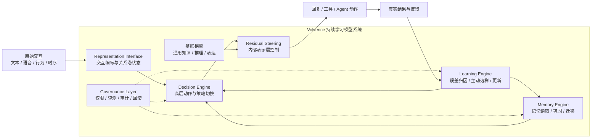
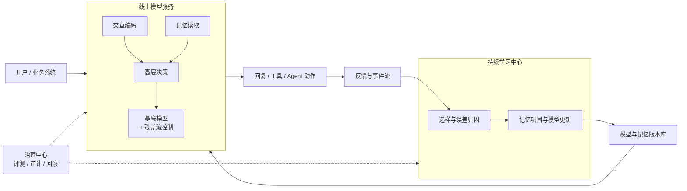
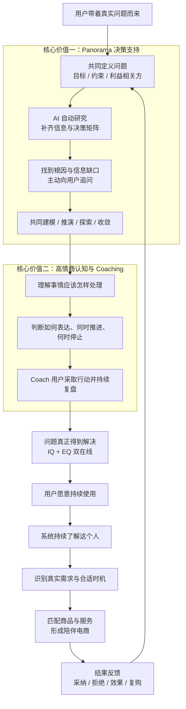
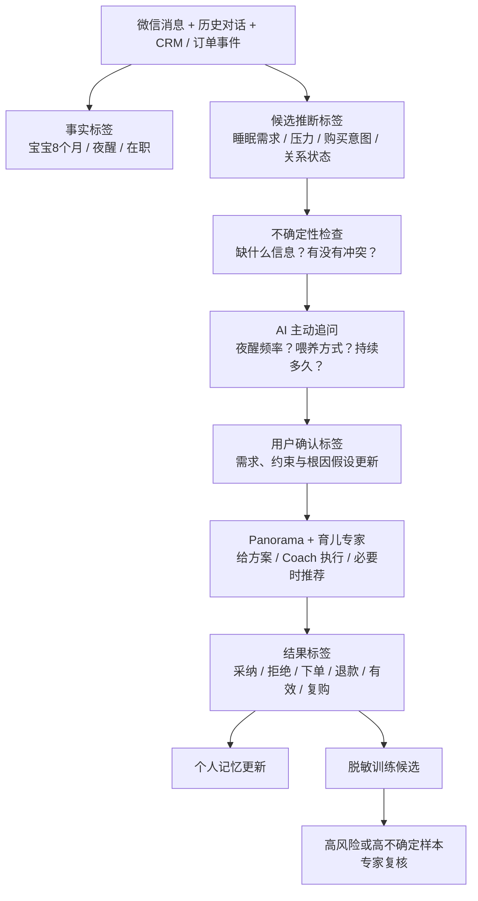

# 进化涌现

## Volvence：持续学习型大语言模型

### 开启通用人工智能新纪元

> 日期：2026-07-23  
> 项目名称：进化涌现  
> 产品名称：Volvence  
> 用途：18 页融资路演结构稿  
> 口径：投资人可理解、技术边界可核验；对外统一使用 Volvence 品牌术语

---

## Page 1｜封面

# 进化涌现

## Volvence：持续学习型大语言模型

### 开启通用人工智能新纪元

Volvence 让模型在真实世界中形成：

**目标 → 感知 → 决策 → 行动 → 反馈 → 学习**

我们不是再训练一个只在上线前学习的模型，而是构建一个部署后仍能持续形成经验、且可治理、可交付的完整模型系统。

---

## Page 2｜三个结构性缺口

### 今天的大模型很强，但还没有真正形成经验

| 结构性缺口 | 今天的系统 | 造成的结果 |
|---|---|---|
| **学习停在部署之前** | 核心能力主要来自预训练与离线后训练 | 上线后不会从每次结果中稳定成长 |
| **闭环停在模型之外** | 人来设目标、判断结果、组织反馈和触发更新 | 模型会执行任务，却不会自己完成认知闭环 |
| **关系停在语言表面** | Prompt、RAG 和文本记忆主要处理“说了什么” | 难以表示节奏、张力、信任、边界和关系变化 |

语言是交互的输出之一，不是关系本身。真正的关系状态还存在于时序、行为、结果、沉默、纠正和长期变化之中。

**结论：现有大模型是强大的即时工具，但还不是能积累经验的长期智能体。**

---

## Page 3｜我们的机会

### 下一代 Agent 的分水岭：部署之后还能不能学习

持续学习必须同时跨过三道门槛：

| 技术门槛 | 必须回答的问题 | Volvence 的对应能力 |
|---|---|---|
| **反馈稀疏** | 高价值反馈很少、很贵、很延迟，如何学？ | Volvence-Learning Engine |
| **泛化与稳定** | 如何复用旧经验，同时不被短期噪声冲坏？ | Volvence-Memory Engine |
| **语言维度不足** | 如何捕捉无法被文本完整表达的关系状态？ | Raw Interaction Interface + Residual Steering |

在此基础上，还需要一个决策中枢，把所学内容变成跨时间尺度的行动：

**Volvence-Decision Engine**

**我们的机会不是“比基础模型知道更多”，而是让任何合适的基础模型在真实关系和任务中持续变得更合适。**

---

## Page 4｜行业路线与五维收敛

### 行业已经在逼近持续学习，但多数方案只解决一个局部

我们对约 100 篇 Cognitive AGI 与持续学习核心论文的内部研究显示，不同社区正在反复收敛到五个共同维度：

1. **预测误差一级化**：结果与预期的差，不只是评测指标，而是下一轮学习和决策的原始信号。
2. **Token 之上的内部控制**：长期决策不能全部压在自然语言输出上，需要更稳定、低维的内部控制空间。
3. **记忆成为架构**：记忆不仅是外部检索库，还要参与状态形成、更新、巩固和遗忘。
4. **结构从交互中涌现**：策略、抽象和技能应从长期经验中形成，而不是全部依赖人工规则。
5. **有界修改、只读评估**：系统可以成长，但修改必须可限制、可审计、可回滚；评测集不能反向污染学习。

不同路线的特点与结构性上限：

| 行业路线 | 主要价值 | 主要缺口 |
|---|---|---|
| **长上下文 / RAG / 向量记忆** | 低成本增加跨会话召回 | 能检索旧信息，但不等于更新内部状态、形成策略或解决遗忘 |
| **EWC / SI / OWM 等防遗忘路线** | 约束参数更新，保护旧任务能力 | 重点是“学新不忘旧”，通常不回答学什么、为何行动和如何获得反馈 |
| **Replay / 生成式回放** | 用历史样本重建过去梯度，平衡稳定与可塑性 | 存储、隐私和训练成本较高；回放什么仍需选择机制 |
| **Adapter / LoRA / Test-time Learning** | 用小参数快速适配，避免重训基底 | 解决“在哪里更新”，但不自动解决目标、信用分配、长期巩固和治理 |
| **RLHF / Agent Workflow** | 能对齐输出、调用工具和完成流程 | 反馈多为离线或人工组织；容易停留在 Token 与外部流程层 |
| **世界模型 / 潜空间控制** | 在内部状态中预测和规划，适合长程决策 | 通常缺少 per-user 长期记忆、主动取数和商业级治理 |

五维覆盖对比：

| 路线 | 预测误差 | 内部控制 | 架构记忆 | 涌现结构 | 有界修改 / 只读评估 |
|---|:---:|:---:|:---:|:---:|:---:|
| RAG / 长上下文 | △ | — | △ | — | △ |
| 防遗忘 / Replay | △ | △ | ● | △ | △ |
| Adapter / Test-time Learning | △ | ● | △ | △ | △ |
| RLHF / Agent Workflow | △ | △ | — | △ | △ |
| 世界模型 / 潜空间控制 | ● | ● | △ | ● | △ |
| **Volvence** | **●** | **●** | **●** | **●** | **●** |

> `●` 为核心机制，`△` 为部分覆盖，`—` 为通常不直接解决。该表比较的是公开路线的默认重心，不代表所有具体实现。

**我们的差异不是发明了第五条孤立路线，而是把业界已经出现的五个收敛维度，组织成一个面向真实关系、可持续运行的闭环。**


## Page 10｜行业路线与我们的差异

### 33家 Neo Labs 正在收敛到同五个方向，但没有一家把五项组成完整闭环

团队对约100篇核心论文及33家Neo Labs的内部调研显示，语言、机器人、神经科学、自主科学家和生物基础模型虽然彼此独立，却反复出现五个共同方向：

1. **预测误差一级化**：预期与结果的差直接驱动感知、决策和学习。
2. **Token之上的内部控制**：长期决策进入潜空间，而不是全部压在自然语言输出上。
3. **记忆成为架构**：记忆参与状态形成，并具备更新、巩固、遗忘和迁移。
4. **结构从交互中涌现**：动作抽象、技能切换和策略持续时间从经验形成。
5. **有界修改与只读评估**：模型可以改变，但更新可限制、审计、回滚，评测不污染学习。

实现程度：`3 = 已有可运行闭环或强实验证据`，`2 = 已实现核心机制`，`1 = 相邻研究或公开主张`，`0 = 公开路线通常不覆盖`。

| Neo Labs路线与代表机构 | 预测误差 | 内部控制 | 架构记忆 | 涌现结构 | 有界修改 / 只读评估 | 当前实现判断 |
|---|:---:|:---:|:---:|:---:|:---:|---|
| **Active Inference**：VERSES、Stanhope、Cortical Labs | **3** | **2** | 1 | 2 | 1 | 对“预测误差驱动行动”理论和生物证据最强；商业级长期记忆与治理不足 |
| **机器人 / 世界模型**：World Labs、Physical Intelligence、Skild AI、Reflection AI | **2** | **3** | 1 | **3** | 1 | 已证明潜空间规划、动作块和内禀奖励；主要面向物理行动，不处理per-user关系连续性 |
| **状态空间 / 脑启发**：Liquid AI、Cartesia、Numenta | 1 | **2** | **3** | 2 | 1 | 长历史有界压缩和连续动力学很强；反馈归因和自修改发布门较弱 |
| **自主科学家 / 自改进**：Future House、Sakana AI、Recursive Superintelligence、Thinking Machines | **2** | **2** | 1 | **3** | **2** | 已形成“假设-实验-验证”或模型改写闭环；开放式自修改的验证成本和安全边界仍未解决 |
| **生物基础模型**：EvolutionaryScale、Arc、CZI Virtual Cell、Isomorphic、Recursion等 | 1 | **2** | 0 | 2 | 1 | 强力验证“冻结大基底+适配控制器”的跨模态规律；不是长期个体交互系统 |
| **关系 / 多人智能**：**humans&** | 1 | **2** | 1 | 2 | 1 | Neo Labs中目标与Volvence最接近：human-centric、long-horizon、多Agent、memory与用户理解；资本认可强，公开技术证据仍早期 |
| **Volvence 当前验证版** | **3** | **3** | **3** | **2** | **3** | 五项已进入同一系统；无fast-prior的结构涌现仍为weak，治理契约仍有1项待修复 |

#### 资本市场如何给这些方向定价

| 代表性 Neo Lab | 主要方向 | 最近公开融资 / 估值信号 | 对 Volvence 的意义 |
|---|---|---|---|
| **humans&** | 人本AI、多人协作、长期关系与用户理解 | 2026-01：种子轮 **4.8亿美元**，估值 **44.8亿美元** | 与Volvence关系智能方向最直接的资本定价参照；但其公开系统与实验仍少 |
| **Thinking Machines Lab** | 可定制交互模型、有界后训练 | 2025-07：融资 **20亿美元**，估值 **120亿美元** | 证明“基底之上的可定制学习层”可获得前沿模型级定价 |
| **Physical Intelligence** | 通用机器人基础模型、潜空间动作 | 2025-11：融资 **6亿美元**，估值 **56亿美元** | 证明潜空间控制和跨任务动作泛化具有独立平台价值 |
| **Sakana AI** | 模型合并、进化、自主科学家 | 2025-11：B轮约 **1.35亿美元**，投后估值约 **27亿美元** | 证明非纯Scaling的新架构与自改进路线可形成高估值实验室 |
| **World Labs** | 空间智能、世界模型与长期空间状态 | 2026-02：融资 **10亿美元**；本轮估值未披露，此前公开报道目标约 **50亿美元** | 证明Token之外的内部世界状态已成为独立大赛道 |
| **EvolutionaryScale / Arc / CZI等** | 生物基础模型、虚拟细胞 | 多家累计融资达亿美元级；多数未公开独立估值 | 证明“冻结基础模型+领域控制/验证层”在非语言模态同样可规模化 |

> 估值为截至2026-07可查的最近公开融资口径；融资额不等于估值，未披露处不自行估算。资本规模说明赛道共识和人才/算力竞争强度，不代表技术已经完成。

#### 每个方向，Volvence 已经做到哪一步

| 收敛方向 | Volvence实现 | 当前证据 | 尚未完成 |
|---|---|---|---|
| **预测误差一级化** | world/task与self/relationship双轨预测；误差进入归因与学习 | 内部RL 7/7 gates；no-optimize回报增益为0 | regime stability仍弱于基线 |
| **Token之上的内部控制** | 潜状态、抽象动作、控制器专家和残差流干预 | held-out success相对最强对照`+2.4pp` | 需在14B基底上证明规模增益 |
| **记忆成为架构** | 快/中/慢层CMS，1.0扩为四层；慢层反哺快路径 | 510轮长测；保持度`0.99995`；2,274次对齐100%通过 | 开放域长期遗忘和跨用户隔离需产品验证 |
| **结构从交互中涌现** | 动作族、切换门、长期信用回写 | 有结构发现与credit alignment信号 | 去掉fast prior后证据仍为`weak` |
| **有界修改与只读评估** | shadow→active晋级、更新门、版本、审计和回滚 | 当前promotion gate可晋级；定向测试31/32通过 | 修复`social_prediction`未登记依赖并建立生产SLO |

#### 竞争结论

- Neo Labs已经分别证明了五个方向中的关键局部：Active Inference证明误差闭环，机器人证明潜空间控制，SSM证明架构记忆，自主科学家证明实验闭环，生物模型证明冻结基底加适配器可以跨模态扩展。
- humans&的44.8亿美元估值说明“以人为中心、长期关系、多Agent协作”已经成为可独立定价的前沿方向；Volvence比它更早披露完整架构与内部消融，但在融资规模、人才密度和国际品牌上明显更早期。
- **Volvence不是声称这些机制都由我们发明，而是把五项首次组织为面向长期用户关系的同一模型闭环。**
- 当前领先点是“系统完整度+真实交互出口”；当前风险点是结构涌现、14.5B扩维效果和商业A/B结果仍未完成。

> 本页比较基于内部Neo Labs论文调研的公开证据，不以融资额、估值或产品宣传作为实现依据；分数表示默认技术重心和公开成熟度，不代表对公司整体能力的排名。

资料口径：[humans&](https://techcrunch.com/2026/01/20/humans-a-human-centric-ai-startup-founded-by-anthropic-xai-google-alums-raised-480m-seed-round/)、[Thinking Machines Lab](https://techcrunch.com/2025/07/15/mira-muratis-thinking-machines-lab-is-worth-12b-in-seed-round/)、[Physical Intelligence](https://www.axios.com/2025/11/21/robots-physical-intelligence-ai)、[Sakana AI](https://sakana.ai/series-b/)、[World Labs](https://techcrunch.com/2026/02/18/world-labs-lands-200m-from-autodesk-to-bring-world-models-into-3d-workflows/)。
---

## Page 5｜产品定义

### Volvence 是一个具备持续学习能力的模型系统



系统内部由可替换的基底模型与 Volvence 自有模块共同构成：

- 基底模型提供通用知识、推理和语言能力
- Volvence-Decision Engine 负责高层决策
- Volvence-Memory Engine 负责经验形成与长期稳定
- Volvence-Learning Engine 负责主动选择反馈和持续更新
- Volvence Representation Interface 负责原始交互与模型内部表示的连接
- Governance Layer 负责权限、审计、版本和回滚

**Volvence 交付的不是一组外挂组件，而是一个能够边服务、边反馈、边成长的模型系统。**

---

## Page 6｜模型系统部署架构

### 在线模型服务 + 持续学习中心



部署上只有两条主链：

- **在线链路**：交互编码 → 记忆读取 → 高层决策 → 基底模型与残差流控制 → 输出行动。
- **学习链路**：真实反馈 → 主动选样与误差归因 → 记忆巩固和模型更新 → 版本发布。

在线服务负责稳定、低延迟推理；持续学习中心异步更新；只有通过评测的版本才能发布上线。

---

## Page 7｜四项核心技术

### 三个引擎 + 一个表示接口

| 核心模块 | 核心思想 | 为什么有效 | 主要解决 |
|---|---|---|---|
| **Volvence-Decision Engine** | 潜空间抽象涌现机后强化学习 | 缩小决策空间，使长程规划和信用分配更清晰 | 人类代做决策闭环 |
| **Volvence-Memory Engine** | 按快、中、慢时间尺度更新；只有反复验证的经验进入长期层 | 兼顾快速适应与长期稳定，降低灾难性遗忘 | 泛化、稳定与经验复用 |
| **Volvence-Learning Engine** | 主动选择最有信息量的样本、问题和求助时刻 | 不平均消耗标注预算，用更少反馈获得更多信息 | 稀疏数据 |
| **Volvence Representation Interface** | 将原始交互压缩为关系潜状态，并用控制向量干预残差流 | 绕过纯语言载体的维度上限，在内部表示层调制行为 | 关系维度不足 |

三者的协作关系：

**Decision 决定下一步做什么；Learning 决定下一步该学什么；Memory 决定什么值得留下；Representation Interface 决定这些状态如何进入模型内部。**

---

## Page 8｜两个核心价值与商业飞轮

### 电商不是起点：先帮助用户真正解决问题



两项核心价值：

- **Panorama 决策支持**：通过决策平衡计分卡，与用户共同建模、共同推演、共同收敛，必要时共同探索未知解。AI 自动研究外部信息、补齐决策矩阵、寻找问题根因，并主动收集缺失情况。
- **高情商认知与 Coaching**：模型不仅知道“答案是什么”，还理解“这件事应该怎么处理”。它能兼顾人、关系、时机和边界，Coach 用户把决策真正变成行动和结果。

商业逻辑：

**要形成电商，必须知道需求；要知道需求，必须了解客户；要了解客户，必须让客户持续使用；要让客户持续使用，就必须真正解决问题；要解决复杂问题，就必须 IQ 与 EQ 双在线。**

**Volvence 不是先卖货再维护关系，而是先创造问题解决价值，再从长期关系中自然形成真实需求与交易。**

---

## Page 9｜已完成的证明与消融

### 我们已经验证的是机制，不把内部实验包装成商业结果

| 验证问题 | 已完成结果 | 结论 |
|---|---|---|
| **决策是否真的从反馈中学习** | ETA paper suite 的强化学习主张通过 **7/7** 道门；相对最强 matched control 的 held-out success gap 为 **+2.4pp** | **保留主张**：完整学习链路优于去除关键学习环节的对照 |
| **增益是否来自奖励泄漏** | 奖励稀疏度 **1.0**，reward-shaping leakage **0.0**；独立 no-optimize 消融中，完整模型平均回报提升 **+1.55**，不更新对照为 **0** | **保留主张**：增益来自参数更新，而非把答案写进奖励 |
| **慢记忆能否反哺快决策** | slow-to-fast initialization benefit **0.9625**；长期收益覆盖 **0.5** | **保留主张**：延迟结果可以回写动作族并改善下一次初始化 |
| **持续更新会不会破坏旧能力** | `Qwen2.5-1.5B` 真实链路 **510轮**；CMS 新旧实现 **2,274次** 对齐、通过率 **100%**；旧知识保持均值 **0.99995** | **通过当前门槛**：影子更新可晋级，尚不等于开放域永久无遗忘 |
| **预测头是否优于静态基线** | 末段200轮：任务进展 MAE `0.0268 < 0.0366`，动作收益 `0.0249 < 0.0386`，关系变化 `0.0098 < 0.0121` | **3/4轴正向**；regime stability `0.0124 > 0.0090`，仍需改进 |
| **记忆、关系与延迟归因契约** | 本次定向复跑 **31 passed / 1 failed** | 记忆探针与多数关系测试通过；发现 `social_prediction` 依赖未登记，需修复后再宣称全通过 |

#### 我们主动保留的反证

- **无脚手架时间抽象仍未充分证明**：去掉 fast prior 后，held-out reuse 与 credit gap 均为 `0`，当前 verdict 为 **weak**。
- **生产时延尚未证明**：510轮本机长测平均每轮 `13.26s`，包含研究追踪与本地负载，不能作为线上 SLO。
- **商业价值尚待场景验证**：留存、转化和收入提升必须由 AI 微信销售 / 数字分身 / 育儿专家的真实 A/B 实验给出。

**这页证明 Volvence 的关键学习机制已经可测、可消融、可发现失败；下一阶段不是重复讲概念，而是扩维、修复弱项并验证产品结果。**

---

## Page 10｜模型结构与参数规模

### 当前验证版与 Volvence 1.0

| 口径 | 当前验证版 | Volvence 1.0 主力 API 版 |
|---|---:|---:|
| **基底模型** | `Qwen2.5-1.5B` | **14B** 开源基底 |
| **Volvence 自有神经参数** | 各模块为独立微型实验配置，合计口径尚未统一 | **500M** |
| **模型总参数** | 约 **1.5B**，外加实验控制器 | 约 **14.5B** |
| **决策潜空间 `z`** | `4 / 8`，按实验不同 | **512** |
| **控制器专家** | 单控制器验证 | **32个专家，Top-2 稀疏激活** |
| **记忆时间尺度** | online / session / background 三层 | **4层**：online / session / background / rare-heavy |
| **状态** | 已完成510轮真实链路和机制消融 | 发布目标，需通过统一验收门 |

#### 当前自有模块是什么

- **Decision Engine**：结构发现网络 `724` 参数；独立 PPO Policy + Critic 配置 `313` 参数。
- **Memory Engine**：三层 CMS `792` 参数；PE-aware 更新门 `199` 参数。
- **Learning Engine**：主动选样、风险评分、标注与训练编排，当前没有独立神经参数。
- **Representation Interface**：读取并干预基底残差流；当前解码器参数计入 Decision。
- 当前微型参数用于证明闭环机制，因潜空间维度不同，不能简单相加为产品总数。

#### 为什么不是 3B + 20M

```text
500M 自有参数
≈ 共享状态编码与残差接口
+ 32个稀疏决策专家
+ 4层神经记忆与更新门
+ 长期世界 / 关系模型
+ 路由、价值与预测头
```

3B 能完成基础对话和垂直任务，但不足以稳定承担开放域自动研究、复杂决策推演和高情商 Coaching；20M 则更适合证明机制，难以容纳跨场景策略和长期世界模型。

Volvence 1.0 采用 **Mixture-of-Controllers**：14B 基底保持共享，32个专家每轮只激活2个。数据规模增长主要扩展外部记忆与训练样本，不把每个用户事实都写进参数。

**发布口径：Volvence 1.0 = 14B 基底 + 500M 持续学习模块 = 约 14.5B；另提供 3B + 100M 的 Mini 版。**

---

## Page 11｜自动标注与数据产能

### 从一条微信对话到千万级可训练信号

案例：一位妈妈在微信中说，“宝宝 8 个月，最近总是夜醒，我白天还要上班。”



每条交互形成的具体标签：

| 标签面 | 本例标签 |
|---|---|
| **事实 / 状态** | `child_age=8m`、`night_waking=true`、`employment=working` |
| **需求 / 约束** | `goal=sleep_improvement`、`time_budget=low`、预算、禁忌 |
| **决策 / 关系** | 根因候选、问题阶段、信任度、压力、购买意图、下一最佳动作 |
| **过程 / 结果** | 是否追问、建议是否采纳、7日效果、下单、退款、复购、关系变化 |
| **学习元数据** | 来源、时间、授权、置信度、风险级别、模型版本、人工修订 |

#### 6000万全网可触达用户如何变成数据底盘

| 首年保守漏斗 | 数量 |
|---|---:|
| 全网可触达用户底座 | **6,000万** |
| 1%完成授权并形成有效使用 | **60万用户** |
| 人均20次有效交互 | **约1,200万次交互** |
| 每次约7-8个结构化信号 | **约9,000万机器标签** |
| 主动学习送普通人工复核 | **20万条** |
| 育儿 / 医疗 / 安全专家复核 | **4万条** |

- **首年人力**：10-15人数据闭环团队，另配按需领域专家。
- **首年成本**：模型处理、数据工程、普通复核和专家复核合计约 **600万-1,450万元**。
- **合成数据**：需要，但只补冷启动、反事实、长尾失败和稀有安全场景，建议不超过训练混合的 **30%**；不得进入评测集或冒充真实用户结果。

**6000万全网底座是足够强的分发与反馈出口，但不是天然训练集。必须完成跨平台去重、用户授权、有效交互和结果回流，才能转化为可学习资产。**

---

## Page 12｜理论基础与原创边界

### 长期理论积累，支撑 Volvence 的系统创新

| Volvence 能力 | 理论基础 | Volvence 的原创工程任务 |
|---|---|---|
| Learning Engine | 主动学习、主动学徒学习、主动 RLHF | 在线价值评分、求助策略、标注编排与真实业务反馈闭环 |
| Memory Engine | 迁移学习、元学习与多时间尺度更新思想 | 记忆分层、巩固门控、遗忘控制、跨用户隔离与版本治理 |
| Decision Engine | 强化学习、层级决策与长期信用分配 | 高层动作空间、策略切换、潜状态到控制信号的映射 |
| Representation Interface | 表征学习与内部激活控制 | 原始交互编码、关系潜状态、残差流干预及安全评估 |

边界必须说清：

- **迁移学习不是记忆本身**：记忆负责保存和巩固；迁移学习回答已学结构如何帮助新任务。
- **主动学习不是完整闭环**：它回答该向人询问什么；Volvence 还要完成决策、执行、归因、写回和治理。
- **论文是理论来源，不等于已完成产品**：公司的价值在于把这些理论变成同一套可运行、可评测、可商业化的系统。

---

## Page 13｜杨柳：核心科学基础

### 二十余年研究聚焦两个瓶颈：少标注与强泛化

**杨柳**

- 美国卡内基梅隆大学计算机学院机器学习系博士
- 博士论文：`Mathematical Theories of Interaction with Oracles`
- 研究人机交互与学习过程的复杂度
- 博士答辩委员会成员包括图灵奖得主 Manuel Blum
- 在主动学习、强化学习与迁移学习方向发表顶会顶刊论文 30 余篇

代表性研究：

| 研究线 | 代表工作 | 对 Volvence 的支撑 |
|---|---|---|
| 主动学习 | `Surrogate Losses in Passive and Active Learning` | 提高可学习问题的计算与统计效率 |
| 主动学习 | `Minimax Analysis of Active Learning` | 用 Star Number 刻画主动学习样本复杂度 |
| 复杂分布 | `Active Learning with Identifiable Mixture Assumptions` | 支撑复杂分布下的高效选样研究 |
| 学习边界 | `Bandit Learnability can be Undecidable`，COLT 2023 | 明确序贯学习问题的理论边界 |
| 主动求助 | `Reliable Active Apprenticeship Learning`，ALT 2025 | 不确定时向人求助，并控制求助次数 |
| 人类反馈 | `Active RLHF` | 降低奖励模型训练所需的人类标注 |

> 论文题录、作者顺序、发表状态和 30 余篇统计，在正式对外版中以最终学术简历逐项核验。

---

## Page 14｜迁移为何关键，但不等于记忆

### Memory Engine = 记住 + 稳定 + 复用

迁移学习回答的是：

**过去任务形成的结构，能否减少新任务从零学习的成本？**

杨柳相关研究采用的核心思路是：

- 任务较少、先验不可靠时，使用不依赖先验的学习方法
- 任务增多、后验逐渐可靠后，使用依赖先验的方法提升样本效率
- 在渐近条件下，使新任务样本需求接近“已知先验”时的水平，并控制额外复杂度项

Volvence-Memory Engine 还必须额外解决：

- 哪些交互只进入工作记忆
- 哪些模式经过验证后进入长期记忆
- 新经验与旧经验冲突时如何隔离、降权或回滚
- 哪些结构可跨任务迁移，哪些私人信息绝不能跨用户传播

**迁移提供“经验可复用”的理论方向；Memory Engine 把保存、巩固、迁移、隔离和治理做成产品能力。**

---

## Page 15｜产品与商业化

### 一条路线：发布模型 → 开源 → 提供 API

| 时间 | 发布什么 | 这个模型干什么 | 对外方式 |
|---|---|---|---|
| **融资后 M0-M6** | **Volvence-1 Mini：3B + 100M = 3.1B** | Panorama 决策支持、高情商 Coaching；验证持续学习闭环 | 自有 AI 陪伴产品与小范围合作验证 |
| **融资后 M6-M12** | **Volvence-1 Open Mini：3.1B**<br/>**Volvence-1 API Beta：14B + 500M = 14.5B** | Mini 提供可部署能力；主力版验证开放域决策、长期关系与跨场景学习 | 开源 Mini 权重、代码与评测；主力版定向测试 |
| **融资后 M12-M18** | **Volvence-1 Model API：14.5B** | 提供持续学习、个人记忆、决策支持、Coaching 和治理能力 | API 按调用量计费，提供企业版与私有化部署 |

发布原则：

- 先用真实用户验证模型确实能解决问题，而不是只会对话。
- 再开源3.1B Mini，建立开发者生态和持续学习模型标准。
- 最后通过14.5B主力 API 提供完整、稳定、可治理的商业模型服务。

**最终交付很简单：一个会持续学习、会辅助决策、会高情商解决问题的模型，以及任何产品都能调用的 API。**

---

## Page 16｜护城河

### 壁垒来自闭环复利，而不是单一算法

1. **系统壁垒**：原始交互、潜状态、内部控制、反馈归因、记忆巩固和治理形成完整链路。
2. **理论壁垒**：主动学习、迁移学习、强化学习与系统架构由同一团队长期推进。
3. **数据壁垒**：持续积累高价值反馈选择策略、长期结果标签和可迁移结构。
4. **工程壁垒**：在线学习必须同时满足低延迟、稳定性、隐私、审计和回滚。
5. **场景壁垒**：长期服务关系带来连续反馈，反馈又改善服务与留存。

飞轮：

**更长关系 → 更可信反馈 → 更好决策与记忆 → 更高服务价值 → 更长关系**

---

## Page 17｜团队

### 理论、模型、规模化系统与商业闭环必须同时存在

#### 赵江波｜创始人、CEO、董事长

北京大学计算机本科、光华管理学院 MBA；连续创业者，具有商业化成功退出经验，长期参与元强化学习与认知智能产品路线。共同负责模型如何学习：定义学习目标、状态与反馈口径、奖励信号、IQ/EQ决策目标及真实结果如何进入模型更新；同时负责战略、产品、6000万业务底座与商业化。

#### 杨柳｜联合创始人、首席科学家

CMU机器学习博士，博士论文研究交互学习复杂度，答辩委员会成员包括图灵奖得主 Manuel Blum；曾在 IBM、耶鲁大学从事博士后研究。拥有研究成果40余篇，其中A级顶会顶刊18篇、主动学习/强化学习/迁移学习相关顶会顶刊30余篇。负责Learning、Decision、稀疏反馈、迁移泛化与数学边界。

#### 马志刚｜研究院院长

北京大学计算机软件与理论本博连读、微软学者奖学金；2012年加入字节跳动创始初期团队，参与今日头条推荐算法引擎；历任斯伦贝谢、腾讯、启元实验室技术岗位。负责把理论变成模型学习机制，统筹认知闭环、Decision、Memory、Learning与残差流干预。

#### 张驰｜联合创始人、CTO

19岁毕业于清华大学计算机专业，进化涌现产品总架构师。负责规模化训练、数据与推理基础设施、生产性能、API、企业部署和跨行业标准化交付。

| 18个月责任链 | 核心交付 |
|---|---|
| **杨柳：理论可学** | 主动学习效率、迁移边界、安全求助与数学/实验门 |
| **马志刚：模型会学习** | 统一Decision、Memory、Learning与残差流，形成完整认知学习闭环 |
| **张驰：系统可规模化** | 3.1B Mini、14.5B主力API、千万级交互、近亿级标签、生产SLO与企业部署 |
| **赵江波：定义并校准学习目标** | 定义模型学什么、什么算学会；用任务、关系、留存与收入结果校准学习方向并完成商业化 |

**团队稀缺性：同一团队拥有世界级学习理论、亿级推荐与分布式系统、认知模型架构，以及6000万用户分发和商业化能力。**

---

## Page 18｜融资用途与里程碑

### 本轮资金用于验证持续学习闭环，不用于重训基础模型

建议资金结构：

| 投向 | 建议占比 | 18-24 个月交付 |
|---|---:|---|
| 核心模型与系统研发 | 40% | 四项核心模块打通；形成可版本化的持续学习模型系统 |
| 数据、标注与评测 | 20% | 主动选样平台；长期任务、关系状态与安全评测集 |
| 产品与标杆场景 | 20% | 2-3 个可重复部署场景；验证留存、成功率和单位经济性 |
| 算力、安全与基础设施 | 10% | 在线推理、训练管线、权限、审计、隔离和回滚 |
| 关键人才与运营 | 10% | 补强算法、系统、产品和行业交付 |

三项核心验证：

1. **学习效率**：相同标注预算下，效果显著优于随机采样与普通 RLHF 流程。
2. **长期能力**：在连续任务中优于 LLM + RAG / 文本记忆基线，同时控制遗忘和错误写入。
3. **商业闭环**：至少一个标杆场景证明持续学习带来更高任务成功率、留存或收入。

> 正式融资版需补充融资金额、跑道、当前基线和目标数值。

---

## Page 19｜收口

### 基础模型让机器拥有知识  
### Volvence 让机器拥有经验

我们要建立的不是又一个聊天机器人，而是一套让模型在真实世界中：

**持续感知、持续决策、持续学习、持续成为自己的基础设施。**
