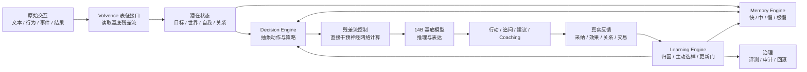
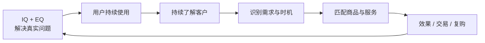

# 进化涌现

## Volvence：持续学习型大语言模型

### 开启通用人工智能新纪元

> 简版：13页  
> 日期：2026-07-23  
> 项目名称：进化涌现  
> 产品名称：Volvence  
> 目标读者：理解大模型、Agent、训练与推理基础设施的技术型投资人  
> 阅读主线：结构性缺口 → 核心架构 → 技术证据 → 规模化 → 数据飞轮 → 商业化

---

## Page 1｜封面

# 进化涌现

## Volvence：持续学习型大语言模型

### 开启通用人工智能新纪元

**核心命题：把以prompt工程为代表的原本由人完成的反馈闭环，逐步内化为模型自身可学习、可验证、可治理的能力。**

---

## Page 2｜为什么现有大模型还不能持续学习

| 结构性缺口 |  | Volvence 要解决的问题 |
|---|---|---|
| **学习停在部署前** |  | 从真实结果持续形成新策略 |
| **闭环位于模型外** |  | 模型内部完成长期归因与策略更新 |
| **稀疏反馈难学习** |  | 主动寻找最有价值的反馈 |
| **跨任务泛化弱** |  | 迁移过去结构，减少新任务样本 |
| **关系被压缩成语言** |  | 从时序、行为和结果形成潜在关系状态 |

**语言只能表达关系的一部分。信任、张力、边界、时机与长期变化，需要在神经网络内部形成可计算状态。**

---

## Page 3｜一张图看懂 Volvence

**关键区别：Volvence 不只把记忆拼回上下文，而是从原始交互形成潜状态，并直接干预基底模型的残差流。**

---

## Page 4｜四项核心技术

### 1. Volvence Decision

把长任务压缩为潜在状态和抽象动作；从延迟结果判断哪条决策链真正有效，并更新下一次行动策略。

### 2. Volvence Memory

快、中、慢、极慢四个时间尺度分别处理即时适应、会话巩固、长期模式和低频重大事件；冲突记忆可以隔离、降权和回滚。

### 3. Volvence Learning

不标全部数据。系统根据不确定性、风险和信息价值，主动决定问用户、找普通标注员还是找领域专家。

### 4. Volvence Residual Steering

关系和决策状态不必先翻译成有限的自然语言提示词，而是作为控制信号进入神经网络残差流，影响模型如何理解、推理和表达。

**四项技术共同解决：稀疏数据、跨任务迁移、长期归因和语言关系维度不足。**

---

## Page 5｜核心机制已经跑通

### Volvence不是概念架构：决策、记忆、学习和治理已经形成可验证闭环

| 已验证能力 | 关键结果 | 证明了什么 |
|---|---:|---|
| **模型能从结果中改善决策** | 内部RL通过 **7/7** 道严格验收门；held-out success相对最强对照 **+2.4pp** | 学习发生在内部决策空间，不只是Prompt或工作流优化 |
| **增益来自真实学习，而非实验技巧** | 完整模型平均回报提升 **+1.55**；no-optimize对照为 **0**；奖励泄漏为 **0** | 排除不更新参数和奖励塑形造成的伪增益 |
| **长期经验能够改善下一次行动** | slow-to-fast initialization benefit **0.9625** | 慢记忆已经能够反哺快决策，形成跨时间尺度学习 |
| **持续更新能够保持旧知识** | 真实模型链路运行 **510轮**；2,274次实现对齐 **100%通过**；旧知识保持度 **0.99995** | 在线学习在当前验证范围内没有造成灾难性遗忘 |
| **模型开始预测世界、行动与关系变化** | 任务进展、动作收益、关系变化 **3/4条预测轴优于静态基线** | Volvence已从文本记忆进入可学习的内部状态模型 |
| **系统能够发现自身隐藏耦合** | 定向契约测试 **31/32通过**，准确发现1项未登记依赖 | 学习链路具备可测试、可定位、可治理能力 |

**阶段结论：Volvence已完成持续学习关键机制的内部可复现验证，具备代码、对照实验和证据包，可接受技术尽调；第三方Benchmark、14.5B规模验证和真实商业A/B仍待完成。**

> 技术边界：无fast-prior的结构涌现和regime stability仍需加强；本地长测不代表生产SLO。它们是下一阶段明确的工程与研究任务，不改变核心闭环已经跑通的结论。
> 
---

## Page 6｜模型规模：从验证到可用

| 版本 | 基底参数 | Volvence 自有参数 | 总参数 | 用途 |
|---|---:|---:|---:|---|
| **当前验证版** | 1.5B | 独立微型控制器 | 约1.5B | 机制、长测与消融 |
| **Volvence-1 Mini** | 3B | 100M | **3.1B** | 端侧、私有化、低成本垂直场景 |
| **Volvence-1 主力版** | 14B | 500M | **14.5B** | Panorama、EQ Coaching、开放域API |

主力版规划：

- 决策潜空间 `z=512`；
- 32个稀疏控制器专家，每轮 Top-2；
- 4个记忆时间尺度；
- 共享状态编码、残差接口、世界/关系模型、路由、价值与预测头。

数据量不会与参数量线性增长。用户事实进入可授权、可删除的外部记忆；500M参数学习跨用户可迁移的结构、策略和规律。

---

## Page 7｜数据如何自动变成监督信号

以 AI 育儿专家中的一句话为例：

> 宝宝8个月，最近总是夜醒，我白天还要上班。

| 标签面 | 自动形成的标签 |
|---|---|
| **事实** | `child_age=8m`、`night_waking=true`、`employment=working` |
| **需求与约束** | 睡眠改善、时间预算、价格预算、禁忌 |
| **决策状态** | 根因候选、缺失信息、问题阶段、下一最佳动作 |
| **关系状态** | 压力、信任、边界、表达接受度 |
| **行动** | 追问、研究、解释、安抚、计划、推荐或停止 |
| **结果** | 采纳、7日效果、下单、退款、复购、关系变化 |
| **治理信息** | 来源、授权、置信度、风险、模型版本、人工修订 |

模型候选不能给自己判对：事实来自原话和系统事件，关键缺口由用户确认，高风险结论由专家审核，最终由延迟结果验证原决策。

合成数据只补冷启动、反事实、长尾失败和稀有安全场景，占训练混合不超过30%，不进入评测集。

---

## Page 8｜6000万全网底座形成冷启动优势

| 首年保守漏斗 | 规划值 |
|---|---:|
| 全网可触达用户底座 | **6,000万** |
| 1%授权并形成有效使用 | **60万用户** |
| 人均20次有效交互 | **1,200万次交互** |
| 每次7-8个结构化信号 | **约9,000万机器标签** |
| 主动学习送普通复核 | **约20万条** |
| 高风险专家复核 | **约4万条** |

- 10-15人数据闭环团队；
- 首年数据处理、标注、专家复核与质量团队预算约 **600万-1,450万元**；
- 跨平台触达必须先去重，并取得训练授权和结果回流。

**6000万不是天然训练集，而是低成本获得授权交互、用户确认和真实结果的出口。即使1%有效转化，也足以启动500M持续学习模块的训练与验证。**

---

## Page 9｜产品价值：先解决问题，再形成交易

### Panorama：决策支持

AI 与用户共同建模、共同推演、共同收敛，必要时共同探索；自动研究外部信息、补齐决策矩阵、寻找根因并主动追问缺失条件。

### EQ Coaching：高情商解决问题

模型理解人、关系、时机和边界，知道该如何表达、何时推进、何时停止，并陪用户执行、观察和复盘。

**Volvence 不是先卖货再维护关系，而是先创造问题解决价值，再从长期关系中自然形成需求与交易。**

---

## Page 10｜行业路线与我们的差异

### 33家 Neo Labs 正在收敛到五个方向

团队对约100篇核心论文及33家Neo Labs的研究显示，不同路线正在形成共同技术坐标：

| 收敛方向 | 代表 Neo Labs | 已实现到哪里 | Volvence |
|---|---|---|---|
| **预测误差驱动学习** | VERSES、Stanhope、Cortical Labs、Skild AI | 理论、生物和机器人环境已有验证 | 双轨预测误差进入归因与学习；内部RL通过7/7道门 |
| **Token之上的内部控制** | World Labs、Physical Intelligence、Reflection AI | 潜空间规划和动作控制已成立 | 潜状态、抽象动作与残差流干预已进入同一模型链路 |
| **记忆成为架构** | Cartesia、Liquid AI、Numenta | 长历史压缩和连续状态较成熟 | 分层神经记忆；510轮长测，旧知识保持度`0.99995` |
| **结构从交互中涌现** | Sakana AI、Future House、Thinking Machines | 技能切换、自主实验和模型适配已有局部结果 | 已有结构发现信号；去掉fast prior后证据仍为`weak` |
| **有界修改与只读评估** | Thinking Machines、Sakana AI、Symbolica | trust-region、可替换适配和形式约束部分覆盖 | shadow晋级、更新门、审计与回滚；仍有1项契约待修复 |

### 最接近的资本参照

- **humans&**：人本AI、长期关系和多人协作；2026年种子轮4.8亿美元，估值44.8亿美元。
- **Thinking Machines**：可定制交互模型；估值120亿美元。
- **Physical Intelligence / World Labs / Sakana AI**：分别代表潜空间动作、世界模型和自改进，最近公开估值或目标约27亿-56亿美元。

**结论：其他Neo Labs分别做深了一个方向；Volvence的差异是把五个方向组织为同一个面向长期用户关系的持续学习闭环。当前优势是系统完整度和6000万真实交互出口；待验证的是无脚手架结构涌现、14.5B扩维和商业A/B结果。**

> 估值反映资本对方向和团队的定价，不等于技术完成度；未公开估值不自行推算。

资料口径：[humans&](https://techcrunch.com/2026/01/20/humans-a-human-centric-ai-startup-founded-by-anthropic-xai-google-alums-raised-480m-seed-round/)、[Thinking Machines Lab](https://techcrunch.com/2025/07/15/mira-muratis-thinking-machines-lab-is-worth-12b-in-seed-round/)、[Physical Intelligence](https://www.axios.com/2025/11/21/robots-physical-intelligence-ai)、[Sakana AI](https://sakana.ai/series-b/)、[World Labs](https://techcrunch.com/2026/02/18/world-labs-lands-200m-from-autodesk-to-bring-world-models-into-3d-workflows/)。

---

## Page 11｜产品与商业化

| 时间 | 产品 | 参数 | 商业动作 |
|---|---|---:|---|
| **M0-M6** | Volvence-1 Mini | `3B + 100M = 3.1B` | 自有AI陪伴产品与合作场景验证 |
| **M6-M12** | Open Mini | `3.1B` | 开源权重、推理代码、接口与评测 |
| **M6-M12** | 主力版 Beta | `14B + 500M = 14.5B` | 定向客户验证开放域决策与长期学习 |
| **M12-M18** | Volvence-1 Model API | `14.5B` | API计费、企业版、Mini/主力私有化 |

商业指标按阶段递进：

1. 先证明任务解决率、持续使用率和有效反馈率；
2. 再证明主动学习降低单位有效标签成本；
3. 最后证明持续学习提升留存、转化、复购和客户生命周期价值。

---

## Page 12｜核心团队

### 四种能力缺一不可：理论、模型、规模化系统与真实商业闭环

#### 赵江波｜创始人、CEO、董事长

- 北京大学计算机本科、光华管理学院 MBA，兼具科研、工程、产品和经营训练。
- HP、互联网大厂经验、连续创业者，具有商业化成功退出经验；长期参与元强化学习和认知智能产品路线。
- 掌握6000万全网可触达用户底座，能够把模型放进真实AI陪伴、电商和数字分身场景。
- **负责 Volvence**：共同负责模型如何学习；定义学习目标、状态与反馈口径、奖励信号、IQ/EQ决策目标及真实业务结果如何进入模型更新；同时负责公司战略、产品与商业化。
- **18个月交付**：建立从用户问题、模型行动到任务结果和关系变化的学习目标体系；完成Mini验证、主力API发布，并用任务成功率、留存和收入校准模型学习方向。

#### 杨柳｜联合创始人、首席科学家

- 卡内基梅隆大学机器学习系博士，博士论文为 `Mathematical Theories of Interaction with Oracles`，研究交互学习复杂度；答辩委员会成员包括图灵奖得主 Manuel Blum。
- 曾在 IBM 和耶鲁大学从事博士后研究；长期研究主动学习、强化学习和迁移学习。
- 研究成果40余篇，其中A级顶会顶刊18篇；代表工作包括 `Minimax Analysis of Active Learning`、`Bandit Learnability can be Undecidable`、`Reliable Active Apprenticeship Learning`。
- **负责 Volvence**：Learning Engine、Decision Engine、稀疏反馈、主动选样、跨任务迁移及数学边界。
- **18个月交付**：证明相同人工预算下主动学习优于随机标注，并建立跨任务泛化和安全求助的理论/实验门。

#### 马志刚｜联合创始人、研究院院长

- 北京大学计算机软件与理论专业本、博，微软学者奖学金获得者。
- 2012年加入字节跳动创始初期团队，作为核心技术骨干参与今日头条推荐算法引擎的架构与开发。
- 历任斯伦贝谢、腾讯、启元实验室技术岗位，拥有地图渲染、街景重建、个性化推荐、海量高并发数据和分布式系统经验。
- **负责 Volvence**：把学习理论变成模型机制，统筹认知闭环、Decision Engine、Memory Engine、Learning Engine与残差流干预。
- **18个月交付**：完成模型如何形成状态、选择动作、吸收反馈、沉淀记忆和迁移经验的统一学习架构。

#### 张驰｜联合创始人、CTO

- 19岁毕业于清华大学计算机专业，进化涌现产品总架构师。
- 负责把研究模型扩展为稳定、高并发、可治理、可交付的生产系统。
- 建设训练与数据基础设施、标准API和交付体系，使同一持续学习能力可以复制到陪伴、电商、育儿专家和企业Agent。
- **负责 Volvence**：规模化训练、千万级交互和近亿级标签管线、推理性能、API、企业部署与标准化交付。
- **18个月交付**：完成3.1B Mini开源、14.5B主力版API、生产SLO及跨场景规模化部署。

**团队闭环：杨柳证明“为什么可学” → 赵江波定义“学什么、什么算学会” → 马志刚实现“模型如何学习” → 张驰解决“如何规模化运行” → 赵江波再用真实用户与商业结果校准学习目标。**

---

## Page 13｜融资与终局

### 融资主要投入

| 用途 | 比例 |
|---|---:|
| 14.5B主力模型、训练与规模消融 | 35% |
| 数据闭环、专家标注与6000万底座转化 | 25% |
| 产品、API、推理与企业交付 | 20% |
| 核心人才与研究合作 | 15% |
| 安全、隐私、法务与运营储备 | 5% |

### 18个月交付

**一个经过真实闭环验证、可开源、可调用、可私有部署的持续学习模型家族。**

Mini建立生态与部署规模，14.5B主力API承担复杂决策和长期关系；真实交互持续产生反馈，反馈持续形成能力。

**Volvence 的终局不是更会聊天的模型，而是能够与人共同建模、共同决策、共同成长的数字智能。**
