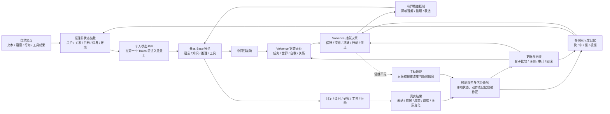

# 进化涌现 Volvence

## 七幕融合版投资人 BP v1

> 项目名称：进化涌现  
> 产品名称：Volvence  
> 正式定义：持续学习型大语言模型  
> 品类表达：让语言模型从理解语言，走向理解人、关系、决策与结果  
> 核心受众：技术型投资人、产业投资人、战略合作方  
> 写作原则：不使用时间表包装确定性；模型目标与当前证据分开；不把论文等同于产品，不把应用原型等同于成熟商业产品。

---

## Page 1｜封面

# Volvence：持续学习型大语言模型

## 让语言模型从理解语言，走向理解人、关系、决策与结果

### 模型进化，生命涌现

**北京进化涌现科技有限公司**

---

## Page 2｜一句话说清楚我们在做什么

# 今天的大模型，像一个读完世界上所有书、却每天第一天上班的天才

它知道很多，却不会因为昨天的经历，真正改变今天的判断。

**基础模型让机器拥有知识。**

**Volvence 让机器开始积累经验。**

我们要把原本由人完成的闭环：

> 目标 → 感知 → 决策 → 行动 → 结果 → 反馈 → 再学习

逐步内化为模型自身可学习、可治理、可持续运行的能力。

---

## Page 3｜现有大模型的结构性断点

# 会回答，不等于会从结果中学习

| 场景 | 今天的大模型 | 真正缺失的能力 |
|---|---|---|
| 聊天 | 跟随用户最后一句话，容易前后漂移 | 保持对目标、关系和风险的连续判断 |
| Agent | 会调用工具，却不知道哪一步真正带来结果 | 长程归因、策略修正和经验迁移 |
| 记忆 | 把历史文本检索回上下文 | 从内容中形成稳定状态和可复用策略 |
| 训练 | 依赖人收集、标注、训练、重新发布 | 从自然交互和真实结果中继续学习 |

今天的大模型负责生成；人仍然负责：

- 定义目标；
- 补齐上下文；
- 编排流程；
- 判断结果；
- 归因错误；
- 重新训练。

**聊天和任务型 Agent 看似是两类产品，卡住的其实是同一个地方：闭环仍在模型之外。**

---

## Page 4｜要把闭环交给模型，必须解决三个问题

# 不是“再加一个记忆库”，而是让经验真正进入模型

### 1. 稀疏数据

真实世界不会为每一步提供标准答案。反馈昂贵、延迟、有噪声，很多时候只有结果，没有过程标签。

### 2. 泛化迁移

模型不能每遇到一个新用户、新关系、新任务就从零开始。它必须从过去经历中提炼可迁移结构，同时避免负迁移。

### 3. 语言维度不足

语言能表达关系，却不能完整承载关系。信任、张力、边界、时机、承诺和长期变化，需要在神经网络内部形成连续、可计算的状态。

| 常见路线 | 解决了什么 | 仍未解决什么 |
|---|---|---|
| RAG / 长上下文 | 把资料拿进来 | 资料进入以后该如何决策、归因和巩固 |
| Agent 工作流 | 把步骤编排出来 | 哪一步有效、下一次是否应该改变 |
| 微调 / LoRA | 提供参数更新载体 | 应该学什么、何时更新、如何避免学错 |
| 文本记忆 | 保存发生过什么 | 如何把记忆变成经验和策略 |
| RLHF | 部署前塑造偏好 | 部署后如何从个体结果持续学习 |

---

## Page 5｜业界正在收敛到五个共同方向

# 下一代模型的竞争，已经不只发生在参数规模上

团队对公开论文与 Neo Labs 路线的归纳显示，业界正在向五个维度收敛：

| 共同方向 | 代表 Neo Labs / 路线 | 公开资料显示的主要进展 | Volvence 当前实现程度 |
|---|---|---|---|
| 预测误差驱动学习 | VERSES、Stanhope、Cortical Labs、Skild AI | 在主动推断、生物学习和机器人结果预测中已有理论或环境证据 | 任务、动作和关系预测进入正式误差主链；受控内部学习出现正向信号，开放域效果待验证 |
| Token 之上的内部控制 | World Labs、Physical Intelligence、Reflection AI | 潜空间世界建模、动作规划和内部推理成为主要路线 | 已形成抽象动作空间、策略保持与切换、残差控制接口；推理前完整状态装载仍需统一开放模型消融 |
| 记忆成为模型架构 | Cartesia、Liquid AI、Numenta | 长历史压缩、连续状态和状态空间模型逐步成熟 | 快、中、慢、极慢分层已进入同一学习链；慢层反哺快层已有正向信号，规模化长期稳定性待验证 |
| 结构从交互中形成 | Sakana AI、FutureHouse、Thinking Machines | 自动实验、技能组合、模型适配和结构搜索出现局部结果 | 已有动作抽象和运行状态切换机制；去掉先验脚手架后证据仍弱，不作“自主涌现已解决”的强主张 |
| 有界修改与可审计治理 | Thinking Machines、Sakana AI、Symbolica | 可替换适配、形式约束、信赖域和受控自修改受到重视 | 已有影子运行、更新门、版本、证据链、只读评测与回滚；生产级安全和 SLO 尚待外部环境验证 |

**我们的差异不是声称其他路线都错了。**

公开资料显示，大多数团队集中做深其中一到两个方向；Volvence 的目标，是把五个方向组织成同一个面向长期用户关系的持续学习闭环。

> 本表是对公开研究重点的路线归纳，不是对各公司未披露技术的排名或完成度判断。

### 资本参照

- **humans&**：人本 AI、长期关系与多人协作；2026 年完成 4.8 亿美元种子轮，估值 44.8 亿美元。  
  来源：[TechCrunch](https://techcrunch.com/2026/01/20/humans-a-human-centric-ai-startup-founded-by-anthropic-xai-google-alums-raised-480m-seed-round/)
- **Thinking Machines Lab**：可定制、可协作的交互模型；2025 年完成 20 亿美元种子轮，估值 120 亿美元。  
  来源：[TechCrunch](https://techcrunch.com/2025/07/15/mira-muratis-thinking-machines-lab-is-worth-12b-in-seed-round/)
- **Physical Intelligence**：潜空间动作与通用机器人模型；最近一轮公开融资估值 56 亿美元。  
  来源：[Axios](https://www.axios.com/2025/11/21/robots-physical-intelligence-ai)
- **World Labs**：空间智能与世界模型；2026 年宣布完成 10 亿美元新融资，未公开确认估值。  
  来源：[World Labs](https://www.worldlabs.ai/blog/funding-2026)

> 这些估值说明资本对新模型范式的定价，不代表各公司技术完成度，也不构成 Volvence 的估值依据。

---

## Page 6｜产品定义

# Volvence 不是一个外挂运行时，而是一套具备持续学习能力的模型系统

它由三部分组成：

### 共享基底模型

负责语言、知识、推理和工具使用，回答“能不能听懂、想明白、做出来”。

### 共享 Volvence 自适应模型

负责状态理解、抽象决策、多时间尺度记忆、结果归因、主动取证和安全边界，回答“面对不同状态，应该怎样理解、怎样决策、怎样从结果中学习”。

### 每用户独立状态

保存这个人的具体记忆、关系、目标、承诺和授权边界，回答“此刻面对的是谁，以及此前发生过什么”。

**共享的是语言、决策与学习能力；隔离的是每个人的状态、关系与记忆。**

---

## Page 7｜一张图看清 Volvence 如何运作



用户只需要自然交互。状态装载、决策、取证、归因、记忆和更新都在模型系统内部完成。

---

## Page 8｜状态如何进入模型：不要求用户会写 Prompt

# 在模型开始推理之前，复杂状态已经在场

Volvence 不要求用户把自己的经历、关系和目标整理成长提示词。

### 推理前

系统从正式状态拥有者中读取经过授权、可审计的信息：

- 用户是谁；
- 当前目标是什么；
- 关系处于什么阶段；
- 已有哪些承诺和未闭合事项；
- 当前环境、对象和边界是什么。

精确事实继续走可引用的事实通道；压缩状态被编译为模型可直接使用的个人状态 K/V 或等价神经条件，在第一个 Token 生成前进入注意力计算。

### 推理中

Volvence 自适应模型读取中间隐藏状态，形成任务、自我、世界和关系表征，并产生一个受限控制量，直接作用于基底模型的残差流。

这不是替模型写一句“请更有同理心”，而是在神经网络内部影响：

- 此刻优先关注什么；
- 采用哪类推理路径；
- 是否继续追问；
- 关系应该推进还是保持；
- 最终如何表达。

> 工程边界：目标架构是“推理前状态装载 + 推理中有界残差控制”。当前研究链路已具备状态条件化与残差注入接口；完整效果仍需在统一开放模型上通过同基底对照实验。

---

## Page 9｜模型如何学会决策

# 不在海量语言上盲目试错，而在低维抽象空间里学习

语言表达几乎是无限的，但决策动作相对有限：

- 继续澄清；
- 验证假设；
- 自动研究；
- 安抚关系；
- 重构问题；
- 调用工具；
- 请求确认；
- 推进行动；
- 暂停或升级给人。

Volvence 把连续交互压缩成可复用的抽象动作和状态，在这个空间里学习：

1. 当前应该采用哪类动作；
2. 一个策略应该保持多久；
3. 哪个信号意味着应该切换；
4. 哪一段动作真正改变了结果。

行动前，系统留下对结果的预测；结果回来后，预测与现实的差值成为原始学习信号。信用分配再判断，究竟是：

- 状态理解错了；
- 动作选错了；
- 时机不对；
- 记忆不可靠；
- 还是外部环境发生了变化。

**这让模型第一次有机会知道：自己为什么成功，为什么失败，下一次应该改变什么。**

---

## Page 10｜记忆与主动学习分别解决什么

# 记忆让经验跨越时间，主动学习让每一次反馈更有价值

### Volvence Memory：记忆不是资料库

| 时间尺度 | 负责什么 | 如何影响学习 |
|---|---|---|
| 快层 | 当前子目标、瞬时状态 | 立即影响下一步判断 |
| 中层 | 本次会话的策略组合 | 判断哪种处理方式在当前情境有效 |
| 慢层 | 跨会话稳定模式 | 重新初始化快层，形成长期策略先验 |
| 极慢层 | 经充分验证的跨用户结构 | 经过更新门后进入共享自适应模型 |

嵌套记忆不只是给推理前状态 K/V 提供内容。它还：

- 为抽象决策提供历史策略先验；
- 用慢层初始化快层，减少每次从零学习；
- 帮助判断模式是偶然、个体特有，还是可迁移结构；
- 为后台训练提供经过时间验证的轨迹；
- 隔离冲突、噪声和高风险记忆。

### Volvence Active Learning：不标全部，只找最值钱的证据

在线交互中，它决定：

- 还缺哪一条信息；
- 应该问用户、查工具，还是找专家；
- 哪个问题最可能改变当前结论。

后台学习中，它决定：

- 哪些样本值得人工复核；
- 哪些高风险样本必须交给专家；
- 哪些失败最值得进入反事实和合成数据。

主动学习不替代决策或记忆。它为两者提供更高价值、可确认的证据，让稀疏反馈仍然能够推动学习。

---

## Page 11｜部署方式

# Base + Adapter 统一部署，每个用户只动态加载自己的状态

| 组成 | 部署方式 | 内容 |
|---|---|---|
| Base 模型 | 所有用户共享 | 语言、知识、推理、工具 |
| Volvence Adapter | 所有用户共享 | 通用语义结构、抽象动作先验、策略切换先验、预测误差解释、安全边界、默认关系动力学 |
| 用户档案 | 私有、隔离、按请求加载 | 具体记忆、关系轨迹、目标、承诺、策略有效性、授权和边界 |

### 一次请求

1. 根据用户身份读取获授权状态；
2. 把状态动态加载到共享模型服务；
3. Base 与 Adapter 共同完成推理；
4. 结果回到预测误差和记忆闭环；
5. 新状态只写回对应用户档案。

### 批量部署

- Base 与 Adapter 在 GPU 上只加载一次；
- 大量用户共享同一套模型权重；
- 每个请求只携带小型个人状态；
- 推理节点无状态扩容；
- 用户档案分片、隔离、独立删除；
- 后台学习不阻塞在线服务。

**个体化不等于每个人一套模型。**

---

## Page 12｜两种个体化路线

# 每个人训练一套参数，还是一套模型动态理解每个人

| | 每用户独立微调路线 | Volvence |
|---|---|---|
| **架构** | 基底模型 + 每用户独立参数 | 共享 Base + 共享自适应模型 + 私有用户档案 |
| **个体化** | 把用户特征训练进参数 | 每次推理前动态加载用户状态、关系与记忆 |
| **持续学习** | 先收集个体样本，再周期性训练新参数 | 自然交互和真实结果直接进入受控学习闭环 |
| **规模与成本** | 用户越多，训练任务和模型版本越多 | 共享权重只加载一次，每用户只增加小型档案 |
| **隐私与删除** | 个体信息进入参数后，删除和追溯更困难 | 个体事实不进入共享权重，档案可授权、隔离和删除 |

## 独立微调解决的是“让模型更像某个人”

## Volvence 解决的是“让同一个模型真正理解每个人，并从结果中继续学习”

---

## Page 13｜模型结构、参数规模与发布形态

# 参数学习共性，档案保存个性

| 模型 | 基底参数 | Volvence 自有参数 | 总参数 | 定位 |
|---|---:|---:|---:|---|
| 当前研究链路 | 1.5B | 机制验证规模控制器 | 约 1.5B | 机制、长测与消融 |
| Volvence-1 Mini | 3B | 100M | 3.1B | 端侧、私有化、成本敏感场景 |
| Volvence-1 | 14B | 500M | 14.5B | 开放域决策、关系理解与长期学习 |

主力自适应模型预计包含：

- 共享状态编码与残差接口；
- 512 维抽象决策空间；
- 32 个稀疏抽象决策专家，每轮按需激活 Top-2；
- 4 个时间尺度的神经记忆；
- 世界与关系预测模型；
- 路由、价值与预测头；
- 更新门和安全控制。

这更接近“共享稀疏专家 + 动态个人状态”，而不是给每个用户训练一套独立微调参数。500M 是所有用户共享的能力参数；每个人只动态加载自己的小型状态与记忆。

### 发布形态

1. **Volvence-1 Mini**：发布轻量持续学习模型；
2. **Volvence-1 Open Mini**：开放模型权重、推理代码、基础接口和评测方法；
3. **Volvence-1 Model API**：提供全景决策支持、高情商教练、个人记忆与持续学习能力。

> 3.1B 与 14.5B 是工程发布目标，不是当前完成度。正式发布必须由同基底净增益、开放域质量、时延、显存、安全和长期稳定性共同决定。

---

## Page 14｜最终接口：自然交互就是学习过程

# 调用方不提交“奖励”，用户也不需要理解模型内部机制

```http
POST /v1/responses
```

```json
{
  "模型": "volvence-1",
  "用户标识": "用户_8f31",
  "会话标识": "会话_72ac",
  "输入": "宝宝八个月，最近总是夜醒，我白天还要上班。"
}
```

```json
{
  "回复": "听起来你已经很辛苦了。每晚大约醒几次？目前是否夜奶？已经持续多久？",
  "模型元信息": {
    "目标理解": "改善宝宝睡眠，同时降低照护者压力",
    "当前判断": "根因仍待识别",
    "关系状态": "先支持，再追问",
    "当前动作": "主动获取最有价值的信息",
    "待补信息": ["夜醒频率", "夜奶情况", "持续时间"],
    "长期记忆": "候选事实等待后续证据确认",
    "审计标识": "可追溯到状态、证据与模型版本"
  }
}
```

一周后，用户自然地说：

> “按你的方法做了一周，现在每晚只醒两次，我也轻松多了。”

系统内部自动完成：

> 结果识别 → 与原预测比较 → 信用分配 → 记忆更新 → 策略巩固

开发者通过一个兼容主流调用方式的接口，获得持续学习能力，无需自行拼装 Agent、RAG、用户画像和训练管线。

---

## Page 15｜两个核心价值

# IQ 与 EQ 必须同时在线，问题才会真正被解决

### Panorama：全景决策支持

Volvence 与用户：

- 共同定义问题；
- 共同梳理选项；
- 共同寻找关键维度；
- 共同探索未知信息；
- 共同推演不同情景；
- 共同收敛到可执行方案。

模型能够自动研究、补齐决策矩阵、发现根因，并主动询问最关键的缺失信息。

### 高情商教练

Volvence 不只判断“做什么”，还理解：

- 对方此刻能不能承受；
- 关系应该推进、保持还是修复；
- 什么表达会让正确方案真正被执行；
- 什么时候应该停止；
- 什么时候必须请求真人或专业人员介入。

```text
共同建模与推演（IQ）
          +
关系、时机与表达（EQ）
          ↓
理解问题 → 形成决策 → 推动行动 → 观察结果 → 继续学习
```

**我们不只给答案，而是陪用户把问题真正解决。**

---

## Page 16｜一段对话看见差别

# 同一个婚姻危机：一个模型跟随情绪，一个模型推进问题

用户：

> “我老公出轨了。他是一家 AI 公司的老板。我真的忍不了了，我要离婚。”

普通聊天模型往往随着用户每轮表达改变方向：

> 要离婚 → 给离婚清单  
> 还有孩子 → 劝慎重  
> 实在忍不了 → 建议分开  
> 担心没钱 → 再劝谨慎

Volvence 先说：

> “这是一个很重要的决定。如果你愿意，我们不急着替你下结论，先一起把它想清楚。”

随后共同梳理：

- 可选方案：马上离、谈好再离、暂时分开、继续修复；
- 关键维度：安全、孩子、钱、情绪、修复可能、支持系统；
- 关键未知：自己的赚钱能力、资产与股权、是否有稳定支持、情绪能否承受。

当用户担心丈夫公司未来价值，Volvence 会进一步区分：

- OpenAI 级成熟公司；
- 具有原创能力的早期公司；
- 普通套壳公司。

三种公司的上行概率、锁定期、法律归属和预期收益完全不同。系统会自动研究公开信息，但明确告诉用户：

> “公司潜力不等于你能得到的钱。没有看过股权文件，这一项只能标成待核验。”

最后形成一个可执行、可复算的阶段方案，而不是替用户决定离或不离。

**你不是把决定交给 AI，而是把选择权拿回来。**

---

## Page 17｜数据飞轮：以 AI 育儿专家与销售 Agent 为例

# 不是把聊天记录当训练集，而是把真实过程变成有来源的监督信号

用户说：

> “宝宝八个月，最近总是夜醒，我白天还要上班。”

系统自动形成：

| 标签层 | 示例 |
|---|---|
| 事实 | 宝宝 8 个月、存在夜醒、照护者白天工作 |
| 目标与约束 | 改善睡眠、降低压力、时间预算、安全边界 |
| 缺失信息 | 夜醒频率、夜奶、持续时间、白天作息 |
| 决策状态 | 根因候选、问题阶段、下一最佳动作 |
| 关系状态 | 压力、信任、表达接受度 |
| 行动 | 追问、研究、解释、安抚、制定方案、推荐或停止 |
| 结果 | 是否采纳、七日效果、下单、退款、复购、关系变化 |
| 治理 | 来源、授权、置信度、风险、模型版本、人工修订 |

模型候选不能给自己判对：

- 事实必须回到原话和系统事件；
- 关键缺口由用户确认；
- 高风险内容由专家复核；
- 决策最终由延迟结果验证；
- 评测集只读，不进入训练。

### 6000 万全网可触达底座的情景测算

| 假设 | 规划测算 |
|---|---:|
| 可触达用户 | 6000 万 |
| 1% 完成授权并有效使用 | 60 万用户 |
| 人均 20 次有效交互 | 1200 万次交互 |
| 每次形成 7–8 个结构化信号 | 约 9000 万机器标签 |
| 主动学习送普通复核 | 约 20 万条 |
| 高风险专家复核 | 约 4 万条 |

预计需要 10–15 人的数据闭环团队；数据工程、普通复核和专家复核预算约 600 万–1450 万元。

> 6000 万不是天然训练集，而是获得授权交互、用户确认和真实结果的出口。以上数字是情景假设，不是已经形成的数据资产。

合成数据只补充冷启动、反事实、长尾失败和稀有安全场景，建议不超过训练混合的 30%，且不进入评测集。

---

## Page 18｜数字分身：不是像他，而是延续他的认知连续性

# 声音和形象让它像他；认知、记忆、科学观和经验，才让它是他

Volvence 从六类证据开始：

- 录音：语气、叙事方式和亲历记忆；
- 视频：真实情境中的行为和反应；
- 对话记录：关系模式、承诺和边界；
- 论文：概念体系、证据标准和不确定性；
- 工作记录：判断、方法、取舍和结果；
- 小说：价值倾向与因果观，同时严格区分角色、作者和事实。

系统不是把资料塞进检索库，而是：

1. 对齐时间、人物、事件和来源；
2. 分开事实、观点与虚构；
3. 保留矛盾证据；
4. 为每个结论记录出处和置信度；
5. 编译成认知、记忆、科学观和经验四层个人内核。

### 为什么说“是他”，而不只是“像他”

面对训练阶段没有见过的问题，它仍然能够：

- 记得正确的人和事；
- 沿用同一套因果模型；
- 作出相近的价值取舍；
- 明确知道自己哪里不确定；
- 让回答回到原文、时间和场景。

Volvence 不声称上传意识。我们迁移的是：

> 能够被来源追溯、被陌生情境验证，并在真实结果中继续更新的认知连续性。

---

## Page 19｜持续学习会创造五种过去不存在的产品形态

# 不是给旧产品加上 AI，而是创造新的产品物种

| 新产品形态 | 典型 App | 过去为什么做不到 |
|---|---|---|
| 与过去某一时刻的自己继续对话 | Moonlight Box、Past Self | 过去只能保存资料，不能恢复当时的认知状态 |
| 对一段关系持续负责 | Elder Companion、Commitment Keeper、Repair30 | 过去只回答当前一句，不承担承诺、失约与修复 |
| 拥有生命周期的人物与角色 | Historical Lifeforms、Character Lab、Novel Worlds | 过去只是临时扮演口吻，没有持续身份和共同经历 |
| 会积累经验并主动找人的数字员工 | Digital Employee、AutoCompany | 过去执行任务，却不知道何时必须找真人复核或行动 |
| 可训练、审核、授权的数字生命资产 | Lifeform Store、Capability Exchange、Accounts | 过去交易的是 Token 或工具，不是有经历与责任记录的数字主体 |

这些 App 的成熟度不同。它们的意义不是证明我们已经拥有 28 个成熟商业产品，而是说明：

**当模型能够保持身份、积累经历、理解关系并持续学习，新的产品边界已经出现。**

---

## Page 20｜当前证据与尽调边界

# 不把机制存在说成效果成立，不让系统用自己的信号证明自己

### 已经具备

- 持续学习主链的代码、契约、快照和回滚结构；
- 在线快适应、会话中层、后台慢层和低频重更新的分层；
- 预测误差、信用分配、记忆和抽象决策的正式数据链；
- 学习能力的影子运行、发布门和评测只读隔离；
- 用户状态隔离、授权、删除和审计路径。

### 已出现可重复正向信号

- 受控内部学习在匹配对照中出现留出集正向差距；
- 不更新参数的对照臂增益为零，未发现奖励塑形泄漏；
- 慢层记忆能够改善快层初始化；
- 真实模型链路完成 510 轮研究长测，在当前窗口内未观察到明显灾难性遗忘；
- 测试能够发现未登记的模块耦合，并阻止直接发布。

### 尚不能声称

- 尚未证明开放域、无限期无遗忘；
- 去掉先验脚手架后的结构涌现证据仍弱；
- 关系状态的长期稳定性仍需加强；
- 本地研究时延不代表生产 SLO；
- 尚不能用能力演示代替真实留存、任务成功率、转化和收入 A/B；
- 仍需在统一开放模型上完成“纯基底 / Prompt+RAG / 文本记忆 / Volvence 全量与组件消融”的决定性外部基准。

**最准确的结论：关键闭环机制已出现可重复的正向信号，并具备严格消融和发现失败的能力；开放域泛化、产品规模和商业结果仍需要外部证据。**

---

## Page 21｜治理、审计与追溯

# 持续学习不是无限自我修改，而是有边界的模型进化

每一次重要输出和更新都能够回答：

- 使用了哪些来源与用户授权；
- 读取了哪个版本的用户状态；
- 当时模型形成了什么预测；
- 选择了哪类抽象动作；
- 调用了哪些工具或人工；
- 真实结果是什么；
- 哪一项状态、策略或记忆被修改；
- 哪个模型与 Adapter 版本产生了结果；
- 更新是否经过影子比较、评测和发布门；
- 如何回滚到上一个安全版本。

### 三条治理边界

1. **个体事实不写进共享权重**：用户记忆、关系和授权保存在可删除档案中；
2. **高风险动作不自动越权**：法律、医疗、现实身份和不可逆动作升级给专业人员或最终责任人；
3. **评测不反向成为学习源**：只读评测不能被系统用来优化自己并证明自己成功。

对法律、金融、政务等强监管场景，系统可以输出：

> 输入证据 → 状态快照 → 决策轨迹 → 工具调用 → 结果 → 更新记录

形成可验证、可复现、可追责的完整链路。

---

## Page 22｜护城河：不是一个秘密算法，而是闭环复利

# 更长的关系产生更可信的结果，更可信的结果产生更好的模型

### 理论壁垒

主动学习、强化学习、迁移学习和交互复杂度的长期积累，决定系统如何少问、问对、迁移和求助。

### 模型壁垒

推理前状态装载、抽象决策、残差控制、预测误差、多时间尺度记忆和主动取证共同工作，不是单一外挂模块。

### 数据壁垒

真正稀缺的不是聊天记录，而是：

- 哪个问题最值得问；
- 哪个行动改变了结果；
- 什么经验可以迁移；
- 什么状态只属于一个人；
- 什么更新应该被拒绝。

### 工程与治理壁垒

模型必须边服务、边学习，又不能污染线上行为；必须同时做到隔离、审计、回滚和规模化。

### 真实世界入口

6000 万全网可触达底座提供低成本获得授权交互和结果回流的可能性，让模型学习接受真实世界检验。

```text
解决真实问题
      ↓
形成长期使用
      ↓
获得真实结果
      ↓
改善决策、记忆与关系
      ↓
创造更高价值
      ↺
```

---

## Page 23｜团队：四个人完成同一条学习链

# 理论为什么可学 → 模型学什么 → 如何学习 → 如何规模化

### 赵江波｜创始人、CEO

- 北京大学计算机本科、光华管理学院 MBA；
- 曾任职 HP、阿里巴巴、腾讯；
- 连续创业者，拥有完整商业化退出案例；
- 负责公司战略、产品和 6000 万全网业务底座；
- **共同负责模型如何学习**：定义模型应该学什么、什么算学会；设计目标、状态、反馈、奖励和 IQ/EQ 决策口径；让真实任务、关系和商业结果进入模型更新。

### 杨柳｜联合创始人、首席科学家

- 美国卡内基梅隆大学机器学习博士；
- 博士论文 `Mathematical Theories of Interaction with Oracles`，研究人与 Oracle 交互及学习复杂度；
- 导师包括 Avrim Blum、Jaime Carbonell，答辩委员会成员包括图灵奖得主 Manuel Blum；
- 曾在 IBM 和耶鲁大学从事博士后研究；
- 在主动学习、强化学习和迁移学习领域发表顶会顶刊论文 30 余篇；
- 负责持续学习的可学习性、样本复杂度、主动取证、可靠求助与迁移边界。

代表方向包括：

- `Surrogate Losses in Passive and Active Learning`
- `Minimax Analysis of Active Learning`
- `Active Learning with Identifiable Mixture Assumptions`
- `Bandit Learnability Can Be Undecidable`
- `Reliable Active Apprenticeship Learning`
- `Active RLHF`
- `A Theory of Transfer Learning with Applications to Active Learning`
- `Identifiability of Priors from Bounded Sample Sizes with Applications to Transfer Learning`

> 正式对外版本中的论文题录、作者顺序、发表状态和期刊会议等级，应以最终学术简历逐项核验。

### 马志刚｜研究院院长

- 北京大学计算机软件与理论本博连读，微软学者奖学金获得者；
- 2012 年加入字节跳动早期团队，参与今日头条推荐算法引擎架构；
- 曾任职斯伦贝谢、腾讯、北京通用人工智能研究机构；
- **负责模型如何学习**：把学习理论和产品目标变成统一模型机制，统筹状态表征、抽象决策、多时间尺度记忆、预测误差、主动学习与残差控制。

### 张驰｜联合创始人、CTO

- 19 岁毕业于清华大学计算机专业；
- 公司产品与技术总架构师；
- **负责规模化**：训练与数据基础设施、推理性能、动态用户状态加载、API、多租户隔离、企业部署和标准化交付；
- 把研究模型扩展为可稳定服务大量用户的生产系统。

### 团队组合

> 杨柳回答“为什么可学”；  
> 赵江波定义“学什么、什么算学会”；  
> 马志刚解决“模型内部如何学习”；  
> 张驰解决“如何稳定地规模化”。

论文提供数学工具与边界，不等于整个 Volvence 产品已经被证明；真正的壁垒来自这四类能力在同一条闭环中的结合。

---

## Page 24｜融资规划

# 本轮融资：人民币 6000 万元

## 投前估值：人民币 5 亿元

资金不用于从零重训一个通用基础模型，而用于把持续学习闭环做成可发布、可调用、可审计的模型系统。

| 用途 | 比例 | 金额 | 核心投入 |
|---|---:|---:|---|
| 核心研发与团队 | 50% | 3000 万元 | 自适应模型、决策、记忆、学习、状态表征、模型工程与核心人才 |
| 数据与算力基础设施 | 33% | 2000 万元 | 授权数据管线、主动标注、专家复核、训练与推理算力、长期结果回流 |
| 合规、安全与运营 | 17% | 1000 万元 | 权限、隔离、审计、评测、回滚、知识产权与公司运营 |

本轮资金要回答的不是“能否再做一个更大的模型”，而是：

1. 相同反馈预算下，Volvence 是否能够比随机采样获得更高学习增益；
2. 长期交互中，Volvence 是否能够比“基础模型 + Prompt + RAG / 文本记忆”形成更稳定的决策与关系；
3. 同一套自适应模型能否跨用户、跨任务迁移，同时保护个体状态与授权边界；
4. 这套能力能否以 Mini、开放模型和标准 API 的形式被开发者与企业使用。

---

## Page 25｜结尾：应该被记住

# 我们为什么要做这一切

我们希望：

- 每一位父母，都拥有高认知的育儿顾问、家庭顾问和婚姻顾问；
- 每一个孩子，都有一个真正懂他的老师、朋友和家长；
- 每一个青年，都有懂他的红娘和知心朋友；
- 每一个创业者，都有勤奋、能积累经验、能带来结果的数字员工；
- 每一位老人，都能打开月光宝盒，与孩子小时候、与过去的自己再说一次话；
- 一个人离开以后，他的后辈仍能在真实困境中，得到前辈认知、判断和经验的帮助。

我们做这一切，是因为：

> 从来不是那个名字最重要。  
> 不是那本书最重要。  
> 不是那些被写进历史的人，才重要。

而是每一个来到这个世界上的人，

他如何爱，如何选择，如何害怕，如何坚持，  
如何一次又一次面对这个世界，

# 都值得，也应该被记住。

我们记录的，不只是数据。  
我们理解的，不只是行为。  
我们迁移的，是一个人面对世界的反馈模式。

---

# Volvence

## 模型进化，生命涌现。

---

## 附录 A｜建议的路演叙事节奏

1. 用“每天第一天上班的天才”建立直觉；
2. 用聊天与 Agent 的共同断点说明问题；
3. 用完整闭环图解释 Volvence；
4. 用婚姻危机对话让差异自己显现；
5. 用 Base + Adapter + 用户档案消除成本与隐私疑虑；
6. 用数字分身和五种产品形态打开想象力；
7. 用证据边界建立可信度；
8. 用团队说明为什么是我们；
9. 用《应该被记住》完成人文收束。

## 附录 B｜对外披露边界

正式公开版可以披露：

- 问题定义；
- 模型闭环；
- 部署形态；
- 参数级别；
- 能力案例；
- 当前证据等级；
- 治理原则；
- 团队与融资口径。

以下内容只在 NDA 和技术尽调阶段披露：

- 状态表示的具体维度；
- 自适应模型内部结构划分；
- 专家数量与路由细节；
- 训练配方与奖励口径；
- 更新门阈值；
- 用户、合作方与未公开业务数据；
- 可形成复现优势的实现代码与实验资产。
