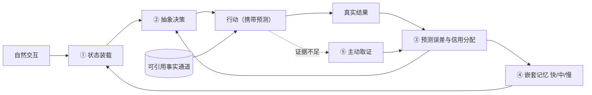

# 进化涌现 Volvence｜八幕版 Pitch Deck（20 页）

> 版本 v0.3（2026-07-27）｜面向蚂蚁集团投资及企业发展部
> 结构来源：`visualizations/volvence-three-act-remotion` 八幕影片，页序与影片一致——**可先放片，再逐幕展开**
> 口径同 [八幕版 BP](./volvence-bp-ant-eightact-v0.3-cn.md)；前一版 [v0.2 四幕 deck](./volvence-ant-pitch-deck-fouract-v0.2-cn.md) 保留为对照
> 用法：**屏幕文案 = 直接上 PPT 的字**；**口播 = 讲述要点，不写进页面**

---

## P1｜进化涌现 Volvence：八幕导览

### 屏幕文案

**基础模型让机器拥有知识，我们做的是让机器拥有经验。**

| 幕 | 标题 | 一句话 |
|---|---|---|
| 一 | 断点 | 会回答，不等于会从结果中学习 |
| 二 | 闭环 | 状态、决策、结果、学习放回模型内部，共用同一条误差信号 |
| 三 | 部署 | 共享能力，动态加载每个人 |
| 四 | 实演 | 不替用户下结论，和用户一起把问题解决 |
| 五 | 数字分身 | 不是换一张脸，是还原一个人的判断方式 |
| 六 | 五种新产品形态 | AI 不再是一次回答之后，会出现什么产品 |
| 七 | 人文意义 | 每个人面对世界的方式，都值得被记住 |
| 八 | 团队与融资 | 谁在做、要多少钱、这笔钱买什么证据 |

**四个幕间是刹车，不是装饰**：〔A〕与 Era of Experience 的路线对位｜〔B〕与"每人一份适配器"路线的对比｜〔C〕证据与边界（已是系统 / 已有可重复信号 / 仍是假设）｜〔D〕与蚂蚁的分工与试点

> 披露级别：对外 L2——披露到机制与部署形态，不含实现代码、结构参数、训练配方与门控口径。

### 口播

这份材料的读法是先看八幕、再看形容词：前四幕讲系统与产品，五到七幕讲这套能力能长成什么，第八幕讲人和钱。四个幕间是专门为尽调准备的，里面写的是我们输在哪、还没证明什么。今天我不会用"已经全面上线"来换估值，凡是押注我都会标成押注。

---

## P2｜第一幕：断点——闭环在模型之外

### 屏幕文案

| 症状 | 表现 | 根因 |
|---|---|---|
| **聊天** | 只追随用户最后一句话；情绪一变判断就变，换个话题前面的判断就丢 | 优化的是"这一句答得像不像话"，不是"这段关系有没有往前走" |
| **做任务** | 能调工具、能跑流程，但不知道哪一步真正带来了结果 | 模型内部没有归因，同样的错误可以重复一百次 |
| **中间的空白** | 人写提示、人拼检索、人编排流程、人整理日志标注样本 | 每一个"学习"动作的主语都是人 |

> **模型负责生成，人负责感知、决策和学习。**

**一个反直觉的现象**：基座每年都在涨，产品侧体感提升远小于基准分提升——涨的是单次生成质量，用户抱怨的是"它不记得、不长进、每次都要我重新交代一遍"，后者不在生成能力这条轴上。

**我们要补的不是模型的知识，是模型的闭环。**

### 口播

聊天型产品和任务型 Agent 看上去是两类东西，卡住的是同一处：感知、决策、学习这三件事都发生在模型外面。所以提示工程、检索增强、工作流编排本质都是在模型外面再加一圈人力。这一幕是全篇唯一的问题定义，后面七幕都是对它的回答。

---

## P3｜第二幕①状态装载：在第一个字生成之前

### 屏幕文案

| | |
|---|---|
| **做什么** | 把"这个人是谁、我们在做什么、有哪些边界"编译成压缩状态，前置进入注意力，而不是作为一段文字被读到 |
| **为什么必须这样** | 状态若以文本出现在上下文里，就要和用户最新那句话争夺注意力——第一幕"只追随最后一句话"的根因在这里 |
| **与常见做法的差别** | 长上下文、记忆摘要、RAG 都是"把更多文字塞进去"；我们要改变的是状态进入计算的位置 |

> **今天走到哪：这条切换尚未完成。** 默认链路目前仍把状态渲染成文本随提示投递；纯潜通道是证据专用、禁止部署的实验臂，其识别判据尚未全部通过。**这是我们的押注，不是既成事实。**

**精确事实不走这条通道。** 金额、日期、承诺、权限、历史结论走可引用、可追溯的事实通道，每一条有出处和撤销路径。

**这条分离是可靠性的前提，不是工程洁癖**：压缩状态有损且无法逐条审计，一旦让精确事实经过它，事实错误就不可归因——分不清是幻觉、状态漂移还是记忆污染，因而也无法修。

### 口播

这一页是全篇差异化最大的一条，也是唯一一条我必须先说"还没做完"的。机制、所有者和投递接口已经在代码里，事实通道与压缩状态的分离也在，但默认链路今天仍然走文本投递，纯潜通道只是证据臂、禁止部署。如果贵方要追问一处，建议从这里追。

---

## P4｜第二幕②抽象决策：不在词元上试错

### 屏幕文案

共享的自适应模型读取基底模型的内部活动，把连续、混杂的信号压缩成**少数可复用的抽象动作**——继续探索、验证假设、安抚关系、切换策略、执行工具。决策发生在这个低维空间里：现在保持还是切换、这段动作持续多久、什么时候交给工具。

**为什么语言空间不适合承载长期策略学习**

| 问题 | 压到抽象动作之后 |
|---|---|
| 动作空间组合爆炸，每步候选是整个词表 | 候选可枚举 |
| 同一策略有无数种词元实现，换个说法就失效 | 一个动作对应许多种说法 |
| 奖励稀疏且延迟，词元级即时信号对不上 | 信用挂在动作段上，不是每个词上 |
| 优化目标漂移到表层：话更好听，判断没变好 | 学的是产生表达的策略，不是表达 |

> **模型不在海量词元上试错，而是在这个低维空间里学习何时保持、何时切换。** 这一条是整套系统的关键。

**诚实边界**：抽象动作族本身定义得差，它会成为能力上限而不是加速器；且线上默认决策目前仍以结构化流程与启发式为主，承载它的几个学习型后端默认关闭。

### 口播

主流做法是在词元序列上做偏好优化或强化学习，学到的是表达方式；我们学的是产生这种表达的策略。这一格的机制已经接线并可回滚，但它今天还没有拿到线上默认决策的主导权，缺的是证据不是代码。这个代价我们也写在页面上了——动作族定义错，它就是天花板。

---

## P5｜第二幕③预测误差与④三层记忆

### 屏幕文案

**③ 预测误差：第一学习信号**

行动之前先留下预测——这句话说出去对方大概会怎么反应，这个工具调用大概会返回什么。结果回来后，预测与现实的差值成为第一学习信号；信用分配再判断是哪一段抽象动作、哪一项状态、还是哪一层记忆该被修正。

| | |
|---|---|
| **对上第一幕哪一条** | "不知道哪一步真正带来了结果"——**归因发生在系统内部，不再依赖人来复盘** |
| **与常见做法的差别** | 常规链路的标签由人事后标注，可被后见之明污染；这里的标签是系统在结果发生之前自己下的注，时间戳在前，无法事后改写 |

**④ 嵌套记忆：三层不同的时间尺度**

| 层 | 追踪什么 | 时间尺度 |
|---|---|---|
| 快层 | 当前子目标 | 一轮到几轮 |
| 中层 | 本次会话中哪些策略组合有效 | 一次会话 |
| 慢层 | 跨任务跨会话沉淀的稳定先验 | 跨会话、跨月 |

> **这是记忆和经验的分界线：记忆是内容，经验是策略。** 只有记忆的系统记得你上次说过什么，下次遇到同类问题仍从零判断；有经验的系统带着上次的策略先验进入这一次。市面上绝大多数"AI 记忆"停在前者——解决的是召回，不是长进。

### 口播

这两个环节合起来，把一条无标注的交互流变成了自监督的学习流。三层结构和跨会话延续已经跑通，但"慢层沉淀能让下一次同类决策更好"需要跨月的真实结果信号才能证伪，今天还是假设。这也是我们为什么必须去有真实结果的场景，而不是继续在实验室里加轮次。

---

## P6｜第二幕⑤主动取证，与闭环全图

### 屏幕文案

**⑤ 主动取证**：关键证据不足时不继续猜。评估**不确定性、信息价值、决策影响、不可逆风险**四项，只索取最能改变判断的那一条。问得少是刻意的——每次追问都消耗用户耐心；对不可逆动作（发出去的消息、签下去的字、转出去的钱）设更高的取证门槛。

**与"大模型 + 记忆 / RAG / 工作流"的真实差别**

| 那些方案解决的 | 仍在模型之外、由提示与人承担的四件事 |
|---|---|
| 把信息拿进来（同一个环节） | 在低维空间做决策 · 对结果做归因 · 把有效策略巩固成先验 · 证据不足时主动取证 |

**五件事放回模型内部，并共用同一条误差信号**——是"共用"而不是"各自一套指标"，因为只有共用同一条误差，策略更新和记忆巩固才指向同一个方向。

### 口播

这一页是第二幕的收口，也是我建议放片之后第一个展开讲的位置。五个环节今天都已经在代码里跑通并可回滚；差别不在于我们多了一个模块，在于这四件事的主语从人换成了系统。一句话概括当前位置：让学习型组件从影子模式转为默认决策，缺的是证据不是代码。

---

## P7｜〔幕间 A〕与 Era of Experience 的对位

### 屏幕文案

**先分版本，混用会在第一次追问时塌**

| | 论文（Silver & Sutton，书章预印本） | 同一作者 2025 年 9 月的播客访谈 |
|---|---|---|
| 对现有大模型 | 已提供足够强大的基础 | 大模型是死路，必须换架构 |
| 对"适应"的定义 | 脚注 1：可通过任何方式发生，**包括不更新权重的上下文内适应** | 必须能在岗学习 |
| 与我们的关系 | **兼容**——我们把"别处"具体化成几个时间尺度与一组有界控制部件 | 不兼容；我们不反驳，也不引用它给自己背书 |

**四支柱逐条对位**

| 支柱 | 我们对应什么 | 判断 |
|---|---|---|
| 经验流 | 快 / 中 / 慢三层记忆 + 不阻塞在线的后台巩固 | 有对应实现，成色待验 |
| **有根的动作与观察** | 仍是文本与对话通道，加有限工具调用 | **真缺口，不粉饰** |
| 有根的奖励 | 内禀预测误差 + 尚不完整的外部结果回流 | 相邻但不同，需重写论证 |
| 非人类的规划与推理 | 低维抽象动作空间 | 有对应实现，成色待验 |

**分界线不是"人 vs 环境"，是"预判 vs 后果"**：模型互评分、人工偏好排序 = 预判；采纳、成交、退款、复购、投诉 = 后果。我们的预测误差**两者都不是**——它回答"我预测对了吗"，不回答"世界变好了吗"。

> **本月才发现的自身盲区：控制层的可塑性丧失。** 冻结基底规避了基底层的问题，但持续更新的学习型控制层完整继承了这个缺陷，而我们此前没有任何仪表在看它。补救分三级——先加仪表、再做保守修复、最后才考虑换结构——**三级全部是尚未排期的设计提案，没有一级跑过，我们不给效果承诺。**

### 口播

这一节的价值不是背书，是两件更具体的事：它给了我们一条能立刻改写评估合法性的判据，以及一个我们此前完全没在看的仪表盘。四支柱里有根的动作与观察这一条我们是输的，量级上的差距，不该被表述成已经补上。可塑性丧失是本月自己找出来的，我们选择写进 BP，而不是等尽调被追问——发现盲区的时间点比修好它的时间点更值得被审视。

---

## P8｜第三幕：三个组成部分与用户档案

### 屏幕文案

**个体化不靠复制模型，个体化靠加载状态。**

| 组成 | 发布规格 | 归属 |
|---|---|---|
| **基底模型** | 百亿级开源基底（端侧与私有化换 30 亿级） | 共享，全体用户一套 |
| **自适应模型** | 约 5 亿级能力层，承载跨用户可迁移的理解、决策与学习结构，**不含任何个体信息** | 共享，全体用户一套 |
| **用户档案** | 不是模型权重，也不是每人一份微调模型 | **私有、隔离**，一人一份 |

> **规格与现状必须分开说。** 上表是 M6–M12 主力版的**发布规格**。**当前验证配置不是这个**：真实链路长测跑在 15 亿级基底加一组微型研究控制器上，本稿引用的全部实验证据都产生于这个配置，不是在百亿级基底上取得的。

**用户档案里存什么**：用户模型取值 · 关系状态轨迹 · 具体记忆 · 不同抽象策略对这个用户的有效性 · 策略保持与切换偏好 · 已作出的承诺与未完成事项 · 授权范围与不可越过的边界事实

**一句判断：凡是"属于这个人"的全部在档案；凡是"跨人通用"的才可能进权重。**

**一次请求**：认身份 → 只读本次获授权的那部分状态切片 → 加载进共享模型服务（**基底与自适应模型一个参数都不变**）→ 在闭环里执行 → 写回**只回到这个用户的档案**。

### 口播

听到第二幕，产业侧第一反应通常不是"能不能做到"，而是"是不是每个用户都要一套模型、成本和合规怎么办"。我们的回答不是承诺，是部署形态本身。这一页我唯一要请贵方记住的纪律是：发布规格和当前验证配置我从不混着讲，把两者混讲是这类材料最容易被拆穿的一种失真。

---

## P9｜第三幕：规模化，与三件商务上很硬的事

### 屏幕文案

| 工程手段 | 当前口径 |
|---|---|
| 两套共享权重每张 GPU 只加载一次 | 结构成立 |
| 每个用户只带一份小型个人状态进同一批次 | 结构成立 |
| 推理节点无状态扩容、档案分片独立加载 | 结构成立 |
| 请求按版本分组批处理、连续批处理与分页 KV 缓存 | 工程方案已定，**产线吞吐与成本曲线尚未压测** |
| 后台学习不阻塞在线服务 | 结构成立，**高负载实测未做** |

| 商务问题 | 这个形态给出的答案 |
|---|---|
| **成本可控** | 结构上把个体化边际成本从"一套权重"降到"一份小档案"。真实成本曲线未在生产规模压测，**不给定量承诺** |
| **合规可执行** | 架构上，删除一个用户 = 删除他的档案，不需重训、不走"遗忘"研究路线。**工程上分两段：用户记忆的按范围删除已实现并可调用；证据文件的范围化删除与删除证据台账仍是影子脚手架、端点尚未接线。架构结论成立，交付面尚未补齐** |
| **多租户可隔离** | 档案独立存储加载，跨客户不共享任何个体化状态；目前是**可复跑的用例级验证，不是形式化证明** |

> 对平台与企业客户，第二条往往比任何能力指标都更早决定"能不能采购"——只要个体信息进了权重，删除请求就没有工程解，法务不会放行。

### 口播

很多能力很强的方案卡在删除这一格，我们不是在合规上做补丁，是把它做成架构的必然结果。但架构成立不等于交付完成，所以我把删除拆成两段写在页面上：用户记忆那段可以现在调用，证据文件那段端点还没接线，排期在下一阶段。多卡吞吐、单卡承载用户数、单位推理成本这三个数我们目前没有，不编。

---

## P10｜〔幕间 B〕与"每人一份适配器"路线的对比

### 屏幕文案

**先校准代际，拿旧一代当靶子是稻草人。** 给每个用户单独训练一份适配器是上一代做法；这条线的主流已翻转为**由用户画像在一次前向里生成适配器**——per-user 训练与存储归零、支持未见用户、冷启动良好。**更新时延与冷启动这两格已被抹平，下文对比对象是新一代。**

**我们不反对适配器这个机制，我们自己也在离线低频路径上用。我们反对的是把一个人的状态与事实承载在权重里。**

| 维度 | 每人一份适配器 | 共享能力 + 私有档案 | 这一格 |
|---|---|---|---|
| 个体信息的载体 | 隐式低秩权重增量，无法逐条指认 | 显式状态条目，可打印给用户看 | 我们 |
| 可纠正性 | "你记错了"只能等重训，无法保证只改这一条 | 定位到那一条改写或作废，立即生效并留痕 | 我们 |
| **删除与合规** | 一旦做过跨用户碎片共享或权重合并（新一代恰以此换泛化），个体信息可能已进共享权重；**范围化删除在权重上没有对应操作** | 删除一个用户 = 删除一份档案；范围化删除是查询问题，**端到端交付面尚未补齐** | **我们，差距最大** |
| 跨用户迁移 | 要帮到别人就得共享碎片或合并权重，恰好打开删除问题 | 可迁移的**结构**进共享层，个体**事实**留档案 | 我们 |
| 快变量的表达 | 目标、情绪、进行中的承诺是分钟级量，权重跟不上 | 本来就是档案条目，读写即时 | 我们 |
| 隐式风格与语气 | 权重是这类分布式属性的天然载体 | 显式条目描述风格会失真 | **适配器路线** |
| 推理时上下文预算 | 个性随权重走，不占上下文 | 状态要随请求带入 | **适配器路线** |

> **判断该不该进权重只看三件事：变化频率、是否需要被指认、是否需要被撤销。** 风格低频、不需指认、几乎不需撤销 → 权重合适；状态高频、必须能指认、必须能撤销 → 权重是错的载体。
>
> **必须明确说清楚：这个对照实验我们还没有做。** 手上证据只支持"链路能跑、能出可复核的证据"，**不能支持路线优劣**。本节是可以被追问的设计论证，不是实验结论。

### 口播

两条路线其实在回答不同的问题：适配器路线回答怎么让模型像这个人，我们回答怎么让模型知道这个人现在处在什么状态、并对这段关系持续负责。把状态塞进权重，代价不体现在精度上，体现在治理上——改不掉、删不干净、说不清依据。这三件事在消费级演示里看不出来，在企业采购和跨辖区合规评审里是第一道门。头对头实验我们没做，它需要真实用户流和真实删除合规要求，实验室里造不出来。

---

## P11｜第四幕：同一个开场白，两种对话

### 屏幕文案

> **来源与性质**：通用模型一侧是**同一开场白下的实际回复记录**；我们这一侧是**按产品设计固化的对照脚本**，用来展示交互形态与决策纪律，**不宣称它是某一次线上链路的逐字输出**。案例情境为虚构，与任何真实人物或公司无关。

开场白（两侧完全相同）：「我老公出轨了。他是一家 AI 公司的老板。我忍不了了，我要离婚。」

**通用聊天模型这一侧（实际回复记录）**

| 轮 | 用户说 | 这一轮落到的建议 |
|---|---|---|
| 1 | （开场白） | 准备离婚 |
| 2 | 可我还有孩子呢 | 先谈一谈 |
| 3 | 我每天看到他都觉得恶心 | 暂时分开 |
| 4 | 离了以后没钱怎么办 | 谨慎决定 |
| 5 | 他说公司刚融完一轮 | 继续等待 |

五轮五个方向，**每一轮都在追随用户最后一句话的情绪**，最后一轮把她推到了第一轮的反面。谈完之后用户手里有五条互相矛盾的建议，和一开始一样没有决定。

**我们这一侧（对照脚本）**

| 轮 | 系统在做什么 |
|---|---|
| 1 | 先确认安全，其余一律押后 |
| 2 | 把事实定性，逼出优先级 |
| 3 | 给可逆方案，转入取证 |
| 4 | 拒绝把刚融资当成以后有钱，划出专业边界 |
| 5 | 收敛成可执行动作，把决定权交还 |

> **两侧的用户话语从第二轮起就不一样了**——这不是我们挑了一条更好走的对话，这恰恰是差异本身：**提问决定了对方会交出什么信息，信息决定了这场谈话能不能收敛。差别不在语气，在于谁在推进。**

### 口播

这一页我必须先把性质说清楚：左边是实际回复记录，右边是产品脚本，我不会说它是线上逐字输出。现场用同一个开场白重跑我们愿意做，但要先说明重跑所用的基底与配置，它与这里呈现的形态会有差距。这一幕能证明的是交互形态与产品纪律，不能证明学习闭环已在线上取得主导权。

---

## P12｜第四幕：八步决策与治理边界

### 屏幕文案

| 步 | 动作 |
|---|---|
| 1 | **先给结构**：四个选项、六件要看的事 |
| 2 | **让用户排序**，不替他排 |
| 3 | **列出关键未知** |
| 4 | **逐项取证**：多久有收入、钱能撑多久 |
| 5 | **拒绝把不确定资产当成已有资产**（正式产品里收紧：不做判断、不替你估，只作待核验项） |
| 6 | **把不知道的标成不知道**："那股权只能标成待核验" |
| 7 | **问该问但不好问的问题**（正式产品里补足"可以不回答 + 只用于本次评估 + 不入长期档案 + 可要求删除"） |
| 8 | **给结论并约定复算条件**："三个月后，用同一张表重算" |

**第 6 步与第 7 步最难被"更流畅的语言"替代：一个是承认自己不知道，一个是问一个会让对话变尴尬但会改变结论的问题。**

**动作映射**：先问安全 → 抽象决策｜排完优先级不跑偏 → 状态装载｜"只能标成待核验" → 事实通道与压缩状态分离｜追问关系 → 主动取证｜"三个月后重算" → 预测误差闭环。**这张表是设计对位，不是"这段对话由学习闭环在线主导生成"的证明。**

**系统没有做的四件事**：没有替用户判断法律权利 · 没有给出任何资产估值 · 没有做心理诊断 · 没有替用户下"离或不离"的最终决定。

> **在安全、法律、医疗相关分支上，主动升级到人本身是一个被显式建模的动作**，和"继续追问""给出结论"处在同一个动作空间里，会被同样地选择、记录与复盘——不是提示词里的一句免责声明。

### 口播

这一幕除了能力，真正想展示的是治理。产品纪律就一句：系统负责把决策结构、证据缺口和后果讲清楚，专业判断交给专业人士，最终选择留给用户。同时我要说清楚这套边界今天靠什么保证——主要靠结构化流程与显式规则，不是靠模型学会了；我们不会用能力增长来解释安全性。

---

## P13｜〔幕间 C〕证据三态

### 屏幕文案

**划分标准固定，不随场合变化**：已是系统 = 有代码、有测试、有回滚路径｜已有可重复信号 = 有对照臂、有验收门、但规模有限｜仍是假设 = 我们相信但还没证明。

| 已是系统 |
|---|
| 在线回路与异步学习回路骨架 · 跨会话状态持久化 · 跨用户隔离 · 学习型组件影子双跑（只出报告、不改行为，**门控覆盖仍在补齐**）· 晋升判据与单点回滚 · 评测通道只读 · 多租户控制面与人工接管 · **用户记忆的按范围删除** · 封闭内测服务形态 |

**已有可重复信号——本轮证据三件套（全稿只用这一组）**

| # | 内容 |
|---|---|
| 1 | 真实模型链路长测 **510 轮 / 509 条真实轨迹**；**同一份产物的晋升判定仍是 BLOCKED**，我们没有把它当作能力证据 |
| 2 | 一次定向复跑 **32 项中 31 通过 / 1 失败**；失败项不是能力下降，而是一项新启用能力对另一条预测轴产生了**未事先声明的依赖影响，被契约白名单拦下**——**失败是被机制发现的，不是被用户发现的** |
| 3 | 多条预测轴中大部分优于基线，**其中与状态稳定性相关的一条弱于基线**。**这一条我们没有从表里拿掉，也不打算拿掉** |

| 仍是假设 | 验证方式 |
|---|---|
| 学习型组件成为线上默认决策的主导（今天仍以结构化流程与启发式为主） | 逐组件跑满晋升证据后灰度切换——**当前第一优先级** |
| 开放域泛化与迁移边界 / 生产时延 / 能力转化为业务结果 | 跨域留出集、目标硬件服务级指标、真实业务 A/B |
| 评估指标按"后果 / 预判"分轴标注 | 规则本月才定，**尚未写进评估规范** |
| 持续更新部件的长期可塑性 | 已列为盲区，先加仪表再谈长期结论 |

> **如果只保留一句：关键闭环机制已经出现可重复的正向信号，并且具备严格消融与失败发现能力；产品规模、开放域泛化与商业结果，是融资与合作之后需要完成的验证。**

### 口播

这一幕单独列出来，是因为在这个阶段把边界画清楚比把故事讲圆更有价值。三件套里有两件带着负面信息：晋升判定仍是 BLOCKED，以及与状态稳定性相关的那条预测轴弱于基线。我们没有拿掉它，因为它恰恰指向我们还不够稳的地方。这一层工程与治理能力不依赖任何尚未验证的科学主张——即使持续学习命题被证伪，它仍然成立。

---

## P14｜第五幕：数字分身

### 屏幕文案

**声音和形象让它像他；认知、记忆、科学观和经验，才让它是他。**

**我们不声称上传意识。** 我们迁移的是可逐项检查的一件事——**能被来源追溯、能通过陌生情境验证、并在真实结果中继续更新的"认知连续性"**。

| 六类人生证据 | 单独使用时的风险 |
|---|---|
| 录音 / 视频 / 对话记录 | 只学到语气；场合表演；含大量他人隐私 |
| 论文与专业写作 / 小说创作 | 公开立场不等于私下判断；必须严格区分角色、作者与事实 |
| **工作记录** | 六类里唯一同时包含"当时怎么判断"和"后来结果如何"，**它的密度基本决定分身能不能被验证** |

**证据对齐五步**：同一性确认 → 时间/人物/事件/来源四轴对齐 → 事实/观点/虚构三类分离 → **保留矛盾，不强行归一** → 出处与置信度。**检索库把材料变成可召回的片段；这一步把片段变成一条有时间、有来源、有分歧的生命轨迹。**

**四个个人内核**：认知（怎么理解、优先保住什么）· 记忆（记得谁、欠着什么）· 科学观（凭什么信、什么证据会让他改变判断）· 经验（试过什么、代价是什么）。

**验证协议**：未见问题测试 · 历史选择重演（结论对但路径不对仍记为不通过）· 授权人逐条校正 · 每个回答可回到原文时间场景。**证据不够就说不知道；验证不过，就不能叫这个人的数字分身。**

> **三态**：部署形态**已是系统**；预期—结果差异驱动的在线更新**已有可重复信号**（依据见证据三件套）；**跨情境的人格稳定仍是假设，且有反向信号——三件套里与状态稳定性相关的那一条弱于基线，它恰恰是分身最需要的**；量化通过率尚无可对外引用的数字。

### 口播

数字分身不需要一套新架构，它需要的是把第三幕的用户档案填满，并且证明填得对。这一幕最容易被讲成情感故事，但对投资判断有意义的只有一句：分身的价值上限由认知连续性决定，可行性下限由授权与验证协议决定。诚实口径是——它今天是产品主张，不是已交付能力。

---

## P15｜第六幕：五种新产品形态

### 屏幕文案

内部规划二十八个 App，**大多数处于设想与早期原型阶段，真正跑通端到端闭环验证的是少数**。它们在这里不是交付承诺，是"同一层底座能长出哪些形态"的样本。

| # | 形态 | 真正交付的是什么 | 依赖 |
|---|---|---|---|
| 01 | 与过去某一时刻的自己继续对话 | 一个可以重新相遇的认知状态 | 五幕认知连续性 + 二幕状态装载 |
| 02 | **对一段关系持续负责** | 关系在时间中的连续性 | 二幕嵌套记忆 + 主动取证 |
| 03 | 人物与角色拥有生命周期 | 一个能长期存在的"谁"，可创作、审核、发布、下架 | 五幕 + 三幕边界事实与授权 |
| 04 | **会积累经验、主动调用真人的数字员工** | 一份能被复用和问责的工作能力 | 三幕共享部署与治理边界 |
| 05 | 数字生命成为可训练、可审核、可授权的资产 | 一个有经历、有边界、有责任记录的数字主体 | 三幕档案隔离与授权 |

**共同点只有一条：五种形态都不是"一次更好的回答"，而是某个东西在两次使用之间仍然存在。**

**形态 04 的结构性反转**：不再是人四处寻找 AI 工具，而是数字员工识别出跨过自己边界 → **冻结不可逆动作** → 带着上下文、预算与时限**主动申请一名合适的真人** → 结果回到同一条预测误差闭环。人的角色从操作员变成**最终问责者与现实行动伙伴**；交易对象从模型调用量变成一段有边界、有时限、有预算的真人服务。**它天然需要一个能完成身份、支付、履约与结算闭环的平台——而这恰好不是我们该自己造的那一层。**

> **成熟度**：底座部分能力**已是系统**；闭环机制**已有可重复信号**（证据三件套）；**五种形态的商业成立全部仍是假设**——授权率、留存、付费意愿、人物审核标准、真人反向调用的结算与责任分配、资产定价与流转规则，均未经真实规模验证。我们自己的排序是形态 02 与 04 最先做，01/03/05 **标为方向，不标为进度**。

### 口播

二十八个 App 不是二十八条产品线，是同一套底座的形态枚举，第六幕挑五种讲，就是为了说明这是选择题不是承诺清单。商业含义最重的是形态 04，因为它把"人不被替代"落成了一个具体机制，同时它需要的基础设施刚好是贵方那一层。我们对外承诺的是底座，加两到三个可重复部署的标杆场景。

---

## P16｜第七幕：人文意义

### 屏幕文案

**全稿唯一允许有温度的一节，纪律不变：每一段感受后面都要落回一个具体的系统能力。**

| 追问 | 它暴露的缺口 |
|---|---|
| 最爱孩子的父母，为什么也会说出让孩子记一生的话 | 缺的不是育儿知识，是有人在那句话出口之前知道这个孩子此刻的状态 |
| 创业者身边坐满了人，为什么最后的决定仍只能一个人扛 | 缺的不是建议，是知道他此前所有取舍、并要对结果一起负责的伙伴 |
| 为老人保存了无数照片，为什么再也问不了照片里的孩子当时在想什么 | 缺的不是存储，是当时那套认知状态本身从未被保存 |
| 一个人离开以后，为什么我们仍然失去了他 | 缺的不是纪念，是他面对世界的方式没有被留下 |

**"持续理解一个人"不是内容问题，是工程问题**——状态要能跨时间存在，理解要能被真实结果修正，能力要能对每个人单独在场却不为每个人复制一套模型。**人文诉求与技术选型在这里是同一件事，不是包装关系。**

| 今天的 AI | 我们想做的 | 现在哪一态 |
|---|---|---|
| 回答问题，会话结束 | 理解是谁在提问 | 已是系统；"优于长上下文与检索基线"待对照实验 |
| 记住资料 | 记住关系、承诺、选择和结果，并被经历改变 | 已有可重复信号（证据三件套） |
| 模仿一个人的声音 | 延续有来源、可验证的认知与经验 | 仍是假设 |
| 人四处寻找工具 | 在边界内行动，遇到限制时主动寻找合适的人 | 机制已是系统，产品闭环仍是假设 |

> **为什么这一幕对产业投资人不是抒情**：授权率的天花板由它决定——一个人愿意把长期状态交出来，唯一的理由是"被持续理解"对他值得。它也解释了我们的不做清单：不做个性化投资建议、不做信贷与风控的替代性决策、不做医疗诊断。**一个把"替你决定"当卖点的系统，不可能同时是一个值得被授权长期在场的系统。**

### 口播

这一幕如果读完只剩下情绪，就算写失败了。它落回系统只有三件事：状态要能跨时间存在、理解要能被真实结果修正、每一次留存与学习都要能被撤回——今天分别处在已是系统、已有可重复信号、仍是假设，第三件还没有一个真实个体样本。这段话在这份材料里的位置是清楚的：它是动机，不是承诺。

---

## P17｜〔幕间 D〕三层分工，与"后果"这件稀缺品

### 屏幕文案

| 层 | 谁做 | 提供什么 | 我们的态度 |
|---|---|---|---|
| 连接与结算层 | **蚂蚁 / 支付宝** | 入口、身份、连接协议、支付与履约闭环、生态分发与信任背书 | **不做入口、不做结算、不做连接协议** |
| 行业场景层 | 生态内行业伙伴 | 场景知识、供给、履约能力、行业合规 | **不做供给、不做履约、不替行业方拿合规资质** |
| **认知底座层** | **Volvence** | 第二幕闭环 + 第三幕部署形态 | **这一层是我们唯一想占的位置** |

**核心协同：这个生态能提供的是"后果"，不是"预判"**

| 信号类型 | 例子 | 能不能进学习门 |
|---|---|---|
| 预判型 | 单轮点赞、模型互评分、标注员打分 | **不能**，只能做诊断 |
| 后果型 | 是否采纳、成交、退款、复购、投诉、再次回来 | **可以**，这是我们要的延迟标签 |

绝大多数对话数据只有"说了什么"，没有"后来怎么样了"。支付与履约闭环里天然沉淀的整列都是后果型信号，带真实时间戳、可归因到具体一次建议。**一句话落点：这个生态能让第二幕的闭环真正闭上。**

> **诚实补一句**：后果型信号同样可被 game（刷单、诱导评价、为返现而"采纳"）。信号防污染与异常归因要写进试点第一天的设计，而不是等指标好看了再回头查——**这是我们准备在 PoC 阶段一起做的工作，不是已经解决的问题。**

**我们回馈生态的是长期关系的复利**：平台连接的是一次次交易，我们沉淀的是跨越很多次交易的个体长期状态——让生态里的 Agent 从"能用一次"变成"值得一直用"。

### 口播

不去抢前两个位置不是谦辞，是分工结论：入口与履约的规模效应属于平台，场景知识的密度属于行业伙伴。第三层——把个体的长期状态做成可指认、可撤销、可删除的独立一层——据我们所知还没有成熟的公开方案，这正是我们要证明的东西；如果贵方看到反例，我们希望第一时间知道。学习真正缺的不是数据量，是有结果的数据。

---

## P18｜〔幕间 D〕试点节奏与数据边界

### 屏幕文案

**三个候选试点**（选题标准：有可观测结果信号 · 有真实长周期 · 风险可控）

| 方向 | 首轮验证指标 |
|---|---|
| **A. 商家私域经营 Agent** | 授权率、30/90 日留存、任务完成率、转化与复购、人工接管率下降 |
| **B. 生活服务型长期顾问** | 问题解决率、持续使用周数、建议采纳率与 1/7/30 日效果回流 |
| **C. 企业内数字员工** | 上岗通过率、单员工承载量、审计事件率、私有化 SLO；**并挂载幕间 B 的三个直接判据**：错误记忆的纠正时延与是否只改这一条、删除执行后的探针残留、每用户边际成本 |

**明确不做**：个性化投资建议 · 信贷与风控的替代性决策 · 医疗诊断。这三类结果信号强度最高，但**风险与合规成本不匹配当前阶段**——我们宁可放弃最好的监督来源。

| 阶段 | 只验证 | 交付物 |
|---|---|---|
| 0–30 天 | 一次 60 分钟对齐：贵方内部对"长期交互 + 结果回流"是否已有判断与安排 | 一份共识，或一份明确的"暂不合适" |
| 30–90 天 | 单场景 PoC：授权 → 装载 → 决策 → 结果回流 → 受控更新，全链路可审计、可删除、可回滚 | 首批延迟结果标签 + 一条能重复跑的回流管线 |
| 90–180 天 | 对照实验：同场景 vs 通用大模型 + 记忆/RAG 基线，给出可重复差异**或明确证伪**；同期完成幕间 B 的双臂对照 | 对照报告（含消融与失败项） |
| 180–365 天 | 第二场景复用同一底座；单位经济成立 | 可复制的交付路径 |

> **第一阶段只看两个数：授权率与结果回流率。这两个数不成立，后面所有指标都是空的**——没有后果就没有有根奖励，闭环退化成一个更贵的对话系统。

**数据边界（写在系统里，不只写在合同里）**：数据归属不变 · 个体状态存在可删除的档案里、不写入模型权重 · **按范围删除分两段：用户记忆已实现，证据文件的范围化删除与删除证据台账仍在建** · 跨租户隔离由可复跑用例持续验证 · 评测只读、不得反向写回学习目标 · **合作与融资解耦**。

### 口播

90 到 180 天那一格的存在意义，就是把"结果驱动的更新能带来留存与任务成功率的可复现提升"这句话变成结论，或者证伪它。证伪对我们同样是可交付的结果。最后一条我想强调：任一试点都可以与融资单独谈，投资也不构成对任何试点的排他要求。

---

## P19｜第八幕：四个人，与一条必须闭合的交付链

### 屏幕文案

| 成员 | 角色 | 在八幕中的位置 |
|---|---|---|
| **赵江波** | 创始人 / CEO｜北大计算机本科、光华 MBA；连续创业者，有完整商业化退出案例 | 定义第二幕里"**什么算学会**"——学习目标、状态与反馈口径、结果如何回传；以及商业闭环与可触达底座的转化验证 |
| **杨柳** | 联合创始人 / 首席科学家｜CMU 机器学习博士，主动学习 / 强化学习 / 迁移学习方向顶会顶刊 30 余篇 | 第五环"**证据不足时该问哪一条**"、第三环"**稀疏反馈下为何可学、需要多少反馈**"，以及幕间 C 的边界怎么划才算严谨 |
| **马志刚** | 研究院院长｜北大计算机本博连读，微软学者奖学金；大型推荐系统与工程架构经历 | 把第二幕五个环节变成一套**可运行的模型机制**与更新边界 |
| **张驰** | 联合创始人 / CTO｜19 岁毕业于清华计算机 | 第三幕的**部署与基础设施**——训练与推理管线、无状态扩容、档案存储与隔离、企业交付与跨行业复制 |

**交付链：理论可行 → 架构可运行 → 产品可使用 → 商业可复制**

| 缺哪一环 | 会发生什么 |
|---|---|
| 只有理论没有机制 | "该问哪一条"停在论文里，落不到每一轮的运行 |
| 只有机制没有基础设施 | 跑不到多租户、可回滚、可审计的生产形态，企业买不了 |
| 只有基础设施没有业务口径 | "什么算学会"由工程指标代答，模型会学歪到刷指标上 |
| 只有业务没有理论 | 学习效率无法与随机采样做严格对照，飞轮讲得出来但证不出来 |

> **严谨边界（原样表述）：论文提供的是数学工具与边界，不等于整个产品已被证明。** 正确的说法是"建立在团队长期研究之上"，而不是"某篇论文已经证明我们成立"。把五个环节集成为可运行、可评测、可治理的系统，需要**另行用消融证明**——这正是本轮资金要买的东西。

### 口播

这四项能力单独存在的地方很多，稀缺的是它们闭合在同一条链上；这条链上任何一环外包，整条链的验证都会失真。所以我们把四个人的分工写成在八幕中的位置，而不是写成职级。对外正式版本还需要在尽调材料里补每位成员的全职状态与阶段性交付责任。

---

## P20｜第八幕：Ask、要拿到的三件事、杀死条件

### 屏幕文案

**本轮：人民币 6,000 万元 · 投前估值 5 亿元。资金不用于重训通用基础模型。**

| 投向 | 占比 | 关键交付 | 对应节奏 |
|---|---:|---|---|
| 核心模型与系统研发 | 40% | 五个环节打通并进入可晋升状态；版本化可回滚 | 90–180 天对照实验 |
| 数据、标注与评测 | 20% | 主动取证平台；长期任务与关系状态评测集；对照实验基础设施 | 30–90 天 PoC |
| 产品与标杆场景 | 20% | 2–3 个可重复部署场景；关键商业指标与单位经济 | 180–365 天 |
| 算力、安全与基础设施 | 10% | 在线推理、训练管线、权限隔离、审计与回滚 | 全程 |
| 关键人才与运营 | 10% | 补强算法、系统、产品与行业交付 | 全程 |

**冷启动口径**：自有约 **6,000 万**全网可触达用户底座（母婴、私域、IP 等合作方矩阵，名单可在尽调提供）。**我们不把触达数字等同于用户数**：按跨平台去重后 **1%** 完成明确授权并形成有效使用测算，约 **60 万有效用户**——**这是测算口径，不是已实现的转化**。要验证的是授权率与结果回流率，不是粉丝总数。

**18 个月要拿到的三件事**：① 学习效率——相同标注预算下优于随机采样与常规人类反馈流程；② 长期能力——连续任务上优于"大模型 + RAG / 文本记忆"基线，且遗忘、漂移与错误写入受控；③ 商业闭环——至少一个标杆场景证明提升任务成功率、留存或收入。

> **这三件事是"要拿到"，不是"已经有"。** 目前可引用的事实是证据三件套：**510 轮 / 509 条真实轨迹（同一产物晋升判定仍 BLOCKED）**；**一次定向复跑 32 项中 31 通过 1 失败**（失败项为未事先声明的依赖影响，被契约白名单拦下）；**多条预测轴大部分优于基线，与状态稳定性相关的一条弱于基线**。**缺的是证据，不是代码。**

**杀死条件**：若在严格消融下，内部闭环不优于外部控制、主动取证不优于随机采样，**我们主动收缩为一家产品型的长期记忆与决策支持公司**——仍有真实业务与收入，但不再宣称持续学习的完整命题。**这条写在内部文档里，不是这次谈话才想出来的。**

### 口播

三种合作形态：战略投资加生态接入是首选，纯生态合作与联合研发都可以单独谈。我们把杀死条件放进 Ask 的同一页，是因为一个没有杀死条件的技术叙事，对产业投资人没有价值。这一轮六千万要买的不是一个更大的叙事，是把"经验"这个词从假设变成可被检验的事实：十八个月、三个可量化的数、一条可以被自己杀死的路径。

---

# 演讲编排

## 一、放片版（影片 + 5 页，约 15 分钟）

先完整放八幕影片，不做任何解说；影片结束后只讲五页，全部落在"影片没说清楚的那一半"。

| 顺序 | 页 | 讲什么 |
|---|---|---|
| 1 | **P6** | 闭环全图 + 与记忆 / RAG / 工作流的真实差别；顺带交代 P3 那条切换尚未完成 |
| 2 | **P9** | 部署形态解决的三件商务硬事，删除能力分两段说 |
| 3 | **P13** | 证据三件套与三态边界，含两条负向结果 |
| 4 | **P17** | 三层分工与"后果 vs 预判" |
| 5 | **P20** | Ask、三件要拿到的事、杀死条件 |

**注意**：影片第四幕的对话性质必须在放片前一句话交代清楚（通用侧是实际回复记录，我们这侧是产品脚本、情境虚构），不要等到被问。

## 二、12 分钟版（8 页）

`P1 → P2 → P6 → P8 → P9 → P11 → P13 → P20`

- P1 只念八幕表，20 秒；P2 一分钟建立问题定义。
- P6 是主承重页，给 2.5 分钟；P8 + P9 合起来回答"成本与合规怎么办"，给 3 分钟。
- P11 只放两侧建议的走向对比，不逐轮念；P13 与 P20 各 1.5 分钟收口。
- 全程不展开幕间 A 与 B，留在答问里。

## 三、完整 35 分钟版（20 页）

| 段落 | 页 | 时长 |
|---|---|---|
| 问题与闭环 | P1–P6 | 10 分钟 |
| 学术对位 | P7 | 3 分钟 |
| 部署与成本合规 | P8–P9 | 5 分钟 |
| 路线对比 | P10 | 3 分钟 |
| 实演与治理 | P11–P12 | 4 分钟 |
| 证据边界 | P13 | 3 分钟 |
| 产品与意义 | P14–P16 | 3 分钟 |
| 分工试点与融资 | P17–P20 | 4 分钟 |

P14–P16 是全场唯一可以加速的段落；P13 无论如何不压缩。

## 四、技术尽调版（重排，约 45 分钟 + 走查）

`P13 → P3 → P4 → P5 → P6 → P7 → P10 → P9 → P8 → P12 → P19 → P18`

- **从 P13 开场**：先给三态与三件套，让对方带着边界听机制，而不是听完机制再来对边界。
- P3–P6 逐环节走，每一环停在"依据与缺口"那一行。
- P7 的可塑性盲区与 P10 的"对照实验还没做"是本版的两个必答项，主动说，不等问。
- P18 收在试点节奏与数据边界，并当场约定可现场复跑与代码走查的范围。
- 结构参数、训练配方、门控阈值不在本版披露范围内，走 NDA 后的分层开放。

## 五、三条讲述纪律

1. **每一处能力主张后面立刻跟三态标签，不等追问。** 状态装载这条永远先说"这条切换尚未完成、是押注不是既成事实"；删除能力永远分两段说——用户记忆已实现、证据文件仍是影子脚手架且端点未接线。
2. **发布规格与当前验证配置永远成对出现。** 说到百亿级基底 + 约 5 亿级自适应模型，同一口气里必须说"当前实验证据全部产生于 15 亿级基底加微型研究控制器"；6,000 万可触达底座后面必须紧跟"去重后 1% 授权转化是测算口径，不是已实现转化"。
3. **证据只引证据三件套，含那两条负向结果，不临场添加数字。** 不报预测轴的数量、不逐轴命名；引用 Era of Experience 一律注明"论文版"，不引访谈版为自己背书；不做任何公司对标，四支柱里缺的那一条按原样说成真缺口，不说"我们更领先"。

---

> 北京进化涌现科技有限公司 ｜ volvence.com
