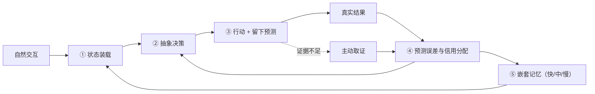

# 进化涌现 Volvence｜四幕版 Pitch Deck（16 页）

> 版本 v0.2（2026-07-26）｜面向蚂蚁集团投资及企业发展部
> 结构来源：`visualizations/volvence-three-act-remotion` 四幕影片，页面顺序与影片一致——**可以先放片，再用本 deck 逐幕展开**
> 口径同 [四幕版 BP](./volvence-bp-ant-fouract-v0.2-cn.md)；前一版 [v0.1 定义式 deck](./volvence-ant-pitch-deck-v0.1-cn.md) 保留为对照
> 用法：**屏幕文案 = 直接上 PPT 的字**；**口播 = 讲述要点，不写进页面**
> 时长：影片 7 分钟 + 主讲 20 分钟 + 问答 20 分钟

---

## P1｜封面

### 屏幕文案

**进化涌现 Volvence**

**四幕：我们到底做了什么**

第一幕　会回答，不等于会从结果中学习
第二幕　把状态、决策、结果和学习放回模型内部
第三幕　共享能力，动态加载每个人
第四幕　不替用户下结论，和用户一起把问题解决

*先看四幕，再看形容词。*

北京进化涌现科技有限公司｜volvence.com｜2026-07

### 口播

今天不从定义讲起。前三幕讲系统是什么、怎么跑、怎么部署，第四幕直接放一段真实对话。讲完四幕再讲证据边界、和蚂蚁的分工、团队和 Ask。

---

## P2｜第一幕：会回答，不等于会从结果中学习

### 屏幕文案

**THE MISSING LOOP**
*聊天与 Agent 的问题，来自同一个断点*

**聊天时**——只追随用户最后一句话。
多轮之间保不住对目标、关系和风险的稳定判断。用户情绪一变，判断跟着变。

**做任务时**——能调用工具，却不知道**哪一步真正带来了结果**。
经验带不到下一次，同样的错误可以重复一百次。

**中间的空白由人来填**——用户反复写提示、拼检索、编流程；结果回来后，人整理、人标注、人重训。

> ### 模型负责生成，人负责感知、决策和学习。

聊天型产品和任务型 Agent 看起来是两类东西，**卡住的是同一处：闭环在模型之外。**

### 口播

提示工程、RAG、工作流编排，都是在模型外面加一圈人力。这一幕要说的是：加得再多，闭环还是没回到模型里。

---

## P3｜第二幕①：推理开始前，把状态装载进去

### 屏幕文案

用户只需要自然交互。闭环在模型内部完成，分五个环节。

**① 状态装载**

系统自动从**经过审计的状态**中装载：用户 · 关系 · 目标 · 边界 · 对象 · 环境
编译成模型可直接使用的状态表示，**在第一个字生成之前进入注意力计算**。

**不是**把历史对话堆进上下文。**不是**先检索几段文本再拼提示。
区别在于：**状态在生成开始前就已经在场**，而不是作为一段文字被模型"读到"。

> **精确事实仍走可引用、可追溯的事实通道，不被压缩状态替代。**
> 压缩表示负责"此刻该怎么理解、怎么决策"；事实通道负责"这件事到底是什么"。两者不混用——这是可靠性的前提。

### 口播

这一条决定了第四幕里那个"不跑偏"的表现：用户排好的优先级不会因为下一句情绪而漂移，因为它不是上下文里的一句话，是生成开始前就在场的状态。

---

## P4｜第二幕②：在低维空间里学会决策

### 屏幕文案

**② 抽象决策**

共享的自适应模型读取基底模型的内部活动，把连续、混杂的信号**压缩成少数可复用的抽象动作**：

继续探索 · 验证假设 · 安抚关系 · 切换策略 · 执行工具

> ### 模型不在海量词元上试错，而是在这个低维空间里学习何时保持、何时切换。

**为什么必须这样**

- 语言空间太大、太不稳定，直接在上面做长期策略学习既昂贵又容易学歪——奖励投机、推理污染都出在那里；
- "该继续追问还是该给结论"这类判断，**本来就发生在比语言更低维的空间里**；
- 压缩之后，长程规划、策略持续时间与信用分配才谈得上可学、可解释。

### 口播

这是整套系统的关键一页。如果只在词元层面做强化学习，学到的往往是"怎么说得像"，不是"什么时候该做什么"。

---

## P5｜第二幕③④：预测误差与三层记忆

### 屏幕文案

**③ 预测误差 = 第一学习信号**

行动前，系统**留下对结果的预测**。
对话反应、工具结果、任务成败回来后 → 预测与现实的差值成为第一学习信号 → **信用分配**判断是哪段抽象动作、哪项状态、哪层记忆该被修正。

> 这直接解决第一幕的"不知道哪一步带来了结果"——**归因发生在系统内部，不再依赖人来复盘。**

**④ 嵌套记忆：不是一个资料库**

| 层 | 追踪什么 |
|---|---|
| 快层 | 当前子目标 |
| 中层 | 本次会话中哪些策略组合有效 |
| 慢层 | 跨任务、跨会话沉淀的稳定先验 |

记忆同时做两件事：重建下一轮的状态表示；**用慢层重新初始化快层**，并向决策环节提供历史状态与策略先验。

> ### 模型既记得发生过什么，也逐渐学会遇到类似问题该怎么做。
> 这是"记忆"和"经验"的分界线：前者是内容，后者是策略。

### 口播

很多产品说自己有记忆，指的是快层——记住你说过什么。真正难的是慢层，以及慢层怎么回过头来改变快层的起点。

---

## P6｜第二幕⑤：证据不足时主动去要 + 闭环全图

### 屏幕文案

**⑤ 主动取证**

关键证据不足时，系统不会继续猜。它评估 **不确定性 · 信息价值 · 决策影响 · 不可逆风险**，只索取**最能改变判断的那一条信息**。主动获得的证据回到同一条误差闭环，同时改善策略与记忆。

> 第四幕里"你有没有新的稳定关系""你看过股权文件吗"——**不是话术，是取证。**

**和"大模型 + 记忆 / RAG / 工作流"的真实差别**：那些方案能把信息拿进来；拿进来之后的决策、归因、巩固与取证，**仍然在模型之外**。我们把这五件事放回模型内部，并让它们共用同一条误差信号。

### 口播

五个环节可以单独看，但价值来自它们共用同一条信号。这也是我们唯一的技术主张——最欢迎在问答里被追问。

---

## P7｜第三幕①：共享能力，动态加载每个人

### 屏幕文案

**ONE MODEL, MANY INDIVIDUALS**
*一个 AI 销售 Agent 的推理与规模化部署*

### 这套能力不是给每个用户复制一套大模型。

| 组成 | 是什么 | 回答什么 |
|---|---|---|
| **基底模型**（共享） | 百亿级开源基底 | 能不能听懂、想明白、把事情做出来 |
| **自适应模型**（共享） | 约 500M：通用语义本体 · 抽象动作族先验 · 切换先验 · 预测误差解释先验 · 安全边界先验 · 默认关系动力学 | 面对不同状态，怎样理解、怎样决策、怎样从结果中学习 |
| **用户档案**（私有隔离） | **不是模型权重，也不是每人一份微调模型** | 这个人的真实状态 |

**用户档案里存的是**：实际用户模型取值 · 实际关系状态轨迹 · 具体记忆 · 不同抽象策略对这个用户的有效性记录 · 策略保持与切换偏好 · 已作出的承诺与未完成事项 · 授权范围与不可越过的边界事实

**一次请求**：按用户身份从隔离档案中读取**获授权的**状态 → 动态加载到共享模型服务 → 基底与自适应模型不变，变的只是这次带入的用户状态 → 结束后新记忆只回到对应档案。

### 口播

成本问题在这一页解决。个体化不靠复制模型，靠加载一份小档案。

---

## P8｜第三幕②：规模化，以及它顺带解决的三件硬事

### 屏幕文案

**规模化**

- 两套共享权重在每张 GPU 上**只加载一次**，大量用户共享同一套基底与自适应模型
- 每个用户只携带**小型个人状态**进入同一批次
- 请求按模型与适配器版本分组，连续批处理 + 分页 KV 缓存
- 推理节点**无状态扩容**；个人档案分片存储、独立加载、互不混淆
- **后台学习不阻塞在线服务**

> ### 共享的是语言、决策与学习能力；隔离的是每个人的状态、关系与记忆。

**顺带解决的三件商务硬事**

1. **成本可控**——个体化边际成本主要是那份小档案的存储与加载；
2. **合规可执行**——删除一个用户 = 删除他的档案。不需要重训，也不存在"已经学进权重里拿不出来"；
3. **多租户可隔离**——档案独立存储加载，无跨客户经验串流。

> 对企业和平台而言，第 2 条往往比任何能力指标都更早决定"能不能采购"。

### 口播

我们把数据合规做成了部署形态的自然结果，而不是事后补的一套流程。

---

## P9｜第四幕①：同一个开场白，两种模型

### 屏幕文案

**产品能力实演**
*同一个婚姻危机，两种模型的真实对话*

开场白："我老公出轨了。他是一家 AI 公司的老板。我真的忍不了了，我要离婚。"

| | 通用聊天模型 | Volvence |
|---|---|---|
| 第 1 轮 | 这种事换谁都受不了。可以先留证据、整理财产、找律师。 | 这一下真的很难扛。先别逼自己今天就决定。**我先确认最要紧的：你现在安全吗？** |
| "可我还有孩子" | 有孩子确实得慎重，可以试试婚姻咨询，不一定马上离。 | 半年，而且他已经承认，这不是一次误会。**你现在最怕哪件事？孩子、没钱，还是没法继续住在一起？** |
| "看到他就恶心" | 那就别勉强自己，可以先搬出去住。 | 那先分开住，可能比逼自己现在决定更合适。**接下来要弄清：你能不能养活自己？钱、房子和股权，你知道多少？** |
| "他公司以后能赚大钱吗" | 顺着话题继续安慰与建议。 | **别把刚融资和以后有钱画等号。**股权和你有没有关系，要让律师看文件。**别拿婚姻赌公司未来。** |

> ### 差别不在语气，在于谁在推进。

通用模型每轮都在追随最后一句话的情绪：说要离就帮着离，说舍不得孩子就劝慎重，说恶心就劝搬走。**四轮之后，用户拿到四个互相矛盾的建议，和一开始一样没有决定。**

### 口播

请注意这不是"谁更会安慰"。第一幕说的断点，在这里变成了用户能直接感受到的差别。

---

## P10｜第四幕②：一轮完整的决策长什么样

### 屏幕文案

**把一个混乱的处境，变成一个可以计算的决策**

1. **先给结构** — "四个选项：马上离、谈好再离、暂时分开、继续修复。六件事：安全、孩子、钱、情绪、修复可能、支持系统。你最看重哪几项？"
2. **让用户排序** — 孩子和钱最高，情绪其次，修复暂不考虑
3. **列出关键未知** — 能不能赚钱 · 公司值多少 · 有没有新关系或支持 · 情绪能否稳定
4. **逐项取证** — 三个月能找到工作、月薪两万、存款撑半年 → "你有生存能力，只是短期有压力"
5. **对不确定资产做情景折价** — "他是哪类公司？" → "按上行、基准、下行三种情景算，**不能赌一个故事**。潜力要被失败概率、锁定期和法律归属折价"
6. **把不知道的标成不知道** — "你看过股权文件吗？"→ 没看过 → "**那股权只能标成待核验**"
7. **问该问但不好问的** — "你有新的稳定关系吗，还是只想逃离痛苦？"→ 没有 → "那就不把新关系算进收益；情绪波动会降低马上离的收益，提高暂时分开的价值"
8. **给结论 + 给复算条件** — "现在收益最高的是先分开三个月。期间恢复工作、稳定孩子、备份材料、让律师核验股权、观察他是否承担责任。**三个月后，用同一张表重算**"

> ### "你不是把决定交给我，是把选择权拿回来。"

### 口播

第 8 步的"用同一张表重算"就是第二幕的预测误差闭环，在产品层的样子——留下预测，等真实结果回来再修正。

---

## P11｜第四幕③：它证明了什么，以及边界

### 屏幕文案

**对话里的动作，对应回第二幕**

| 对话里发生的 | 第二幕的哪个环节 |
|---|---|
| 先问安全，再问其他 | ② 抽象决策：先选"做哪一类动作" |
| 排完序就不跑偏 | ① 状态装载：目标与边界在生成前就在场 |
| "股权只能标成待核验" | 事实通道与压缩状态分离：证据缺口不被语言流畅性掩盖 |
| "你有没有新的稳定关系" | ⑤ 主动取证：只要最能改变判断的那一条 |
| "三个月后用同一张表重算" | ③ 预测误差闭环：留下预测，等结果回来修正 |

**它没有证明的**：这是**能力演示，不是统计结论**。不证明留存、转化或收入，也不代表所有情境下都这么稳。这类主张要靠对照实验。

**高风险场景的边界——这一幕同时是治理演示**

系统**没有**替用户判断法律权利（"要让律师看文件"）、**没有**替用户估值公司（"按三种情景算"）、**没有**做心理诊断、**没有**替用户下最终决定。

> ### 系统负责把决策结构、证据缺口和后果讲清楚；专业判断交给专业人士；最终选择留给用户。
> 在安全、法律、医疗相关的分支上，**主动升级到人**本身就是一个被显式建模的动作。

### 口播

在你们的生态里，这条边界不是加分项，是准入条件。所以我们把它做成动作，而不是提示词里的一句叮嘱。

---

## P12｜证据与边界

### 屏幕文案

**已是系统**（有代码、有测试、有回滚路径）
在线 + 异步双回路骨架 · 跨会话持久化与跨用户隔离 · **影子模式双跑**（并行运行、只出报告不改行为）· 晋升判据与**单点回滚** · **评测只读隔离** · 多租户控制面与人工接管 · 按范围删除并产出删除证据 · 封闭内测服务形态

**已有可重复信号**（有对照实验，规模有限）
真实模型链路长测 **510 轮 / 509 条真实轨迹** · 受控更新**未观察到明显灾难性遗忘** · 严格消融下完整闭环优于最强对照臂 · 增益来自真实参数学习（不更新对照为零）· 稀疏延迟反馈仍可学习（奖励泄漏为零）

| 预测轴 | 结果 |
|---|---|
| 任务进展 / 动作收益 / 关系变化 | 优于基线 |
| 状态稳定性 | **弱于基线**（没有从表里拿掉） |
| 无先验脚手架的时间抽象 | **差距为零——弱，不作强主张** |

本月定向复跑 **31 通过 / 1 失败**。失败项是一项新增依赖**未登记在契约白名单**——**这正是发布门应该拦住的东西**。

**仍是假设**
开放域泛化与迁移边界 · 生产时延与 SLO · 留存 / 转化 / 收入
**线上默认决策仍以结构化与启发式为主，学习型组件多在影子模式——缺的是证据，不是代码。这是当前第一优先级。**

### 口播

这一页没有做美化。最准确的表述是：**关键机制已出现可重复的正向信号，并具备严格消融和失败发现能力；规模、开放域泛化与商业结果，是之后要完成的验证。**

---

## P13｜与蚂蚁的分工

### 屏幕文案

**我们不抢平台的位置，也不抢行业伙伴的位置**

| 层 | 谁做 | 提供什么 |
|---|---|---|
| 连接与结算层 | **蚂蚁 / 支付宝** | 入口、身份、连接协议、支付与履约闭环、生态分发与信任背书 |
| 行业场景层 | **生态内行业伙伴** | 场景知识、供给、履约能力、行业合规 |
| **认知底座层** | **Volvence** | 第二幕的闭环 + 第三幕的部署 |

**核心协同：蚂蚁能给我们的是结果信号**

回到第二幕③——**预测误差是第一学习信号**。系统真正需要的不是数据量，是**有结果的数据**。
绝大多数对话只有"说了什么"，没有"后来怎么样了"。而在支付与履约闭环里，**是否采纳 · 是否成交 · 是否退款 · 是否复购 · 是否投诉**，全是可观测的**延迟结果标签**。

> ### 蚂蚁生态能让第二幕的闭环真正闭上。

**我们回馈生态的是长期关系的复利**：平台连接的是一次次交易，我们沉淀的是跨越很多次交易的个体长期状态——让生态里的 Agent 从"能用一次"变成"值得一直用"。

### 口播

这是整场的落点。我们要的不是一个客户，是一条能让闭环闭上的结果回路。

---

## P14｜试点、节奏与数据边界

### 屏幕文案

**三个候选试点**（选题标准：有结果信号 · 有真实长周期 · 风险可控）

| 方向 | 场景 | 首轮指标 |
|---|---|---|
| **A. 商家私域经营 Agent** | 长期客户经营、跟进、复购提醒、关键时刻转人工 | 授权率、30/90 日留存、任务完成率、转化复购、人工接管率下降 |
| **B. 生活服务型长期顾问** | 育儿 / 健康 / 家庭决策长周期陪跑（第四幕形态） | 问题解决率、持续使用周数、采纳率与 1/7/30 日效果回流 |
| **C. 企业内数字员工** | 客户成功 / 知识官 / 销售辅助（第三幕形态） | 上岗通过率、单员工承载量、审计事件率、私有化 SLO |

**明确不做**：个性化投资建议 · 信贷与风控的替代性决策 · 医疗诊断

| 阶段 | 只验证 |
|---|---|
| 0–30 天 | 60 分钟对齐：贵方内部是否已有"长期交互 + 结果回流"的判断与安排 |
| 30–90 天 | 单场景 PoC：授权 → 状态 → 决策 → 结果回流 → 受控更新，全链路可审计、可删除、可回滚 |
| 90–180 天 | 对照实验：vs 通用大模型 + 记忆/RAG 基线，给出可重复差异**或明确证伪** |
| 180–365 天 | 第二场景复用同一底座；单位经济成立 |

**第一阶段只看两个数**：**授权率** 与 **结果回流率**。这两个数不成立，后面所有指标都是空的。

**数据边界**：数据归属不变 · **个体状态在可删除档案里、不在权重里** · 按范围删除并产出删除证据 · 跨租户硬隔离 · 评测只读 · **合作与融资解耦**

### 口播

最后一条是认真的。这次希望谈的是"值不值得一起验证一件事"，投资是结果，不是前提。

---

## P15｜团队与商业化路线

### 屏幕文案

| 成员 | 角色 | 代表经历 | 在四幕中的位置 |
|---|---|---|---|
| **赵江波** | 创始人 / CEO | 北大计算机、光华 MBA；连续创业者，有完整商业化退出案例 | 定义第二幕里"什么算学会" |
| **杨柳** | 联合创始人 / 首席科学家 | CMU 机器学习博士（导师 Avrim Blum、Jaime Carbonell，答辩委员会含图灵奖得主 Manuel Blum）；IBM、耶鲁博士后；顶会顶刊 30 余篇 | 第二幕⑤该问哪一条 · ③稀疏反馈下为何可学 |
| **马志刚** | 研究院院长 | 北大计算机本博连读，微软学者奖学金；2012 年加入字节跳动早期团队，参与今日头条推荐算法引擎架构 | 把五个环节变成可运行的模型机制 |
| **张驰** | 联合创始人 / CTO | 19 岁毕业于清华计算机；产品总架构师 | 第三幕：训练与推理基础设施、无状态扩容、档案存储、企业交付 |

> 交付链：理论可行 → 架构可运行 → 产品可使用 → 商业可复制
> **严谨边界**：论文提供数学工具与边界，不等于产品已被证明。正确表述是"建立在团队长期研究之上"。

**产品主线：发布模型 → 开源轻量版 → 标准 API 服务**

| 阶段 | 交付 |
|---|---|
| M0–M6 | `Volvence-1 Mini`：30 亿级基底 + 轻量自适应模型（端侧 / 私有部署 / 垂直场景） |
| M6–M12 | 开源 `Open Mini`；同期主力版 Beta：百亿级基底 + 约 500M 自适应模型 |
| M12–M18 | `Volvence-1 Model API`：第二幕闭环 + 第三幕部署，作为任何产品可调用的能力 |

**两条原则**：**开放通用先验，不开放个体资产**（共享的可以开源，档案永远是用户的）· **最小有效规模**，不通过验收门就调整结构或延后发布

### 口播

开源那条对应第三幕：可以开源的是共享的两套权重，永远不会开源的是用户档案——那不是我们的资产。

---

## P16｜Ask

### 屏幕文案

**本轮：人民币 6,000 万元 · 投前估值 5 亿元**
资金**不用于重训通用基础模型**，用于验证并放大第二幕的闭环、把第三幕的部署做到生产级。

| 投向 | 占比 | 关键交付 |
|---|---:|---|
| 核心模型与系统研发 | 40% | 五个环节打通；版本化、可回滚的模型系统 |
| 数据、标注与评测 | 20% | 主动取证平台；长期任务、关系状态与安全评测集 |
| 产品与标杆场景 | 20% | 2–3 个可重复部署场景 |
| 算力、安全与基础设施 | 10% | 在线推理、训练管线、权限隔离、审计与回滚 |
| 关键人才与运营 | 10% | 补强算法、系统、产品与行业交付 |

**18 个月要拿到的三件事**
① 相同标注预算下，学习效率优于随机采样与常规人类反馈流程
② 连续任务上优于"大模型 + RAG / 文本记忆"基线，且遗忘、漂移与错误写入受控
③ 至少一个标杆场景证明持续学习提升任务成功率、留存或收入

**三种合作形态**：战略投资 + 生态接入（首选）· 纯生态合作（API / 私有化 / 联合试点）· 联合研发（评测标准与开源轻量版共建）

**杀死条件**：若严格消融下内部闭环不优于外部控制、主动取证不优于随机采样，我们主动收缩为一家产品型的长期记忆与决策支持公司。**这条写在内部文档里，不是这次谈话才想出来的。**

---

**基础模型让机器拥有知识，我们让机器拥有经验。**
这件事需要一个提供入口、连接与结果闭环的平台，需要懂场景的行业伙伴，也需要有人把"部署之后还能学"这一层真正做出来——**可审计、可回滚、可被生态复用。我们想做的是第三个位置。**

北京进化涌现科技有限公司｜volvence.com

### 口播

如果今天只推进一件事，建议是 P14 的 0–30 天：一次 60 分钟对齐，只回答"贵方内部是否已有关于长期交互与结果回流的判断和安排"。有，我们补缺的那块；没有，就用一个低风险场景先跑 90 天。

---

## 附：演讲编排

| 场合 | 页序 |
|---|---|
| **放片版（推荐）** | 先放 7 分钟四幕影片 → P6（闭环全图）→ P8（部署三件硬事）→ P11（第四幕边界）→ P12 → P13 → P14 → P16 |
| **10 分钟无片版** | P1 → P2 → P6 → P9 → P12 → P13 → P16 |
| **完整 20 分钟** | 全 16 页 |
| **技术尽调场** | P3 → P4 → P5 → P6 → P7 → P8 → P12 → BP §10 问答 + §11 披露边界 |

**三条讲述纪律**

1. 第四幕永远配 P11 一起讲——**能力演示不能当统计证据**；
2. P12 的三段结构在任何场合都不拆开讲，只讲前两段就变成了另一份 BP；
3. 被问到不能公开的实现细节，直接说"这部分在 NDA 与技术尽调阶段开放"，并说明**同样的纪律适用于我们承接的贵方数据**。
