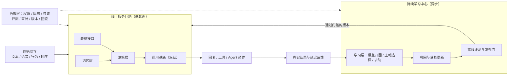

# 进化涌现 Volvence｜蚂蚁战投版 Pitch Deck（15 页）

> 版本 v0.1（2026-07-26）｜面向蚂蚁集团投资及企业发展部
> 口径与 [完整 BP](./volvence-bp-ant-strategic-v0.1-cn.md) 及 [一页摘要](./volvence-ant-onepager-v0.1-cn.md) 一致
> 用法：**屏幕文案 = 直接上 PPT 的字**；**口播 = 讲述要点，不写进页面**
> 时长：25 分钟主讲 + 20 分钟问答（问答题库见 BP 附录 A）
> 披露级别：对外 L1，不含实现细节（边界见 BP 附录 B）

---

## P1｜封面

### 屏幕文案

**进化涌现 Volvence**

**持续学习型模型系统**
长期交互 Agent 的认知基础层

基础模型让机器拥有知识。
我们让机器拥有经验。

北京进化涌现科技有限公司｜volvence.com｜2026-07

### 口播

今天不从 AGI 讲起。先讲清楚我们具体在造哪一层系统，再讲它为什么必须存在，最后讲它和蚂蚁的关系。整场只有一个主张，会在第四页出现，那也是最值得追问的地方。

---

## P2｜我们做的是哪一层

### 屏幕文案

**今天大模型的三个结构性缺口**

**一、学习停在部署之前**
能力来自预训练、微调与离线人类反馈。上线后能调工具、读知识库，却很难把每一次真实结果稳定转化为长期能力。

**二、闭环停在模型之外**
目标设定、结果判断、反馈整理、错误归因、更新触发——主要还是人和工程流程在做。

**三、关系停在语言表面**
Prompt / RAG / 文本记忆擅长"说了什么"。但长期交互还包含语气与节奏、行为与结果、沉默与纠正、信任与边界、历史与变化。
**语言是交互的一个投影，不是状态本身。**

> 结果：现有系统更接近强大的**即时工具**，而不是能在长期关系与连续任务中积累经验的智能体。

**我们补的那一层**

| 能力层 | 回答的问题 |
|---|---|
| 表征接口 | 这个人、这段关系、这个任务，现在处在什么状态？ |
| 决策层 | 现在该做什么高层动作，做多久？ |
| 记忆层 | 什么值得留下、什么该淡化、什么不能跨人迁移？ |
| 学习层 | 下一步该学什么、该问谁、什么时候必须交给人？ |
| **治理层**（横切） | 什么可以变、由谁批准、出错怎么退？ |

### 口播

第三条是最容易被低估的：不是模型不够聪明，是长期状态本身没法被一句话完整表达。我们做的四层能力加一层治理，就是补这个缺口。

---

## P3｜Why Now

### 屏幕文案

**下一个变量不是"更大"，是"部署后还能不能学"**

- 预训练的规模红利在收敛；
- 训练后的 `SFT + RL` 严重依赖少数研究员的隐性经验，且**不进入线上闭环**；
- Agent 铺开之后，真正的瓶颈从"单次能力"变成"**长期对齐**"——记忆、连续性、边界、信任。

**我们的判断**

这一层会成为长期交互场景的**基础设施**，而不是某个应用的插件。
基础模型的记忆会继续变强——**那会让我们的底座更便宜，不是威胁**（第 7 页与问答会正面回答替代风险）。

### 口播

我们押的不是"谁的模型更强"，是"部署之后还能不能继续变强"。这两件事的工程形态完全不同。

---

## P4｜坐标系：和已有路线的诚实对照

### 屏幕文案

**每条已有路线都解决了真实问题，但默认关注点不同**

| 路线 | 结构性上限 |
|---|---|
| 长上下文 / RAG / 向量记忆 | 检索不等于修正内部状态，也不自动形成策略、巩固与遗忘 |
| 抗遗忘正则化 | 回答"怎么学而不忘"，不回答该学什么、为何行动、如何闭环 |
| Replay / 生成式回放 | 存储、隐私与训练成本高；回放内容仍需价值选择 |
| Adapter / 测试时学习 | 解决更新载体，不解决目标、归因、长期巩固与治理 |
| RLHF / 在线偏好优化 | 依赖大量人工组织反馈，常停留在输出层与离线周期 |
| Agent 工作流 / 工具编排 | 工作流本身不会从结果中形成可迁移的内部经验 |
| 世界模型 / 潜空间控制 | 通常缺少个体级长期记忆、主动取数、跨尺度巩固与商业级治理 |

**我们用来判断覆盖度的五个维度**（内部归纳，非行业标准）

预测误差一级化 · 语言之上的内部控制 · 记忆成为架构 · 结构从长期交互中涌现 · 有界修改与只读评估

| 路线 | 预测误差 | 内部控制 | 架构记忆 | 涌现结构 | 有界修改/只读评估 |
|---|:---:|:---:|:---:|:---:|:---:|
| 长上下文 / RAG | 部分 | 通常不覆盖 | 部分 | 通常不覆盖 | 部分 |
| 抗遗忘 / Replay | 部分 | 部分 | 核心 | 部分 | 部分 |
| Adapter / 测试时学习 | 部分 | 核心 | 部分 | 部分 | 部分 |
| RLHF / Agent 工作流 | 部分 | 部分 | 通常不覆盖 | 部分 | 部分 |
| 世界模型 / 潜空间控制 | 核心 | 核心 | 部分 | 核心 | 部分 |
| **Volvence** | **核心** | **核心** | **核心** | **核心** | **核心** |

### 口播

这张表比的是每条路线的**默认机制重心**，不是说所有具体实现都一样。放它的目的不是抬自己，是给一个统一坐标系——之后任何人跟你讲"我们也做持续学习"，都可以用这五列问一遍。

---

## P5｜主张与系统形态

### 屏幕文案

**我们不是在这五个方向之外发明第六个孤立算法，而是把它们组织成同一个在线闭环：**
**让预测误差驱动学习，让学习影响记忆与决策，让内部状态影响行动，同时让每一次修改都受治理。**

**三条工程立场**

1. **在线请求不触发整模即时重训。** 一次噪声反馈不会污染长期能力。所有更新走异步巩固 → 离线评测 → 门控发布 → 可回滚上线。**这是设计约束，不是可配置项。**
2. **条件化做到模型内部一层，而不是只改 Prompt。** 只改 Prompt，就只能在状态被语言说出来之后才开始控制。目标不是"读心"，而是让同一句话在不同历史、节奏与信任状态下，产生不同的策略与表达。**这条是待验证的技术押注，必须靠消融证明，我们不当既成事实讲。**
3. **治理层保持确定性与可审计，不改造成不可解释的网络。** 能学的和不能学的之间需要一条硬边界。

### 口播

如果今天只记住一句话，就是屏幕最上面那句。它也是我们最欢迎被追问的一句——第 7 页会给出目前证明到哪、没证明到哪。

---

## P6｜工程基础设施：能不能上生产的分界线

### 屏幕文案

**持续学习真正的门槛不是"训得动"，是低延迟、隐私、审计、隔离、回滚同时成立**

| 面 | 已落在代码里的能力 |
|---|---|
| 发布与回滚 | 学习型组件先以**影子模式**与现有路径双跑，只出报告不改行为；每个组件有独立晋升判据与**单点回滚**；未达证据门不得转为主导决策 |
| 评测隔离 | 评测通道**只读**，禁止反向写回学习目标；训练数据与只读评测集严格隔离 |
| 多租户与个体化服务 | 同一**冻结基底**并发承载大量个体化控制体，租户级作用域隔离，无共享态污染 |
| 人机协同 | **类型化**反馈入口（不从自由文本关键词猜测）、交接队列与人工接管、会话级证据落盘 |
| 数据权利 | 授权、目的限定、最小化、脱敏、保留期限、**按范围删除并产出删除证据**、跨用户隔离 |
| 契约纪律 | 任何新增跨模块依赖必须显式登记，未登记会让发布门失败 |

> **一个会自己变化的系统，只有先具备"改了什么、谁批准的、怎么退回去"，才可能进入金融级生态的采购流程。**
> 我们是先把这套骨架做出来，再往里填学习能力——不是相反。

### 口播

这一页是给技术尽调的。很多团队是先做能力、后补治理，那条路在你们的生态里走不通。

---

## P7｜诚实边界

### 屏幕文案

**已是系统**（有代码、有测试、有回滚路径）
在线服务 + 异步学习双回路骨架 · 跨会话状态持久化与跨用户隔离 · 影子双跑 / 晋升门 / 单点回滚 · 评测只读隔离 · 多租户控制面与人工接管 · 按范围删除与删除证据 · 封闭内测服务形态

**已有可重复信号**（有对照实验，规模有限）
510 轮真实模型链路长测、509 条真实轨迹 · 受控更新**未观察到明显灾难性遗忘** · 严格消融下完整闭环优于去掉关键环节的最强对照臂 · 增益来自真实参数学习（不更新对照臂为零）· 稀疏且延迟的反馈仍可学习（奖励泄漏为零）

| 预测轴 | 结果 |
|---|---|
| 任务进展 / 动作收益 / 关系变化 | 优于基线 |
| 状态稳定性 | **弱于基线**（我们没有把它从表里拿掉） |

本月定向复跑 **31 通过 / 1 失败**。失败项不是能力下降，是一项新增依赖**未登记在契约白名单**——**这正是发布门应该拦住的东西**。

**仍是假设**（写明验证方式）
开放域泛化与迁移边界 · 生产时延与 SLO（本地长测耗时不代表生产）· 留存 / 转化 / 收入
**当前线上默认决策仍以结构化与启发式为主，学习型组件多在影子模式——缺的是证据，不是代码。这是我们当前的第一优先级。**

### 口播

这一页我们没有做美化。你们这个位置上，把边界画清楚比把故事讲圆有价值。最准确的表述是：**关键闭环机制已经出现可重复的正向信号，并且具备严格消融和失败发现能力；规模、开放域泛化与商业结果，是之后要完成的验证。**

---

## P8｜产品主线

### 屏幕文案

**发布模型 → 开源轻量版 → 提供标准 API 服务**

| 阶段 | 交付 | 要证明什么 |
|---|---|---|
| **M0–M6** | `Volvence-1 Mini`：30 亿级开源基底 + 轻量持续学习模块；面向端侧、私有部署与垂直场景 | 问题解决率、持续使用率、真实反馈闭环 |
| **M6–M12** | 开源 `Open Mini`（权重 + 推理与持续学习基础代码 + 标准接口 + 基础评测集）；同期主力版 Beta：百亿级基底 + 亿级自有可训练参数 | 开发者生态与事实标准；开放域决策质量与长期关系能力 |
| **M12–M18** | `Volvence-1 Model API` 正式上线：持续学习推理、决策支持、高情商教练、授权下的个人记忆、反馈学习与版本治理 | 单位经济与可复制交付 |

**两条原则**

- **开放通用先验，不开放个体资产。** 开源是为了建立开发者生态、评测标准与事实上的接口标准，不是换一次性项目收入。
- **最小有效规模，不是参数越大越好。** 主力版能否达标由扩维曲线与发布门决定；**不通过就调整结构或延后发布，不用参数规模替代能力证明。**

### 口播

本轮资金不用于重训通用基底。我们买的不是参数，是闭环证据。

---

## P9｜两个核心能力

### 屏幕文案

**决策支持（IQ）**
真实用户带来的不是边界清楚的标准问题，而是目标冲突、信息缺失、根因不明、涉及多方利益的**决策情境**。
系统与用户共同建模 → 共同推演 → 共同收敛 → 共同探索，并具备三项主动能力：**自动研究 · 自动补齐决策矩阵 · 主动追问根因**。
交付的不是一份静态报告，是一个可以持续更新的**决策模型**。

**关系认知与教练（EQ）**
正确的分析不等于正确的处理。系统还要理解：这件事对不同的人分别意味着什么 · 怎么表达才能减少对抗 · 什么时候推进、什么时候等待 · 执行后如何观察结果并继续调整。

**为什么两者必须同时在线**

> 要形成交易，必须知道需求；要知道需求，必须了解客户；要了解客户，必须让客户持续使用；
> 要让客户持续使用，就必须真正解决问题；要解决复杂问题，就必须 **IQ 与 EQ 双在线**。

### 口播

这条因果链是我们所有商业判断的地基。它解释了为什么我们不从推荐商品开始，而是从持续解决问题开始。

---

## P10｜商业结构与冷启动

### 屏幕文案

**变现结构**

- **主力：合资 / 生态合作（轻资产）** — 合作方出流量与履约，我们出认知底座、治理与按量计费的能力单位
- **补充：定制与联合研发分润**
- **关键的少数：自营** — 握住第一方长期轨迹，作为定价锚与不受约束的证明场

**反目标**：不训练通用基础大模型 · 不自建流量与重履约 · 不为冲规模牺牲审计与接管能力 · 不做高风险领域的替代性专业判断

**冷启动底座**

自有约 **6,000 万**全网可触达用户底座（母婴、私域、IP 等场景合作方矩阵，名单可在尽调提供）。

> **我们不把触达数字等同于用户数。** 按跨平台去重后 1% 完成明确授权并形成有效使用测算：约 **60 万有效用户 → 千万级真实交互 → 近亿级结构化监督信号**。

真正要验证的不是粉丝总数，而是：**授权率 · 结果回流率（有多少交互能拿到 1/7/30 日结果）· 用户确认能否纠正模型候选标签 · 主动学习是否真的降低每个有效监督信号的成本。**

### 口播

这一页我们特意把自己的数字打了折。6,000 万是分发能力，不是用户资产；能不能变成学习信号，取决于授权率和结果回流率——这也正好是下一页蚂蚁最能帮上忙的地方。

---

## P11｜与蚂蚁的分工

### 屏幕文案

**我们不抢平台的位置，也不抢行业伙伴的位置**

| 层 | 谁做 | 提供什么 |
|---|---|---|
| 连接与结算层 | **蚂蚁 / 支付宝** | 入口、身份、连接协议、支付与履约闭环、生态分发与信任背书 |
| 行业场景层 | **生态内行业伙伴** | 场景知识、供给、履约能力、行业合规 |
| **认知底座层** | **Volvence** | 长期个体表征、经验沉淀、主动学习、受治理的在线更新 |

**蚂蚁能给我们的，是别处拿不到的东西：结果信号**

持续学习最稀缺的不是数据量，是**有结果的数据**。绝大多数对话只有"说了什么"，没有"后来怎么样了"。
在支付与履约闭环里——**是否采纳、是否成交、是否退款、是否复购、是否投诉**——都是可观测的**延迟结果标签**。这是我们的学习层最需要、也最难自己造出来的监督来源。

**我们回馈生态的，是长期关系的复利**

平台连接的是一次次交易；我们沉淀的是跨越很多次交易的**个体长期状态**。
在长周期服务场景中，这直接对应留存、顾问质量与关系连续性——**让生态里的 Agent 从"能用一次"变成"值得一直用"。**

### 口播

这一页是整场的落点。我们的定位不是要成为终局产品公司，而是要成为这条链上第三个位置：平台做连接器与赋能器，懂场景的伙伴不可替代，中间缺的是"越用越懂人"的那一层。

---

## P12｜三个候选试点

### 屏幕文案

**选题标准：有可观测的结果信号 · 有真实的长周期 · 风险可控**

| 方向 | 场景形态 | 我们提供 | 首轮验证指标 |
|---|---|---|---|
| **A. 商家私域经营 Agent** | 长期客户经营：答疑、跟进、复购提醒、关键时刻转人工 | 客户长期状态、跟进时机决策、经营教练、可审计接管 | 授权率、30/90 日留存、任务完成率、转化与复购、人工接管率下降 |
| **B. 生活服务型长期顾问** | 育儿、健康管理、家庭生活决策等长周期陪跑 | 决策支持 + 关系教练 + 授权个人记忆 | 问题解决率、持续使用周数、建议采纳率与 1/7/30 日效果回流 |
| **C. 企业内数字员工** | 客户成功、知识官、销售辅助 | 跨会话记忆不丢、可考核、可审计、可回滚 | 上岗通过率、单员工承载量、审计事件率、私有化 SLO |

**明确不做**

不提供个性化投资建议 · 不做信贷与风控的替代性决策 · 不做医疗诊断
这些场景结果信号很强，但**风险与合规成本不匹配当前阶段**——我们宁可先在低风险高频场景把闭环证实。

### 口播

三个方向可以只选一个开始。我们更倾向 A 或 B——结果信号快、风险低、长周期真实。

---

## P13｜验证节奏与数据边界

### 屏幕文案

| 阶段 | 只验证 |
|---|---|
| **0–30 天** | 一次 60 分钟对齐：贵方内部对"长期交互 + 结果回流"的价值判断是否与我们一致、是否已有内部安排 |
| **30–90 天** | 单场景 PoC：授权 → 长期状态 → 决策 → 结果回流 → 受控更新，全链路可审计、可删除、可回滚；产出首批延迟结果标签 |
| **90–180 天** | 对照实验：同场景 vs 通用大模型 + 记忆/RAG 基线，在留存或任务成功率上给出可重复差异，**或明确证伪** |
| **180–365 天** | 第二场景复用同一底座；单位经济成立；生态接入形态确定 |

**第一阶段只看两个数**：**授权率**（多少用户愿意开启长期记忆）与**结果回流率**（多少交互能拿到 1/7/30 日真实结果）。这两个数不成立，后面所有指标都是空的。

**数据边界——我们主动约束自己**

1. 数据归属不变，使用目的与撤回权不因合作转移
2. **个体级事实进入可授权、可删除的外部记忆，不写入权重**；参数只吸收经授权、脱敏、跨用户可迁移的结构
3. 按范围删除并产出删除证据，支持逐司法辖区差异化
4. 跨租户硬隔离，无跨客户经验串流
5. 评测只读，不把评测数据变成训练信号
6. **合作与融资解耦**——即使不做投资，任一试点也可单独谈

### 口播

第 6 条是认真的。我们希望这次谈的是"值不值得一起验证一件事"，投资是结果，不是前提。

---

## P14｜团队

### 屏幕文案

| 成员 | 角色 | 代表经历 | 在这套系统中的位置 |
|---|---|---|---|
| **赵江波** | 创始人 / CEO | 北大计算机本科、光华 MBA；连续创业者，有完整商业化退出案例 | 定义模型学什么、什么算学会；把学习目标与真实业务结果对齐 |
| **杨柳** | 联合创始人 / 首席科学家 | CMU 机器学习博士（导师 Avrim Blum、Jaime Carbonell，答辩委员会含图灵奖得主 Manuel Blum）；IBM、耶鲁博士后；主动学习/强化学习/迁移学习顶会顶刊 30 余篇 | 稀疏反馈下为何可学、需要多少反馈、迁移边界在哪 |
| **马志刚** | 研究院院长 | 北大计算机本博连读，微软学者奖学金；2012 年加入字节跳动早期团队，参与今日头条推荐算法引擎架构；曾任职斯伦贝谢、腾讯、启元实验室 | 把学习理论变成可运行的模型机制 |
| **张驰** | 联合创始人 / CTO | 19 岁毕业于清华计算机；产品总架构师 | 规模化训练、数据与推理基础设施、API、生产性能、企业部署 |

**一条闭合的交付链**：理论可行 → 架构可运行 → 产品可使用 → 商业可复制

> **严谨边界**：论文提供的是数学工具与边界，**不等于整个产品已被证明**。正确表述是"Volvence 建立在团队长期研究之上"。

### 口播

稀缺性不在于名校大厂的罗列，在于这四项能力能在同一条链上闭合——这也是持续学习这件事很难被单点团队做出来的原因。

---

## P15｜Ask

### 屏幕文案

**本轮：人民币 6,000 万元 · 投前估值 5 亿元**
资金**不用于重训通用基础模型**，用于验证并放大持续学习闭环。

| 投向 | 占比 | 关键交付 |
|---|---:|---|
| 核心模型与系统研发 | 40% | 四层能力打通；版本化、可回滚的模型系统 |
| 数据、标注与评测 | 20% | 主动选样平台；长期任务、关系状态与安全评测集 |
| 产品与标杆场景 | 20% | 2–3 个可重复部署场景；验证关键商业指标 |
| 算力、安全与基础设施 | 10% | 在线推理、训练管线、权限隔离、审计与回滚 |
| 关键人才与运营 | 10% | 补强算法、系统、产品与行业交付 |

**18 个月要拿到的三件事**
① 相同标注预算下，学习效率优于随机采样与常规人类反馈流程
② 连续任务上优于"大模型 + RAG / 文本记忆"基线，且遗忘、漂移与错误写入受控
③ 至少一个标杆场景证明持续学习提升任务成功率、留存或收入

**三种合作形态**：战略投资 + 生态接入（首选）· 纯生态合作（API / 私有化 / 联合试点）· 联合研发（评测标准与开源轻量版共建）

**杀死条件**
若严格消融下内部条件化不优于外部控制，或主动学习不优于随机采样，我们主动收缩为一家产品型的长期记忆与决策支持公司。**这条写在内部文档里，不是这次谈话才想出来的。**

---

**基础模型让机器拥有知识，我们让机器拥有经验。**
这件事需要一个提供入口、连接与结果闭环的平台，需要懂场景的行业伙伴，也需要有人把"部署后还能学"这一层真正做出来——**可审计、可回滚、可被生态复用。**
**我们想做的是第三个位置。**

北京进化涌现科技有限公司｜volvence.com

### 口播

如果今天只推进一件事，我建议是第 13 页的 0–30 天：一次 60 分钟的技术与场景对齐，只回答"贵方内部是否已有关于长期交互与结果回流的判断和安排"。有，我们补缺的那块；没有，就用一个低风险场景先跑 90 天。

---

## 附：演讲编排

| 时长 | 页面 | 落点 |
|---|---|---|
| **10 分钟版** | P1 → P2 → P5 → P7 → P11 → P15 | 我们是哪一层 / 主张 / 边界 / 分工 / Ask |
| **25 分钟版** | 全 15 页，P4 与 P6 各留 2 分钟给追问 | 完整 |
| **技术尽调场** | P5 → P6 → P7 → BP 附录 A + B | 系统立场 / 基础设施 / 证据边界 / 披露边界 |

**三条讲述纪律**

1. 不把"仍是假设"讲成"已经做到"——P7 的三栏结构在任何场合都不拆开讲；
2. 不把学术成果讲成产品已被证明——P14 的严谨边界必须念出来；
3. 被问到不能公开的实现细节时，直接说"这部分在 NDA 与技术尽调阶段开放"，并说明**同样的纪律适用于我们承接的贵方数据**。
