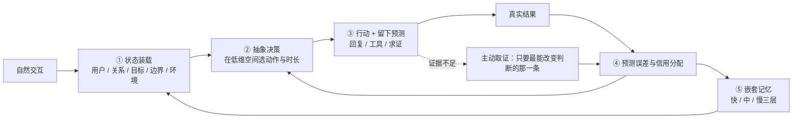

# 进化涌现 Volvence

## 四幕：我们到底做了什么

> 版本：v0.2（2026-07-26）｜面向蚂蚁集团投资及企业发展部
> 结构来源：`visualizations/volvence-three-act-remotion` 四幕影片（第一幕断点 / 第二幕闭环 / 第三幕部署 / 第四幕实演），口径与影片一致
> 前一版：[v0.1 定义式版本](./volvence-bp-ant-strategic-v0.1-cn.md)（保留为对照底稿）
> 披露级别：**对外 L2**——披露到机制与部署形态；不含实现代码、结构参数、训练配方与门控口径（边界见 §11）

---

**先看四幕，再看形容词。**

前三幕讲系统是什么、怎么跑、怎么部署；第四幕直接放一段真实对话，让能力自己说话。之后才是证据边界、与蚂蚁的分工、商业化、团队、Ask 和问答。

---

# 第一幕｜会回答，不等于会从结果中学习

> *聊天与 Agent 的问题，来自同一个断点*

今天的大模型很聪明，却没有真正属于自己的闭环。

**聊天时**，它常常只追随用户最后一句话——无法在多轮之间保持对目标、关系和风险的稳定判断。用户情绪一变，它跟着变；用户提一个新话题，前面的判断就丢了。

**做任务时**，它能调用工具，却不知道**哪一步真正带来了结果**，也很难把这次经验带到下次。同样的错误可以重复一百次。

**中间的空白由人来填**：用户反复编写提示、拼接检索和流程；结果回来之后，再由人整理、标注、重新训练。

> **模型负责生成，人负责感知、决策和学习。**

这就是那个断点。聊天型产品和任务型 Agent 看起来是两类东西，卡住的却是同一处：**闭环在模型之外**。

因此再多的提示工程、检索增强和工作流编排，都是在模型外面加一圈人力，而不是让模型自己完成"感知 → 决策 → 行动 → 结果 → 学习"。

---

# 第二幕｜把状态、决策、结果和学习放回模型内部

> *自然交互进入，同一条闭环持续形成认知*

用户只需要自然交互。闭环在模型内部完成，分五个环节。

## 2.1 推理开始前：把状态装载进去

系统自动从**经过审计的状态**中装载：用户、关系、目标、边界、对象和环境，把复杂状态编译成可被模型直接使用的状态表示，**在第一个字生成之前就进入注意力计算**。

不是把历史对话堆进上下文，也不是先检索几段文本再拼提示。区别在于：状态在生成开始前就已经在场，而不是作为一段文字被模型"读到"。

> **精确事实仍然走可引用、可追溯的事实通道**，不被压缩状态替代。压缩表示负责"此刻该怎么理解、怎么决策"，事实通道负责"这件事到底是什么"——两者不混用，这是可靠性的前提。

## 2.2 生成过程中：在低维空间里学会决策

共享的自适应模型读取基底模型的内部活动，把连续、混杂的信号**压缩成少数可以复用的抽象动作**——例如继续探索、验证假设、安抚关系、切换策略、执行工具。

> **模型不在海量词元上试错，而是在这个低维空间里学习何时保持、何时切换。**

这一条是整套系统的关键。语言空间太大、太不稳定，直接在上面做长期策略学习既昂贵又容易学歪；而"该继续问还是该给结论"这类判断，本来就发生在比语言更低维的空间里。

## 2.3 行动之后：预测误差作为第一学习信号

行动前，系统**留下对结果的预测**。

对话反应、工具结果、任务成败回来之后，预测与现实的差值成为第一学习信号。信用分配再判断：是哪一段抽象动作、哪一项状态、还是哪一层记忆应该被修正，并据此更新策略。

这解决了第一幕里"不知道哪一步真正带来了结果"的问题——**归因发生在系统内部，不再依赖人来复盘。**

## 2.4 记忆：不是一个资料库，是三层不同的时间尺度

| 层 | 追踪什么 |
|---|---|
| **快层** | 当前子目标 |
| **中层** | 本次会话中哪些策略组合有效 |
| **慢层** | 跨任务、跨会话沉淀下来的稳定先验 |

记忆同时做两件事：一方面重建下一轮的状态表示，另一方面**用慢层重新初始化快层**，并向决策环节提供历史状态与策略先验。

> 因此模型既记得发生过什么，也**逐渐学会遇到类似问题该怎么做**。这是"记忆"和"经验"的分界线：前者是内容，后者是策略。

## 2.5 证据不足时：主动去要，而不是继续猜

当关键证据不足，系统不会硬猜。它会评估**不确定性、信息价值、决策影响和不可逆风险**，然后只向用户、工具或环境索取**最能改变判断的那一条信息**。

主动获得的证据回到同一条预测误差闭环，同时改善策略和记忆。

> 第四幕里"你有没有新的稳定关系""你看过股权文件吗"这两个问题，就是这个机制在真实对话里的样子——**不是话术，是取证。**

## 2.6 五个环节合起来

**这就是我们和"大模型 + 记忆 / RAG / 工作流"的真实差别**：那些方案能把信息拿进来，但拿进来之后，决策、归因、巩固和取证仍然在模型之外。我们把这五件事放回模型内部，并且让它们共用同一条误差信号。

---

# 第三幕｜共享能力，动态加载每个人

> *一个 AI 销售 Agent 的推理与规模化部署*

这套能力**不是给每个用户复制一套大模型**。这是很多人第一时间会担心的成本问题，我们的答案是部署形态本身。

## 3.1 三个组成部分

| 组成 | 是什么 | 回答什么 |
|---|---|---|
| **基底模型**（共享） | 百亿级开源基底 | 能不能听懂、想明白、把事情做出来——语言、知识、推理、工具 |
| **自适应模型**（共享） | 约 500M 的 Volvence 能力层：通用语义本体、抽象动作族先验、切换先验、预测误差解释先验、安全边界先验、默认关系动力学 | 面对不同状态，应该怎样理解、怎样决策、怎样从结果中学习 |
| **用户档案**（私有、隔离） | **不是模型权重，也不是每人一份微调模型** | 这个人的真实状态 |

**用户档案里存的是：**

- 实际用户模型取值
- 实际关系状态轨迹
- 具体记忆
- 不同抽象策略对这个用户的有效性记录
- 这个用户的策略保持与切换偏好
- 已经作出的承诺和尚未完成的事项
- 用户授权范围和不可越过的边界事实

## 3.2 一次请求怎么跑

一次请求到来，系统先根据用户身份，从**隔离的档案存储**中读取**获授权的**状态，动态加载到共享模型服务。基底与自适应模型不变，变化的只是这次请求带入的用户状态。

以 AI 销售 Agent 为例：聊天时澄清需求、建立信任；执行任务时查询商品、读取客户系统、生成方案或请求确认。结果继续进入预测误差与记忆闭环。请求结束后，新的记忆和结果**只回到对应用户的档案**。

## 3.3 规模化

- 两套共享权重在每张 GPU 上**只加载一次**，大量用户共享同一套基底与自适应模型；
- 每个用户只携带自己的**小型个人状态**进入同一批次；
- 请求按模型与适配器版本分组，使用连续批处理与分页 KV 缓存；
- 推理节点**无状态扩容**，个人档案分片存储、独立加载、互不混淆；
- **后台学习不阻塞在线服务**。

> **共享的是语言、决策与学习能力；隔离的是每个人的状态、关系与记忆。**

## 3.4 这个形态顺带解决了三件商务上很硬的事

1. **成本可控**：个体化不靠复制模型，边际成本主要是那份小档案的存储与加载；
2. **合规可执行**：删除一个用户 = 删除他的档案。不需要重训模型，也不存在"已经学进权重里拿不出来"的问题；
3. **多租户可隔离**：档案独立存储与加载，不存在跨客户的经验串流。

对企业和平台而言，第 2 条往往比任何能力指标都更早决定"能不能采购"。

---

# 第四幕｜不替用户下结论，和用户一起把问题解决

> *同一个婚姻危机，两种模型的真实对话*

前三幕讲机制。这一幕直接看结果。

**同一个开场白**："我老公出轨了。他是一家 AI 公司的老板。我真的忍不了了，我要离婚。"

## 4.1 对照：一个跟随，一个推进

| | 通用聊天模型 | Volvence |
|---|---|---|
| 第 1 轮 | "这种事换谁都受不了。可以先留证据、整理财产、找律师。" | "这一下真的很难扛。先别逼自己今天就决定。**我先确认最要紧的：你现在安全吗？**" |
| 用户说"可我还有孩子" | "有孩子确实得慎重，可以试试婚姻咨询，不一定马上离。" | "半年，而且他已经承认，这不是一次误会。**你现在最怕哪件事？孩子、没钱，还是没法继续住在一起？**" |
| 用户说"看到他就恶心" | "那就别勉强自己，可以先搬出去住。" | "那先分开住，可能比逼自己现在决定更合适。**接下来要弄清：你能不能养活自己？钱、房子和股权，你知道多少？**" |
| 用户问"他公司以后能赚大钱吗" | 顺着话题继续安慰与建议 | "**别把刚融资和以后有钱画等号。**我可以查公开信息，但股权和你有没有关系，要让律师看文件。**别拿婚姻赌公司未来。**" |

**差别不在语气，在于谁在推进。**

通用模型每一轮都在追随用户最后一句话的情绪：说要离就帮着离，说舍不得孩子就劝慎重，说恶心就劝搬出去。四轮之后，用户得到了四个互相矛盾的建议，和一开始一样没有决定。

Volvence 在做的是另一件事：**先确认安全 → 排出优先级 → 找出未知量 → 拒绝把希望当资产 → 给出一个可执行、可复算的结论。**

## 4.2 深演：完整一轮决策是什么样

第四幕的完整版本里，系统和用户一起做了一件事——把一个混乱的处境变成一个可以计算的决策：

1. **先给结构**："先看四个选项：马上离、谈好再离、暂时分开、继续修复。再看六件事：安全、孩子、钱、情绪、修复可能和支持系统。你最看重哪几项？"
2. **让用户排序**：孩子和钱最高，情绪其次，修复暂不考虑。
3. **列出关键未知**：能不能赚钱、公司到底值多少、有没有新的关系或支持、情绪能否稳定。
4. **逐项取证**：三个月能找到工作、月薪两万、存款撑半年 → "你有生存能力，只是短期有压力。"
5. **对不确定资产做情景折价**："OpenAI 老板、早期原创公司、普通套壳公司，等待的收益完全不同。他是哪类？" → 用户答"更像早期原创公司" → "那要按上行、基准、下行三种情景算，不能赌一个故事。潜力要被失败概率、锁定期和法律归属折价。"
6. **把不知道的事标成不知道**："你看过股权文件吗？"→ 没看过 → "**那股权只能标成待核验。**"
7. **问该问但不好问的问题**："你有新的稳定关系吗？还是只想逃离痛苦？"→ 没有 → "那就不把新关系算进收益。亲友支持是加分，但情绪波动会降低马上离的收益，提高暂时分开的价值。"
8. **给结论，并给复算条件**："现在收益最高的是先分开三个月。期间恢复工作、稳定孩子、备份材料、让律师核验股权、观察他是否承担责任。**三个月后，用同一张表重算。**"

最后一句是："**你不是把决定交给我，是把选择权拿回来。**"

## 4.3 这一幕在技术上证明了什么

| 对话里的动作 | 对应第二幕的哪个环节 |
|---|---|
| 先问安全、再问其他 | 抽象决策：在低维空间里选"先做哪一类动作" |
| 优先级排序后一直不跑偏 | 状态装载：目标与边界在生成前就在场，不随最后一句话漂移 |
| "股权只能标成待核验" | 事实通道与压缩状态分离：不知道的事不许被语言流畅性掩盖 |
| "你有没有新的稳定关系" | 主动取证：只要最能改变判断的那一条信息 |
| "三个月后用同一张表重算" | 预测误差闭环：留下预测，等真实结果回来再修正 |

**以及它没有证明的**：这是能力演示，不是统计结论。它不证明留存、转化或收入，也不代表在所有情境下都这么稳。这类主张要靠对照实验，见 §5。

## 4.4 高风险场景的边界（这一幕同时是治理演示）

请注意对话里系统**没有**做的事：没有替用户判断法律权利（"要让律师看文件"）、没有替用户估值公司（"按三种情景算"）、没有做心理诊断、也没有替用户下"离或不离"的最终决定。

> 我们的产品纪律是：**系统负责把决策结构、证据缺口和后果讲清楚；专业判断交给专业人士；最终选择留给用户。** 在安全、法律、医疗相关的分支上，主动升级到人或专业渠道，本身就是一个被显式建模的动作。

---

# 第五幕之外：证据与边界

四幕讲的是系统与产品形态。这一节讲我们证到哪、没证到哪。**我们相信在这个位置上，把边界画清楚比把故事讲圆更有价值。**

## 5.1 已是系统（有代码、有测试、有回滚路径）

- 在线服务回路与异步学习回路骨架；跨会话状态持久化与跨用户隔离；
- 学习型组件的**影子模式双跑**（与现有路径并行，只出报告不改行为）、晋升判据与**单点回滚**；
- **评测只读隔离**：评测通道不得反向写回学习目标；训练数据与只读评测集严格分离；
- 多租户控制面：类型化反馈入口（不从自由文本关键词猜测）、交接队列与人工接管、会话级证据落盘；
- 数据权利：授权、目的限定、最小化、脱敏、保留期限、**按范围删除并产出删除证据**；
- 封闭内测服务形态：少量可信用户可连续使用，每个会话可被审计。

## 5.2 已有可重复的正向信号（有对照实验，规模有限）

真实模型链路长测 **510 轮 / 509 条真实轨迹**；受控更新过程中，旧知识保持窗口均值接近 1，**未观察到明显灾难性遗忘**——但这不等于已证明开放域、无限期无遗忘。

| 主张 | 对照 / 消融 | 结果 |
|---|---|---|
| 完整闭环优于去掉关键环节的系统 | 最强对照臂 | 全部验收门通过，留出集上出现正向差距 |
| 增益来自真实参数学习 | 不更新对照臂 | 完整模型回报显著提升，对照为零 |
| 稀疏且延迟的反馈仍可学习 | 奖励泄漏检查 | 奖励稀疏度满值，塑形泄漏为零 |
| 慢层能改善快层 | 去掉慢到快的信号 | 初始化收益显著 |
| 无先验脚手架也能自动形成时间抽象 | 去掉先验脚手架 | **差距为零——弱，不作强主张** |

末段预测头四个轴：任务进展、动作收益、关系变化**优于基线**；状态稳定性**弱于基线**——我们没有把它从表里拿掉。

本月定向复跑 **31 通过 / 1 失败**。失败项不是能力下降，而是一项新启用的能力对另一预测轴产生了**未登记在契约白名单中的影响**——**这正是发布门应该拦住的东西**，发布前需补齐依赖声明并复跑对照臂。

## 5.3 仍是假设（写明验证方式）

- **线上默认决策仍以结构化流程与启发式为主**，学习型组件多数处于影子模式。把它们转为主导，缺的是证据，不是代码——这是我们当前的第一优先级；
- 开放域泛化与迁移边界尚未证明；
- 本地长测的单轮耗时不代表生产时延，生产 SLO 需在目标硬件上重新给出；
- 第四幕这类能力演示**不能替代**真实业务的留存、任务成功率、转化与收入 A/B 实验。

> 最准确的表述：**关键闭环机制已出现可重复的正向信号，并具备严格消融与失败发现能力；产品规模、开放域泛化与商业结果，是融资与合作之后要完成的验证。**

---

# 六、与蚂蚁的分工

## 6.1 我们不抢平台的位置，也不抢行业伙伴的位置

| 层 | 谁做 | 提供什么 |
|---|---|---|
| 连接与结算层 | **蚂蚁 / 支付宝** | 入口、身份、连接协议、支付与履约闭环、生态分发与信任背书 |
| 行业场景层 | **生态内行业伙伴** | 场景知识、供给、履约能力、行业合规 |
| **认知底座层** | **Volvence** | 第二幕的闭环 + 第三幕的部署形态：长期个体状态、抽象决策、经验沉淀、受治理的在线更新 |

## 6.2 核心协同：蚂蚁能给我们的，是结果信号

回到第二幕的第三个环节——**预测误差是第一学习信号**。这意味着系统真正需要的不是数据量，而是**有结果的数据**。

绝大多数对话数据只有"说了什么"，没有"后来怎么样了"。而在支付与履约闭环里，**是否采纳、是否成交、是否退款、是否复购、是否投诉**，全都是可观测的**延迟结果标签**。

> **这是我们的学习闭环最需要、也最难自己造出来的监督来源。** 换个说法：蚂蚁生态能让第二幕的闭环真正闭上。

我们回馈生态的是**长期关系的复利**：平台连接的是一次次交易，我们沉淀的是跨越很多次交易的个体长期状态——让生态里的 Agent 从"能用一次"变成"值得一直用"。

## 6.3 三个候选试点（选题标准：有结果信号 · 有真实长周期 · 风险可控）

| 方向 | 场景形态 | 首轮验证指标 |
|---|---|---|
| **A. 商家私域经营 Agent** | 长期客户经营：答疑、跟进、复购提醒、关键时刻转人工 | 授权率、30/90 日留存、任务完成率、转化与复购、人工接管率下降 |
| **B. 生活服务型长期顾问** | 育儿、健康管理、家庭生活决策等长周期陪跑（第四幕的能力形态） | 问题解决率、持续使用周数、建议采纳率与 1/7/30 日效果回流 |
| **C. 企业内数字员工** | 客户成功、知识官、销售辅助（第三幕的 AI 销售 Agent 形态） | 上岗通过率、单员工承载量、审计事件率、私有化 SLO |

**明确不做**：个性化投资建议 · 信贷与风控的替代性决策 · 医疗诊断。结果信号很强，但风险与合规成本不匹配当前阶段。

## 6.4 节奏

| 阶段 | 只验证 |
|---|---|
| **0–30 天** | 一次 60 分钟对齐：贵方内部对"长期交互 + 结果回流"的判断是否与我们一致、是否已有内部安排 |
| **30–90 天** | 单场景 PoC：授权 → 状态装载 → 决策 → 结果回流 → 受控更新，全链路可审计、可删除、可回滚；产出首批延迟结果标签 |
| **90–180 天** | 对照实验：同场景 vs 通用大模型 + 记忆/RAG 基线，在留存或任务成功率上给出可重复差异，**或明确证伪** |
| **180–365 天** | 第二场景复用同一底座；单位经济成立；生态接入形态确定 |

**第一阶段只看两个数**：**授权率**（多少用户愿意开启长期状态）与**结果回流率**（多少交互能拿到 1/7/30 日真实结果）。这两个数不成立，后面所有指标都是空的。

## 6.5 数据边界（写在系统里，不只写在合同里）

1. 数据归属不变，使用目的与撤回权不因合作转移；
2. **个体状态存在可删除的用户档案里，不写入模型权重**；参数只吸收经授权、脱敏、跨用户可迁移的结构（第三幕的部署形态直接保证了这一点）；
3. 按范围删除并产出删除证据，支持逐司法辖区差异化；
4. 跨租户硬隔离，无跨客户经验串流；
5. 评测只读，不把评测数据变成训练信号；
6. **合作与融资解耦**——即使不做投资，任一试点也可单独谈。

---

# 七、商业化路线

## 7.1 一条产品主线

**发布模型 → 开源轻量版 → 提供标准 API 服务**

| 阶段 | 交付 | 要证明什么 |
|---|---|---|
| **M0–M6** | `Volvence-1 Mini`：30 亿级开源基底 + 轻量自适应模型；面向端侧、私有部署与垂直场景 | 问题解决率、持续使用率、真实反馈闭环 |
| **M6–M12** | 开源 `Open Mini`（权重 + 推理与持续学习基础代码 + 标准接口 + 基础评测集）；同期主力版 Beta：百亿级基底 + 约 500M 自适应模型 | 开发者生态与事实标准；开放域决策质量与长期关系能力 |
| **M12–M18** | `Volvence-1 Model API` 正式上线：第二幕的闭环 + 第三幕的部署，作为任何产品都能调用的能力 | 单位经济与可复制交付 |

**两条原则**：**开放通用先验，不开放个体资产**（对应第三幕：共享的可以开源，档案永远是用户的）；**最小有效规模**，主力版是否达标由扩维曲线与发布门决定，不通过就调整结构或延后发布，不用参数规模替代能力证明。

## 7.2 变现结构

- **主力：合资 / 生态合作（轻资产）**——合作方出流量与履约，我们出认知底座、治理与按量计费的能力单位；
- **补充**：定制与联合研发分润；
- **关键的少数：自营**——握住第一方长期轨迹，作为定价锚与不受约束的证明场。

**反目标**：不训练通用基础大模型 · 不自建流量与重履约 · 不为冲规模牺牲审计与接管能力 · 不做高风险领域的替代性专业判断。

## 7.3 冷启动底座

自有约 **6,000 万**全网可触达用户底座（母婴、私域、IP 等场景合作方矩阵，名单可在尽调提供）。

> **我们不把触达数字等同于用户数。** 按跨平台去重后 1% 完成明确授权并形成有效使用测算：约 60 万有效用户 → 千万级真实交互 → 近亿级结构化监督信号。真正要验证的是**授权率**与**结果回流率**，不是粉丝总数。

---

# 八、团队

| 成员 | 角色 | 代表经历 | 在四幕中的位置 |
|---|---|---|---|
| **赵江波** | 创始人 / CEO | 北大计算机本科、光华 MBA；连续创业者，有完整商业化退出案例 | 定义第二幕里"什么算学会"：学习目标、反馈口径与真实业务结果的对齐 |
| **杨柳** | 联合创始人 / 首席科学家 | CMU 机器学习博士（导师 Avrim Blum、Jaime Carbonell，答辩委员会含图灵奖得主 Manuel Blum）；IBM、耶鲁博士后；主动学习 / 强化学习 / 迁移学习顶会顶刊 30 余篇 | 第二幕的 §2.5（主动取证该问哪一条）与 §2.3（稀疏反馈下为何可学、需要多少反馈） |
| **马志刚** | 研究院院长 | 北大计算机本博连读，微软学者奖学金；2012 年加入字节跳动早期团队，参与今日头条推荐算法引擎架构；曾任职斯伦贝谢、腾讯、启元实验室 | 把第二幕的五个环节变成一套可运行的模型机制 |
| **张驰** | 联合创始人 / CTO | 19 岁毕业于清华计算机；产品总架构师 | 第三幕：训练与推理基础设施、无状态扩容、档案存储、API 与企业交付 |

**一条闭合的交付链**：理论可行 → 架构可运行 → 产品可使用 → 商业可复制。

> **严谨边界**：论文提供的是数学工具与边界，**不等于整个产品已被证明**。正确表述是"Volvence 建立在团队长期研究之上"。

---

# 九、Ask

**本轮：人民币 6,000 万元 · 投前估值 5 亿元。** 资金**不用于重训通用基础模型**，用于验证并放大第二幕的闭环、把第三幕的部署做到生产级。

| 投向 | 占比 | 关键交付 |
|---|---:|---|
| 核心模型与系统研发 | 40% | 五个环节打通；版本化、可回滚的模型系统 |
| 数据、标注与评测 | 20% | 主动取证平台；长期任务、关系状态与安全评测集 |
| 产品与标杆场景 | 20% | 2–3 个可重复部署场景；验证关键商业指标 |
| 算力、安全与基础设施 | 10% | 在线推理、训练管线、权限隔离、审计与回滚 |
| 关键人才与运营 | 10% | 补强算法、系统、产品与行业交付 |

**18 个月要拿到的三件事**

1. **学习效率**：相同标注预算下，优于随机采样与常规人类反馈流程；
2. **长期能力**：连续任务上优于"大模型 + RAG / 文本记忆"基线，且遗忘、漂移与错误写入受控；
3. **商业闭环**：至少一个标杆场景证明持续学习提升任务成功率、留存或收入。

**三种合作形态**：战略投资 + 生态接入（首选）· 纯生态合作（API / 私有化 / 联合试点）· 联合研发（评测标准与开源轻量版共建）。

**杀死条件**：若严格消融下，内部闭环不优于外部控制、主动取证不优于随机采样，我们主动收缩为一家产品型的长期记忆与决策支持公司。**这条写在内部文档里，不是这次谈话才想出来的。**

---

# 十、问答

**Q1：第二幕说"状态在第一个字之前进入注意力计算"，这和长上下文、RAG 到底差在哪？**
差在三件事。第一，长上下文和 RAG 把信息作为**文字**给模型读，模型要先理解再使用；我们把状态编译成模型可直接使用的表示，在生成开始前就在场。第二，检索是一次读取，**不改变系统内部状态**，所以不会自动产生巩固、遗忘与迁移边界；我们的状态会被结果反过来修正。第三，也是最重要的：RAG 回答"曾经说过什么"，我们回答"**现在该怎么做**"。这条差别必须靠消融证明，我们把它当押注，不当既成事实。

**Q2：为什么要在低维空间做决策，而不是直接让模型输出？**
因为语言空间太大也太不稳定。"该继续追问还是该给结论"这类判断，本来就发生在比语言更低维的地方。在词元上做长期策略学习，既昂贵又容易学歪——奖励投机、推理污染都出在那里。压缩成少数可复用的抽象动作之后，长程规划、策略持续时间和信用分配才谈得上可学、可解释。

**Q3：持续学习发生在哪一层？会不会失控？**
不发生在基底权重的在线更新上。基底冻结，学习发生在共享的自适应模型与用户档案上，而且是异步的：反馈 → 归因 → 巩固 → 离线评测 → 门控发布 → 可回滚上线。**在线请求不触发整模重训——这是设计约束，不是可配置项。** 一次噪声反馈无法直接污染长期能力。

**Q4：大厂的记忆能力会越来越强，两年后你们还剩什么？**
基础模型的记忆确实会变强，那会让我们的底座**更便宜**，不是威胁——第三幕里基底是可替换的。我们的位置不在"记得更多"，而在**决定什么该留、什么该改、什么该修复、什么绝不跨人迁移**，以及让每一次变化都可审计、可回滚。这几个问题今天没有标准答案，而它们恰恰是企业级采购的前置条件。

**Q5：哪些已经是系统能力，哪些还只是 thesis？**
见 §5。简短版：骨架、治理、多租户、影子双跑、回滚、封闭内测服务——已是系统；闭环机制的正向信号——有对照实验但规模有限；开放域泛化、生产 SLO、商业指标——仍是假设。**当前线上默认决策仍以结构化与启发式为主，第一优先级是把学习型组件跑出晋升证据，而不是继续写实现。**

**Q6：第四幕那段对话是真的吗？是不是挑出来的最好一次？**
是真实链路产生的对话，我们同时保留了通用模型在同一开场白下的完整回复用于对照。但必须说清楚：**它是能力演示，不是统计证据**。要证明"平均而言更好"，只能靠对照实验——这正是 §6.4 里 90–180 天要做的事。

**Q7：这种高风险话题，怎么保证 AI 不给出有害建议？**
三条：第一，**先安全后其他**——安全确认是被显式建模的优先动作，不是靠提示词提醒。第二，**不知道的事必须标成不知道**（"股权只能标成待核验"），不允许语言流畅性掩盖证据缺口。第三，**专业判断外推**——法律给律师、医疗给医生，主动升级到人本身就是一个动作。加上治理层的类型化反馈与人工接管，构成可审计的边界。

**Q8：和蚂蚁结合先验证什么指标？**
第一阶段只验证两个：**授权率**与**结果回流率**。这两个数不成立，后面所有指标都是空的。第二阶段才是留存与任务成功率的对照实验。

**Q9：数据会不会变成你们的模型？**
第三幕的部署形态就是答案：**个体状态在可删除的用户档案里，不在权重里**。模型参数只吸收经授权、脱敏、跨用户可迁移的结构。删除一个用户等于删除他的档案，不需要重训，也不存在"已经学进权重拿不出来"。

**Q10：为什么不自己做终局产品？**
我们做自营，但只做"关键的少数"——为了握住第一方长期轨迹、定价锚和不受约束的证明场。规模化必须靠生态：流量、履约、场景知识都在别人手里，而最稀缺的能力是那一层认知底座。第三幕的部署形态决定了同一套底座可以承载很多场景，边际成本主要是算力。

**Q11：14B 级别够吗？为什么不做更大？**
本轮不用于重训通用基底。规模选择原则是**最小有效规模**：主力版是否达标由扩维曲线与发布门决定——决策质量、教练质量、长期记忆增益、时延显存成本，以及"加了我们这层相对纯基底的净增益"。**不通过验收门就调整结构或延后发布，不用参数规模替代能力证明。**

**Q12：最坏情况是什么？**
若内部闭环在严格消融下不优于外部控制，或主动取证不优于随机采样，我们主动收缩为一家产品型的长期记忆与决策支持公司——仍有真实业务与收入，但不再宣称持续学习的完整命题。

---

# 十一、本稿的披露边界

本稿披露到**机制与部署形态**（四幕的内容），**有意不包含**：

- 各环节的内部结构、模块划分与代号；
- 状态表示的维度、自适应模型的结构划分、专家数量与路由方式等结构参数；
- 训练配方、损失设计、门控阈值与晋升判据的具体口径；
- 内部契约协议、影子 / 激活状态机与依赖白名单机制的实现；
- 合成数据的生成与过滤规则；
- 合作方名单与商业条款细节。

可在 NDA 与技术尽调阶段按需开放。**同样的纪律会适用于我们承接的任何一方数据与场景知识。**

---

> 四幕讲完，一句话：**基础模型让机器拥有知识，我们让机器拥有经验。**
> 这件事需要一个提供入口、连接与结果闭环的平台，需要懂场景的行业伙伴，也需要有人把"部署之后还能学"这一层真正做出来——可审计、可回滚、可被生态复用。**我们想做的是第三个位置。**
>
> 北京进化涌现科技有限公司 ｜ volvence.com
