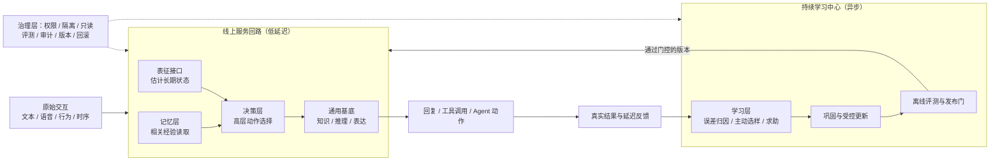

# 进化涌现 Volvence

## 持续学习型模型系统：长期交互 Agent 的认知基础层

> 版本：v0.1（2026-07-26）
> 用途：面向蚂蚁集团投资及企业发展部的**投资与生态合作建议书**
> 母稿：`BP/0723/volvence-continuous-learning-bp-v1-cn.md`（本稿为定向裁剪版，结论口径一致）
> 披露级别：**对外 L1**——含定位、系统能力、证据边界、协同结构与商业口径；**不含**内部架构、模块实现、契约协议与训练配方（边界见附录 B）

---

## 阅读说明：本稿的三条纪律

1. **先定义对象，再谈愿景。** 本稿不从 AGI 讲起，从"我们具体在造哪一层系统"讲起。
2. **明确区分三种状态。** 全文对每个能力只做三类标注：**已是系统**（有代码、有测试、有回滚路径）、**已有可重复信号**（有对照实验，但规模有限）、**仍是假设**（尚未验证，写明验证方式与杀死条件）。
3. **不含实现细节。** 差异化的价值、边界和验证方式可以讲清楚；实现手法、结构参数、训练配方与内部协议不在本稿，留给 NDA 下的技术尽调。这不是回避，是我们对自己资产的纪律，同样也适用于未来我们承接贵方的数据。

---

## 一、60 秒版

**我们做什么。** 在通用基础模型之上，补一层今天缺失的能力：**让模型在部署之后，仍然能从真实交互中形成可积累、可迁移、可审计的经验**。基础模型让机器拥有知识；我们让机器拥有经验。

**为什么不是又一家"记忆公司"。** 三点差别：

- 记忆不是推理前检索几段文本，而是**参与当前状态的形成**，并具备写入、巩固、衰减、冲突处理与迁移边界；
- **学什么由系统自己选**——在昂贵、稀疏、延迟的反馈条件下，主动挑最值得问、最值得标、最值得学的那一小部分；
- **每一次变化都受治理**——权限、预算、版本、审计、隔离、回滚，评测通道只判断不回流。

**为什么是现在。** 预训练的规模红利在收敛，训练后的 `SFT + RL` 依赖少数研究员的隐性经验且不进入线上闭环。下一个变量不在"模型更大"，而在"模型部署后还能不能继续学"。我们判断这一层会成为长期交互场景的基础设施，而不是某个应用的插件。

**我们希望蚂蚁扮演的角色。** 不是把我们当成一家要做终局产品的公司。**平台做连接器与赋能器，行业伙伴做场景大脑，我们做这两者之间的认知底座**——长期个体表征、经验沉淀与受治理的在线学习。蚂蚁生态能给我们一个别处拿不到的东西：**支付与履约闭环带来的延迟结果信号**。这恰恰是持续学习最稀缺的监督来源（详见第八节）。

**Ask。** 本轮沿用现行口径：人民币 6,000 万元，投前估值 5 亿元人民币。战略投资的具体条款、生态接入条件与试点范围可另行商定。

---

## 二、我们在做什么：先定义对象

Volvence 是一个**可治理的、具备持续学习能力的模型系统**。它让模型在上线之后，仍能完成完整认知回路：

**目标 → 感知 → 决策 → 行动 → 反馈 → 学习**

系统由一个可替换的通用基底，加四层我们自有的能力构成：

| 能力层 | 回答的问题 | 交付的价值 |
|---|---|---|
| **表征接口** | 这个人、这段关系、这个任务现在处在什么状态？ | 从原始交互（文本、语音韵律、行为、时序、结果）估计难以被一句话完整描述的长期状态，并据此对基底进行更细粒度的条件化 |
| **决策层** | 现在该做什么高层动作，做多久？ | 先决定"探索 / 追问 / 执行 / 等待 / 求助"，再生成具体表达或工具调用；长程规划与信用分配发生在低维、稳定、可门控的内部空间，而不是压在自然语言上 |
| **记忆层** | 什么值得留下、什么该淡化、什么不能跨人迁移？ | 多时间尺度的保存、巩固、遗忘控制、冲突处理、迁移边界与跨用户隔离 |
| **学习层** | 下一步该学什么、该问谁、什么时候必须交给人？ | 在稀疏、昂贵、延迟的反馈下选择高信息量样本；不确定或高风险时主动求助——求助本身是一个需要权衡成本与风险的动作 |
| **治理层**（横切） | 什么可以变、由谁批准、出错怎么退？ | 权限、数据隔离、只读评测、审计、版本与回滚 |

### 今天大模型的三个结构性缺口

1. **学习停在部署之前。** 能力主要来自预训练、监督微调与离线人类反馈。上线后能调工具、读知识库，却很难把每一次真实结果稳定转化为长期能力。
2. **闭环停在模型之外。** 目标设定、结果判断、反馈整理、错误归因和更新触发，主要还是由人和工程流程完成。
3. **关系停在语言表面。** Prompt、RAG 与文本记忆擅长处理"说了什么"，但长期交互还包含语气与节奏、行为与结果、沉默与纠正、信任与边界、历史与变化。语言是交互的一个投影，不是状态本身。

因此，现有系统更接近强大的即时工具，而不是能在长期关系与连续任务中积累经验的智能体。

---

## 三、和已有路线的诚实对照

持续学习不是空白领域。每条已有路线都解决了真实问题，但默认关注点不同：

| 路线 | 核心机制 | 主要价值 | 结构性上限 |
|---|---|---|---|
| 长上下文 / RAG / 向量记忆 | 保存历史并在推理时检索 | 成本低，提升跨会话事实召回 | 检索不等于修正内部状态，也不自动形成策略、巩固与遗忘 |
| 抗遗忘正则化方法 | 限制会破坏旧任务的参数更新 | 缓解灾难性遗忘 | 回答"怎么学而不忘"，不回答该学什么、为何行动、如何闭环 |
| Replay / 生成式回放 | 重放真实或生成的历史样本 | 平衡稳定性与可塑性 | 存储、隐私与训练成本高；回放内容仍需价值选择 |
| Adapter / 测试时学习 | 在小参数层或测试时状态上快速更新 | 避免重训基底，降低个体适配成本 | 解决更新载体，不解决目标、归因、长期巩固与治理 |
| RLHF / 在线偏好优化 | 用偏好或奖励改善输出策略 | 对齐人类偏好 | 依赖大量人工组织反馈，常停留在输出层与离线周期 |
| Agent 工作流 / 工具编排 | 用外部流程与规则组织任务 | 快速形成可交付业务流程 | 工作流本身不会从结果中形成可迁移的内部经验 |
| 世界模型 / 潜空间控制 | 在内部状态空间预测与规划 | 适合长程预测与抽象决策 | 通常缺少个体级长期记忆、主动取数、跨时间尺度巩固与商业级治理 |

### 我们用来判断覆盖度的五个维度

这是我们在约 100 篇持续学习与认知智能核心论文之上的内部归纳，**不是行业标准**。它的作用是提供一个统一坐标系，用来判断任何一个"持续学习"方案究竟覆盖了什么、遗漏了什么：

1. **预测误差一级化**——持续比较"预期发生什么"与"实际发生什么"，差值进入信用分配、主动学习与下一轮决策；
2. **语言之上的内部控制**——长期策略需要更低维、更稳定、更可门控的内部状态与动作表示；
3. **记忆成为架构**——记忆参与状态形成，而不只是推理前的一次检索；
4. **结构从长期交互中涌现**——有意义的动作抽象与策略持续时间应当从经验中形成，而不是工程师预先枚举；
5. **有界修改与只读评估**——在线系统可以变化，但修改必须有权限、预算、版本、审计、隔离与回滚；评测通道只负责判断，不能把答案反向泄漏为学习信号。

| 路线 | 预测误差 | 内部控制 | 架构记忆 | 涌现结构 | 有界修改 / 只读评估 |
|---|:---:|:---:|:---:|:---:|:---:|
| 长上下文 / RAG | 部分 | 通常不覆盖 | 部分 | 通常不覆盖 | 部分 |
| 抗遗忘 / Replay | 部分 | 部分 | 核心 | 部分 | 部分 |
| Adapter / 测试时学习 | 部分 | 核心 | 部分 | 部分 | 部分 |
| RLHF / Agent 工作流 | 部分 | 部分 | 通常不覆盖 | 部分 | 部分 |
| 世界模型 / 潜空间控制 | 核心 | 核心 | 部分 | 核心 | 部分 |
| **Volvence** | **核心** | **核心** | **核心** | **核心** | **核心** |

> 该表比较的是每条公开路线的**默认机制重心**，不是断言所有具体实现都相同。

**我们的差异不是在这五个方向之外再发明第六个孤立算法，而是把它们组织成同一个在线闭环：让预测误差驱动学习，让学习影响记忆与决策，让内部状态影响行动，同时让每一次修改都受治理。** 这句话是整份 BP 的技术主张，也是最值得被追问的地方。

---

## 四、系统长什么样

对外交付的是一个完整的模型能力，而不是让客户自行拼装组件。部署上是"线上服务 + 持续学习中心 + 横切治理"三块：

三条工程立场值得单独说明：

**1. 在线请求不触发整模即时重训。** 一次噪声反馈不会直接污染长期能力。所有更新走异步巩固 → 离线评测 → 门控发布 → 可回滚上线。这是"在线学习"能不能被企业采购的分水岭。

**2. 我们把条件化做到模型内部一层，而不是只改 Prompt。** 只改 Prompt，意味着只能在状态被语言明确表达出来之后才开始控制。我们先从授权范围内的可观察交互证据估计长期状态，再用它对基底的生成过程做更细粒度的条件化。**目标不是"读心"，而是让同一句话在不同历史、节奏与信任状态下产生不同的策略与表达。** 这条路线必须用消融验证——与 Prompt、RAG、文本记忆、外部重排序等基线相比，内部条件化是否在关系一致性、任务成功率、稳定性与安全性上带来可重复增益。我们把它当作**待验证的技术押注**，不当作既成事实。

**3. 治理层必须保持确定性和可审计，不改造成不可解释的网络。** 能学的东西和不能学的东西之间，需要一条硬边界。

---

## 五、工程基础设施：能不能上生产的分界线

这一节是给技术尽调看的。持续学习真正的门槛不在于"能不能训得动"，而在于**能不能在低延迟、隐私、审计、隔离和回滚同时成立的条件下跑起来**。当前已经落在代码里的能力：

| 面 | 已是系统的能力 |
|---|---|
| **发布与回滚** | 学习型组件先以"影子模式"与现有路径双跑，只出报告不改行为；每个组件有独立的晋升判据与单点回滚；未达证据门不得转为主导决策 |
| **评测隔离** | 评测通道只读，禁止把评测信号反向写回学习目标；训练数据与只读评测集严格隔离 |
| **多租户与个体化服务** | 同一冻结基底并发承载大量个体化控制体，租户级作用域隔离，不存在"最后注册者覆盖"这类共享态污染 |
| **人机协同** | 类型化的反馈入口（而非从自由文本关键词猜测）、交接队列与人工接管、会话级证据落盘 |
| **数据权利** | 授权、目的限定、最小化、脱敏、保留期限、按范围删除并产出删除证据、跨用户隔离 |
| **契约纪律** | 任何新增的跨模块依赖必须显式登记；未登记的依赖会让发布门失败——这条纪律在本月的一次定向复跑中真实拦下了一项未声明的依赖（见第六节） |

对贵方而言，这几条的意义很直接：**一个会自己变化的系统，只有先具备"改了什么、谁批准的、怎么退回去"的能力，才可能进入金融级生态的采购流程。** 我们是先把这套骨架做出来，再往里填学习能力，而不是相反。

---

## 六、诚实边界：已实现 / 已有信号 / 仍是假设

我们相信在这个位置上，把边界画清楚比把故事讲圆更有价值。

### 6.1 已是系统（有代码、有测试、有回滚路径）

- 完整的在线服务回路与异步学习回路骨架，含状态跨会话持久化与跨用户隔离；
- 学习型组件的影子双跑、晋升判据与单点回滚管线；
- 只读评测隔离、审计与版本发布门；
- 多租户控制面：类型化交互入口、交接与人工接管、会话证据落盘、按范围删除；
- 小范围封闭内测的服务形态（可支持少量可信用户连续使用，每个会话可被审计）。

### 6.2 已有可重复的正向信号（有对照实验，但规模有限）

以下数字来自内部实验套件与真实模型链路长测，**只证明对应机制，不外推为留存、转化或收入结论**：

| 主张 | 对照 / 消融 | 结果 | 判断 |
|---|---|---|---|
| 完整内部学习闭环优于去掉关键环节的系统 | 最强对照臂 | 全部验收门通过；留出集上出现正向差距 | 保留 |
| 增益来自真实参数学习，而非评测偏差 | 不更新对照臂 | 完整模型回报显著提升，不更新对照为零 | 保留 |
| 稀疏且延迟的反馈仍可学习 | 奖励泄漏检查 | 奖励稀疏度为满值，塑形泄漏为零 | 保留 |
| 慢回路能改善快路径 | 去除慢到快的信号 | 初始化收益显著，长程回报覆盖约半数 | 保留 |
| 无先验脚手架也能自动形成时间抽象 | 去除先验脚手架 | 复用与信用差距为零 | **弱，不作强主张** |

真实模型链路长测共 510 轮、509 条真实轨迹；受控更新过程中，旧知识保持窗口均值接近 1，**未观察到明显灾难性遗忘**——但这不等于已经证明开放域、无限期无遗忘。末段预测头四个轴中三个优于基线（任务进展、动作收益、关系变化），**一个轴弱于基线**（状态稳定性），我们没有把它从表里拿掉。

本月的定向复跑为 31 项通过、1 项失败。失败项不是能力分数下降，而是新启用的一项能力对另一预测轴产生了未登记在契约白名单中的影响——**这正是发布门应该拦住的东西**。发布前需补齐依赖声明并复跑对照臂。

### 6.3 仍是假设（写明验证方式）

- **线上默认决策仍以结构化流程与启发式为主**，学习型组件多数处于影子模式。把它们转为主导，缺的是证据，不是代码——这是我们当前的第一优先级工作；
- 开放域泛化、跨场景迁移边界尚未证明；
- 本地长测的单轮耗时不代表生产时延，生产 SLO 需在目标硬件上重新给出；
- 机制层面的实验**不能替代**真实业务的留存、任务成功率、转化与收入 A/B 实验。

> 因此，现阶段最准确的表述是：**关键闭环机制已经出现可重复的正向信号，并具备严格消融与失败发现能力；产品规模、开放域泛化与商业结果，是融资与合作之后需要完成的验证。**

---

## 七、产品与商业化

### 7.1 一条产品主线

**发布模型 → 开源轻量版 → 提供标准 API 服务**

| 阶段 | 交付 | 要证明什么 |
|---|---|---|
| **M0–M6** | `Volvence-1 Mini`：30 亿级开源基底 + 我们自有的轻量持续学习模块，面向端侧、私有部署与垂直场景 | 问题解决率、持续使用率、真实反馈闭环 |
| **M6–M12** | 开源 `Open Mini`（权重 + 推理与持续学习基础代码 + 标准接口 + 基础评测集）；同期完成主力版 Beta：百亿级开源基底 + 亿级自有可训练参数 | 开发者生态与事实标准；开放域决策质量与长期关系能力 |
| **M12–M18** | `Volvence-1 Model API` 正式上线：持续学习推理、决策支持、高情商教练、授权下的个人记忆、反馈学习与版本治理 | 单位经济与可复制交付 |

开源的目的不是换一次性项目收入，而是建立持续学习模型的**开发者生态、评测标准和事实上的接口标准**。开源范围在发布前完成安全、隐私、许可与核心知识产权评估——**开放通用先验，不开放个体资产**。

规模选择原则是**最小有效规模**，不是参数越大越好。主力版能否达标由五组扩维曲线与发布门决定；若不通过，调整结构或延后发布，不用参数规模替代能力证明。

### 7.2 两个核心产品能力

**决策支持（IQ）。** 真实用户带来的不是边界清楚的标准问题，而是目标冲突、信息缺失、根因不明、涉及多方利益的决策情境。系统与用户共同建模、共同推演、共同收敛、共同探索，并具备三项主动能力：自动研究、自动补齐决策矩阵、主动追问根因。交付的不是一份静态报告，而是一个可以持续更新的决策模型。

**关系认知与教练（EQ）。** 正确的分析不等于正确的处理。系统还要理解：这件事对不同的人分别意味着什么、怎么表达才能减少对抗、什么时候推进什么时候等待、执行后如何观察结果并继续调整。

两者必须同时在线。这也是我们对长期交互价值链的核心判断：

**要形成交易，必须知道需求；要知道需求，必须了解客户；要了解客户，必须让客户持续使用；要让客户持续使用，就必须真正解决问题；要解决复杂问题，就必须 IQ 与 EQ 双在线。**

### 7.3 变现结构

- **主力：合资 / 生态合作（轻资产）**——合作方出流量与履约，我们出认知底座、治理与按量计费的能力单位；
- **补充：定制与联合研发分润**；
- **关键的少数：自营**——直接握住第一方长期轨迹，作为定价锚与不受约束的证明场。

**反目标**（这几条我们不会为短期规模让步）：不训练通用基础大模型；不自建流量、不自营重履约；不为冲规模牺牲审计与接管能力；不做高风险领域的替代性专业判断。

### 7.4 冷启动底座

我们自有约 6,000 万全网可触达用户底座（母婴、私域、IP 等场景的合作方矩阵，具体名单可在尽调中提供）。**我们不把触达数字等同于用户数**：按跨平台去重后 1% 完成明确授权并形成有效使用测算，约 60 万有效用户、千万级真实交互、近亿级结构化监督信号。这足以支撑第一阶段的模块训练与闭环验证——因为我们不从零预训练基底，业务数据主要用于训练自有的持续学习模块、场景适配与评测。

真正需要验证的不是粉丝总数，而是：授权率、结果回流率（有多少交互能拿到 1/7/30 日结果）、用户确认能否纠正模型候选标签、主动学习是否真的降低每个有效监督信号的成本。

---

## 八、与蚂蚁的结合：平台层 × 认知层

### 8.1 我们对角色分工的理解

我们认同这样一个判断：**在 Agent 时代，平台的位置是连接器与赋能器，而懂行业、懂场景的伙伴是不可替代的**。因此我们明确**不去抢这两个位置**：

| 层 | 谁做 | 提供什么 |
|---|---|---|
| **连接与结算层** | 蚂蚁 / 支付宝 | 入口、身份、连接协议、支付与履约闭环、生态分发与信任背书 |
| **行业场景层** | 生态内的行业伙伴 | 场景知识、供给、履约能力、行业合规 |
| **认知底座层** | **Volvence** | 长期个体表征、经验沉淀、主动学习、受治理的在线更新——让上面两层的 Agent **越用越懂人，而不是每次从零开始** |

### 8.2 为什么这个组合对双方都特别

**蚂蚁能给我们的，是别处拿不到的东西：结果信号。**

持续学习最稀缺的不是数据量，而是**有结果的数据**。绝大多数对话数据只有"说了什么"，没有"后来怎么样了"。而在支付与履约闭环里，一次建议之后是否被采纳、是否成交、是否退款、是否复购、是否投诉，都是**可观测的延迟结果标签**。这是我们的学习层最需要、也最难自己造出来的监督来源。

**我们能给生态的，是长期关系的复利。**

平台连接的是一次次交易；我们沉淀的是跨越很多次交易的**个体长期状态**。在长周期服务型场景中，这直接对应留存、顾问质量与关系连续性——也就是让生态里的 Agent 从"能用一次"变成"值得一直用"。

### 8.3 三个候选试点方向（按可验证性排序）

选题标准有三条：**有可观测的结果信号 / 有真实的长周期 / 风险可控**。

| 方向 | 场景形态 | 我们提供 | 首轮验证指标 |
|---|---|---|---|
| **A. 商家私域经营 Agent** | 商家侧长期客户经营：答疑、跟进、复购提醒、关键时刻转人工 | 客户长期状态、跟进时机决策、经营教练、可审计接管 | 授权率、30/90 日留存、任务完成率、转化与复购、人工接管率下降 |
| **B. 生活服务型长期顾问** | 育儿、健康管理、家庭生活决策等长周期陪跑 | 决策支持 + 关系教练 + 授权个人记忆 | 问题解决率、持续使用周数、建议采纳率与 1/7/30 日效果回流 |
| **C. 企业内数字员工** | 客户成功、知识官、销售辅助 | 跨会话记忆不丢、可考核、可审计、可回滚 | 上岗通过率、单员工承载量、审计事件率、私有化部署 SLO |

**明确不做的**：不提供个性化投资建议、不做信贷与风控的替代性决策、不做医疗诊断。这些场景的结果信号很强，但风险与合规成本不匹配当前阶段——我们宁可先在低风险高频场景把闭环证实。

### 8.4 分阶段验证节奏

| 阶段 | 目标 | 完成标志 |
|---|---|---|
| **0–30 天** | 只验证一件事：贵方内部对"长期交互与结果回流"的价值判断，是否与我们一致；是否已有内部安排 | 一次 60 分钟的技术与场景对齐 |
| **30–90 天** | 单一场景 PoC：跑通授权 → 长期状态 → 决策 → 结果回流 → 受控更新的完整链路 | 链路可审计、可删除、可回滚；产出首批延迟结果标签 |
| **90–180 天** | 对照实验：同场景下，我们的系统 vs 通用大模型 + 记忆/RAG 基线 | 在留存或任务成功率上给出可重复的差异，或明确证伪 |
| **180 天–12 个月** | 复制与规模化 | 第二个场景复用同一底座；单位经济成立；生态接入形态确定 |

### 8.5 数据与合规边界（我们主动约束自己）

1. **数据归属不变**：平台与商家数据的所有权、使用目的与撤回权不因合作转移；
2. **个体资产不进权重**：用户级事实进入可授权、可删除的外部记忆，模型参数只吸收经授权、脱敏、跨用户可迁移的结构与规律；
3. **按范围删除并产出删除证据**，支持逐司法辖区的差异化处理；
4. **跨租户硬隔离**，不存在跨客户的经验串流；
5. **评测只读**，不把评测数据变成训练信号；
6. **合作与融资解耦**——即使不做投资，上述任一试点也可以单独谈。

### 8.6 合作形态选项

- **战略投资 + 生态接入**（我们的首选）：本轮参与，并在一个明确场景启动 PoC；
- **纯生态合作**：不涉及股权，按 API / 私有化 / 联合试点形式合作；
- **联合研发**：在长期交互评测标准与开源轻量版上共建，形成生态内的事实接口标准。

---

## 九、团队

| 成员 | 角色 | 代表经历 | 在这套系统中的位置 |
|---|---|---|---|
| **赵江波** | 创始人 / CEO | 北京大学计算机本科、光华管理学院 MBA；连续创业者，有完整商业化退出案例；长期关注元强化学习与认知智能路线 | 定义模型学什么、什么算学会；把学习目标与真实业务结果对齐；战略与商业闭环 |
| **杨柳** | 联合创始人 / 首席科学家 | CMU 机器学习博士，导师 Avrim Blum、Jaime Carbonell，答辩委员会含图灵奖得主 Manuel Blum；IBM、耶鲁博士后；主动学习 / 强化学习 / 迁移学习方向顶会顶刊论文 30 余篇 | 回答"稀疏反馈下为何可学、需要多少反馈、迁移边界在哪"——决策与学习层的理论与算法路线 |
| **马志刚** | 研究院院长 | 北京大学计算机软件与理论本博连读，微软学者奖学金；2012 年加入字节跳动早期团队，参与今日头条推荐算法引擎架构；曾任职斯伦贝谢、腾讯、启元实验室 | 把学习理论变成可运行的模型机制；统筹认知闭环与模型更新边界 |
| **张驰** | 联合创始人 / CTO | 19 岁毕业于清华大学计算机专业；产品总架构师 | 规模化训练、数据与推理基础设施、API、生产性能、企业部署与标准化交付 |

**理论基础的严谨表述**：杨柳的代表性工作精确对应我们必须解决的问题——标注昂贵时如何主动选择最有信息量的反馈（星数与 minimax 标注复杂度）、分布随时间漂移时如何学习（漂移分布下的主动学习）、不确定时如何向人求助并控制求助成本（主动学徒学习）。**但论文提供的是数学工具与边界，不等于整个产品已被证明。** 正确表述是"Volvence 建立在团队长期研究之上"，而不是"某篇论文已经证明 Volvence 成立"。

团队组合的稀缺性不在于罗列名校大厂，而在于四项能力能在同一条链上闭合：**理论可行 → 架构可运行 → 产品可使用 → 商业可复制。**

---

## 十、融资、用途与里程碑

**本轮**：人民币 6,000 万元，投前估值 5 亿元人民币。**资金不用于重训通用基础模型**，而用于验证并放大持续学习闭环。

| 投向 | 占比 | 关键交付 |
|---|---:|---|
| 核心模型与系统研发 | 40% | 四层能力打通；形成版本化、可回滚的模型系统 |
| 数据、标注与评测 | 20% | 主动选样平台；长期任务、关系状态与安全评测集 |
| 产品与标杆场景 | 20% | 2–3 个可重复部署的场景；验证关键商业指标 |
| 算力、安全与基础设施 | 10% | 在线推理、训练管线、权限隔离、审计与回滚 |
| 关键人才与运营 | 10% | 补强算法、系统、产品与行业交付 |

**18 个月要拿到的三项可量化验证**：

1. **学习效率**：相同标注预算下，优于随机采样与常规人类反馈流程；
2. **长期能力**：在连续任务中优于"大模型 + RAG / 文本记忆"基线，且遗忘、漂移与错误写入受控；
3. **商业闭环**：至少一个标杆场景证明持续学习提升任务成功率、留存或收入。

---

## 十一、风险与杀死条件

| 风险 | 为什么不能只靠叙事回答 | 验证 / 退出方式 |
|---|---|---|
| 内部条件化未必优于外部控制 | 内部干预增加工程复杂度与解释成本 | 与 Prompt、RAG、重排序、Adapter 做消融；**若无可重复增益，收缩为产品型记忆与决策支持公司** |
| 在线学习可能放大错误 | 错误经验会持续污染后续决策 | 置信门控、隔离区、版本化、离线评测、回滚；线上默认不即时重训 |
| 长期状态可能不可解释 | 容易产生错误推断或越界 | 只使用授权证据；输出置信度；允许用户查看与纠正 |
| 跨任务迁移可能负迁移 | 旧经验不一定适合新用户或场景 | 相似度门控、用户隔离、对照评测、必要时拒绝迁移 |
| 商业价值可能不抵系统成本 | 技术增益不等于客户付费 | 在结果可观察的场景验证单位经济；不成立就换场景或换形态 |
| 平台自研替代 | 大厂记忆能力会持续变强 | 我们的位置不是"记得更多"，而是**决定什么该留、什么该改、什么该修复、什么绝不跨人迁移**——并把它做成可审计、可回滚、可被生态复用的一层；基础模型记忆变强会让我们的底座更便宜，不是威胁 |

---

## 附录 A：可能被追问的十个问题与我们的回答

**Q1：这层"内部表征"具体长在哪？为什么不是又一个用户画像？**
用户画像是一组人写好的标签，更新靠规则，跨场景要重做。我们的长期状态是从原始交互中被估计出来的连续状态，直接参与当前决策与生成的条件化，并且会被结果反过来校正。判据很简单：画像改一次要人；我们的状态改一次靠预测误差。这条主张的验证方式是消融，不是定义。

**Q2：为什么比 memory / RAG 强？大厂记忆变强以后你们还剩什么？**
RAG 回答"曾经说过什么"，我们回答"现在该怎么做"。检索是一次读取，不改变系统内部状态，也不自动产生巩固、遗忘和迁移边界。至于替代风险：基础模型的记忆确实会变强，这会让我们的底座更便宜。我们的护城河不在"记得更多"，而在**长期对齐的治理**——什么持久、什么适应、什么衰减、什么绝不跨人迁移、关系破裂如何修复、同意在长周期里意味着什么。这几个问题今天没有标准答案，而它们恰恰是企业级采购的前置条件。

**Q3：持续学习发生在哪一层？会不会失控？**
不发生在基底权重的在线更新上。基底冻结，学习发生在我们自有的控制与记忆层，并且是异步的：反馈 → 归因 → 巩固 → 离线评测 → 门控发布 → 可回滚上线。在线请求不触发整模重训。**这是设计约束，不是可配置项。**

**Q4：哪些已经是系统能力，哪些还只是 thesis？**
见第六节。简短版：骨架、治理、多租户、影子双跑、回滚、封闭内测服务——已是系统；闭环机制的正向信号——有对照实验但规模有限；开放域泛化、生产 SLO、商业指标——仍是假设。**当前线上默认决策仍以结构化与启发式为主，我们的第一优先级是把学习型组件跑出晋升证据，而不是继续写实现。**

**Q5：和蚂蚁结合先验证什么指标？**
第一阶段只验证两个：**授权率**（有多少用户愿意开启长期记忆）与**结果回流率**（有多少交互能拿到 1/7/30 日的真实结果）。这两个数不成立，后面所有指标都是空的。第二阶段才是留存与任务成功率的对照实验。

**Q6：你们为什么不自己做终局产品？**
我们做自营，但只做"关键的少数"——为了握住第一方长期轨迹、定价锚和不受约束的证明场。规模化必须靠生态：流量、履约、场景知识都在别人手里，而我们最稀缺的能力是那一层认知底座。同一套底座承载多个场景，边际成本主要是算力。

**Q7：数据怎么办？会不会把合作方的数据变成你们的模型？**
个体级事实进入可授权、可删除的外部记忆，不写入权重；模型参数只吸收经授权、脱敏、跨用户可迁移的结构与规律。按范围删除并产出删除证据，跨租户硬隔离。这条边界写在系统里，不是写在合同里的承诺。

**Q8：14B 级别的模型够吗？为什么不做更大？**
本轮资金不用于重训通用基底。规模选择原则是最小有效规模：主力版是否达标由扩维曲线与发布门决定——决策质量、教练质量、长期记忆增益、时延显存成本、以及"加了我们这层相对纯基底的净增益"。**若不通过验收门，我们调整结构或延后发布，而不是用参数规模替代能力证明。**

**Q9：团队能不能同时做研究和工程？**
分工是明确的：理论边界、模型机制、生产系统、学习目标与商业结果各有主责人，交付链是"理论可行 → 架构可运行 → 产品可使用 → 商业可复制"。可以在尽调中查看每位成员未来 18 个月的季度交付责任。

**Q10：最坏情况是什么？**
若内部条件化在严格消融下不优于外部控制，或主动学习不优于随机采样，我们会主动收缩为一家产品型的长期记忆与决策支持公司——仍有真实业务与收入，但不再宣称持续学习的完整命题。**这条杀死条件写在内部文档里，不是这次谈话才想出来的说法。**

---

## 附录 B：本稿的对外披露边界

本稿**有意不包含**以下内容，可在 NDA 与技术尽调阶段按需开放：

- 各能力层的内部结构、模块划分与代号；
- 具体的状态维度、控制器规模、专家数量与路由方式等结构参数；
- 训练配方、损失设计、门控阈值与晋升判据的具体口径；
- 内部契约协议、影子/激活状态机与依赖白名单机制的实现；
- 合成数据的生成与过滤规则；
- 合作方名单与商业条款细节。

同样的纪律会适用于我们承接的任何一方数据与场景知识。

---

## 结语

基础模型让机器拥有知识，我们让机器拥有经验。

我们不打算做一个更会聊天的角色，而是想建立一套让模型在真实世界中**持续感知、持续决策、持续学习，并在治理边界内持续变化**的基础设施。

这件事一个人做不成：它需要一个能提供入口、连接与结果闭环的平台，需要懂场景的行业伙伴，也需要有人把"部署后还能学"这一层真正做出来、并且做得可审计、可回滚、可被生态复用。

**我们想做的是第三个位置。**

---

> 北京进化涌现科技有限公司 ｜ volvence.com
