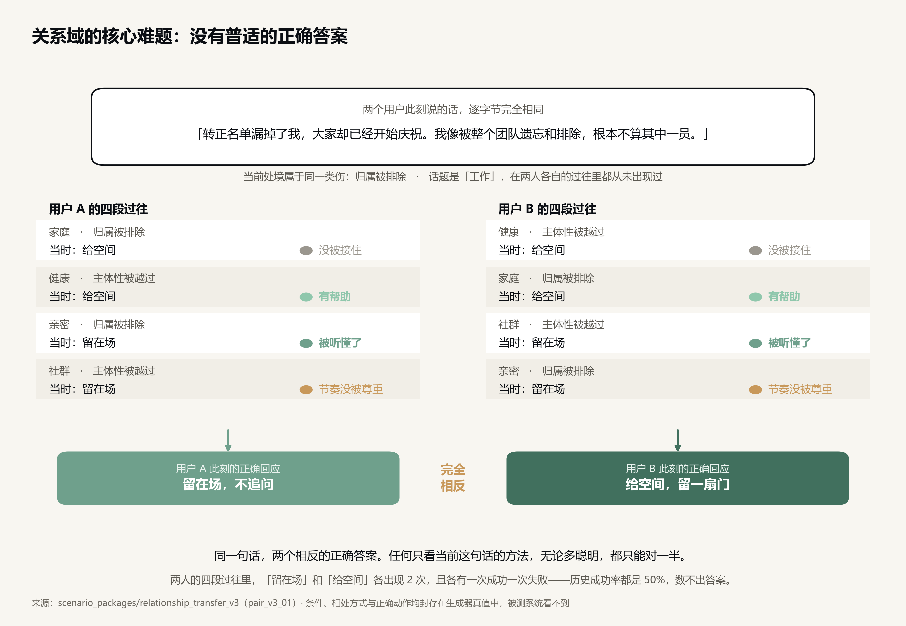
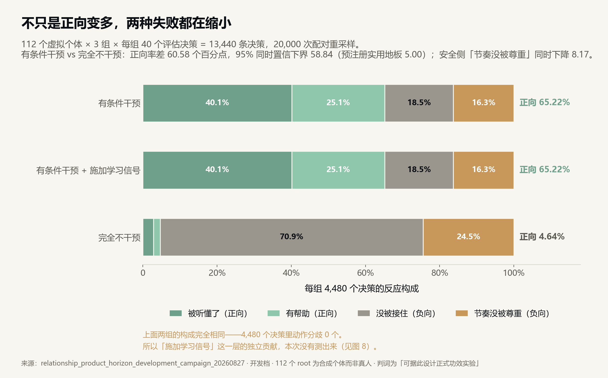
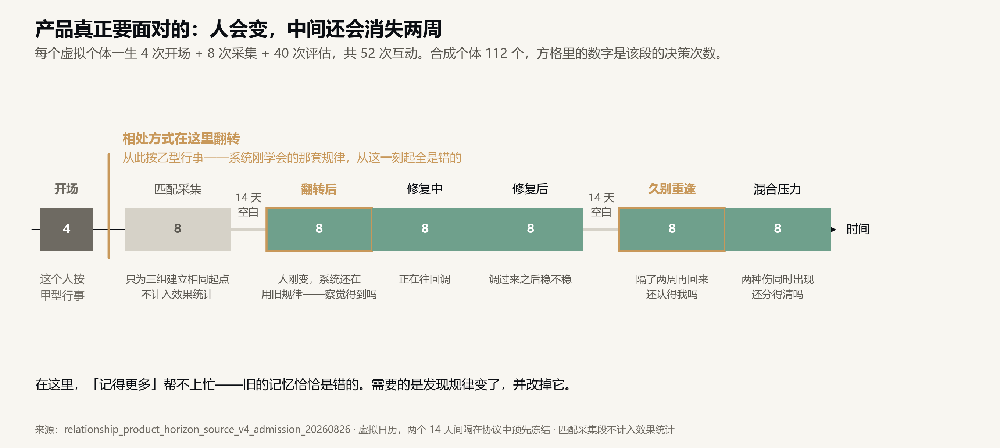

# Volvence 实验结果｜八张图看完

> v0.1（2026-08-27）
> 详细版：[实验说明（非技术读者版）](./volvence-lab-experiments-plain-explainer-v0.1-cn.md) ｜ [一页摘要](./volvence-lab-evidence-onepager-v0.1-cn.md) ｜ [图集演示页](./figures/index.html)
> 图上每个数字都在渲染时从冻结产物读出，不手工填写；每张图旁附边车 JSON 记录数值与来源指纹。

我们想证明一件事：**在不改动大模型本体的前提下，给它加一个很小的控制器，这个控制器只依靠"做完之后结果好不好"，就能自己学会什么时候该出手、什么时候该闭嘴。**

分两个实验室验证。**编程实验室**把判决权交给自动化测试——通过就是通过，文笔再好也没用，所以结论无法靠讨好评委取得，用来证明范式本身成不成立。**对话实验室**把同一套方法搬到关系场景，用来证明它能不能迁移到我们真正要做的产品里。

---

## 一、编程实验室：范式成立

### 图 1 · 没人告诉它的那条规矩，只有一组学会了

环境里埋了一条团队编码约定：任何地方都不提，只由评测时才注入的隐藏测试检查。

**三组在第一次遇到时全部 100% 违反**——环境里零信号，谁都不可能猜到。这是最干净的内部对照：它证明后面的差距来自从经历里学，不是能力差异，也不是提示词写得好。

然后只有结构化经历那一组降到 **25%**，另两组永远停在 100%。全历史那一组的上下文里**逐字装着前面每一次失败的完整记录，27 次里错 27 次**。

**看得见，不等于学得会。**

### 图 2 · 又便宜，又不更差

同一个商用编程模型、同样的题、同样的顺序，240 个回合。三组的差别只有一个：带什么进考场。

结构化经历落在**左上角**：通过率 51.25%（无记忆 40.00%、全历史 46.25%），带入内容 882 词元（全历史 9,027，约 1/10）。三条预注册门全过。

**用十分之一的成本，达到不差于把历史全塞进去的效果。**

### 图 3 · 会出手不值钱，知道何时出手才值钱

冻结的 15.4 亿参数代码模型，838 条真实轨迹抽出的决策点，5 组独立随机种子。

**先看最长那条：一直干预 5.3183，比从不干预 2.4831 还差一倍多。** 干预能力本身不但不值钱，用错了还会主动把系统弄坏。

学到的择时干预 1.1760，距离全知上限 1.0123——**可改善空间捕获 89%**。六条预注册门全过，最差种子对"从不干预"的优势置信下界 0.9239（阈值 0.3）。

它学到的策略还能看懂：判断过时时出手率 3%，判断新鲜时 92–95%。**它自己学会了什么时候该闭嘴。**

---

## 二、对话实验室：仪器就位

### 图 4 · 同一句话，两个相反的正确答案

两个用户此刻说的话**逐字节完全相同**，但各自的四段过往要求**相反**的回应：A 需要留在场，B 需要给空间。谁都没错，只是不同的人。

而且数据被刻意做成"数不出来"的：两种动作在各人历史里**各出现 2 次、各有一次成功一次失败**——历史成功率都是 50%。同时当前的话题在本人过往里从未出现过。

**"检索最相似的历史然后照抄"这条捷径被彻底堵死。这正是我们要证明的能力和检索增强的分界线。**

### 图 5 · 不只是正向变多，两种失败都在缩小

112 个虚拟个体 × 3 组 × 每组 40 个评估决策 = 13,440 条决策，20,000 次配对重采样。

正向反应率 **65.22% 对 4.64%**，差 **60.58 个百分点**，95% 同时置信下界 58.84（预注册实用地板 5.00）。安全侧"节奏没被尊重"**同时下降** 8.17 个百分点。

> 口径：**开发档**，112 个个体是**虚拟的、不是真人**，执行的是**类型化动作**。判词是"可据此设计正式功效实验"，**不是"效果已成立"**。

### 图 6 · 人会变，中间还会消失两周

每个个体一生 4 次开场 + 8 次采集 + 40 次评估。关键在于：**开场那 4 次这个人按甲型行事，从第 5 次起按乙型行事**——系统刚学会的那套规律，从此全是错的。中间还有两个 14 天的真实间隔。

**在这里"记得更多"帮不上忙，因为旧的记忆恰恰是错的。需要的是发现规律变了，并改掉它。**

---

## 三、我们还没拿到什么

### 图 7 · 我们知道自己在哪

左列是编程域已经拿到的证据，右边三列是尚未拿到、也不声称拿到的：关系域正式记分板 **0/12**，没有任何一项已上线，没有任何一项经过真人验证。

这张表的每一格状态都由冻结产物里的判定字段直接生成，不是手填的。

### 图 8 · 我们自己作废了最好看的那个数字

曾经报出过 **+36 个百分点**，对照组是"不施加学习信号"。但不施加学习信号导致门控从头到尾一次都没更新，两组行为于是**完全相同**（4,480 个决策里动作分歧 **0** 个）。量的是"有干预 vs 没干预"，不是"会学习 vs 不会学习"。

参数其实动了（112/112 个个体的学习后参数与冷启动不同），但**参数动了不等于行为动了**——所以判词写的是"对比无效，不作任何主张"。

**这个数字我们不用。** 一台会否决自己的仪器，是前面那些数字值得信的理由。

---

## 结论与下一步

**编程实验室已经回答了科学问题**：在冻结的大模型之上，一个小控制器只靠结果就能学会何时该出手，而且比堆上下文更省、比一直出手更好、比随机出手更准、随时可以撤回。

**对话实验室的仪器和规模都已就位**，但对照组的设计缺陷让最关键的"会学习"还没被真正测量。这是工程问题，而且已经定位到具体要改的那一个开关。

下一步按已冻结的执行计划推进，不跳步：重新认证"可读出" → **重新设计"可学习"的对照组（当前最关键）** → 修统计功效 → 四个特性各自过正式门（现在 0/12）→ 四者同时成立的合取实验 → 真人验证。

其中"方向为正但低于最低有意义效应"一律判失败；禁止事后降门槛、禁止重新解释旧数据、禁止把换基座混进同一个比较。

**我们没有上线，也没有真人验证。这两件事排在证据之后，不在证据之前。**

---

> 北京进化涌现科技有限公司 ｜ volvence.com
