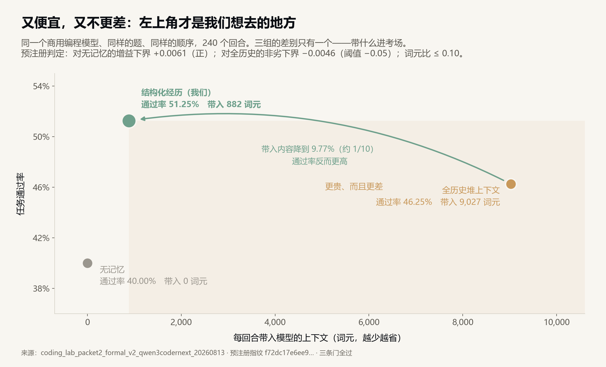
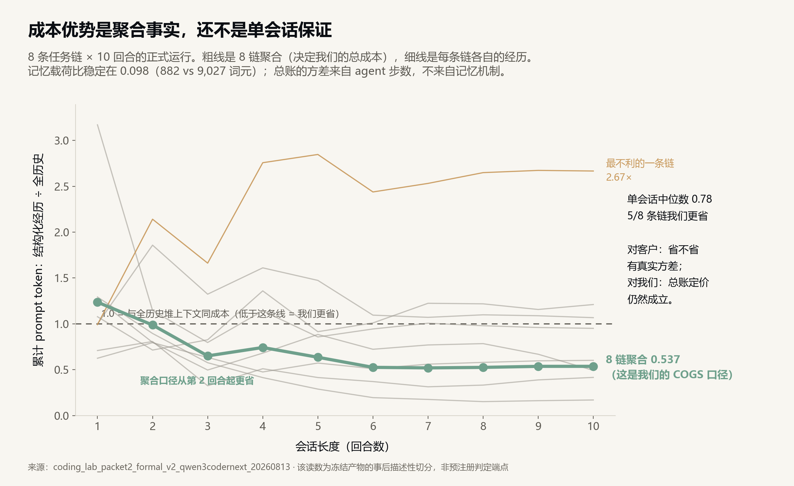
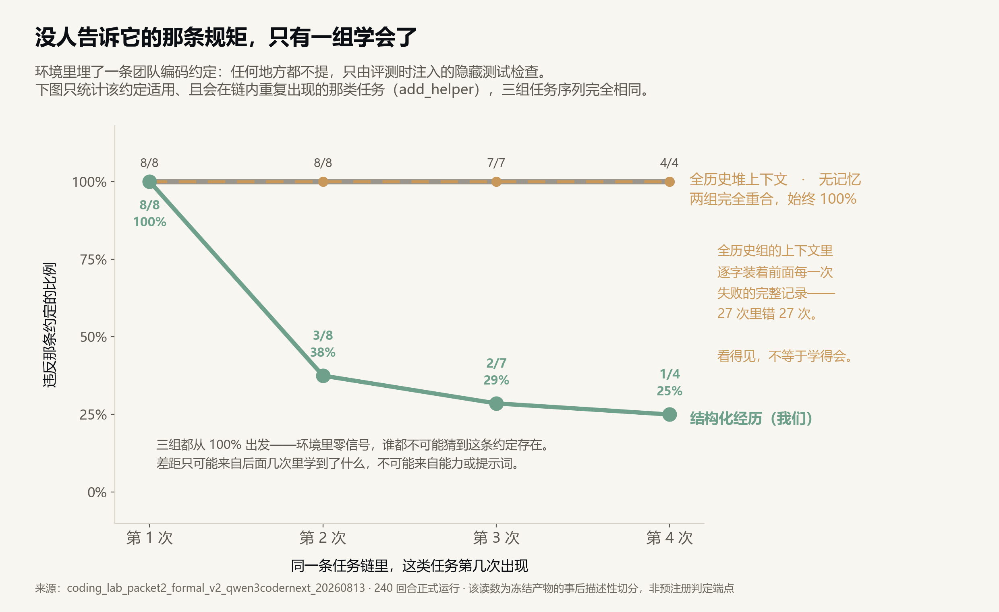
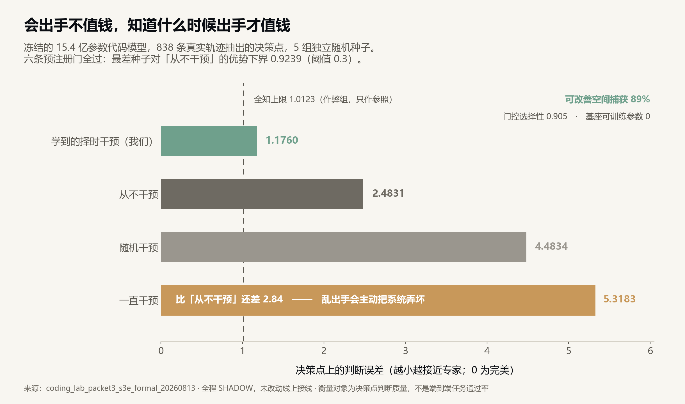
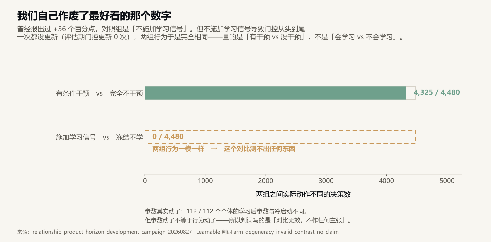
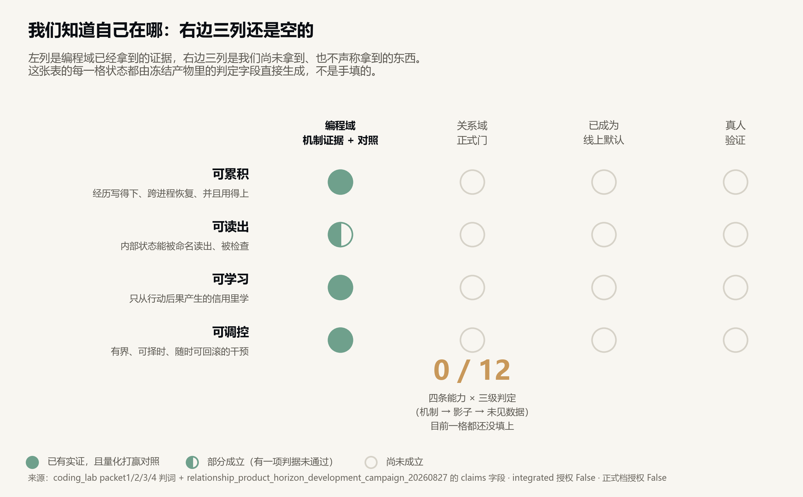

# Volvence · Model as a Service｜定位与主张（PPT 文案版）

> v0.1（2026-08-27）｜面向投资人与潜在客户｜**本文件是 PPT 文案底稿**：每页含「屏幕文案」（直接上 PPT 的字）与「口播」（讲述要点，不进页面）双轨。
> 数据来源：[图集](./figures/)（8 张图由 `scripts/render_lab_evidence_figures.py` 从冻结产物生成）｜[图说版](./volvence-lab-figures-brief-v0.1-cn.md)｜[实验说明](./volvence-lab-experiments-plain-explainer-v0.1-cn.md)
> **本稿三条讲述纪律**：① 第 4 页的成本数字必须用总账并同时报出单会话方差（53.7% 聚合 / 中位数 0.78 / 3-of-8 更贵），不许只报记忆载荷比、不许把聚合口径说成单会话承诺；② 第 8 页的"水涨船高"必须念出证据缺口；③ 第 13 页不许跳过。

---

## P1 · 封面

**屏幕文案**

# 会从结果里学习的模型服务

**同一个基座，装上一个会学习的控制器。**

更省 · 更懂你的标准 · 不用做 context engineering · 基座越强它越强

> 北京进化涌现科技有限公司

**口播**：我们不训练基座模型。我们做的是一个装在冻结基座之上的、很小的自适应控制器，然后把"基座 + 控制器 + 每个用户的私有档案"作为一个 API 端点卖出去。对调用方来说，它看起来就是一个更好用的模型。

---

## P2 · 断点：今天的 context engineering，是人在替模型补闭环

**屏幕文案**

今天要让大模型"记住并改进"，开发者必须自己做四件事：

| 开发者在做什么 | 本质上是在补什么 |
|---|---|
| 挑历史、切片、摘要、塞进提示词 | 替模型做**感知** |
| 写规则决定什么时候该检索什么 | 替模型做**决策** |
| 人工看哪次回答不好、回去改提示词 | 替模型做**归因** |
| 攒数据、定期微调 | 替模型做**学习** |

**模型只负责生成。感知、决策、归因、学习，四件事都在模型之外由人补。**

**口播**：这就是为什么 context engineering 成了一个岗位。它不是模型能力的一部分，它是模型缺失闭环之后，外面必须长出来的一圈人力。我们要做的事很简单：把这四件事放回模型内部，让调用方不再需要雇人补它。

---

## P3 · 四点主张，一页看完

**屏幕文案**

| # | 主张 | 我们的实验证据 | 证据强度 |
|---|---|---|---|
| **1** | **更省**：同等或更好的效果，更低的 token 开销 | 总 prompt token 降到"全历史堆上下文"方案的 **53.7%**（**聚合口径 = 我们的 COGS**；单会话中位数 **0.78**，8 条链中 3 条更贵，方差来自 agent 步数而非记忆机制）；我们注入的状态载荷稳定为对方的 **9.77%** | 预注册门通过（聚合）；单会话方差已量化 |
| **2** | **更聪明**：能自己学会评价体系里**没写出来**的标准 | 环境里埋一条从不声明、只由隐藏测试检查的标准：三组都从 **100% 违反**起步，只有我们降到 **25%**；把全部历史塞进上下文的那一组 **27 次错 27 次** | 预注册门通过 |
| **3** | **更方便**：调用方不需要做 context engineering | 我们的对照组就是"什么都不做、把历史全倒进去"。我们在**总开销减半**的同时通过率更高，而调用方侧**零上下文工程** | 预注册门通过 |
| **4** | **水涨船高**：基座每次变强，我们跟着变强，且差距保持 | 基座全程冻结、可训练参数 **0**，控制器不依赖任何特定基座能力——**结构上成立**；**跨基座规模的实验尚未做**，是本轮要交付的第一个里程碑 | **结构论证，证据待补** |

**口播**：请注意第 4 行右边那格。前三条我们有预注册的实验门在支撑，第四条今天只有架构论证，跨规模实验还没做。我把它写在这一页上，是因为这是尽调一定会问的第一个问题，我不想让你从别人嘴里听到。

---

## P4 · 主张一 · 更省：把账算到底

**屏幕文案**

同一个商用编程模型、同样的题、同样的顺序，**240 个回合**的正式实验（预注册指纹 `f72dc17e…`）：



| | 通过率 | 我们注入的状态载荷 | 实际发给 API 的总 token |
|---|---|---|---|
| **结构化经历（我们）** | **51.25%** | **882** 词元 | **503 万** |
| 全历史堆上下文（无工程基线） | 46.25% | 9,027 词元 | 938 万 |
| 完全不带上下文 | 40.00% | 0 | 244 万 |

**而且差距随会话变长而扩大**——每回合平均 prompt token：

| | 前半（第 1–5 回合） | 后半（第 6–10 回合） | 第 10 回合 |
|---|---|---|---|
| **结构化经历** | **49,893** | **75,937** | **96,306** |
| 全历史堆上下文 | 78,511 | 155,993 | 178,977 |

**堆历史的成本翻倍（+98.7%），我们涨一半（+52.2%）。会话越长，省得越多。**

**但这是聚合口径，单会话有真实方差**——把 8 条链分开看：



> **方差警告（必须随本页转出）**：聚合 0.537 是**我们的 COGS 口径**（跨会话总账），从第 2 回合起成立；**单会话中位数 0.78，8 条链中 3 条我们更贵（最差 2.67 倍）**。方差来自 agent 步数（读文件、跑测试的次数），不来自记忆机制——记忆载荷比稳定在 0.098。所以成本优势可用于**我们的定价与毛利**，不可作为**对单个客户单次会话的省钱承诺**。

**口播**：这里有三个数字，我要说清区别，因为你的技术顾问会去重算。**9.77% 是"我们注入的那部分状态"的大小比**——机制指标，低方差。**53.7% 是跨会话聚合的真实 API 总账**——这是我们的成本结构。**0.78 是单会话中位数**——这是客户视角，而且 8 条里有 3 条更贵。我们三个都公布，并且把方差的来源（agent 步数）讲清楚。定价按聚合算，承诺按单会话的分布说。

顺带说一个诚实项：我们的墙上时间是对方的 **1.44 倍**（每回合 42.3 秒对 29.4 秒）——省的是输入 token，不是延迟。工程上有优化空间，但今天不能宣称。

---

## P5 · 主张二 · 更聪明：学会评价体系里没写出来的标准

**屏幕文案**

我们在实验环境里埋了一条团队编码标准：**任何地方都不声明，只由评测时才注入的隐藏测试检查。** 违反就通不过。



**三组在第一次遇到时全部 100% 违反。** 这是最干净的内部对照——环境里零信号，谁都不可能猜到，所以后面的差距**只能**来自从结果里学，不可能来自模型更强或提示词更好。

然后：

- **结构化经历（我们）**：100% → 37.5% → 28.6% → **25.0%**
- **全历史堆上下文**：100% → 100% → 100% → **100%**（27 次错 27 次）
- **完全不带上下文**：始终 **100%**

**全历史那一组的上下文里逐字装着前面每一次失败的完整记录。它看得见，但学不会。**

**口播**：这一页是全场最重要的一页。市面上所有"记忆"方案本质都是检索——把相关的旧内容找回来放进提示词。这个实验证明**检索不等于学习**：把全部失败记录原封不动送进去，27 次里还是错 27 次。

还有一条内部验证：我们只在**会重复出现**的那类任务上学会了；在同一会话里只出现一次的两类任务上没学会（一类 7 次全错，一类 8 次错 6 次）。**没有第二次机会的地方就没有学习效果**——这正是"跨回合学习"该有的指纹，不是通用先验或者运气能解释的。

商业上翻译一句：**你的验收标准里那些"我们这儿就这么干"的默认规矩，你不需要写成文档喂给它。**

---

## P6 · 主张二的另一半：它也学会了什么时候不要动

**屏幕文案**

冻结的 15.4 亿参数基座，838 条真实轨迹，**5 组独立随机种子**：



| 策略 | 决策点判断误差（越小越好） |
|---|---|
| 全知上限（作弊组，参照） | 1.0123 |
| **学到的择时干预（我们）** | **1.1760** |
| 从不干预 | 2.4831 |
| 随机干预 | 4.4834 |
| **一直干预** | **5.3183** |

**"一直干预"比"从不干预"还差一倍多。**

可改善空间捕获 **89%**；六条预注册门全过（最差种子对"从不干预"的优势置信下界 **0.9239**，阈值 0.3）；基座可训练参数 **0**。

**口播**：这一页讲的是可部署性。一个会主动修改自己判断的系统，最大的风险不是不够聪明，是乱动。这个实验的对照组直接量化了这个风险：无脑一直干预，比完全不干预还糟一倍。

我们的控制器学到的策略是可读的：判断过时的时候出手率 3%，判断新鲜的时候 92% 到 95%。**它自己学会了什么时候该闭嘴。** 对一个要卖给企业的模型服务来说，这条比"更聪明"更重要。

---

## P7 · 主张三 · 更方便：把 context engineering 从调用方手里拿走

**屏幕文案**

我们实验里的两个对照组，恰好就是今天开发者的两种真实选择：

| 今天的做法 | 对应我们的对照组 | 结果 |
|---|---|---|
| 什么都不做，模型无状态 | 完全不带上下文 | 通过率 **40.00%**，也学不会隐含标准 |
| 全倒进去，让长上下文兜着 | 全历史堆上下文 | 通过率 46.25%，**总开销 938 万 token**，隐含标准 **27 次错 27 次** |
| 认真做 context engineering | —— | 要养人：写检索规则、切片、摘要、调提示词、看 case、定期微调 |
| **接我们的端点** | 结构化经历 | 通过率 **51.25%**，总开销 **503 万**，隐含标准降到 **25%**，**调用方零上下文工程** |

**调用方要做的只有一件事：把结果告回来。**

```
POST /v1/chat            # 和你现在调模型一样
POST /v1/outcome         # 这次的结果好不好（唯一的新增动作）
```

**口播**：第三条主张的证据其实就藏在第一条里——我们的对照组不是一个弱基线，它就是"不做上下文工程"这个选项本身。我们在总开销减半的同时通过率更高，而且这一切发生在调用方一行工程代码都没写的前提下。

要强调那个 `/outcome` 接口：**这是整个产品唯一要求客户改的地方。** 不需要标注、不需要打分、不需要写 rubric——只要告诉它这次的真实结果。学习信号只从这里来。

---

## P8 · 主张四 · 水涨船高：结构上成立，证据待补

**屏幕文案**

**为什么结构上成立：**

| 事实 | 推论 |
|---|---|
| 基座**全程冻结**，实验中可训练参数 **0** | 我们不改基座，所以基座换新版是**替换而非重训** |
| 控制器读残差、决定何时干预，不依赖任何特定基座能力 | 机制与基座**解耦**，不绑定某一代模型 |
| 学习信号来自行动后果，不来自模型内部知识 | 基座变强 → 同一条学习回路作用在更强的底子上 |
| 我们不做微调 | 没有"跟不上新基座"的迁移成本 |

**这条主张今天还缺什么（我们自己列出来）：**

- **跨基座规模的对照实验没有做。** 目前证据来自两个特定基座（一个商用编程 API、一个 15.4 亿参数开源模型），**没有做"小基座 vs 大基座上增益如何变化"的实验**。
- 因此"永远比基座强、且差距不缩小"目前是**架构推论 + 待验证假设**，不是实验结论。

**这是本轮融资后要交付的第一个里程碑：同一套控制器、同一份预注册协议，在至少三个规模档的基座上重跑，公布增益随规模的变化曲线——无论结果是扩大、持平还是收窄。**

**口播**：我在这一页主动把最想讲的那句话降级了。原因很实际：如果我在这里说"我们永远比基座强"，技术尽调第一个问题就是"你在几个规模上验证过"，答案是一个，那么这一页的可信度归零，还会连带把前面三页真实的数字一起折价。

所以我们的做法是：讲清结构为什么支持这个判断，然后把它写成一个有明确交付形式的里程碑——三个规模档、同一份预注册、结果好坏都公布。这个实验不贵，是本轮资金第一笔就要花的地方。

---

## P9 · 产品形态：Model as a Service

**屏幕文案**

**我们发的不是"又一个基座模型"。我们发的是一个端点。**

```
┌─────────────────────────────────────────────┐
│  冻结基座（第三方或开源，可替换）              │  ← 不训练、不微调
├─────────────────────────────────────────────┤
│  自适应控制器（我们的资产，很小）              │  ← 学"何时该动、动什么"
├─────────────────────────────────────────────┤
│  每个用户一份私有档案（可读、可改、可删）        │  ← 个体化靠加载状态
└─────────────────────────────────────────────┘
        ↑ 一个 OpenAI 兼容的 API 端点
```

三条商业上顺带解决的硬事：

| | 怎么解决的 |
|---|---|
| **成本** | 共享基座 + 共享控制器 + 私有档案：不给每个客户复制一套模型 |
| **合规** | 删除一个用户 = 删除他的档案，**不必重训** |
| **多租户** | 个体化状态在档案里，不在权重里，天然隔离 |

**口播**：这个分层是有意的，不是妥协。因为个体的状态和事实**不应该**由隐式权重承载——你没法读它、没法改它、没法删它。我们把可迁移的**结构**放进共享控制器，把这个人的**事实**放进可审计的档案。

代价要讲清楚：我们输在"隐式风格语气的承载"和"推理时的上下文预算"上。选这条路是因为可治理性，不是因为它在每个维度都赢。

---

## P10 · 路线：先通用，再垂直

**屏幕文案**

| 阶段 | 发什么 | 靠什么证明 | 状态 |
|---|---|---|---|
| **一 · 通用** | 通用端点：会从结果学习的模型服务 | 上面四条主张 + 跨规模里程碑 | 编程域证据已闭合，通用域待接 |
| **二 · 编程** | 面向编程 agent 的端点 | **已有完整证据链**（本稿全部编程域数据） | **证据最成熟，可最先落地** |
| **三 · 关系** | 面向陪伴、顾问、私域经营 | 关系实验室（仪器就位，正式证据在途） | 见 P12 |
| **四 · 任务** | 面向工单、客服、流程执行 | 复用同一方法论，未开工 | 规划中 |

**一个反直觉的建议：编程域的证据比通用域成熟，因为那里判决权在自动化测试手上。**

**口播**：这里我要提一个不同意见，供你判断。你说先推通用，我理解商业上想要最大的市场。但从证据角度看，**我们手上最硬的一整套数据全部产生在编程域**——因为那里有 pytest 当裁判，结论无法靠讨好评委取得。

通用域的问题是：它没有客观判决。要在通用域证明"我们更聪明"，最后只能靠人或另一个模型打分，而那种证据在尽调里很难站住。

一个折中：**对外叙事讲通用（市场大、故事完整），首批标杆客户和公开 benchmark 打编程（证据硬、可复核）。** 用编程域的可验证性支撑通用域的可信度。

---

## P11 · 单位经济的逻辑（数字待测，不编）

**屏幕文案**

**我们的毛利来自一个结构性事实：同等效果下我们少发 token。**

| | 逻辑链 |
|---|---|
| **收入侧** | 按调用计费，定价锚定客户"自己做上下文工程 + 全量长上下文"的成本 |
| **成本侧** | 总 prompt token 是全历史方案的 **53.7%**（聚合口径，从第 2 回合起成立）；**单会话中位数 0.78、8 条链中 3 条更贵**——毛利按聚合算成立，**不得**转述为对客户的单会话省钱承诺 |
| **毛利来源** | 差价 + 客户省下的工程人力 |
| **规模效应** | 控制器共享；新增客户只增加档案存储，不增加模型副本 |

**必须诚实标注的两项：**

- **延迟**是对方的 **1.44 倍**（42.3 秒对 29.4 秒／回合）。省 token 不等于省时间，这一项要工程优化。
- **上面 53.7% 来自编程 agent 场景**，那里总量被读源码撑起来。**纯对话场景里历史本身就是成本主体，比值应当更接近 9.77%——但我们还没测。** 这是通用端点定价前必须补的一次测量，成本很低。

**口播**：我不给你 ARR 曲线和毛利率，因为我没有可信的输入。我能给你的是毛利从哪里来的结构，和两个我知道自己还没测的地方。

那个"纯对话场景比值应该更好"的判断，我特意标成未测。它很可能对我们有利——对话产品里历史就是成本主体——但我不会在定价页上写一个推测出来的数。

---

## P12 · 为什么这些数字可信：这台仪器会否决我们自己

**屏幕文案**

**四个我们自己作废的例子：**

| 发生了什么 | 我们怎么处理 |
|---|---|
| 一条"预报未来"的判据没通过（p = 0.584） | `false` 原样封存在正式报告里，**没有降阈值** |
| 关系域跑出 **+36 个百分点** | 复查发现对照组行为与实验组完全相同（4,480 决策分歧 **0** 个），**自判"对比无效，不作主张"** |
| 一次 112 个体的完整运行 | 账本第 6 行混入墙钟时间戳，破坏逐字节可重放，**跑完了也作废** |
| 一条效率门首次以 0.1088 未过 0.10 | **修仪器，重跑满 240 回合**，而不是改阈值 |



**制度上的三条：** 判据在执行前冻结并按 sha256 留指纹 · 全部产物内容寻址、可逐条复核 · 本稿每张图由脚本从冻结产物直接生成，不手工填数

**口播**：这一页是整份材料的地基。在一个到处是精选 demo 的市场里，**一台会 fail closed 的证据机器本身就是可定价的差异化**。

也请注意第二行那个 36 个百分点——那是我们最好看的数字，我们没用。这件事我在每一份材料里都会讲，因为它是前面所有数字值得信的唯一理由。

技术尽调可以现场重跑：本稿每一张图都能在我们机器上从冻结产物重新算出来，包括每一条没通过的门。

---

## P13 · 尽调会问的五个问题（预置回答）

**屏幕文案**

| 问题 | 我们的回答 |
|---|---|
| **"1/10 的 token，是总账还是某一部分？"** | 是我们注入的状态载荷（低方差）。**总账聚合是 53.7%，单会话中位数 0.78，8 条链中 3 条更贵（最差 2.67 倍）**，方差来自 agent 步数。三个数我们都公布（见图 9）。 |
| **"跨基座规模验证过吗？"** | **没有。** 目前是两个特定基座。三档规模的对照是本轮第一个里程碑。 |
| **"关系域那个 60 个百分点能用吗？"** | 属**开发档**，112 个个体是**合成的、不是真人**，执行的是类型化动作。判词是"可据此设计正式实验"，**不是效果已成立**。 |
| **"四条能力正式过了几条？"** | 关系域正式记分板 **0/12**。编程域有实证但全程处于影子模式，**未改动线上接线**。 |
| **"有真人验证吗？"** | **没有。** 60 单元的盲标问卷已冻结，评分尚未采集。 |



**口播**：这一页不许跳过。这五个问题都会被问到，主动答比被挖出来强。

我想让你注意一件事：这五条**没有一条推翻前面四点主张**。第 1 点在聚合口径上依然接近腰斩，只是必须同时报出单会话方差；第 2 点的证据完全成立；第 3 点成立；只有第 4 点被降级成待验证，而我们已经把它变成了一个有交付形式的里程碑。**边界清楚，主张反而更硬。**

---

## P14 · 里程碑与 Ask

**屏幕文案**

**本轮要交付的四件事，按优先级：**

| 优先级 | 交付物 | 为什么是它 |
|---|---|---|
| **1** | **跨基座规模对照**：同一控制器、同一预注册、≥3 个规模档，公布增益随规模的变化曲线 | 第 4 点主张从"结构论证"变成"实验结论"。**这是整个 MaaS 故事的支点** |
| **2** | **纯对话场景 token 测量** | 通用端点定价的前置输入。当前 53.7% 来自编程场景 |
| **3** | **延迟优化 + 通用端点上线** | 把 1.44 倍延迟压到可接受，开放 `/outcome` 回流 |
| **4** | **编程域首批标杆客户 + 公开 benchmark** | 用有客观判决的域支撑通用域的可信度 |

**同期推进（不阻塞商业化）**：关系域重新设计"会学习"的对照组 → 四能力正式门（现 0/12）→ 真人验证

**Ask**：金额与估值口径同现行融资方案，此处不重复。资金**不用于训练通用基座模型**，用于上面四件事。

**杀死条件**：若跨基座规模实验显示增益随基座变强而**收窄至无商业意义**，我们主动放弃"水涨船高"这条主张，收缩为按垂直域交付的产品公司——仍有真实业务，但不再讲 MaaS 的故事。

**口播**：请注意里程碑 1 排在第一位，而且我把它和杀死条件绑在了一起。原因很直接：**"基座越强我们越强"是整个 Model as a Service 故事的支点。** 如果增益随基座变强而消失，那我们卖的就不是一个能长期成立的端点，而是一个特定代际的补丁——那种生意不值得按这个估值做。

所以这个实验我们会最先做，结果好坏都公布。

---

## 附 · 一句话版本（用于转发）

**我们不训练基座。我们在冻结的基座之上装一个会从结果学习的小控制器，然后把它作为一个 API 端点卖出去。**

在 240 个回合的预注册实验里，相对"把历史全倒进上下文"这个无工程基线：总 token 降到 **53.7%**（聚合口径，从第 2 回合起成立；单会话中位数 0.78、有真实方差）、通过率 **51.25% 对 46.25%**、并且学会了一条环境里从不声明、只由隐藏测试检查的标准（违反率 **100% → 25%**，而对方 **27 次错 27 次**）。调用方侧零上下文工程，唯一新增动作是把结果告回来。

**基座冻结、可训练参数 0，所以基座每次升级对我们是替换而非重训——但"增益不随基座变强而收窄"目前是架构推论，跨规模实验是本轮第一个里程碑。**

---

> 北京进化涌现科技有限公司 ｜ volvence.com
