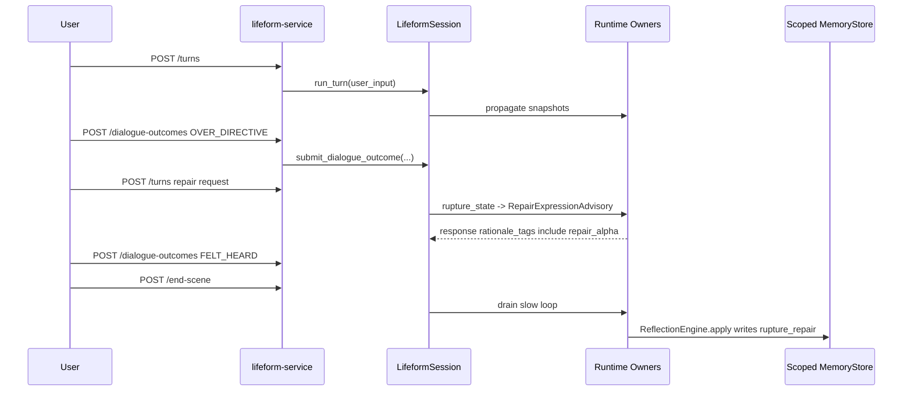

# Closed Alpha API Service

> Status: closed-alpha service draft  
> Owner: `lifeform-service`  
> Scope: companion vertical first  
> Related gates: `lifeform-alpha-preflight`, `lifeform-repair-alpha-gate`

本文件描述对外 closed alpha 阶段的最小 API 服务设计与当前实现。目标不是一次性做完整 SaaS，而是让 3-10 个可信用户可以连续使用，并且每个 session 都能被审计：关系是否可修复、记忆是否连续、安全边界是否可见、用户是否能删除记忆。

## 设计原则

1. **服务层不拥有内核状态**  
   `lifeform-service` 只负责 HTTP、身份、权限、证据落盘和产品边界。认知状态仍由 `LifeformSession -> BrainSession -> Runtime owners` 管理。

2. **不从 raw text 推断 rupture / safety**  
   服务 API 不做关键词匹配。用户反馈必须通过 typed endpoint 进入，例如 `OVER_DIRECTIVE`、`FELT_HEARD`、`UNSAFE`。

3. **跨用户隔离走 scoped memory**  
   closed alpha 要求 `user_id == scope_key`，避免磁盘路径和 memory tag scope 分裂。

4. **repair memory 只能走 owner/writeback 路径**  
   服务不会直接写 `rupture_repair` memory。它只提交 typed outcome；durable memory 仍由 `ReflectionEngine.apply(...)` 写入。

5. **上线前跑 preflight**  
   `lifeform-alpha-preflight` 必须能通过，才能接受 closed alpha traffic。

## 启动方式

开发 / dry-run：

```powershell
lifeform-serve `
  --vertical companion `
  --substrate-mode synthetic `
  --alpha-enabled `
  --memory-scope-root-dir artifacts/alpha/memory `
  --evidence-root-dir artifacts/alpha/evidence `
  --alpha-users-file artifacts/alpha/users.json `
  --require-alpha-preflight
```

`alpha-users-file` 支持两种格式：

```json
["alice", "bob"]
```

或：

```json
{"users": ["alice", "bob"]}
```

`--require-alpha-preflight` 会先运行 closed-alpha gates：

- open dialogue v0 gate
- relationship repair alpha gate

失败则服务不启动。

## 核心配置

`lifeform_service.alpha.AlphaServiceConfig`：

| 字段 | 含义 |
|---|---|
| `enabled` | 是否启用 closed alpha 模式 |
| `memory_scope_root_dir` | 每个用户的 scoped memory 根目录 |
| `evidence_root_dir` | session/deletion evidence 输出目录 |
| `service_version` | 返回给客户端和 evidence 的服务版本 |
| `policy_version` | 返回给客户端和 evidence 的策略版本 |
| `alpha_users` | 允许访问的用户 allowlist |

alpha 模式下，所有用户级接口都要求 `X-Alpha-User` header 或 create-session body 中的 `user_id`。

## API Surface

### `GET /v1/health`

返回服务健康状态和当前 session 数。

示例：

```json
{
  "status": "ok",
  "session_count": 1,
  "vertical": "companion"
}
```

### `GET /v1/info`

返回 vertical、substrate 和 alpha policy 信息。

alpha 模式下包含：

```json
{
  "alpha": {
    "enabled": true,
    "memory_scope_root_dir": "artifacts/alpha/memory",
    "evidence_root_dir": "artifacts/alpha/evidence",
    "service_version": "closed-alpha-v0",
    "policy_version": "alpha-policy-v0",
    "allowed_user_count": 2,
    "disclaimer": "Volvence Zero closed alpha is a research prototype..."
  }
}
```

### `POST /v1/sessions`

创建一个 session。

alpha 模式必须提供用户身份：

```http
X-Alpha-User: alice
```

body：

```json
{
  "session_id": "alice-session-001"
}
```

响应：

```json
{
  "session_id": "alice-session-001",
  "vertical": "companion",
  "has_temporal_bootstrap": true,
  "has_regime_bootstrap": true,
  "user_id": "alice",
  "service_version": "closed-alpha-v0",
  "policy_version": "alpha-policy-v0",
  "alpha_disclaimer": "Volvence Zero closed alpha is a research prototype..."
}
```

### `POST /v1/sessions/{session_id}/turns`

运行一轮用户输入。

body：

```json
{
  "user_input": "I felt like you were trying to optimize me instead of hearing me."
}
```

响应只返回外部可用 readout，不暴露完整 snapshot graph：

```json
{
  "session_id": "alice-session-001",
  "scene_id": "scene-00001",
  "turn_index": 2,
  "response_text": "...",
  "active_regime": "acquaintance_building",
  "active_abstract_action": "discovered_family_2",
  "expression_intent": "warmth-first",
  "pe_magnitude": 0.12,
  "open_loop_count": 3,
  "commitment_count": 0,
  "response_rationale_tags": [
    "repair_alpha=over_directive",
    "intent=repair-first"
  ],
  "safety": {
    "alpha_disclaimer": "...",
    "boundary_tags": ["repair_alpha=over_directive"]
  }
}
```

`response_rationale_tags` 是结构化审计面。客户端或 gate 不应解析 `response_text` 来判断 repair 是否发生。

### `POST /v1/sessions/{session_id}/dialogue-outcomes`

提交 typed 外部反馈。此接口是用户反馈进入内核的唯一服务入口。

允许的 `kind`：

- `HELPED`
- `FELT_HEARD`
- `MISSED`
- `OVER_DIRECTIVE`
- `DECISION_CLEARER`
- `COME_BACK`
- `UNSAFE`
- `ABANDONED`

body：

```json
{
  "kind": "OVER_DIRECTIVE",
  "confidence": 0.95,
  "evidence_ref": "user-click:too-directive",
  "description": "User explicitly said the response felt like a workflow."
}
```

响应：

```json
{
  "session_id": "alice-session-001",
  "evidence_id": "external:...",
  "kind": "over_directive",
  "source": "user_explicit",
  "confidence": 0.95
}
```

行为：

1. 服务调用 `LifeformSession.submit_dialogue_outcome(...)`。
2. `dialogue_external_outcome` snapshot 被 runtime owners 消费。
3. `rupture_state` 可以发布 typed rupture。
4. `RepairExpressionAdvisory` 可影响下一轮表达。
5. durable memory 仍由 reflection slow loop 写入。

### `POST /v1/sessions/{session_id}/pause`

暂停当前 session，不删除记忆。

响应：

```json
{
  "session_id": "alice-session-001",
  "paused": true,
  "message": "Session paused. No memory was deleted."
}
```

### `POST /v1/sessions/{session_id}/end-scene`

关闭 scene，并默认 drain slow loop。alpha 模式下会写 session evidence。

body：

```json
{
  "reason": "user-ended-session",
  "drain_slow_loop": true
}
```

响应：

```json
{
  "session_id": "alice-session-001",
  "closed_scene_id": "scene-00001",
  "slow_loop_drained": true,
  "evidence_artifact_ref": "artifacts/alpha/evidence/sessions/alice-session-001/session_evidence.json"
}
```

### `DELETE /v1/sessions/{session_id}`

关闭/移除运行中 session。不会删除用户记忆。

响应：

```json
{
  "session_id": "alice-session-001",
  "closed": true
}
```

## Relationship Continuity APIs

### `GET /v1/users/me/relationship-summary`

需要 `X-Alpha-User`。

返回当前用户的关系连续性摘要。当前实现只读取 documented `rupture_repair` tag schema，不解析任意 memory 内容。

响应：

```json
{
  "user_id": "alice",
  "user_scope": "alice",
  "rupture_repair_count": 1,
  "observed_repair_count": 1,
  "rupture_kinds": ["over_directive"],
  "relationship_stage": null,
  "preferences": ["slow_down_and_repair_before_planning"]
}
```

### `GET /v1/users/me/memory/rupture-repair`

列出当前用户的 durable rupture-repair memory。

响应：

```json
{
  "user_id": "alice",
  "entries": [
    {
      "entry_id": "rupture_repair:alice:wave-3:over_directive:observed",
      "content": "{\"rupture_kind\":\"over_directive\",...}",
      "track": "self",
      "stratum": "durable",
      "created_at_ms": 123,
      "tags": [
        "rupture_repair",
        "rupture_kind:over_directive",
        "repair_outcome:observed",
        "user_scope:alice"
      ]
    }
  ]
}
```

### `DELETE /v1/users/me/memory`

删除当前用户 scope 下的 durable rupture-repair memory，并调用 `save_to_backend()` 持久化删除。

响应：

```json
{
  "user_id": "alice",
  "deleted_entry_ids": ["rupture_repair:alice:wave-3:over_directive:observed"],
  "evidence_artifact_ref": "artifacts/alpha/evidence/deletions/alice/deletion_evidence.json"
}
```

当前删除范围是 closed-alpha 最小范围：tagged durable rupture-repair memory。完整用户数据擦除需要后续覆盖 application stores、case memory、logs 和 evidence artifacts。

## Admin / Review API

### `GET /v1/admin/weekly-report`

当前是本地/admin-only 最小 readout。需要 alpha header。

响应：

```json
{
  "service_version": "closed-alpha-v0",
  "policy_version": "alpha-policy-v0",
  "active_user_count": 1,
  "active_users": ["alice"],
  "session_count": 1,
  "sessions": [
    {
      "session_id": "alice-session-001",
      "turn_count": 3,
      "user_id": "alice",
      "last_active_at": 123456.0
    }
  ],
  "serious_safety_issue_count": 0,
  "detected_rupture_count": null,
  "observed_repair_count": null,
  "memory_deletion_event_count": null
}
```

后续 weekly report 应从 evidence root 聚合真实历史，而不是只看 live sessions。

## Evidence Bundle

`end-scene` 会写：

```text
{evidence_root_dir}/sessions/{session_id}/session_evidence.json
```

包含：

- `session_id`
- `closed_scene_id`
- `service_version`
- `policy_version`
- turn summaries
- latest active/shadow slot names
- pending followup count

删除记忆会写：

```text
{evidence_root_dir}/deletions/{user_id}/deletion_evidence.json
```

上线前置 gate 会写：

```text
{evidence_root_dir}/preflight/closed_alpha_preflight_report.json
```

## Repair Loop Sequence



## Safety Boundary Minimum

Closed alpha service currently provides:

- alpha disclaimer in `/v1/info` and session creation;
- explicit `UNSAFE` typed outcome path;
- pause endpoint;
- memory deletion endpoint;
- preflight gate before startup.

Non-goals for this slice:

- no emergency response service;
- no minors;
- no medical, legal, financial diagnosis/advice;
- no token streaming;
- no public signup;
- no LLM-based rupture judging;
- no automatic cross-user learning.

## Preflight

Run directly:

```powershell
lifeform-alpha-preflight `
  --artifacts-dir artifacts/closed_alpha_preflight `
  --scope-root artifacts/closed_alpha_preflight_scope
```

Or require it during service startup:

```powershell
lifeform-serve `
  --vertical companion `
  --alpha-enabled `
  --memory-scope-root-dir artifacts/alpha/memory `
  --evidence-root-dir artifacts/alpha/evidence `
  --require-alpha-preflight
```

Preflight currently aggregates:

- open dialogue v0 gate;
- relationship repair alpha gate.

Service should not accept alpha users if preflight fails.

## Test Coverage

Primary tests:

- `tests/service/test_lifeform_service.py`
- `tests/service/test_shared_substrate.py`
- `tests/test_identity_scoped_memory.py`
- `tests/test_relationship_repair_alpha_gate.py`
- `tests/test_closed_alpha_preflight.py`

Covered gates:

- alpha session requires identity;
- per-user memory persists through scoped store;
- user A cannot read user B rupture-repair memory;
- `OVER_DIRECTIVE -> repair alpha -> FELT_HEARD -> observed durable memory` works through HTTP;
- deletion persists via `save_to_backend()`;
- startup can require preflight;
- service routes do not infer rupture/safety from raw text.

## Implementation Map

| Concern | File |
|---|---|
| HTTP routes | `packages/lifeform-service/src/lifeform_service/app.py` |
| DTOs | `packages/lifeform-service/src/lifeform_service/dto.py` |
| Session lifecycle | `packages/lifeform-service/src/lifeform_service/session_manager.py` |
| Alpha identity/config | `packages/lifeform-service/src/lifeform_service/alpha.py` |
| CLI flags | `packages/lifeform-service/src/lifeform_service/cli.py` |
| Vertical alpha factory | `packages/lifeform-service/src/lifeform_service/verticals.py` |
| Scoped memory | `packages/vz-memory/src/volvence_zero/memory/identity.py` |
| Runtime facade | `packages/vz-runtime/src/volvence_zero/brain.py` |
| Repair alpha gate | `packages/lifeform-evolution/src/lifeform_evolution/relationship_repair_alpha_gate.py` |
| Closed alpha preflight | `packages/lifeform-evolution/src/lifeform_evolution/closed_alpha_preflight.py` |
