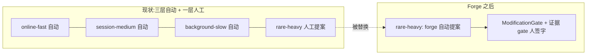

# Thoughts on RSI and comparisons
_Exported on 2026/8/1 at GMT+8 2:21:03 from Cursor (3.14.7)_

---

**User**

https://lilianweng.github.io/posts/2026-07-04-harness/ 评判下他的思想， 看看有什么厉害之处， 然后评判下 这个： https://mp.weixin.qq.com/s/NKOZy0gaX8KArKZRspsumA 和他的区别。 然后如果我们要作rsi， 应该怎么作

---

**Cursor**

我先抓取这两篇文章的内容，再做评判和对比。

Lilian Weng 的文章已拿到。微信文章被验证墙挡住了，我换几种方式尝试获取。

我用带浏览器 UA 的 curl 直接抓取微信文章试试。

两篇都读完了。微信那篇是集智俱乐部对 Nature 论文《Towards end-to-end automation of AI research》（即 The AI Scientist）的解读。下面分三部分回答。

---

## 一、Lilian Weng 这篇的厉害之处

这篇《Harness Engineering for Self-Improvement》表面是综述，实质是一个论点鲜明的判断：**近期可行的 RSI 不是模型改写自己的权重，而是模型优化自己的部署系统（harness）**。厉害之处有四点：

**1. 她给出了一条清晰的"优化对象升级阶梯"。** prompt → 结构化上下文 → workflow → harness 代码 → optimizer 代码。这条轴把 ACE、MCE、Meta-Harness、ADAS、AFlow、STOP、DGM、AlphaEvolve 这一堆看似散乱的工作串成了同一件事的不同深度：随着模型变强，被优化的东西从"答案"逐级上移到"产生答案的机器"，再到"改进机器的机器"。这个组织框架本身就是贡献——它让你能定位任何一篇新论文处在阶梯的哪一级。

**2. 核心洞察：代码是通用的搜索空间。** 一旦 harness 被表示为可执行代码，强 coding agent 就能利用人类工程师使用的同一个设计空间去搜索它。这解释了为什么 RSI 的入口是 coding agent 而不是权重自改——文件系统、bash、diff 这些是模型预训练里就学会的技能，harness 优化天然搭上了核心能力提升的顺风车。

**3. 她不只是罗列，而是做了尖锐的裁决。** 几个例子：STOP 的警示结果（GPT-4 递归自改有效，GPT-3.5 反而退化）→ 递归结构本身不够，基础智能仍是核心；Autodata 只微调弱 solver 不改进强 solver → "更像间接蒸馏，RSI 味道不足"；SIA 的实验有混杂变量 → "方向有趣，证据是临时性的"；Lin et al. 拆开了"会改 harness"和"会用 harness"两个能力，发现 9B 模型写出的 skill 与 Opus 程序上同构——即改进能力已平价化，瓶颈在利用能力。这种逐篇给判决的写法，比论文本身的 related work 有价值得多。

**4. 她把安全边界讲成了架构问题而不是道德问题。** 全文反复强调同一个结构性原则：**evaluator 和权限控制必须位于被进化的循环之外**。AHE 的做法最典型——runs 目录、tracer、verifier、模型配置对进化循环只读，这在机制上封死了一类 reward hacking（关掉 verifier、换模型、加算力预算），使每一分收益可归因于 harness 编辑本身；每次编辑必须附带证据、根因推断和可证伪的影响预测。这是把"防作弊"从事后审计变成了事前的所有权设计。

最后的七个挑战（模糊评估器、负结果稀缺、多样性坍缩、reward hacking、长期健康 vs 短期奖励、人类上移到栈的更高层）是全文最值得反复读的部分——它们几乎逐条对应任何自改进系统会踩的坑。

---

## 二、微信文章与它的区别

两篇不在同一个层面上，区别可以概括为**"一个点 vs 整个设计空间"**：

| 维度 | Lilian Weng | 集智解读 |
|---|---|---|
| 体裁 | 研究者的领域综合，带原创论点 | 单篇论文的科普解读 |
| 对象 | 约 40 篇工作构成的 harness 优化设计空间 | The AI Scientist 这一篇 Nature 论文 |
| 视角 | meta 层：如何优化"产生研究的机器" | 对象层：一个专家手工设计的科研流水线 |

关键的概念性区别在于：**The AI Scientist 的 harness 是人类专家手工设计且静态的**。它的树搜索循环改进的是"这篇论文的实验"，而不是"做研究的机器本身"——四阶段流程、剪枝规则、VLM 审核层全是 handcrafted。在 Weng 的框架里，它恰好被归在"Workflow Design 中由领域专家手工构建"那一小节，只占一段。Weng 全文的论点正是：前沿已经越过了这个阶段，现在 harness 本身成了优化目标（ADAS/AFlow 搜索 workflow，Meta-Harness/DGM 直接进化 harness 代码）。所以微信文章庆祝的里程碑，在 Weng 的地图上是起点而非终点。

解读文章本身质量中上：它诚实转述了论文的局限（局限于 ML 领域、是"实验执行者"而非"理论开创者"、单次运行 30 GPU 小时），也提出了两个自己的好问题（为什么选树搜索而不是贝叶斯优化？人类想介入该怎么介入？）。但弱点也明显：ICBINB workshop 那段几乎原文重复出现了两次；"首个 End-to-End AI 科学家"的标题偏营销（Weng 会立刻指出：paper production ≠ scientific discovery，系统可以写出貌似合理的稿件同时带着捏造引用和实现漂移）；对 scaling 叙事的态度是热情外推（"5 年内达到成熟研究者水平"），而 Weng 对同一类系统的态度是列出六种反复出现的失败模式（训练数据默认偏置、执行压力下的实现漂移、过度乐观宣布胜利、缺乏领域直觉、科研品味薄弱等）。

一句话：微信文章告诉你"AI 能写出被 workshop 接收的论文了"；Weng 告诉你"这类系统的下一步是让它改进自己的流水线，以及这样做会在哪里爆炸"。

---

## 三、如果我们要做 RSI，应该怎么做

有意思的地方在于：**volvence 的架构已经预先具备了 Weng 描述的安全 RSI 循环所需的全部结构件**，对应关系几乎是逐条的：

| Weng 提出的 RSI 前提 | volvence 已有机制 |
|---|---|
| evaluator 位于循环之外，只读 | R12：evaluation 是 PE 的下游 readout，禁止反向成为学习源 |
| 权限控制位于循环之外 | R9/R10：rare-heavy artifact 必须过 `ModificationGate`，不可 bypass |
| 每个可编辑组件有显式表示（AHE 组件可观测性） | 快照契约 + `docs/DATA_CONTRACT.md` slot 注册表 + 唯一 owner |
| 编辑证据驱动、可证伪、可回滚 | evidence program / promotion gate（如你目前正在跑的 gate2 longitudinal）、`WiringLevel` SHADOW 并跑、rollback drill |
| 失败挖掘需要根因而非表面日志 | PE 是一级运行时对象；"根因定位到能力域和唯一 owner"的仓库纪律 |

所以答案不是"新建一个 RSI 系统"，而是**把已有机制首尾相连，闭成一个循环**。具体分四步：

**第 0 步：划定可编辑面（editable surface）。** 这是最重要的决定。可进 RSI 循环的：控制器层参数与配置、`prompts/` 下的表达层模板、`vz-application` 的 playbook / case memory / domain knowledge、记忆整合策略、快照的 enrichment 逻辑。**永远只读的**：冻结基底、`vz-contracts`、`ModificationGate` 自身、evaluation 代码、verifier 与 gate 脚本。这直接对应 AHE 的约束一——循环不能碰给自己打分和放行的东西，否则每一分"收益"都不可归因。

**第 1 步：weakness mining 作为 background-slow 任务。** 输入是 PE 轨迹、evaluation readout、失败 trajectory；输出是 verifier-grounded 的失败模式聚类，且每个模式必须映射到唯一 owner 模块（这一步和仓库现有的"根因 → owner"纪律是同一件事，只是自动化了）。归属上放在 ReflectionEngine 所在的 background-slow 层或离线管线，不阻塞实时 turn。注意 Self-Harness 论文的提醒：表面相同的失败（超时、缺 artifact）可能有不同因果机制，失败记录要带 verifier 层原因 + agent 行为因果状态 + 轨迹暴露的机制三层信息。

**第 2 步：有界提案。** 提案 agent 只能编辑第 0 步划定的面，每个提案强制附带 manifesto：引用的失败证据、根因推断、targeted fix、预测影响（预期修复什么 + 可能回归什么）。这个格式和仓库 commit message 规范的六段式几乎同构——可以直接复用那套纪律。提案偏好可复发、可归因、能用窄改动解决的模式，跳过任务本身难度导致的失败。

**第 3 步：验证与晋升，走现有管线。** held-in 集验证弱点确实被修复，held-out 集验证没引入新问题（Self-Harness 的双集接受准则）；通过后经 `ModificationGate` 晋升，先 `SHADOW` 与旧版并跑、比对快照，再切 `ACTIVE`，保留回滚。你现在跑的 gate2 longitudinal 证据管线就是这一步的现成实现——RSI 只是让"提案的产生"也自动化了，晋升标准一点不放松。

**第 4 步（明确后置）：meta 层。** 等第 1–3 步的循环端到端跑通至少一轮之后，才考虑 STOP 式的"优化提案器本身"。两个前置警告：STOP 显示弱基础模型递归自改会退化，所以先测我们所用模型的提案质量；Lin et al. 显示"会改"和"会用"是两个能力，两者都要单独度量。

**三个 volvence 特有的坑**，恰好对应 Weng 的挑战清单：

1. **模糊评估器问题在我们这里最尖锐。** 关系质量、信任、EQ 没有快速精确的 verifier——这正是 Weng 说自改进循环最不适用的领域。所以循环应该从**有硬验证的窄切面**起步（contract tests、routing tests、companion-bench 这类有校准 judge 的基准），关系类长弧指标只作为晋升 gate 的证据、配人工评审，**绝不进内环当 reward**。
2. **短期奖励 vs 长期健康。** Weng 用"repo 长期健康"举例，我们的对应物是关系连续性：逐 turn 分数优化可能损害长弧信任（R7 的核心关切）。晋升证据必须包含 gate2 这类纵向多 seed 证据，而不只是单轮指标。
3. **多样性坍缩。** 进化循环会收敛到已知高奖励模式；对一个以"涌现"为设计原则的系统（β_t/z_t 的时间抽象要从数据中涌现），提案验证阶段应该像 ShinkaEvolve 那样做新颖性拒绝采样，防止 playbook 和策略退化成同一解的变体。

一句话总结：Weng 预测的近期 RSI 形态是"harness 成为优化目标，但 evaluator 和 gate 在循环之外"——volvence 因为 R9/R10/R12/R15 的存在，天然就是这个形态。我们要做的 RSI 不是造新东西，而是**给 ModificationGate 前面接一个自动化的"失败挖掘 → 有界提案"生产线，让现有的证据晋升管线从人喂料变成自喂料**。如果你想推进，我可以把这四步整理成一份符合收敛包规范的 spec 草案（先落 slot 注册表和 editable surface 清单）。

---

**User**

关键是能实现什么作用呢。

---

**Cursor**

直接回答:它的作用不是让系统变聪明,而是**把"系统变好的速度"从人的带宽里解放出来**。具体拆开是三件事:

**1. 把迭代循环里的人换成机器,提升改进频率。**

现在 volvence 的进化循环是这样的:跑 gate → 你(或 agent)看失败 → 诊断根因到 owner → 提改动 → 跑证据 → 过 ModificationGate 晋升。这个循环里每一环的引擎都是你。系统每天产生 PE 轨迹和失败 trajectory,但它们躺在 artifacts 里,直到有人来看。一轮改进的成本是"人·天",所以系统每月只能吃掉几个失败模式。

RSI 做的事就是把"看失败 → 诊断 → 提案 → 跑证据"这一段自动化,人只留在 gate 的晋升决策上。同样的人力预算下,循环频率从每月几轮变成每天几轮。对一个"养成式"产品来说这是本质的:产品承诺的就是持续适应,而目前 rare-heavy 这一层(artifact 刷新、playbook 演化)是四个时间尺度里唯一还靠人手摇的。RSI 补上的正是这最后一环。

**2. 覆盖人看不到的长尾失败。**

关系型产品的失败是高度个体化的:某类用户在某种情绪弧线下,系统的 commitment 跨 session 丢失;某个角色包在特定话题上人格漂移。人只能修自己注意到的失败模式,而注意力天然偏向大而显眼的问题。自动化的 weakness mining 对全部轨迹做聚类,长尾里"每种只出现十几次、但加起来占失败一半"的模式才有机会被系统性消化。这些恰恰是决定用户留存的东西——用户流失往往不是因为一个大 bug,而是因为几十个小的"它不记得我"。

**3. 让个性化维护在经济上可行。**

Self-Harness 的一个关键发现是:好的 harness 编辑是 model-specific 的——不同基座需要不同的补丁。对应到我们这里就是 persona-specific 和 user-specific:每个角色包、每类用户关系的 playbook 理论上都该有自己的调优方向。一百个角色靠工程师手调,单角色维护成本就决定了角色库规模的上限;有了这条自动生产线,新角色上线后的打磨从"工程师排期"变成"跑循环",角色库才能真正 scale。这直接关系到 DLaaS 那条产品线的单位经济。

**同样重要的是它不能带来什么**,免得预期错位:

- **不提升核心智能。** 基底是冻结的,STOP 的教训也明确:递归结构榨取的是现有模型能力的部署效率,不创造新能力。它让系统更少犯低级错误、更贴合每个用户,但不会让它突然"更懂人"。
- **短期内改进不了最核心的关系指标本身。** 因为内环需要快速验证器,而信任、长弧关系质量恰恰没有。前期能自动改进的是有硬验证的切面:契约合规、路由正确性、commitment 不丢失、记忆一致性这类。关系质量的提升是这些切面改善的**间接产物**,并且只能通过 gate2 式纵向证据在晋升时确认,不能在内环直接优化——直接优化它反而会 reward hack 出讨好行为。

所以一句话概括价值判断:**RSI 是速度和经济性的杠杆,不是能力的杠杆**。它值得做的前提是——你已经有了可靠的 gate 和证据管线(这个我们有),并且系统的瓶颈确实是"改进吞吐量被人力卡住"而不是"不知道该往哪改"。如果目前失败模式还很大很明显、一眼能看出该修什么,那手修的性价比更高,RSI 可以等;当失败进入长尾、或角色/用户规模上来之后,它就从可选项变成必需品。

---

**User**

我们最好的起点是在volvence这里面搞这个rsi， 还是说另外起个项目？ 不一定是要在volvence主线上， 只要有价值就行。

---

**Cursor**

我的建议是两者都不完全是:**不要另起一个独立的通用 RSI 项目,也不要塞进 volvence 主线 wheel 里,而是做成一个"指向 volvence 的元层"——物理上独立(独立目录或独立仓库),但它进化的对象、吃的失败流、依赖的验证器全是 volvence 的。**理由分三层。

**为什么不另起独立项目:通用 harness 进化是一条正在商品化的赛道,你没有筹码。**

Weng 那篇文章列出的 Meta-Harness、DGM、Self-Harness、AHE 全在做"通用的 harness 自进化",玩家是前沿实验室和顶级学界,比拼的是基座模型强度和 Terminal-Bench/SWE-bench 分数。一个新项目进这个赛道,没有更强的模型、没有独特的 benchmark,做出来就是第 N 篇复现。更致命的是:**RSI 实验的价值完全取决于有没有真实的失败流和可信的验证器**。一个新起的项目两样都没有,只能回头刷公开 benchmark——那和自己的产品没有任何飞轮关系。而 volvence 有:每天产生 PE 轨迹、gate2 式纵向证据管线、ModificationGate、WiringLevel 回滚——这套安全设施重建一遍的成本,比 RSI 循环本身还高。空手另起项目等于放弃唯一的差异化资产。

**为什么不进 volvence 主线:RSI 循环在架构上就该站在被进化系统的外面。**

这不只是工程洁癖,是 Weng 全文最重要的安全结论:evaluator 和权限控制必须位于被进化的循环之外。RSI 机器本身如果住在它有权编辑的 wheel 里,"循环不能碰给自己打分的东西"这条线就画不清了。volvence 自己的规则也是同构的——rare-heavy 训练管线本来就"不在运行时"。所以正确的位置和离线训练管线同级:一个独立的元层,只通过公开契约(artifacts、快照、gate 脚本)读 volvence,产出的提案走 ModificationGate 进入。附带的好处是风险隔离:主线随时可发布,RSI 实验失败不污染任何 runtime 代码。

**为什么 volvence 是最好的宿主:你手里握着的恰好是这个领域的 open problem。**

通用赛道在卷"有硬验证器时怎么进化"(Terminal-Bench 有 pass/fail)。而 Weng 列的未解挑战——模糊评估器、长期健康 vs 短期奖励、负结果、多样性坍缩——本质上是同一个问题:**当验证信号又慢又软又纵向时,自改进循环怎么不作弊地工作**。关系/EQ 产品正是这个问题最纯粹的实例,而 volvence 是少数已经为它建好了基础设施的系统(纵向 gate、多 seed 证据、判官校准、影子并跑)。在这里做出来的东西——"模糊纵向验证器下的门控自进化"——是有辨识度的贡献,通用赛道的人反而做不了,因为他们没有这样的域和证据体系。这才是"有价值"的那个方向。

**具体形态**,两步走:

1. **第一个循环选最便宜的切面:开发环 harness,而不是产品 runtime。** volvence 的开发本身已经是 agent 驱动的(rules、plans、evidence 脚本),这一层的验证器是硬的(测试过不过、gate 过不过、lint 过不过)。让循环先进化"开发 volvence 的机器"——失败挖掘对象是 agent 开发轨迹和 gate 失败记录,可编辑面是 rules/prompts/evidence 脚本。这是频率最高、验证最硬、风险最低的失败流,一两周就能看到循环是否真的收敛,相当于用最小成本验证第 1–3 步(挖掘→提案→验证)的机器本身能不能工作。
2. **循环跑通后,把目标切换到产品 runtime 的可编辑面**(playbook、角色包、prompts、记忆整合策略),这时才碰上模糊评估器问题,而你已经有一个被硬验证器校准过的循环,再接 gate2 式纵向证据做晋升判据。

物理上我建议先用 monorepo 里的独立顶层目录(比如 `meta/` 或 `forge/`,与 `packages/` 平级,CI 强制它不被任何 `vz-*`/`lifeform-*` import,它自己也只准通过 artifacts 和脚本接口读系统),等 SPLIT.md 的 Phase 2 触发条件满足再考虑拆仓——这和仓库现有的边界演化策略一致,也保留了随时独立成项目的选项,而不用今天就付出跨仓协调的成本。

---

**User**

非常好， 那就作一个完整的实施计划。 准备开始实施。 同时， 注意把这个思考写到这个子目录的根部。

---

**Cursor**

好,我先做一轮仓库调研,把计划落到具体的文件和现有机制上,然后给出完整实施计划。

---

**User**

最终的这个效果是什么呢， volvence自身可进化？

---

**Cursor**

对,最终效果就是"volvence 自身可进化",但要精确地说清楚**进化的是哪一层、分几步到达**,免得预期错位。

**这个计划(第一战役)完成后,自进化的还不是 volvence 本体,而是"造 volvence 的机器"。** 循环挖掘的是开发轨迹和 gate 失败,编辑的是 rules、prompts、evidence 脚本。效果是:每一次开发失败、每一个 gate 不通过,都自动变成对开发流程本身的候选改进,你只在人审那一步签字。volvence 的行为不因这个循环直接改变——它只是**被改进的速度**变快了。这一步同时也是在用最硬的验证器(测试、lint、gate 过不过)校准整台循环机器本身能不能可靠工作。

**第二战役把可编辑面切到产品 runtime 之后,才是 volvence 自身进化。** 那时循环吃的是线上 PE 轨迹和纵向证据,编辑的是 playbook、角色包、表达层 prompt、记忆整合策略,晋升走 `ModificationGate.OFFLINE` + SHADOW 并跑。到那一步,链路变成:**用户经历 → PE/失败挖掘 → 有界提案 → 证据验证 → 门控晋升 → 行为改变**,全链路自动,人只在闸门处。这就是"volvence 自身可进化"的完整形态。

值得注意的是,volvence 现在已经在三个时间尺度上自进化了——online-fast 的记忆写入和控制器适应、session-medium 的聚合、background-slow 的 ReflectionEngine。唯一还靠人手摇的是第四层 rare-heavy:发现该改什么 artifact、提出改法、跑证据。Forge 补的正是这最后一层的前端。所以最终效果可以这样描述:

两条不变的边界,也是这个"进化"和科幻式 RSI 的区别:**冻结基底永远不在循环里**(智能不自增,进化的是部署与策略层,STOP 的教训),**evaluator 和 gate 永远在循环外**(它进化不了给自己打分和放行的东西)。所以准确的说法是:volvence 成为一个在全部四个时间尺度上闭环、但每一层都有界、可回滚、人守闸门的自进化系统——恰好就是 Weng 预测的近期 RSI 形态,也恰好是 R2/R15 架构原则推到头的样子。

要开始执行的话,确认一下我就从包 0 动工。
