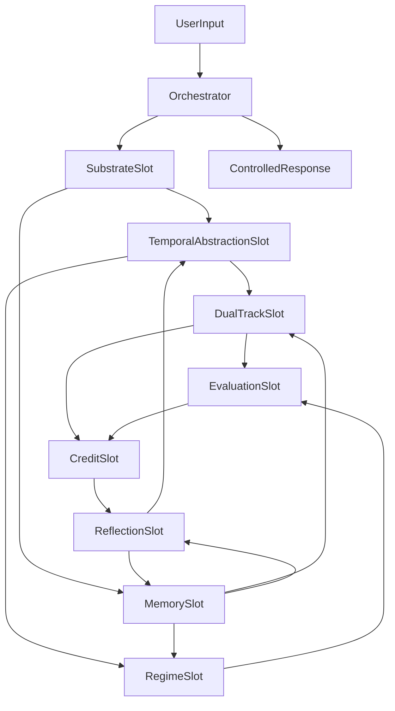

# Next-Gen Adaptive Agent 总实施计划

> Status: draft
> Last updated: 2026-04-06
> Scope: final-state oriented rollout
> Source: `docs/SYSTEM_DESIGN.md`, `docs/next_gen_emogpt.md`, `docs/DATA_CONTRACT.md`, `docs/specs/*.md`

## 1. 目标

本计划服务于“向 AGI 逼近的下一代自适应 agent”，而不是一步到位的人类级 AGI。实施方式不再被 `M0-M6` 的线性顺序绑定，而是围绕**最终态收敛**来组织：

- 每个收敛包先把自己的 owner、快照契约和主要 consumer 做完整。
- 在绝大部分包完成前，系统允许处于“局部完备、默认未全连”的状态。
- 由最后一个总接线包统一把所有 slot 接到正式运行链路上。

## 2. 实施原则

### 2.1 收敛包原则

- 单包只解决一个主 owner。
- 单包只冻结一个正式快照契约，或一条主要快照链。
- 单包优先只切一个主要 consumer。
- 单包优先控制在 3-8 个关键文件的实现范围内。
- 基底层变更与控制器层变更分离，不混在同一包中。

### 2.2 最终态优先

- 先定义最终态的 slot、owner、依赖和验收，再安排收敛包。
- 每个包都必须说明“未接线完成态”是什么，避免为了联调而提前耦合。
- 每个包都必须说明最终接线由谁完成，避免多个模块争抢集成 owner。

### 2.3 R15 迁移纪律

- 每个包必须给出退出条件和回滚方案。
- 每个包都要有可检查的公共交换，不允许隐式共享状态。
- 所有 widen scope 都以评估证据和调试可观测性为前置。
- 如果变更影响职责边界、slot、schema、owner，必须同步更新 spec 与 `docs/DATA_CONTRACT.md`。

## 3. 最终态架构边界

### 3.1 最终态模块地图



### 3.2 最终态不变量

- 所有跨模块交换均通过快照完成。
- 每个 slot 只有一个 owner。
- 所有模块都能发布可学习、可检查、可回滚的内部状态。
- `evaluation` 在 `credit` 和 `reflection` 之前可用，不能尾部补件。
- `temporal_abstraction` 先以接口和可替换实现位点落地，不强绑完整 ETA 训练闭环。

## 4. 收敛包集合

本轮实施固定为 10 个收敛包：

1. `P00_runtime_kernel`
2. `P01_substrate_adapter`
3. `P02_memory_continuum`
4. `P03_dual_track_core`
5. `P04_regime_identity`
6. `P05_evaluation_backbone`
7. `P06_credit_and_gate`
8. `P07_reflection_writeback`
9. `P08_temporal_abstraction_interface`
10. `P09_final_wiring_and_rollout`

详见 [01_package_registry.md](./01_package_registry.md) 和 `packages/` 目录。

## 5. 推荐执行顺序

该顺序是**收敛顺序**，不是旧里程碑顺序的复写。

### 5.1 阶段 A：运行时与边界固定

1. `P00_runtime_kernel`
2. `P01_substrate_adapter`
3. `P05_evaluation_backbone`

目标：

- 固定模块基类、slot 注册、缺省 upstream 语义。
- 回答 substrate 可实现边界。
- 先有调试/评估骨架，再允许后续 adaptive loop 设计继续扩张。

### 5.2 阶段 B：核心状态拥有者落地

1. `P02_memory_continuum`
2. `P03_dual_track_core`
3. `P04_regime_identity`

目标：

- 把长期状态、两轨状态、regime 身份做成正式 owner。
- 让这些模块在 standalone 和 shadow 模式下都可工作。

### 5.3 阶段 C：学习与慢回路落地

1. `P06_credit_and_gate`
2. `P07_reflection_writeback`
3. `P08_temporal_abstraction_interface`

目标：

- 建立信用分配与门控自修改。
- 建立异步反思写回。
- 固定时间抽象接口，但保留后续替换完整 learned controller 的空间。

### 5.4 阶段 D：统一接线与 rollout

1. `P09_final_wiring_and_rollout`

目标：

- 统一接线所有 slot。
- 移除或隔离临时 stub 路径。
- 以 `disabled` / `shadow` / `active` 三种级别逐步开启能力。

## 6. 依赖策略

### 6.1 硬依赖

- `P00` 是所有包的前置。
- `P01` 是 `P08` 的前置。
- `P05` 是 `P06` 和 `P09` 的前置。
- `P02` 是 `P07` 的前置。
- `P03` 是 `P06` 的前置。

### 6.2 软依赖

- `P04` 依赖 `P02` 与 `P03` 的稳定输入，但允许先用 shadow consumer 方式对接。
- `P08` 在正式接线前可发布 placeholder 风格的 `temporal_abstraction` 快照，只要求 shape 稳定。
- `P07` 在 `P09` 前应支持禁用写回或只记录 writeback proposal。

### 6.3 缺省 upstream 语义

为支持局部完备、未全接线状态，`P00` 必须定义：

- 缺失 slot 如何表示。
- stub snapshot 的 version 和 owner 语义。
- `disabled` 与 `shadow` 模式下模块是否发布快照。
- propagation 遇到禁用模块时的行为。

## 7. 接线级别

### 7.1 `disabled`

- 包内部实现已存在，但不进主执行链。
- 可用于 standalone 测试和 contract 校验。

### 7.2 `shadow`

- 包进入执行链并消费上游快照，但其输出不驱动主决策。
- 用于比较、日志、评估、对照实验。

### 7.3 `active`

- 包的快照成为正式上游输入。
- 输出进入主链路并影响响应、记忆或自修改。

### 7.4 当前 P09 默认接线

- active：`substrate`、`memory`、`dual_track`、`evaluation`、`regime`、`credit`
- shadow：`reflection`、`temporal_abstraction`
- kill switch：可将任意模块强制回退为 `disabled`
- final acceptance：统一生成 active / shadow / disabled 报告与 rollout 建议

## 8. 文档树

```text
docs/implementation/
  00_master_plan.md
  01_package_registry.md
  packages/
    P00_runtime_kernel.md
    P01_substrate_adapter.md
    P02_memory_continuum.md
    P03_dual_track_core.md
    P04_regime_identity.md
    P05_evaluation_backbone.md
    P06_credit_and_gate.md
    P07_reflection_writeback.md
    P08_temporal_abstraction_interface.md
    P09_final_wiring_and_rollout.md
```

## 9. 子计划模板

每个收敛包文档统一包含：

- 包目标
- Owner / Slot / 主要 Consumer
- 覆盖能力域与对应 spec
- 前置条件
- 范围内交付
- 范围外内容
- 数据契约变更
- 实施步骤
- 接线策略
- 验收标准
- 退出条件与回滚方案
- 需要同步更新的文档

## 10. 总体验收

当 `P09` 完成后，系统应达到以下最小最终态：

- 核心 slot 全部注册并具备明确 owner。
- 所有跨模块消费都通过 `upstream` 快照完成。
- `memory`、`dual_track`、`regime`、`evaluation`、`credit`、`reflection` 构成可观测闭环。
- `temporal_abstraction` 至少具备稳定接口、状态发布和可替换实现位点。
- 所有 adaptive 路径都有门控、日志、评估和回滚点。
- 系统支持 `disabled`、`shadow`、`active` 三种接线级别。

## 11. 文档维护规则

- 实施计划不重复替代 spec；它负责把 spec 变成执行顺序和收敛包。
- 如果某包调整 owner、slot、schema、依赖，必须先改对应 spec，再更新该包文档。
- 总计划只维护跨包结构，不记录包内实现细节。

## 12. 关键参考

- [`docs/SYSTEM_DESIGN.md`](../SYSTEM_DESIGN.md)
- [`docs/next_gen_emogpt.md`](../next_gen_emogpt.md)
- [`docs/DATA_CONTRACT.md`](../DATA_CONTRACT.md)
- [`docs/DEBUG_SYSTEM.md`](../DEBUG_SYSTEM.md)
- [`docs/EVALUATION_SYSTEM.md`](../EVALUATION_SYSTEM.md)
- [`docs/specs/00_INDEX.md`](../specs/00_INDEX.md)
- [`docs/specs/contract-runtime.md`](../specs/contract-runtime.md)
