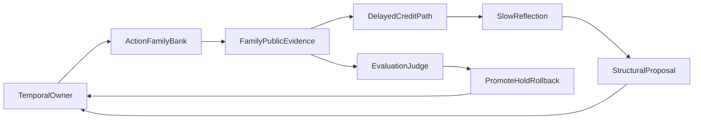

# ETA/NL 下一阶段演进方案

> Status: draft
> Last updated: 2026-04-08
> Scope: post-`eta-nl-next-wave` evolution route
> Source: `docs/specs/temporal-abstraction.md`, `docs/specs/multi-timescale-learning.md`, `docs/specs/evaluation.md`, `docs/specs/credit-and-self-modification.md`

## 1. 目标

本方案服务于 ETA/NL 从“可运行骨架 + 可检查证据”走向“弱涌现闭环 → 强涌现闭环”的下一阶段收敛。

当前系统已经具备：

- `metacontroller`、`switch gate`、`z-space`、`internal RL`、`reflection writeback`
- discovered action family 的基础生命周期
- family-level published evidence
- delayed attribution、replay benchmark、evolution judge 雏形

但系统还没有进入“真实自进化”状态。下一阶段的目标不是继续堆能力点，而是把下面三件事做实：

1. 抽象动作真正涌现，而不是主要靠规则扶着长。
2. 控制抽象与长期结果形成稳定闭环，而不是停留在 turn/session 近端代理。
3. 评估和自修改从“会记录、会判断”变成“真正驱动 promote / hold / rollback”。

## 2. 当前阶段判断

### 2.1 ETA 当前所处阶段

当前 ETA 处于“弱涌现前期”：

- family bank 已经从空集启动，不再依赖 seeded prototype
- `temporal` owner 已实现 `reuse/create/split/merge/prune`
- runtime 和 SSL 已共享统一的 post-switch family observation
- `evaluation` / `credit` 已能读取 family-level evidence

但 ETA 还没有进入“自维持涌现”阶段，原因是：

- family 形成与选择仍大量依赖 owner-side heuristic score、threshold、topology rule
- active abstract action 的长期收益绑定还弱
- internal RL reward 仍主要依赖 proxy mix，而不是长期真实后果
- evolution judge 还没有真正进入主 rollout decision path

### 2.2 NL 当前所处阶段

当前 NL 处于“多时间尺度通道打通，但长期信用仍弱”：

- online-fast: temporal owner + internal RL + residual env 已成链
- session-medium: delayed attribution、credit、regime effectiveness 已成链
- background-slow: reflection 已能发 bounded structural proposal

但 NL 还没有进入“长期沉淀主导结构演进”阶段，原因是：

- delayed credit 仍偏短延迟 attribution
- 跨 session 持续积累还缺少强 benchmark 证明
- slow reflection 仍偏 bounded restructuring，而不是稳定压缩出高层策略结构

## 3. 下一阶段核心问题

下一阶段只围绕 4 个核心问题推进：

### 3.1 抽象动作为什么还没真正涌现

- family 生命周期已经存在，但 family 竞争和淘汰还不是由长期结果主导
- `active_abstract_action` 还容易塌到少数高支持 family
- family-level published summary 已有，但 consumer 还没有充分把它作为长期归因单位使用

### 3.2 控制抽象为什么还没变成长期结果

- `joint_learning_progress` 已修到可用，但仍是 cycle 内代理量
- `delayed_action_alignment`、`regime_sequence_payoff` 已进入主链，但 horizon 还短
- 还不能回答“这个结构变化在 10-20 轮后是否持续更优”

### 3.3 internal RL 为什么还不够真

- 当前 env 已进入高保真 residual backend 主链
- reward 已结合 downstream effect 与 evaluation family delta
- 但 rollout 仍不是对真实长期 session 后果的高保真模拟

### 3.4 evolution judge 为什么还只是雏形

- replay benchmark 已经存在
- `judge_evolution_candidate()` 已能输出 `promote / hold / rollback`
- 但 judge 还没有成为 `joint_loop`/`writeback` 的正式裁决器

## 4. 下一阶段总路线

### 4.1 总体思路

下一阶段不再优先扩张模块数量，而是优先增强三条闭环：

### 4.2 收敛顺序

推荐按以下顺序推进：

1. family-level 长期竞争
2. delayed credit horizon 扩展
3. structural proposal 强化
4. evolution judge 接入主决策
5. cross-session benchmark 和增长证明

## 5. 分阶段实施

## Phase A: 抽象动作从“弱涌现”到“竞争涌现”

### 目标

让 discovered action family 不只是能长出来，而是能在长期结果上竞争、复用、淘汰。

### 主要改动

- 在 `temporal` owner 内引入 family-level competition memory
- 把 `support / stability / drift / persistence` 扩展成 family survival signals
- 减少 active family selection 对局部相似度的单点依赖
- 将 family collapse、family over-dominance 变成显式 evaluation alert

### 预期结果

- 不同场景族不再长期塌到一个 family
- family reuse 与 turnover 都可度量
- family 结构变化开始由结果证据而不是仅由观测相似度驱动

## Phase B: delayed credit 从“短延迟”到“中长延迟”

### 目标

让 `(abstract_action, regime, family_version)` 与后续多轮结果形成更强归因。

### 主要改动

- 把当前单条 delayed queue 扩展为多步、可回看 attribution ledger
- 引入 `N-step` delayed outcome aggregation，而不是每轮 `pop(0)` 一次
- 对同一 family/regime 序列计算 rolling payoff，而不是单点 outcome
- 把 delayed credit 写入 session report 与 benchmark evidence

### 预期结果

- 可以比较“不同 family / regime 序列的中程收益”
- `credit` 不再只反映即时 reward 或单轮 delayed score

## Phase C: slow reflection 从“bounded restructuring”到“structured compression”

### 目标

让 slow reflection 不只是发出局部 merge/split/prune proposal，而是能压缩出更稳定的高层结构建议。

### 主要改动

- 给 reflection 增加 structural proposal bundle
- proposal 不再只针对单 family，而是可以针对 family cluster、regime sequence、track coupling
- 给 proposal 增加 evidence pack：来源 benchmark、来源 delayed credit、来源 session trend
- 将 proposal 成功/失败写回长期 ledger

### 预期结果

- reflection 从“调参器 + 小结构修改器”走向“慢层结构提案器”
- 结构 proposal 与后续表现可以被追踪

## Phase D: evolution judge 接入正式主链

### 目标

让 replay benchmark 和 evolution judge 真正进入系统演化决策，而不是只作为旁路分析工具。

### 主要改动

- 将 `judge_evolution_candidate()` 接入 `joint_loop` / background writeback gating
- 结构 proposal 应先经过 replay benchmark 再决定 `promote / hold / rollback`
- 将 judgement 结果记录为 first-class self-modification evidence
- 区分：
  - real improvement
  - style drift
  - unsafe mutation
  - insufficient evidence

### 预期结果

- 系统不只是“会改”，而是“按裁决改”
- 演化路径开始有统一 judge，而不是分散在多个 heuristic gate 中

## Phase E: cross-session 增长证明

### 目标

证明系统在多 session 下会持续变得更懂用户、更稳、更强。

### 主要改动

- 增加 cross-session benchmark 套件
- 建立 session-window 对比：短期、会话级、跨会话级
- 把 family/regime 长期表现写入 longitudinal report
- 明确“长期人格化/关系化/策略化积累”的成功判据

### 预期结果

- 能回答“它是否真的在跨 session 成长”
- NL 的长期沉淀不再只是结构上存在，而有证据证明其有效

## 6. 验收标准

下一阶段完成时，至少应满足以下标准：

### ETA 验收

- 不同场景族下，`active_abstract_action` 不再长期塌到单一 family
- family 变化能被 delayed outcome 明显区分
- family 结构变化能被 replay/benchmark 判定为 promote/hold/rollback

### NL 验收

- delayed credit horizon 超出单轮短延迟
- session-medium 与 background-slow 能稳定影响后续结构
- cross-session 报告能显示稳定增长或稳定回滚

### 裁决验收

- replay benchmark 失败时，系统能阻止结构 proposal promote
- style drift 不会被误判为真实增强
- judge 输出能进入正式演化链，而不是只存在于分析层

## 7. 风险与边界

### 7.1 不应该做的事

- 不要把更多关键词规则塞进 regime / family scoring 来假装“分化”
- 不要让 consumer 自己重建 family bank 内部语义
- 不要把 structure proposal 直接升级成无门控自修改
- 不要把长期 judge 做成只会通过的宽松仪式

### 7.2 继续保持的边界

- `temporal` 仍是 action family 唯一 owner
- `evaluation` 负责裁决，不负责直接改结构
- `reflection` 负责提案，不负责绕过 gate 执行
- `joint_loop` 负责把 judge 结果接回 rollout decision

## 8. 建议落地顺序

如果立刻继续做，建议严格按下面顺序：

1. 扩 delayed credit horizon
2. 把 family collapse / family monopoly 做成 alert 和 benchmark 项
3. 强化 structural proposal bundle
4. 把 evolution judge 接进 `joint_loop`
5. 做 cross-session benchmark

## 9. 退出条件

本方案阶段可以视为完成，当且仅当：

- 抽象动作分化不再主要依赖人工扶正
- 延迟信用能稳定解释中长期变化
- evolution judge 已成为正式 promote/hold/rollback 裁决器
- cross-session 增长有正反两类 benchmark 证据支撑

在那之前，系统仍应被视为“具备 ETA/NL 核心雏形，但尚未达到真实自进化成熟态”。
