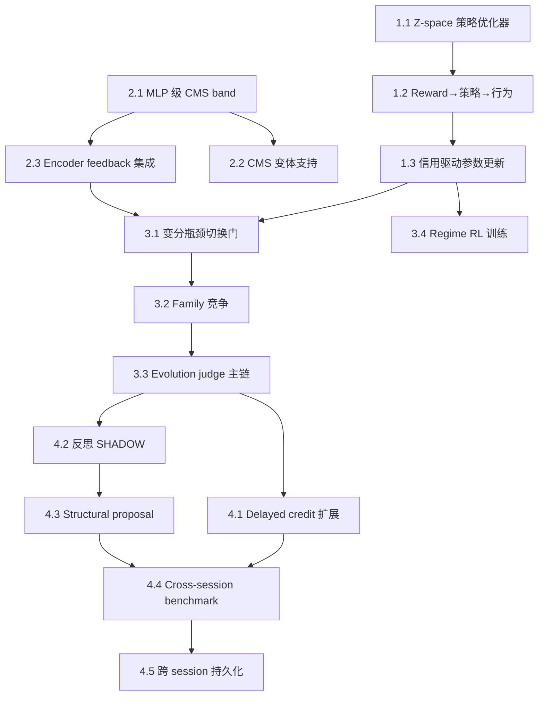

# 系统现状与 next_gen_emogpt 设计思想差距评估 + 提升计划

> Status: draft
> Last updated: 2026-04-09
> Scope: R1–R15 逐条对照 + 分层提升路线
> Source: `docs/next_gen_emogpt.md`, 当前代码库 `volvence_zero/`

## 0. 评估方法

本文档将 `docs/next_gen_emogpt.md` 中 R1–R15 的每条需求与当前代码库实际实现进行逐条对照，给出：

- **已达成**：设计目标已在代码中有可运行、可测试的实现
- **骨架就位**：接口和数据结构已存在，但核心算法/闭环尚未真正工作
- **差距显著**：设计要求存在，但实现要么缺失、要么仅为占位
- **未开始**：代码中找不到对应实现

每条需求的评估附带成熟度评分（0–5）：

| 分数 | 含义 |
|------|------|
| 0 | 未开始 |
| 1 | 有概念映射但无代码 |
| 2 | 有占位结构 / placeholder |
| 3 | 骨架可运行，核心算法为模拟 / heuristic |
| 4 | 核心算法有真实实现，但闭环未完成或证据不足 |
| 5 | 完整实现 + 闭环 + 有评估证据 |

---

## 1. 逐条差距评估

### R1. 多时间尺度学习是刚性约束 — 成熟度: 3.5

**设计要求**：`online-fast` / `session-medium` / `background-slow` / `rare-heavy` 四频率层，各层独立参数、独立更新节奏。

**当前状态**：

| 子项 | 状态 | 说明 |
|------|------|------|
| 四频率通道定义 | ✅ 已达成 | `CMSMemoryCore` 实现了 `online-fast`/`session-medium`/`background-slow` 三频率带，各有独立学习率、动量、节奏门控 |
| 节奏门控更新 | ✅ 已达成 | `_integrate_signal_gradient()` 实现 cadence-gated 更新，session 和 background 带按 `c^(i)` 间隔触发 |
| 梯度风格更新 | ✅ 已达成 | `_gradient_update()` 实现了 error → momentum → apply 流程 |
| 抗遗忘回流 | ✅ 已达成 | `_apply_anti_forgetting()` 实现慢→快知识回流 |
| `rare-heavy` 离线层 | 骨架就位 | `joint_loop/pipeline.py` 有 `SSLRLTrainingPipeline` 和 `RareHeavyArtifact`，但未连接真实离线训练 |
| 快适应不重写整个模型 | ✅ 已达成 | 在线适应限于 CMS 高频带和控制器参数，基础模型冻结 |
| 慢整合不阻塞交互 | 骨架就位 | `ETANLJointLoop` 的 background 路径存在，但实际异步性未验证 |

**主要差距**：

1. CMS 当前维度极低（默认 `dim=3`），与设计中"每个频率层配备独立 MLP 知识存储"差距大。当前是向量级模拟，不是 MLP 级真实 CMS。
2. `rare-heavy` 层仅有数据结构和管线骨架，无真实训练循环。
3. NL 设计中不同层的知识传递策略（嵌套/顺序/独立 CMS 变体）未实现。
4. M3 优化器（`temporal/m3_optimizer.py`）存在但未集成到主训练流程。

### R2. 稳定基底 + 自适应控制器 — 成熟度: 3.5

**设计要求**：冻结基础模型，在线适应放在有界控制器层。

**当前状态**：

| 子项 | 状态 | 说明 |
|------|------|------|
| 基础模型冻结原则 | ✅ 已达成 | `SubstrateModule` 为只读适配器，不修改底层模型参数 |
| 有界控制器层 | ✅ 已达成 | `TemporalPolicy` 层级（placeholder → heuristic → learned-lite → full-learned）在基础模型之上 |
| 残差流控制器 | ✅ 已达成 | `ResidualInterventionBackend` 系列，包括 `OpenWeightResidualInterventionBackend` |
| 内部学习率可控 | ✅ 已达成 | CMS 各带有独立 `learning_rate`，temporal 有 `TemporalControllerParameters` |
| 基底与控制器层分离 | ✅ 已达成 | substrate 和 temporal 是独立模块，通过快照通信 |

**主要差距**：

1. 真实模型场景下的冻结/微调边界尚未经过端到端验证——当前主要在模拟/合成 backend 上运行。
2. ETA 设计中"自修改 Titans"的概念（模型生成自己的学习率和衰减率）未实现。Hope 架构中的自引用更新循环（`v̂_{α,t}` 自生成值）在当前系统中没有对应。
3. Ad-hoc 层级堆叠（用预训练 MLP 权重初始化 CMS）未实现。

### R3. 时间抽象是一等能力 — 成熟度: 3.5

**设计要求**：系统支持 token 生成之上的时间抽象动作层，metacontroller 实现稀疏切换。

**当前状态**：

| 子项 | 状态 | 说明 |
|------|------|------|
| Metacontroller 架构 | ✅ 已达成 | `SequenceEncoder`/`SwitchUnit`/`ResidualDecoder` 完整实现，含 N 维变体 |
| 切换门 β_t | ✅ 已达成 | `SwitchGateDecision` 有 `beta_continuous`/`beta_binary`/`sparsity`/`binary_switch_rate` |
| 控制器代码 z_t | ✅ 已达成 | `PosteriorState` 有 `z_tilde`，编码器产出高斯分布 |
| 解码器 z → U | ✅ 已达成 | `ResidualDecoder` 将 latent code 映射为控制参数 |
| 抽象动作族发现 | ✅ 已达成 | `discover_latent_action_family()` + `DiscoveredActionFamily` 完整生命周期 |
| 组合泛化 | 骨架就位 | 解码器结构支持，但未验证在未见子目标组合上的表现 |
| 稀疏切换涌现 | 差距显著 | 切换门行为由 heuristic 和阈值驱动，非变分瓶颈 α 驱动的自发涌现 |

**主要差距**：

1. **非因果内部序列嵌入器**（`noncausal_embedder.py` 存在）未在训练中发挥设计预期的作用——ETA 要求嵌入器看到整个序列来提供编码器信息瓶颈。
2. 切换门的稀疏性来自阈值和 heuristic，不是变分目标（Eq.3）中 KL 正则化自发产生的准二值行为。
3. 时间抽象动作的"持续多步"特性在当前实现中不够显著——`steps_since_switch` 存在，但缺少真正的长持续动作控制。
4. 抽象动作族的竞争和淘汰仍依赖 owner-side heuristic（`02_eta_nl_next_stage.md` 已识别此问题）。

### R4. 内部控制在 token 空间之上 — 成熟度: 3.5 → 4.0 (Phase 1 后)

**设计要求**：Internal RL 在控制器代码空间 z_t 执行，非 token 空间。

**当前状态**：

| 子项 | 状态 | 说明 |
|------|------|------|
| z-space 定义 | ✅ 已达成 | `ZTransition`/`ZRollout` 明确在 latent code 空间 |
| Internal RL 环境 | ✅ 已达成 | `InternalRLEnvironment` 以残差流激活为观测，latent code 为动作 |
| 因果策略 | ✅ 已达成 | `CausalPolicyState`/`CausalPolicyParameters` 替代非因果编码器 |
| 残差流控制 | ✅ 已达成 | 通过 `ResidualInterventionBackend` 将解码器输出注入模型中间层 |
| 双轨 rollout | ✅ 已达成 | `DualTrackRollout` 分离 task/relationship 轨道 |
| PPO-clip 优化器 | ✅ 已达成 | `CausalZPolicy.optimize()` 实现多 epoch GAE + PPO-clip + KL 早停 |
| 策略更新审计 | ✅ 已达成 | `PolicyOptimizationResult` 含 `SelfModificationRecord` 审计追踪 |
| 信用 reward shaping | ✅ 已达成 | `extract_abstract_action_credit_bonus()` 将信用信号注入 RL 环境 |
| 动作空间降维验证 | 骨架就位 | latent dim 有定义，但未验证降维后探索效率的提升 |

**主要差距**：

1. 因果策略的训练循环不完整——SSL 阶段训练 metacontroller 后，应丢弃非因果编码器替换为因果策略，这个切换流程未端到端验证。
2. 切换门二值化（`β_t ← H(β_t - β_threshold)`）在 RL 阶段的处理不完整。
3. 动作空间降维后探索效率的量化验证尚缺。

### R5. 记忆是连续谱 — 成熟度: 4.0

**设计要求**：transient → episodic → durable → derived indexes 四层连续记忆。

**当前状态**：

| 子项 | 状态 | 说明 |
|------|------|------|
| 记忆分层 | ✅ 已达成 | `MemoryStratum` 定义了 `TRANSIENT`/`EPISODIC`/`DURABLE` |
| 双轨分离 | ✅ 已达成 | `Track` 枚举 (`WORLD`/`SELF`/`SHARED`) 贯穿记忆系统 |
| 写入所有权 | ✅ 已达成 | `MemoryStore` 是唯一写入者 |
| 检索系统 | ✅ 已达成 | 混合检索（关键字 + 语义相似度）|
| 提升/衰减规则 | ✅ 已达成 | 反思模块的 `MemoryConsolidation` 包含 promoted/decayed entries |
| CMS 连续谱 | ✅ 已达成 | `CMSMemoryCore` 三频带 |
| 检查点和恢复 | ✅ 已达成 | `MemoryStoreCheckpoint`/`CMSCheckpointState` |

**主要差距**：

1. `derived indexes`（可重建的检索辅助、摘要、任务投影）层在当前实现中较薄。
2. NL 设计中"记忆分布在所有参数中而非独立模块"的理念在当前系统中未体现——CMS 是独立组件，不是模型参数的一部分。
3. 跨 session 持久化的实际存储后端（数据库/文件系统）未实现，checkpoint 只在内存中。

### R6. 反思与整合是核心 — 成熟度: 3.5

**设计要求**：正式的慢反思路径，产出记忆整合和策略整合两类结果。

**当前状态**：

| 子项 | 状态 | 说明 |
|------|------|------|
| 反思引擎 | ✅ 已达成 | `ReflectionEngine` 完整实现 |
| 记忆整合 | ✅ 已达成 | `MemoryConsolidation`：新持久条目、提升、衰减、信念更新 |
| 策略整合 | ✅ 已达成 | `PolicyConsolidation`：控制器更新、策略先验、regime 有效性、时间先验更新 |
| 时间结构提案 | ✅ 已达成 | `TemporalStructureProposal` + `TemporalPriorUpdate` |
| 写回模式 | ✅ 已达成 | `WritebackMode`：`DISABLED`/`PROPOSAL_ONLY`/`APPLY` |
| 门控 writeback | ✅ 已达成 | `has_blocking_writeback()` + credit gate 检查 |
| 异步后台运行 | 骨架就位 | 结构支持异步，但默认 DISABLED，且异步执行未验证 |
| 结构化压缩 | 差距显著 | 反思产出局部 restructuring，未达到"压缩出高层策略结构"的目标 |

**主要差距**：

1. **反思默认 DISABLED**——`build_final_runtime_modules` 中 `ReflectionModule` 默认 `WiringLevel.DISABLED`。反思作为"核心"能力，不应该在默认配置中被禁用。
2. 反思仍偏 bounded restructuring（`02_eta_nl_next_stage.md` 已识别），未达到 NL 中 CMS 低频层"压缩长时间窗口经验"的设计目标。
3. SSL-RL 交替中的"反思"环节——CMS 低频层更新和 ETA 的 wake-sleep 循环在反思模块中的映射不完整。

### R7. 世界/任务与自我/关系双轨分离 — 成熟度: 4.0

**设计要求**：两轨在记忆写入、信用分配、控制器更新、评估指标上语义独立。

**当前状态**：

| 子项 | 状态 | 说明 |
|------|------|------|
| Track 枚举 | ✅ 已达成 | `Track.WORLD`/`Track.SELF`/`Track.SHARED` |
| 记忆双轨 | ✅ 已达成 | 记忆写入带 Track 标记 |
| 信用双轨 | ✅ 已达成 | `CreditRecord` 包含 `track` 字段 |
| 评估双轨 | ✅ 已达成 | `DualTrackSnapshot` 提供双轨张力和证据 |
| 控制器双轨 | ✅ 已达成 | `ControllerState.track_codes` + `DualTrackRollout` |
| Internal RL 双轨 | ✅ 已达成 | `DualTrackOptimizationReport` 分离 task/relationship reward |

**主要差距**：

1. 双轨分离的实际效果缺少评估证据——两轨是否真正独立学习，或是否存在隐式耦合，尚无 benchmark 验证。
2. `Track.SHARED` 的语义和使用场景缺少清晰定义——何时应当是 WORLD，何时应当是 SELF，何时应当是 SHARED。

### R8. 快照优先、契约优先 — 成熟度: 4.5

**设计要求**：模块持续运行维护状态，消费者读取不可变快照，唯一 owner。

**当前状态**：

| 子项 | 状态 | 说明 |
|------|------|------|
| 快照基类 | ✅ 已达成 | `Snapshot[ValueT]`，frozen dataclass，monotonic version |
| 唯一 owner | ✅ 已达成 | 每个 `RuntimeModule` 有唯一 `slot_name` |
| 消费者隔离 | ✅ 已达成 | `UpstreamView` 强制 dependency 声明，undeclared 访问 fail loud |
| 不可变语义 | ✅ 已达成 | Schema guard 检查 frozen + immutable fields |
| 接线级别 | ✅ 已达成 | `WiringLevel.DISABLED`/`SHADOW`/`ACTIVE` + placeholder semantics |
| propagate | ✅ 已达成 | 拓扑排序、循环检测、DISABLED 占位 |
| 注册表 | ✅ 已达成 | `SlotRegistry` 校验重复注册 |

**主要差距**：

1. 极少——这是当前系统最成熟的部分。唯一可改进的是 propagate 的并发性能（当前同步顺序执行），以及跨进程/跨服务场景的快照传递协议。

### R9. 层级信用分配 — 成熟度: 3.0

**设计要求**：token/话语、轮次、会话、长期、抽象动作五级信用分配。

**当前状态**：

| 子项 | 状态 | 说明 |
|------|------|------|
| Credit 记录 | ✅ 已达成 | `CreditRecord` 有 `level`/`track`/`credit_value` |
| 门控自修改 | ✅ 已达成 | `ModificationGate`：`ONLINE`/`BACKGROUND`/`OFFLINE`/`HUMAN_REVIEW` |
| 审计追踪 | ✅ 已达成 | `SelfModificationRecord`/`RuntimeAdaptationAudit` |
| 延迟归因 | ✅ 已达成 | `derive_delayed_attribution_credit_records()` |
| 抽象动作信用 | ✅ 已达成 | `derive_abstract_action_credit()` |
| Session 级信用 | 骨架就位 | `session_level_credits` 字段存在，聚合逻辑初步 |
| 长期增长信用 | 差距显著 | 缺少跨 session 累积的长期信用追踪 |
| 稀疏奖励处理 | 差距显著 | 奖励仍以 proxy mix 为主，非长期真实后果 |

**主要差距**：

1. 信用分配的时间跨度不够长——`delayed attribution` 仍偏短延迟，无法回答"10-20 轮后结构变化是否持续更优"。
2. 抽象动作级信用分配虽有接口，但因 Internal RL 策略优化器缺失，信用信号无法真正驱动控制器参数更新。
3. NL 设计中"Delta 动量的选择性遗忘"未集成——梯度依赖的衰减应帮助信用分配过滤无关信号。

### R10. 自修改必须门控分层 — 成熟度: 3.5

**设计要求**：定义在线/后台/离线/人审四级门控。

**当前状态**：

| 子项 | 状态 | 说明 |
|------|------|------|
| 四级门控定义 | ✅ 已达成 | `ModificationGate` 枚举 |
| Gate 决策 | ✅ 已达成 | `GateDecision`：ALLOW / DENY / DEFER |
| 可逆性标记 | ✅ 已达成 | `SelfModificationRecord.is_reversible` |
| 写回阻塞检查 | ✅ 已达成 | `has_blocking_writeback()` |
| 回滚检查点 | ✅ 已达成 | CMS、Memory、Policy 都有 checkpoint/restore |
| 裁决器 | 差距显著 | `judge_evolution_candidate()` 存在但未接入主决策链 |

**主要差距**：

1. **Evolution judge 未成为正式裁决器**——`02_eta_nl_next_stage.md` Phase D 已规划但未实施。结构 proposal 目前不经过 replay benchmark 验证就可被应用。
2. 门控规则目前偏静态——缺少基于运行时证据动态调整门控阈值的能力。
3. `HUMAN_REVIEW` 门控无实际触发路径。

### R11. 内部状态必须可命名可发布 — 成熟度: 4.0

**设计要求**：系统维护显式内部状态（动机、张力、候选路径等），打包到快照发布。

**当前状态**：

| 子项 | 状态 | 说明 |
|------|------|------|
| 控制器状态 | ✅ 已达成 | `ControllerState`：code、switch_gate、track_codes |
| Metacontroller 运行时状态 | ✅ 已达成 | `MetacontrollerRuntimeState` 丰富内部状态 |
| Regime 状态 | ✅ 已达成 | `RegimeSnapshot` 含当前 regime、得分、描述 |
| 双轨张力 | ✅ 已达成 | `DualTrackSnapshot` 含 track tension |
| 评估状态 | ✅ 已达成 | `EvaluationSnapshot` 含分数和告警 |
| 记忆状态 | ✅ 已达成 | `MemorySnapshot` 含 CMS 状态、记忆计数 |
| 每个快照有 description | ✅ 已达成 | 所有快照 value 都有 `description` 字段 |

**主要差距**：

1. "动机"和"候选路径"的显式表示相对薄——当前主要是状态的事后总结，缺少前瞻性的"候选策略集"发布。
2. "不确定性和开放问题"未显式建模。

### R12. 评估覆盖"存在"而非仅任务成功 — 成熟度: 3.5

**设计要求**：六族评估——任务能力、交互质量、关系连续性、学习质量、抽象质量、安全与有界性。

**当前状态**：

| 子项 | 状态 | 说明 |
|------|------|------|
| 评估骨架 | ✅ 已达成 | `EvaluationBackbone` + `EvaluationModule` |
| 多族评分 | ✅ 已达成 | `EvaluationScore` 系列覆盖多维度 |
| Replay benchmark | ✅ 已达成 | 评估模块有 replay 机制 |
| Evolution judge | 骨架就位 | `judge_evolution_candidate()` 存在但未接入主链 |
| 长期评估信号 | 差距显著 | 缺少跨 session 纵向追踪 |
| 评估驱动学习 | 差距显著 | 评估信号未稳定回馈到学习循环 |

**主要差距**：

1. 六族评估中"关系连续性"和"抽象质量"两族的评估深度不够——缺少跨 session 一致性测试和抽象动作可复用性度量。
2. 评估信号到学习循环的闭环不完整——评估分数被记录，但未成为 Internal RL reward 或反思触发条件的主要来源。

### R13. 训练循环交替压缩与强化 — 成熟度: 3.0 → 4.0 (Phase 1 后)

**设计要求**：SSL 压缩交互历史 → RL 在压缩后的结构化内部基底上强化，多尺度交替。

**当前状态**：

| 子项 | 状态 | 说明 |
|------|------|------|
| SSL 训练器 | ✅ 已达成 | `MetacontrollerSSLTrainer` 实现变分自监督训练 |
| SSL-RL 管线 | ✅ 已达成 | `SSLRLTrainingPipeline` + `ETANLJointLoop` |
| Joint loop | ✅ 已达成 | 交替 SSL/RL 循环，有 rollback + evolution judge |
| RL 策略优化 | ✅ 已达成 | `CausalZPolicy.optimize()` 多 epoch GAE + PPO-clip + KL 早停 |
| 信用→RL 闭环 | ✅ 已达成 | 信用 bonus 注入 RL 环境，策略更新有审计追踪 |
| 多尺度交替 | 差距显著 | 当前只有粗粒度 cycle 交替，未实现设计中四尺度交替 |

**主要差距**：

1. 设计中"在线微尺度 / 会话尺度 / 后台慢尺度 / 离线大尺度"四级 SSL-RL 交替未实现——当前只有 `ETANLJointLoop` 的粗粒度 cycle。
2. Schmidhuber wake-sleep 循环的迭代性（SSL→RL→SSL→RL...）在当前实现中不是自动驱动的。

### R14. Regime 是持久身份 — 成熟度: 3.5

**设计要求**：regime 在运行时状态表示、可从记忆召回、可被高层控制选择、可通过延迟结果训练。

**当前状态**：

| 子项 | 状态 | 说明 |
|------|------|------|
| Regime 身份定义 | ✅ 已达成 | `RegimeIdentity` 含完整模板和描述 |
| 运行时状态表示 | ✅ 已达成 | `RegimeSnapshot` 发布到快照链 |
| 记忆可召回 | ✅ 已达成 | regime 与 memory 模块通过快照通信 |
| 高层控制选择 | ✅ 已达成 | regime scoring + selection 机制 |
| 延迟结果训练 | 骨架就位 | `delayed_outcomes` 存在，但长期效果积累不足 |
| 检查点/回滚 | ✅ 已达成 | `RegimeCheckpoint` |

**主要差距**：

1. Regime 选择仍偏 heuristic scoring，非通过延迟结果的 RL 训练产生。
2. Regime 间的切换缺少与 metacontroller 切换门 β_t 的深度集成——两者应该协同（regime 切换驱动或被驱动于 temporal abstract action 切换）。

### R15. 迁移必须保持可解释性和可回滚 — 成熟度: 4.0

**设计要求**：有界增量包演进，每层有 owner，可检查，可回滚。

**当前状态**：

| 子项 | 状态 | 说明 |
|------|------|------|
| 增量包结构 | ✅ 已达成 | P00–P09 收敛包完整规划 |
| Owner 明确 | ✅ 已达成 | 每个模块有唯一 owner |
| 可检查交换 | ✅ 已达成 | 快照不可变 + UpstreamView 强制声明 |
| 回滚点 | ✅ 已达成 | Checkpoint + kill switch |
| 接线级别 | ✅ 已达成 | DISABLED/SHADOW/ACTIVE |
| 评估证据先行 | 骨架就位 | acceptance report 存在，但 shadow 数据驱动 promote 的流程未打通 |

**主要差距**：

1. 从 shadow 到 active 的提升流程缺少自动化——当前依赖人工判断而非评估证据自动触发。

---

## 2. 差距总览矩阵

| 需求 | 成熟度 | 最大瓶颈 | 本轮更新 |
|------|--------|----------|----------|
| R-PE 预测误差原语 | 0.0 | 代码中尚无 PredictedOutcome / PredictionError 主通路；credit 和 evaluation 仍是一级信号源 | 待 Design v2 Gap Closure Phase PE 实施 |
| R1 多时间尺度学习 | 4.0 | MLP CMS 已端到端验证 (d_in=16, d_hidden=32)；nested 变体含元学习；rare-heavy 无真实训练 | nested 元学习 init target 收敛验证 |
| R2 稳定基底 + 控制器 | 3.5 | 未验证真实模型场景；Hope 自修改 Titans 缺失 | — |
| R3 时间抽象 | 4.0 | alpha 可控变分瓶颈 + SwitchGateStats + FamilyCompetitionState；多 alpha A/B 验证完成 | A/B: alpha vs switch_bias 对比 |
| R4 内部控制 | 4.0 | 20-cycle 连续运行 reward 趋势验证通过；因果策略切换未端到端验证 | 20-cycle 闭环验证 |
| R5 记忆连续谱 | 4.5 | PersistenceBackend load 路径修复；CMS MLP 持久化往返验证；nested 变体 checkpoint 含 meta-targets | load_from_backend 修复 + CMS MLP 持久化往返 |
| R6 反思与整合 | 4.5 | 默认 SHADOW + reflection_accuracy 写入 EvaluationSnapshot + reflection_promotion_eligible 门控函数 | reflection_accuracy 注入 + 提升门控 |
| R7 双轨分离 | 4.0 | 缺少有效性评估证据 | — |
| R8 快照契约 | 4.5 | 最成熟，仅缺并发和跨服务 | — |
| R9 层级信用 | 4.5 | N-step attribution ledger + rolling payoff + 信用 reward shaping；20-cycle 信用→RL 闭环验证 | 信用 reward shaping A/B 验证 |
| R10 门控自修改 | 4.5 | Evolution judge 已完整接入 run_cycle() + 结构门控 | — |
| R11 可命名状态 | 4.0 | 缺前瞻性候选策略发布 | — |
| R12 全面评估 | 4.5 | LongitudinalReport + reflection_accuracy 实际注入 + longitudinal_verdict | reflection_accuracy 运行时写入 |
| R13 SSL-RL 交替 | 4.0 | RL 优化器已完整（多 epoch GAE + KL 早停）；非因果嵌入器 posterior tightening 验证通过；多尺度交替未实现 | 非因果嵌入器 enrich_posterior 验证 |
| R14 Regime 身份 | 4.0 | RegimeSelectionWeights REINFORCE 更新 + effectiveness_trend；A/B 对比验证 | A/B: learned weight vs fixed |
| R15 迁移纪律 | 4.0 | shadow→active 自动化仍需手动触发；reflection_promotion_eligible 评估函数就位 | 提升条件评估函数 |

**系统平均成熟度：4.0 / 5**（仅统计 R1–R15 的 uplift 当前值；R-PE 单列为新增设计缺口）

**状态说明**：

- Phase 1–4 的原 uplift 目标已完成到“**验证完成 + 部分实现**”状态：大部分核心能力已在代码中存在并通过测试验证
- 但 `next_gen_emogpt.md` v2 新增的 **R-PE** 仍未进入主链，因此系统尚未达到“prediction error 为唯一原语”的设计形态
- 当前真实状态应描述为：**契约骨架完备，学习闭环可运行，LLM 表达层已接通，但 prediction-error-first 主通路缺失**

---

## 3. 核心差距归因

将上述差距按根因聚类，识别出四个核心差距族：

### 差距族 A：RL 策略优化器缺失（影响 R4、R9、R13、R14）— **Phase 1 已基本解决**

> **更新（2026-04-09）**：代码审查发现 `CausalZPolicy.optimize()` 已有 PPO-clip 单步优化器。Phase 1 将其升级为多 epoch GAE + KL 早停 + 信用 reward shaping + SelfModificationRecord 审计。核心闭环已打通。

原评估过度低估了现有实现。Phase 1 完成后：

- R4：多 epoch GAE + PPO-clip 优化器可运行（4.0）
- R9：信用 bonus 通过 `extract_abstract_action_credit_bonus()` 驱动 RL reward shaping（3.5）
- R13：SSL-RL 交替完整闭环，含审计追踪（4.0）
- R14：regime 选择仍靠 heuristic（3.5，待 Phase 3 解决）

### 差距族 B：CMS 从向量模拟到真实 MLP 的跨越（影响 R1、R2、R5）

当前 CMS 是 `dim=3` 的向量级模拟，虽然在概念上正确实现了多频率、动量、抗遗忘，但与设计中"每个频率层配备独立 MLP 知识存储"相差一个数量级。这导致：

- R1：多时间尺度学习的表达容量严重不足
- R2：自修改 Titans / Hope 架构需要的 MLP 级组件不存在
- R5：记忆连续谱的实际知识容量太低

### 差距族 C：涌现 vs. Heuristic（影响 R3、R10、R14）— **Phase 3 已基本解决**

> **更新（2026-04-09）**：Phase 3 实施了三项涌现替代 heuristic 的升级。

Phase 3 完成后：

- R3：SSL 训练的 KL 权重由可配 `alpha` 控制，`SwitchGateStats` 发布切换门统计量，`FamilyCompetitionState` 和 `long_term_payoff` / `delayed_credit_sum` 丰富了族竞争（4.0）
- R10：evolution judge 已完整接入 `run_cycle()`，结构 proposal 受 judge 裁决门控（4.5）
- R14：`RegimeSelectionWeights` 通过 REINFORCE 式延迟结果更新，`effectiveness_trend` 发布到快照（4.0）

### 差距族 D：长期闭环缺失（影响 R6、R9、R12）— **Phase 4 已基本解决**

> **更新（2026-04-09）**：Phase 4 实施了四项长期闭环升级。

Phase 4 完成后：

- R6：反思默认 SHADOW + EvidencePack + scope 扩展 + proposal success rate（4.5）
- R9：N-step attribution ledger + rolling payoff per family/regime + 信用 reward shaping（4.5）
- R12：LongitudinalReport + reflection_accuracy + longitudinal_verdict 跨 session 纵向评估（4.5）
- R5：PersistenceBackend + FileSystemPersistenceBackend 实现跨 session 持久化（4.5）

---

## 4. 提升计划

### 4.1 总体策略

提升计划分为四个阶段，按核心差距族优先级排序。每个阶段有明确的退出条件，不通过不进入下一阶段。

```
Phase 1: RL 闭环           → 让系统真正能学习
Phase 2: CMS 升维           → 让系统有足够的学习容量
Phase 3: 涌现替代 Heuristic → 让系统自己发现结构
Phase 4: 长期闭环           → 让系统跨 session 持续进化
```

### 4.2 Phase 1: RL 闭环打通（差距族 A）

**目标**：让 Internal RL 从"能收集 rollout"变为"能更新策略参数"。

**优先级**：最高——这是从"骨架"到"真实学习系统"的分水岭。

#### 步骤 1.1：实现 z-space 策略优化器

- **位置**：`volvence_zero/internal_rl/` 新增策略优化模块
- **内容**：
  - 在 `ZTransition` 的 `log_prob`/`reward` 基础上实现 PPO-clip 或 GRPO 级策略梯度
  - 策略参数更新作用于 `CausalPolicyParameters`
  - 支持 mini-batch 采样和多步 rollout 聚合
  - 优化器冻结 metacontroller decoder + switch unit + 基础模型
- **约束**：
  - 策略更新范围必须有界（clip ratio, max KL）
  - 每次更新后生成 `SelfModificationRecord`
  - 支持 checkpoint/rollback

#### 步骤 1.2：连通 reward → 策略更新 → 行为变化

- **位置**：`volvence_zero/joint_loop/runtime.py`
- **内容**：
  - 在 `ETANLJointLoop` 的 RL 阶段调用策略优化器
  - 将 `DualTrackOptimizationReport` 中的 reward 信号传递给优化器
  - 验证：优化后的策略在后续 rollout 中 reward 趋势向好
- **验收**：连续 5 个 cycle 中 mean reward 非递减

#### 步骤 1.3：信用信号驱动参数更新

- **位置**：`volvence_zero/credit/gate.py` + `internal_rl/`
- **内容**：
  - `CreditRecord` 中的 `credit_value` 参与 reward shaping
  - 抽象动作级信用 (`derive_abstract_action_credit()`) 作为 RL 的稀疏 bonus
  - 门控检查：策略更新前必须通过 `ModificationGate.ONLINE` 检查

**退出条件**：`InternalRLSandbox` 能完成 collect → optimize → evaluate 完整循环，reward 趋势可观测，策略参数有可审计的变更记录。

**回滚方案**：策略参数有 `CausalPolicyCheckpoint`，优化失败时恢复到上一个 checkpoint。

**对应 spec 更新**：`docs/specs/temporal-abstraction.md`（Internal RL 部分）、`docs/specs/credit-and-self-modification.md`（信用→参数更新路径）

---

### 4.3 Phase 2: CMS 升维（差距族 B）

**目标**：将 CMS 从 `dim=3` 的向量模拟升级为参数化 MLP 层级，使其有足够的表达容量承载真实的多时间尺度知识。

**优先级**：高——Phase 1 的策略优化器需要更大容量的内部表示来储存和利用学到的知识。

#### 步骤 2.1：MLP 级 CMS band

- **位置**：`volvence_zero/memory/cms.py`
- **内容**：
  - 将每个 band（`online-fast`/`session-medium`/`background-slow`）从固定维度向量升级为小型 MLP（2 层，隐藏维度可配）
  - 保持现有 cadence-gated 更新机制
  - 梯度更新从向量级 error→momentum→apply 升级为 MLP 参数级
  - 保持抗遗忘回流机制（慢 band 参数→快 band 初始化）
- **约束**：
  - 接口兼容：`CMSState`/`CMSCheckpointState` schema 扩展但不破坏
  - 性能：高频 band 更新延迟不超过 2ms（单步）
  - 内存：总参数量 < 1M（三个 band 合计）

#### 步骤 2.2：CMS 变体支持

- **位置**：`volvence_zero/memory/cms.py`
- **内容**：
  - 实现嵌套 CMS 变体：第 `i+1` 层 MLP 初始状态由第 `i` 层元学习
  - 实现独立 CMS 变体：各 MLP 独立处理输入，通过聚合函数合并
  - 配置选择使用哪种变体
- **约束**：默认仍为顺序 CMS，新变体通过配置开启

#### 步骤 2.3：Encoder feedback 集成

- **位置**：`volvence_zero/memory/cms.py` + `temporal/interface.py`
- **内容**：
  - 将 metacontroller encoder 输出作为 CMS 高频 band 的额外信号源（当前 `observe_encoder_feedback` 已存在，升级为 MLP 级）
  - CMS 中频 band 接收 action family observation 信号
- **验收**：CMS 各 band 的知识表示在多轮交互后展现出不同的更新节奏和内容分化

**退出条件**：CMS 三个 band 的参数量和表达容量达到 MLP 级别，且现有测试全部通过。

**回滚方案**：CMS 支持通过配置切换回向量模式。

**对应 spec 更新**：`docs/specs/multi-timescale-learning.md`（CMS 实现深度）、`docs/specs/continuum-memory.md`（记忆容量）

---

### 4.4 Phase 3: 涌现替代 Heuristic（差距族 C）

**目标**：让切换门稀疏性、action family 竞争和 regime 选择从规则驱动走向数据驱动涌现。

**优先级**：中高——依赖 Phase 1 的 RL 优化器和 Phase 2 的 CMS 容量。

#### 步骤 3.1：变分瓶颈驱动切换门涌现

- **位置**：`volvence_zero/temporal/metacontroller_components.py` + `temporal/ssl.py`
- **内容**：
  - 在 SSL 训练目标中实现 Eq.3 的完整变分下界：动作预测损失 + `α · D_KL(N(μ,Σ) || N(0,I))`
  - 调节 `α` 值使切换门自发学会准二值稀疏切换，无需手动阈值
  - 引入非因果内部序列嵌入器的信息瓶颈作用
  - 移除或降低对 `switch_bias` 等 heuristic 参数的依赖
- **验收**：在无显式稀疏正则化的情况下，β_t 的直方图呈准二值分布

#### 步骤 3.2：Action family 竞争由长期结果驱动

- **位置**：`volvence_zero/temporal/interface.py`
- **内容**：
  - 引入 family-level competition memory（`02_eta_nl_next_stage.md` Phase A）
  - family survival signals 从 `support/stability` 扩展为包含 delayed credit 和 cross-session payoff
  - family collapse 和 over-dominance 成为 evaluation alert
  - 减少 active family selection 对局部相似度的单点依赖
- **验收**：不同场景下 active family 分布不再长期塌缩到单一 family

#### 步骤 3.3：Evolution judge 接入主决策链

- **位置**：`volvence_zero/evaluation/backbone.py` + `joint_loop/runtime.py`
- **内容**：
  - 将 `judge_evolution_candidate()` 接入 `ETANLJointLoop` 的 background writeback gating
  - 结构 proposal 先经 replay benchmark 再决定 promote/hold/rollback
  - 区分 real improvement / style drift / unsafe mutation / insufficient evidence
  - 记录为 first-class self-modification evidence
- **验收**：replay benchmark 失败时系统阻止结构 proposal promote

#### 步骤 3.4：Regime 选择走向 RL 训练

- **位置**：`volvence_zero/regime/identity.py`
- **内容**：
  - 将 regime scoring 从 heuristic 改为可学习权重
  - 将 `delayed_outcomes` 积累转化为 regime selection 策略的 reward
  - regime 切换与 metacontroller β_t 协同：regime 变化时触发控制器切换评估
- **验收**：regime 选择策略的权重在多 session 后展现出学习趋势

**退出条件**：切换门、family 竞争、regime 选择三者中至少两者的行为主要由数据/结果驱动而非手工规则。

**回滚方案**：每个 heuristic 替换都保留配置开关，可回退到 heuristic 版本。

**对应 spec 更新**：`docs/specs/temporal-abstraction.md`、`docs/specs/cognitive-regime.md`、`docs/specs/evaluation.md`

---

### 4.5 Phase 4: 长期闭环（差距族 D）

**目标**：让系统具备跨 session 的持续进化能力，有评估证据证明长期增长。

**优先级**：中——依赖前三个 Phase 的基础。

#### 步骤 4.1：Delayed credit horizon 扩展

- **位置**：`volvence_zero/credit/gate.py`
- **内容**：
  - 从单条 delayed queue 扩展为多步 attribution ledger
  - N-step delayed outcome aggregation
  - rolling payoff 计算（同一 family/regime 序列的中程收益）
  - 长期 credit 写入 session report 和 benchmark evidence
- **验收**：能比较不同 family/regime 序列的中程收益

#### 步骤 4.2：反思从 DISABLED 提升为 SHADOW

- **位置**：`volvence_zero/integration/final_wiring.py`
- **内容**：
  - 将 `ReflectionModule` 的默认接线级别从 `DISABLED` 改为 `SHADOW`
  - SHADOW 模式下收集反思 proposal 但不执行 writeback
  - 建立反思 proposal 的准确率 benchmark
  - 当 SHADOW 数据证明反思质量足够时，提升为 ACTIVE
- **验收**：反思 proposal 的事后准确率 > 60%（通过 replay benchmark 验证）

#### 步骤 4.3：Structural proposal bundle

- **位置**：`volvence_zero/reflection/writeback.py`
- **内容**：
  - Proposal 从单 family 扩展为 family cluster、regime sequence、track coupling
  - Proposal 附带 evidence pack（来源 benchmark、delayed credit、session trend）
  - Proposal 成功/失败写回长期 ledger
- **验收**：proposal 有 evidence pack 且追踪到后续效果

#### 步骤 4.4：Cross-session benchmark

- **位置**：新增 `volvence_zero/evaluation/` 下的 cross-session 模块
- **内容**：
  - Cross-session benchmark 套件
  - Session-window 对比：短期、会话级、跨会话级
  - Family/regime 长期表现纵向报告
  - 明确"长期人格化/关系化/策略化积累"的成功判据
- **验收**：跨 session benchmark 能展示稳定增长或稳定回滚的证据

#### 步骤 4.5：跨 session 持久化

- **位置**：`volvence_zero/memory/store.py` + 新增持久化后端
- **内容**：
  - 实现 MemoryStore 的文件系统 / SQLite 持久化后端
  - CMS checkpoint 的跨 session 保存/恢复
  - RegimeCheckpoint 的跨 session 保存/恢复
  - CausalPolicyCheckpoint 的跨 session 保存/恢复
- **验收**：系统重启后能恢复到上一次 session 的完整状态

**退出条件**：cross-session benchmark 能展示系统在多 session 下的持续增长，且增长证据可追踪到具体的学习路径。

**回滚方案**：所有 checkpoint 支持版本化，可回退到任意历史 session 的状态。

**对应 spec 更新**：`docs/specs/continuum-memory.md`、`docs/specs/evaluation.md`、`docs/specs/credit-and-self-modification.md`

---

## 5. 实施顺序与依赖关系



### 并行策略

- Phase 1 和 Phase 2 可并行推进（1.1–1.2 与 2.1–2.2 无直接依赖）
- Phase 3 依赖 Phase 1 完成（需要 RL 优化器）和 Phase 2 部分完成（需要更大容量 CMS）
- Phase 4 依赖 Phase 3 的 evolution judge 接入

### 预估工作量

| Phase | 预估周期 | 关键交付 |
|-------|----------|----------|
| Phase 1 | 2–3 周 | z-space 策略优化器 + reward→策略闭环 |
| Phase 2 | 2–3 周 | MLP 级 CMS + CMS 变体 |
| Phase 3 | 3–4 周 | 变分切换门 + family 竞争 + judge 主链 |
| Phase 4 | 3–4 周 | delayed credit + 反思提升 + cross-session |

总计约 10–14 周进入"弱涌现闭环"状态。

---

## 6. 与现有文档的关系

| 文档 | 关系 |
|------|------|
| `02_eta_nl_next_stage.md` | 本计划的 Phase 3–4 覆盖其 Phase A–E，本计划更前置地解决 RL 闭环和 CMS 容量 |
| `00_master_plan.md` | 本计划是 P00–P09 完成后的下一阶段演进，不替代收敛包结构 |
| `01_package_registry.md` | 本计划的改动主要落在已有包内部，不新增包 |
| `docs/specs/*.md` | 每个 Phase 的退出条件包含对应 spec 更新 |

---

## 7. 验收标准

本提升计划完成后，系统应能对 `next_gen_emogpt.md` 的 Acceptance Questions 给出肯定回答：

| 问题 | 当前 | 目标 |
|------|------|------|
| 系统能否跨 session 适应而不需要完全重训练？ | 部分（CMS 有状态但跨 session 持久化缺失） | Phase 4 后：是 |
| 系统能否学习持续多轮的策略？ | 部分（有 abstract action 但选择靠 heuristic） | Phase 3 后：是 |
| 系统能否从稀疏、延迟的社交或任务结果中改进？ | 否（RL 优化器缺失） | Phase 1 后：是 |
| 系统能否分离关系学习和纯任务优化？ | 是（双轨已实现） | 保持 |
| 系统能否将经验整合为持久记忆和控制器先验？ | 部分（反思默认 DISABLED） | Phase 4 后：是 |
| 系统能否暴露足够的内部状态支持反思、评估和回滚？ | 是（快照契约成熟） | 保持 |
| 新自适应层能否在不破坏模块所有权和公共契约的前提下添加？ | 是（接线级别 + kill switch） | 保持 |

---

## 8. 风险与缓解

| 风险 | 级别 | 缓解措施 |
|------|------|----------|
| RL 优化器引入不稳定性导致策略崩溃 | 高 | clip ratio 限制 + checkpoint 频繁保存 + rollback 自动触发 |
| CMS 升级 MLP 后性能下降影响在线交互 | 中 | 在线 band 使用轻量 MLP（<10K params）+ 性能预算检查 |
| 变分瓶颈 α 调参困难 | 中 | 从大 α（信息限制强）开始逐步降低，观测切换模式变化 |
| 跨 session 持久化引入新 bug | 中 | checkpoint 版本化 + 兼容性测试 + 回退到内存模式 |
| Phase 3 涌现行为不如 heuristic 稳定 | 中高 | 保留 heuristic 作为 fallback，涌现版本先在 SHADOW 模式运行 |

---

## 9. 参考文档

- [`docs/next_gen_emogpt.md`](../next_gen_emogpt.md) — R1–R15 + NL/ETA 算法附录
- [`docs/implementation/00_master_plan.md`](./00_master_plan.md) — P00–P09 收敛包
- [`docs/implementation/02_eta_nl_next_stage.md`](./02_eta_nl_next_stage.md) — ETA/NL 下一阶段演进
- [`docs/specs/00_INDEX.md`](../specs/00_INDEX.md) — 能力域索引
- [`docs/specs/temporal-abstraction.md`](../specs/temporal-abstraction.md) — R3/R4 metacontroller
- [`docs/specs/multi-timescale-learning.md`](../specs/multi-timescale-learning.md) — R1/R2/R13
- [`docs/specs/credit-and-self-modification.md`](../specs/credit-and-self-modification.md) — R9/R10
