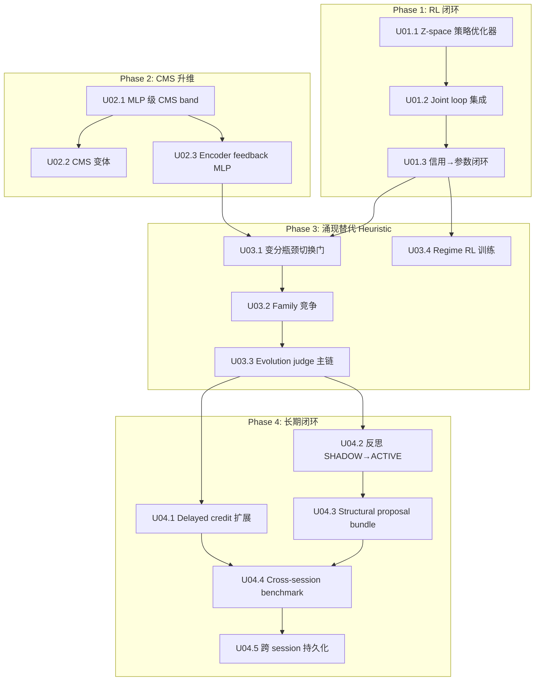

# 系统提升总计划：从骨架到涌现闭环

> Status: draft
> Last updated: 2026-04-09
> Scope: 4-phase uplift from scaffold to emergent closed-loop
> Source: `docs/implementation/03_gap_assessment_and_uplift_plan.md`, `docs/next_gen_emogpt.md`
> Prerequisite: P00–P09 收敛包已完成

## 1. 目标

本计划是 P00–P09 收敛包完成后的下一阶段系统演进总蓝图。P00–P09 建立了模块边界、快照契约、接线级别和基础能力骨架。本轮提升的目标不再是扩张模块数量，而是**让骨架真正活起来**：

- 让系统**能学习**：从"有 RL 环境但无策略优化"变为"收集→优化→评估完整闭环"
- 让系统**有容量**：从"dim=3 向量级 CMS 模拟"变为"MLP 级多时间尺度知识存储"
- 让系统**自己发现结构**：从"heuristic 驱动切换/选择/竞争"变为"变分瓶颈 + RL 驱动涌现"
- 让系统**持续进化**：从"单 session 内运行"变为"跨 session 积累、长期闭环、有增长证据"

完成本计划后，系统应处于**弱涌现闭环**状态——`next_gen_emogpt.md` 的 7 个 Acceptance Questions 全部可肯定回答。

## 2. 实施原则

### 2.1 闭环优先

每个 Phase 的核心交付是一个**闭环**，不是一组散装能力点。闭环 = 信号产生 → 信号消费 → 效果可观测 → 效果回馈到信号源。

### 2.2 Phase 门控

Phase N+1 的启动条件是 Phase N 的退出条件已满足。不允许跨 Phase 提前拉入未验证的依赖。

### 2.3 R15 迁移纪律延续

- 每个 Phase 有退出条件和回滚方案
- 新能力先以 SHADOW 模式运行，积累评估证据后再 promote
- 所有自修改路径保留 checkpoint + rollback
- 影响快照 schema 的变更必须同步更新 spec 和 `docs/DATA_CONTRACT.md`

### 2.4 改动范围约束

本计划的所有改动落在已有包（P00–P09）的内部，不新增顶层包或独立模块。Owner 边界和 slot 注册不变。

## 3. Phase 总览

```
Phase 1: RL 闭环打通        → 差距族 A → 让系统真正能学习
Phase 2: CMS 升维           → 差距族 B → 让系统有足够的学习容量
Phase 3: 涌现替代 Heuristic → 差距族 C → 让系统自己发现结构
Phase 4: 长期闭环           → 差距族 D → 让系统跨 session 持续进化
```

| Phase | 核心差距族 | 主要影响 R | 预估周期 | 前置条件 |
|-------|-----------|-----------|----------|----------|
| 1 | RL 策略优化器缺失 | R4, R9, R13, R14 | 2–3 周 | P00–P09 完成 |
| 2 | CMS 向量→MLP 跨越 | R1, R2, R5 | 2–3 周 | P00–P09 完成 |
| 3 | 涌现 vs Heuristic | R3, R10, R14 | 3–4 周 | Phase 1 + Phase 2 部分 |
| 4 | 长期闭环缺失 | R6, R9, R12 | 3–4 周 | Phase 3 |

总计约 10–14 周进入弱涌现闭环状态。

## 4. 依赖关系与并行策略



**并行窗口**：Phase 1 和 Phase 2 可完全并行推进——它们无硬依赖，分属不同代码区域（`internal_rl/` vs `memory/cms.py`）。

## 5. 收敛包与 Phase 步骤的映射

| Phase 步骤 | 主要涉及包 | 主要修改文件 |
|------------|-----------|-------------|
| U01.1 策略优化器 | P08 | `internal_rl/sandbox.py`, 新增 `internal_rl/optimizer.py` |
| U01.2 Joint loop 集成 | P09 | `joint_loop/runtime.py` |
| U01.3 信用→参数 | P06, P08 | `credit/gate.py`, `internal_rl/sandbox.py` |
| U02.1 MLP CMS | P02 | `memory/cms.py` |
| U02.2 CMS 变体 | P02 | `memory/cms.py` |
| U02.3 Encoder feedback | P02, P08 | `memory/cms.py`, `temporal/interface.py` |
| U03.1 变分瓶颈 | P08 | `temporal/metacontroller_components.py`, `temporal/ssl.py` |
| U03.2 Family 竞争 | P08 | `temporal/interface.py` |
| U03.3 Judge 主链 | P05, P09 | `evaluation/backbone.py`, `joint_loop/runtime.py` |
| U03.4 Regime RL | P04 | `regime/identity.py` |
| U04.1 Delayed credit | P06 | `credit/gate.py` |
| U04.2 反思提升 | P07, P09 | `integration/final_wiring.py`, `reflection/writeback.py` |
| U04.3 Structural proposal | P07 | `reflection/writeback.py` |
| U04.4 Cross-session benchmark | P05 | `evaluation/` 新增模块 |
| U04.5 持久化 | P02 | `memory/store.py`, 新增持久化后端 |

## 6. 子计划文档

每个 Phase 有独立的详细子计划：

```text
docs/implementation/uplift/
    U01_rl_closed_loop.md          ← Phase 1
    U02_cms_upgrade.md             ← Phase 2
    U03_emergence_over_heuristic.md ← Phase 3
    U04_long_term_loop.md          ← Phase 4
```

## 7. 子计划统一模板

每个子计划包含：

- Phase 目标与设计依据
- 涉及的 R 需求与差距族
- 前置条件与硬依赖
- 步骤分解（每步含 owner、位置、内容、约束、验收）
- 数据契约变更
- 退出条件
- 回滚触发与回滚动作
- 需同步更新的文档
- 风险与缓解

## 8. 总体验收

四个 Phase 全部完成后，系统应满足：

### 8.1 Acceptance Questions 全部肯定

| 问题 | Phase 1 后 | Phase 2 后 | Phase 3 后 | Phase 4 后 |
|------|-----------|-----------|-----------|-----------|
| 能否从稀疏延迟结果中改进？ | ✅ | ✅ | ✅ | ✅ |
| 能否学习持续多轮的策略？ | 部分 | 部分 | ✅ | ✅ |
| 能否跨 session 适应？ | 否 | 否 | 否 | ✅ |
| 能否分离关系/任务学习？ | ✅ | ✅ | ✅ | ✅ |
| 能否整合经验为持久记忆？ | 否 | 否 | 部分 | ✅ |
| 内部状态可反思/评估/回滚？ | ✅ | ✅ | ✅ | ✅ |
| 新层不破坏模块所有权？ | ✅ | ✅ | ✅ | ✅ |
| 能否显式产出 predicted outcome 并在下一轮比较 actual outcome？ | 否 | 否 | 否 | 否 |

### 8.2 成熟度提升目标

| 需求 | 当前 | Phase 1 后 | Phase 2 后 | Phase 3 后 | Phase 4 后 |
|------|------|-----------|-----------|-----------|-----------|
| R-PE 预测误差原语 | 0.0 | 0.0 | 0.0 | 0.0 | 0.0 |
| R1 多时间尺度 | 3.5 | 3.5 | 4.5 | 4.5 | 4.5 |
| R2 稳定基底 | 3.5 | 3.5 | 4.0 | 4.0 | 4.0 |
| R3 时间抽象 | 3.5 | 3.5 | 3.5 | 4.5 | 4.5 |
| R4 内部控制 | 3.0 | 4.0 | 4.0 | 4.5 | 4.5 |
| R5 记忆连续谱 | 4.0 | 4.0 | 4.5 | 4.5 | 5.0 |
| R6 反思整合 | 3.5 | 3.5 | 3.5 | 3.5 | 4.5 |
| R7 双轨分离 | 4.0 | 4.0 | 4.0 | 4.0 | 4.5 |
| R8 快照契约 | 4.5 | 4.5 | 4.5 | 4.5 | 4.5 |
| R9 层级信用 | 3.0 | 3.5 | 3.5 | 4.0 | 4.5 |
| R10 门控自修改 | 3.5 | 3.5 | 3.5 | 4.5 | 4.5 |
| R11 可命名状态 | 4.0 | 4.0 | 4.0 | 4.0 | 4.5 |
| R12 全面评估 | 3.5 | 3.5 | 3.5 | 4.0 | 4.5 |
| R13 SSL-RL 交替 | 2.5 | 4.0 | 4.0 | 4.5 | 4.5 |
| R14 Regime 身份 | 3.5 | 3.5 | 3.5 | 4.0 | 4.5 |
| R15 迁移纪律 | 4.0 | 4.0 | 4.0 | 4.0 | 4.5 |
| **平均（R1–R15）** | **4.0** | **4.1** | **4.2** | **4.3** | **4.4** |

### 8.3 系统状态标签

| 时刻 | 系统状态 |
|------|---------|
| 当前（uplift Phase 1–4 验证完成后） | 契约骨架完备，学习闭环可运行，LLM 表达层已接通，但 prediction-error-first 主通路缺失 |
| Design v2 Gap Closure / Phase PE 完成 | 系统以 prediction error 作为一级学习信号，credit/evaluation 退居下游聚合层 |
| Design v2 Gap Closure / Phase RF 完成 | 反思 SHADOW→ACTIVE 提升条件接入主循环，可运行时观察 |
| Design v2 Gap Closure / 全部完成 | 设计 v2 与代码主链一致，uplift 文档与 maturity 口径同步 |

## 9. 风险总览

| 风险 | 级别 | 关联 Phase | 缓解 |
|------|------|-----------|------|
| RL 优化器引入策略崩溃 | 高 | 1 | clip ratio + checkpoint 频繁保存 + auto rollback |
| CMS MLP 化后在线延迟超标 | 中 | 2 | 轻量 MLP（<10K params/band）+ 性能预算 |
| 变分瓶颈 α 调参不收敛 | 中 | 3 | 从大 α 开始降低 + 保留 heuristic fallback |
| 涌现行为不如 heuristic 稳定 | 中高 | 3 | 先 SHADOW + A/B 对比 + fallback 开关 |
| 跨 session 持久化兼容性问题 | 中 | 4 | 版本化 checkpoint + 降级回内存模式 |
| 反思 ACTIVE 后写回错误积累 | 中 | 4 | proposal-only 先行 + replay benchmark 验证 |

## 10. 与现有文档的关系

| 文档 | 关系 |
|------|------|
| `00_master_plan.md` | 本计划是其自然续篇——P00–P09 是建设期，本计划是激活期 |
| `01_package_registry.md` | 本计划的改动在已有包内部，不新增包，不改 owner/slot |
| `02_eta_nl_next_stage.md` | 本计划的 Phase 3–4 覆盖其 Phase A–E，并前置解决 RL 闭环和 CMS 容量 |
| `03_gap_assessment_and_uplift_plan.md` | 本计划的源评估文档，差距族定义和提升路线的出处 |
| `05_design_v2_upgrade_plan.md` | `next_gen_emogpt.md` v2 重写后的对齐方案：补齐 R-PE、反思提升主链、文档一致性和残差干预验证 |
| `packages/P00–P09` | 每个 Phase 步骤标注了涉及的包，具体变更在子计划中展开 |
| `docs/specs/*.md` | 每个 Phase 完成后需同步更新的 spec 在子计划中列出 |

## 11. 文档维护规则

- 本计划只维护跨 Phase 结构，不记录 Phase 内实现细节
- Phase 内细节由各子计划 `U01`–`U04` 负责
- 如果某步骤调整 owner、slot、schema，必须先改对应 spec，再更新子计划
- Phase 完成后在本文档标注完成日期和实际成熟度评分

## 12. 参考文档

- [`docs/next_gen_emogpt.md`](../next_gen_emogpt.md) — R1–R15 设计源头
- [`docs/implementation/03_gap_assessment_and_uplift_plan.md`](./03_gap_assessment_and_uplift_plan.md) — 差距评估
- [`docs/implementation/02_eta_nl_next_stage.md`](./02_eta_nl_next_stage.md) — ETA/NL 演进路线
- [`docs/implementation/00_master_plan.md`](./00_master_plan.md) — P00–P09 建设计划
- [`docs/specs/00_INDEX.md`](../specs/00_INDEX.md) — 能力域索引
