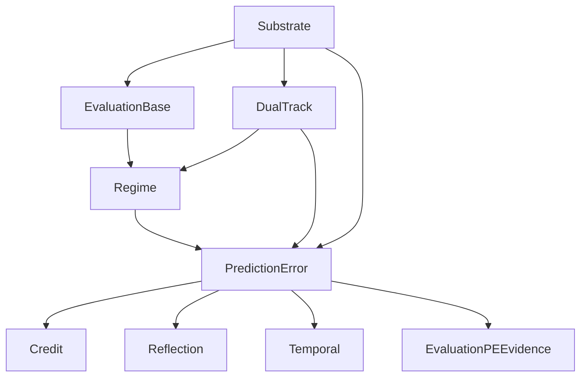

# Prediction-Error-First Cognitive Loop 升级结果

> Status: draft
> Last updated: 2026-04-19
> Scope: promote prediction error from auxiliary signal to primary learning primitive

## 目标

把系统从：

- `credit` / `evaluation` 主导的学习与归因结构

推进到：

- `prediction_error` 作为一级学习信号
- `credit` / `evaluation` 退居下游读数与聚合层

## 已落地内容

### 1. 主链显式 prediction chain

主链每轮 turn 现在显式产出：

- `evaluated_prediction`
- `actual_outcome`
- `next_prediction`
- `prediction_error`

并通过：

- `PredictionErrorSnapshot`
- `AgentTurnResult`
- `FinalIntegrationResult`

发布到运行时链路。

### 2. Credit 已切到 PE-first

`volvence_zero.credit.gate` 中：

- `derive_credit_records_from_prediction_error_first()` 成为主路径
- `prediction_error` 级 credit record 优先于 evaluation readout

### 3. Evaluation 已接入 prediction-error evidence

`volvence_zero.evaluation.backbone` 中新增：

- `record_prediction_error_evidence()`
- `_prediction_error_scores()`

发布的关键读数包括：

- `prediction_error_magnitude`
- `prediction_error_reward`
- `predictive_accuracy`
- `task_prediction_alignment`
- `relationship_prediction_alignment`
- `action_prediction_alignment`
- `primary_prediction_error`

### 4. Reflection 已接入 PE

`volvence_zero.reflection.writeback` 已把 `prediction_error_snapshot` 作为正式输入，参与：

- consolidation score
- tensions
- lessons
- policy consolidation
- memory consolidation

### 5. Regime 已接入 PE

`volvence_zero.regime.identity` 现在不仅用 PE 更新：

- `_update_historical_effectiveness()`
- `_record_turn_score()`

还在 `score_regimes()` 中直接使用 PE 维度偏差来影响 regime 选择。

### 6. Temporal 已接入 PE

`volvence_zero.temporal.interface` 中：

- `TemporalModule.dependencies` 增加 `prediction_error`
- `TemporalModule._apply_prediction_error_signal()` 会根据 task / relationship / regime / action 的误差强度，
  通过 owner-side `fit_from_signals()` 直接调制 temporal controller 权重

### 7. Memory 已接入 PE

`volvence_zero.memory.store` 中：

- `MemoryModule.dependencies` 增加 `prediction_error`
- `MemoryStore.apply_prediction_error_signal()` 成为 owner-side PE 写入入口

它现在会：

- 直接写入 `prediction_error:*` 记忆事件
- 根据 task / relationship / regime / action 的主导误差维度调整 promotion threshold
- 把 prediction error 维度纳入 retrieval query facets

## 主链结构

## 测试结果

- 全量测试：`309 passed`
- 相关新增测试：
  - `test_temporal_module_consumes_prediction_error_signal`
  - `test_score_regimes_uses_prediction_error_bias`
  - `test_final_wiring_exposes_prediction_error_and_reflection_promotion_fields`
  - `test_memory_store_applies_prediction_error_signal`
  - `test_memory_module_consumes_prediction_error_snapshot`

## 当前状态判断

系统已经从：

- “prediction error 存在，但不是主导信号”

推进到：

- “prediction error 已进入主链，并成为 credit / evaluation / reflection / regime / temporal / memory 的显式一级驱动”

## 仍未完成的部分

虽然主通路已经接上，但还未完全达到最终目标：

1. `PredictionErrorModule` 仍依赖 base evaluation / dual-track / regime 作为输入，而不是更强的世界模型层
2. `joint_loop` 还没有完全围绕 PE 做训练日程编排，只是通过 `prediction_error_reward` 接入外部信号
3. memory 虽然已 PE-first 接入，但 durable compression / forgetting policy 仍未完全由 PE 统一调度
## 相关文件

- `volvence_zero/prediction/error.py`
- `volvence_zero/credit/gate.py`
- `volvence_zero/evaluation/backbone.py`
- `volvence_zero/memory/store.py`
- `volvence_zero/regime/identity.py`
- `volvence_zero/temporal/interface.py`
- `volvence_zero/integration/final_wiring.py`
