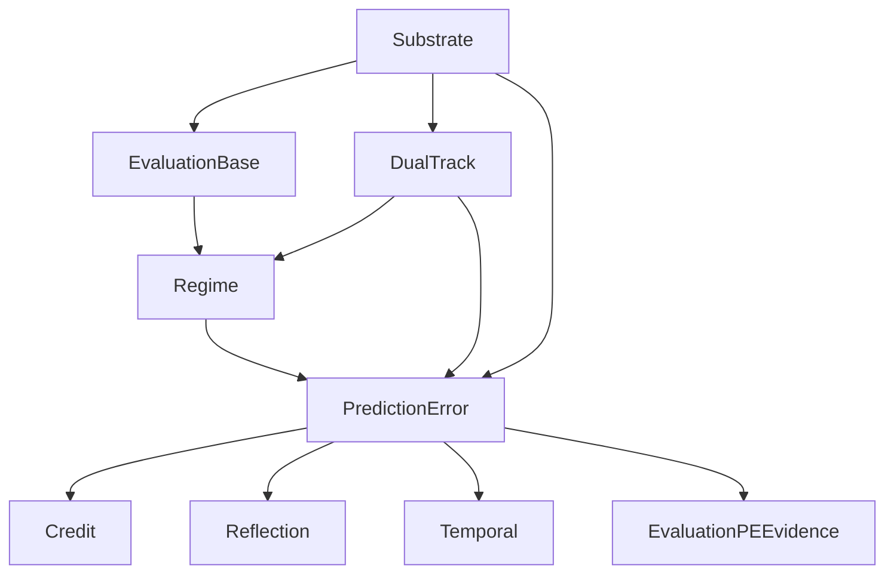

# Prediction-Error-First Cognitive Loop 升级结果

> Status: draft
> Last updated: 2026-04-19
> Scope: promote prediction error from auxiliary signal to primary learning primitive

## 目标

把系统从：

- `credit` / `evaluation` 主导的学习与归因结构

推进到：

- `prediction_error` 作为一级学习信号
- `credit` / `evaluation` 退居下游读数与聚合层

## 已落地内容

### 1. 主链显式 prediction chain

主链每轮 turn 现在显式产出：

- `evaluated_prediction`
- `actual_outcome`
- `next_prediction`
- `prediction_error`

并通过：

- `PredictionErrorSnapshot`
- `AgentTurnResult`
- `FinalIntegrationResult`

发布到运行时链路。

### 2. Credit 已切到 PE-first

`volvence_zero.credit.gate` 中：

- `derive_credit_records_from_prediction_error_first()` 成为主路径
- `prediction_error` 级 credit record 优先于 evaluation readout

### 3. Evaluation 已接入 prediction-error evidence

`volvence_zero.evaluation.backbone` 中新增：

- `record_prediction_error_evidence()`
- `_prediction_error_scores()`

发布的关键读数包括：

- `prediction_error_magnitude`
- `prediction_error_reward`
- `predictive_accuracy`
- `task_prediction_alignment`
- `relationship_prediction_alignment`
- `action_prediction_alignment`
- `primary_prediction_error`

### 4. Reflection 已接入 PE

`volvence_zero.reflection.writeback` 已把 `prediction_error_snapshot` 作为正式输入，参与：

- consolidation score
- tensions
- lessons
- policy consolidation
- memory consolidation

### 5. Regime 已接入 PE

`volvence_zero.regime.identity` 现在不仅用 PE 更新：

- `_update_historical_effectiveness()`
- `_record_turn_score()`

还在 `score_regimes()` 中直接使用 PE 维度偏差来影响 regime 选择。

### 6. Temporal 已接入 PE

`volvence_zero.temporal.interface` 中：

- `TemporalModule.dependencies` 增加 `prediction_error`
- `TemporalModule._apply_prediction_error_signal()` 会根据 task / relationship / regime / action 的误差强度，
  通过 owner-side `fit_from_signals()` 直接调制 temporal controller 权重

### 7. Memory 已接入 PE

`volvence_zero.memory.store` 中：

- `MemoryModule.dependencies` 增加 `prediction_error`
- `MemoryStore.apply_prediction_error_signal()` 成为 owner-side PE 写入入口

它现在会：

- 直接写入 `prediction_error:*` 记忆事件
- 根据 task / relationship / regime / action 的主导误差维度调整 promotion threshold
- 把 prediction error 维度纳入 retrieval query facets

### 8. Joint Loop 已接入 PE scheduling

`volvence_zero.joint_loop.runtime` 中：

- `JointLoopSchedule` 新增 `pe_full_cycle_threshold` / `pe_ssl_threshold` / `pe_rare_heavy_threshold`
- `run_scheduled_step()` 会优先根据 prediction error 决定 `full-cycle-pe` / `ssl-only-pe`
- `schedule_telemetry` 会显式发布 `pe_full_cycle_due` / `pe_ssl_due` / `pe_rare_heavy_due`
- `JointCycleReport` 与 `ScheduledJointLoopResult` 会显式标记 `rare_heavy_review_recommended`

### 9. Session owner 已接入 bounded rare-heavy execution

`volvence_zero.agent.session` 中：

- `AgentSessionRunner` 会维护最近 trace window，并在高 PE 持续时触发 bounded rare-heavy review
- rare-heavy offline owner 使用克隆出的 temporal snapshot / memory checkpoint 跑 `SSLRLTrainingPipeline`
- 当 offline pipeline 至少完成 1 个 RL step 时，session owner 会通过 `apply_rare_heavy_artifact()` 把 artifact 导回 online owner
- import 仍严格经过 owner-side surface，不直接越权改 online temporal / memory 内部状态

### 10. Dialogue benchmark 已接入 PE-ETA proof harness

`volvence_zero.agent.dialogue_benchmark` 中新增：

- `ScriptedDialogueCase`
- `DialogueBenchmarkTurn`
- `DialogueBenchmarkCaseReport`
- `DialogueBenchmarkReport`
- `DialogueBenchmarkPathReport`
- `DialogueBenchmarkComparisonReport`
- `run_dialogue_pe_eta_case()`
- `run_dialogue_pe_eta_benchmark()`
- `run_dialogue_pe_eta_ablation_benchmark()`

它会围绕固定 scripted dialogue cases 显式记录：

- prediction error 轨迹
- `joint_schedule_action` / `active_abstract_action` / `active_regime` / `switch_gate`
- rare-heavy recommendation / import
- delayed outcome readout

并基于这些证据输出最小 proof verdict，而不再只看 aggregate substrate metrics。

### 11. Dialogue benchmark 已接入弱 A/B baselines

当前内置 profiles：

- `pe-eta`
- `eta-no-pe`
- `heuristic-baseline`

用于比较 case-level summary metrics（如 `passed`、`pe_triggered_turn_count`、`temporal_change_count`、`delayed_improvement_observed`、`mean_prediction_error`、`mean_switch_gate`），作为 dialogue proof harness 的下一层证据。当前 `eta-no-pe` 已升级为严格 baseline，不再因为普通 interval update 吃到 PE-trigger credit。

### 12. Dialogue benchmark 已接入定量 response 指标

当前 `DialogueBenchmarkCaseReport` 已新增：

- `recovery_lag_turns`
- `pressure_localization_score`
- `pressure_response_precision`
- `pressure_response_recall`
- `over_response_cost`
- `stability_after_recovery_score`

它们分别回答：

- 系统在 pressure 出现后多少轮才开始给出有效 temporal response
- 系统的 response 有多少比例落在 pressure window（pressure turn 及其后一轮）内

### 13. Dialogue proof gate 已与 runtime 阈值对齐

`volvence_zero.agent.dialogue_benchmark` 中：

- case-level `high_pe_threshold` 已从早期过高的 proof gate 下调到 `0.18`
- `reward_threshold` 已下调到 `0.05`
- delayed improvement 判定不再被 bootstrap 零误差 turn 主导
- `repair` / `task_clarification` / `repeated_failure` / `goal_drift` 的 scripted cases 已增强前段压力和后段修复/对齐信号
- `pe_triggered_temporal_response` 已改为跨轮因果语义：上一轮 high PE 触发下一轮 `*-pe` 或非 `evidence-only` controller update，也会被计入 proof verdict

这样 benchmark 不再把已经真实出现的 `ssl-only-pe` 错判为“没有 high PE / 没有 PE-triggered response”。

## 主链结构

## 测试结果

本轮 targeted regressions：

- `python -m pytest tests/test_dialogue_benchmark.py -q`
- `python -m pytest tests/test_agent_session_runner.py -q -k "rare_heavy or pe_scheduled or multi_turn_rl_loop_produces_policy_changes or run_substrate_path_benchmark_collects_turn_metrics"`

最近一次真实 single-path benchmark：

- `run_dialogue_pe_eta_benchmark()`：`4` 个 scripted cases 中 `4` 个通过当前 PE-ETA evidence gate
- `goal_drift` 已通过当前 evidence gate，不再是唯一残留失败 case

最近一次真实 three-path ablation benchmark：

- `pe-eta`：`4/4` passed
- `eta-no-pe`：`0/4` passed
- `heuristic-baseline`：`0/4` passed

定量指标上：

- `repair` / `task_clarification` / `repeated_failure`
  - `pe-eta`: `recovery_lag = 2`, `pressure_localization = 0.5`
  - `eta-no-pe`: `recovery_lag = 6`, `pressure_localization = 0.0`
- `goal_drift`
  - `pe-eta`: `recovery_lag = 1`, `pressure_localization = 1.0`
  - `eta-no-pe`: `recovery_lag = 5`, `pressure_localization = 0.0`

进一步的 response quality 指标上：

- `repair` / `task_clarification`
  - `pe-eta`: `precision = 0.5`, `recall = 0.667`, `over_response = 0.167`, `stability_after_recovery = 0.333`
  - `eta-no-pe`: `precision = 0.0`, `recall = 0.0`, `over_response = 0.0`, `stability_after_recovery = 0.0`
- `repeated_failure`
  - `pe-eta`: `precision = 0.5`, `recall = 0.5`, `over_response = 0.167`, `stability_after_recovery = 0.0`
  - `eta-no-pe`: `precision = 0.0`, `recall = 0.0`, `over_response = 0.0`, `stability_after_recovery = 0.0`
- `goal_drift`
  - `pe-eta`: `precision = 1.0`, `recall = 1.0`, `over_response = 0.0`, `stability_after_recovery = 0.5`
  - `eta-no-pe`: `precision = 0.0`, `recall = 0.0`, `over_response = 0.0`, `stability_after_recovery = 0.0`

相关新增测试：

- `test_eta_nl_joint_loop_pe_schedules_full_cycle`
- `test_eta_nl_joint_loop_pe_schedules_ssl_only`
- `test_eta_nl_joint_loop_flags_rare_heavy_review_on_high_pe`
- `test_agent_session_runner_executes_rare_heavy_import_when_high_pe_persists`
- `test_pe_scheduled_session_turns_still_emit_learning_scores`
- `test_dialogue_benchmark_exposes_default_scripted_cases`
- `test_dialogue_benchmark_exposes_default_ablation_profiles`
- `test_run_dialogue_pe_eta_case_collects_pe_and_eta_trajectories`
- `test_run_dialogue_pe_eta_benchmark_runs_complete_scripted_suite`
- `test_run_dialogue_pe_eta_ablation_benchmark_collects_path_deltas`
- `test_dialogue_case_report_flags_missing_pe_and_temporal_change`
- `test_dialogue_case_report_passes_when_pe_drives_temporal_and_delayed_change`
- `test_dialogue_case_report_counts_cross_turn_pe_trigger`
- `test_dialogue_case_report_counts_cross_turn_full_cycle_after_high_pe`
- `test_goal_drift_case_no_longer_fails_pe_trigger_check_with_synthetic_runner`
- `test_dialogue_case_report_quantifies_recovery_lag_and_pressure_localization`
- `test_eta_no_pe_baseline_does_not_receive_interval_carryover_credit`

## 当前状态判断

系统已经从：

- “prediction error 存在，但不是主导信号”

推进到：

- “prediction error 已进入主链，并成为 credit / evaluation / reflection / regime / temporal / memory 的显式一级驱动”
- “prediction error 已进入主链，并开始直接驱动 joint_loop 的训练日程选择，以及 session owner 上的 bounded rare-heavy import 闭环”
- “prediction error 已有一个专门的 dialogue proof harness，用于检查 PE 和 temporal abstraction 的时序耦合与后段改善”
- “prediction error 已开始进入 dialogue-level 弱 A/B 基线比较，而不只剩单路径自证”
- “dialogue proof harness 已经从完全看不见 PE 路径，推进到当前 4 个默认 scripted cases 全部可通过当前 evidence gate”
- “在当前严格版 dialogue A/B baseline 下，`pe-eta` 已经能和 `eta-no-pe` / `heuristic-baseline` 拉开”
- “benchmark 现在不只给 pass/fail，还能定量说明 `pe-eta` 响应得更早、更贴近 pressure window”
- “benchmark 现在还能显示 `pe-eta` 为了换取更高 recall 和更低 lag 所付出的额外 response cost，以及恢复后能否真正稳定下来”

## 仍未完成的部分

虽然主通路已经接上，但还未完全达到最终目标：

1. `PredictionErrorModule` 仍依赖 base evaluation / dual-track / regime 作为输入，而不是更强的世界模型层
2. 当前 `eta-no-pe` 已是更严格 baseline，但仍然不是更彻底的 PE-off / ETA-off 因果隔离实现
3. rare-heavy 已接上 bounded offline import，但还没有进一步扩展成更强的 artifact acceptance benchmark / multi-artifact selection
4. 生成式用户模拟器与 replay ranking 仍未接入 dialogue harness
5. memory 虽然已 PE-first 接入，但 durable compression / forgetting policy 仍未完全由 PE 统一调度
## 相关文件

- `volvence_zero/prediction/error.py`
- `volvence_zero/credit/gate.py`
- `volvence_zero/evaluation/backbone.py`
- `volvence_zero/memory/store.py`
- `volvence_zero/regime/identity.py`
- `volvence_zero/temporal/interface.py`
- `volvence_zero/integration/final_wiring.py`
- `volvence_zero/agent/dialogue_benchmark.py`
