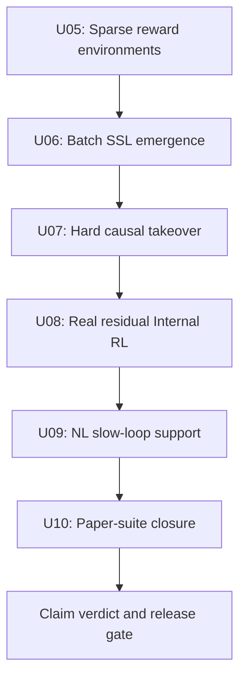

# ETA/NL Paper-Grade Uplift Plan

> Status: draft
> Last updated: 2026-04-25
> Scope: staged uplift from repo-native ETA/NL proof surfaces to paper-grade evidence discipline
> Sources: `docs/papers/2512.20605.txt`, `docs/papers/2512.24695.txt`, `docs/next_gen_emogpt.md`

## Goal

Move the current ETA/NL implementation from **proof-grade scaffolding** to a stricter **paper-grade uplift path**.

This plan does not claim the repo already fully reproduces the papers. It defines the staged work required before stronger claims are allowed:

- scaffold-free temporal abstraction
- harder sparse-reward environments
- batch self-supervised discovery of latent temporal structure
- hard non-causal to causal takeover
- real open-weight residual Internal RL
- NL slow-loop support for ETA learning
- repeated-run paper-suite closure with fail-closed claim verdicts

## Current Baseline

The repo already has meaningful ETA/NL machinery:

- `volvence_zero/temporal/ssl.py` implements an Eq.3-style metacontroller SSL trainer with non-causal posterior enrichment, KL reporting, and M3 optimizer signals.
- `volvence_zero/internal_rl/sandbox.py` implements causal z-policy rollout, lightweight critic state, PPO-like updates, proof-mode delayed returns, and causal replacement paths.
- `volvence_zero/internal_rl/proof_environment.py` provides a miniature hierarchical route environment.
- `volvence_zero/agent/eta_proof_benchmark.py` provides matched controls, acceptance gates, paper-suite manifests, and open-weight residual benchmark entrypoints.
- `volvence_zero/memory/cms.py` and `volvence_zero/memory/store.py` provide nested CMS, cadence-gated updates, learned update decisions, slow-to-fast reset, and runtime evidence surfaces.
- `volvence_zero/joint_loop/runtime.py` and `volvence_zero/joint_loop/pipeline.py` implement online SSL/RL alternation and rare-heavy offline artifact paths.

The remaining gap is not naming or contracts. The gap is **mechanism strength and empirical closure**:

- temporal families must remain stable after semantic/scaffold ablations
- `beta_t` sparsity must be driven by bottleneck pressure rather than hand-shaped thresholds
- Internal RL must win in sparse-reward settings with real residual interventions
- causal takeover must be a blocking transition, not only telemetry
- NL slow loops must measurably improve ETA fast-path initialization and held-out payoff
- claims must be bound to repeated seeds, artifacts, matched controls, and provenance

## Immediate Guardrail

Do not start the implementation stages on a red baseline without explicitly quarantining failures.

Before claiming any U05-U10 evidence, re-run the relevant baseline and record its status in the stage artifact:

- `ci-smoke` may use targeted ETA/NL tests, but must name the exact test selection and known quarantines.
- `paper-suite-small` and `paper-suite-full` must fail closed if required benchmark artifacts, repeated-run summaries, or backend provenance are missing.
- If an unrelated area is red, the stage may proceed only when the failure is explicitly quarantined from claim evidence and cannot affect the metrics being reported.

Historical one-off pytest failures should not remain as permanent design facts in this plan; the executable baseline for each stage is the latest recorded test and artifact bundle.

## Stage Graph

## Stage Documents

| Stage | Document | Purpose |
|---|---|---|
| U05 | `docs/implementation/uplift/U05_sparse_reward_environment.md` | Create harder sparse-reward task families and reward taxonomy |
| U06 | `docs/implementation/uplift/U06_batch_ssl_emergent_abstractions.md` | Move temporal abstraction discovery from scaffolded proof learner to batch SSL |
| U07 | `docs/implementation/uplift/U07_hard_causal_takeover.md` | Make non-causal to causal transition a blocking gate |
| U08 | `docs/implementation/uplift/U08_real_residual_internal_rl.md` | Prove z-space Internal RL in real open-weight residual-control environments |
| U09 | `docs/implementation/uplift/U09_nl_slow_loop_support.md` | Tie CMS, rare-heavy, and long-horizon credit directly to ETA improvement |
| U10 | `docs/implementation/uplift/U10_paper_suite_closure.md` | Freeze claim registry, repeated-run evidence, and paper-suite release gates |

## Claim Boundaries

This plan separates four claim levels:

1. **Engineering proof**
   - Modules exist, contracts hold, proof harness runs, and metrics are emitted.
2. **Mechanism evidence**
   - Matched controls show the mechanism matters, not only surrounding scaffolding.
3. **Real residual evidence**
   - `transformers-open-weight` residual capture/intervention contributes to outcomes with low fallback and reported hook coverage.
4. **Paper-grade release claim**
   - Repeated seeds, held-out environments, pairwise effect intervals, provenance, and artifact bundles support a fail-closed verdict.

No release note, external writeup, or spec should call the system paper-grade unless U10 has produced a retained claim verdict for the relevant claim.

## Non-Goals

- Do not mutate the live foundation substrate by default.
- Do not count dense reward shaping as sparse-reward success.
- Do not treat product semantic labels as evidence of latent family emergence.
- Do not merge dialogue PE evidence with ETA Internal RL evidence without separate claim labels.
- Do not accept synthetic backend success as real residual-control evidence.

## Cross-References

- `docs/implementation/11_eta_internal_rl_strong_proof_harness.md`
- `docs/implementation/10_pe_eta_dialogue_benchmark_harness.md`
- `docs/implementation/04_uplift_master_plan.md`
- `docs/specs/temporal-abstraction.md`
- `docs/specs/multi-timescale-learning.md`
- `docs/specs/continuum-memory.md`
- `docs/specs/evidence_program.md`

## Completion Criteria

The program is complete only when:

- U05-U10 each have executable implementation tasks, evidence gates, and rollback boundaries
- `full-internal-rl` beats the best competing control in sparse-reward held-out settings
- scaffold ablations retain latent family and switch behavior above threshold
- real open-weight residual evidence is present for real residual-control claims
- NL slow-loop support improves fast-path ETA behavior against non-nested controls
- paper-suite full tier exports artifacts, pairwise effects, claim verdicts, and provenance
